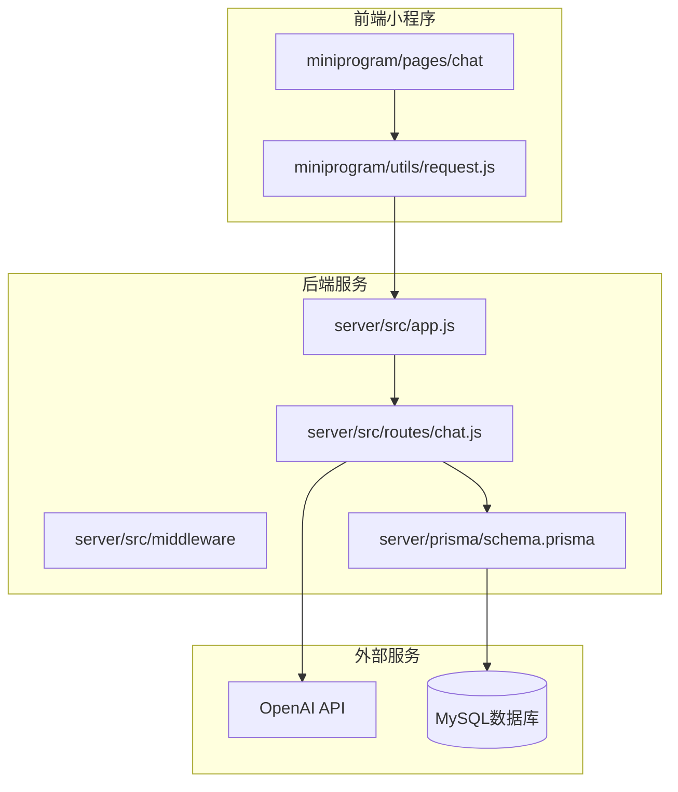
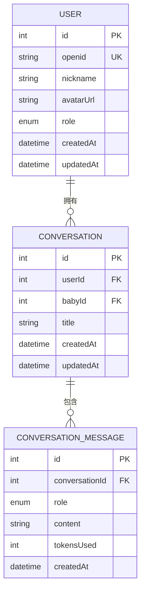
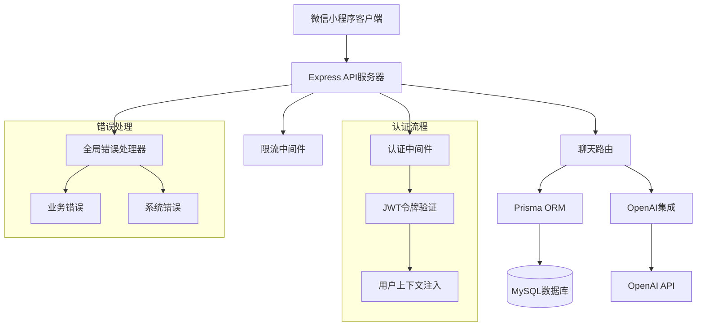
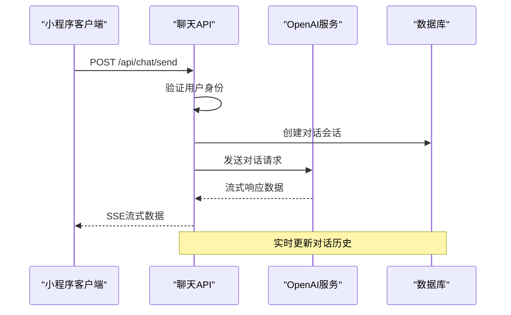
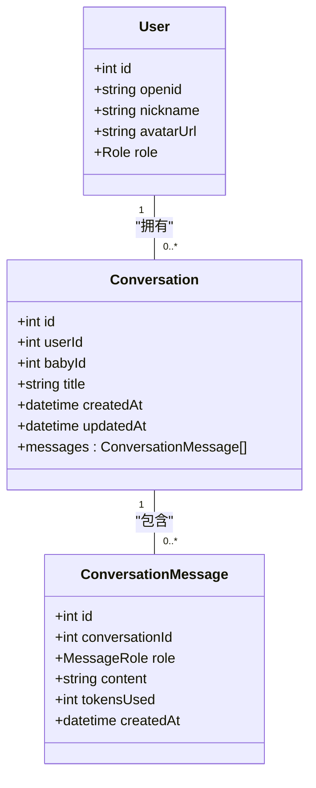
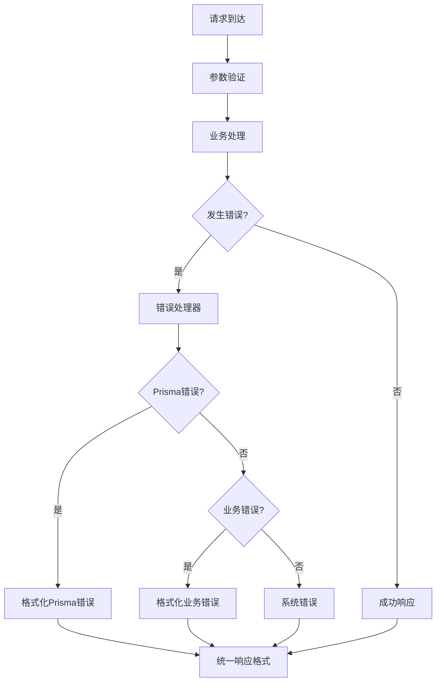
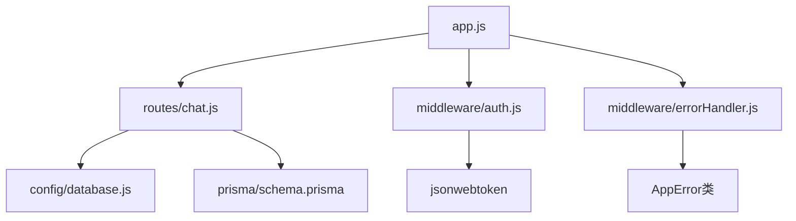

# AI聊天接口

<cite>
**本文档引用的文件**
- [server/src/routes/chat.js](file://server/src/routes/chat.js)
- [server/src/app.js](file://server/src/app.js)
- [server/prisma/schema.prisma](file://server/prisma/schema.prisma)
- [server/src/middleware/errorHandler.js](file://server/src/middleware/errorHandler.js)
- [server/package.json](file://server/package.json)
- [miniprogram/utils/request.js](file://miniprogram/utils/request.js)
</cite>

## 目录
1. [简介](#简介)
2. [项目结构](#项目结构)
3. [核心组件](#核心组件)
4. [架构概览](#架构概览)
5. [详细组件分析](#详细组件分析)
6. [依赖关系分析](#依赖关系分析)
7. [性能考虑](#性能考虑)
8. [故障排除指南](#故障排除指南)
9. [结论](#结论)

## 简介

本文件为安心育儿小程序的AI聊天助手模块创建完整的API文档。该模块基于Express.js构建，采用Prisma ORM进行数据库操作，集成了OpenAI API以提供智能对话能力。系统支持实时对话接口、SSE流式响应、对话历史管理以及消息持久化机制。

当前版本实现了基础的聊天路由框架，AI对话功能标记为Sprint 4开发计划。系统具备完整的用户认证中间件、全局错误处理和限流保护机制。

## 项目结构

安心育儿小程序采用前后端分离架构，后端使用Node.js + Express.js + Prisma，前端使用微信小程序框架。



**图表来源**
- [server/src/app.js:1-65](file://server/src/app.js#L1-L65)
- [server/src/routes/chat.js:1-57](file://server/src/routes/chat.js#L1-L57)
- [server/prisma/schema.prisma:1-189](file://server/prisma/schema.prisma#L1-L189)

**章节来源**
- [server/src/app.js:1-65](file://server/src/app.js#L1-L65)
- [server/src/routes/chat.js:1-57](file://server/src/routes/chat.js#L1-L57)

## 核心组件

### 路由层组件

系统的核心路由位于`server/src/routes/chat.js`，包含以下主要接口：

1. **POST /api/chat/send** - AI对话接口（待实现）
2. **GET /api/chat/conversations** - 获取对话列表
3. **GET /api/chat/conversations/:id** - 获取对话详情
4. **DELETE /api/chat/conversations/:id** - 删除对话

### 数据模型组件

基于Prisma的数据库模型设计，支持完整的对话管理系统：



**图表来源**
- [server/prisma/schema.prisma:106-142](file://server/prisma/schema.prisma#L106-L142)

### 中间件组件

系统采用多层中间件架构：
- **认证中间件**：用户身份验证和权限控制
- **全局错误处理**：统一错误格式化和响应
- **限流中间件**：防止API滥用和DDoS攻击

**章节来源**
- [server/src/routes/chat.js:1-57](file://server/src/routes/chat.js#L1-L57)
- [server/prisma/schema.prisma:106-142](file://server/prisma/schema.prisma#L106-L142)
- [server/src/middleware/errorHandler.js:1-52](file://server/src/middleware/errorHandler.js#L1-L52)

## 架构概览

系统采用分层架构设计，确保关注点分离和代码可维护性。



**图表来源**
- [server/src/app.js:32-55](file://server/src/app.js#L32-L55)
- [server/src/middleware/errorHandler.js:6-39](file://server/src/middleware/errorHandler.js#L6-L39)

## 详细组件分析

### 聊天路由组件

#### POST /api/chat/send - AI对话接口

**当前状态**：接口已定义但功能待实现
**设计目标**：支持SSE流式响应，实现实时对话体验



**图表来源**
- [server/src/routes/chat.js:5-12](file://server/src/routes/chat.js#L5-L12)

#### GET /api/chat/conversations - 对话列表

**功能描述**：获取用户的对话历史列表
**查询条件**：基于用户ID过滤，按更新时间倒序排列
**返回限制**：最多返回20条最近对话

#### GET /api/chat/conversations/:id - 对话详情

**功能描述**：获取指定对话的完整历史
**包含内容**：对话基本信息和按时间顺序排列的消息列表
**权限控制**：仅允许访问当前用户拥有的对话

#### DELETE /api/chat/conversations/:id - 删除对话

**功能描述**：删除指定的对话记录
**级联操作**：同时删除关联的所有消息记录

**章节来源**
- [server/src/routes/chat.js:14-54](file://server/src/routes/chat.js#L14-L54)

### 数据持久化机制

#### 对话模型设计

系统采用两级数据模型设计，支持完整的对话生命周期管理：

1. **Conversation模型**：存储对话元数据
   - 用户ID关联
   - 宝宝ID关联  
   - 对话标题
   - 创建和更新时间戳

2. **ConversationMessage模型**：存储对话消息
   - 角色标识（用户、AI助手、系统）
   - 消息内容
   - Token使用量统计
   - 时间戳记录

#### 关系映射



**图表来源**
- [server/prisma/schema.prisma:106-142](file://server/prisma/schema.prisma#L106-L142)

**章节来源**
- [server/prisma/schema.prisma:106-142](file://server/prisma/schema.prisma#L106-L142)

### 错误处理与重试机制

#### 全局错误处理器

系统实现了统一的错误处理机制，支持多种错误类型：



**图表来源**
- [server/src/middleware/errorHandler.js:6-39](file://server/src/middleware/errorHandler.js#L6-L39)

#### 错误类型分类

1. **Prisma特定错误**：如唯一约束冲突、记录不存在等
2. **业务逻辑错误**：自定义业务异常
3. **系统未知错误**：服务器内部错误

**章节来源**
- [server/src/middleware/errorHandler.js:1-52](file://server/src/middleware/errorHandler.js#L1-L52)

## 依赖关系分析

### 外部依赖

系统依赖以下关键外部组件：

```mermaid
graph LR
subgraph "核心依赖"
Express[express ^4.21.0]
Prisma[@prisma/client ^5.22.0]
OpenAI[openai ^4.73.0]
Redis[redis ^4.7.0]
end
subgraph "辅助依赖"
CORS[cors ^2.8.5]
JWT[jsonwebtoken ^9.0.2]
RateLimit[express-rate-limit ^7.4.0]
Dotenv[dotenv ^16.4.7]
end
subgraph "开发依赖"
Nodemon[nodemon ^3.1.7]
PrismaDev[prisma ^5.22.0]
end
```

**图表来源**
- [server/package.json:14-29](file://server/package.json#L14-L29)

### 内部模块依赖



**图表来源**
- [server/src/app.js:32-47](file://server/src/app.js#L32-L47)

**章节来源**
- [server/package.json:14-31](file://server/package.json#L14-L31)

## 性能考虑

### 限流策略

系统实现了基于IP地址的请求限流机制：
- **窗口大小**：60秒
- **最大请求数**：60次/分钟
- **响应格式**：统一的错误响应格式

### 数据库优化

1. **索引设计**：在用户ID和宝宝ID组合上建立索引
2. **查询优化**：限制返回记录数量，使用适当的排序
3. **连接池**：Prisma自动管理数据库连接

### 缓存策略

建议在生产环境中引入Redis缓存：
- **会话缓存**：缓存活跃对话状态
- **用户偏好**：缓存用户设置和偏好
- **API响应**：缓存不经常变化的数据

## 故障排除指南

### 常见问题诊断

#### 1. 认证失败
**症状**：返回401状态码
**原因**：JWT令牌过期或无效
**解决方案**：重新登录获取新令牌

#### 2. 数据库连接问题
**症状**：Prisma查询失败
**原因**：数据库URL配置错误或连接池耗尽
**解决方案**：检查环境变量配置

#### 3. API限流触发
**症状**：返回429状态码
**原因**：请求频率超过限制
**解决方案**：降低请求频率或增加等待时间

#### 4. OpenAI集成问题
**症状**：AI对话功能不可用
**原因**：API密钥配置错误或网络问题
**解决方案**：检查OpenAI API密钥和网络连接

### 调试工具

1. **健康检查**：`GET /api/health`
2. **数据库模式**：使用Prisma Studio查看数据模型
3. **日志监控**：查看服务器控制台输出

**章节来源**
- [server/src/app.js:28-30](file://server/src/app.js#L28-L30)
- [server/src/middleware/errorHandler.js:6-39](file://server/src/middleware/errorHandler.js#L6-L39)

## 结论

安心育儿小程序的AI聊天接口模块展现了良好的架构设计和扩展性。虽然AI对话的SSE流式响应功能仍在开发中，但系统已经具备了完整的基础设施：

1. **完善的路由设计**：清晰的RESTful API接口
2. **强大的数据模型**：支持复杂的对话管理需求
3. **健壮的错误处理**：统一的错误处理机制
4. **安全的认证体系**：基于JWT的用户认证
5. **可扩展的架构**：易于添加新功能和第三方集成

未来开发重点应放在实现SSE流式响应、优化OpenAI集成和增强对话管理功能上。通过合理的性能优化和监控机制，该模块能够为用户提供优质的AI聊天体验。