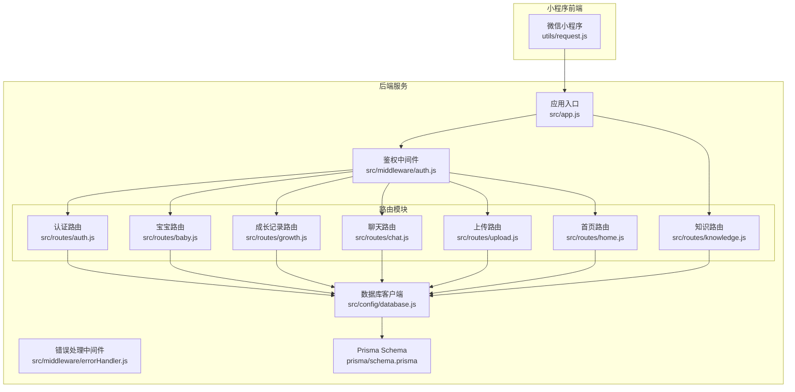
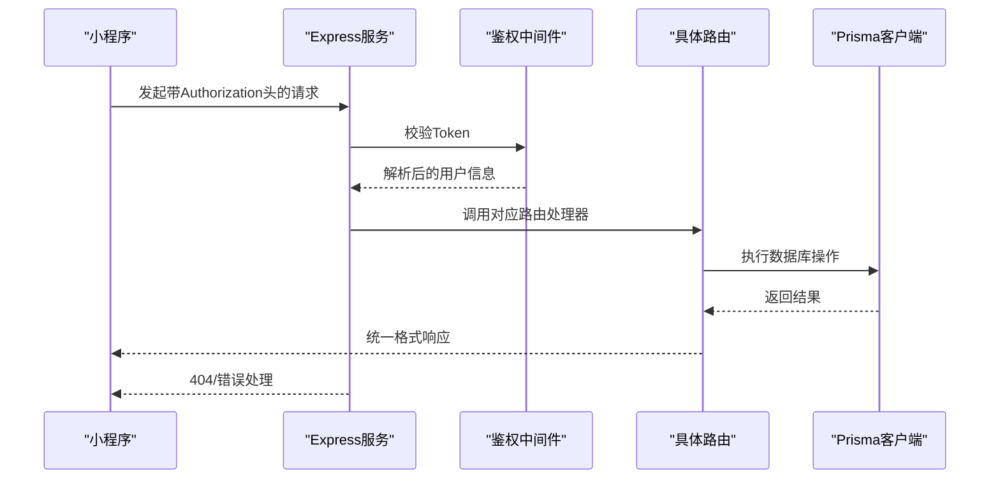
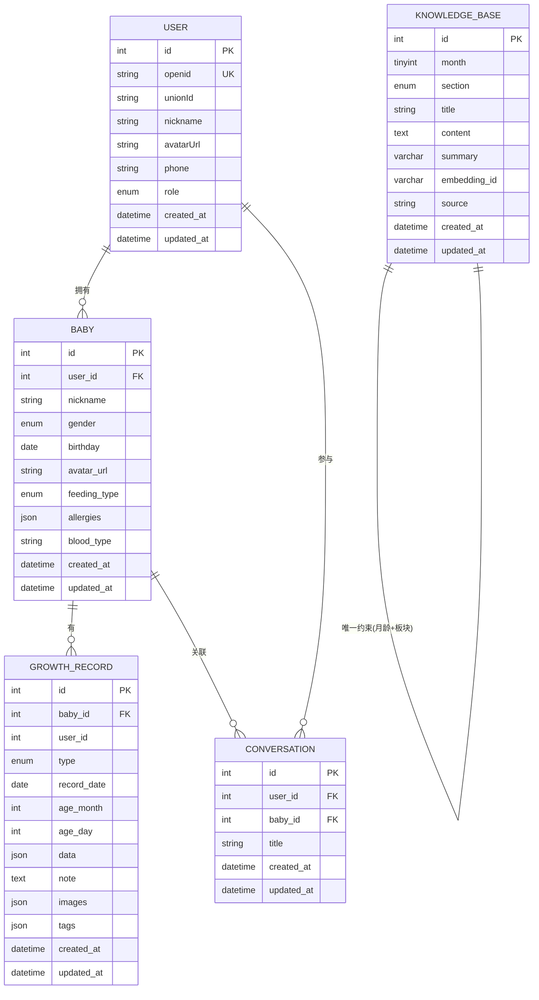

# API接口文档

<cite>
**本文档引用的文件**
- [server/src/app.js](file://server/src/app.js)
- [server/package.json](file://server/package.json)
- [server/src/routes/auth.js](file://server/src/routes/auth.js)
- [server/src/routes/baby.js](file://server/src/routes/baby.js)
- [server/src/routes/growth.js](file://server/src/routes/growth.js)
- [server/src/routes/knowledge.js](file://server/src/routes/knowledge.js)
- [server/src/routes/chat.js](file://server/src/routes/chat.js)
- [server/src/routes/upload.js](file://server/src/routes/upload.js)
- [server/src/routes/home.js](file://server/src/routes/home.js)
- [server/src/middleware/auth.js](file://server/src/middleware/auth.js)
- [server/src/middleware/errorHandler.js](file://server/src/middleware/errorHandler.js)
- [server/src/config/database.js](file://server/src/config/database.js)
- [server/prisma/schema.prisma](file://server/prisma/schema.prisma)
- [miniprogram/utils/request.js](file://miniprogram/utils/request.js)
- [miniprogram/pages/home/index.js](file://miniprogram/pages/home/index.js)
</cite>

## 目录
1. [简介](#简介)
2. [项目结构](#项目结构)
3. [核心组件](#核心组件)
4. [架构总览](#架构总览)
5. [详细接口规范](#详细接口规范)
6. [依赖关系分析](#依赖关系分析)
7. [性能与安全规范](#性能与安全规范)
8. [故障排查指南](#故障排查指南)
9. [结论](#结论)
10. [附录](#附录)

## 简介
本文件为“AI育儿助手”项目的完整API接口文档，覆盖用户认证、宝宝管理、成长记录、知识查询、AI聊天、文件上传、首页聚合等所有公开接口。文档提供HTTP方法、URL模式、请求参数、响应格式、错误码定义、权限控制、速率限制、安全防护等规范，并给出请求/响应示例与最佳实践，便于前端开发与第三方集成。

## 项目结构
后端采用Express + Prisma架构，路由按功能模块划分，统一通过中间件进行鉴权与错误处理；前端小程序通过封装的请求工具统一注入Authorization头并处理业务错误。

**图表来源**
- [server/src/app.js:32-47](file://server/src/app.js#L32-L47)
- [server/src/middleware/auth.js:7-26](file://server/src/middleware/auth.js#L7-L26)
- [server/src/middleware/errorHandler.js:6-39](file://server/src/middleware/errorHandler.js#L6-L39)
- [server/src/config/database.js:7-14](file://server/src/config/database.js#L7-L14)
- [server/prisma/schema.prisma:14-189](file://server/prisma/schema.prisma#L14-L189)

**章节来源**
- [server/src/app.js:14-65](file://server/src/app.js#L14-L65)
- [server/package.json:1-31](file://server/package.json#L1-L31)

## 核心组件
- 应用入口与中间件
  - 全局CORS、JSON解析、限流中间件
  - 健康检查接口
  - 路由注册与404处理
  - 全局错误处理
- 鉴权中间件
  - 从Authorization头提取Bearer Token并校验
  - 支持过期与无效令牌的统一返回
- 错误处理中间件
  - 统一格式化业务错误与未知错误
  - Prisma特定错误码映射
- 数据库客户端
  - Prisma单例客户端，开发环境下开启查询日志

**章节来源**
- [server/src/app.js:14-65](file://server/src/app.js#L14-L65)
- [server/src/middleware/auth.js:7-26](file://server/src/middleware/auth.js#L7-L26)
- [server/src/middleware/errorHandler.js:6-39](file://server/src/middleware/errorHandler.js#L6-L39)
- [server/src/config/database.js:7-14](file://server/src/config/database.js#L7-L14)

## 架构总览
后端服务通过Express提供REST API，所有受保护接口均需携带JWT Bearer Token。数据库使用MySQL，ORM为Prisma，支持多表关联与复杂查询。

**图表来源**
- [server/src/app.js:32-55](file://server/src/app.js#L32-L55)
- [server/src/middleware/auth.js:7-26](file://server/src/middleware/auth.js#L7-L26)
- [server/src/middleware/errorHandler.js:6-39](file://server/src/middleware/errorHandler.js#L6-L39)

## 详细接口规范

### 通用约定
- 基础URL
  - 开发环境：http://localhost:3000/api
- 响应格式
  - 统一字段：code、message、data
  - 成功：code=0；失败：code>0
- 认证方式
  - 所有受保护接口需在Authorization头中携带Bearer Token
- 速率限制
  - 全局限流：每IP每分钟最多60次请求

**章节来源**
- [server/src/app.js:19-25](file://server/src/app.js#L19-L25)
- [miniprogram/utils/request.js:11](file://miniprogram/utils/request.js#L11)
- [miniprogram/utils/request.js:33-37](file://miniprogram/utils/request.js#L33-L37)

### 健康检查
- 方法与路径
  - GET /api/health
- 成功响应
  - data包含timestamp时间戳
- 示例
  - 请求：GET /api/health
  - 响应：{ code: 0, message: "ok", data: { timestamp: 171xxx } }

**章节来源**
- [server/src/app.js:28-30](file://server/src/app.js#L28-L30)

### 用户认证
- 登录（微信小程序）
  - 方法与路径
    - POST /api/auth/login
  - 请求体
    - code: 小程序登录凭证（必填）
  - 成功响应
    - data.token: JWT访问令牌
    - data.expiresIn: 过期秒数（默认7天）
    - data.user: 用户信息（id、nickname、avatarUrl、role）
    - data.baby: 宝宝信息（若存在），否则null
  - 失败场景
    - 缺少code：返回400
    - 微信登录失败：返回400
  - 示例
    - 请求：POST /api/auth/login { "code": "xxx" }
    - 响应：{ code: 0, message: "ok", data: { token, expiresIn, user, baby } }

**章节来源**
- [server/src/routes/auth.js:10-81](file://server/src/routes/auth.js#L10-L81)

### 宝宝管理
- 创建宝宝档案
  - 方法与路径
    - POST /api/babies
  - 请求体
    - nickname: 昵称（必填）
    - gender: 性别（必填）
    - birthday: 出生日期（必填）
    - feedingType: 喂养方式（可选，默认母乳）
    - bloodType: 血型（可选）
  - 成功响应
    - 返回新建的宝宝对象
  - 示例
    - 请求：POST /api/babies { "nickname":"宝宝","gender":"male","birthday":"2024-01-01","feedingType":"breast" }
    - 响应：{ code: 0, message: "ok", data: { id, userId, nickname, gender, birthday, ... } }

- 获取宝宝信息（含月龄与总天数）
  - 方法与路径
    - GET /api/babies/:id
  - 路径参数
    - id: 宝宝ID
  - 成功响应
    - data包含宝宝基础信息及计算字段：ageMonths、totalDays、birthday格式化为YYYY-MM-DD
  - 失败场景
    - 宝宝不存在：返回404
  - 示例
    - 请求：GET /api/babies/1
    - 响应：{ code: 0, message: "ok", data: { ..., ageMonths: 12, totalDays: 365, birthday: "2024-01-01" } }

- 更新宝宝信息
  - 方法与路径
    - PUT /api/babies/:id
  - 请求体
    - nickname、gender、birthday、feedingType、bloodType、avatarUrl（任选其一或多项）
  - 成功响应
    - 返回更新后的宝宝对象
  - 示例
    - 请求：PUT /api/babies/1 { "avatarUrl":"https://..." }
    - 响应：{ code: 0, message: "ok", data: { ... } }

**章节来源**
- [server/src/routes/baby.js:9-32](file://server/src/routes/baby.js#L9-L32)
- [server/src/routes/baby.js:37-69](file://server/src/routes/baby.js#L37-L69)
- [server/src/routes/baby.js:74-97](file://server/src/routes/baby.js#L74-L97)

### 成长记录
- 添加记录
  - 方法与路径
    - POST /api/babies/:babyId/records
  - 路径参数
    - babyId: 宝宝ID
  - 请求体
    - type: 记录类型（必填，枚举见Prisma定义）
    - recordDate: 记录日期（必填）
    - data: 记录数据（必填，JSON）
    - note: 备注（可选）
    - images: 图片数组（可选）
    - tags: 标签数组（可选）
  - 成功响应
    - 返回新增记录对象（包含计算字段ageMonth、ageDay）
  - 失败场景
    - 宝宝不存在：返回404
  - 示例
    - 请求：POST /api/babies/1/records { "type":"growth","recordDate":"2024-06-01","data":{"height":60,"weight":5.5},"note":"正常" }
    - 响应：{ code: 0, message: "ok", data: { id, type, recordDate, ageMonth, ageDay, data, note, ... } }

- 查询记录列表（分页、按类型筛选）
  - 方法与路径
    - GET /api/babies/:babyId/records
  - 查询参数
    - type: 类型过滤（可选）
    - page: 页码（默认1）
    - pageSize: 每页条数（默认20）
  - 成功响应
    - data包含records、total、page、pageSize
  - 示例
    - 请求：GET /api/babies/1/records?page=1&pageSize=20&type=growth
    - 响应：{ code: 0, message: "ok", data: { records:[...], total, page, pageSize } }

- 记录详情
  - 方法与路径
    - GET /api/babies/:babyId/records/:id
  - 路径参数
    - babyId、id
  - 成功响应
    - 返回指定记录
  - 失败场景
    - 记录不存在：返回404
  - 示例
    - 请求：GET /api/babies/1/records/100
    - 响应：{ code: 0, message: "ok", data: { ... } }

- 更新记录
  - 方法与路径
    - PUT /api/babies/:babyId/records/:id
  - 请求体
    - data、note、images、tags（任选其一或多项）
  - 成功响应
    - 返回更新后的记录
  - 示例
    - 请求：PUT /api/babies/1/records/100 { "note":"复查正常" }
    - 响应：{ code: 0, message: "ok", data: { ... } }

- 删除记录
  - 方法与路径
    - DELETE /api/babies/:babyId/records/:id
  - 成功响应
    - 返回成功状态
  - 示例
    - 请求：DELETE /api/babies/1/records/100
    - 响应：{ code: 0, message: "ok" }

**章节来源**
- [server/src/routes/growth.js:6-44](file://server/src/routes/growth.js#L6-L44)
- [server/src/routes/growth.js:46-73](file://server/src/routes/growth.js#L46-L73)
- [server/src/routes/growth.js:75-86](file://server/src/routes/growth.js#L75-L86)
- [server/src/routes/growth.js:88-105](file://server/src/routes/growth.js#L88-L105)
- [server/src/routes/growth.js:107-115](file://server/src/routes/growth.js#L107-L115)

### 知识查询
- 获取0-12月龄概览
  - 方法与路径
    - GET /api/knowledge/timeline
  - 成功响应
    - data为按月分组的数组，每项包含month、title、sections
  - 示例
    - 请求：GET /api/knowledge/timeline
    - 响应：{ code: 0, message: "ok", data: [ { month: 0, sections:[...] }, { month: 1, sections:[...] }, ... ] }

- 获取某月全部知识
  - 方法与路径
    - GET /api/knowledge/:month
  - 路径参数
    - month: 月龄（0-12）
  - 成功响应
    - data为该月所有知识条目
  - 示例
    - 请求：GET /api/knowledge/6
    - 响应：{ code: 0, message: "ok", data: [...] }

- 获取某月某板块
  - 方法与路径
    - GET /api/knowledge/:month/:section
  - 路径参数
    - month: 月龄（0-12）、section: 板块标识
  - 成功响应
    - data为该板块知识内容
  - 失败场景
    - 知识不存在：返回404
  - 示例
    - 请求：GET /api/knowledge/6/physiology
    - 响应：{ code: 0, message: "ok", data: { month, section, title, content, summary, ... } }

**章节来源**
- [server/src/routes/knowledge.js:5-26](file://server/src/routes/knowledge.js#L5-L26)
- [server/src/routes/knowledge.js:28-40](file://server/src/routes/knowledge.js#L28-L40)
- [server/src/routes/knowledge.js:42-56](file://server/src/routes/knowledge.js#L42-L56)

### AI聊天
- 发送消息（SSE流式响应，Sprint 4实现）
  - 方法与路径
    - POST /api/chat/send
  - 当前实现
    - 返回提示信息（待实现）
  - 示例
    - 请求：POST /api/chat/send
    - 响应：{ code: 0, message: "AI 对话功能将在 Sprint 4 实现" }

- 获取对话列表
  - 方法与路径
    - GET /api/chat/conversations
  - 成功响应
    - data为最近20条对话列表
  - 示例
    - 请求：GET /api/chat/conversations
    - 响应：{ code: 0, message: "ok", data: [ { id,title,createdAt,updatedAt }, ... ] }

- 获取对话详情
  - 方法与路径
    - GET /api/chat/conversations/:id
  - 路径参数
    - id: 对话ID
  - 成功响应
    - data为对话及其消息列表（按时间升序）
  - 失败场景
    - 对话不存在：返回404
  - 示例
    - 请求：GET /api/chat/conversations/1
    - 响应：{ code: 0, message: "ok", data: { id,title,messages:[...] } }

- 删除对话
  - 方法与路径
    - DELETE /api/chat/conversations/:id
  - 成功响应
    - 返回成功状态
  - 示例
    - 请求：DELETE /api/chat/conversations/1
    - 响应：{ code: 0, message: "ok" }

**章节来源**
- [server/src/routes/chat.js:5-12](file://server/src/routes/chat.js#L5-L12)
- [server/src/routes/chat.js:14-26](file://server/src/routes/chat.js#L14-L26)
- [server/src/routes/chat.js:28-42](file://server/src/routes/chat.js#L28-L42)
- [server/src/routes/chat.js:44-54](file://server/src/routes/chat.js#L44-L54)

### 文件上传
- 上传图片到腾讯云COS（Sprint 3实现）
  - 方法与路径
    - POST /api/upload/image
  - 当前实现
    - 返回提示信息（待实现）
  - 示例
    - 请求：POST /api/upload/image
    - 响应：{ code: 0, message: "图片上传功能将在 Sprint 3 实现" }

**章节来源**
- [server/src/routes/upload.js:4-7](file://server/src/routes/upload.js#L4-L7)

### 首页聚合
- 首页仪表盘
  - 方法与路径
    - GET /api/home/dashboard
  - 成功响应
    - data包含：baby（含ageMonths、totalDays）、latestGrowth（最新身高体重数据）、monthTips（当月建议摘要列表，最多5条）、recommendations（推荐内容，Sprint 5实现）
  - 示例
    - 请求：GET /api/home/dashboard
    - 响应：{ code: 0, message: "ok", data: { baby:{...}, latestGrowth:{...}, monthTips:[...], recommendations:[] } }

**章节来源**
- [server/src/routes/home.js:5-59](file://server/src/routes/home.js#L5-L59)

## 依赖关系分析
- 路由与中间件
  - 受保护路由均依赖鉴权中间件，未提供有效Token将直接返回401
  - 错误处理中间件统一拦截业务异常与未知错误
- 数据模型
  - User、Baby、GrowthRecord、Conversation、KnowledgeBase等模型定义了字段、索引与关系
- 外部依赖
  - 微信登录：调用微信JSCode2Session接口换取openid
  - 限流：express-rate-limit
  - 鉴权：jsonwebtoken
  - 存储：Prisma + MySQL

**图表来源**
- [server/prisma/schema.prisma:14-189](file://server/prisma/schema.prisma#L14-L189)

**章节来源**
- [server/prisma/schema.prisma:14-189](file://server/prisma/schema.prisma#L14-L189)

## 性能与安全规范
- 速率限制
  - 全局限流：每IP每分钟最多60次请求，超过返回429
- 安全防护
  - CORS跨域：允许任意源（开发环境）
  - Token过期：鉴权中间件返回401并提示重新登录
  - 404接口：未匹配路由统一返回404
- 错误处理
  - 业务错误：AppError抛出，统一返回对应状态码与message
  - Prisma错误：P2002（唯一约束冲突）→ 409；P2025（记录不存在）→ 404
  - 未知错误：500，生产环境不暴露具体错误细节

**章节来源**
- [server/src/app.js:19-25](file://server/src/app.js#L19-L25)
- [server/src/middleware/auth.js:21-25](file://server/src/middleware/auth.js#L21-L25)
- [server/src/middleware/errorHandler.js:9-39](file://server/src/middleware/errorHandler.js#L9-L39)

## 故障排查指南
- 认证相关
  - 401 未提供有效的认证令牌：检查Authorization头是否以Bearer开头
  - 401 登录已过期，请重新登录：前端移除本地token并触发重新登录流程
- 业务错误
  - 400 参数缺失或业务异常：根据接口文档核对必填字段
  - 404 宝宝/记录不存在：确认资源ID与用户绑定关系
- 服务器错误
  - 500 服务器内部错误：查看服务端日志，生产环境不暴露具体错误
- 前端处理
  - 前端请求工具会在收到非200或code!=0时统一弹窗提示并拒绝Promise
  - Token过期时自动清理本地存储并触发登录流程

**章节来源**
- [server/src/middleware/auth.js:10-25](file://server/src/middleware/auth.js#L10-L25)
- [server/src/middleware/errorHandler.js:25-39](file://server/src/middleware/errorHandler.js#L25-L39)
- [miniprogram/utils/request.js:48-62](file://miniprogram/utils/request.js#L48-L62)
- [miniprogram/utils/request.js:78-86](file://miniprogram/utils/request.js#L78-L86)

## 结论
本API文档覆盖了项目当前实现的所有公开接口，明确了认证、鉴权、错误处理、速率限制与安全策略。建议在后续迭代中完善AI聊天与图片上传接口，并持续优化前端错误提示与Token刷新机制，提升用户体验与系统稳定性。

## 附录
- 常用请求示例（基于前端封装）
  - GET /api/home/dashboard：首页聚合数据
  - POST /api/auth/login：小程序登录换取Token
  - POST /api/babies：创建宝宝档案
  - GET /api/babies/:id：获取宝宝信息
  - POST /api/babies/:babyId/records：添加成长记录
  - GET /api/knowledge/timeline：获取知识概览
  - GET /api/chat/conversations：获取对话列表
- 前端调用要点
  - 自动注入Authorization头
  - 统一错误处理与Toast提示
  - Token过期自动清理并重新登录

**章节来源**
- [miniprogram/pages/home/index.js:46-71](file://miniprogram/pages/home/index.js#L46-L71)
- [miniprogram/utils/request.js:21-73](file://miniprogram/utils/request.js#L21-L73)