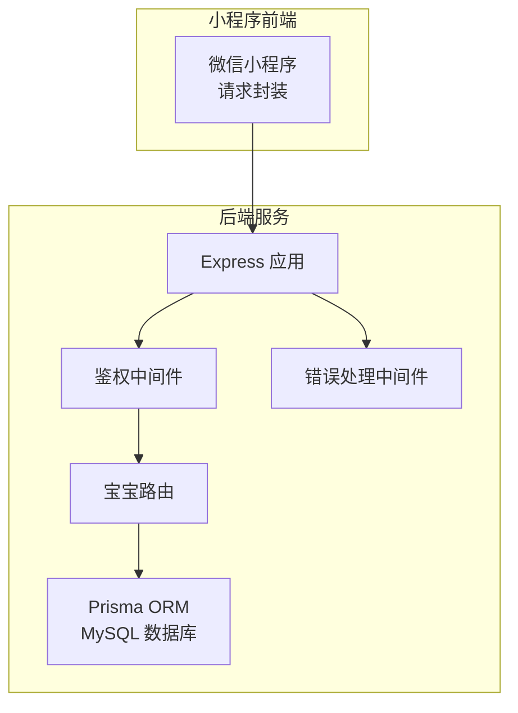
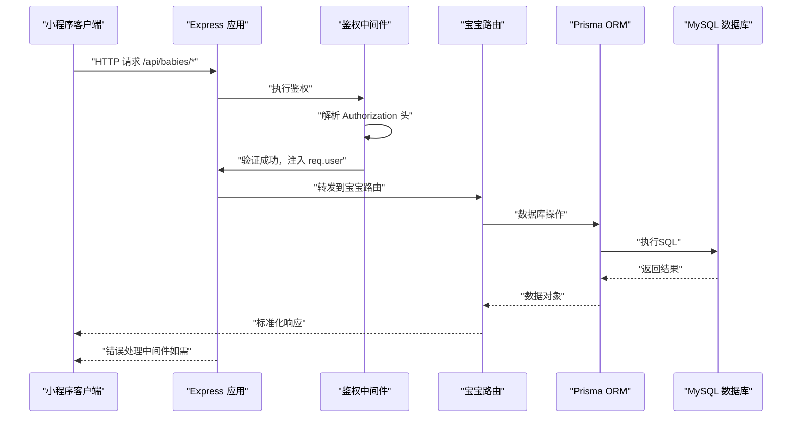
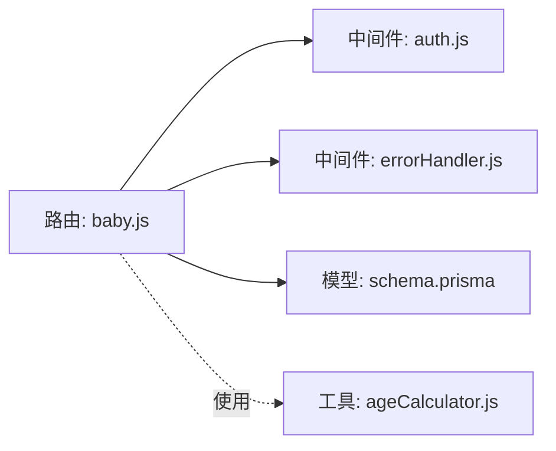

# 宝宝管理接口

<cite>
**本文档引用的文件**
- [server/src/routes/baby.js](file://server/src/routes/baby.js)
- [server/src/middleware/auth.js](file://server/src/middleware/auth.js)
- [server/src/middleware/errorHandler.js](file://server/src/middleware/errorHandler.js)
- [server/src/app.js](file://server/src/app.js)
- [server/prisma/schema.prisma](file://server/prisma/schema.prisma)
- [miniprogram/utils/ageCalculator.js](file://miniprogram/utils/ageCalculator.js)
- [miniprogram/utils/request.js](file://miniprogram/utils/request.js)
</cite>

## 目录
1. [简介](#简介)
2. [项目结构](#项目结构)
3. [核心组件](#核心组件)
4. [架构概览](#架构概览)
5. [详细组件分析](#详细组件分析)
6. [依赖关系分析](#依赖关系分析)
7. [性能考虑](#性能考虑)
8. [故障排除指南](#故障排除指南)
9. [结论](#结论)

## 简介
本文件为宝宝管理模块的完整API文档，涵盖宝宝档案的CRUD操作接口，包括创建宝宝、获取宝宝信息（含自动计算月龄）、更新宝宝信息等功能。文档详细说明了每个接口的HTTP方法、URL路径、请求参数验证规则、响应数据结构，并包含宝宝信息字段定义、月龄计算逻辑、权限控制机制、请求响应示例以及错误处理说明。

## 项目结构
后端采用Express框架，通过Prisma ORM访问MySQL数据库；前端为微信小程序，通过统一的网络请求封装调用后端API。路由层位于server/src/routes，鉴权与错误处理中间件位于server/src/middleware，数据库模型定义于server/prisma/schema.prisma。

**图表来源**
- [server/src/app.js:1-65](file://server/src/app.js#L1-L65)
- [server/src/middleware/auth.js:1-29](file://server/src/middleware/auth.js#L1-L29)
- [server/src/middleware/errorHandler.js:1-52](file://server/src/middleware/errorHandler.js#L1-L52)
- [server/src/routes/baby.js:1-100](file://server/src/routes/baby.js#L1-L100)
- [server/prisma/schema.prisma:1-189](file://server/prisma/schema.prisma#L1-L189)

**章节来源**
- [server/src/app.js:1-65](file://server/src/app.js#L1-L65)
- [server/src/routes/baby.js:1-100](file://server/src/routes/baby.js#L1-L100)
- [server/prisma/schema.prisma:1-189](file://server/prisma/schema.prisma#L1-L189)

## 核心组件
- 宝宝路由模块：提供创建、查询单个、更新宝宝信息的REST接口，均受JWT鉴权保护。
- 鉴权中间件：从Authorization头解析并验证JWT，注入用户上下文到req.user。
- 错误处理中间件：统一捕获AppError、Prisma错误及未知错误，返回标准化响应。
- 数据模型：Baby表包含用户ID、昵称、性别、生日、头像、喂养类型、过敏史、血型等字段。

**章节来源**
- [server/src/routes/baby.js:1-100](file://server/src/routes/baby.js#L1-L100)
- [server/src/middleware/auth.js:1-29](file://server/src/middleware/auth.js#L1-L29)
- [server/src/middleware/errorHandler.js:1-52](file://server/src/middleware/errorHandler.js#L1-L52)
- [server/prisma/schema.prisma:40-60](file://server/prisma/schema.prisma#L40-L60)

## 架构概览
后端服务启动时注册路由，所有/api/babies相关接口在路由层之前经过鉴权中间件校验。数据库模型定义了用户与宝宝的一对多关系，确保每个宝宝都绑定到一个用户。

**图表来源**
- [server/src/app.js:32-47](file://server/src/app.js#L32-L47)
- [server/src/middleware/auth.js:7-26](file://server/src/middleware/auth.js#L7-L26)
- [server/src/routes/baby.js:9-32](file://server/src/routes/baby.js#L9-L32)
- [server/src/middleware/errorHandler.js:6-39](file://server/src/middleware/errorHandler.js#L6-L39)

## 详细组件分析

### 接口总览
- 基础路径：/api/babies
- 鉴权要求：所有接口均需携带有效的Bearer Token
- 响应格式：统一为 { code, message, data? }

**章节来源**
- [server/src/app.js:42](file://server/src/app.js#L42)
- [server/src/middleware/auth.js:10-12](file://server/src/middleware/auth.js#L10-L12)
- [server/src/routes/baby.js:28](file://server/src/routes/baby.js#L28)

### 创建宝宝档案
- 方法与路径：POST /api/babies
- 权限：需要有效JWT
- 请求体参数：
  - nickname: 字符串，必填
  - gender: 枚举值，必填（male/female）
  - birthday: 日期字符串（YYYY-MM-DD），必填
  - feedingType: 枚举值（breast/formula/mixed），非必填（默认breast）
  - bloodType: 字符串，非必填
  - avatarUrl: 字符串，非必填
- 成功响应：返回创建的宝宝对象（包含自动生成的id、userId等）
- 参数验证规则：
  - nickname、gender、birthday为必填
  - birthday需可解析为有效日期
- 错误处理：
  - 缺少必填参数时返回400
  - JWT无效或过期返回401
  - 数据库唯一性冲突返回409
  - 其他异常返回500

请求示例
- 方法：POST
- 路径：/api/babies
- 头部：Authorization: Bearer <token>
- 请求体：
  {
    "nickname": "小宝",
    "gender": "male",
    "birthday": "2024-01-15",
    "feedingType": "breast",
    "bloodType": "A+"
  }

响应示例
- 成功响应：
  {
    "code": 0,
    "message": "ok",
    "data": {
      "id": 123,
      "userId": 456,
      "nickname": "小宝",
      "gender": "male",
      "birthday": "2024-01-15",
      "avatarUrl": "",
      "feedingType": "breast",
      "bloodType": "A+",
      "createdAt": "2024-01-20T10:00:00Z",
      "updatedAt": "2024-01-20T10:00:00Z"
    }
  }

**章节来源**
- [server/src/routes/baby.js:9-32](file://server/src/routes/baby.js#L9-L32)
- [server/prisma/schema.prisma:40-60](file://server/prisma/schema.prisma#L40-L60)

### 获取宝宝信息（含自动计算月龄）
- 方法与路径：GET /api/babies/:id
- 权限：需要有效JWT
- 路径参数：id（整数）
- 功能说明：根据宝宝ID查询信息，并自动计算月龄与总天数
- 计算逻辑：
  - 月龄 = (当前年份 - 出生年份) × 12 + (当前月份 - 出生月份)
  - 总天数 = Math.floor((当前时间 - 出生时间) / (1000 × 60 × 60 × 24))
  - 返回的birthday字段格式为"YYYY-MM-DD"
- 成功响应：返回包含原始宝宝信息及ageMonths、totalDays字段的对象
- 错误处理：
  - 宝宝不存在返回404
  - JWT无效或过期返回401

请求示例
- 方法：GET
- 路径：/api/babies/123
- 头部：Authorization: Bearer <token>

响应示例
- 成功响应：
  {
    "code": 0,
    "message": "ok",
    "data": {
      "id": 123,
      "userId": 456,
      "nickname": "小宝",
      "gender": "male",
      "birthday": "2024-01-15",
      "avatarUrl": "",
      "feedingType": "breast",
      "bloodType": "A+",
      "ageMonths": 2,
      "totalDays": 45,
      "createdAt": "2024-01-20T10:00:00Z",
      "updatedAt": "2024-01-20T10:00:00Z"
    }
  }

**章节来源**
- [server/src/routes/baby.js:37-69](file://server/src/routes/baby.js#L37-L69)
- [miniprogram/utils/ageCalculator.js:7-41](file://miniprogram/utils/ageCalculator.js#L7-L41)

### 更新宝宝信息
- 方法与路径：PUT /api/babies/:id
- 权限：需要有效JWT
- 路径参数：id（整数）
- 支持部分更新字段：
  - nickname: 字符串
  - gender: 枚举值（male/female）
  - birthday: 日期字符串（YYYY-MM-DD）
  - feedingType: 枚举值（breast/formula/mixed）
  - bloodType: 字符串（允许设为null/undefined）
  - avatarUrl: 字符串
- 成功响应：返回更新后的宝宝对象
- 错误处理：
  - 宝宝不存在返回404
  - JWT无效或过期返回401

请求示例
- 方法：PUT
- 路径：/api/babies/123
- 头部：Authorization: Bearer <token>
- 请求体：
  {
    "avatarUrl": "https://example.com/avatar.jpg",
    "bloodType": "O+"
  }

响应示例
- 成功响应：
  {
    "code": 0,
    "message": "ok",
    "data": {
      "id": 123,
      "userId": 456,
      "nickname": "小宝",
      "gender": "male",
      "birthday": "2024-01-15",
      "avatarUrl": "https://example.com/avatar.jpg",
      "feedingType": "breast",
      "bloodType": "O+",
      "createdAt": "2024-01-20T10:00:00Z",
      "updatedAt": "2024-01-20T11:00:00Z"
    }
  }

**章节来源**
- [server/src/routes/baby.js:74-97](file://server/src/routes/baby.js#L74-L97)
- [server/prisma/schema.prisma:40-60](file://server/prisma/schema.prisma#L40-L60)

### 删除宝宝信息
- 当前版本说明：在已分析的路由文件中未发现DELETE /api/babies/:id接口。请确认是否需要该功能或检查其他路由文件。

**章节来源**
- [server/src/routes/baby.js:1-100](file://server/src/routes/baby.js#L1-L100)

### 宝宝信息字段定义
- 字段说明：
  - id: 整数，主键
  - userId: 整数，关联用户ID
  - nickname: 字符串，宝宝昵称
  - gender: 枚举，性别（male/female）
  - birthday: 日期，出生日期
  - avatarUrl: 字符串，头像URL
  - feedingType: 枚举，喂养类型（breast/formula/mixed）
  - allergies: JSON，过敏史
  - bloodType: 字符串，血型
  - createdAt/updatedAt: 时间戳

**章节来源**
- [server/prisma/schema.prisma:40-60](file://server/prisma/schema.prisma#L40-L60)

### 月龄计算逻辑
- 后端计算（GET /api/babies/:id）：
  - 月龄 = (当前年份 - 出生年份) × 12 + (当前月份 - 出生月份)
  - 总天数 = Math.floor((当前时间 - 出生时间) / (1000 × 60 × 60 × 24))
- 小程序工具函数（可复用）：
  - calculateAge(birthday, referenceDate?): 返回 { months, days, totalDays, ageText }
  - ageText格式：例如“2个月”、“45天”、“1个月15天”

**章节来源**
- [server/src/routes/baby.js:50-64](file://server/src/routes/baby.js#L50-L64)
- [miniprogram/utils/ageCalculator.js:7-41](file://miniprogram/utils/ageCalculator.js#L7-L41)

### 权限控制机制
- JWT鉴权流程：
  - 客户端在Authorization头中携带Bearer Token
  - 中间件解析并验证token，失败时返回401
  - 验证成功后将用户信息注入req.user（包含userId、openid）
- 接口级权限：
  - 所有/api/babies接口均受此中间件保护
  - 查询/更新时会校验目标资源是否属于当前用户（userId匹配）

**章节来源**
- [server/src/middleware/auth.js:7-26](file://server/src/middleware/auth.js#L7-L26)
- [server/src/app.js:42](file://server/src/app.js#L42)
- [server/src/routes/baby.js:39-48](file://server/src/routes/baby.js#L39-L48)
- [server/src/routes/baby.js:78-82](file://server/src/routes/baby.js#L78-L82)

### 错误处理说明
- AppError：自定义业务错误，支持设置状态码，默认400
- Prisma错误：
  - P2002：唯一约束冲突，返回409
  - P2025：记录不存在，返回404
- 未知错误：返回500，开发环境下输出详细错误信息

**章节来源**
- [server/src/middleware/errorHandler.js:6-39](file://server/src/middleware/errorHandler.js#L6-L39)
- [server/src/middleware/errorHandler.js:44-49](file://server/src/middleware/errorHandler.js#L44-L49)

## 依赖关系分析

**图表来源**
- [server/src/routes/baby.js:1-100](file://server/src/routes/baby.js#L1-L100)
- [server/src/middleware/auth.js:1-29](file://server/src/middleware/auth.js#L1-L29)
- [server/src/middleware/errorHandler.js:1-52](file://server/src/middleware/errorHandler.js#L1-L52)
- [server/prisma/schema.prisma:40-60](file://server/prisma/schema.prisma#L40-L60)
- [miniprogram/utils/ageCalculator.js:1-86](file://miniprogram/utils/ageCalculator.js#L1-L86)

**章节来源**
- [server/src/app.js:32-47](file://server/src/app.js#L32-L47)
- [server/src/routes/baby.js:1-100](file://server/src/routes/baby.js#L1-L100)

## 性能考虑
- 限流策略：全局每IP每分钟最多60次请求，避免滥用
- 并发查询：在需要时可考虑对高并发场景增加索引优化（如按userId、birthday等字段）
- 响应数据：仅返回必要字段，避免传输冗余信息

**章节来源**
- [server/src/app.js:19-25](file://server/src/app.js#L19-L25)

## 故障排除指南
- 401 未提供有效的认证令牌
  - 检查Authorization头格式是否为"Bearer <token>"
  - 确认token未过期
- 401 登录已过期，请重新登录
  - 触发前端token过期处理流程，引导重新登录
- 404 宝宝不存在
  - 确认传入的宝宝ID是否正确，且属于当前用户
- 409 数据已存在（唯一约束冲突）
  - 检查是否存在重复字段（如唯一索引冲突）
- 500 服务器内部错误
  - 查看服务端日志，定位具体异常

**章节来源**
- [server/src/middleware/auth.js:10-25](file://server/src/middleware/auth.js#L10-L25)
- [server/src/middleware/errorHandler.js:10-39](file://server/src/middleware/errorHandler.js#L10-L39)
- [miniprogram/utils/request.js:48-86](file://miniprogram/utils/request.js#L48-L86)

## 结论
本API文档覆盖了宝宝管理模块的核心能力：创建、查询（含月龄计算）、更新等操作，并明确了鉴权、参数验证、错误处理与响应格式规范。建议在后续版本中补充删除接口，并持续完善前端与后端的联调测试，确保数据一致性与用户体验。