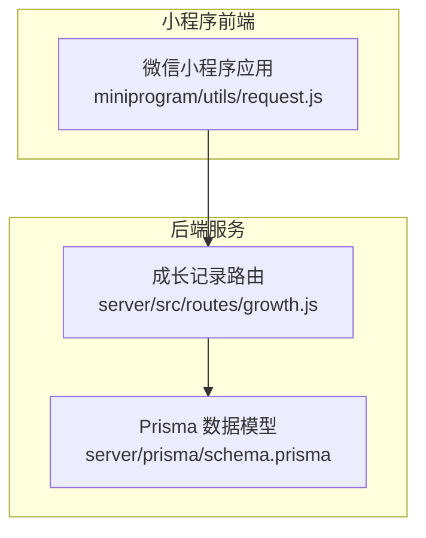
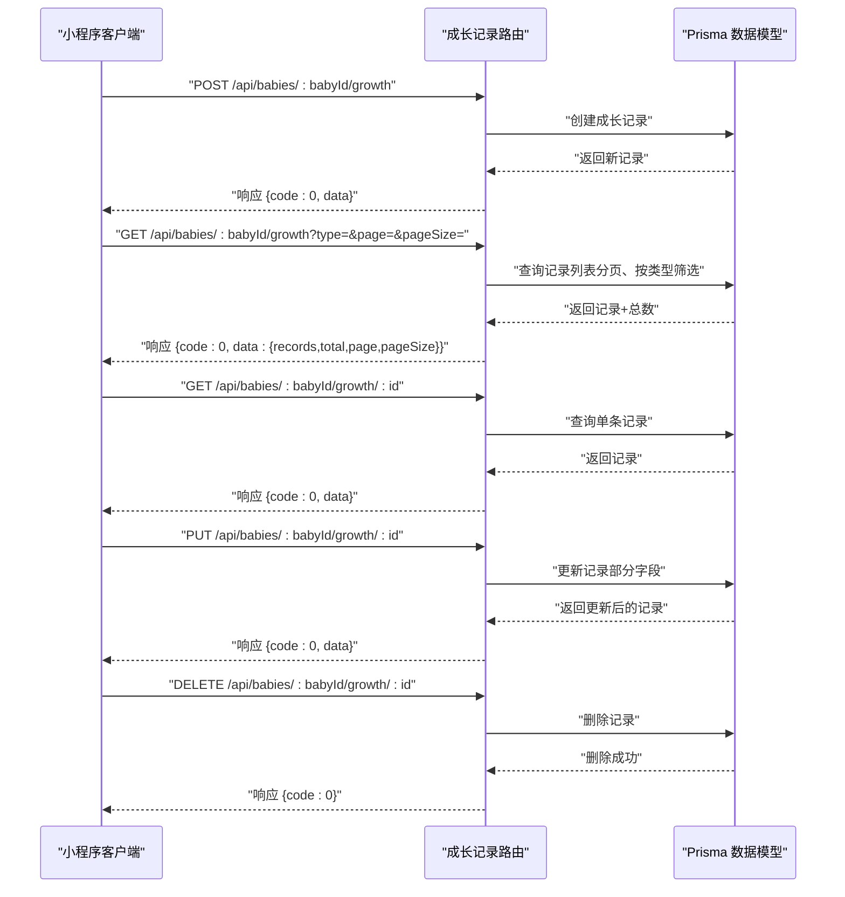
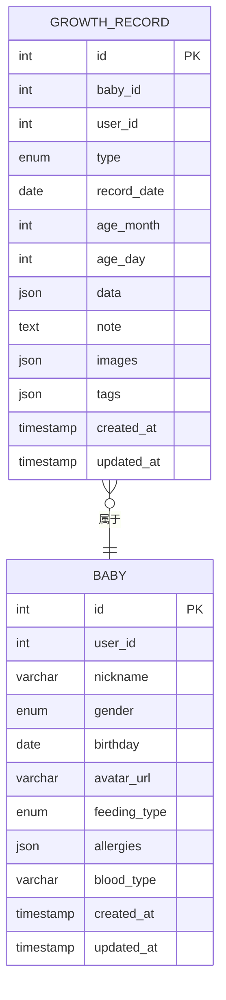

# 成长记录接口

<cite>
**本文档引用的文件**
- [server/src/routes/growth.js](file://server/src/routes/growth.js)
- [server/prisma/schema.prisma](file://server/prisma/schema.prisma)
- [miniprogram/utils/request.js](file://miniprogram/utils/request.js)
</cite>

## 目录
1. [简介](#简介)
2. [项目结构](#项目结构)
3. [核心组件](#核心组件)
4. [架构总览](#架构总览)
5. [详细组件分析](#详细组件分析)
6. [依赖关系分析](#依赖关系分析)
7. [性能考虑](#性能考虑)
8. [故障排除指南](#故障排除指南)
9. [结论](#结论)

## 简介
本文件为“成长记录”模块的完整接口文档，覆盖身高、体重、睡眠、喂养、大小便、里程碑、照片、健康、普通记录等记录类型的增删改查操作。文档详细说明了每种记录类型的字段定义、数据验证规则、分页与筛选、统计分析与图表接口的规范，并提供请求/响应示例与数据格式说明。

## 项目结构
后端采用 Express + Prisma 的结构，成长记录路由位于 server/src/routes/growth.js；数据库模型在 server/prisma/schema.prisma 中定义；小程序端通过统一的网络请求封装 miniprogram/utils/request.js 调用后端接口。

**图示来源**
- [server/src/routes/growth.js:1-118](file://server/src/routes/growth.js#L1-L118)
- [server/prisma/schema.prisma:73-104](file://server/prisma/schema.prisma#L73-L104)
- [miniprogram/utils/request.js:1-97](file://miniprogram/utils/request.js#L1-L97)

**章节来源**
- [server/src/routes/growth.js:1-118](file://server/src/routes/growth.js#L1-L118)
- [server/prisma/schema.prisma:73-104](file://server/prisma/schema.prisma#L73-L104)
- [miniprogram/utils/request.js:1-97](file://miniprogram/utils/request.js#L1-L97)

## 核心组件
- 成长记录路由：提供添加、查询列表、详情、更新、删除等标准 CRUD 接口。
- 数据模型：GrowthRecord 表定义了记录类型、时间、年龄信息、JSON 数据域及扩展字段。
- 前端请求封装：统一封装 GET/POST/PUT/DELETE 方法，自动注入 Authorization 头与错误处理。

**章节来源**
- [server/src/routes/growth.js:6-118](file://server/src/routes/growth.js#L6-L118)
- [server/prisma/schema.prisma:73-94](file://server/prisma/schema.prisma#L73-L94)
- [miniprogram/utils/request.js:21-96](file://miniprogram/utils/request.js#L21-L96)

## 架构总览
下图展示了从小程序发起请求到后端处理并访问数据库的整体流程。

**图示来源**
- [server/src/routes/growth.js:6-118](file://server/src/routes/growth.js#L6-L118)
- [server/prisma/schema.prisma:73-94](file://server/prisma/schema.prisma#L73-L94)

## 详细组件分析

### 数据模型与字段定义
- 表名映射：growth_records
- 关键字段
  - id：自增主键
  - babyId：外键关联宝宝档案
  - userId：外键关联用户
  - type：记录类型枚举（见下节）
  - recordDate：记录日期（Date）
  - ageMonth：月龄（整数）
  - ageDay：日龄（整数）
  - data：JSON 结构，承载具体记录数值或结构化数据
  - note：备注（可空）
  - images：图片数组（JSON，可空）
  - tags：标签数组（JSON，可空）
  - createdAt/updatedAt：创建与更新时间

**图示来源**
- [server/prisma/schema.prisma:73-94](file://server/prisma/schema.prisma#L73-L94)
- [server/prisma/schema.prisma:40-60](file://server/prisma/schema.prisma#L40-L60)

**章节来源**
- [server/prisma/schema.prisma:73-94](file://server/prisma/schema.prisma#L73-L94)

### 记录类型枚举与字段约定
- 类型枚举（RecordType）
  - growth：身高/体重等生长类记录
  - feeding：喂养记录
  - sleep：睡眠记录
  - milestone：里程碑记录
  - photo：照片记录
  - health：健康记录
  - note：普通记录
- 字段约定
  - data 字段为 JSON，不同 type 下 data 的结构应遵循约定：
    - growth：建议包含 height、weight 等数值字段
    - feeding：建议包含 milkVolume、feedType、duration 等
    - sleep：建议包含 sleepStart、sleepEnd、deepSleepDuration 等
    - milestone：建议包含 title、description、achievementDate 等
    - photo：建议包含 urls、caption 等
    - health：建议包含 temperature、medication、doctor 等
    - note：建议包含 title、content 等
  - note/images/tags 可为空，支持扩展

**章节来源**
- [server/prisma/schema.prisma:96-104](file://server/prisma/schema.prisma#L96-L104)

### 接口规范

#### 1. 添加成长记录
- 方法与路径
  - POST /api/babies/:babyId/growth
- 请求头
  - Content-Type: application/json
  - Authorization: Bearer <token>
- 请求体字段
  - type：记录类型（必填）
  - recordDate：记录日期（必填）
  - data：JSON 结构（必填）
  - note：备注（可选）
  - images：图片数组（可选）
  - tags：标签数组（可选）
- 响应
  - code：0 表示成功
  - data：新增记录对象
- 错误
  - 缺少必填字段时返回业务错误
  - 宝宝不存在或无权限时返回 404

**章节来源**
- [server/src/routes/growth.js:6-44](file://server/src/routes/growth.js#L6-L44)

#### 2. 查询记录列表（分页、按类型筛选）
- 方法与路径
  - GET /api/babies/:babyId/growth
- 查询参数
  - type：记录类型（可选）
  - page：页码，默认 1
  - pageSize：每页数量，默认 20
- 响应
  - code：0 表示成功
  - data.records：记录数组（按 recordDate 降序）
  - data.total：总数
  - data.page/pageSize：当前页与页大小
- 错误
  - 查询异常时返回错误

**章节来源**
- [server/src/routes/growth.js:46-73](file://server/src/routes/growth.js#L46-L73)

#### 3. 获取记录详情
- 方法与路径
  - GET /api/babies/:babyId/growth/:id
- 响应
  - code：0 表示成功
  - data：记录对象
- 错误
  - 记录不存在返回 404

**章节来源**
- [server/src/routes/growth.js:75-86](file://server/src/routes/growth.js#L75-L86)

#### 4. 更新记录
- 方法与路径
  - PUT /api/babies/:babyId/growth/:id
- 请求体字段（可选）
  - data：JSON 结构
  - note：备注
  - images：图片数组
  - tags：标签数组
- 响应
  - code：0 表示成功
  - data：更新后的记录对象
- 错误
  - 更新异常时返回错误

**章节来源**
- [server/src/routes/growth.js:88-105](file://server/src/routes/growth.js#L88-L105)

#### 5. 删除记录
- 方法与路径
  - DELETE /api/babies/:babyId/growth/:id
- 响应
  - code：0 表示成功
- 错误
  - 删除异常时返回错误

**章节来源**
- [server/src/routes/growth.js:107-115](file://server/src/routes/growth.js#L107-L115)

### 数据验证规则
- 必填校验
  - 添加记录时，type、recordDate、data 为必填
- 权限校验
  - 所有操作均需用户登录，且仅允许操作自己的宝宝数据
- 类型约束
  - type 必须为 RecordType 枚举中的值
  - recordDate 为合法日期
  - data 为合法 JSON
  - images/tags 为合法 JSON 数组（可空）

**章节来源**
- [server/src/routes/growth.js:10-18](file://server/src/routes/growth.js#L10-L18)
- [server/prisma/schema.prisma:96-104](file://server/prisma/schema.prisma#L96-L104)

### 时间范围筛选与分页
- 时间范围筛选
  - 当前路由未内置时间范围参数，可在前端或后端扩展查询条件（如 start/end），并在路由中解析与拼接 where 条件
- 分页
  - 支持 page 与 pageSize 参数，后端默认每页 20 条

**章节来源**
- [server/src/routes/growth.js:47-73](file://server/src/routes/growth.js#L47-L73)

### 统计分析与图表接口（建议）
以下为建议性接口，便于实现增长趋势分析与可视化：
- 按类型与日期聚合
  - GET /api/babies/:babyId/growth/stats?type=growth&startDate=&endDate=
  - 返回：按日期聚合的平均值/最大值/最小值
- 增长趋势折线图
  - GET /api/babies/:babyId/growth/trend?type=growth&unit=month
  - 返回：时间序列点（月龄或日期）
- 喂养/睡眠分布饼图
  - GET /api/babies/:babyId/growth/distribution?type=feeding|sleep
  - 返回：按类别/时间段的分布统计
- 图表数据格式建议
  - 折线图：[{x: "2024-01", y: 65.5}, {x: "2024-02", y: 66.2}]
  - 饼图：[{name: "母乳", value: 60}, {name: "奶粉", value: 40}]

[本节为概念性建议，不直接对应现有代码，故不附“章节来源”]

### 前端调用示例（基于统一请求封装）
- 统一请求封装
  - 支持 get/post/put/delete 方法，自动注入 Authorization 头
  - 业务错误时通过 code 判断并提示
- 示例调用
  - 添加记录：http.post("/api/babies/:babyId/growth", payload)
  - 查询列表：http.get("/api/babies/:babyId/growth", { type, page, pageSize })
  - 更新记录：http.put("/api/babies/:babyId/growth/:id", payload)
  - 删除记录：http.delete("/api/babies/:babyId/growth/:id")

**章节来源**
- [miniprogram/utils/request.js:21-96](file://miniprogram/utils/request.js#L21-L96)

## 依赖关系分析
- 路由依赖 Prisma 客户端进行数据库操作
- 成长记录表与宝宝表存在外键关系，确保数据归属正确
- 记录类型通过枚举约束，保证数据一致性

**图示来源**
- [server/src/routes/growth.js:1-118](file://server/src/routes/growth.js#L1-L118)
- [server/prisma/schema.prisma:73-94](file://server/prisma/schema.prisma#L73-L94)

**章节来源**
- [server/src/routes/growth.js:1-118](file://server/src/routes/growth.js#L1-L118)
- [server/prisma/schema.prisma:73-94](file://server/prisma/schema.prisma#L73-L94)

## 性能考虑
- 查询优化
  - 使用索引：(babyId, recordDate)、(babyId, type) 已建立，建议在高频查询上充分利用
- 分页策略
  - 合理设置 pageSize，避免一次性返回过多数据
- JSON 字段使用
  - data/images/tags 为 JSON，建议控制嵌套深度与数组长度，避免超大文档影响查询性能

[本节为通用性能建议，不直接对应特定文件，故不附“章节来源”]

## 故障排除指南
- 常见错误
  - 401 未授权：前端收到 code=401 时触发登录过期处理
  - 404 记录不存在：查询详情或更新删除时若记录不存在
  - 业务错误：缺少必填字段或数据不合法
- 建议排查步骤
  - 确认 Authorization 头是否正确
  - 检查 babyId 是否匹配当前用户
  - 校验 type 是否为枚举值
  - 校验 recordDate 与 data 的格式

**章节来源**
- [miniprogram/utils/request.js:48-86](file://miniprogram/utils/request.js#L48-L86)
- [server/src/routes/growth.js:12-18](file://server/src/routes/growth.js#L12-L18)
- [server/src/routes/growth.js:78-82](file://server/src/routes/growth.js#L78-L82)

## 结论
本接口文档覆盖了成长记录模块的核心 CRUD 能力与数据模型约束，并提供了统计分析与图表接口的建议方案。建议在现有基础上扩展时间范围筛选与聚合统计接口，以满足更丰富的数据分析需求。