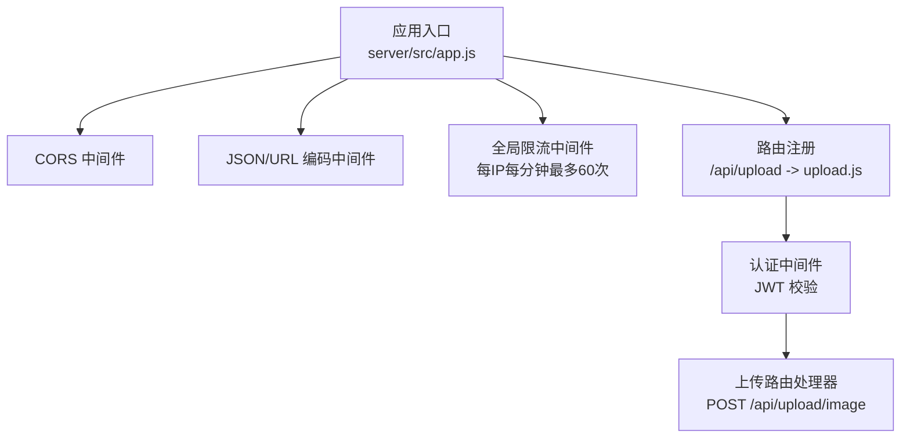
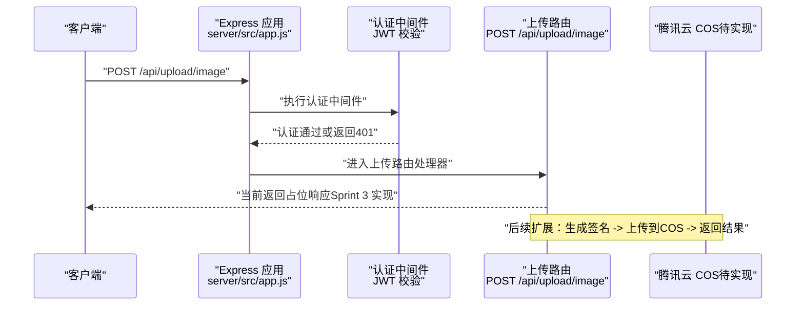
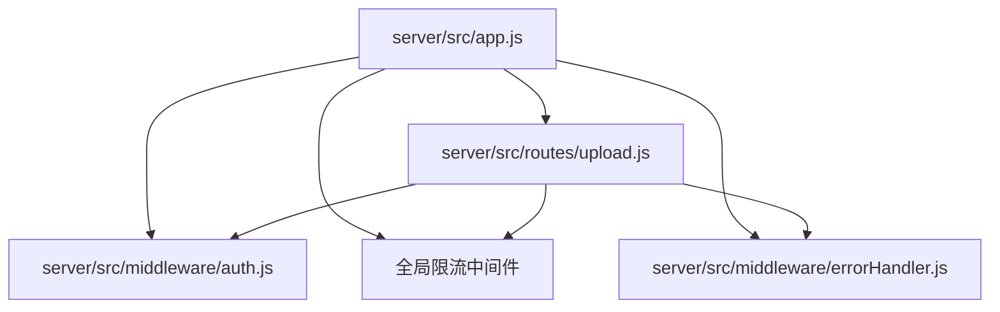

# 文件上传接口

<cite>
**本文引用的文件**
- [server/src/routes/upload.js](file://server/src/routes/upload.js)
- [server/src/middleware/auth.js](file://server/src/middleware/auth.js)
- [server/src/middleware/errorHandler.js](file://server/src/middleware/errorHandler.js)
- [server/src/app.js](file://server/src/app.js)
- [server/package.json](file://server/package.json)
</cite>

## 目录
1. [简介](#简介)
2. [项目结构](#项目结构)
3. [核心组件](#核心组件)
4. [架构总览](#架构总览)
5. [详细组件分析](#详细组件分析)
6. [依赖分析](#依赖分析)
7. [性能考虑](#性能考虑)
8. [故障排查指南](#故障排查指南)
9. [结论](#结论)
10. [附录](#附录)

## 简介
本文件上传接口文档面向后端服务“安心育儿”小程序的上传能力，聚焦于当前已实现的图片上传路由与后续扩展计划。根据现有代码，后端已提供统一的认证中间件与全局限流策略，并在路由层预留了上传接口（POST /api/upload/image），但该接口在当前版本中尚未实现具体逻辑，仅返回占位响应。

本文件将基于仓库中的实际实现，系统性地说明：
- 接口定义与调用方式
- 认证与安全校验
- 错误处理机制
- 与腾讯云 COS 的集成现状与扩展建议
- 前端集成要点与性能优化建议

## 项目结构
后端采用 Express 应用，通过路由注册挂载各模块接口；上传模块位于路由层，受统一认证中间件保护，并通过全局限流中间件进行访问控制。

图表来源
- [server/src/app.js:14-55](file://server/src/app.js#L14-L55)
- [server/src/routes/upload.js:1-10](file://server/src/routes/upload.js#L1-L10)
- [server/src/middleware/auth.js:1-29](file://server/src/middleware/auth.js#L1-L29)

章节来源
- [server/src/app.js:14-55](file://server/src/app.js#L14-L55)
- [server/src/routes/upload.js:1-10](file://server/src/routes/upload.js#L1-L10)

## 核心组件
- 上传路由：提供图片上传入口，当前为占位实现，后续需接入腾讯云 COS 并完成签名与存储流程。
- 认证中间件：从请求头提取并校验 JWT，确保只有已登录用户可调用上传接口。
- 全局限流中间件：对 /api/ 前缀下的所有接口进行限流，防止滥用。
- 错误处理中间件：统一捕获并格式化错误，支持 Prisma 已知错误与自定义业务错误。

章节来源
- [server/src/routes/upload.js:1-10](file://server/src/routes/upload.js#L1-L10)
- [server/src/middleware/auth.js:1-29](file://server/src/middleware/auth.js#L1-L29)
- [server/src/middleware/errorHandler.js:1-52](file://server/src/middleware/errorHandler.js#L1-L52)
- [server/src/app.js:19-25](file://server/src/app.js#L19-L25)

## 架构总览
下图展示了上传接口从客户端到后端的整体调用链路，以及当前已实现的安全与限流控制点。

图表来源
- [server/src/app.js:46](file://server/src/app.js#L46)
- [server/src/middleware/auth.js:7-26](file://server/src/middleware/auth.js#L7-L26)
- [server/src/routes/upload.js:4-7](file://server/src/routes/upload.js#L4-L7)

## 详细组件分析

### 上传路由（POST /api/upload/image）
- 当前状态：占位实现，返回提示信息，表示图片上传功能将在后续 Sprint 中实现。
- 认证要求：由于路由注册时已挂载认证中间件，调用此接口必须携带有效 JWT。
- 限流策略：受全局限流中间件保护，默认每 IP 每分钟最多 60 次请求。
- 扩展方向：建议在此处接入腾讯云 COS SDK，完成签名生成、文件命名与存储路径管理等逻辑。

章节来源
- [server/src/routes/upload.js:4-7](file://server/src/routes/upload.js#L4-L7)
- [server/src/app.js:46](file://server/src/app.js#L46)

### 认证中间件（JWT）
- 功能：从 Authorization 请求头中提取 Bearer Token，校验其有效性与时效性。
- 行为：
  - 缺失或格式不正确时返回 401。
  - 令牌过期返回特定提示。
  - 校验失败返回通用 401。
  - 成功则将解码后的用户信息注入请求对象并放行。
- 使用场景：保护上传接口，确保只有登录态用户可上传。

章节来源
- [server/src/middleware/auth.js:7-26](file://server/src/middleware/auth.js#L7-L26)

### 全局限流中间件
- 配置：针对 /api/ 前缀，每分钟最多 60 次请求。
- 影响范围：包括上传接口在内的所有 /api/* 接口。
- 异常处理：当超过阈值时返回统一的 429 响应。

章节来源
- [server/src/app.js:19-25](file://server/src/app.js#L19-L25)

### 错误处理中间件
- 统一错误格式：所有错误均以 { code, message } 结构返回。
- 特定场景：
  - Prisma 已知错误：如唯一约束冲突、记录不存在等映射为 409/404。
  - 自定义业务错误：通过 AppError 抛出并携带状态码。
  - 未知错误：默认 500，并在生产环境隐藏具体错误细节。
- 作用：保证上传接口异常时的稳定输出与可观测性。

章节来源
- [server/src/middleware/errorHandler.js:6-39](file://server/src/middleware/errorHandler.js#L6-L39)

### 腾讯云 COS 集成现状与扩展建议
- 现状：后端已安装 cos-nodejs-sdk-v5 依赖，为后续集成提供基础。
- 建议流程（概念性）：
  1) 前端向后端申请上传签名（或后端直接生成并下发）。
  2) 前端使用签名直传至 COS。
  3) 后端记录文件元数据（名称、路径、大小、类型等）。
- 文件命名与存储路径：
  - 建议结合用户 ID、时间戳与随机字符串生成唯一文件名。
  - 存储路径可按业务域分桶（如 images、files），并按日期归档。
- 类型与大小限制：
  - 在后端与前端共同限制，避免非法或超大文件。
  - 可通过白名单与大小阈值进行校验。
- 进度监控：
  - 建议在前端监听上传进度事件，并在后端记录关键节点日志。
- 安全性：
  - 严格校验用户身份与权限。
  - 对上传文件进行病毒扫描与内容审核（建议）。

章节来源
- [server/package.json:17](file://server/package.json#L17)

## 依赖分析
- Express 应用通过路由注册挂载上传模块，并统一应用认证与限流中间件。
- 上传模块依赖认证中间件，确保接口安全。
- 错误处理中间件贯穿整个应用，保障异常一致性。

图表来源
- [server/src/app.js:32-55](file://server/src/app.js#L32-L55)
- [server/src/routes/upload.js:1-10](file://server/src/routes/upload.js#L1-L10)
- [server/src/middleware/auth.js:1-29](file://server/src/middleware/auth.js#L1-L29)
- [server/src/middleware/errorHandler.js:1-52](file://server/src/middleware/errorHandler.js#L1-L52)

章节来源
- [server/src/app.js:32-55](file://server/src/app.js#L32-L55)

## 性能考虑
- 限流策略：全局限流可有效防止突发流量冲击，建议根据业务峰值调整阈值。
- 前端直传：推荐采用签名直传模式，减少后端带宽压力与 CPU 开销。
- 文件大小与类型：在前端与后端同时进行限制，避免无效请求占用资源。
- 日志与监控：对上传关键节点进行日志记录，便于定位性能瓶颈。

## 故障排查指南
- 401 未授权
  - 检查请求头是否包含有效的 Bearer Token。
  - 核对 JWT_SECRET 是否正确配置。
- 429 请求过于频繁
  - 检查客户端是否触发限流，适当降低请求频率。
- 500 服务器内部错误
  - 查看服务端错误日志，确认异常是否被统一中间件捕获。
- 上传接口占位响应
  - 当前返回提示信息，属于预期行为；请等待后续 Sprint 实现。

章节来源
- [server/src/middleware/auth.js:10-25](file://server/src/middleware/auth.js#L10-L25)
- [server/src/app.js:20-24](file://server/src/app.js#L20-L24)
- [server/src/middleware/errorHandler.js:33-39](file://server/src/middleware/errorHandler.js#L33-L39)
- [server/src/routes/upload.js:6](file://server/src/routes/upload.js#L6)

## 结论
当前上传模块已在路由层预留接口并接入认证与限流，但图片上传的具体实现尚未完成。建议尽快完成与腾讯云 COS 的集成，明确文件命名规则与存储路径策略，并完善类型与大小限制、进度监控与安全校验机制。前端可采用签名直传模式提升性能与稳定性。

## 附录

### 接口定义（当前）
- 方法：POST
- 路径：/api/upload/image
- 认证：需要 JWT
- 限流：全局限流
- 当前响应：占位提示（Sprint 3 实现）

章节来源
- [server/src/routes/upload.js:4-7](file://server/src/routes/upload.js#L4-L7)
- [server/src/app.js:46](file://server/src/app.js#L46)

### 前端集成建议
- 上传签名：前端向后端申请签名，再使用签名直传至 COS。
- 进度上报：监听上传进度事件，必要时在后端记录关键节点日志。
- 错误处理：对 401、429、5xx 等错误进行友好提示与重试策略。

### 安全与合规
- 严格校验用户身份与权限。
- 对上传文件进行类型与大小限制。
- 建议引入病毒扫描与内容审核（可选）。