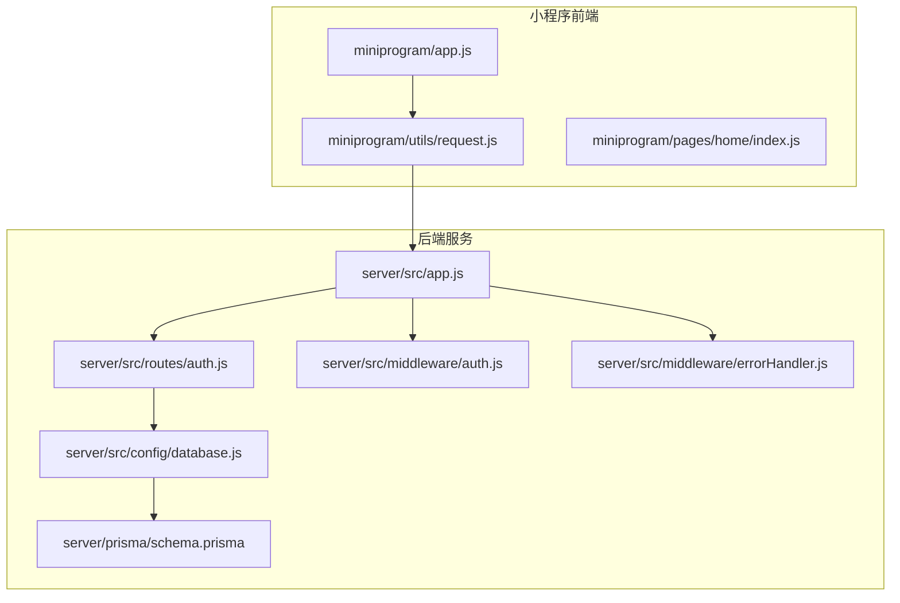
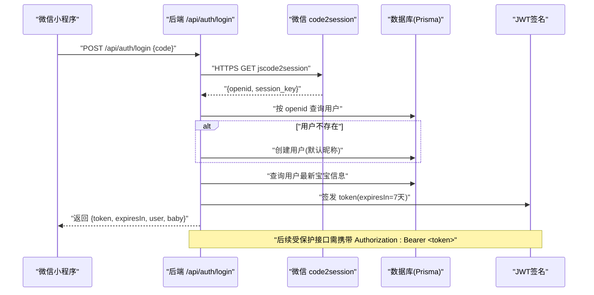
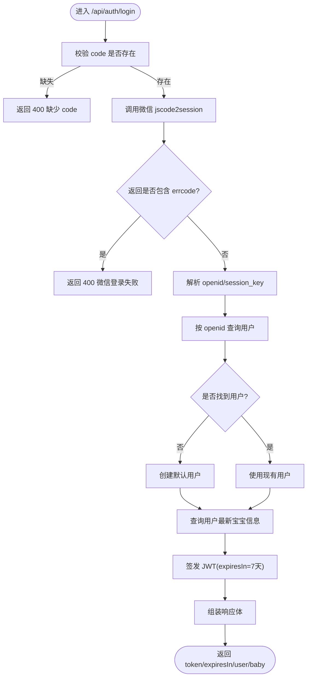
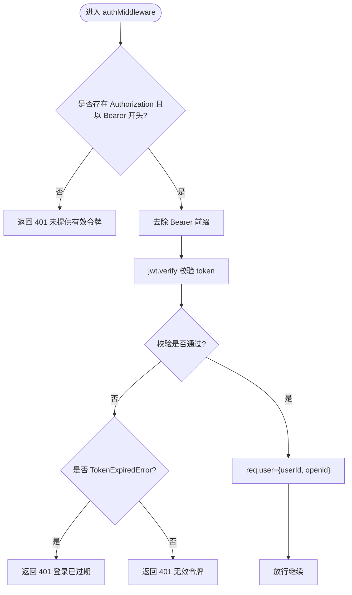
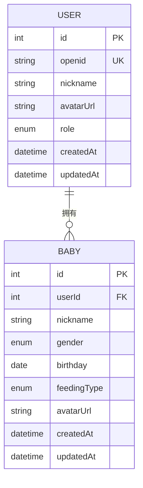
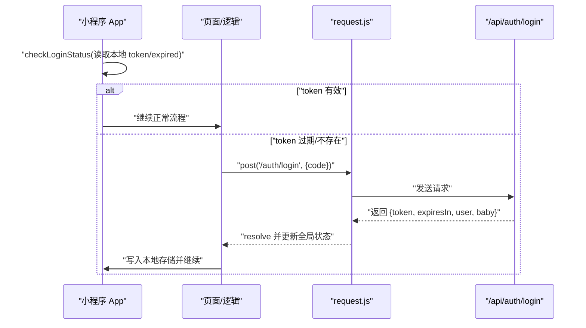
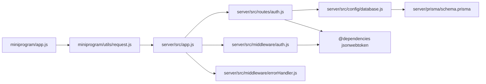

# 用户认证接口

<cite>
**本文引用的文件**
- [server/src/routes/auth.js](file://server/src/routes/auth.js)
- [server/src/middleware/auth.js](file://server/src/middleware/auth.js)
- [server/src/app.js](file://server/src/app.js)
- [server/prisma/schema.prisma](file://server/prisma/schema.prisma)
- [server/src/config/database.js](file://server/src/config/database.js)
- [server/src/middleware/errorHandler.js](file://server/src/middleware/errorHandler.js)
- [server/package.json](file://server/package.json)
- [miniprogram/utils/request.js](file://miniprogram/utils/request.js)
- [miniprogram/app.js](file://miniprogram/app.js)
- [miniprogram/pages/home/index.js](file://miniprogram/pages/home/index.js)
</cite>

## 目录
1. [简介](#简介)
2. [项目结构](#项目结构)
3. [核心组件](#核心组件)
4. [架构总览](#架构总览)
5. [详细组件分析](#详细组件分析)
6. [依赖关系分析](#依赖关系分析)
7. [性能考虑](#性能考虑)
8. [故障排查指南](#故障排查指南)
9. [结论](#结论)
10. [附录](#附录)

## 简介
本文件为“用户认证模块”的技术文档，聚焦于微信小程序登录接口 POST /api/auth/login 的实现原理与使用规范。内容涵盖：
- code 换取 session_key 的流程
- 用户信息查找或创建机制
- JWT 令牌生成与有效期管理
- 请求参数、响应格式、错误处理
- 认证流程图、请求响应示例、常见错误码说明
- 前端实现微信登录与 Token 管理的完整技术参考

## 项目结构
后端采用 Express + Prisma 架构，路由集中在 server/src/routes 下；认证中间件位于 server/src/middleware；数据库模型在 server/prisma/schema.prisma；前端小程序位于 miniprogram。

图表来源
- [server/src/app.js:32-47](file://server/src/app.js#L32-L47)
- [server/src/routes/auth.js:1-84](file://server/src/routes/auth.js#L1-L84)
- [server/src/middleware/auth.js:1-29](file://server/src/middleware/auth.js#L1-L29)
- [server/src/middleware/errorHandler.js:1-52](file://server/src/middleware/errorHandler.js#L1-L52)
- [server/src/config/database.js:1-17](file://server/src/config/database.js#L1-L17)
- [server/prisma/schema.prisma:13-31](file://server/prisma/schema.prisma#L13-L31)

章节来源
- [server/src/app.js:14-47](file://server/src/app.js#L14-L47)
- [server/src/routes/auth.js:1-84](file://server/src/routes/auth.js#L1-L84)
- [server/prisma/schema.prisma:13-31](file://server/prisma/schema.prisma#L13-L31)

## 核心组件
- 登录路由：负责接收小程序传入的 code，调用微信 code2session 获取 openid/session_key，并完成用户查找/创建、查询宝宝信息、签发 JWT。
- 认证中间件：拦截受保护接口，校验 Authorization 头中的 Bearer Token。
- 错误处理中间件：统一捕获并格式化错误，支持 Prisma 已知错误码映射。
- 数据库配置：Prisma 客户端单例，开发环境下开启日志。
- 小程序请求封装：统一注入 Authorization，处理 401 自动重登录。

章节来源
- [server/src/routes/auth.js:10-81](file://server/src/routes/auth.js#L10-L81)
- [server/src/middleware/auth.js:7-26](file://server/src/middleware/auth.js#L7-L26)
- [server/src/middleware/errorHandler.js:6-39](file://server/src/middleware/errorHandler.js#L6-L39)
- [server/src/config/database.js:7-14](file://server/src/config/database.js#L7-L14)
- [miniprogram/utils/request.js:21-73](file://miniprogram/utils/request.js#L21-L73)

## 架构总览
下图展示从微信小程序发起登录请求到返回 JWT 的整体流程，以及后续受保护接口如何通过认证中间件进行鉴权。

图表来源
- [server/src/routes/auth.js:10-81](file://server/src/routes/auth.js#L10-L81)
- [server/src/config/database.js:7-14](file://server/src/config/database.js#L7-L14)
- [server/src/middleware/auth.js:7-26](file://server/src/middleware/auth.js#L7-L26)

## 详细组件分析

### 接口定义：POST /api/auth/login
- 方法：POST
- 路径：/api/auth/login
- 功能：使用微信小程序 code 换取 openid 并签发 JWT，同时返回当前用户与宝宝信息。
- 请求头：Content-Type: application/json
- 请求体参数
  - code: string（必填）- 小程序通过 wx.login 获取的临时登录凭证
- 响应体字段
  - code: number（0 表示成功）
  - message: string
  - data: object
    - token: string（JWT）
    - expiresIn: number（秒，例如 7 天）
    - user: object
      - id: number
      - nickname: string
      - avatarUrl: string
      - role: string（枚举：mother/father/grandparent/other）
    - baby: object|null
      - id: number
      - nickname: string
      - gender: string（枚举：male/female）
      - birthday: string（日期）
      - feedingType: string（枚举：breast/formula/mixed）
      - avatarUrl: string
- 错误码
  - 400：缺少 code 或微信登录失败
  - 401：后续接口未提供或无效的 Bearer Token
  - 429：请求过于频繁（限流）
  - 404：资源不存在（Prisma 映射）
  - 409：唯一约束冲突（Prisma 映射）
  - 500：服务器内部错误

章节来源
- [server/src/routes/auth.js:10-81](file://server/src/routes/auth.js#L10-L81)
- [server/src/middleware/auth.js:10-25](file://server/src/middleware/auth.js#L10-L25)
- [server/src/middleware/errorHandler.js:10-23](file://server/src/middleware/errorHandler.js#L10-L23)
- [server/src/app.js:19-25](file://server/src/app.js#L19-L25)

### 实现流程详解
- 参数校验：若缺失 code，直接返回 400。
- 调用微信接口：构造 HTTPS GET 请求至微信 jscode2session，读取 openid/session_key。
- 用户查找/创建：以 openid 为条件查询用户；若不存在则创建默认昵称为“新用户”的用户。
- 宝宝信息查询：按用户 id 查询最新创建的宝宝信息（按 createdAt 降序取第一条）。
- JWT 签发：使用对称密钥签发 token，设置过期时间（例如 7 天），返回给小程序。
- 响应组装：返回 token、expiresIn、user、baby（可能为空）。

图表来源
- [server/src/routes/auth.js:10-81](file://server/src/routes/auth.js#L10-L81)

章节来源
- [server/src/routes/auth.js:10-81](file://server/src/routes/auth.js#L10-L81)

### 认证中间件：JWT 验证
- 从 Authorization 头提取 Bearer Token
- 校验失败时区分 401（未提供/无效）与过期（TokenExpiredError）
- 成功后将解码后的 {userId, openid} 写入 req.user，继续后续路由

图表来源
- [server/src/middleware/auth.js:7-26](file://server/src/middleware/auth.js#L7-L26)

章节来源
- [server/src/middleware/auth.js:7-26](file://server/src/middleware/auth.js#L7-L26)

### 数据模型与关联
- 用户表 User：包含 openid、昵称、头像、角色等字段，并与宝宝表存在一对多关系。
- 宝宝表 Baby：包含性别、生日、喂养类型等字段，并与用户表存在多对一关系。
- 关系映射与索引在 Prisma Schema 中定义，确保查询效率与数据一致性。

图表来源
- [server/prisma/schema.prisma:14-31](file://server/prisma/schema.prisma#L14-L31)
- [server/prisma/schema.prisma:41-60](file://server/prisma/schema.prisma#L41-L60)

章节来源
- [server/prisma/schema.prisma:14-31](file://server/prisma/schema.prisma#L14-L31)
- [server/prisma/schema.prisma:41-60](file://server/prisma/schema.prisma#L41-L60)

### 前端实现要点（小程序）
- 登录态检查：启动时读取本地存储的 token 与过期时间，判断是否需要重新登录。
- 发起登录：调用 wx.login 获取 code，然后通过封装的 request.post 调用 /api/auth/login。
- 存储与下发：成功后将 token、expiresIn、user、baby 写入全局与本地存储；后续请求自动注入 Authorization: Bearer token。
- Token 过期处理：当收到 401 时，清除本地存储并触发重新登录流程。

图表来源
- [miniprogram/app.js:18-30](file://miniprogram/app.js#L18-L30)
- [miniprogram/app.js:35-50](file://miniprogram/app.js#L35-L50)
- [miniprogram/utils/request.js:21-73](file://miniprogram/utils/request.js#L21-L73)
- [server/src/routes/auth.js:48-77](file://server/src/routes/auth.js#L48-L77)

章节来源
- [miniprogram/app.js:18-30](file://miniprogram/app.js#L18-L30)
- [miniprogram/app.js:35-50](file://miniprogram/app.js#L35-L50)
- [miniprogram/utils/request.js:21-73](file://miniprogram/utils/request.js#L21-L73)
- [server/src/routes/auth.js:48-77](file://server/src/routes/auth.js#L48-L77)

## 依赖关系分析
- Express 应用在启动时注册路由与中间件，/api/auth/* 不需要认证，其他受保护接口需通过 authMiddleware。
- 登录路由依赖 Prisma 客户端与 JWT 库；认证中间件依赖 JWT 库；错误处理中间件统一捕获异常。
- 小程序请求封装依赖全局 app.globalData 与本地存储。

图表来源
- [server/src/app.js:32-47](file://server/src/app.js#L32-L47)
- [server/src/routes/auth.js:1-4](file://server/src/routes/auth.js#L1-L4)
- [server/src/middleware/auth.js:5](file://server/src/middleware/auth.js#L5)
- [server/src/config/database.js:5](file://server/src/config/database.js#L5)
- [server/package.json:14-25](file://server/package.json#L14-L25)
- [miniprogram/utils/request.js:9](file://miniprogram/utils/request.js#L9)

章节来源
- [server/src/app.js:32-47](file://server/src/app.js#L32-L47)
- [server/package.json:14-25](file://server/package.json#L14-L25)

## 性能考虑
- 登录接口涉及外部微信 API 调用，建议：
  - 在服务端对微信接口调用做超时控制与重试策略（当前实现为简单 Promise 包装，可增强）
  - 对频繁重复的 code 使用本地缓存（如 Redis）避免重复调用微信接口
- JWT 过期时间设置为 7 天，建议结合前端 token 刷新策略（当前前端未实现刷新，仅重登）
- 受保护接口已启用全局限流，防止暴力尝试

## 故障排查指南
- 常见错误码与定位
  - 400 缺少 code 或微信登录失败：检查小程序 wx.login 是否成功、后端是否正确接收 code、微信回调地址与 AppID/Secret 配置
  - 401 未提供/无效/已过期：检查前端是否正确存储与注入 Authorization 头；确认 JWT_SECRET 一致且未被篡改
  - 429 请求过于频繁：检查前端重试逻辑与后端限流配置
  - 404/409 Prisma 映射：检查数据库唯一约束与记录存在性
- 日志与调试
  - 开发环境可查看 Prisma 日志（query/warn/error）
  - 统一错误处理中间件会输出错误堆栈，便于定位

章节来源
- [server/src/middleware/errorHandler.js:6-39](file://server/src/middleware/errorHandler.js#L6-L39)
- [server/src/config/database.js:7-9](file://server/src/config/database.js#L7-L9)

## 结论
POST /api/auth/login 提供了从微信 code 到 JWT 的完整链路：安全地调用微信接口、在本地完成用户与宝宝信息的准备、签发短期有效的 JWT，并通过认证中间件保障后续接口的安全访问。前端通过统一请求封装与本地存储实现了良好的登录态管理体验。建议在生产环境中进一步完善微信接口的超时与重试、Token 刷新策略与更细粒度的限流配置。

## 附录

### 请求与响应示例
- 请求示例
  - 方法：POST
  - 路径：/api/auth/login
  - 头部：Content-Type: application/json
  - 示例体：{ "code": "CODE_FROM_WX_LOGIN" }
- 成功响应示例
  - 状态码：200
  - 示例体：
    - code: 0
    - message: "ok"
    - data:
      - token: "JWT_TOKEN_STRING"
      - expiresIn: 604800
      - user:
        - id: 1
        - nickname: "新用户"
        - avatarUrl: ""
        - role: "mother"
      - baby: null
- 失败响应示例
  - 缺少 code：{ code: 400, message: "缺少 code 参数" }
  - 微信登录失败：{ code: 400, message: "微信登录失败: ..." }
  - 401 未提供有效令牌：{ code: 401, message: "未提供有效的认证令牌" }

章节来源
- [server/src/routes/auth.js:12-15](file://server/src/routes/auth.js#L12-L15)
- [server/src/routes/auth.js:28-30](file://server/src/routes/auth.js#L28-L30)
- [server/src/middleware/auth.js:10-11](file://server/src/middleware/auth.js#L10-L11)
- [server/src/app.js:28-30](file://server/src/app.js#L28-L30)

### 常见错误码说明
- 400：缺少必要参数或第三方接口调用失败
- 401：未提供有效 Bearer Token、Token 无效或已过期
- 404：数据库记录不存在（Prisma 映射）
- 409：唯一约束冲突（Prisma 映射）
- 429：请求过于频繁（限流）
- 500：服务器内部错误

章节来源
- [server/src/middleware/errorHandler.js:10-23](file://server/src/middleware/errorHandler.js#L10-L23)
- [server/src/app.js:19-25](file://server/src/app.js#L19-L25)