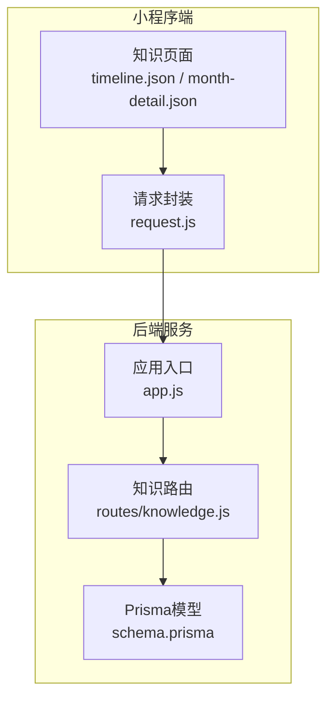
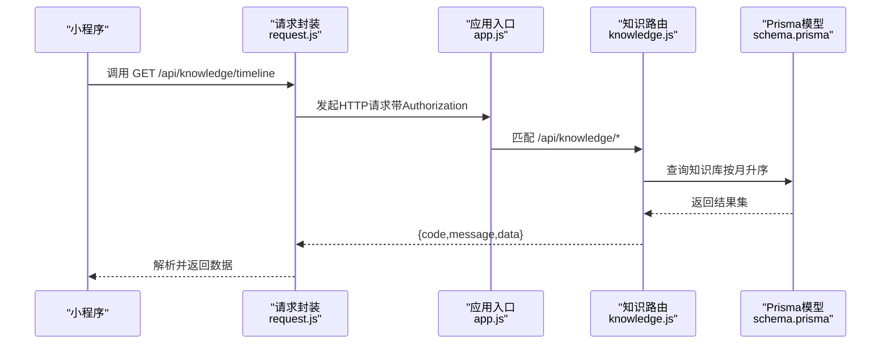
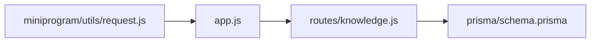

# 知识百科接口

<cite>
**本文引用的文件**
- [server/src/app.js](file://server/src/app.js)
- [server/src/routes/knowledge.js](file://server/src/routes/knowledge.js)
- [server/prisma/schema.prisma](file://server/prisma/schema.prisma)
- [miniprogram/utils/request.js](file://miniprogram/utils/request.js)
- [miniprogram/pages/knowledge/timeline.json](file://miniprogram/pages/knowledge/timeline.json)
- [miniprogram/pages/knowledge/month-detail.json](file://miniprogram/pages/knowledge/month-detail.json)
</cite>

## 目录
1. [简介](#简介)
2. [项目结构](#项目结构)
3. [核心组件](#核心组件)
4. [架构总览](#架构总览)
5. [详细组件分析](#详细组件分析)
6. [依赖关系分析](#依赖关系分析)
7. [性能考量](#性能考量)
8. [故障排查指南](#故障排查指南)
9. [结论](#结论)
10. [附录](#附录)

## 简介
本文件为“知识百科”模块的详细API文档，覆盖以下能力与范围：
- 按月龄分类的知识检索（0-12月）
- 某月全部知识列表
- 某月某板块详情
- 知识库数据结构与分类体系
- 收藏与历史记录的扩展接口（当前后端未提供，但可基于现有模型扩展）

说明：
- 当前后端未提供关键词搜索、分页查询、阅读历史记录等接口；本文在“功能现状”中明确列出，并给出基于现有模型的扩展建议。

## 项目结构
- 后端采用Express + Prisma，路由集中在 /api/knowledge 下
- 小程序端通过统一请求封装访问后端接口
- 数据模型定义于 Prisma Schema 中，包含知识库、收藏等核心实体

图表来源
- [server/src/app.js:32-47](file://server/src/app.js#L32-L47)
- [server/src/routes/knowledge.js:1-58](file://server/src/routes/knowledge.js#L1-L58)
- [server/prisma/schema.prisma:144-188](file://server/prisma/schema.prisma#L144-L188)
- [miniprogram/utils/request.js:11](file://miniprogram/utils/request.js#L11)

章节来源
- [server/src/app.js:32-47](file://server/src/app.js#L32-L47)
- [server/src/routes/knowledge.js:1-58](file://server/src/routes/knowledge.js#L1-L58)
- [server/prisma/schema.prisma:144-188](file://server/prisma/schema.prisma#L144-L188)
- [miniprogram/pages/knowledge/timeline.json:1-4](file://miniprogram/pages/knowledge/timeline.json#L1-L4)
- [miniprogram/pages/knowledge/month-detail.json:1-4](file://miniprogram/pages/knowledge/month-detail.json#L1-L4)

## 核心组件
- 知识路由控制器：提供按时间线、按月、按板块的知识查询接口
- 数据模型：知识库、收藏、用户等模型定义
- 请求封装：小程序端统一HTTP请求与鉴权头注入

章节来源
- [server/src/routes/knowledge.js:5-56](file://server/src/routes/knowledge.js#L5-L56)
- [server/prisma/schema.prisma:144-188](file://server/prisma/schema.prisma#L144-L188)
- [miniprogram/utils/request.js:21-73](file://miniprogram/utils/request.js#L21-L73)

## 架构总览
- 接口路径前缀：/api
- 知识模块路由：/api/knowledge
- 认证中间件：后端对部分路由启用鉴权（如 /api/babies、/api/chat 等），知识模块未强制要求登录
- 错误处理：全局中间件统一处理错误与404

图表来源
- [server/src/app.js:32-47](file://server/src/app.js#L32-L47)
- [server/src/routes/knowledge.js:5-26](file://server/src/routes/knowledge.js#L5-L26)
- [server/prisma/schema.prisma:144-159](file://server/prisma/schema.prisma#L144-L159)
- [miniprogram/utils/request.js:21-73](file://miniprogram/utils/request.js#L21-L73)

## 详细组件分析

### 接口清单与规范

- 获取0-12月龄概览（按月分组）
  - 方法：GET
  - 路径：/api/knowledge/timeline
  - 认证：否
  - 请求参数：无
  - 响应字段：
    - code：状态码（0表示成功）
    - message：描述
    - data：数组，元素为对象，包含
      - month：整数，月龄
      - sections：数组，元素为对象，包含
        - section：板块枚举
        - title：标题
  - 排序规则：按月升序
  - 过滤条件：无
  - 示例调用路径：[server/src/routes/knowledge.js:5-26](file://server/src/routes/knowledge.js#L5-L26)

- 获取某月全部知识
  - 方法：GET
  - 路径：/api/knowledge/:month
  - 路径参数：
    - month：整数，0-12
  - 认证：否
  - 请求参数：无
  - 响应字段：
    - code：状态码（0表示成功）
    - message：描述
    - data：数组，元素为知识条目，包含
      - month：整数
      - section：板块枚举
      - title：标题
      - content：内容
      - summary：摘要
      - source：来源
      - embeddingId：向量ID（可选）
      - createdAt/updatedAt：时间戳
  - 排序规则：按板块升序
  - 过滤条件：按month筛选
  - 示例调用路径：[server/src/routes/knowledge.js:28-40](file://server/src/routes/knowledge.js#L28-L40)

- 获取某月某板块详情
  - 方法：GET
  - 路径：/api/knowledge/:month/:section
  - 路径参数：
    - month：整数，0-12
    - section：板块枚举（physiology/abilities/feeding/sleep/common_issues/early_education）
  - 认证：否
  - 请求参数：无
  - 响应字段：
    - code：状态码（0表示成功；404表示知识内容不存在）
    - message：描述
    - data：知识条目（同上）
  - 错误处理：当唯一键不存在时返回404
  - 示例调用路径：[server/src/routes/knowledge.js:42-56](file://server/src/routes/knowledge.js#L42-L56)

章节来源
- [server/src/routes/knowledge.js:5-56](file://server/src/routes/knowledge.js#L5-L56)

### 数据模型与分类体系

- 知识库模型（KnowledgeBase）
  - 字段要点：
    - month：整数，0-12
    - section：枚举，板块类型
    - title/content/summary/source：标题、内容、摘要、来源
    - embeddingId：向量化ID（用于后续推荐/检索扩展）
    - createdAt/updatedAt：时间戳
  - 约束：month+section唯一组合
  - 参考路径：[server/prisma/schema.prisma:144-159](file://server/prisma/schema.prisma#L144-L159)

- 板块枚举（KnowledgeSection）
  - 取值：physiology、abilities、feeding、sleep、common_issues、early_education
  - 参考路径：[server/prisma/schema.prisma:161-168](file://server/prisma/schema.prisma#L161-L168)

- 收藏模型（Favorite）
  - 用途：支持收藏管理（当前知识接口未提供收藏相关接口）
  - 参考路径：[server/prisma/schema.prisma:170-188](file://server/prisma/schema.prisma#L170-L188)

```mermaid
erDiagram
KNOWLEDGEBASE {
int id PK
tinyint month
enum section
varchar title
text content
varchar summary
varchar embedding_id
varchar source
datetime created_at
datetime updated_at
}
FAVORITE {
int id PK
int user_id FK
enum target_type
int target_id
datetime created_at
}
USER {
int id PK
}
KNOWLEDGEBASE ||--o{ FAVORITE : "被收藏"
USER ||--o{ FAVORITE : "收藏者"
```

图表来源
- [server/prisma/schema.prisma:144-188](file://server/prisma/schema.prisma#L144-L188)

章节来源
- [server/prisma/schema.prisma:144-188](file://server/prisma/schema.prisma#L144-L188)

### 前端页面与调用关系
- 页面配置
  - 时间线页面：navigationBarTitleText 设置为“安心育儿”
  - 月详情页面：navigationBarTitleText 设置为“安心育儿”
- 请求封装
  - 统一baseUrl：http://localhost:3000/api
  - 自动注入Authorization头（若存在token）
  - 统一错误处理与加载提示
- 参考路径：
  - [miniprogram/pages/knowledge/timeline.json:1-4](file://miniprogram/pages/knowledge/timeline.json#L1-L4)
  - [miniprogram/pages/knowledge/month-detail.json:1-4](file://miniprogram/pages/knowledge/month-detail.json#L1-L4)
  - [miniprogram/utils/request.js:11](file://miniprogram/utils/request.js#L11)
  - [miniprogram/utils/request.js:21-73](file://miniprogram/utils/request.js#L21-L73)

章节来源
- [miniprogram/pages/knowledge/timeline.json:1-4](file://miniprogram/pages/knowledge/timeline.json#L1-L4)
- [miniprogram/pages/knowledge/month-detail.json:1-4](file://miniprogram/pages/knowledge/month-detail.json#L1-L4)
- [miniprogram/utils/request.js:11](file://miniprogram/utils/request.js#L11)
- [miniprogram/utils/request.js:21-73](file://miniprogram/utils/request.js#L21-L73)

### 功能现状与扩展建议

- 已实现
  - 按月龄时间线概览（分组展示）
  - 按月查询全部知识
  - 按月+板块查询详情

- 未实现（当前后端未提供）
  - 关键词搜索：建议在知识库content/summary字段建立索引，并新增搜索接口
  - 分页查询：建议在知识查询接口增加page/size参数
  - 阅读历史记录：建议新增History模型与接口
  - 收藏管理：建议新增收藏/取消收藏接口，并在知识详情中返回是否已收藏

- 扩展接口建议（基于现有模型）
  - 新增收藏接口（示例）：
    - POST /api/favorites
      - 请求体：{ targetType: "knowledge", targetId: 知识ID }
      - 响应：{ code, message, data: { id } }
    - DELETE /api/favorites/{id}
  - 新增历史记录接口（示例）：
    - POST /api/history
      - 请求体：{ targetType: "knowledge", targetId: 知识ID }
      - 响应：{ code, message }

章节来源
- [server/prisma/schema.prisma:170-188](file://server/prisma/schema.prisma#L170-L188)

## 依赖关系分析

图表来源
- [server/src/app.js:32-47](file://server/src/app.js#L32-L47)
- [server/src/routes/knowledge.js:1-58](file://server/src/routes/knowledge.js#L1-L58)
- [server/prisma/schema.prisma:144-159](file://server/prisma/schema.prisma#L144-L159)
- [miniprogram/utils/request.js:21-73](file://miniprogram/utils/request.js#L21-L73)

章节来源
- [server/src/app.js:32-47](file://server/src/app.js#L32-L47)
- [server/src/routes/knowledge.js:1-58](file://server/src/routes/knowledge.js#L1-L58)
- [server/prisma/schema.prisma:144-159](file://server/prisma/schema.prisma#L144-L159)
- [miniprogram/utils/request.js:21-73](file://miniprogram/utils/request.js#L21-L73)

## 性能考量
- 限流策略：全局每IP每分钟最多60次请求
- 查询优化：
  - timeline接口按month升序，适合小数据量场景
  - 单条查询使用month+section唯一索引，命中率高
- 建议：
  - 若知识库规模扩大，建议在content/summary字段建立全文索引以支持搜索
  - 在知识列表接口增加分页参数，避免一次性返回过多数据

章节来源
- [server/src/app.js:19-25](file://server/src/app.js#L19-L25)
- [server/src/routes/knowledge.js:8-11](file://server/src/routes/knowledge.js#L8-L11)
- [server/prisma/schema.prisma:157](file://server/prisma/schema.prisma#L157)

## 故障排查指南
- 常见错误与处理
  - 404：知识内容不存在（单条查询未命中）
  - 401：令牌过期（请求封装中自动触发重新登录）
  - 429：请求过于频繁（全局限流）
  - 服务器错误：HTTP状态码非200
- 建议排查步骤
  - 确认请求URL与路径参数（month、section）
  - 检查Authorization头是否正确注入
  - 查看后端日志与Prisma查询执行情况
  - 对照接口返回的code/message定位问题

章节来源
- [server/src/routes/knowledge.js:49-50](file://server/src/routes/knowledge.js#L49-L50)
- [miniprogram/utils/request.js:48-62](file://miniprogram/utils/request.js#L48-L62)
- [server/src/app.js:19-25](file://server/src/app.js#L19-L25)

## 结论
- 现有知识百科接口已满足按月龄时间线浏览、按月查询与按板块详情查看的基本需求
- 数据模型清晰，板块枚举完整，具备良好的扩展性
- 建议尽快补齐搜索、分页、收藏与历史记录等能力，以提升用户体验与产品完整性

## 附录

### 请求与响应示例（字段说明）
- 通用响应结构
  - code：数字，0表示成功
  - message：字符串，描述
  - data：任意，具体接口返回的数据主体
- timeline接口返回片段
  - data：数组，元素包含month与sections
  - sections：数组，元素包含section与title
- 列表接口返回片段
  - data：数组，元素为知识条目（含month、section、title、content、summary、source等）
- 详情接口返回片段
  - data：单个知识条目（含createdAt/updatedAt）

章节来源
- [server/src/routes/knowledge.js:5-56](file://server/src/routes/knowledge.js#L5-L56)