# UI组件库

<cite>
**本文引用的文件**
- [app.json](file://miniprogram/app.json)
- [app.wxss](file://miniprogram/app.wxss)
- [home/index.json](file://miniprogram/pages/home/index.json)
- [home/index.wxml](file://miniprogram/pages/home/index.wxml)
- [home/index.wxss](file://miniprogram/pages/home/index.wxss)
- [request.js](file://miniprogram/utils/request.js)
- [ageCalculator.js](file://miniprogram/utils/ageCalculator.js)
</cite>

## 目录
1. [简介](#简介)
2. [项目结构](#项目结构)
3. [核心组件](#核心组件)
4. [架构总览](#架构总览)
5. [详细组件分析](#详细组件分析)
6. [依赖关系分析](#依赖关系分析)
7. [性能考量](#性能考量)
8. [故障排查指南](#故障排查指南)
9. [结论](#结论)
10. [附录](#附录)

## 简介
本设计文档面向“AI育儿助手”小程序的UI组件库，系统梳理了设计原则、样式管理策略、主题定制方案与页面布局结构；并结合现有页面与样式文件，总结出表单、列表、卡片等常用UI元素的设计模式与使用方法。文档同时覆盖CSS样式组织、WXSS最佳实践、动画效果实现与无障碍访问支持建议，并提供完整的UI组件开发指南与设计规范。

## 项目结构
小程序采用按页面分层的组织方式：全局样式与应用配置位于根目录，页面按功能域划分在 pages 下，公共样式与工具函数分别放置于 styles 与 utils 目录。当前仓库中未发现独立的 components 目录，UI组件以页面级样式与通用样式为主，形成“页面样式 + 全局样式”的组合。

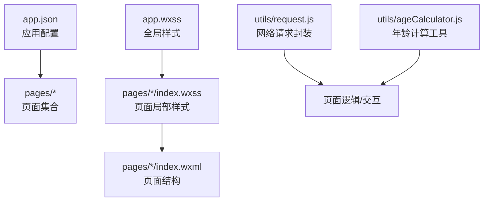

图表来源
- [app.json:1-60](file://miniprogram/app.json#L1-L60)
- [app.wxss:1-313](file://miniprogram/app.wxss#L1-L313)
- [home/index.wxml:1-86](file://miniprogram/pages/home/index.wxml#L1-L86)
- [home/index.wxss:1-221](file://miniprogram/pages/home/index.wxss#L1-L221)
- [request.js:1-97](file://miniprogram/utils/request.js#L1-L97)
- [ageCalculator.js:1-86](file://miniprogram/utils/ageCalculator.js#L1-L86)

章节来源
- [app.json:1-60](file://miniprogram/app.json#L1-L60)
- [app.wxss:1-313](file://miniprogram/app.wxss#L1-L313)

## 核心组件
本项目通过“页面样式 + 通用样式”实现UI组件化，核心组件包括：
- 卡片组件：统一圆角、阴影、内边距与背景色，适用于信息区块展示。
- 文字排版：标题、副标题、正文、说明、标签等层级化字体规范。
- 按钮组件：主按钮与次按钮两类，统一圆角、尺寸与交互反馈。
- 渐变背景：多场景主题色渐变容器，用于强调与视觉引导。
- 阴影系统：提供轻、中、重三档阴影，增强层次感。
- 安全区域：适配刘海屏与底部安全区的内边距工具类。
- Flex 工具类：快速构建弹性布局与对齐方式。
- 间距工具类：基于 8rpx 的间距系统，统一页面留白。
- 动画与骨架屏：卡片入场动画与骨架屏加载态，提升体验。
- 空状态：统一的空数据提示样式，含表情、标题与描述。

章节来源
- [app.wxss:57-313](file://miniprogram/app.wxss#L57-L313)

## 架构总览
UI架构由“全局设计系统变量 + 页面局部样式 + 页面结构”三层构成。全局样式定义设计令牌（颜色、间距、圆角、字体），页面样式复用通用类并叠加局部布局，页面结构通过 WXML 使用类名与数据绑定。

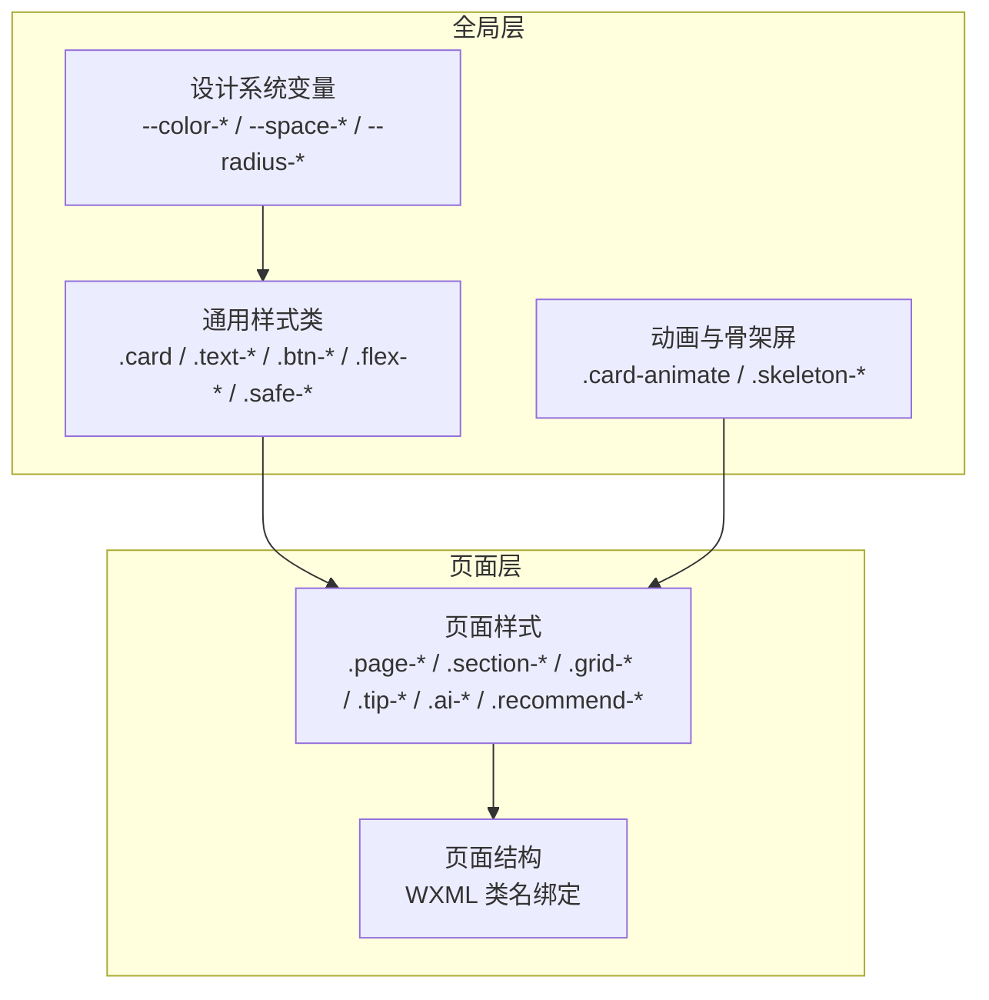

图表来源
- [app.wxss:6-55](file://miniprogram/app.wxss#L6-L55)
- [app.wxss:57-313](file://miniprogram/app.wxss#L57-L313)
- [home/index.wxss:3-221](file://miniprogram/pages/home/index.wxss#L3-L221)
- [home/index.wxml:1-86](file://miniprogram/pages/home/index.wxml#L1-L86)

## 详细组件分析

### 卡片组件（Card）
- 设计要点：统一圆角、阴影、内边距与背景色；标题区支持图标与标题组合。
- 使用模式：页面区块容器，配合动画类实现逐项入场；支持多种渐变背景作为强调容器。
- 样式规范：卡片标题使用字号与字重规范；图标尺寸与间距遵循统一规范。

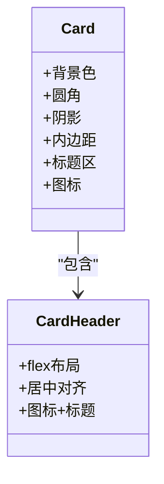

图表来源
- [app.wxss:57-83](file://miniprogram/app.wxss#L57-L83)
- [home/index.wxss:70-78](file://miniprogram/pages/home/index.wxss#L70-L78)

章节来源
- [app.wxss:57-83](file://miniprogram/app.wxss#L57-L83)
- [home/index.wxss:70-78](file://miniprogram/pages/home/index.wxss#L70-L78)

### 文字排版（Typography）
- 层级规范：标题、副标题、正文、说明、标签，分别对应字号、字重与颜色。
- 适用场景：卡片标题、页面标题、列表项描述、辅助信息与标签文案。

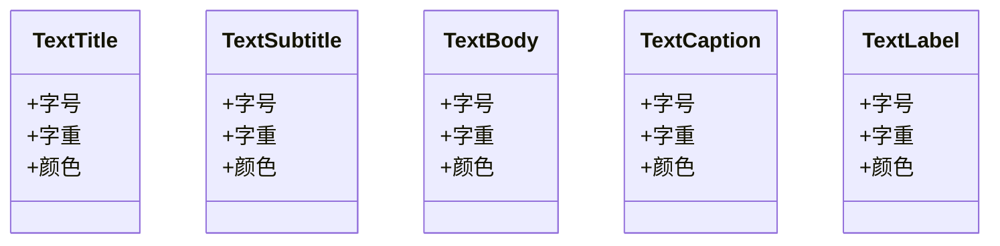

图表来源
- [app.wxss:84-113](file://miniprogram/app.wxss#L84-L113)

章节来源
- [app.wxss:84-113](file://miniprogram/app.wxss#L84-L113)

### 按钮组件（Button）
- 主按钮：圆角胶囊形，强调主操作；按下态变更背景色。
- 次按钮：带描边的次要操作按钮，突出主按钮优先级。
- 交互反馈：伪元素移除默认边框，按下态提供深色反馈。

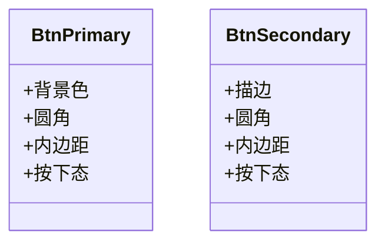

图表来源
- [app.wxss:115-151](file://miniprogram/app.wxss#L115-L151)

章节来源
- [app.wxss:115-151](file://miniprogram/app.wxss#L115-L151)

### 渐变背景（Gradient）
- 多场景主题色：主色、暖色、薄荷绿、睡眠、喂养等，用于卡片或入口强调。
- 使用建议：与卡片组件组合，突出重要入口或功能模块。

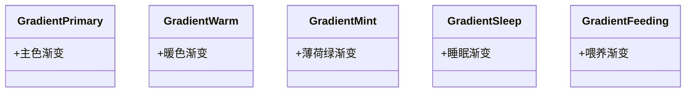

图表来源
- [app.wxss:152-171](file://miniprogram/app.wxss#L152-L171)

章节来源
- [app.wxss:152-171](file://miniprogram/app.wxss#L152-L171)

### 阴影系统（Shadow）
- 轻/中/重三档阴影，用于区分层级与提升可读性。
- 使用建议：卡片与模态容器建议使用中阴影，悬浮元素使用轻阴影。

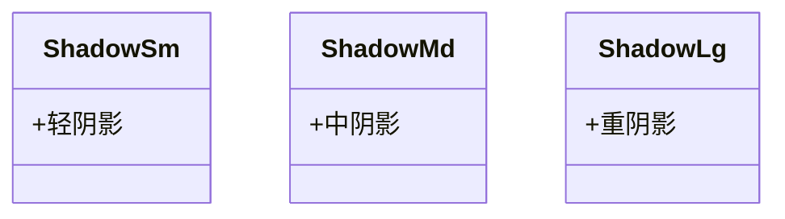

图表来源
- [app.wxss:173-184](file://miniprogram/app.wxss#L173-L184)

章节来源
- [app.wxss:173-184](file://miniprogram/app.wxss#L173-L184)

### 安全区域（Safe Area）
- 工具类：顶部与底部安全区内边距，适配刘海屏与底部胶囊条。
- 使用建议：页面容器与弹窗底部均应考虑安全区。

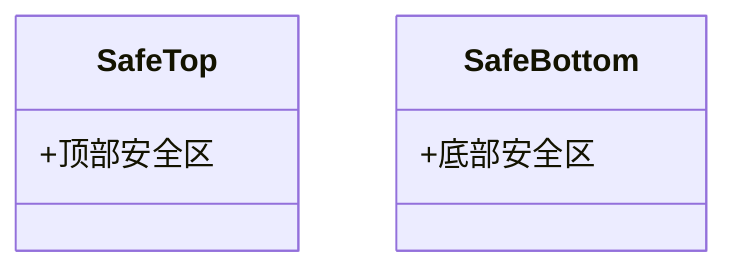

图表来源
- [app.wxss:186-193](file://miniprogram/app.wxss#L186-L193)

章节来源
- [app.wxss:186-193](file://miniprogram/app.wxss#L186-L193)

### Flex 工具类（Flex Utilities）
- 快速布局：水平/垂直居中、两端对齐、列向布局、换行、伸缩等。
- 使用建议：优先使用工具类减少重复样式。

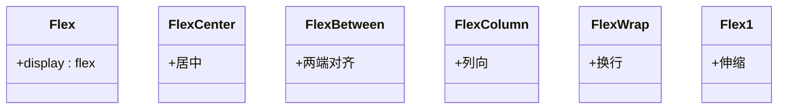

图表来源
- [app.wxss:195-224](file://miniprogram/app.wxss#L195-L224)

章节来源
- [app.wxss:195-224](file://miniprogram/app.wxss#L195-L224)

### 间距工具类（Space Utilities）
- 基于 8rpx 的间距系统，提供上下左右与内边距工具类。
- 使用建议：统一使用变量，避免硬编码。

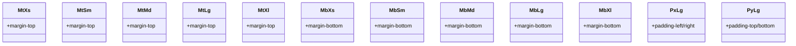

图表来源
- [app.wxss:225-240](file://miniprogram/app.wxss#L225-L240)

章节来源
- [app.wxss:225-240](file://miniprogram/app.wxss#L225-L240)

### 动画与骨架屏（Animation & Skeleton）
- 卡片入场动画：从下向上淡入，配合延迟实现顺序出现。
- 骨架屏：线性渐变 + 滑动动画，模拟加载态，提升感知速度。
- 使用建议：长列表与异步数据建议使用骨架屏。

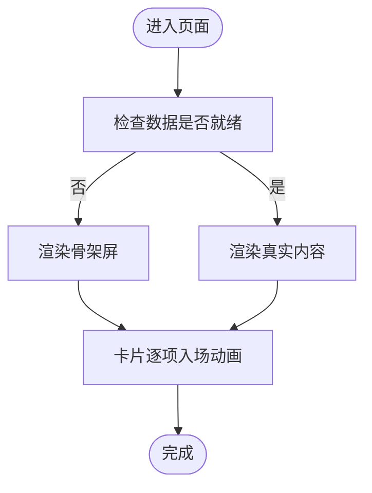

图表来源
- [app.wxss:241-287](file://miniprogram/app.wxss#L241-L287)
- [home/index.wxml:4-23](file://miniprogram/pages/home/index.wxml#L4-L23)

章节来源
- [app.wxss:241-287](file://miniprogram/app.wxss#L241-L287)
- [home/index.wxml:4-23](file://miniprogram/pages/home/index.wxml#L4-L23)

### 空状态（Empty State）
- 统一的空数据提示：表情、标题、描述与操作按钮。
- 使用建议：与骨架屏配合，保证用户感知一致。

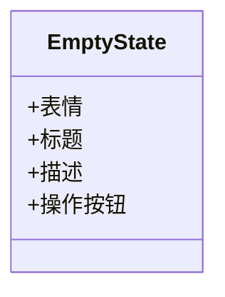

图表来源
- [app.wxss:288-313](file://miniprogram/app.wxss#L288-L313)
- [home/index.wxml:78-84](file://miniprogram/pages/home/index.wxml#L78-L84)

章节来源
- [app.wxss:288-313](file://miniprogram/app.wxss#L288-L313)
- [home/index.wxml:78-84](file://miniprogram/pages/home/index.wxml#L78-L84)

### 页面布局结构（Home 首页）
- 宝宝日龄卡片：头像、姓名、日龄与身高体重统计。
- 快捷功能网格：四宫格入口，支持点击跳转。
- 本月发育提醒：列表形式展示关注点。
- AI 入口卡片：强调入口，引导用户使用AI助手。
- 今日推荐：图文混排列表，支持点击跳转详情。
- 空状态：无宝宝信息时的引导。

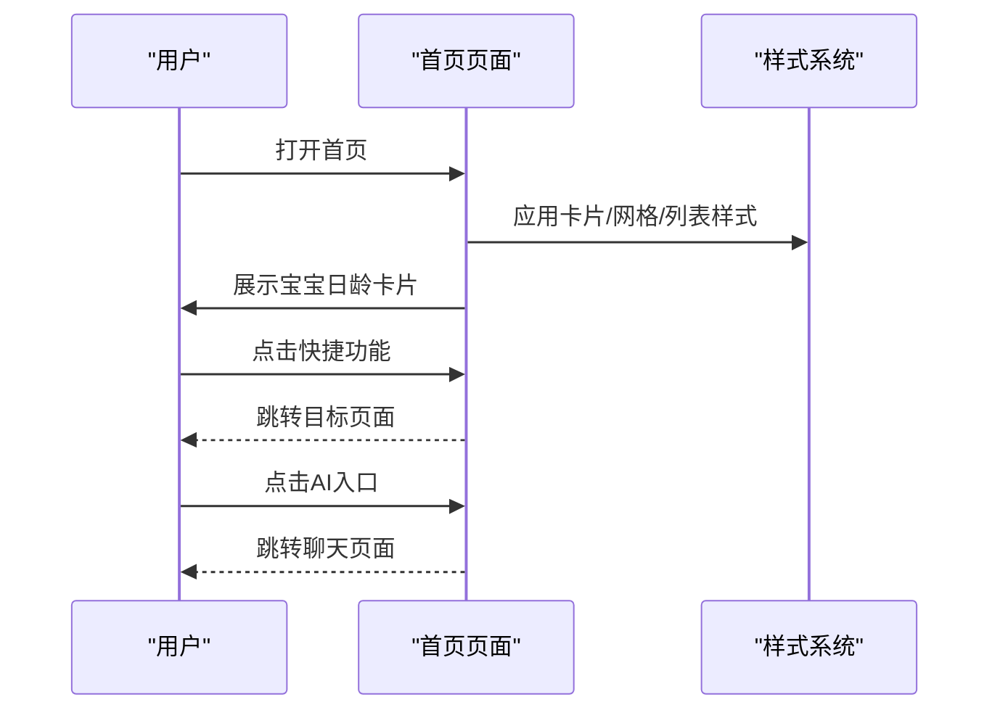

图表来源
- [home/index.wxml:1-86](file://miniprogram/pages/home/index.wxml#L1-L86)
- [home/index.wxss:3-221](file://miniprogram/pages/home/index.wxss#L3-L221)
- [home/index.json:1-5](file://miniprogram/pages/home/index.json#L1-L5)

章节来源
- [home/index.wxml:1-86](file://miniprogram/pages/home/index.wxml#L1-L86)
- [home/index.wxss:3-221](file://miniprogram/pages/home/index.wxss#L3-L221)
- [home/index.json:1-5](file://miniprogram/pages/home/index.json#L1-L5)

## 依赖关系分析
- 全局样式依赖设计系统变量，页面样式依赖通用类，页面结构依赖样式类与数据绑定。
- 工具函数与网络请求封装为页面交互提供支撑，但不直接参与UI组件样式。

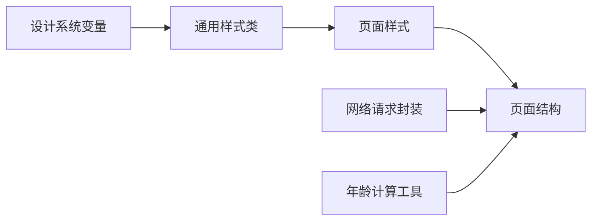

图表来源
- [app.wxss:6-55](file://miniprogram/app.wxss#L6-L55)
- [app.wxss:57-313](file://miniprogram/app.wxss#L57-L313)
- [home/index.wxss:3-221](file://miniprogram/pages/home/index.wxss#L3-L221)
- [home/index.wxml:1-86](file://miniprogram/pages/home/index.wxml#L1-L86)
- [request.js:1-97](file://miniprogram/utils/request.js#L1-L97)
- [ageCalculator.js:1-86](file://miniprogram/utils/ageCalculator.js#L1-L86)

章节来源
- [app.wxss:6-55](file://miniprogram/app.wxss#L6-L55)
- [app.wxss:57-313](file://miniprogram/app.wxss#L57-L313)
- [request.js:1-97](file://miniprogram/utils/request.js#L1-L97)
- [ageCalculator.js:1-86](file://miniprogram/utils/ageCalculator.js#L1-L86)

## 性能考量
- 动画与骨架屏：合理使用入场动画与骨架屏，避免过度动画导致卡顿。
- 图片与资源：头像与封面图使用合适的尺寸与模式，减少内存占用。
- 数据加载：结合骨架屏与分页加载，优化首屏与长列表性能。
- 样式体积：复用通用类，避免重复定义相同规则，降低WXSS体积。

## 故障排查指南
- 网络请求失败：统一错误提示与状态码处理，必要时引导用户重试或检查网络。
- Token 过期：清理本地存储并触发登录流程，确保全局状态同步。
- 加载态异常：确认加载开关与隐藏时机，避免遮罩无法关闭。
- 字体与图标：确保字体文件与图标资源路径正确，避免空白或加载失败。

章节来源
- [request.js:38-72](file://miniprogram/utils/request.js#L38-L72)
- [request.js:78-86](file://miniprogram/utils/request.js#L78-L86)

## 结论
本UI组件库以“设计系统变量 + 通用样式类 + 页面局部样式”的方式实现了高内聚、低耦合的样式体系。通过卡片、文字、按钮、渐变、阴影、安全区、Flex与间距等通用组件，结合动画与骨架屏，形成了一套适合育儿场景的视觉与交互规范。建议后续在现有基础上沉淀独立组件目录，完善表单与列表组件的通用能力，并补充无障碍访问与跨设备兼容性测试。

## 附录
- 设计系统变量清单（颜色、间距、圆角、字体）可参考全局样式文件。
- 页面样式命名建议遵循 BEM 或领域前缀（如 .page-*, .section-*, .grid-*, .tip-*, .ai-*, .recommend-*），保持一致性。
- 动画与骨架屏建议统一入口与参数，便于维护与扩展。