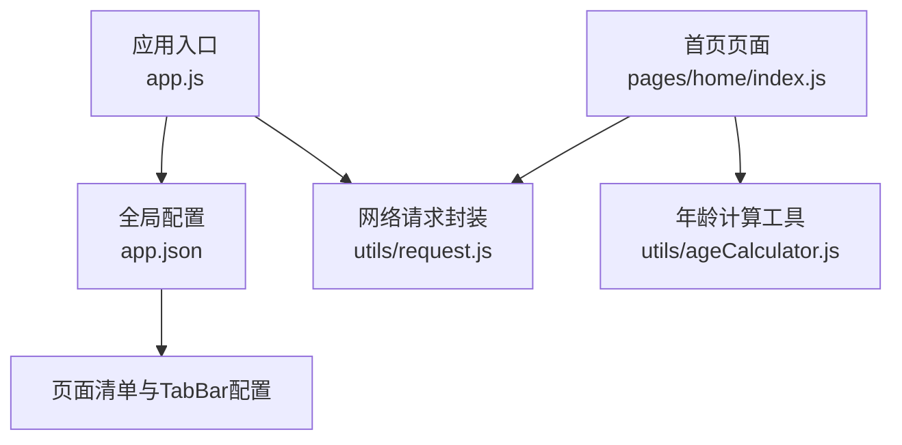
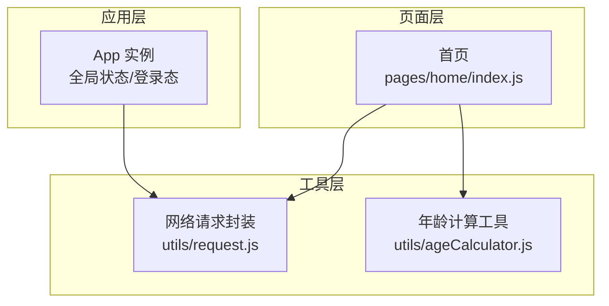
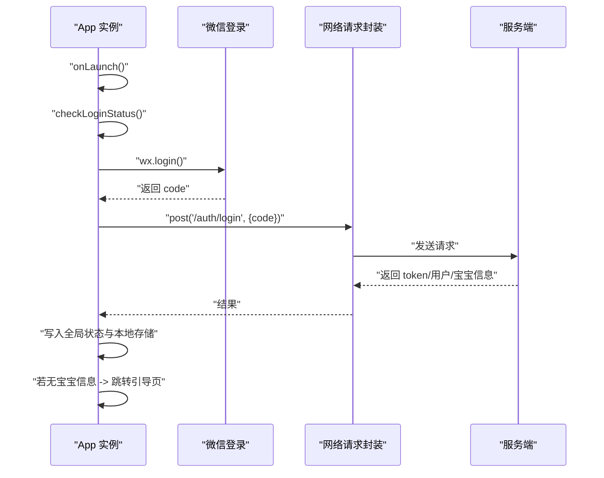
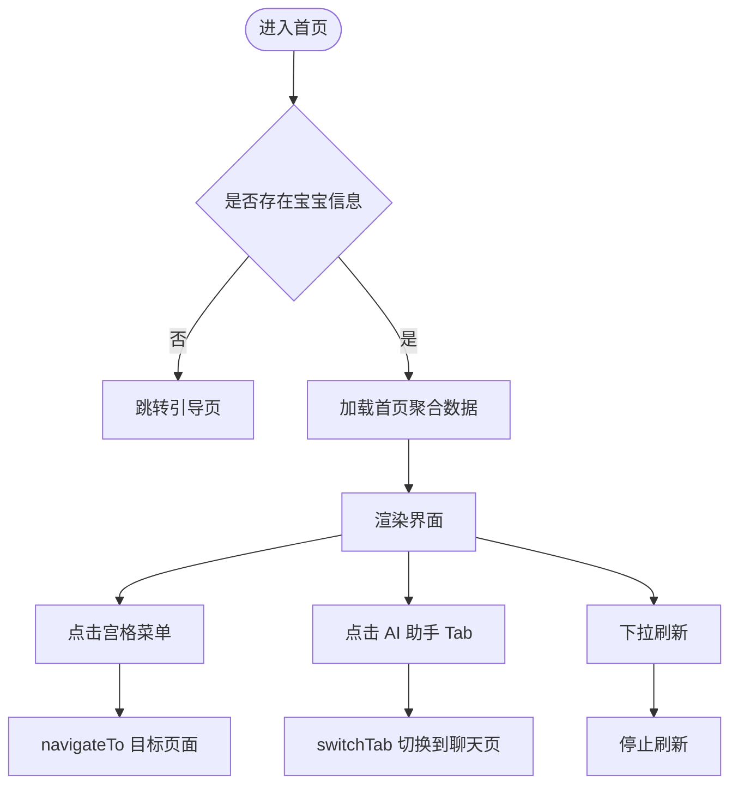
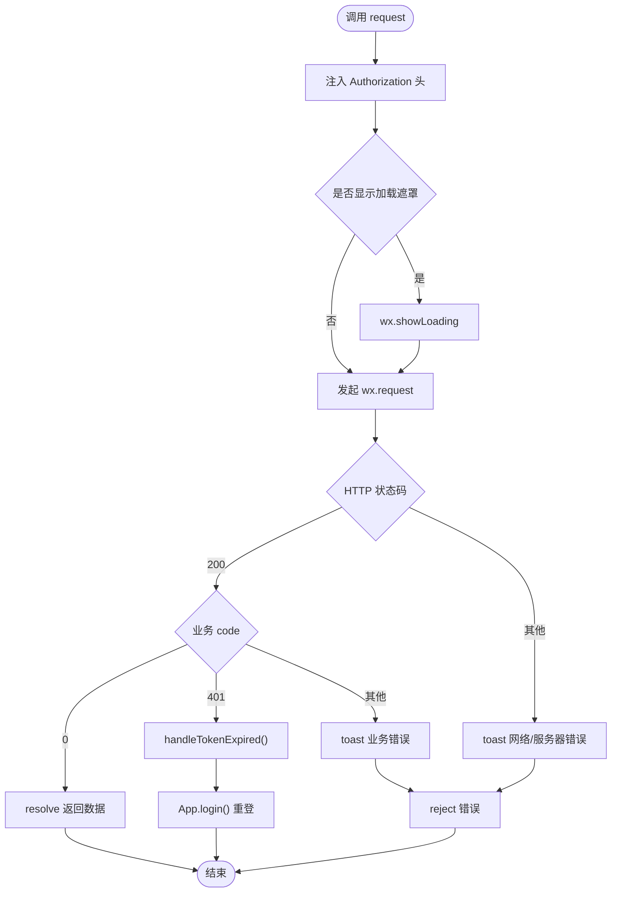
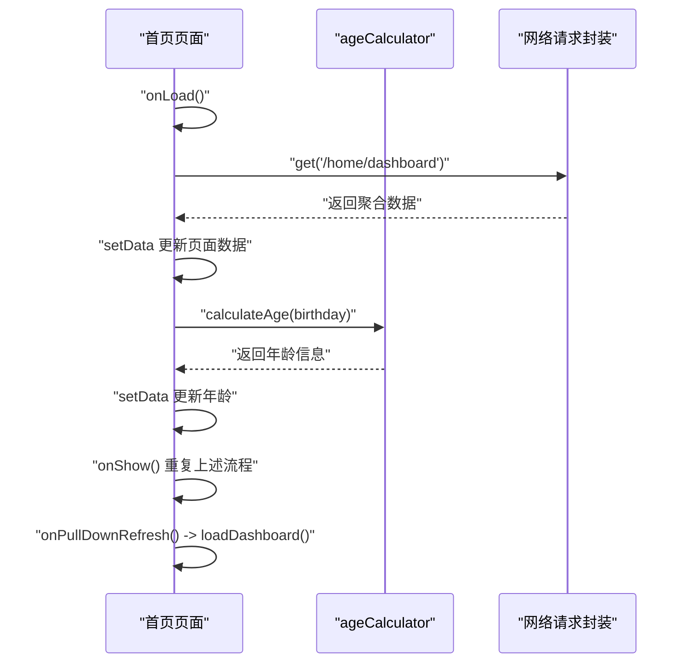
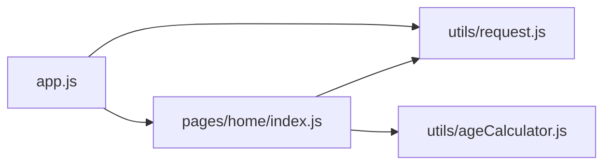

# 前端架构

<cite>
**本文引用的文件**
- [app.js](file://miniprogram/app.js)
- [app.json](file://miniprogram/app.json)
- [request.js](file://miniprogram/utils/request.js)
- [ageCalculator.js](file://miniprogram/utils/ageCalculator.js)
- [home/index.js](file://miniprogram/pages/home/index.js)
</cite>

## 目录
1. [简介](#简介)
2. [项目结构](#项目结构)
3. [核心组件](#核心组件)
4. [架构总览](#架构总览)
5. [详细组件分析](#详细组件分析)
6. [依赖分析](#依赖分析)
7. [性能考虑](#性能考虑)
8. [故障排查指南](#故障排查指南)
9. [结论](#结论)
10. [附录](#附录)

## 简介
本文件面向“AI育儿助手”微信小程序前端，系统性梳理整体架构与实现要点，覆盖页面路由体系、组件化开发模式、状态管理模式、生命周期管理、页面间通信机制、全局状态策略、网络请求封装与错误处理、UI组件设计原则，并提供可操作的最佳实践与排障建议，帮助开发者高效理解与扩展前端能力。

## 项目结构
小程序采用典型的分层组织方式：
- 应用入口与全局配置：app.js、app.json
- 页面层：pages 下按功能域划分（如 home、knowledge、baby、chat、mine、onboarding）
- 工具层：utils 下提供通用能力（如网络请求、年龄计算等）
- 样式与资源：styles、assets/icons 等（在当前快照中未展开）

图表来源
- [app.js:1-69](file://miniprogram/app.js#L1-L69)
- [app.json:1-60](file://miniprogram/app.json#L1-L60)
- [request.js:1-97](file://miniprogram/utils/request.js#L1-L97)
- [ageCalculator.js:1-86](file://miniprogram/utils/ageCalculator.js#L1-L86)
- [home/index.js:1-114](file://miniprogram/pages/home/index.js#L1-L114)

章节来源
- [app.js:1-69](file://miniprogram/app.js#L1-L69)
- [app.json:1-60](file://miniprogram/app.json#L1-L60)

## 核心组件
- 应用生命周期与全局状态
  - 全局数据：用户信息、宝宝信息、Token、基础URL
  - 登录态检查与自动登录流程
- 页面路由与导航
  - 页面清单集中注册、TabBar 四个主入口
  - 页面间跳转与下拉刷新
- 网络请求与鉴权
  - 统一请求封装、自动注入 Authorization、统一错误提示
  - Token 过期自动刷新与重登
- 工具函数
  - 年龄计算、日期格式化与友好展示

章节来源
- [app.js:18-67](file://miniprogram/app.js#L18-L67)
- [app.json:24-55](file://miniprogram/app.json#L24-L55)
- [request.js:21-86](file://miniprogram/utils/request.js#L21-L86)
- [ageCalculator.js:7-41](file://miniprogram/utils/ageCalculator.js#L7-L41)

## 架构总览
整体采用“应用层-页面层-工具层”的分层架构，页面通过工具层发起网络请求，应用层负责全局状态与登录态管理，页面负责视图渲染与交互。

图表来源
- [app.js:1-69](file://miniprogram/app.js#L1-L69)
- [home/index.js:1-114](file://miniprogram/pages/home/index.js#L1-L114)
- [request.js:1-97](file://miniprogram/utils/request.js#L1-L97)
- [ageCalculator.js:1-86](file://miniprogram/utils/ageCalculator.js#L1-L86)

## 详细组件分析

### 应用生命周期与全局状态管理
- 生命周期钩子
  - onLaunch：启动时检查登录态
- 登录态检查逻辑
  - 从本地存储读取 token 与过期时间，若有效则填充全局状态；否则触发登录
- 登录流程
  - 调用微信登录获取临时 code，调用服务端换取 token、用户与宝宝信息，持久化到本地与全局
  - 若无宝宝信息，引导进入引导页

图表来源
- [app.js:10-67](file://miniprogram/app.js#L10-L67)
- [request.js:21-73](file://miniprogram/utils/request.js#L21-L73)

章节来源
- [app.js:10-67](file://miniprogram/app.js#L10-L67)

### 页面路由系统与 TabBar 设计
- 页面清单集中注册于 app.json，包含首页、知识库、宝宝、聊天、我的、引导页等
- TabBar 四个主入口分别对应首页、知识库、宝宝、AI助手，图标与选中态分离
- 页面间跳转策略
  - 宫格菜单使用 navigateTo
  - 切换到 TabBar 页面使用 switchTab
  - 下拉刷新使用 onPullDownRefresh

图表来源
- [app.json:24-55](file://miniprogram/app.json#L24-L55)
- [home/index.js:87-112](file://miniprogram/pages/home/index.js#L87-L112)

章节来源
- [app.json:24-55](file://miniprogram/app.json#L24-L55)
- [home/index.js:24-41](file://miniprogram/pages/home/index.js#L24-L41)

### 网络请求封装与错误处理
- 统一入口
  - request(url, method, data, options) 支持 GET/POST/PUT/DELETE
  - 自动拼接 baseUrl 与注入 Authorization 头
- 加载与错误处理
  - 可选显示加载遮罩
  - 200 状态码统一走业务 code 分支：成功透传、401 触发 Token 过期处理、其他业务错误 toast 提示
  - 非 200 或网络失败统一 toast 提示并 reject
- Token 过期处理
  - 清理本地存储与全局状态，触发 App.login()

图表来源
- [request.js:21-86](file://miniprogram/utils/request.js#L21-L86)

章节来源
- [request.js:21-86](file://miniprogram/utils/request.js#L21-L86)

### 页面生命周期与状态管理
- 首页生命周期
  - onLoad：加载首页聚合数据
  - onShow：每次显示刷新本地宝宝信息并计算年龄
  - onPullDownRefresh：下拉刷新，完成后停止
- 数据流
  - 优先使用接口返回数据，失败时回退到本地缓存
  - 年龄计算由 ageCalculator 提供

图表来源
- [home/index.js:24-82](file://miniprogram/pages/home/index.js#L24-L82)
- [ageCalculator.js:7-41](file://miniprogram/utils/ageCalculator.js#L7-L41)
- [request.js:89-94](file://miniprogram/utils/request.js#L89-L94)

章节来源
- [home/index.js:24-82](file://miniprogram/pages/home/index.js#L24-L82)
- [ageCalculator.js:7-41](file://miniprogram/utils/ageCalculator.js#L7-L41)

### UI 组件设计原则
- 一致性
  - TabBar 文案与图标风格统一，选中态颜色突出
- 可用性
  - 首页宫格菜单覆盖高频入口，点击反馈明确
  - 下拉刷新提供即时反馈
- 可访问性
  - 导航栏标题清晰，背景色与文字色对比度良好
- 响应式与轻量化
  - 使用懒加载策略（lazyCodeLoading）优化首屏

章节来源
- [app.json:17-23](file://miniprogram/app.json#L17-L23)
- [app.json:24-55](file://miniprogram/app.json#L24-L55)
- [home/index.js:12-22](file://miniprogram/pages/home/index.js#L12-L22)

## 依赖分析
- 模块耦合
  - 首页对网络请求与工具函数存在直接依赖
  - 应用层对网络请求进行二次封装与登录态控制
- 关键依赖链
  - 首页 -> 网络请求封装 -> 服务端
  - 首页 -> 年龄计算工具
  - 应用层 -> 网络请求封装（用于登录态校验与刷新）

图表来源
- [home/index.js:1-114](file://miniprogram/pages/home/index.js#L1-L114)
- [request.js:1-97](file://miniprogram/utils/request.js#L1-L97)
- [ageCalculator.js:1-86](file://miniprogram/utils/ageCalculator.js#L1-L86)
- [app.js:1-69](file://miniprogram/app.js#L1-L69)

章节来源
- [home/index.js:1-114](file://miniprogram/pages/home/index.js#L1-L114)
- [request.js:1-97](file://miniprogram/utils/request.js#L1-L97)
- [ageCalculator.js:1-86](file://miniprogram/utils/ageCalculator.js#L1-L86)
- [app.js:1-69](file://miniprogram/app.js#L1-L69)

## 性能考虑
- 首屏与交互体验
  - 合理使用加载遮罩与下拉刷新，避免长时间无反馈
  - 将非关键页面按需加载，减少初始包体
- 网络请求
  - 对频繁请求进行节流/去抖，合并不必要请求
  - 业务错误与网络错误区分处理，避免重复弹窗
- 状态与缓存
  - 本地缓存兜底策略提升弱网体验
  - 合理设置缓存有效期，避免脏数据

## 故障排查指南
- 登录态异常
  - 现象：出现“登录已过期，请重新登录”
  - 处理：确认服务端返回的 token 是否过期；检查本地存储 tokenExpireTime 是否正确；必要时清理本地存储并重试登录
- 网络请求失败
  - 现象：toast 显示“网络连接失败”或“服务器错误”
  - 处理：检查 baseUrl 与网络连通性；确认服务端响应状态码与业务 code；关注 401 的自动重登流程
- 页面跳转问题
  - 现象：无法切换到 TabBar 页面或跳转路径错误
  - 处理：确认 app.json 中 TabBar 配置与页面路径一致；区分 navigateTo 与 switchTab 的使用场景

章节来源
- [request.js:48-86](file://miniprogram/utils/request.js#L48-L86)
- [app.js:18-30](file://miniprogram/app.js#L18-L30)

## 结论
该小程序前端以清晰的分层架构为基础，结合统一的网络请求封装与登录态管理，实现了良好的可维护性与用户体验。建议后续在以下方面持续优化：完善组件化与可复用 UI 抽象、细化错误分类与埋点上报、增强弱网与离线兜底策略，并在页面层面引入更细粒度的状态管理方案以支撑复杂交互。

## 附录
- 最佳实践清单
  - 所有网络请求统一通过 request.js 发起，避免分散的 wx.request
  - 页面生命周期内仅做视图相关逻辑，数据获取与状态更新集中在 onShow/onLoad
  - TabBar 页面与普通页面的跳转严格区分，避免栈溢出
  - 本地缓存作为降级手段，但需注意与服务端数据的一致性
  - 对于高频交互（如输入框、按钮），增加防抖与加载反馈