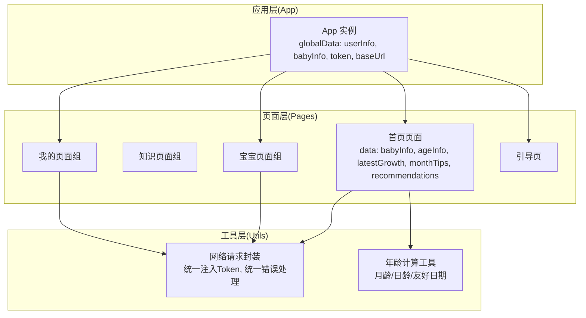
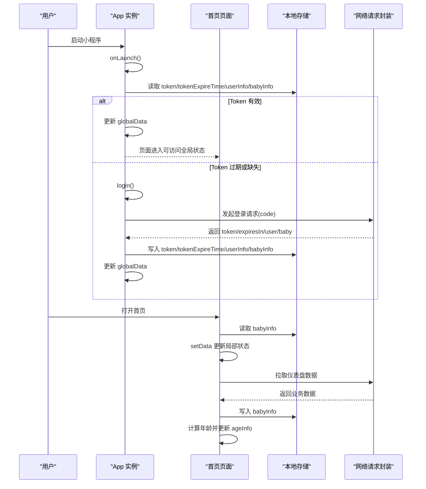
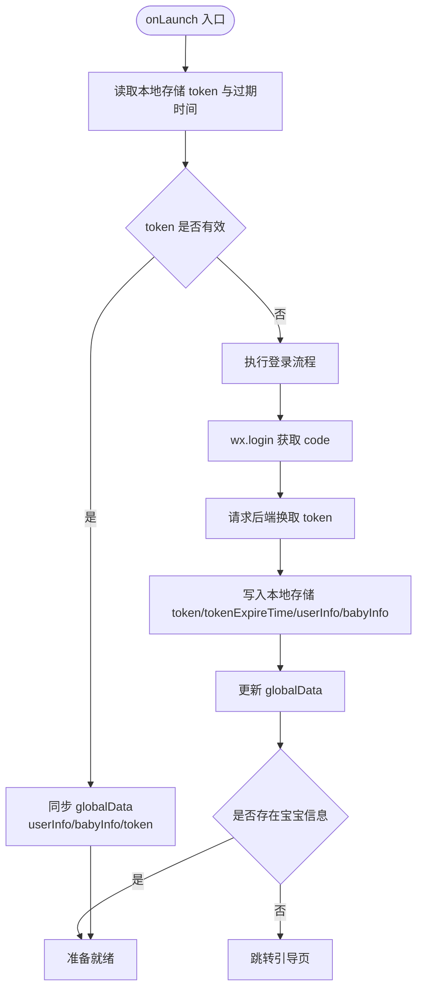
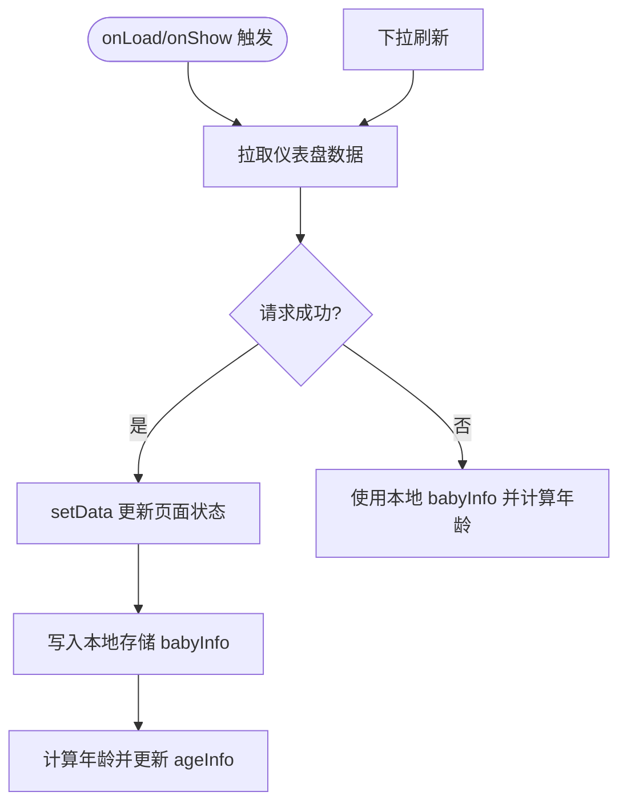
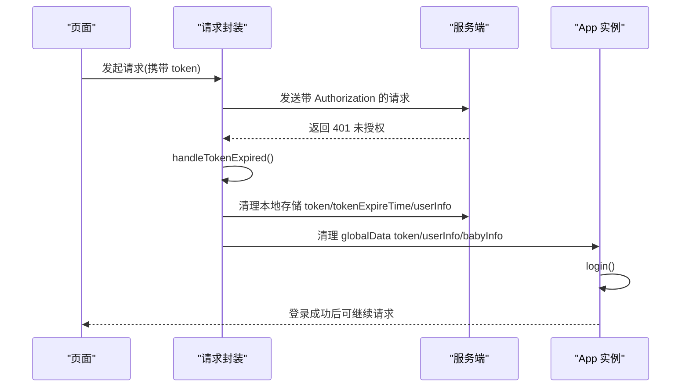
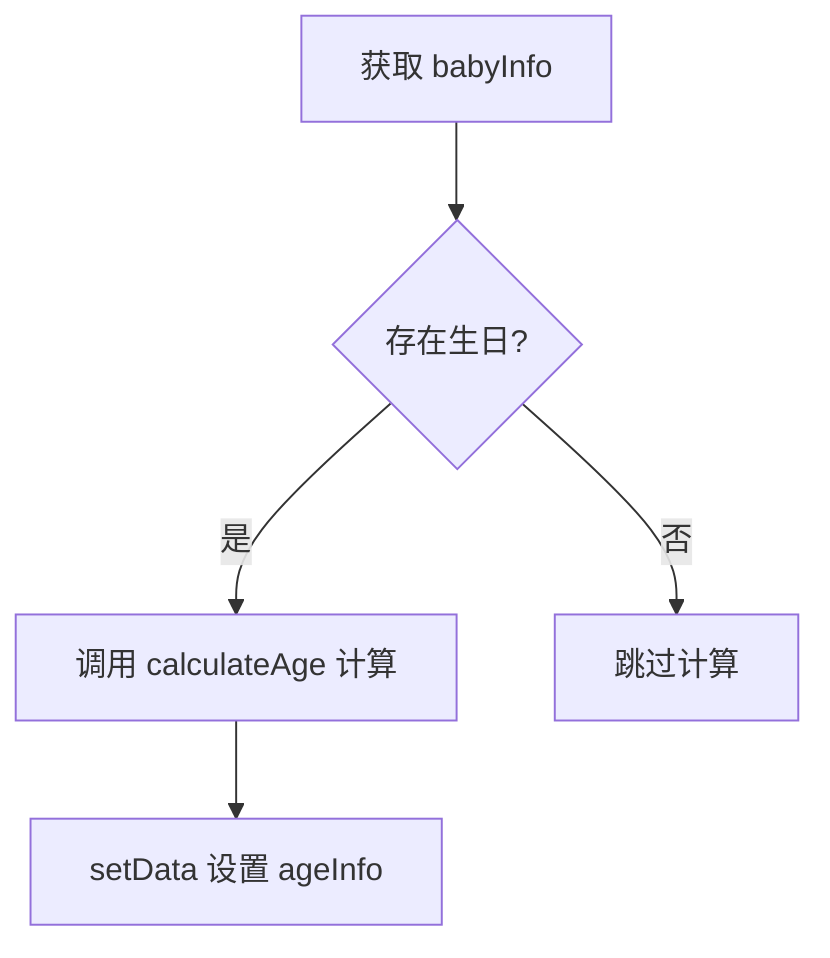
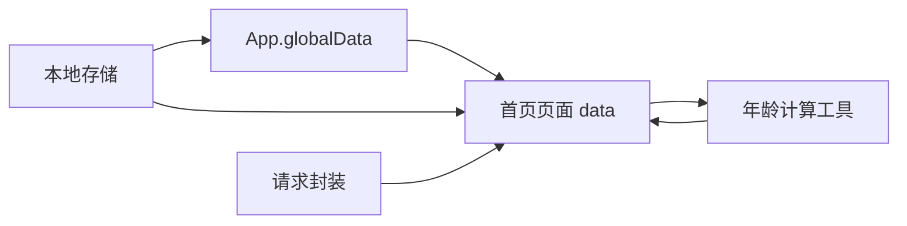

# 状态管理

<cite>
**本文引用的文件**
- [app.js](file://miniprogram/app.js)
- [app.json](file://miniprogram/app.json)
- [request.js](file://miniprogram/utils/request.js)
- [ageCalculator.js](file://miniprogram/utils/ageCalculator.js)
- [home/index.js](file://miniprogram/pages/home/index.js)
</cite>

## 目录
1. [简介](#简介)
2. [项目结构](#项目结构)
3. [核心组件](#核心组件)
4. [架构总览](#架构总览)
5. [详细组件分析](#详细组件分析)
6. [依赖分析](#依赖分析)
7. [性能考虑](#性能考虑)
8. [故障排查指南](#故障排查指南)
9. [结论](#结论)
10. [附录](#附录)

## 简介
本文件面向“AI育儿助手”小程序的状态管理，系统性梳理全局状态、页面局部状态与本地存储的协同机制，重点覆盖以下主题：
- App 实例中的 globalData 使用与生命周期联动
- 本地存储与状态持久化的策略
- 用户登录状态、宝宝信息状态、Token 管理的关键流程
- 状态更新时机、状态同步与内存管理
- 最佳实践与常见问题解决方案

## 项目结构
小程序采用典型的分层组织方式：应用层（App）、页面层（Pages）、工具层（Utils）。状态管理贯穿三层，其中 App 全局状态作为主数据源，页面通过 setData 维护局部状态，并以本地存储实现跨会话持久化。

图表来源
- [app.js:1-69](file://miniprogram/app.js#L1-L69)
- [app.json:1-60](file://miniprogram/app.json#L1-L60)
- [request.js:1-97](file://miniprogram/utils/request.js#L1-L97)
- [ageCalculator.js:1-86](file://miniprogram/utils/ageCalculator.js#L1-L86)
- [home/index.js:1-114](file://miniprogram/pages/home/index.js#L1-L114)

章节来源
- [app.js:1-69](file://miniprogram/app.js#L1-L69)
- [app.json:1-60](file://miniprogram/app.json#L1-L60)

## 核心组件
- App 实例（全局状态中心）
  - 提供全局状态：用户信息、宝宝信息、Token、基础地址
  - 生命周期 onLaunch 中执行登录态检查
  - 登录成功后写入 globalData 并持久化到本地存储
- 页面（局部状态）
  - 首页页面维护宝宝信息、年龄信息、最新成长、当月提示与推荐内容
  - 在 onShow 时从本地存储读取并同步到页面 data
  - 在数据拉取成功后回写本地存储并触发视图更新
- 工具模块
  - 网络请求封装：统一注入 Authorization 头、业务错误处理、Token 过期自动重登录
  - 年龄计算工具：提供月龄/日龄/友好日期展示

章节来源
- [app.js:10-67](file://miniprogram/app.js#L10-L67)
- [home/index.js:5-71](file://miniprogram/pages/home/index.js#L5-L71)
- [request.js:21-86](file://miniprogram/utils/request.js#L21-L86)
- [ageCalculator.js:7-41](file://miniprogram/utils/ageCalculator.js#L7-L41)

## 架构总览
下图展示了从启动到页面渲染、再到网络请求与状态同步的完整流程。

图表来源
- [app.js:10-67](file://miniprogram/app.js#L10-L67)
- [home/index.js:24-71](file://miniprogram/pages/home/index.js#L24-L71)
- [request.js:21-73](file://miniprogram/utils/request.js#L21-L73)

## 详细组件分析

### App 实例与全局状态管理
- globalData 设计
  - userInfo：当前登录用户信息
  - babyInfo：绑定的宝宝信息
  - token：认证令牌
  - baseUrl：服务端接口基础地址
- 登录态检查
  - onLaunch 钩子中调用 checkLoginStatus
  - 从本地存储读取 token 与过期时间，判断有效性
  - 若有效则同步到 globalData；否则触发登录流程
- 登录流程
  - 调用微信登录获取 code
  - 通过网络请求提交 code 获取 token、用户与宝宝信息
  - 将结果写入 globalData，并持久化到本地存储
  - 若无宝宝信息，引导至引导页

图表来源
- [app.js:10-67](file://miniprogram/app.js#L10-L67)

章节来源
- [app.js:3-8](file://miniprogram/app.js#L3-L8)
- [app.js:18-30](file://miniprogram/app.js#L18-L30)
- [app.js:35-67](file://miniprogram/app.js#L35-L67)

### 首页页面与局部状态
- 局部状态字段
  - babyInfo：宝宝信息
  - ageInfo：年龄计算结果（月龄/日龄）
  - latestGrowth：最新成长记录
  - monthTips：当月提示
  - recommendations：个性化推荐
- 状态更新时机
  - onLoad：首次加载仪表盘数据
  - onShow：每次显示时从本地存储读取并同步
  - 下拉刷新：手动刷新仪表盘数据
- 数据来源与回写
  - 优先从服务端拉取，成功后回写本地存储
  - 失败时降级使用本地存储中的 babyInfo，并计算年龄

图表来源
- [home/index.js:24-71](file://miniprogram/pages/home/index.js#L24-L71)

章节来源
- [home/index.js:5-22](file://miniprogram/pages/home/index.js#L5-L22)
- [home/index.js:24-71](file://miniprogram/pages/home/index.js#L24-L71)
- [home/index.js](file://miniprogram/pages/home/index.js)

### 网络请求封装与 Token 管理
- 统一注入 Authorization 头
  - 优先使用 App.globalData.token，否则回退到本地存储
- 错误处理与降级
  - 业务错误：Toast 提示错误消息
  - 服务器错误：Toast 提示状态码
  - 网络失败：Toast 提示网络连接失败
- Token 过期自动刷新
  - 当返回 401 时，清理本地存储与 globalData 的 token 相关项
  - 触发 App.login 流程，完成重新登录

图表来源
- [request.js:21-86](file://miniprogram/utils/request.js#L21-L86)
- [app.js:35-67](file://miniprogram/app.js#L35-L67)

章节来源
- [request.js:21-73](file://miniprogram/utils/request.js#L21-L73)
- [request.js:78-86](file://miniprogram/utils/request.js#L78-L86)

### 年龄计算工具与状态联动
- 年龄计算
  - 输入出生日期，输出月龄、日龄、总天数与友好文本
- 与页面状态联动
  - 首页在获取到 babyInfo 后调用计算函数，更新 ageInfo
  - 保证 UI 展示与实际数据一致

图表来源
- [ageCalculator.js:7-41](file://miniprogram/utils/ageCalculator.js#L7-L41)
- [home/index.js:76-82](file://miniprogram/pages/home/index.js#L76-L82)

章节来源
- [ageCalculator.js:7-41](file://miniprogram/utils/ageCalculator.js#L7-L41)
- [home/index.js:76-82](file://miniprogram/pages/home/index.js#L76-L82)

## 依赖分析
- App 对本地存储的依赖
  - 登录态检查与持久化均依赖本地存储键值：token、tokenExpireTime、userInfo、babyInfo
- 页面对 App 与工具的依赖
  - 首页页面依赖 App.globalData 与本地存储进行状态同步
  - 依赖网络请求封装进行数据拉取
  - 依赖年龄计算工具进行 UI 展示
- 工具模块的职责边界
  - 网络请求封装仅负责请求、鉴权、错误与过期处理，不直接操作页面状态
  - 年龄计算工具纯函数，无副作用

图表来源
- [app.js:19-29](file://miniprogram/app.js#L19-L29)
- [home/index.js:30-34](file://miniprogram/pages/home/index.js#L30-L34)
- [request.js:21-37](file://miniprogram/utils/request.js#L21-L37)
- [ageCalculator.js:7-41](file://miniprogram/utils/ageCalculator.js#L7-L41)

章节来源
- [app.js:19-29](file://miniprogram/app.js#L19-L29)
- [home/index.js:30-34](file://miniprogram/pages/home/index.js#L30-L34)
- [request.js:21-37](file://miniprogram/utils/request.js#L21-L37)
- [ageCalculator.js:7-41](file://miniprogram/utils/ageCalculator.js#L7-L41)

## 性能考虑
- 避免重复请求
  - 首页在 onShow 时仅读取本地存储进行快速回显，随后异步拉取数据，减少首屏阻塞
- 本地存储命中
  - 登录态检查与页面初始化均优先从本地存储读取，降低网络依赖
- 状态更新粒度
  - 仅在必要时 setData，避免全量更新导致的重绘
- Token 过期处理
  - 统一在请求层处理 401，避免页面分散处理逻辑

## 故障排查指南
- 登录后仍提示未登录
  - 检查本地存储 token 与过期时间是否正确写入
  - 确认 App.onLaunch 是否执行了 checkLoginStatus
  - 关注网络请求封装中的 401 分支是否触发了重新登录
- 宝宝信息未显示
  - 首页 onShow 会从本地存储读取并 setData，确认本地存储中是否存在 babyInfo
  - 若服务端返回空，需检查后端接口与 App.login 是否正确写入
- Token 过期频繁
  - 检查后端返回的 expiresIn 是否合理
  - 确认 handleTokenExpired 是否被正确调用并触发 App.login
- 网络错误提示
  - 业务错误与服务器错误已在请求封装中统一 Toast 提示，可根据错误码定位问题

章节来源
- [app.js:18-30](file://miniprogram/app.js#L18-L30)
- [home/index.js:30-34](file://miniprogram/pages/home/index.js#L30-L34)
- [request.js:48-62](file://miniprogram/utils/request.js#L48-L62)
- [request.js:78-86](file://miniprogram/utils/request.js#L78-L86)

## 结论
本项目采用“App 全局状态 + 页面局部状态 + 本地存储持久化”的混合模式，配合统一的网络请求封装与 Token 自动刷新机制，实现了稳定的状态流转与用户体验。建议在后续迭代中：
- 明确状态边界，避免页面与工具层交叉污染
- 增加状态变更日志与埋点，便于问题定位
- 对关键状态增加校验与默认值，提升健壮性

## 附录
- 关键状态键名
  - token：认证令牌
  - tokenExpireTime：Token 过期时间戳
  - userInfo：用户信息
  - babyInfo：宝宝信息
- 生命周期与状态关系
  - App.onLaunch → 登录态检查 → globalData 初始化
  - 页面 onShow → 本地存储读取 → setData 同步
  - 请求返回 401 → 清理本地与全局状态 → 重新登录