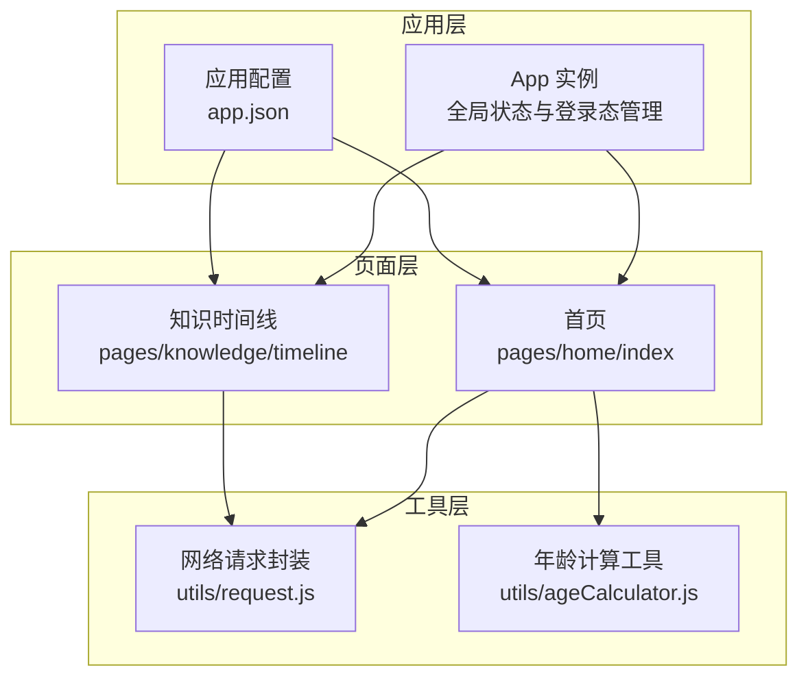
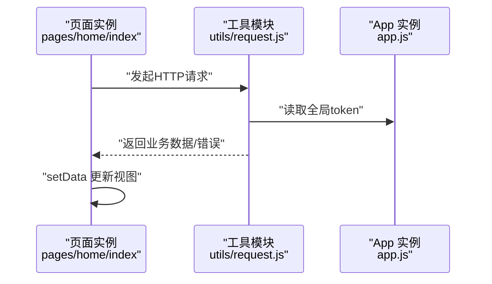
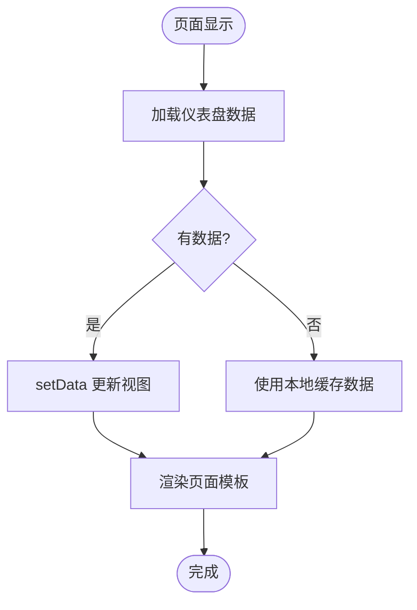
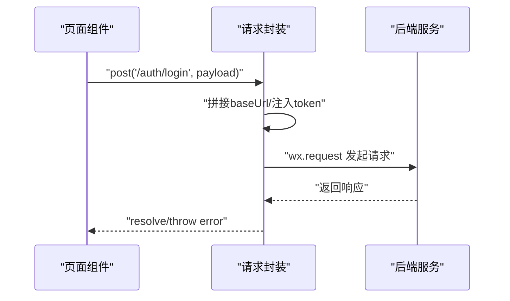
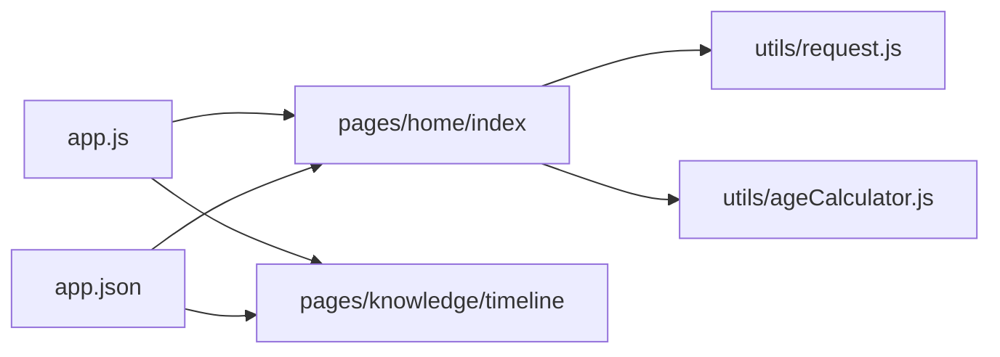

# 组件系统

<cite>
**本文引用的文件**
- [miniprogram/app.js](file://miniprogram/app.js)
- [miniprogram/app.json](file://miniprogram/app.json)
- [miniprogram/utils/request.js](file://miniprogram/utils/request.js)
- [miniprogram/pages/home/index.js](file://miniprogram/pages/home/index.js)
- [miniprogram/pages/home/index.wxml](file://miniprogram/pages/home/index.wxml)
- [miniprogram/pages/home/index.json](file://miniprogram/pages/home/index.json)
- [miniprogram/pages/knowledge/timeline.js](file://miniprogram/pages/knowledge/timeline.js)
- [miniprogram/pages/knowledge/timeline.wxml](file://miniprogram/pages/knowledge/timeline.wxml)
- [miniprogram/pages/knowledge/timeline.json](file://miniprogram/pages/knowledge/timeline.json)
</cite>

## 目录
1. [简介](#简介)
2. [项目结构](#项目结构)
3. [核心组件](#核心组件)
4. [架构总览](#架构总览)
5. [详细组件分析](#详细组件分析)
6. [依赖关系分析](#依赖关系分析)
7. [性能考量](#性能考量)
8. [故障排查指南](#故障排查指南)
9. [结论](#结论)
10. [附录](#附录)

## 简介
本文件面向“AI育儿助手”微信小程序的组件系统，围绕自定义组件的设计理念与实践展开，重点覆盖以下主题：
- 组件化开发模式与页面级组件的组织方式
- 组件的定义、注册与使用流程（属性、事件、插槽等）
- 生命周期、数据传递、样式隔离与作用域问题
- 通用业务组件的设计模式、复用策略与性能优化建议
- 基于现有代码库的组件开发示例与最佳实践

说明：当前仓库未包含独立的 components 目录与自定义组件文件，本文在不虚构事实的前提下，基于现有页面与工具模块，给出可落地的组件化改造方案与实施步骤，帮助开发者构建高质量的组件体系。

## 项目结构
小程序采用页面驱动的目录结构，页面以“pages/模块/页面”的方式组织，配合全局应用配置与工具模块实现功能扩展。整体结构如下：

图表来源
- [miniprogram/app.js:1-69](file://miniprogram/app.js#L1-L69)
- [miniprogram/app.json:1-60](file://miniprogram/app.json#L1-L60)
- [miniprogram/pages/home/index.js:1-114](file://miniprogram/pages/home/index.js#L1-L114)
- [miniprogram/pages/knowledge/timeline.js:1-2](file://miniprogram/pages/knowledge/timeline.js#L1-L2)
- [miniprogram/utils/request.js:1-96](file://miniprogram/utils/request.js#L1-L96)

章节来源
- [miniprogram/app.json:1-60](file://miniprogram/app.json#L1-L60)
- [miniprogram/app.js:1-69](file://miniprogram/app.js#L1-L69)

## 核心组件
本节从“页面即组件”的角度，梳理现有页面如何承担组件职责，以及如何通过工具模块实现可复用能力。

- 页面作为“容器组件”
  - 首页页面负责聚合数据、渲染UI、处理用户交互，具备典型的容器组件特征。
  - 知识时间线页面为空白页，可作为“展示型组件”的占位或待扩展点。
- 工具模块作为“功能组件”
  - 网络请求封装提供统一的HTTP调用、鉴权与错误处理，可视为“服务型组件”。
  - 年龄计算工具提供纯函数式能力，可视为“数据型组件”。

章节来源
- [miniprogram/pages/home/index.js:1-114](file://miniprogram/pages/home/index.js#L1-L114)
- [miniprogram/pages/knowledge/timeline.js:1-2](file://miniprogram/pages/knowledge/timeline.js#L1-L2)
- [miniprogram/utils/request.js:1-96](file://miniprogram/utils/request.js#L1-L96)

## 架构总览
下图展示了从页面到工具模块的数据流与控制流，体现“页面驱动、工具支撑”的架构风格。

图表来源
- [miniprogram/pages/home/index.js:46-71](file://miniprogram/pages/home/index.js#L46-L71)
- [miniprogram/utils/request.js:21-73](file://miniprogram/utils/request.js#L21-L73)
- [miniprogram/app.js:35-67](file://miniprogram/app.js#L35-L67)

## 详细组件分析

### 页面组件：首页（容器组件）
- 职责
  - 聚合首页仪表盘数据，渲染宝宝信息、快捷入口、AI入口、推荐内容等。
  - 处理下拉刷新、菜单点击、跳转逻辑等用户交互。
- 数据与生命周期
  - 初始化加载与每次显示刷新：在页面生命周期中进行数据拉取与本地缓存同步。
  - 下拉刷新：触发数据重载并停止刷新指示。
- 交互与导航
  - 通过事件绑定实现菜单跳转、AI助手跳转、推荐内容跳转。
- 可组件化的改进点
  - 将“宝宝信息卡片”“快捷功能网格”“今日推荐列表”等拆分为独立组件，提升复用性与可测试性。
  - 将网络请求封装为“数据源组件”，统一处理loading、错误与重试。

图表来源
- [miniprogram/pages/home/index.js:24-82](file://miniprogram/pages/home/index.js#L24-L82)

章节来源
- [miniprogram/pages/home/index.js:1-114](file://miniprogram/pages/home/index.js#L1-L114)
- [miniprogram/pages/home/index.wxml:1-86](file://miniprogram/pages/home/index.wxml#L1-L86)
- [miniprogram/pages/home/index.json:1-5](file://miniprogram/pages/home/index.json#L1-L5)

### 页面组件：知识时间线（展示型组件）
- 当前状态
  - 页面脚本与模板为空，适合承载“展示型组件”或作为占位页。
- 改进建议
  - 将时间线列表抽象为“列表组件”，支持分页、筛选、空状态等能力。
  - 将单项条目抽象为“条目卡片组件”，统一样式与交互。

章节来源
- [miniprogram/pages/knowledge/timeline.js:1-2](file://miniprogram/pages/knowledge/timeline.js#L1-L2)
- [miniprogram/pages/knowledge/timeline.wxml:1-2](file://miniprogram/pages/knowledge/timeline.wxml#L1-L2)
- [miniprogram/pages/knowledge/timeline.json:1-4](file://miniprogram/pages/knowledge/timeline.json#L1-L4)

### 工具组件：网络请求封装
- 能力
  - 统一基础URL、自动注入Authorization头、统一错误提示与处理、Token过期自动刷新。
- 使用场景
  - 页面组件通过require引入，作为数据源组件被调用。
- 可组件化的改进点
  - 将请求封装抽象为“HTTP服务组件”，支持拦截器、重试策略、并发控制等高级特性。

图表来源
- [miniprogram/utils/request.js:21-73](file://miniprogram/utils/request.js#L21-L73)
- [miniprogram/pages/home/index.js:40-66](file://miniprogram/pages/home/index.js#L40-L66)

章节来源
- [miniprogram/utils/request.js:1-96](file://miniprogram/utils/request.js#L1-L96)
- [miniprogram/pages/home/index.js:1-114](file://miniprogram/pages/home/index.js#L1-L114)

### 工具组件：年龄计算
- 能力
  - 提供纯函数式的年龄计算，便于在页面中直接调用。
- 使用场景
  - 在页面生命周期中计算并更新年龄信息，用于UI展示。

章节来源
- [miniprogram/pages/home/index.js:76-82](file://miniprogram/pages/home/index.js#L76-L82)

## 依赖关系分析
- 页面对工具模块的依赖
  - 首页同时依赖网络请求与年龄计算工具；知识时间线页面可按需引入。
- 应用配置对页面的依赖
  - app.json声明页面路径与tabBar配置，决定页面的可见性与导航结构。
- 登录态与全局状态
  - App实例负责登录态校验与全局token存储，页面通过全局对象读取与写入。

图表来源
- [miniprogram/app.js:1-69](file://miniprogram/app.js#L1-L69)
- [miniprogram/app.json:1-60](file://miniprogram/app.json#L1-L60)
- [miniprogram/pages/home/index.js:1-114](file://miniprogram/pages/home/index.js#L1-L114)
- [miniprogram/pages/knowledge/timeline.js:1-2](file://miniprogram/pages/knowledge/timeline.js#L1-L2)
- [miniprogram/utils/request.js:1-96](file://miniprogram/utils/request.js#L1-L96)

章节来源
- [miniprogram/app.json:1-60](file://miniprogram/app.json#L1-L60)
- [miniprogram/app.js:1-69](file://miniprogram/app.js#L1-L69)

## 性能考量
- 按需加载与懒代码
  - 应用配置启用懒加载策略，有助于减少首屏包体与初次渲染时间。
- 列表渲染优化
  - 使用wx:for与wx:key，避免不必要的节点重建；对长列表采用分页或虚拟滚动。
- 请求与缓存
  - 对高频接口增加本地缓存与失效策略，降低重复请求成本。
- 图片与资源
  - 合理设置图片mode与尺寸，避免过度绘制与内存占用。
- 事件与交互
  - 避免在频繁触发事件中执行重计算；必要时使用防抖/节流。

章节来源
- [miniprogram/app.json:58](file://miniprogram/app.json#L58)

## 故障排查指南
- 登录态异常
  - 现象：接口返回401或业务报错。
  - 排查：确认本地token是否存在且未过期；检查App实例的登录流程与存储逻辑。
- 网络请求失败
  - 现象：Toast提示网络连接失败或业务错误。
  - 排查：检查请求封装中的header注入、错误分支与提示逻辑；确认后端接口可用性。
- 页面空白或渲染异常
  - 现象：页面模板为空或数据未渲染。
  - 排查：确认页面脚本与模板是否正确关联；检查数据初始化与setData调用时机。

章节来源
- [miniprogram/utils/request.js:48-86](file://miniprogram/utils/request.js#L48-L86)
- [miniprogram/pages/home/index.js:62-71](file://miniprogram/pages/home/index.js#L62-L71)
- [miniprogram/pages/knowledge/timeline.js:1-2](file://miniprogram/pages/knowledge/timeline.js#L1-L2)

## 结论
- 当前项目以页面为中心，通过工具模块实现能力复用，具备良好的可扩展性。
- 建议逐步引入自定义组件：将页面中的可复用UI与逻辑抽离为组件，形成“页面-组件-工具”的分层体系。
- 在组件化过程中，重点关注数据流设计、事件冒泡与捕获、样式隔离与作用域问题，确保组件的高内聚、低耦合与可维护性。

## 附录
- 组件化改造清单（建议）
  - 抽离“宝宝信息卡片”“快捷功能网格”“今日推荐列表”等为独立组件。
  - 将网络请求封装升级为“HTTP服务组件”，支持拦截器与重试。
  - 引入组件生命周期钩子与事件系统，规范组件间通信。
  - 建立组件样式命名规范与作用域隔离策略，避免样式污染。