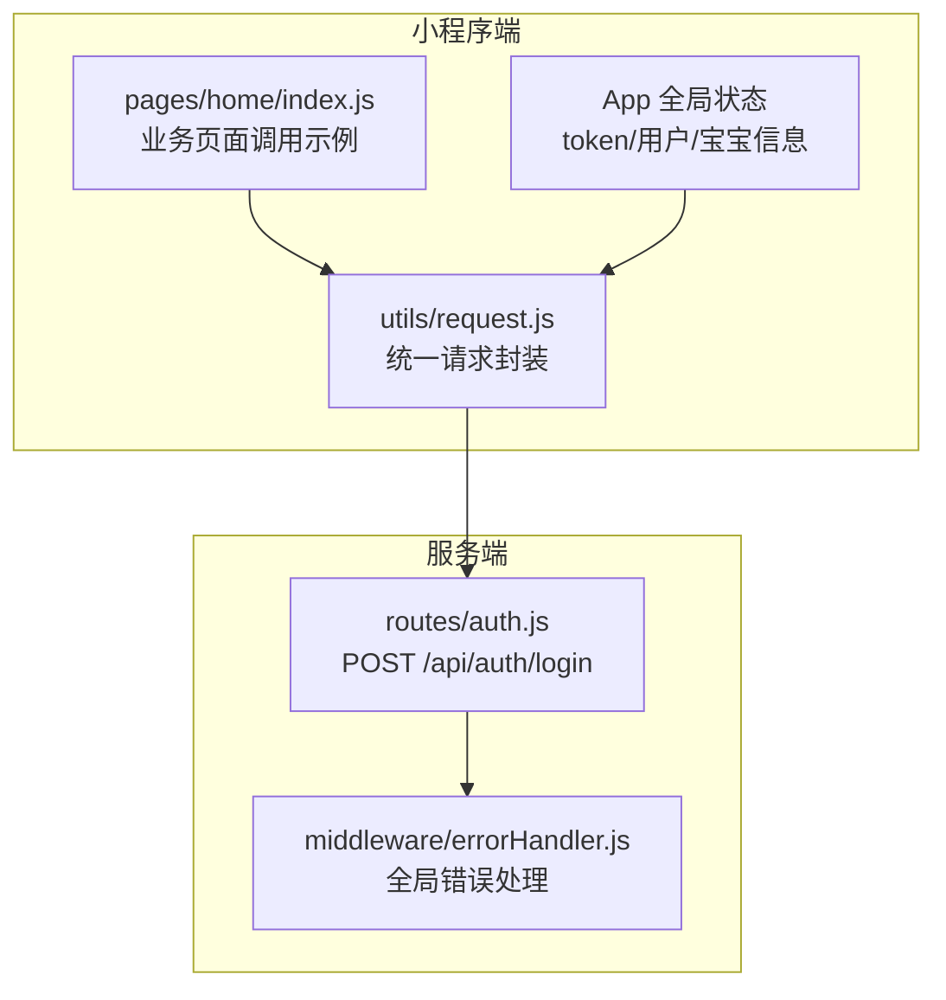
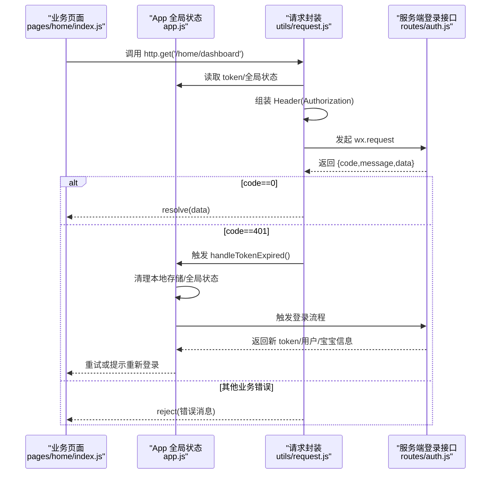
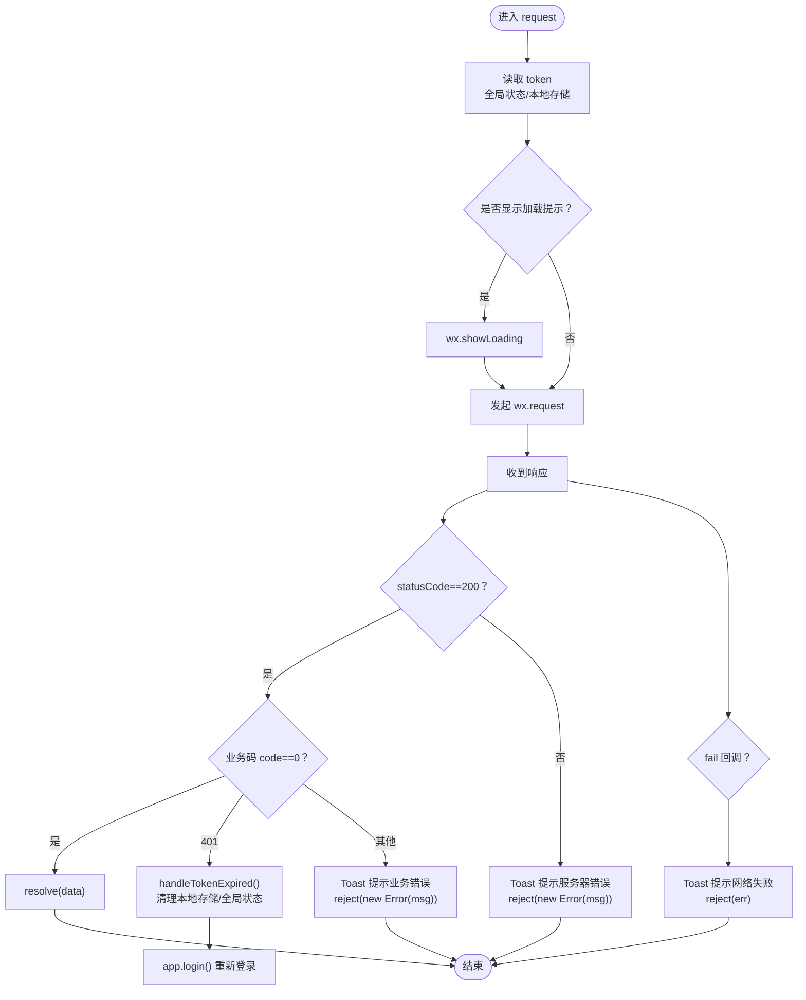
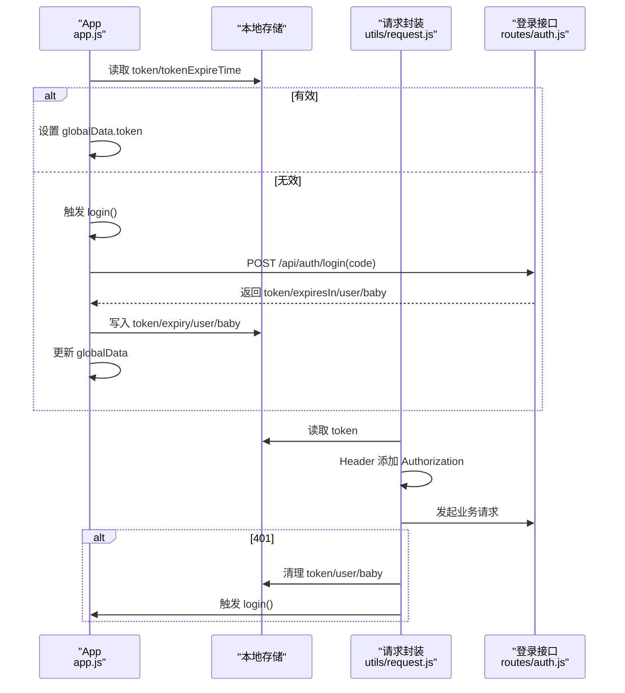
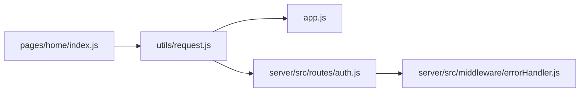

# 网络请求

<cite>
**本文引用的文件**
- [miniprogram/utils/request.js](file://miniprogram/utils/request.js)
- [miniprogram/app.js](file://miniprogram/app.js)
- [miniprogram/pages/home/index.js](file://miniprogram/pages/home/index.js)
- [server/src/routes/auth.js](file://server/src/routes/auth.js)
- [server/src/middleware/errorHandler.js](file://server/src/middleware/errorHandler.js)
</cite>

## 目录
1. [简介](#简介)
2. [项目结构](#项目结构)
3. [核心组件](#核心组件)
4. [架构总览](#架构总览)
5. [详细组件分析](#详细组件分析)
6. [依赖分析](#依赖分析)
7. [性能考虑](#性能考虑)
8. [故障排查指南](#故障排查指南)
9. [结论](#结论)
10. [附录](#附录)

## 简介
本文件面向“AI育儿助手”小程序端的网络请求系统，围绕 utils/request.js 的请求封装、HTTP客户端设计、请求拦截与响应处理进行深入技术解析。重点覆盖以下主题：
- API封装策略与统一入口
- 错误处理流程与业务错误码约定
- Token自动注入与过期处理机制
- 请求加载提示与交互反馈
- HTTPS安全策略与开发/生产环境差异
- 超时处理、并发控制与重试机制现状与改进建议
- 实际调用示例、调试技巧与性能优化方案

## 项目结构
网络请求系统主要由三部分组成：
- 小程序端请求封装：utils/request.js 提供统一的HTTP客户端与快捷方法
- 应用层登录与状态管理：app.js 负责登录态检查、Token存储与全局状态同步
- 服务端接口与错误处理：server/src/routes/auth.js 提供登录接口；errorHandler.js 统一错误格式化

图表来源
- [miniprogram/utils/request.js:1-97](file://miniprogram/utils/request.js#L1-L97)
- [miniprogram/app.js:1-69](file://miniprogram/app.js#L1-L69)
- [miniprogram/pages/home/index.js:1-114](file://miniprogram/pages/home/index.js#L1-L114)
- [server/src/routes/auth.js:1-84](file://server/src/routes/auth.js#L1-L84)
- [server/src/middleware/errorHandler.js:1-52](file://server/src/middleware/errorHandler.js#L1-L52)

章节来源
- [miniprogram/utils/request.js:1-97](file://miniprogram/utils/request.js#L1-L97)
- [miniprogram/app.js:1-69](file://miniprogram/app.js#L1-L69)
- [miniprogram/pages/home/index.js:1-114](file://miniprogram/pages/home/index.js#L1-L114)
- [server/src/routes/auth.js:1-84](file://server/src/routes/auth.js#L1-L84)
- [server/src/middleware/errorHandler.js:1-52](file://server/src/middleware/errorHandler.js#L1-L52)

## 核心组件
- 统一请求封装：提供通用 request(url, method, data, options) 方法，内置加载提示、Header组装、状态码与业务码判断、错误提示与拒绝逻辑
- 快捷方法：http.get/post/put/delete 基于通用方法的薄封装
- Token自动注入：从全局状态或本地存储读取token，并在请求头中附加 Authorization: Bearer {token}
- 登录态检查与刷新：app.js 在启动时检查Token有效性，过期则触发登录流程
- 业务错误处理：对401（未授权/过期）进行特殊处理，其他业务错误通过消息提示反馈
- HTTPS安全策略：服务端登录接口通过HTTPS调用微信jscode2session，避免明文传输

章节来源
- [miniprogram/utils/request.js:11-97](file://miniprogram/utils/request.js#L11-L97)
- [miniprogram/app.js:18-67](file://miniprogram/app.js#L18-L67)
- [server/src/routes/auth.js:17-30](file://server/src/routes/auth.js#L17-L30)

## 架构总览
下图展示从页面发起请求到服务端返回的整体流程，包括Token注入、错误处理与登录态刷新。

图表来源
- [miniprogram/pages/home/index.js:46-71](file://miniprogram/pages/home/index.js#L46-L71)
- [miniprogram/utils/request.js:21-86](file://miniprogram/utils/request.js#L21-L86)
- [miniprogram/app.js:35-67](file://miniprogram/app.js#L35-L67)
- [server/src/routes/auth.js:10-81](file://server/src/routes/auth.js#L10-L81)

## 详细组件分析

### 组件A：请求封装与拦截器设计
- 统一入口：request(url, method, data, options) 支持GET/POST/PUT/DELETE等方法
- Header组装：默认 Content-Type: application/json；若存在token则附加 Authorization: Bearer {token}
- 加载提示：默认显示“加载中...”，可通过 options.showLoading=false 关闭
- 成功分支：仅当 statusCode==200 且业务码 code==0 时 resolve
- 失败分支：非200统一提示“服务器错误”；401触发 handleTokenExpired 并提示“登录已过期”
- 其他业务错误：读取 resData.message 或默认“请求失败”，Toast提示后 reject
- 失败回调：网络异常统一提示“网络连接失败”，reject原错误对象

图表来源
- [miniprogram/utils/request.js:21-86](file://miniprogram/utils/request.js#L21-L86)

章节来源
- [miniprogram/utils/request.js:21-86](file://miniprogram/utils/request.js#L21-L86)

### 组件B：Token自动注入与过期处理
- 注入策略：请求前从 app.globalData 或本地存储读取 token，并写入 Authorization 头
- 过期处理：当业务码为401时，清除本地存储与全局状态，触发 app.login() 重新登录
- 登录态检查：onLaunch 时检查 token 是否存在且未过期，否则触发登录流程
- 登录流程：wx.login 获取临时 code，调用 /api/auth/login 换取 token、过期时间与用户/宝宝信息，写入全局状态与本地存储

图表来源
- [miniprogram/app.js:18-67](file://miniprogram/app.js#L18-L67)
- [miniprogram/utils/request.js:23-86](file://miniprogram/utils/request.js#L23-L86)
- [server/src/routes/auth.js:10-81](file://server/src/routes/auth.js#L10-L81)

章节来源
- [miniprogram/app.js:18-67](file://miniprogram/app.js#L18-L67)
- [miniprogram/utils/request.js:23-86](file://miniprogram/utils/request.js#L23-L86)
- [server/src/routes/auth.js:10-81](file://server/src/routes/auth.js#L10-L81)

### 组件C：业务页面调用示例与降级策略
- 页面调用：pages/home/index.js 使用 http.get('/home/dashboard') 获取首页聚合数据
- 成功处理：当 code==0 时更新页面数据，必要时写入本地存储并计算年龄
- 失败降级：捕获异常后尝试读取本地缓存的宝宝信息进行界面降级渲染
- 下拉刷新：支持 onPullDownRefresh 触发重新加载并停止刷新动画

章节来源
- [miniprogram/pages/home/index.js:46-71](file://miniprogram/pages/home/index.js#L46-L71)

### 组件D：服务端错误处理与HTTPS安全策略
- 业务错误码：服务端统一返回 {code,message,data} 结构，前端据此分支处理
- 全局错误处理：errorHandler 统一捕获数据库错误、自定义业务错误与未知错误，返回标准化响应
- HTTPS安全：登录接口通过HTTPS调用微信 jscode2session，避免敏感参数明文泄露

章节来源
- [server/src/routes/auth.js:10-81](file://server/src/routes/auth.js#L10-L81)
- [server/src/middleware/errorHandler.js:6-39](file://server/src/middleware/errorHandler.js#L6-L39)

## 依赖分析
- 页面依赖请求封装：业务页面通过 require 引入 http 对象，间接依赖 utils/request.js
- 请求封装依赖应用状态：读取 app.globalData 与本地存储，依赖 app.js 的登录态管理
- 服务端路由依赖中间件：登录接口依赖全局错误处理中间件进行统一错误格式化

图表来源
- [miniprogram/pages/home/index.js:2](file://miniprogram/pages/home/index.js#L2)
- [miniprogram/utils/request.js:9,89-96](file://miniprogram/utils/request.js#L9,L89-L96)
- [miniprogram/app.js:35-67](file://miniprogram/app.js#L35-L67)
- [server/src/routes/auth.js:10-81](file://server/src/routes/auth.js#L10-L81)
- [server/src/middleware/errorHandler.js:6-39](file://server/src/middleware/errorHandler.js#L6-L39)

章节来源
- [miniprogram/pages/home/index.js:2](file://miniprogram/pages/home/index.js#L2)
- [miniprogram/utils/request.js:9,89-96](file://miniprogram/utils/request.js#L9,L89-L96)
- [miniprogram/app.js:35-67](file://miniprogram/app.js#L35-L67)
- [server/src/routes/auth.js:10-81](file://server/src/routes/auth.js#L10-L81)
- [server/src/middleware/errorHandler.js:6-39](file://server/src/middleware/errorHandler.js#L6-L39)

## 性能考虑
- 请求并发控制：当前实现未显式限制并发数。建议在业务层引入队列或信号量，避免短时间内大量请求导致资源争用
- 超时处理：wx.request 默认超时时间未显式设置。建议在 options 中增加 timeout 字段，针对长耗时接口设置合理超时值
- 重试机制：当前未实现自动重试。可基于指数退避策略对网络异常与5xx类错误进行有限次数重试
- 缓存策略：对静态或低频变更数据可引入本地缓存，结合时间戳控制新鲜度，减少重复请求
- 加载体验：默认显示加载提示可能影响用户体验。建议根据接口重要性与耗时动态控制加载提示
- 网络质量适配：在弱网环境下可采用更短超时与更少重试次数，避免长时间阻塞

## 故障排查指南
- 常见错误码
  - 401 未授权/登录过期：检查 handleTokenExpired 流程是否正确清理本地存储与全局状态，确认 app.login() 是否成功返回新 token
  - 业务错误码非0：查看服务端返回 message，定位具体业务问题
  - 服务器错误：statusCode 非200，检查服务端日志与中间件错误处理
- 调试技巧
  - 打印请求与响应：在 request 成功/失败回调中输出关键字段，便于定位问题
  - 本地存储校验：确认 token、tokenExpireTime、userInfo、babyInfo 是否按预期写入与读取
  - 环境切换：开发环境与生产环境的 baseUrl 不同，确保上线前替换为正式域名
- 日志与监控
  - 服务端：开启详细日志，记录请求路径、参数与错误堆栈
  - 客户端：在 fail 回调中统一上报错误，辅助定位网络与权限问题

章节来源
- [miniprogram/utils/request.js:48-62](file://miniprogram/utils/request.js#L48-L62)
- [miniprogram/utils/request.js:64-70](file://miniprogram/utils/request.js#L64-L70)
- [server/src/middleware/errorHandler.js:6-39](file://server/src/middleware/errorHandler.js#L6-L39)

## 结论
该网络请求系统以 utils/request.js 为核心，实现了统一的请求封装、Token自动注入与过期处理、业务错误码分发与加载提示。配合 app.js 的登录态检查与服务端的统一错误处理，形成了较为完整的前后端协作机制。建议后续补充超时控制、重试策略与并发限制，以进一步提升稳定性与用户体验。

## 附录
- API调用示例（路径）
  - 首页聚合数据：[pages/home/index.js:48](file://miniprogram/pages/home/index.js#L48)
  - 登录接口：[server/src/routes/auth.js:10](file://server/src/routes/auth.js#L10)
- 错误码约定（服务端）
  - 成功：code=0
  - 参数缺失/登录失败：code=400
  - 数据库唯一约束冲突：code=409
  - 记录不存在：code=404
  - 服务器内部错误：code=500
- HTTPS安全要点
  - 登录接口通过HTTPS调用微信 jscode2session
  - 生产环境baseUrl应指向HTTPS域名