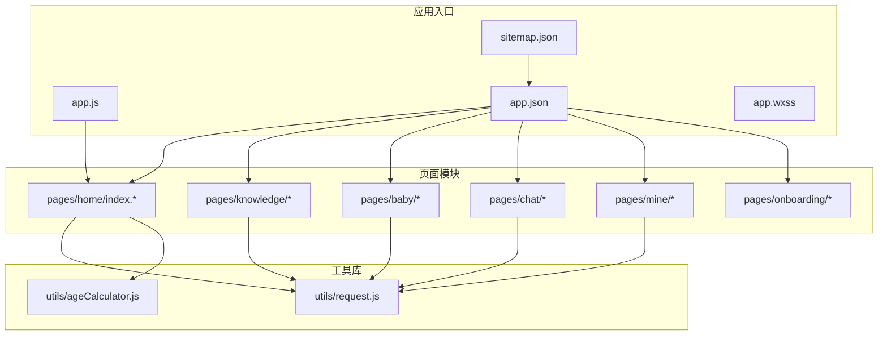
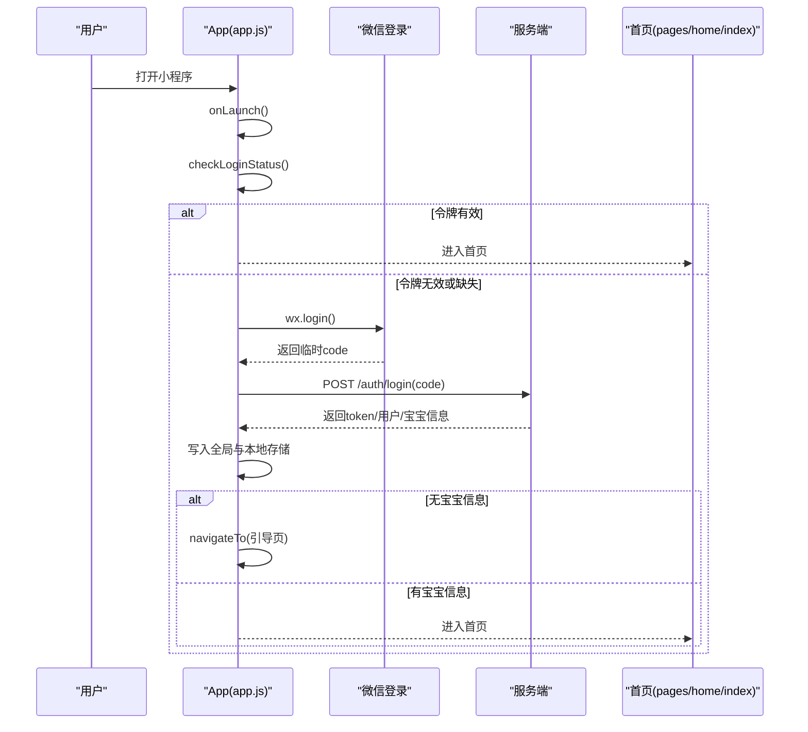
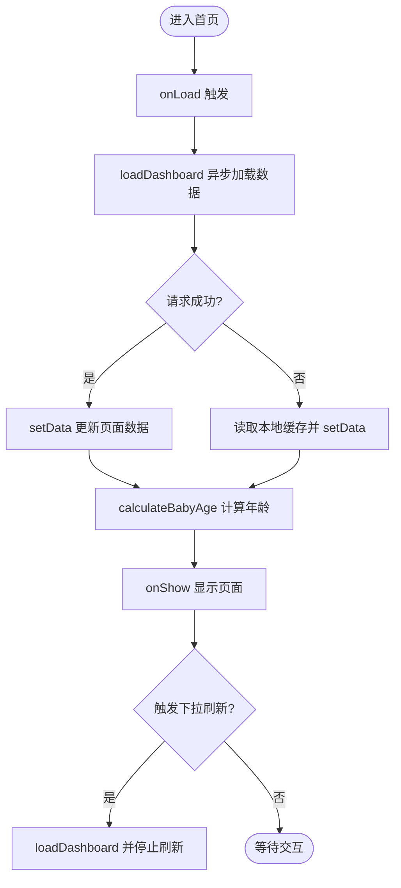
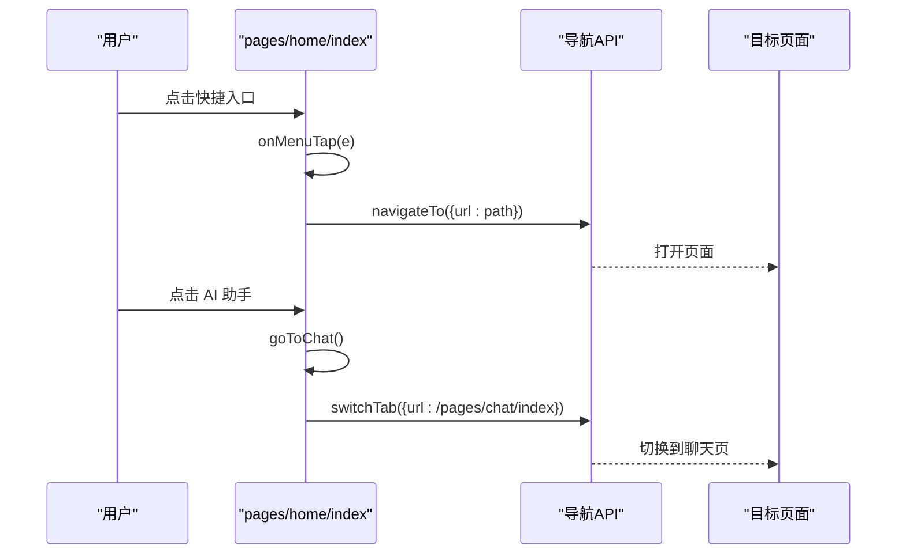
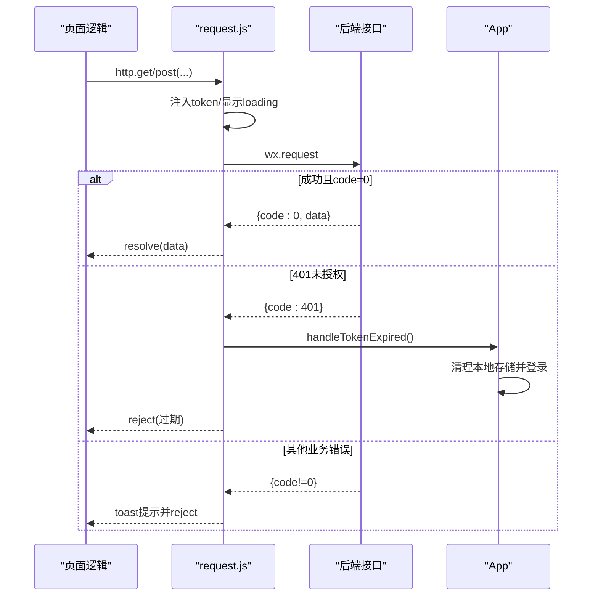
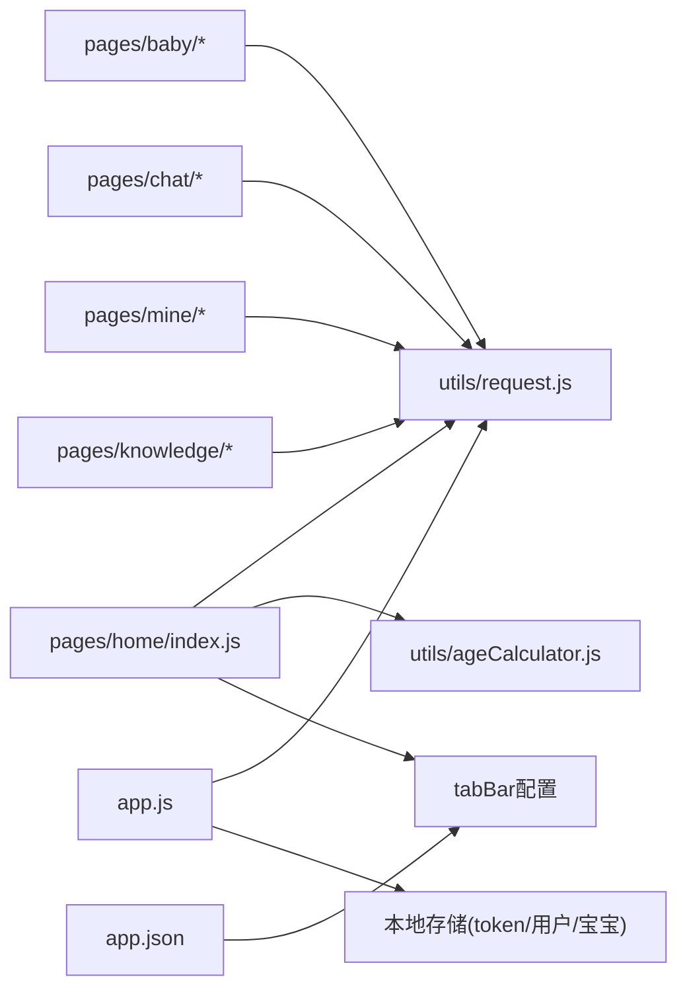

# 页面系统

<cite>
**本文引用的文件**
- [app.json](file://miniprogram/app.json)
- [app.js](file://miniprogram/app.js)
- [sitemap.json](file://miniprogram/sitemap.json)
- [app.wxss](file://miniprogram/app.wxss)
- [pages/home/index.js](file://miniprogram/pages/home/index.js)
- [pages/home/index.json](file://miniprogram/pages/home/index.json)
- [pages/home/index.wxml](file://miniprogram/pages/home/index.wxml)
- [pages/home/index.wxss](file://miniprogram/pages/home/index.wxss)
- [pages/baby/add-record.json](file://miniprogram/pages/baby/add-record.json)
- [pages/chat/index.json](file://miniprogram/pages/chat/index.json)
- [pages/mine/index.json](file://miniprogram/pages/mine/index.json)
- [pages/knowledge/timeline.json](file://miniprogram/pages/knowledge/timeline.json)
- [pages/baby/profile.json](file://miniprogram/pages/baby/profile.json)
- [pages/onboarding/index.json](file://miniprogram/pages/onboarding/index.json)
- [utils/request.js](file://miniprogram/utils/request.js)
- [utils/ageCalculator.js](file://miniprogram/utils/ageCalculator.js)
</cite>

## 目录
1. [简介](#简介)
2. [项目结构](#项目结构)
3. [核心组件](#核心组件)
4. [架构总览](#架构总览)
5. [详细组件分析](#详细组件分析)
6. [依赖关系分析](#依赖关系分析)
7. [性能考虑](#性能考虑)
8. [故障排查指南](#故障排查指南)
9. [结论](#结论)
10. [附录](#附录)

## 简介
本文件面向“AI育儿助手”微信小程序的页面系统，围绕页面路由机制、页面生命周期管理、页面间导航与参数传递、全局与页面级配置、页面结构文件(.json/.wxml/.wxss)的作用与规范、页面初始化流程、数据绑定与事件处理模式进行系统化梳理，并结合项目现有实现提供最佳实践建议与可视化图示，帮助开发者构建规范、可维护的小程序页面结构。

## 项目结构
小程序采用按功能域分层的页面组织方式，核心目录如下：
- miniprogram/pages：页面集合，按模块划分（如 home、knowledge、baby、chat、mine、onboarding）
- miniprogram/utils：通用工具（网络请求、年龄计算等）
- miniprogram/assets/icons：图标资源
- miniprogram/styles：样式资源
- miniprogram/app.*：应用级入口与全局样式
- server：后端服务（接口定义与实现）

下图展示页面系统在项目中的位置与关系：

图表来源
- [app.json:1-60](file://miniprogram/app.json#L1-L60)
- [app.js:1-69](file://miniprogram/app.js#L1-L69)
- [sitemap.json:1-9](file://miniprogram/sitemap.json#L1-L9)
- [pages/home/index.js:1-114](file://miniprogram/pages/home/index.js#L1-L114)
- [utils/request.js:1-97](file://miniprogram/utils/request.js#L1-L97)
- [utils/ageCalculator.js:1-86](file://miniprogram/utils/ageCalculator.js#L1-L86)

章节来源
- [app.json:1-60](file://miniprogram/app.json#L1-L60)
- [app.js:1-69](file://miniprogram/app.js#L1-L69)
- [sitemap.json:1-9](file://miniprogram/sitemap.json#L1-L9)

## 核心组件
本节聚焦页面系统的关键组成与职责：
- 应用级配置与启动：app.json定义页面清单、窗口样式、tabBar；app.js负责登录态检查与引导跳转
- 页面级配置：各页面的 .json 控制导航栏标题、下拉刷新等
- 页面结构：.wxml 描述结构与数据绑定，.wxss 提供样式与动画
- 页面逻辑：.js 管理生命周期、数据绑定、事件处理与页面间导航
- 工具链：网络请求封装统一鉴权与错误处理；年龄计算工具用于首页年龄展示

章节来源
- [app.json:1-60](file://miniprogram/app.json#L1-L60)
- [app.js:1-69](file://miniprogram/app.js#L1-L69)
- [pages/home/index.js:1-114](file://miniprogram/pages/home/index.js#L1-L114)
- [utils/request.js:1-97](file://miniprogram/utils/request.js#L1-L97)
- [utils/ageCalculator.js:1-86](file://miniprogram/utils/ageCalculator.js#L1-L86)

## 架构总览
页面系统遵循“应用级配置 + 页面级配置 + 页面逻辑与视图”的三层结构。应用启动时通过 app.js 完成登录态校验，必要时引导至引导页；页面通过 app.json 的 pages 列表注册，tabBar 将常用入口固定在底部导航。

图表来源
- [app.js:10-67](file://miniprogram/app.js#L10-L67)

章节来源
- [app.js:1-69](file://miniprogram/app.js#L1-L69)
- [app.json:1-60](file://miniprogram/app.json#L1-L60)

## 详细组件分析

### 页面路由与页面清单（app.json）
- 页面清单 pages：声明所有页面路径，决定页面栈与可访问性
- 窗口样式 window：统一导航栏与背景色、文字颜色
- tabBar：底部导航配置，包含选中/未选中图标、对应 pagePath、文案
- 其他：样式版本、sitemap 配置、懒加载策略

章节来源
- [app.json:1-60](file://miniprogram/app.json#L1-L60)
- [sitemap.json:1-9](file://miniprogram/sitemap.json#L1-L9)

### 页面级配置（.json）
- 导航栏标题：各页面 json 中设置 navigationBarTitleText
- 下拉刷新：首页启用 enablePullDownRefresh
- 其他：可扩展至导航栏样式、分享配置等

章节来源
- [pages/home/index.json:1-5](file://miniprogram/pages/home/index.json#L1-L5)
- [pages/baby/add-record.json:1-4](file://miniprogram/pages/baby/add-record.json#L1-L4)
- [pages/chat/index.json:1-4](file://miniprogram/pages/chat/index.json#L1-L4)
- [pages/mine/index.json:1-4](file://miniprogram/pages/mine/index.json#L1-L4)
- [pages/knowledge/timeline.json:1-4](file://miniprogram/pages/knowledge/timeline.json#L1-L4)
- [pages/baby/profile.json:1-4](file://miniprogram/pages/baby/profile.json#L1-L4)
- [pages/onboarding/index.json:1-4](file://miniprogram/pages/onboarding/index.json#L1-L4)

### 页面结构文件（.wxml/.wxss）
- 结构与数据绑定：首页 wxml 使用条件渲染、列表渲染与数据绑定，展示宝宝信息、快捷入口、推荐内容等
- 样式与主题：app.wxss 定义设计系统变量、卡片、按钮、渐变、阴影、动画与骨架屏等通用样式，页面 wxss 可按需覆盖

章节来源
- [pages/home/index.wxml:1-86](file://miniprogram/pages/home/index.wxml#L1-L86)
- [app.wxss:1-313](file://miniprogram/app.wxss#L1-L313)

### 页面逻辑（.js）与生命周期
- 生命周期钩子：onLoad、onShow、onPullDownRefresh 等
- 数据绑定：data 初始化、setData 更新视图
- 事件处理：bindtap 等事件回调，调用导航 API 实现页面跳转
- 页面间导航：navigateTo、switchTab 等

章节来源
- [pages/home/index.js:1-114](file://miniprogram/pages/home/index.js#L1-L114)

### 页面初始化流程与数据绑定
- 初始化：onLoad 触发数据加载；onShow 在每次显示时刷新本地缓存并更新界面
- 数据来源：通过网络请求封装获取聚合数据；若失败则回退到本地缓存
- 年龄计算：调用年龄计算工具生成年龄文本与日龄信息

图表来源
- [pages/home/index.js:24-82](file://miniprogram/pages/home/index.js#L24-L82)
- [utils/ageCalculator.js:7-41](file://miniprogram/utils/ageCalculator.js#L7-L41)

章节来源
- [pages/home/index.js:1-114](file://miniprogram/pages/home/index.js#L1-L114)
- [utils/ageCalculator.js:1-86](file://miniprogram/utils/ageCalculator.js#L1-L86)

### 事件处理与页面间导航
- 事件绑定：wxml 中通过 bindtap 绑定事件，回调在 js 中实现
- 导航 API 使用：
  - switchTab：跳转至 tabbar 页面（如 AI 助手）
  - navigateTo：打开新页面（非 tabbar 页面）
- 参数传递：通过 URL 查询参数携带简单数据（如 type、id）

图表来源
- [pages/home/index.js:87-104](file://miniprogram/pages/home/index.js#L87-L104)

章节来源
- [pages/home/index.js:1-114](file://miniprogram/pages/home/index.js#L1-L114)

### 网络请求与鉴权
- 统一封装：request.js 提供 get/post/put/delete 方法，自动注入 Authorization 头
- 错误处理：业务错误提示、网络错误提示
- Token 过期：拦截 401，清理本地存储并触发重新登录

图表来源
- [utils/request.js:21-86](file://miniprogram/utils/request.js#L21-L86)
- [app.js:35-67](file://miniprogram/app.js#L35-L67)

章节来源
- [utils/request.js:1-97](file://miniprogram/utils/request.js#L1-L97)
- [app.js:1-69](file://miniprogram/app.js#L1-L69)

## 依赖关系分析
- 页面对工具的依赖：各页面通过 utils/request.js 发起网络请求；首页使用 utils/ageCalculator.js 计算年龄
- 页面间依赖：首页通过导航 API 跳转至引导页、聊天页、知识页、宝宝页、我的页等
- 应用级依赖：app.js 依赖 utils/request.js 与本地存储；app.json 决定页面注册与 tabbar 行为

图表来源
- [pages/home/index.js:1-114](file://miniprogram/pages/home/index.js#L1-L114)
- [utils/request.js:1-97](file://miniprogram/utils/request.js#L1-L97)
- [utils/ageCalculator.js:1-86](file://miniprogram/utils/ageCalculator.js#L1-L86)
- [app.js:1-69](file://miniprogram/app.js#L1-L69)
- [app.json:1-60](file://miniprogram/app.json#L1-L60)

章节来源
- [pages/home/index.js:1-114](file://miniprogram/pages/home/index.js#L1-L114)
- [utils/request.js:1-97](file://miniprogram/utils/request.js#L1-L97)
- [utils/ageCalculator.js:1-86](file://miniprogram/utils/ageCalculator.js#L1-L86)
- [app.js:1-69](file://miniprogram/app.js#L1-L69)
- [app.json:1-60](file://miniprogram/app.json#L1-L60)

## 性能考虑
- 首屏渲染：首页使用骨架屏与渐显动画提升感知性能
- 数据缓存：本地缓存兜底，减少首次加载失败的影响
- 网络优化：统一 loading 与错误提示，避免重复请求
- 页面栈管理：合理使用 navigateTo 与 switchTab，避免深层页面栈导致内存压力
- 样式复用：通过 app.wxss 定义设计系统变量，减少重复样式计算

章节来源
- [app.wxss:242-313](file://miniprogram/app.wxss#L242-L313)
- [pages/home/index.js:46-71](file://miniprogram/pages/home/index.js#L46-L71)

## 故障排查指南
- 登录态异常
  - 现象：频繁弹出登录或接口 401
  - 排查：确认本地 token 是否存在且未过期；检查 handleTokenExpired 流程是否正确执行
  - 参考
    - [app.js:18-30](file://miniprogram/app.js#L18-L30)
    - [utils/request.js:78-86](file://miniprogram/utils/request.js#L78-L86)
- 页面无法打开
  - 现象：navigateTo/switchTab 无效
  - 排查：确认 app.json 中 pages 已注册；switchTab 目标必须为 tabbar 页面
  - 参考
    - [app.json:2-16](file://miniprogram/app.json#L2-L16)
    - [pages/home/index.js:95-97](file://miniprogram/pages/home/index.js#L95-L97)
- 下拉刷新不生效
  - 现象：onPullDownRefresh 未触发
  - 排查：确认页面 .json 启用了 enablePullDownRefresh；确保在回调中调用停止刷新
  - 参考
    - [pages/home/index.json:3-4](file://miniprogram/pages/home/index.json#L3-L4)
    - [pages/home/index.js:37-41](file://miniprogram/pages/home/index.js#L37-L41)
- 数据不更新
  - 现象：onShow 未刷新或数据未渲染
  - 排查：确认 setData 调用与数据字段一致；检查 wxml 条件渲染与列表渲染键值
  - 参考
    - [pages/home/index.js:28-35](file://miniprogram/pages/home/index.js#L28-L35)
    - [pages/home/index.wxml:4-84](file://miniprogram/pages/home/index.wxml#L4-L84)

章节来源
- [app.js:1-69](file://miniprogram/app.js#L1-L69)
- [utils/request.js:1-97](file://miniprogram/utils/request.js#L1-L97)
- [app.json:1-60](file://miniprogram/app.json#L1-L60)
- [pages/home/index.json:1-5](file://miniprogram/pages/home/index.json#L1-L5)
- [pages/home/index.js:1-114](file://miniprogram/pages/home/index.js#L1-L114)
- [pages/home/index.wxml:1-86](file://miniprogram/pages/home/index.wxml#L1-L86)

## 结论
本页面系统以 app.json 为路由与导航中枢，以 app.js 为启动与登录态控制核心，以页面级 .json/.wxml/.wxss/.js 形成清晰的职责边界。通过统一的网络请求封装与工具函数，实现了稳定的页面初始化、数据绑定与事件处理流程。建议在后续迭代中进一步完善页面间通信机制（如全局事件总线）、增强错误监控与埋点统计，以持续提升用户体验与开发效率。

## 附录

### 页面配置示例与规范
- 页面级 .json
  - 导航栏标题：navigationBarTitleText
  - 下拉刷新：enablePullDownRefresh
  - 示例参考
    - [pages/home/index.json:1-5](file://miniprogram/pages/home/index.json#L1-L5)
    - [pages/baby/add-record.json:1-4](file://miniprogram/pages/baby/add-record.json#L1-L4)
- 应用级 app.json
  - 页面清单：pages
  - 窗口样式：window
  - 底部导航：tabBar
  - 示例参考
    - [app.json:1-60](file://miniprogram/app.json#L1-L60)

### 生命周期钩子使用方法
- onLaunch：应用启动时执行，进行登录态检查与引导
- onLoad：页面加载时执行，进行数据初始化
- onShow：页面显示时执行，刷新本地缓存
- onPullDownRefresh：启用下拉刷新时触发
- 示例参考
  - [app.js:10-13](file://miniprogram/app.js#L10-L13)
  - [pages/home/index.js:24-41](file://miniprogram/pages/home/index.js#L24-L41)

### 页面间通信最佳实践
- 简单参数：通过 URL 查询参数传递（如 type、id）
- 全局状态：通过 App 全局数据与本地存储共享
- 事件通信：可在页面间通过自定义事件或全局事件总线进行松耦合通信（建议在后续实现中引入）
- 示例参考
  - [pages/home/index.js:87-112](file://miniprogram/pages/home/index.js#L87-L112)