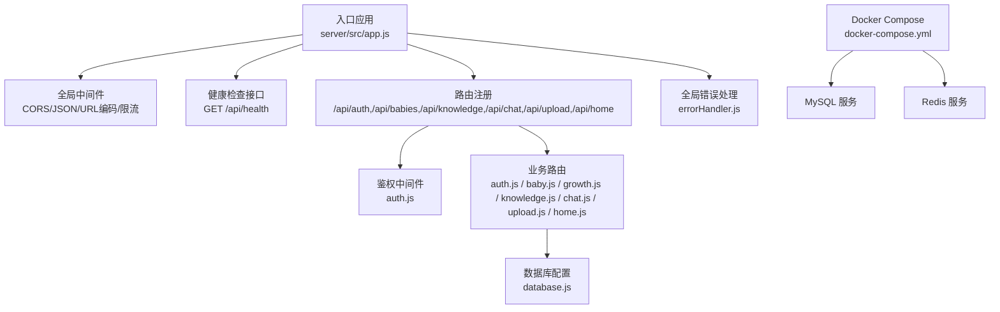
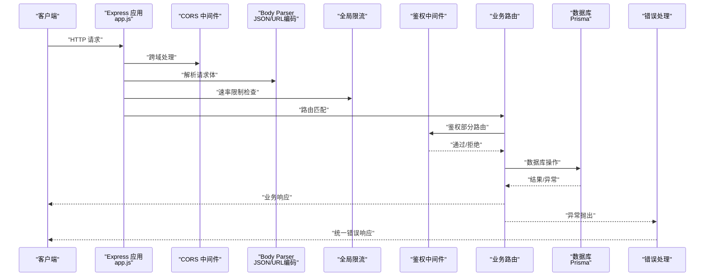
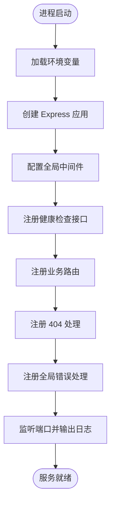
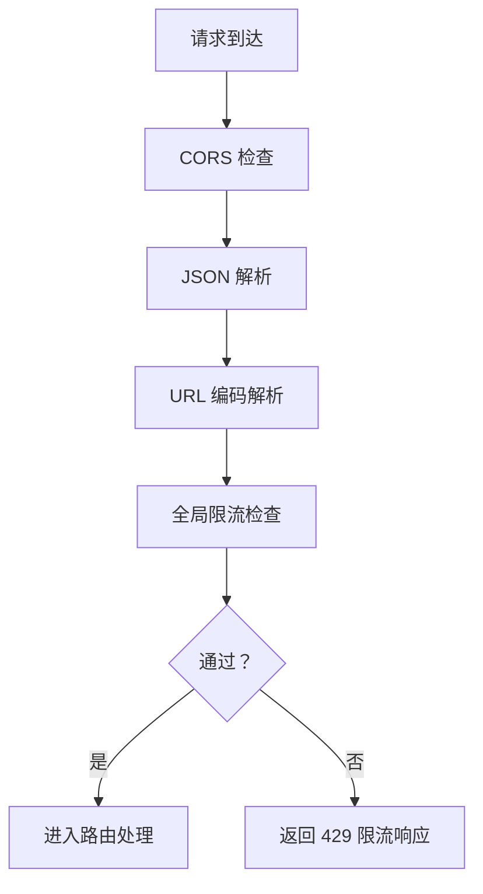
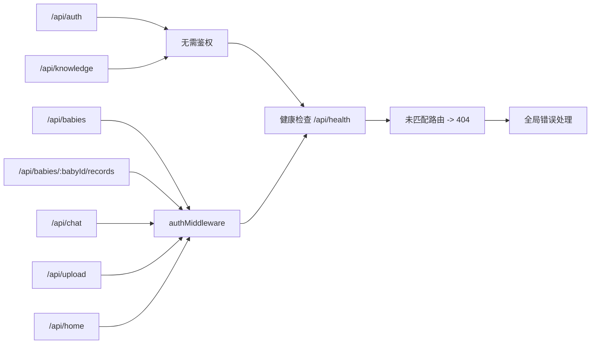
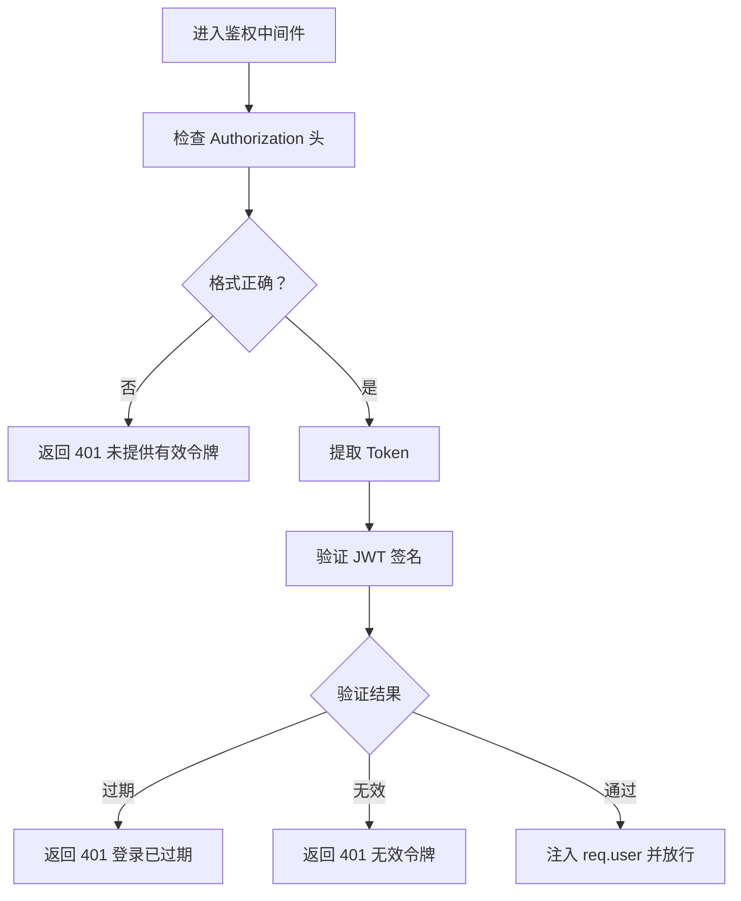
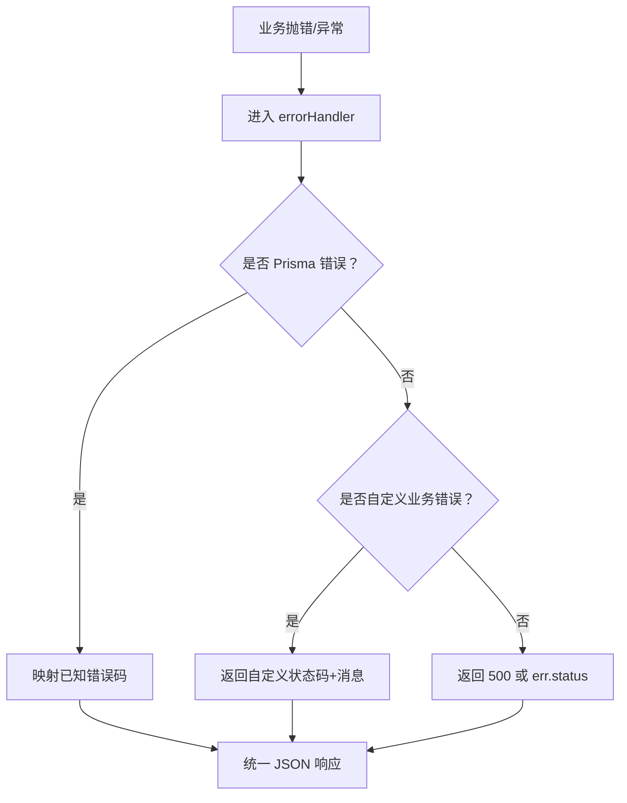
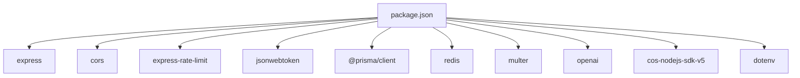

# Express服务器配置

<cite>
**本文引用的文件**
- [server/src/app.js](file://server/src/app.js)
- [server/package.json](file://server/package.json)
- [server/src/middleware/errorHandler.js](file://server/src/middleware/errorHandler.js)
- [server/src/middleware/auth.js](file://server/src/middleware/auth.js)
- [server/src/config/database.js](file://server/src/config/database.js)
- [server/src/routes/auth.js](file://server/src/routes/auth.js)
- [server/src/routes/baby.js](file://server/src/routes/baby.js)
- [server/src/routes/growth.js](file://server/src/routes/growth.js)
- [server/src/routes/knowledge.js](file://server/src/routes/knowledge.js)
- [server/src/routes/chat.js](file://server/src/routes/chat.js)
- [server/src/routes/upload.js](file://server/src/routes/upload.js)
- [server/src/routes/home.js](file://server/src/routes/home.js)
- [server/docker-compose.yml](file://server/docker-compose.yml)
</cite>

## 目录
1. [简介](#简介)
2. [项目结构](#项目结构)
3. [核心组件](#核心组件)
4. [架构总览](#架构总览)
5. [详细组件分析](#详细组件分析)
6. [依赖关系分析](#依赖关系分析)
7. [性能考虑](#性能考虑)
8. [故障排查指南](#故障排查指南)
9. [结论](#结论)
10. [附录](#附录)

## 简介
本文件系统性梳理了安心育儿小程序后端 Express 服务器的配置与实现，覆盖服务器初始化、全局中间件（CORS、JSON 解析、URL 编码、限流）、路由注册机制、鉴权中间件、统一错误处理、健康检查接口、数据库连接管理以及环境变量与容器化部署要点。文档以“可读性优先”的原则，结合图示帮助读者快速理解并优化该服务。

## 项目结构
后端采用模块化组织方式：入口文件负责应用装配与启动；中间件层提供鉴权与错误处理；路由层按业务域划分；配置层集中数据库客户端与日志级别控制；Docker Compose 提供本地数据库与缓存服务编排。

图表来源
- [server/src/app.js:11-65](file://server/src/app.js#L11-L65)
- [server/src/middleware/auth.js:1-29](file://server/src/middleware/auth.js#L1-L29)
- [server/src/middleware/errorHandler.js:1-52](file://server/src/middleware/errorHandler.js#L1-L52)
- [server/src/config/database.js:1-17](file://server/src/config/database.js#L1-L17)
- [server/docker-compose.yml:1-32](file://server/docker-compose.yml#L1-L32)

章节来源
- [server/src/app.js:11-65](file://server/src/app.js#L11-L65)
- [server/package.json:1-31](file://server/package.json#L1-L31)
- [server/docker-compose.yml:1-32](file://server/docker-compose.yml#L1-L32)

## 核心组件
- 应用入口与启动
  - 使用 dotenv 加载环境变量，创建 Express 应用，监听端口并输出启动日志。
  - 参考路径：[server/src/app.js:4-65](file://server/src/app.js#L4-L65)
- 全局中间件
  - CORS：允许跨域访问。
  - JSON 解析：解析 application/json 请求体。
  - URL 编码解析：解析 application/x-www-form-urlencoded 请求体。
  - 全局限流：对 /api/ 路径下的请求按 IP 进行速率限制（默认每分钟 60 次）。
  - 参考路径：[server/src/app.js:14-25](file://server/src/app.js#L14-L25)
- 健康检查
  - 提供 /api/health 接口返回时间戳等状态信息。
  - 参考路径：[server/src/app.js:27-30](file://server/src/app.js#L27-L30)
- 路由注册
  - 将各业务路由挂载至 /api/* 前缀，并在需要鉴权的路由链路中串联鉴权中间件。
  - 参考路径：[server/src/app.js:32-47](file://server/src/app.js#L32-L47)
- 404 与全局错误处理
  - 未匹配路由统一返回 404；全局错误处理器统一格式化错误响应。
  - 参考路径：[server/src/app.js:49-55](file://server/src/app.js#L49-L55)
- 鉴权中间件
  - 从 Authorization 头部提取 Bearer Token 并校验，成功则注入 req.user，失败返回 401。
  - 参考路径：[server/src/middleware/auth.js:1-29](file://server/src/middleware/auth.js#L1-L29)
- 错误处理中间件
  - 支持 Prisma 已知错误码映射、自定义业务错误、未知错误统一返回。
  - 参考路径：[server/src/middleware/errorHandler.js:1-52](file://server/src/middleware/errorHandler.js#L1-L52)
- 数据库配置
  - Prisma 客户端单例，开发环境下开启查询/错误/警告日志，退出前优雅断开连接。
  - 参考路径：[server/src/config/database.js:1-17](file://server/src/config/database.js#L1-L17)

章节来源
- [server/src/app.js:4-65](file://server/src/app.js#L4-L65)
- [server/src/middleware/auth.js:1-29](file://server/src/middleware/auth.js#L1-L29)
- [server/src/middleware/errorHandler.js:1-52](file://server/src/middleware/errorHandler.js#L1-L52)
- [server/src/config/database.js:1-17](file://server/src/config/database.js#L1-L17)

## 架构总览
下图展示了从请求进入、中间件处理、路由匹配、业务处理到响应返回的整体流程，以及鉴权与错误处理在其中的位置。

图表来源
- [server/src/app.js:14-55](file://server/src/app.js#L14-L55)
- [server/src/middleware/auth.js:7-26](file://server/src/middleware/auth.js#L7-L26)
- [server/src/middleware/errorHandler.js:6-39](file://server/src/middleware/errorHandler.js#L6-L39)
- [server/src/config/database.js:7-14](file://server/src/config/database.js#L7-L14)

## 详细组件分析

### 服务器初始化与启动流程
- 初始化步骤
  - 加载环境变量。
  - 创建 Express 应用实例。
  - 配置全局中间件（CORS、JSON、URL 编码、限流）。
  - 注册健康检查与业务路由。
  - 注册 404 与全局错误处理。
  - 监听端口并输出启动日志。
- 关键实现参考
  - [server/src/app.js:4-65](file://server/src/app.js#L4-L65)

图表来源
- [server/src/app.js:4-65](file://server/src/app.js#L4-L65)

章节来源
- [server/src/app.js:4-65](file://server/src/app.js#L4-L65)

### 全局中间件详解
- CORS
  - 默认使用 cors()，允许常见跨域场景；如需定制可传入配置对象。
  - 参考路径：[server/src/app.js:15](file://server/src/app.js#L15)
- JSON 解析
  - express.json() 解析 application/json。
  - 参考路径：[server/src/app.js:16](file://server/src/app.js#L16)
- URL 编码解析
  - express.urlencoded({ extended: true }) 解析 x-www-form-urlencoded。
  - 参考路径：[server/src/app.js:17](file://server/src/app.js#L17)
- 全局限流
  - 使用 express-rate-limit，窗口 60 秒，最大 60 次，针对 /api/ 路由。
  - 参考路径：[server/src/app.js:19-25](file://server/src/app.js#L19-L25)

图表来源
- [server/src/app.js:15-25](file://server/src/app.js#L15-L25)

章节来源
- [server/src/app.js:15-25](file://server/src/app.js#L15-L25)

### 路由注册机制
- 路由前缀与鉴权串联
  - /api/auth：无需鉴权。
  - /api/babies：需鉴权。
  - /api/babies/:babyId/records：需鉴权。
  - /api/knowledge：无需鉴权。
  - /api/chat、/api/upload、/api/home：需鉴权。
- 404 与错误处理
  - 未匹配路由统一返回 404。
  - 全局错误处理器统一格式化错误响应。
- 参考路径
  - [server/src/app.js:32-55](file://server/src/app.js#L32-L55)

图表来源
- [server/src/app.js:32-55](file://server/src/app.js#L32-L55)

章节来源
- [server/src/app.js:32-55](file://server/src/app.js#L32-L55)

### 鉴权中间件实现
- 功能要点
  - 从 Authorization 头提取 Bearer Token。
  - 使用 JWT 密钥验证签名，处理过期与无效令牌。
  - 成功时将用户信息注入 req.user，调用 next()。
- 参考路径
  - [server/src/middleware/auth.js:1-29](file://server/src/middleware/auth.js#L1-L29)

图表来源
- [server/src/middleware/auth.js:7-26](file://server/src/middleware/auth.js#L7-L26)

章节来源
- [server/src/middleware/auth.js:1-29](file://server/src/middleware/auth.js#L1-L29)

### 统一错误处理机制
- 错误分类与处理
  - Prisma 已知错误码映射（如唯一约束冲突、记录不存在）。
  - 自定义业务错误（带 statusCode）。
  - 未知错误：根据 err.status 或 500 返回统一格式。
- 开发/生产差异
  - 开发环境返回具体错误消息，生产环境返回通用提示。
- 参考路径
  - [server/src/middleware/errorHandler.js:1-52](file://server/src/middleware/errorHandler.js#L1-L52)

图表来源
- [server/src/middleware/errorHandler.js:6-39](file://server/src/middleware/errorHandler.js#L6-L39)

章节来源
- [server/src/middleware/errorHandler.js:1-52](file://server/src/middleware/errorHandler.js#L1-L52)

### 数据库连接与优雅关闭
- Prisma 客户端
  - 单例模式，避免重复连接。
  - 开发环境开启查询/错误/警告日志，便于调试。
  - 退出前断开连接，避免进程无法正常退出。
- 参考路径
  - [server/src/config/database.js:1-17](file://server/src/config/database.js#L1-L17)

章节来源
- [server/src/config/database.js:1-17](file://server/src/config/database.js#L1-L17)

### 健康检查接口
- 接口
  - GET /api/health 返回时间戳等状态信息。
- 参考路径
  - [server/src/app.js:27-30](file://server/src/app.js#L27-L30)

章节来源
- [server/src/app.js:27-30](file://server/src/app.js#L27-L30)

### 业务路由概览
- /api/auth
  - 登录：换取 JWT，关联用户与宝宝信息。
  - 参考路径：[server/src/routes/auth.js:1-84](file://server/src/routes/auth.js#L1-L84)
- /api/babies
  - 新增、查询、更新宝宝档案。
  - 参考路径：[server/src/routes/baby.js:1-100](file://server/src/routes/baby.js#L1-L100)
- /api/babies/:babyId/records
  - 成长记录新增、分页查询、详情、更新、删除。
  - 参考路径：[server/src/routes/growth.js:1-118](file://server/src/routes/growth.js#L1-L118)
- /api/knowledge
  - 时间线与月度知识查询。
  - 参考路径：[server/src/routes/knowledge.js:1-59](file://server/src/routes/knowledge.js#L1-L59)
- /api/chat
  - 对话列表、详情、删除；发送接口预留。
  - 参考路径：[server/src/routes/chat.js:1-57](file://server/src/routes/chat.js#L1-L57)
- /api/upload
  - 图片上传接口预留。
  - 参考路径：[server/src/routes/upload.js:1-10](file://server/src/routes/upload.js#L1-L10)
- /api/home
  - 首页聚合：宝宝信息、最新身高体重、当月发育提醒。
  - 参考路径：[server/src/routes/home.js:1-62](file://server/src/routes/home.js#L1-L62)

章节来源
- [server/src/routes/auth.js:1-84](file://server/src/routes/auth.js#L1-L84)
- [server/src/routes/baby.js:1-100](file://server/src/routes/baby.js#L1-L100)
- [server/src/routes/growth.js:1-118](file://server/src/routes/growth.js#L1-L118)
- [server/src/routes/knowledge.js:1-59](file://server/src/routes/knowledge.js#L1-L59)
- [server/src/routes/chat.js:1-57](file://server/src/routes/chat.js#L1-L57)
- [server/src/routes/upload.js:1-10](file://server/src/routes/upload.js#L1-L10)
- [server/src/routes/home.js:1-62](file://server/src/routes/home.js#L1-L62)

## 依赖关系分析
- 依赖清单与脚本
  - Express、CORS、JSON/URL 编码解析、速率限制、JWT、Prisma、Redis、Multer、OpenAI、腾讯云 COS SDK 等。
  - 启动脚本：开发模式使用 nodemon，生产模式直接运行。
- 参考路径
  - [server/package.json:1-31](file://server/package.json#L1-L31)

图表来源
- [server/package.json:14-30](file://server/package.json#L14-L30)

章节来源
- [server/package.json:1-31](file://server/package.json#L1-L31)

## 性能考虑
- 限流策略
  - 当前全局限流窗口 60 秒、最大 60 次，适合开发/小规模测试；生产建议：
    - 按路由细化限流（如登录接口单独更严格）。
    - 结合 Redis 存储限流状态，支持多实例部署。
    - 针对不同用户角色设置差异化阈值。
- 日志级别
  - 开发环境开启 Prisma 查询日志，便于定位慢查询；生产建议仅保留错误与警告。
- 数据库连接
  - 使用 Prisma 单例，避免重复连接；确保连接池参数合理（如最大连接数、超时）。
- 上传与第三方服务
  - 图片上传与 AI 对话接口为预留实现，建议在接入时启用超时与重试策略，并对输入进行大小与类型校验。

[本节为通用指导，不直接分析具体文件]

## 故障排查指南
- 常见问题与定位
  - 401 未授权：确认 Authorization 头格式为 Bearer Token，且未过期。
    - 参考路径：[server/src/middleware/auth.js:10-25](file://server/src/middleware/auth.js#L10-L25)
  - 404 接口不存在：检查路由前缀与路径是否匹配。
    - 参考路径：[server/src/app.js:49-52](file://server/src/app.js#L49-L52)
  - 429 请求频繁：调整限流策略或增加配额。
    - 参考路径：[server/src/app.js:19-25](file://server/src/app.js#L19-L25)
  - 500 服务器内部错误：查看服务端日志，区分开发/生产环境错误信息差异。
    - 参考路径：[server/src/middleware/errorHandler.js:34-38](file://server/src/middleware/errorHandler.js#L34-L38)
- 数据库相关
  - Prisma 错误码：如唯一约束冲突、记录不存在，会映射为 409/404。
    - 参考路径：[server/src/middleware/errorHandler.js:9-23](file://server/src/middleware/errorHandler.js#L9-L23)
- 启动与环境
  - 端口占用：修改 PORT 或释放端口。
  - 环境变量缺失：确认 .env 文件存在必要字段（如 JWT_SECRET、WX_APPID、WX_SECRET 等）。
    - 参考路径：[server/src/app.js:4](file://server/src/app.js#L4)

章节来源
- [server/src/middleware/auth.js:10-25](file://server/src/middleware/auth.js#L10-L25)
- [server/src/app.js:19-25](file://server/src/app.js#L19-L25)
- [server/src/middleware/errorHandler.js:9-38](file://server/src/middleware/errorHandler.js#L9-L38)

## 结论
本 Express 服务器以简洁清晰的方式实现了跨域、请求解析、限流、鉴权、统一错误处理与健康检查等关键能力，并通过模块化的路由设计支撑多业务域扩展。建议在生产环境中进一步完善限流策略、日志与监控、数据库连接池配置以及第三方服务的安全与稳定性保障。

[本节为总结性内容，不直接分析具体文件]

## 附录
- Docker Compose 服务
  - MySQL：提供数据库服务，字符集 utf8mb4，持久化存储。
  - Redis：提供缓存服务，内存上限与淘汰策略配置。
  - 参考路径：[server/docker-compose.yml:1-32](file://server/docker-compose.yml#L1-L32)

章节来源
- [server/docker-compose.yml:1-32](file://server/docker-compose.yml#L1-L32)