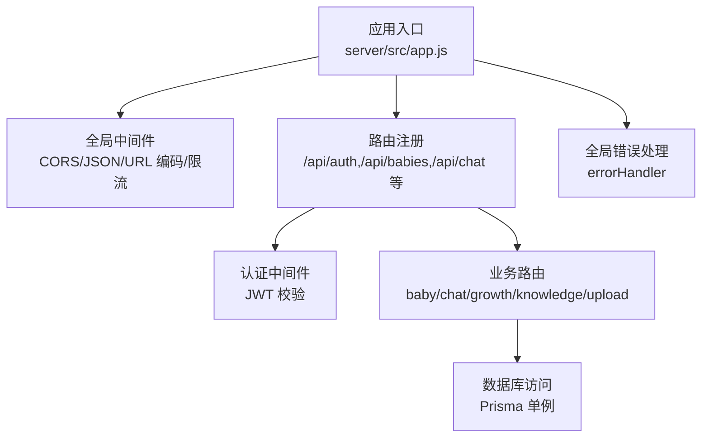
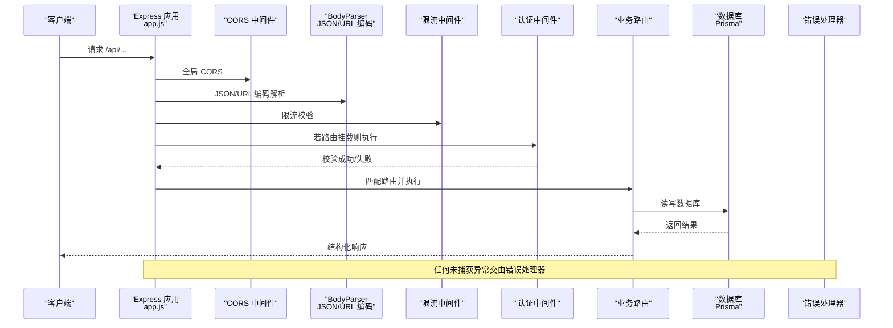
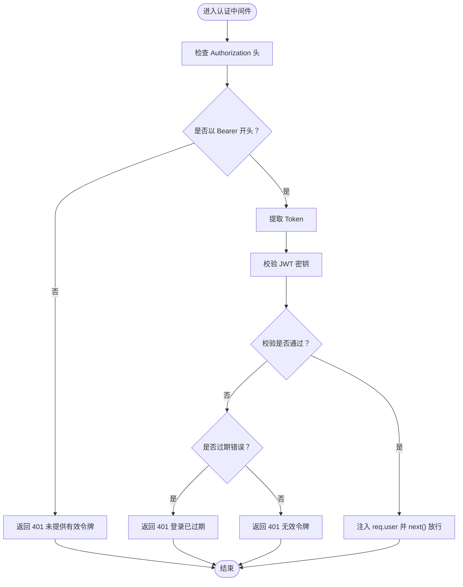
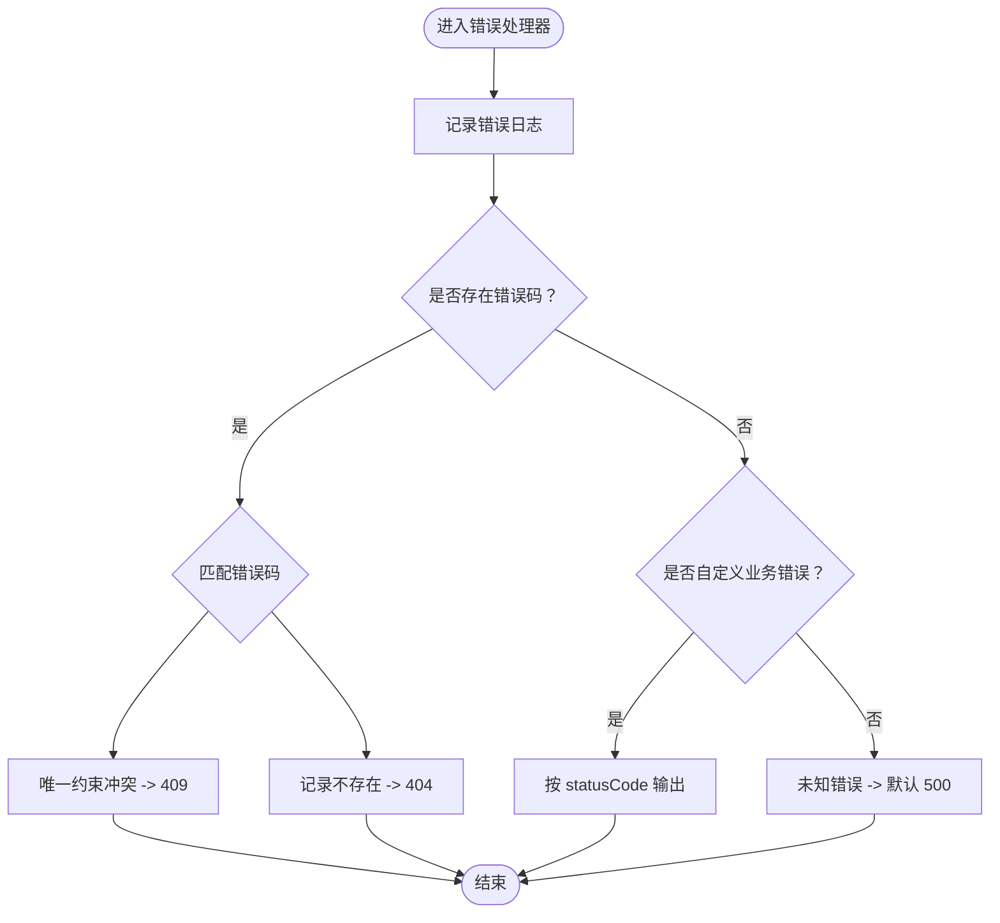
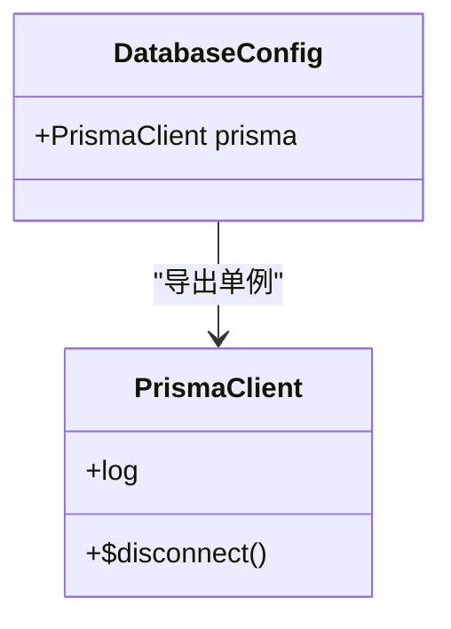
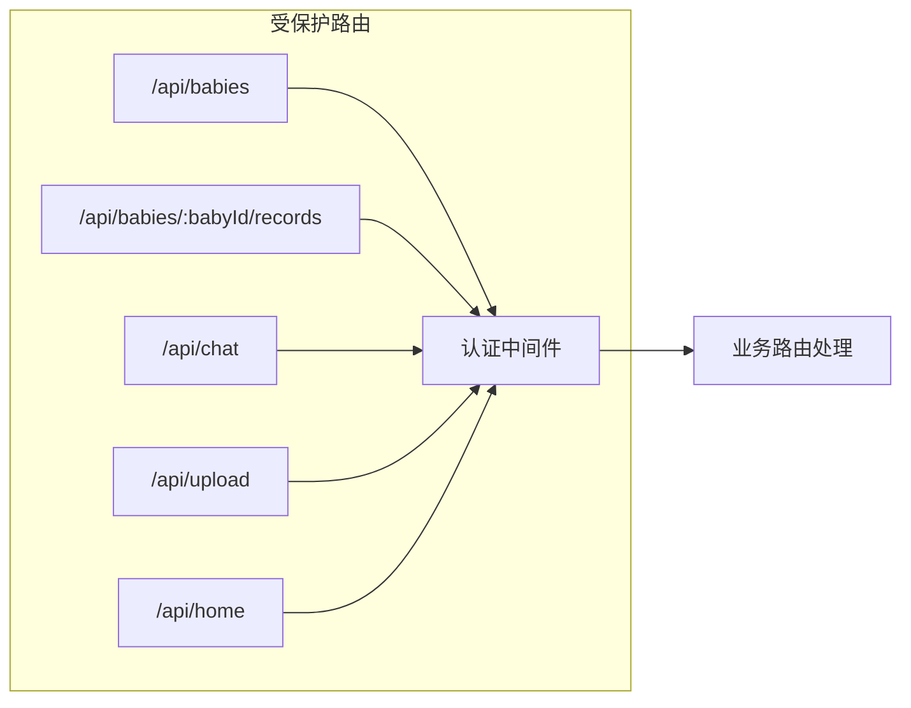
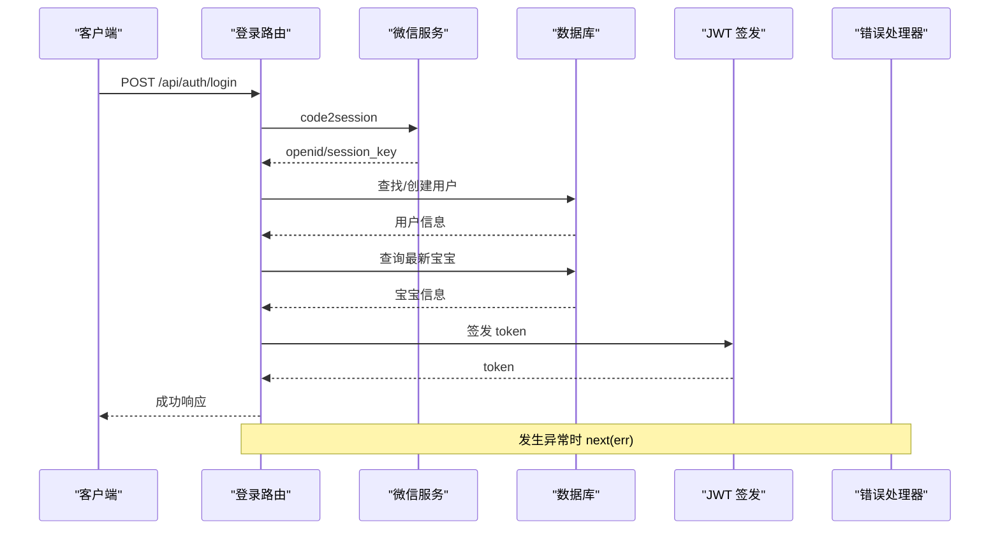
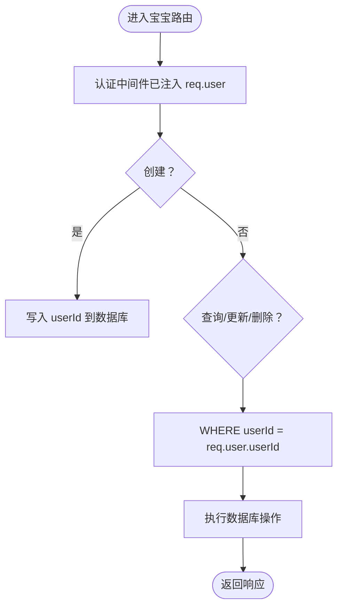
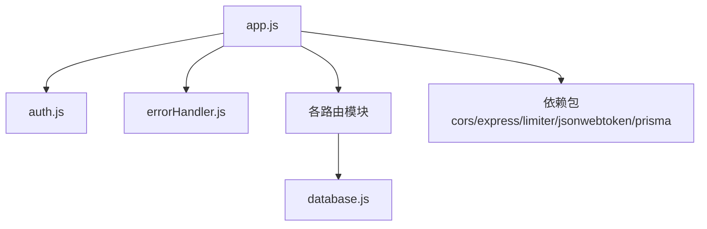

# 中间件系统

<cite>
**本文引用的文件**
- [server/src/app.js](file://server/src/app.js)
- [server/src/middleware/auth.js](file://server/src/middleware/auth.js)
- [server/src/middleware/errorHandler.js](file://server/src/middleware/errorHandler.js)
- [server/src/config/database.js](file://server/src/config/database.js)
- [server/src/routes/auth.js](file://server/src/routes/auth.js)
- [server/src/routes/baby.js](file://server/src/routes/baby.js)
- [server/src/routes/chat.js](file://server/src/routes/chat.js)
- [server/src/routes/growth.js](file://server/src/routes/growth.js)
- [server/src/routes/knowledge.js](file://server/src/routes/knowledge.js)
- [server/src/routes/upload.js](file://server/src/routes/upload.js)
- [server/package.json](file://server/package.json)
</cite>

## 目录
1. [简介](#简介)
2. [项目结构](#项目结构)
3. [核心组件](#核心组件)
4. [架构总览](#架构总览)
5. [详细组件分析](#详细组件分析)
6. [依赖关系分析](#依赖关系分析)
7. [性能考量](#性能考量)
8. [故障排查指南](#故障排查指南)
9. [结论](#结论)
10. [附录](#附录)

## 简介
本文件系统性梳理了本项目的中间件体系，重点覆盖以下方面：
- Express 中间件的执行顺序与链式调用机制
- 错误传播与统一错误处理策略
- 认证中间件的实现原理与使用方式
- 全局限流、CORS、JSON 解析等通用中间件的配置与作用
- 上下文共享（如 req.user）、参数传递与路由注册方式
- 自定义中间件开发指南、性能优化建议与调试技巧
- 中间件组合使用的最佳实践与常见陷阱

## 项目结构
后端采用 Express 应用，通过 app.js 统一注册全局中间件、路由与错误处理器；认证与错误处理分别以独立模块提供；数据库访问通过 Prisma 客户端单例共享。

图表来源
- [server/src/app.js:14-55](file://server/src/app.js#L14-L55)
- [server/src/middleware/auth.js:7-26](file://server/src/middleware/auth.js#L7-L26)
- [server/src/middleware/errorHandler.js:6-39](file://server/src/middleware/errorHandler.js#L6-L39)
- [server/src/config/database.js:7-14](file://server/src/config/database.js#L7-L14)

章节来源
- [server/src/app.js:1-65](file://server/src/app.js#L1-L65)
- [server/package.json:14-29](file://server/package.json#L14-L29)

## 核心组件
- 认证中间件：从 Authorization 头部提取 Bearer Token，校验 JWT 并将用户信息注入 req.user，随后调用 next() 放行或返回 401。
- 全局错误处理：统一捕获未处理异常，区分 Prisma 已知错误、自定义业务错误与未知错误，输出结构化响应。
- 数据库中间件：Prisma 客户端单例，按需在各路由中使用，支持开发环境日志。
- 全局中间件：CORS、JSON/URL 编码解析、基于 IP 的速率限制。
- 路由层：按模块划分，部分路由挂载认证中间件，确保受保护资源的安全访问。

章节来源
- [server/src/middleware/auth.js:7-26](file://server/src/middleware/auth.js#L7-L26)
- [server/src/middleware/errorHandler.js:6-39](file://server/src/middleware/errorHandler.js#L6-L39)
- [server/src/config/database.js:7-14](file://server/src/config/database.js#L7-L14)
- [server/src/app.js:14-55](file://server/src/app.js#L14-L55)

## 架构总览
下图展示从请求进入至响应返回的完整流程，包括中间件链路、认证与错误处理的关键节点。

图表来源
- [server/src/app.js:14-55](file://server/src/app.js#L14-L55)
- [server/src/middleware/auth.js:7-26](file://server/src/middleware/auth.js#L7-L26)
- [server/src/middleware/errorHandler.js:6-39](file://server/src/middleware/errorHandler.js#L6-L39)
- [server/src/config/database.js:7-14](file://server/src/config/database.js#L7-L14)

## 详细组件分析

### 认证中间件（JWT）
- 功能要点
  - 从 Authorization 头提取 Bearer Token
  - 使用密钥校验 JWT，成功则将用户信息注入 req.user，调用 next() 放行
  - 失败时根据错误类型返回 401，并携带明确提示
- 执行顺序
  - 在路由前挂载，作为“前置守卫”拦截未授权请求
- 上下文共享
  - 将 { userId, openid } 写入 req.user，后续路由可直接读取
- 常见问题
  - 缺失 Authorization 或格式不正确会直接返回 401
  - Token 过期或无效也会返回 401

图表来源
- [server/src/middleware/auth.js:7-26](file://server/src/middleware/auth.js#L7-L26)

章节来源
- [server/src/middleware/auth.js:7-26](file://server/src/middleware/auth.js#L7-L26)

### 全局错误处理
- 功能要点
  - 捕获所有未处理异常，打印错误日志
  - 分类处理：
    - Prisma 已知错误码（如唯一约束冲突、记录不存在）
    - 自定义业务错误（带 statusCode）
    - 未知错误（默认 500，开发环境输出详细消息）
- 设计细节
  - 提供 AppError 类，便于在业务层抛出自定义状态码错误
- 使用建议
  - 路由内捕获异常后统一调用 next(err)，交由全局错误处理器统一输出

图表来源
- [server/src/middleware/errorHandler.js:6-39](file://server/src/middleware/errorHandler.js#L6-L39)

章节来源
- [server/src/middleware/errorHandler.js:6-39](file://server/src/middleware/errorHandler.js#L6-L39)

### 数据库中间件（Prisma 单例）
- 功能要点
  - 初始化 PrismaClient，开发环境开启查询日志
  - 优雅退出时断开连接
- 使用方式
  - 各路由通过 require 引入并使用，保证全局一致性

图表来源
- [server/src/config/database.js:7-14](file://server/src/config/database.js#L7-L14)

章节来源
- [server/src/config/database.js:7-14](file://server/src/config/database.js#L7-L14)

### 路由与中间件组合
- 路由注册
  - app.js 中集中注册各模块路由，并在需要的路由上挂载认证中间件
- 认证中间件挂载位置
  - /api/babies、/api/babies/:babyId/records、/api/chat、/api/upload、/api/home 等受保护路由均挂载认证中间件
- 未认证访问
  - 401 未提供有效令牌或无效令牌
- 认证通过后的上下文
  - 路由内可直接读取 req.user.userId 与 openid，用于权限控制与数据过滤

图表来源
- [server/src/app.js:41-47](file://server/src/app.js#L41-L47)
- [server/src/middleware/auth.js:17-19](file://server/src/middleware/auth.js#L17-L19)

章节来源
- [server/src/app.js:41-47](file://server/src/app.js#L41-L47)
- [server/src/routes/baby.js:18-19](file://server/src/routes/baby.js#L18-L19)
- [server/src/routes/chat.js:17-18](file://server/src/routes/chat.js#L17-L18)
- [server/src/routes/growth.js:27-28](file://server/src/routes/growth.js#L27-L28)

### 认证流程示例（登录）
- 登录接口负责换取微信 session、查找/创建用户、生成 JWT 并返回用户与宝宝信息
- 异常通过 next(err) 交由全局错误处理器处理

图表来源
- [server/src/routes/auth.js:10-81](file://server/src/routes/auth.js#L10-L81)
- [server/src/middleware/errorHandler.js:6-39](file://server/src/middleware/errorHandler.js#L6-L39)

章节来源
- [server/src/routes/auth.js:10-81](file://server/src/routes/auth.js#L10-L81)

### 权限控制与数据隔离示例（宝宝档案）
- 创建/查询/更新/删除操作均通过 req.user.userId 限定数据归属
- 未授权或越权访问将触发 404 或被认证中间件拦截

图表来源
- [server/src/routes/baby.js:18-19](file://server/src/routes/baby.js#L18-L19)
- [server/src/routes/baby.js:41-42](file://server/src/routes/baby.js#L41-L42)
- [server/src/routes/baby.js:79-81](file://server/src/routes/baby.js#L79-L81)

章节来源
- [server/src/routes/baby.js:9-32](file://server/src/routes/baby.js#L9-L32)
- [server/src/routes/baby.js:37-69](file://server/src/routes/baby.js#L37-L69)
- [server/src/routes/baby.js:74-97](file://server/src/routes/baby.js#L74-L97)

## 依赖关系分析
- Express 应用通过 app.js 注册全局中间件与路由
- 认证中间件与错误处理器作为独立模块被 app.js 引入并挂载
- 各路由模块通过 require 引入 Prisma 客户端进行数据库操作
- 依赖包包括 cors、express、express-rate-limit、jsonwebtoken、@prisma/client 等

图表来源
- [server/src/app.js:8-9](file://server/src/app.js#L8-L9)
- [server/src/middleware/auth.js:5](file://server/src/middleware/auth.js#L5)
- [server/src/middleware/errorHandler.js:44-49](file://server/src/middleware/errorHandler.js#L44-L49)
- [server/src/config/database.js:5](file://server/src/config/database.js#L5)
- [server/package.json:14-29](file://server/package.json#L14-L29)

章节来源
- [server/src/app.js:8-9](file://server/src/app.js#L8-L9)
- [server/package.json:14-29](file://server/package.json#L14-L29)

## 性能考量
- 限流策略
  - 全局限流中间件按 IP 限制每分钟最大请求数，防止滥用
  - 可根据业务场景调整窗口与阈值
- JSON/URL 编码解析
  - 合理设置 body 大小限制，避免内存压力
- 数据库访问
  - 使用 Prisma 单例减少连接开销
  - 对高频查询使用分页与索引优化
- 日志级别
  - 开发环境开启查询日志便于调试，生产环境关闭以降低 IO

章节来源
- [server/src/app.js:20-25](file://server/src/app.js#L20-L25)
- [server/src/config/database.js:7-8](file://server/src/config/database.js#L7-L8)

## 故障排查指南
- 401 未提供有效令牌
  - 检查请求头 Authorization 是否存在且以 Bearer 开头
  - 确认前端正确携带 Bearer Token
- 401 登录已过期
  - 重新登录换取新 Token
- 401 无效的认证令牌
  - 检查 JWT 密钥配置与签名算法一致性
- 404 记录不存在
  - 确认资源 ID 与用户 ID 的匹配关系
- 409 唯一约束冲突
  - 检查业务逻辑是否重复提交唯一字段
- 500 服务器内部错误
  - 查看服务端日志定位具体异常
- 自定义业务错误
  - 使用 AppError 抛出自定义状态码，便于前端识别

章节来源
- [server/src/middleware/auth.js:10-25](file://server/src/middleware/auth.js#L10-L25)
- [server/src/middleware/errorHandler.js:11-22](file://server/src/middleware/errorHandler.js#L11-L22)
- [server/src/middleware/errorHandler.js:26-31](file://server/src/middleware/errorHandler.js#L26-L31)
- [server/src/middleware/errorHandler.js:34-38](file://server/src/middleware/errorHandler.js#L34-L38)

## 结论
本项目的中间件体系以“认证前置、错误兜底、路由分层”为核心设计，通过 app.js 统一编排全局中间件与路由，结合认证中间件与错误处理器，实现了清晰的请求生命周期管理与一致的错误输出。配合 Prisma 单例与限流策略，整体具备良好的可维护性与扩展性。建议在新增中间件时遵循现有模式，保持链式调用的顺序与职责单一，避免在中间件中做重逻辑，将复杂业务下沉到路由层。

## 附录

### 自定义中间件开发指南
- 命名规范
  - 文件命名采用小驼峰，如 auth.js、rateLimit.js
- 函数签名
  - 严格遵循 Express 中间件签名：(req, res, next)
- 错误处理
  - 发生异常时调用 next(err)，交由全局错误处理器统一处理
- 上下文共享
  - 通过 req.xxx 注入上下文，避免污染 res
- 调试技巧
  - 在中间件中打印关键信息（如请求路径、用户 ID），便于定位问题
  - 使用开发环境日志观察数据库查询行为

### 中间件组合最佳实践
- 顺序原则
  - 全局中间件（CORS、BodyParser、限流）置于路由之前
  - 认证中间件紧随其后，作为受保护资源的前置守卫
  - 业务路由在最后
- 职责单一
  - 每个中间件只做一件事，避免耦合
- 参数传递
  - 通过 req.xxx 传递上下文，通过 next(err) 传递错误
- 常见陷阱
  - 忘记调用 next() 导致请求悬挂
  - 在中间件中直接返回响应导致后续中间件无法执行
  - 将业务逻辑写入中间件，应下沉到路由层