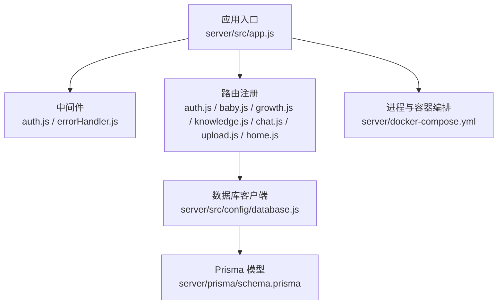
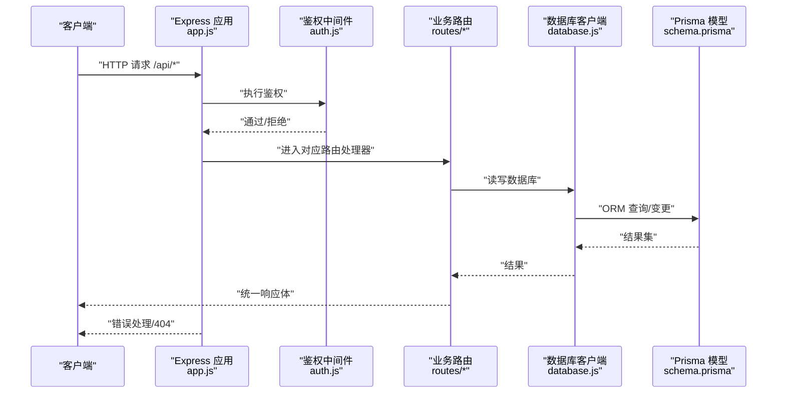
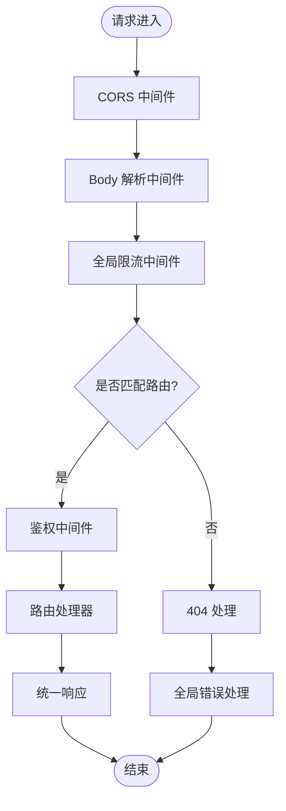
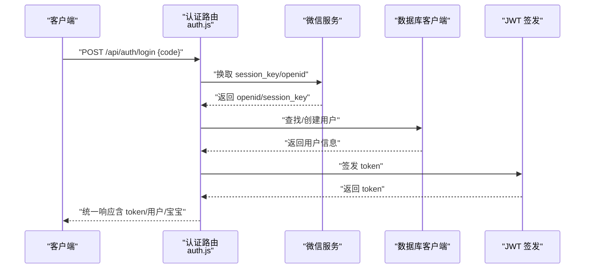
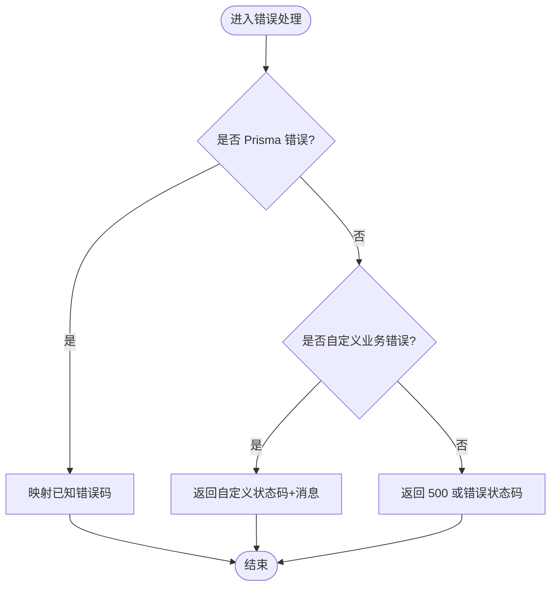
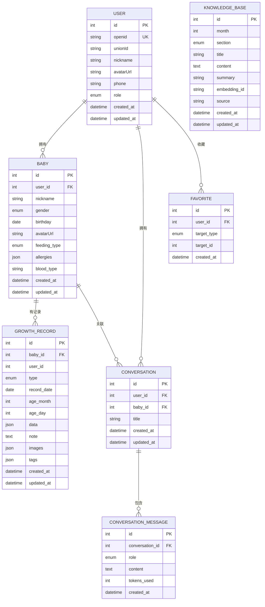
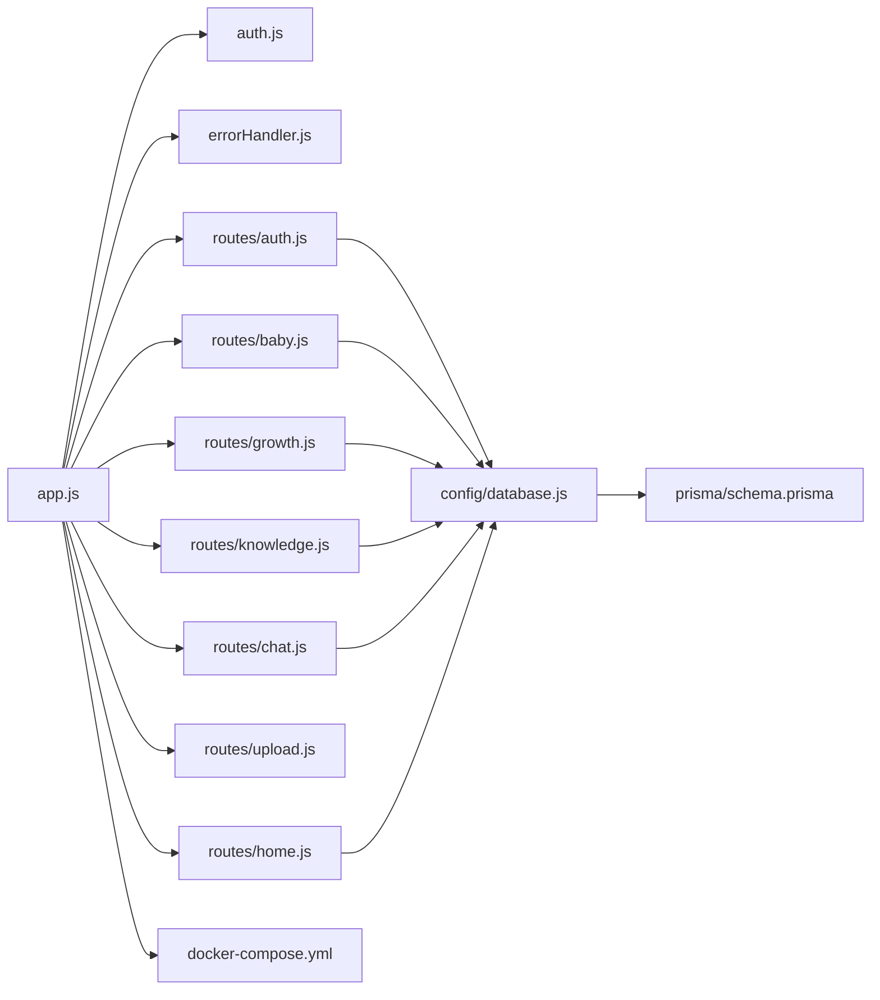

# 后端架构

<cite>
**本文引用的文件**
- [server/src/app.js](file://server/src/app.js)
- [server/package.json](file://server/package.json)
- [server/src/config/database.js](file://server/src/config/database.js)
- [server/src/middleware/auth.js](file://server/src/middleware/auth.js)
- [server/src/middleware/errorHandler.js](file://server/src/middleware/errorHandler.js)
- [server/src/routes/auth.js](file://server/src/routes/auth.js)
- [server/src/routes/baby.js](file://server/src/routes/baby.js)
- [server/src/routes/growth.js](file://server/src/routes/growth.js)
- [server/src/routes/knowledge.js](file://server/src/routes/knowledge.js)
- [server/src/routes/chat.js](file://server/src/routes/chat.js)
- [server/src/routes/upload.js](file://server/src/routes/upload.js)
- [server/src/routes/home.js](file://server/src/routes/home.js)
- [server/prisma/schema.prisma](file://server/prisma/schema.prisma)
- [server/docker-compose.yml](file://server/docker-compose.yml)
</cite>

## 目录
1. [简介](#简介)
2. [项目结构](#项目结构)
3. [核心组件](#核心组件)
4. [架构总览](#架构总览)
5. [详细组件分析](#详细组件分析)
6. [依赖关系分析](#依赖关系分析)
7. [性能考虑](#性能考虑)
8. [故障排查指南](#故障排查指南)
9. [结论](#结论)
10. [附录](#附录)

## 简介
本文件面向“AI育儿助手”后端，围绕基于 Express.js 的服务架构进行系统化技术文档梳理，重点覆盖以下方面：
- 服务器架构与中间件体系
- 路由组织与控制器模式
- JWT 认证机制与鉴权流程
- 错误处理策略与统一响应格式
- 数据库连接管理与 Prisma 使用
- RESTful API 设计原则与请求/响应规范
- 安全防护与限流策略
- 架构决策的技术考量与最佳实践

## 项目结构
后端采用模块化分层组织：
- 应用入口：Express 应用在入口文件中初始化中间件、注册路由、设置健康检查与全局错误处理
- 配置层：数据库客户端（Prisma）单例与优雅退出
- 中间件层：鉴权中间件与全局错误处理中间件
- 路由层：按功能域划分的子路由（认证、宝宝档案、成长记录、知识库、聊天、上传、首页）
- 数据模型：Prisma Schema 定义用户、宝宝、成长记录、对话、知识库等实体及索引/约束

图表来源
- [server/src/app.js:1-65](file://server/src/app.js#L1-L65)
- [server/src/middleware/auth.js:1-29](file://server/src/middleware/auth.js#L1-L29)
- [server/src/middleware/errorHandler.js:1-52](file://server/src/middleware/errorHandler.js#L1-L52)
- [server/src/config/database.js:1-17](file://server/src/config/database.js#L1-L17)
- [server/prisma/schema.prisma:1-189](file://server/prisma/schema.prisma#L1-L189)
- [server/docker-compose.yml:1-32](file://server/docker-compose.yml#L1-L32)

章节来源
- [server/src/app.js:1-65](file://server/src/app.js#L1-L65)
- [server/package.json:1-31](file://server/package.json#L1-L31)

## 核心组件
- 应用入口与中间件
  - 初始化 CORS、JSON 解析、URL 编码解析
  - 全局限流中间件对 /api/ 路径生效
  - 健康检查接口 /api/health
  - 路由注册与 404 处理
  - 全局错误处理中间件
- 数据库客户端
  - PrismaClient 单例，开发环境下开启查询日志
  - 进程退出前优雅断开连接
- 鉴权中间件
  - 从 Authorization 头部提取 Bearer Token 并校验
  - 将解码后的用户信息注入请求对象
- 错误处理中间件
  - 统一捕获 Prisma 已知错误与自定义业务错误
  - 未知错误返回标准化响应

章节来源
- [server/src/app.js:14-55](file://server/src/app.js#L14-L55)
- [server/src/config/database.js:1-17](file://server/src/config/database.js#L1-L17)
- [server/src/middleware/auth.js:1-29](file://server/src/middleware/auth.js#L1-L29)
- [server/src/middleware/errorHandler.js:1-52](file://server/src/middleware/errorHandler.js#L1-L52)

## 架构总览
下图展示从客户端到数据库的典型调用链路与组件交互。

图表来源
- [server/src/app.js:32-55](file://server/src/app.js#L32-L55)
- [server/src/middleware/auth.js:7-26](file://server/src/middleware/auth.js#L7-L26)
- [server/src/routes/auth.js:10-81](file://server/src/routes/auth.js#L10-L81)
- [server/src/config/database.js:5-14](file://server/src/config/database.js#L5-L14)
- [server/prisma/schema.prisma:14-189](file://server/prisma/schema.prisma#L14-L189)

## 详细组件分析

### 应用入口与中间件体系
- 全局中间件
  - CORS、JSON/URL 编码解析
  - 全局限流：每分钟最多 60 次请求，针对 /api/ 路由
- 健康检查：GET /api/health 返回时间戳
- 路由注册：按功能域挂载子路由，并在需要鉴权的路由上串联鉴权中间件
- 404 与全局错误处理：未匹配路由返回 404；统一错误格式化输出

图表来源
- [server/src/app.js:14-55](file://server/src/app.js#L14-L55)

章节来源
- [server/src/app.js:14-65](file://server/src/app.js#L14-L65)

### JWT 鉴权机制
- 鉴权流程
  - 客户端在 Authorization 头部携带 Bearer Token
  - 中间件校验 Token 有效性与过期时间
  - 成功则将用户信息注入 req.user，失败返回 401
- 登录流程（认证路由）
  - 使用微信 code2session 获取 openid
  - 在用户表中查找或创建用户
  - 生成 JWT 并返回用户与当前宝宝信息

图表来源
- [server/src/middleware/auth.js:7-26](file://server/src/middleware/auth.js#L7-L26)
- [server/src/routes/auth.js:10-81](file://server/src/routes/auth.js#L10-L81)

章节来源
- [server/src/middleware/auth.js:1-29](file://server/src/middleware/auth.js#L1-L29)
- [server/src/routes/auth.js:1-84](file://server/src/routes/auth.js#L1-L84)

### 错误处理策略
- Prisma 已知错误映射：如唯一约束冲突、记录不存在
- 自定义业务错误：通过 AppError 抛出，携带状态码与消息
- 未知错误：根据错误对象状态返回 500 或指定状态码
- 开发环境输出详细错误，生产环境输出通用错误提示

图表来源
- [server/src/middleware/errorHandler.js:6-39](file://server/src/middleware/errorHandler.js#L6-L39)

章节来源
- [server/src/middleware/errorHandler.js:1-52](file://server/src/middleware/errorHandler.js#L1-L52)

### 数据库连接管理与 Prisma 使用
- PrismaClient 单例：避免重复连接，集中管理日志级别
- 优雅退出：进程退出前断开数据库连接
- 模型设计：用户、宝宝、成长记录、对话、知识库、收藏等，包含索引与唯一约束
- 关系映射：外键、级联删除、枚举字段（性别、喂养方式、记录类型、消息角色、知识板块等）

图表来源
- [server/prisma/schema.prisma:14-189](file://server/prisma/schema.prisma#L14-L189)

章节来源
- [server/src/config/database.js:1-17](file://server/src/config/database.js#L1-L17)
- [server/prisma/schema.prisma:1-189](file://server/prisma/schema.prisma#L1-L189)

### RESTful API 设计与请求/响应规范
- 统一响应体字段
  - code：业务状态码（0 表示成功，非 0 表示失败）
  - message：描述信息
  - data：实际数据（可为对象、数组或空）
- 认证相关
  - 登录：POST /api/auth/login，返回 token、过期时间、用户与当前宝宝信息
- 宝宝档案
  - 创建：POST /api/babies
  - 查询：GET /api/babies/:id（含月龄与总天数计算）
  - 更新：PUT /api/babies/:id
- 成长记录
  - 新增：POST /api/babies/:babyId/records（自动计算月龄与日龄）
  - 列表：GET /api/babies/:babyId/records（支持按类型筛选与分页）
  - 详情：GET /api/babies/:babyId/records/:id
  - 更新：PUT /api/babies/:babyId/records/:id
  - 删除：DELETE /api/babies/:babyId/records/:id
- 知识库
  - 时间线：GET /api/knowledge/timeline（按月分组）
  - 某月全部：GET /api/knowledge/:month
  - 某月某板块：GET /api/knowledge/:month/:section
- 聊天
  - 发送：POST /api/chat/send（Sprint 4 实现中）
  - 列表：GET /api/chat/conversations
  - 详情：GET /api/chat/conversations/:id
  - 删除：DELETE /api/chat/conversations/:id
- 上传
  - 图片上传：POST /api/upload/image（Sprint 3 实现中）
- 首页
  - 仪表盘：GET /api/home/dashboard（聚合宝宝、最新成长记录、当月提醒等）

章节来源
- [server/src/routes/auth.js:1-84](file://server/src/routes/auth.js#L1-L84)
- [server/src/routes/baby.js:1-100](file://server/src/routes/baby.js#L1-L100)
- [server/src/routes/growth.js:1-118](file://server/src/routes/growth.js#L1-L118)
- [server/src/routes/knowledge.js:1-59](file://server/src/routes/knowledge.js#L1-L59)
- [server/src/routes/chat.js:1-57](file://server/src/routes/chat.js#L1-L57)
- [server/src/routes/upload.js:1-10](file://server/src/routes/upload.js#L1-L10)
- [server/src/routes/home.js:1-62](file://server/src/routes/home.js#L1-L62)

### 安全防护与限流策略
- CORS：允许跨域访问
- 全局限流：针对 /api/ 路由，每分钟最多 60 次请求，防止暴力请求
- 鉴权中间件：强制要求 Bearer Token，避免未授权访问
- 404 处理：未匹配路由统一返回 404，不暴露内部路径细节
- 错误处理：隐藏敏感错误细节（生产环境），仅返回通用错误信息

章节来源
- [server/src/app.js:14-55](file://server/src/app.js#L14-L55)
- [server/src/middleware/auth.js:1-29](file://server/src/middleware/auth.js#L1-L29)
- [server/src/middleware/errorHandler.js:1-52](file://server/src/middleware/errorHandler.js#L1-L52)

## 依赖关系分析
- 应用入口依赖中间件与各路由模块
- 路由模块依赖数据库客户端与错误处理工具
- 数据库客户端依赖 Prisma 模型定义
- Docker Compose 提供 MySQL 与 Redis 服务支撑

图表来源
- [server/src/app.js:32-47](file://server/src/app.js#L32-L47)
- [server/src/middleware/auth.js:1-29](file://server/src/middleware/auth.js#L1-L29)
- [server/src/middleware/errorHandler.js:1-52](file://server/src/middleware/errorHandler.js#L1-L52)
- [server/src/config/database.js:1-17](file://server/src/config/database.js#L1-L17)
- [server/prisma/schema.prisma:1-189](file://server/prisma/schema.prisma#L1-L189)
- [server/docker-compose.yml:1-32](file://server/docker-compose.yml#L1-L32)

章节来源
- [server/src/app.js:32-47](file://server/src/app.js#L32-L47)
- [server/package.json:14-29](file://server/package.json#L14-L29)

## 性能考虑
- 全局限流：降低突发流量对数据库与下游服务的压力
- 分页查询：成长记录列表使用分页参数，避免一次性加载大量数据
- 并发查询：使用 Promise.all 同步获取列表与总数，减少往返次数
- 日志级别：开发环境开启查询日志，便于定位慢查询；生产环境关闭以降低开销
- 容器资源：Redis 设置内存上限与淘汰策略，MySQL 字符集与排序规则优化

章节来源
- [server/src/app.js:19-25](file://server/src/app.js#L19-L25)
- [server/src/routes/growth.js:55-63](file://server/src/routes/growth.js#L55-L63)
- [server/src/config/database.js:7-9](file://server/src/config/database.js#L7-L9)
- [server/docker-compose.yml:19-27](file://server/docker-compose.yml#L19-L27)

## 故障排查指南
- 401 未认证
  - 检查请求头 Authorization 是否为 Bearer Token
  - 校验 JWT_SECRET 是否正确配置
- 404 接口不存在
  - 确认请求路径是否符合路由定义
  - 检查路由是否正确挂载到 /api/*
- Prisma 错误
  - P2002：唯一约束冲突，检查重复字段
  - P2025：记录不存在，确认主键或条件是否正确
- 500 服务器内部错误
  - 查看服务端日志中的错误堆栈
  - 开发环境可查看详细错误信息，生产环境返回通用提示
- 数据库连接问题
  - 确认 MySQL 服务运行正常
  - 检查 DATABASE_URL 配置与网络连通性
- 缓存问题
  - Redis 内存不足或策略不当导致缓存失效，调整 maxmemory 与策略

章节来源
- [server/src/middleware/auth.js:10-25](file://server/src/middleware/auth.js#L10-L25)
- [server/src/middleware/errorHandler.js:9-23](file://server/src/middleware/errorHandler.js#L9-L23)
- [server/src/app.js:49-52](file://server/src/app.js#L49-L52)
- [server/docker-compose.yml:4-17](file://server/docker-compose.yml#L4-L17)

## 结论
本后端架构以 Express 为核心，结合中间件体系、模块化路由与 Prisma ORM，实现了清晰的职责分离与可维护性。通过 JWT 鉴权、全局限流与统一错误处理，提升了安全性与稳定性。RESTful API 设计遵循统一响应体与明确的资源命名，便于前端对接与扩展。建议后续完善聊天与上传接口的实现，并持续优化数据库索引与查询性能。

## 附录
- 环境变量与脚本
  - 环境变量：NODE_ENV、PORT、DATABASE_URL、JWT_SECRET、WX_APPID、WX_SECRET
  - 脚本命令：开发启动、生产启动、数据库迁移、种子数据、Prisma 客户端生成、Studio 启动
- 容器编排
  - MySQL 8.0：默认字符集与排序规则配置
  - Redis 7：内存限制与 LRU 淘汰策略

章节来源
- [server/package.json:6-12](file://server/package.json#L6-L12)
- [server/docker-compose.yml:10-27](file://server/docker-compose.yml#L10-L27)