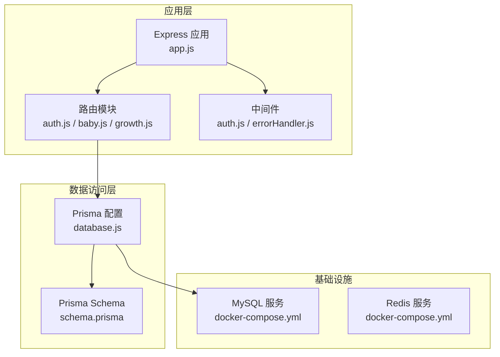
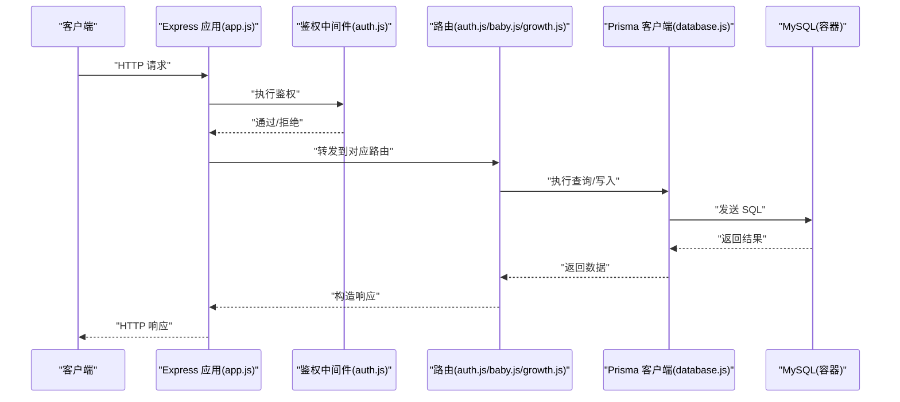
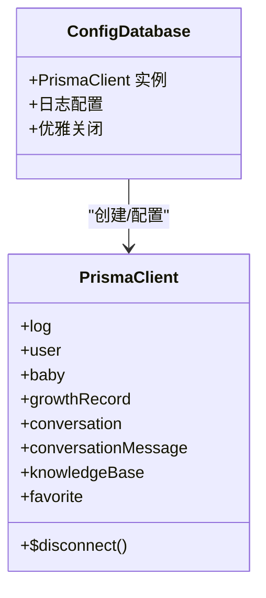
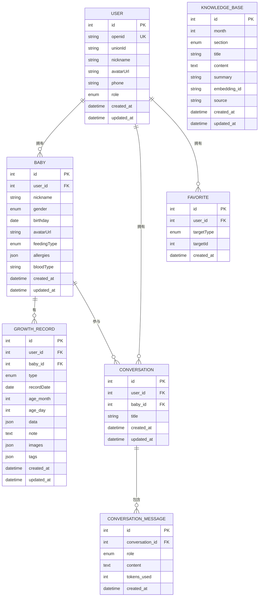
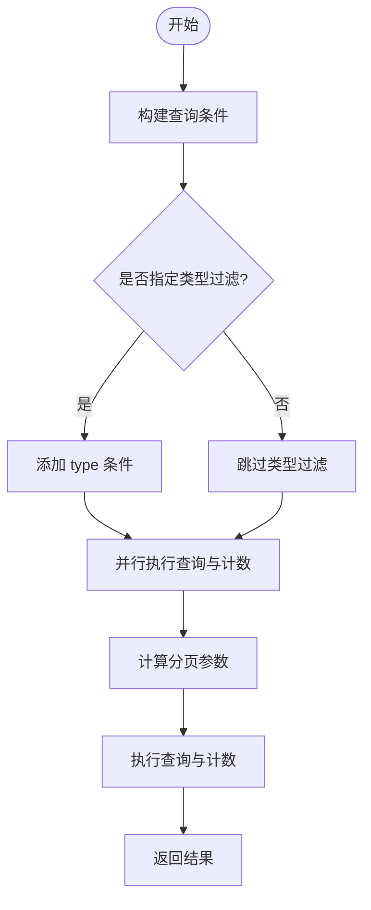
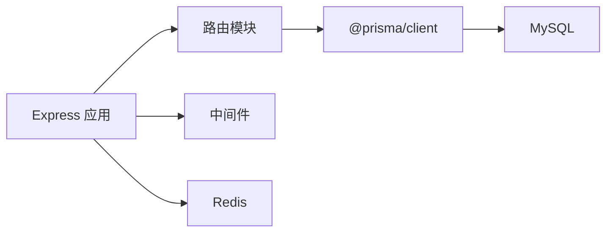

# 数据库连接管理

<cite>
**本文档引用的文件**
- [schema.prisma](file://server/prisma/schema.prisma)
- [database.js](file://server/src/config/database.js)
- [package.json](file://server/package.json)
- [docker-compose.yml](file://server/docker-compose.yml)
- [app.js](file://server/src/app.js)
- [errorHandler.js](file://server/src/middleware/errorHandler.js)
- [auth.js](file://server/src/middleware/auth.js)
- [auth.js](file://server/src/routes/auth.js)
- [baby.js](file://server/src/routes/baby.js)
- [growth.js](file://server/src/routes/growth.js)
</cite>

## 目录
1. [简介](#简介)
2. [项目结构](#项目结构)
3. [核心组件](#核心组件)
4. [架构概览](#架构概览)
5. [详细组件分析](#详细组件分析)
6. [依赖分析](#依赖分析)
7. [性能考虑](#性能考虑)
8. [故障排查指南](#故障排查指南)
9. [结论](#结论)
10. [附录](#附录)

## 简介
本文件聚焦于数据库连接管理的技术细节，围绕 Prisma ORM 的配置与使用、数据库连接池管理、事务处理机制、模型定义与关系映射、查询优化策略、连接重试与超时处理、连接泄漏防护、数据库迁移与种子数据加载、性能监控以及运维最佳实践进行系统性梳理。通过对现有代码库的深入分析，总结出当前实现中的优势与潜在改进点，并提供可操作的优化建议与故障排查方法。

## 项目结构
后端采用 Express 应用，通过 Prisma Client 进行数据库访问；数据库与缓存服务通过 Docker Compose 编排；开发脚本通过 npm scripts 提供迁移、生成客户端、启动服务等能力。

**图表来源**
- [app.js:1-65](file://server/src/app.js#L1-L65)
- [database.js:1-17](file://server/src/config/database.js#L1-L17)
- [schema.prisma:1-189](file://server/prisma/schema.prisma#L1-L189)
- [docker-compose.yml:1-32](file://server/docker-compose.yml#L1-L32)

**章节来源**
- [app.js:1-65](file://server/src/app.js#L1-L65)
- [package.json:1-31](file://server/package.json#L1-L31)
- [docker-compose.yml:1-32](file://server/docker-compose.yml#L1-L32)

## 核心组件
- Prisma Client 单例：在应用启动时初始化，开发环境开启查询日志，进程退出前主动断开连接，避免连接泄漏。
- 数据库模型与索引：基于 schema.prisma 定义的模型、枚举、索引与外键关系，支撑用户、宝宝、成长记录、对话、知识库、收藏等业务实体。
- 路由与服务交互：各路由模块通过 Prisma Client 执行 CRUD 操作，配合鉴权中间件与统一错误处理。
- 连接与环境：通过环境变量 DATABASE_URL 指定数据库连接字符串，Docker Compose 提供本地 MySQL 与 Redis 服务。

**章节来源**
- [database.js:1-17](file://server/src/config/database.js#L1-L17)
- [schema.prisma:1-189](file://server/prisma/schema.prisma#L1-L189)
- [auth.js:1-84](file://server/src/routes/auth.js#L1-L84)
- [baby.js:1-100](file://server/src/routes/baby.js#L1-L100)
- [growth.js:1-118](file://server/src/routes/growth.js#L1-L118)

## 架构概览
下图展示请求在系统中的流转路径，以及数据库访问的关键节点。

**图表来源**
- [app.js:1-65](file://server/src/app.js#L1-L65)
- [auth.js:1-29](file://server/src/middleware/auth.js#L1-L29)
- [auth.js:1-84](file://server/src/routes/auth.js#L1-L84)
- [baby.js:1-100](file://server/src/routes/baby.js#L1-L100)
- [growth.js:1-118](file://server/src/routes/growth.js#L1-L118)
- [database.js:1-17](file://server/src/config/database.js#L1-L17)

## 详细组件分析

### Prisma ORM 配置与连接池
- 初始化方式：通过 new PrismaClient 创建单例实例，确保全局共享，减少重复初始化成本。
- 日志级别：开发环境启用查询日志，便于调试；生产环境仅记录错误，降低日志噪声。
- 优雅关闭：监听 beforeExit 事件，在进程退出前调用 $disconnect 断开连接，防止连接泄漏。
- 连接字符串：通过环境变量 DATABASE_URL 注入，支持不同环境的连接配置。

**图表来源**
- [database.js:1-17](file://server/src/config/database.js#L1-L17)

**章节来源**
- [database.js:1-17](file://server/src/config/database.js#L1-L17)

### 数据库模型定义与关系映射
- 用户(User)：主键自增，openid 唯一，关联宝宝、对话、收藏。
- 宝宝(Baby)：多对一关联用户，一对多成长记录、对话。
- 成长记录(GrowthRecord)：多对一关联用户与宝宝，按宝宝与日期/类型建立复合索引。
- 对话(Conversation)：多对一关联用户与宝宝，一对多消息。
- 消息(ConversationMessage)：多对一关联对话。
- 知识库(KnowledgeBase)：按月龄与分区唯一。
- 收藏(Favorite)：多对一关联用户，联合唯一索引保证去重。

**图表来源**
- [schema.prisma:1-189](file://server/prisma/schema.prisma#L1-L189)

**章节来源**
- [schema.prisma:1-189](file://server/prisma/schema.prisma#L1-L189)

### 查询优化策略
- 索引设计：针对高频查询字段建立索引，如用户 openid、宝宝 user_id、成长记录的复合索引（babyId, recordDate）、（babyId, type），有助于加速筛选与排序。
- 分页查询：在成长记录列表查询中使用 take/skip 实现分页，结合 count 统计总数，避免一次性加载大量数据。
- 并发查询：使用 Promise.all 并行执行查询与计数，减少往返时间。
- 字段选择：在需要时限制返回字段，减少网络传输与序列化开销（当前路由已直接返回模型对象，可在需要时进一步细化）。

**图表来源**
- [growth.js:46-73](file://server/src/routes/growth.js#L46-L73)

**章节来源**
- [growth.js:46-73](file://server/src/routes/growth.js#L46-L73)
- [schema.prisma:91-93](file://server/prisma/schema.prisma#L91-L93)

### 事务处理机制
- 当前路由未显式使用 Prisma 事务 API；对于跨模型的原子性操作（如创建宝宝同时初始化默认数据），建议封装在单个事务中以保证一致性。
- 在批量写入或复杂更新场景，可通过 Prisma 的事务 API 将多个操作包裹在事务内，失败时回滚，成功时提交。

[本节为概念性说明，不直接分析具体文件，故无“章节来源”]

### 连接重试机制与超时处理
- 连接池：Prisma Client 默认使用连接池，但未在当前配置中显式设置池大小、空闲超时、连接超时等参数。
- 建议：在生产环境中显式配置连接池参数（如最大连接数、获取超时、空闲超时、生命周期等），并在应用层对数据库异常进行重试与降级处理（例如网络抖动导致的连接失败）。

[本节为概念性说明，不直接分析具体文件，故无“章节来源”]

### 连接泄漏防护
- 优雅关闭：在进程退出前调用 $disconnect，确保释放底层连接资源。
- 建议：在 SIGTERM/SIGINT 等信号处理中也触发断连，增强容器化部署下的稳定性。

**章节来源**
- [database.js:11-14](file://server/src/config/database.js#L11-L14)

### 数据库迁移管理与种子数据加载
- 迁移命令：通过 npm scripts 提供 db:migrate，使用 Prisma 的迁移工具生成与应用变更。
- 客户端生成：db:generate 用于生成 Prisma Client 类型与运行时代码。
- Studio：db:studio 可可视化浏览数据。
- 种子数据：db:seed 指向种子脚本，当前仓库未发现对应目录与文件，需补充种子脚本以初始化基础数据。

**章节来源**
- [package.json:9-12](file://server/package.json#L9-L12)

### 性能监控与运维
- 开发环境日志：开启查询日志便于定位慢查询与异常。
- 生产环境日志：仅记录错误，避免日志风暴。
- 健康检查：提供 /api/health 接口，便于容器编排与负载均衡探活。
- 缓存：Redis 作为缓存服务，可用于热点数据与会话存储，减轻数据库压力。

**章节来源**
- [database.js:8](file://server/src/config/database.js#L8)
- [app.js:27-30](file://server/src/app.js#L27-L30)
- [docker-compose.yml:19-27](file://server/docker-compose.yml#L19-L27)

## 依赖分析
- Express 应用：负责路由注册、中间件装配与服务启动。
- Prisma Client：提供类型安全的数据访问能力，依赖 MySQL 数据源。
- Docker Compose：提供 MySQL 与 Redis 的本地化运行环境。
- 错误处理：统一捕获 Prisma 已知错误码并转换为标准响应。

**图表来源**
- [app.js:1-65](file://server/src/app.js#L1-L65)
- [package.json:14-29](file://server/package.json#L14-L29)
- [docker-compose.yml:1-32](file://server/docker-compose.yml#L1-L32)

**章节来源**
- [app.js:1-65](file://server/src/app.js#L1-L65)
- [package.json:14-29](file://server/package.json#L14-L29)
- [docker-compose.yml:1-32](file://server/docker-compose.yml#L1-L32)

## 性能考虑
- 连接池参数：建议在生产环境显式配置连接池大小、获取超时、空闲超时与生命周期，避免高并发下的连接争用与资源耗尽。
- 查询优化：遵循现有索引策略，避免 N+1 查询；对复杂查询使用预取与投影。
- 缓存策略：对读多写少的数据引入 Redis 缓存，设置合理的过期策略与失效顺序。
- 监控指标：采集慢查询、连接池利用率、错误率与延迟，结合日志与 APM 工具进行分析。

[本节为通用性能指导，不直接分析具体文件，故无“章节来源”]

## 故障排查指南
- Prisma 错误码处理：统一拦截 P2002（唯一约束冲突）、P2025（记录不存在）等错误，返回标准化错误信息。
- 业务错误：通过 AppError 抛出自定义状态码与消息，便于前端处理。
- 通用错误：对未知错误进行兜底处理，开发环境下输出详细错误信息，生产环境返回通用提示。
- 数据库连接问题：检查 DATABASE_URL 是否正确、MySQL 服务是否可用、连接池参数是否合理；必要时增加重试与熔断逻辑。

**章节来源**
- [errorHandler.js:1-52](file://server/src/middleware/errorHandler.js#L1-L52)
- [auth.js:1-84](file://server/src/routes/auth.js#L1-L84)
- [baby.js:1-100](file://server/src/routes/baby.js#L1-L100)
- [growth.js:1-118](file://server/src/routes/growth.js#L1-L118)

## 结论
当前实现以 Prisma Client 为核心，提供了类型安全的数据访问与基本的连接管理（单例与优雅关闭）。模型设计覆盖主要业务域，索引策略满足常见查询需求。建议在生产环境中补充连接池参数配置、事务封装、种子数据脚本与更完善的监控告警体系，以提升稳定性与可维护性。

## 附录
- 配置要点清单
  - 显式设置连接池参数（最大连接数、获取超时、空闲超时、生命周期）
  - 在路由层对跨模型写入使用事务
  - 补充种子数据脚本与迁移流程
  - 引入 Redis 缓存热点数据
  - 增加健康检查与慢查询监控

[本节为通用附录内容，不直接分析具体文件，故无“章节来源”]