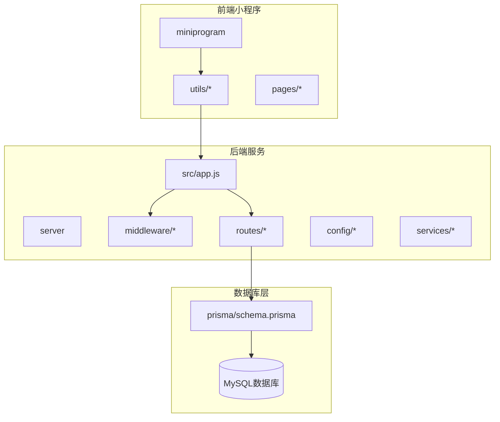
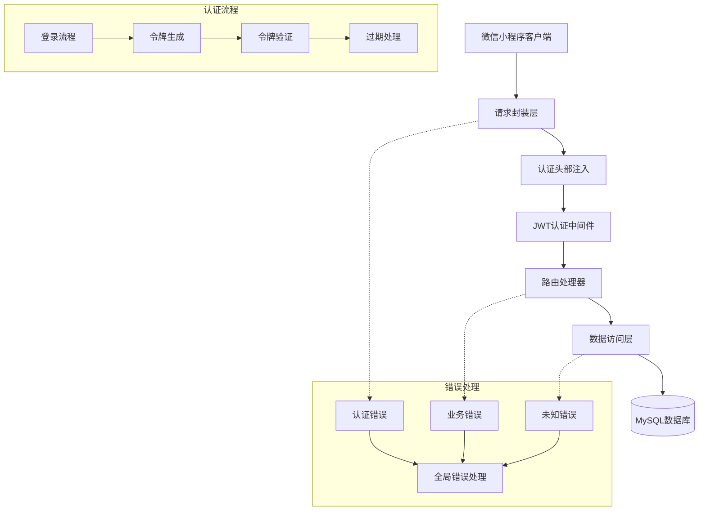
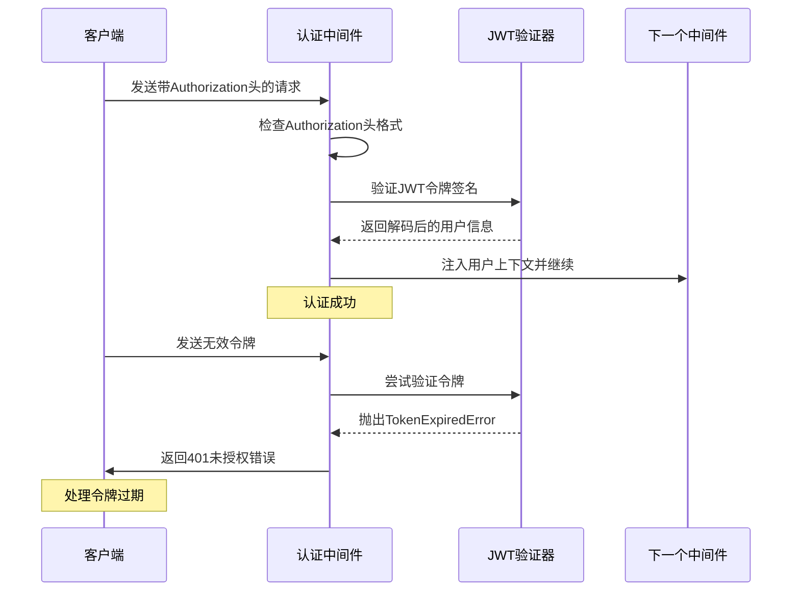
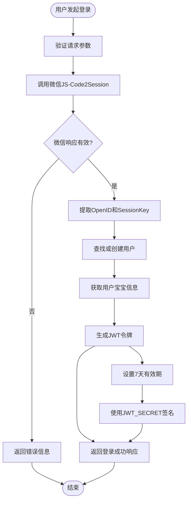
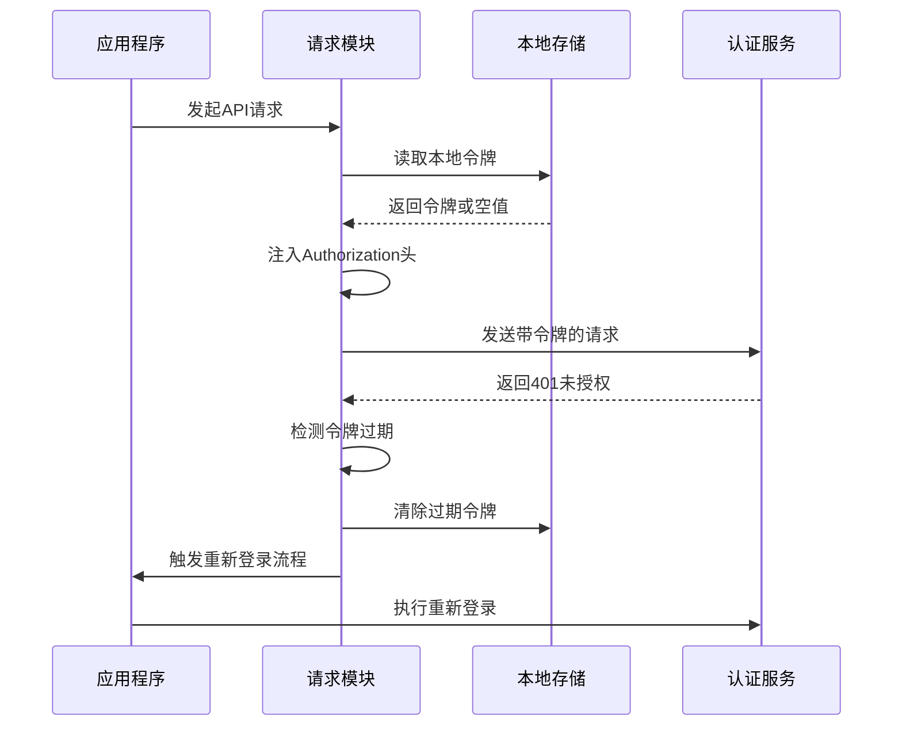
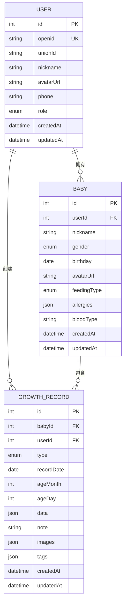

# JWT令牌管理

<cite>
**本文档引用的文件**
- [server/src/middleware/auth.js](file://server/src/middleware/auth.js)
- [server/src/routes/auth.js](file://server/src/routes/auth.js)
- [server/src/app.js](file://server/src/app.js)
- [miniprogram/utils/request.js](file://miniprogram/utils/request.js)
- [server/package.json](file://server/package.json)
- [server/prisma/schema.prisma](file://server/prisma/schema.prisma)
- [server/src/middleware/errorHandler.js](file://server/src/middleware/errorHandler.js)
</cite>

## 目录
1. [简介](#简介)
2. [项目结构](#项目结构)
3. [核心组件](#核心组件)
4. [架构概览](#架构概览)
5. [详细组件分析](#详细组件分析)
6. [依赖分析](#依赖分析)
7. [性能考虑](#性能考虑)
8. [故障排除指南](#故障排除指南)
9. [结论](#结论)

## 简介

本项目实现了基于JWT（JSON Web Token）的完整认证授权系统，专为微信小程序"安心育儿"应用设计。系统采用Bearer Token认证模式，通过Express.js构建RESTful API服务，结合Prisma ORM进行数据持久化。

JWT令牌管理是整个系统的核心安全基础设施，负责用户身份验证、权限控制和会话管理。系统支持令牌生成、验证、过期处理和错误捕获等完整功能。

## 项目结构

项目采用前后端分离架构，后端使用Node.js + Express.js，前端使用微信小程序框架：



**图表来源**
- [server/src/app.js:1-65](file://server/src/app.js#L1-L65)
- [server/prisma/schema.prisma:1-189](file://server/prisma/schema.prisma#L1-L189)

**章节来源**
- [server/src/app.js:1-65](file://server/src/app.js#L1-L65)
- [server/package.json:1-31](file://server/package.json#L1-L31)

## 核心组件

### JWT认证中间件

JWT认证中间件是系统安全控制的核心组件，负责从HTTP请求头中提取和验证JWT令牌。

主要功能特性：
- **令牌提取**：从Authorization头部解析Bearer令牌
- **令牌验证**：使用对称密钥算法验证令牌签名
- **用户上下文注入**：将解码后的用户信息注入到请求对象
- **错误处理**：统一处理各种认证失败场景

### 登录认证服务

登录认证服务处理微信小程序的用户登录流程，实现从微信code到JWT令牌的转换。

核心流程：
- **微信授权码验证**：调用微信JS-Code2Session接口
- **用户身份映射**：查找或创建本地用户记录
- **令牌签发**：生成JWT访问令牌
- **响应数据组装**：返回用户信息和令牌详情

### 前端令牌管理

小程序前端实现了完整的令牌生命周期管理，包括自动注入、过期处理和重定向逻辑。

**章节来源**
- [server/src/middleware/auth.js:1-29](file://server/src/middleware/auth.js#L1-L29)
- [server/src/routes/auth.js:1-84](file://server/src/routes/auth.js#L1-L84)
- [miniprogram/utils/request.js:1-97](file://miniprogram/utils/request.js#L1-L97)

## 架构概览

系统采用分层架构设计，确保关注点分离和代码可维护性：



**图表来源**
- [server/src/app.js:32-47](file://server/src/app.js#L32-L47)
- [server/src/middleware/auth.js:7-26](file://server/src/middleware/auth.js#L7-L26)
- [server/src/routes/auth.js:10-81](file://server/src/routes/auth.js#L10-L81)

## 详细组件分析

### JWT认证中间件实现

JWT认证中间件是系统安全控制的第一道防线，实现了严格的令牌验证逻辑：



**图表来源**
- [server/src/middleware/auth.js:7-26](file://server/src/middleware/auth.js#L7-L26)

认证流程的关键步骤：

1. **头部验证**：检查Authorization头是否存在且以"Bearer "开头
2. **令牌提取**：去除"Bearer "前缀获取原始JWT令牌
3. **签名验证**：使用对称密钥算法验证令牌完整性
4. **用户上下文**：将解码后的用户信息注入到请求对象
5. **错误分类**：区分令牌过期和其他验证失败情况

**章节来源**
- [server/src/middleware/auth.js:1-29](file://server/src/middleware/auth.js#L1-L29)

### 登录认证服务详解

登录认证服务实现了完整的用户身份验证流程，从微信授权码到JWT令牌的转换：



**图表来源**
- [server/src/routes/auth.js:10-81](file://server/src/routes/auth.js#L10-L81)

登录流程的详细实现：

1. **参数验证**：确保请求包含必需的微信授权码
2. **微信API调用**：通过HTTPS请求微信官方接口
3. **用户管理**：查找现有用户或创建新用户记录
4. **令牌配置**：设置7天有效期和对称密钥签名
5. **响应组装**：返回完整的用户信息和令牌数据

**章节来源**
- [server/src/routes/auth.js:1-84](file://server/src/routes/auth.js#L1-L84)

### 前端令牌管理实现

小程序前端实现了智能的令牌生命周期管理，确保用户体验和安全性：



**图表来源**
- [miniprogram/utils/request.js:21-86](file://miniprogram/utils/request.js#L21-L86)

前端令牌管理的关键特性：

1. **自动注入**：在每次请求时自动添加Authorization头
2. **过期检测**：识别401状态码作为令牌过期信号
3. **清理机制**：清除本地存储中的过期令牌和用户信息
4. **重定向逻辑**：触发应用程序的重新登录流程

**章节来源**
- [miniprogram/utils/request.js:1-97](file://miniprogram/utils/request.js#L1-L97)

### 数据模型与用户关系

系统使用Prisma ORM定义了完整的数据模型，支持用户、宝宝和成长记录的关联关系：



**图表来源**
- [server/prisma/schema.prisma:14-189](file://server/prisma/schema.prisma#L14-L189)

数据模型的设计考虑：

1. **用户标识**：使用微信OpenID作为用户唯一标识
2. **角色管理**：支持多种用户角色（母亲、父亲、祖父母等）
3. **宝宝档案**：支持多宝宝管理，每个宝宝关联其专属成长记录
4. **成长追踪**：详细的成长记录数据结构，支持多种记录类型

**章节来源**
- [server/prisma/schema.prisma:1-189](file://server/prisma/schema.prisma#L1-L189)

## 依赖分析

系统依赖关系清晰明确，遵循模块化设计原则：

```mermaid
graph TB
subgraph "核心依赖"
Express[express ^4.21.0]
JWT[jsonwebtoken ^9.0.2]
Prisma[@prisma/client ^5.22.0]
Dotenv[dotenv ^16.4.7]
end
subgraph "开发依赖"
Nodemon[nodemon ^3.1.7]
PrismaDev[prisma ^5.22.0]
end
subgraph "运行时依赖"
CORS[cors ^2.8.5]
RateLimit[express-rate-limit ^7.4.0]
Multer[multer ^1.4.5-lts.1]
Redis[redis ^4.7.0]
COS[cos-nodejs-sdk-v5 ^2.14.0]
OpenAI[openai ^4.73.0]
end
Express --> JWT
Express --> Prisma
Express --> Dotenv
Express --> CORS
Express --> RateLimit
```

**图表来源**
- [server/package.json:14-25](file://server/package.json#L14-L25)

依赖管理策略：

1. **核心功能**：Express提供Web框架基础，JWT实现认证功能
2. **数据持久化**：Prisma提供类型安全的数据库访问
3. **开发体验**：Nodemon提供热重载，Prisma Dev支持数据库建模
4. **生产优化**：CORS支持跨域请求，限流保护API安全

**章节来源**
- [server/package.json:1-31](file://server/package.json#L1-L31)

## 性能考虑

JWT令牌管理系统的性能优化策略：

### 令牌大小优化
- **载荷精简**：仅包含必要的用户标识信息（userId, openid）
- **避免敏感数据**：不在JWT中存储密码或其他敏感信息
- **标准化字段**：使用标准JWT声明减少额外开销

### 缓存策略
- **本地存储**：小程序端使用本地存储减少网络请求
- **会话复用**：同一会话内重复使用相同令牌
- **批量操作**：合理设计API接口，减少不必要的请求次数

### 错误处理优化
- **快速失败**：无效令牌立即拒绝，避免后续处理开销
- **资源清理**：及时清理过期令牌和相关资源
- **降级策略**：在网络异常时提供合理的降级行为

## 故障排除指南

### 常见问题诊断

**令牌验证失败**
- 检查JWT_SECRET环境变量配置
- 验证令牌是否被正确编码和传输
- 确认时间同步，避免时钟偏差导致验证失败

**登录接口错误**
- 验证微信AppID和Secret配置
- 检查网络连接和HTTPS证书
- 确认用户数据库表结构正确

**前端令牌过期**
- 检查handleTokenExpired函数执行流程
- 验证本地存储清理逻辑
- 确认重新登录流程触发条件

### 调试建议

1. **启用详细日志**：在开发环境中输出JWT验证过程
2. **监控API响应**：使用浏览器开发者工具检查请求头和响应
3. **测试边界条件**：验证令牌过期、篡改和格式错误等各种场景
4. **性能基准测试**：评估JWT验证对系统性能的影响

**章节来源**
- [server/src/middleware/errorHandler.js:1-52](file://server/src/middleware/errorHandler.js#L1-L52)
- [server/src/middleware/auth.js:20-25](file://server/src/middleware/auth.js#L20-L25)

## 结论

本JWT令牌管理系统实现了完整的认证授权解决方案，具有以下特点：

**安全性方面**：
- 使用对称密钥算法确保令牌完整性
- 实现严格的令牌验证和错误处理
- 支持令牌过期自动清理机制

**可用性方面**：
- 前后端协同实现无缝的认证体验
- 提供完善的错误处理和用户反馈
- 支持多角色用户管理和多宝宝档案

**扩展性方面**：
- 模块化设计便于功能扩展
- 清晰的依赖关系支持技术栈升级
- 标准化的API接口便于集成第三方服务

系统通过合理的架构设计和最佳实践，为"安心育儿"小程序提供了可靠的安全基础设施，能够满足实际业务需求并具备良好的可维护性和扩展性。