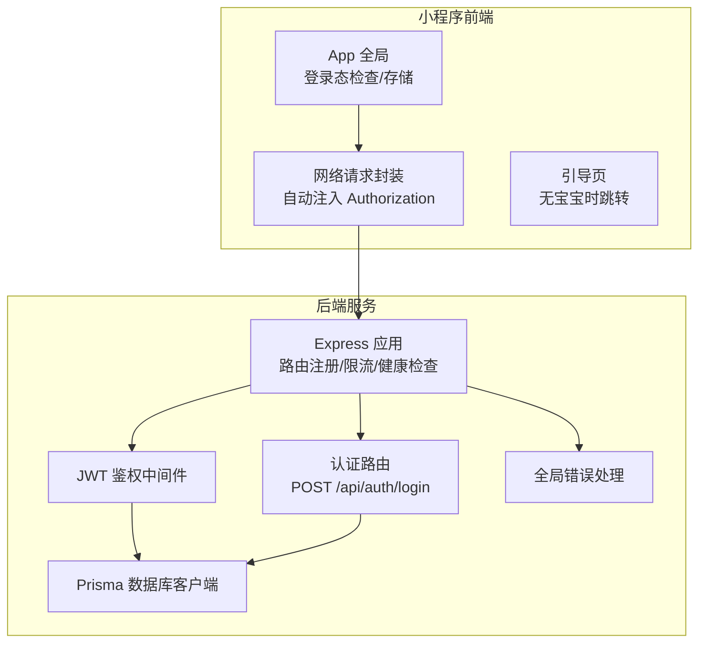
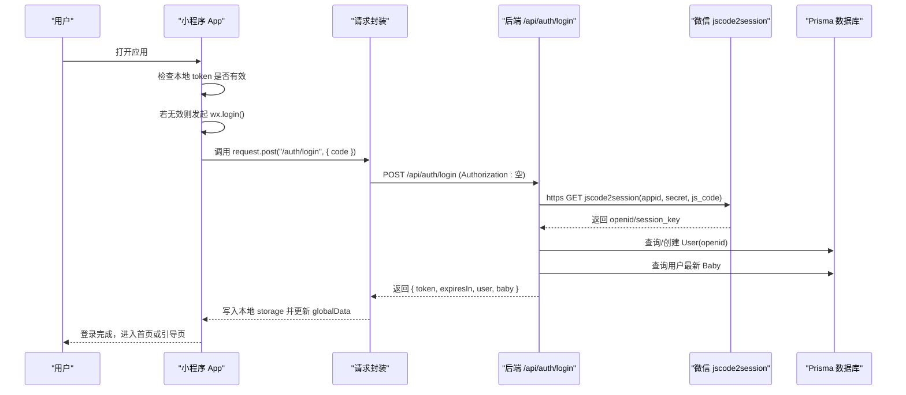
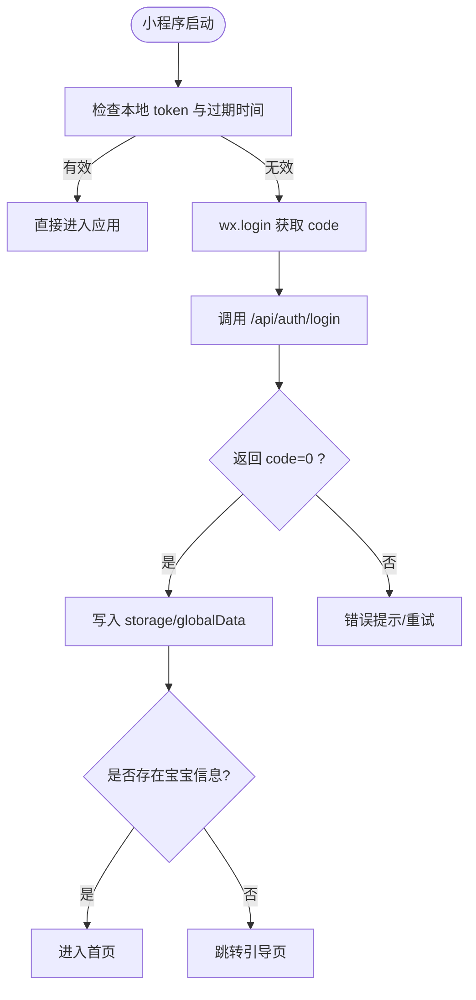
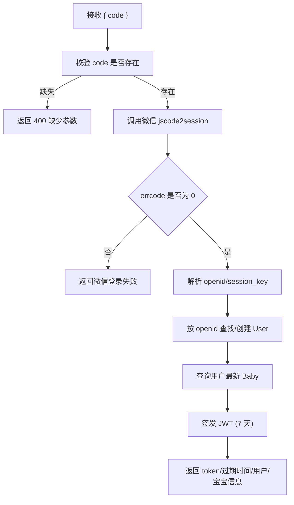
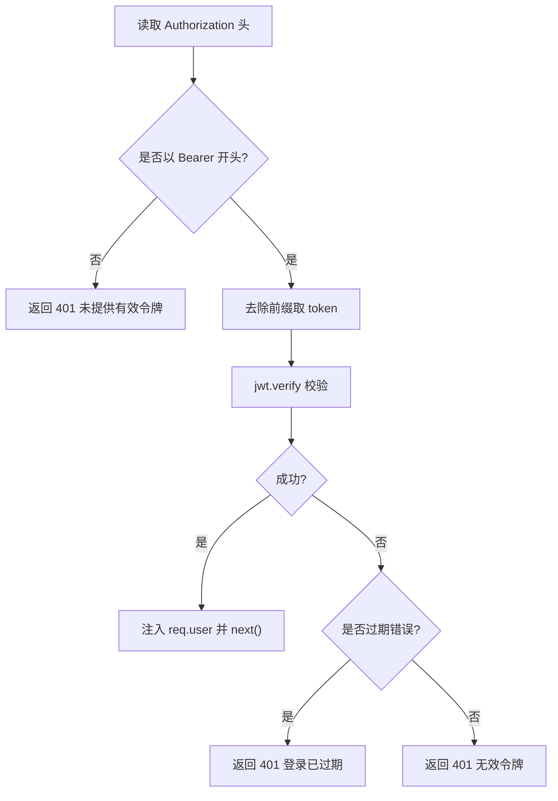
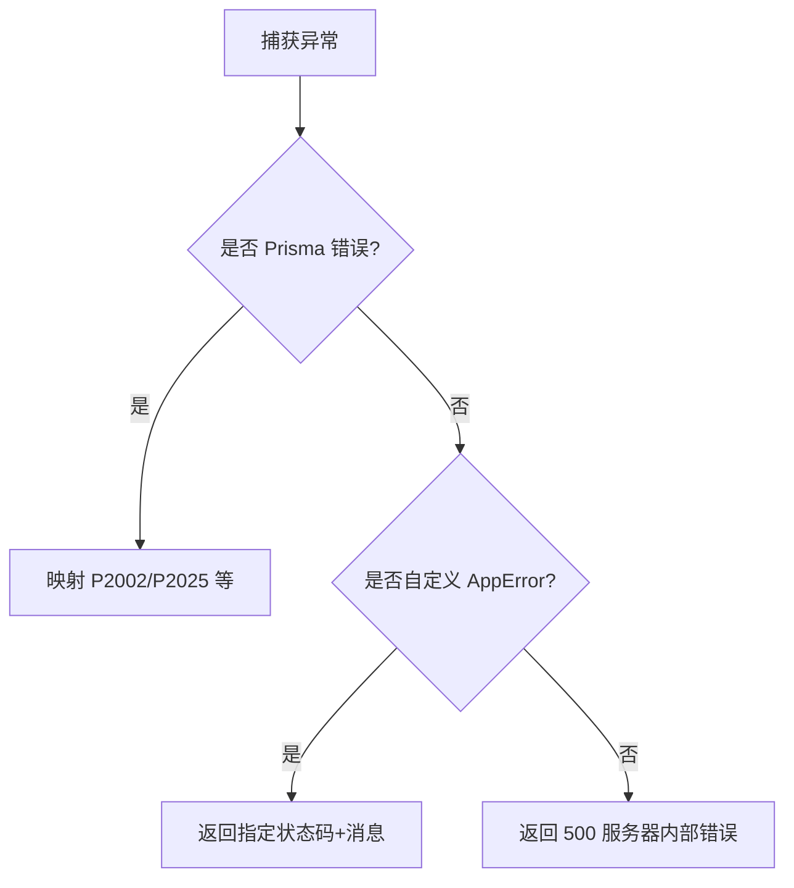
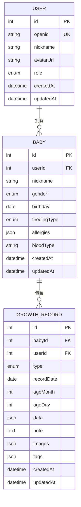
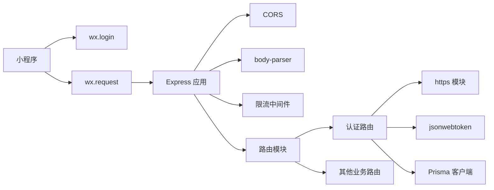

# 微信登录集成

<cite>
**本文引用的文件**
- [server/src/app.js](file://server/src/app.js)
- [server/src/routes/auth.js](file://server/src/routes/auth.js)
- [server/src/middleware/auth.js](file://server/src/middleware/auth.js)
- [server/src/middleware/errorHandler.js](file://server/src/middleware/errorHandler.js)
- [server/prisma/schema.prisma](file://server/prisma/schema.prisma)
- [server/package.json](file://server/package.json)
- [miniprogram/app.js](file://miniprogram/app.js)
- [miniprogram/utils/request.js](file://miniprogram/utils/request.js)
- [miniprogram/pages/onboarding/index.js](file://miniprogram/pages/onboarding/index.js)
- [project.config.json](file://project.config.json)
</cite>

## 目录
1. [简介](#简介)
2. [项目结构](#项目结构)
3. [核心组件](#核心组件)
4. [架构总览](#架构总览)
5. [详细组件分析](#详细组件分析)
6. [依赖关系分析](#依赖关系分析)
7. [性能考虑](#性能考虑)
8. [故障排查指南](#故障排查指南)
9. [结论](#结论)
10. [附录](#附录)

## 简介
本文件面向“微信登录集成”场景，基于现有代码库构建一套完整的技术文档。重点覆盖以下方面：
- 微信 OAuth2.0 授权流程在小程序端与服务端的实现细节
- code 换取 session_key 的关键步骤与 openid 解析
- 用户注册/登录逻辑、数据库用户信息维护、JWT 令牌发放机制
- 微信开放平台配置要点（appid、secret、域名白名单等）
- 回调地址与安全验证要求
- API 调用示例、错误处理策略、用户数据安全保护措施

## 项目结构
整体采用前后端分离架构：
- 小程序前端负责登录态管理、网络请求封装与页面跳转
- 后端服务提供 REST API，包含鉴权中间件、统一错误处理、Prisma 数据访问层
- 数据库使用 MySQL，通过 Prisma 管理实体关系与迁移

图表来源
- [server/src/app.js:32-47](file://server/src/app.js#L32-L47)
- [server/src/routes/auth.js:10-81](file://server/src/routes/auth.js#L10-L81)
- [server/src/middleware/auth.js:7-26](file://server/src/middleware/auth.js#L7-L26)
- [miniprogram/app.js:18-67](file://miniprogram/app.js#L18-L67)
- [miniprogram/utils/request.js:21-73](file://miniprogram/utils/request.js#L21-L73)

章节来源
- [server/src/app.js:14-55](file://server/src/app.js#L14-L55)
- [miniprogram/app.js:18-67](file://miniprogram/app.js#L18-L67)

## 核心组件
- 小程序登录态管理与网络请求
  - 登录态检查与过期处理、本地存储 token/expiry/userInfo/babyInfo
  - 统一请求封装，自动注入 Authorization 头，处理 401 重登
- 后端认证路由
  - 接收小程序 code，调用微信 jscode2session 接口获取 openid/session_key
  - 用户查找/创建、JWT 签发、返回用户与宝宝信息
- JWT 鉴权中间件
  - 校验 Bearer Token，注入 req.user（包含 userId/openid）
- 全局错误处理
  - 统一格式化响应，区分 Prisma 错误与自定义业务错误
- 数据模型
  - User/Baby/GrowthRecord 等实体及索引、枚举字段

章节来源
- [miniprogram/app.js:18-67](file://miniprogram/app.js#L18-L67)
- [miniprogram/utils/request.js:21-86](file://miniprogram/utils/request.js#L21-L86)
- [server/src/routes/auth.js:10-81](file://server/src/routes/auth.js#L10-L81)
- [server/src/middleware/auth.js:7-26](file://server/src/middleware/auth.js#L7-L26)
- [server/src/middleware/errorHandler.js:6-39](file://server/src/middleware/errorHandler.js#L6-L39)
- [server/prisma/schema.prisma:14-60](file://server/prisma/schema.prisma#L14-L60)

## 架构总览
下图展示从用户触发登录到成功获取 JWT 并写入本地存储的完整流程。

图表来源
- [miniprogram/app.js:35-67](file://miniprogram/app.js#L35-L67)
- [miniprogram/utils/request.js:21-73](file://miniprogram/utils/request.js#L21-L73)
- [server/src/routes/auth.js:10-81](file://server/src/routes/auth.js#L10-L81)

## 详细组件分析

### 小程序登录态与请求封装
- 登录态检查
  - 读取本地 token 与过期时间，若未过期则直接复用；否则触发登录流程
- 登录流程
  - 调用 wx.login 获取临时登录凭证 code
  - 调用后端 /api/auth/login，携带 code
  - 成功后写入 token、过期时间、userInfo、babyInfo，并根据是否存在宝宝决定是否跳转引导页
- 请求封装
  - 统一注入 Authorization: Bearer token
  - 统一错误处理：业务错误提示、401 自动重登
  - 支持显示/隐藏 loading、自定义 header

图表来源
- [miniprogram/app.js:18-67](file://miniprogram/app.js#L18-L67)
- [miniprogram/utils/request.js:21-86](file://miniprogram/utils/request.js#L21-L86)

章节来源
- [miniprogram/app.js:18-67](file://miniprogram/app.js#L18-L67)
- [miniprogram/utils/request.js:21-86](file://miniprogram/utils/request.js#L21-L86)

### 后端认证路由：code 换取 session_key 与 openid
- 输入校验
  - 缺少 code 直接返回错误
- 调用微信接口
  - 使用 https.get 请求 jscode2session，拼接 appid、secret、js_code
  - 校验返回的 errcode，非零则返回微信侧错误信息
- 用户与宝宝信息
  - 以 openid 查找用户，不存在则创建默认用户
  - 查询用户最新宝宝用于返回
- JWT 签发
  - 使用 JWT_SECRET 签发 token，设置 7 天过期
  - 返回 token、过期时间、用户与宝宝信息

图表来源
- [server/src/routes/auth.js:10-81](file://server/src/routes/auth.js#L10-L81)

章节来源
- [server/src/routes/auth.js:10-81](file://server/src/routes/auth.js#L10-L81)

### JWT 鉴权中间件
- 提取 Authorization 头中的 Bearer token
- 校验签名与有效期，失败时区分过期与无效
- 成功则将解码后的用户信息注入 req.user（包含 userId/openid），供后续路由使用

图表来源
- [server/src/middleware/auth.js:7-26](file://server/src/middleware/auth.js#L7-L26)

章节来源
- [server/src/middleware/auth.js:7-26](file://server/src/middleware/auth.js#L7-L26)

### 全局错误处理与业务错误
- 统一捕获未处理异常，输出结构化响应
- 区分 Prisma 已知错误（如唯一约束冲突、记录不存在）
- 支持自定义业务错误类，设置状态码与消息
- 开发环境暴露详细错误，生产环境屏蔽敏感信息

图表来源
- [server/src/middleware/errorHandler.js:6-39](file://server/src/middleware/errorHandler.js#L6-L39)

章节来源
- [server/src/middleware/errorHandler.js:6-39](file://server/src/middleware/errorHandler.js#L6-L39)

### 数据模型与用户信息维护
- 用户表 User
  - 主键自增 id
  - 唯一索引 openid
  - 默认昵称、头像、角色等字段
- 宝宝表 Baby
  - 关联用户 userId
  - 性别、喂养方式、过敏史、血型等字段
- 成长记录表 GrowthRecord
  - 关联宝宝与用户
  - 记录类型、日期、年龄月/日、数据、图片、标签等

图表来源
- [server/prisma/schema.prisma:14-60](file://server/prisma/schema.prisma#L14-L60)
- [server/prisma/schema.prisma:74-94](file://server/prisma/schema.prisma#L74-L94)

章节来源
- [server/prisma/schema.prisma:14-60](file://server/prisma/schema.prisma#L14-L60)
- [server/prisma/schema.prisma:74-94](file://server/prisma/schema.prisma#L74-L94)

## 依赖关系分析
- Express 应用
  - 注册 CORS、JSON 解析、限流中间件
  - 注册健康检查与各业务路由
  - 注册全局错误处理中间件
- 认证路由依赖
  - 使用 https 模块调用微信 jscode2session
  - 使用 Prisma 访问数据库
  - 使用 jsonwebtoken 生成 JWT
- 小程序依赖
  - 使用 wx.login 获取 code
  - 使用 wx.request 发起 API 请求
  - 使用本地存储持久化 token 与用户信息

图表来源
- [server/src/app.js:14-55](file://server/src/app.js#L14-L55)
- [server/src/routes/auth.js:18-26](file://server/src/routes/auth.js#L18-L26)
- [server/package.json:14-29](file://server/package.json#L14-L29)
- [miniprogram/app.js:37-66](file://miniprogram/app.js#L37-L66)
- [miniprogram/utils/request.js:29-37](file://miniprogram/utils/request.js#L29-L37)

章节来源
- [server/src/app.js:14-55](file://server/src/app.js#L14-L55)
- [server/package.json:14-29](file://server/package.json#L14-L29)
- [miniprogram/app.js:37-66](file://miniprogram/app.js#L37-L66)
- [miniprogram/utils/request.js:29-37](file://miniprogram/utils/request.js#L29-L37)

## 性能考虑
- 全局限流
  - 每 IP 每分钟最多 60 次请求，避免暴力尝试
- 数据库访问
  - 认证路由仅进行 openid 唯一查询与必要字段读取，复杂度低
  - 建议在 openid 上保持索引，确保查询高效
- 网络请求
  - 小程序端统一注入 Authorization，减少重复头信息
  - 401 自动重登避免用户手动刷新
- JWT 过期
  - 7 天有效期适中，建议结合刷新策略优化用户体验

章节来源
- [server/src/app.js:19-25](file://server/src/app.js#L19-L25)
- [server/prisma/schema.prisma:29](file://server/prisma/schema.prisma#L29)
- [server/src/routes/auth.js:48-54](file://server/src/routes/auth.js#L48-L54)

## 故障排查指南
- 常见错误与定位
  - 缺少 code 参数：检查小程序端是否正确调用 wx.login 并传递 code
  - 微信登录失败：检查 appid/secret 是否正确，域名是否在白名单内
  - 401 未提供有效认证令牌：确认小程序端是否正确存储并注入 Bearer token
  - 401 登录已过期：小程序端会自动清理本地存储并重新登录
  - Prisma 唯一约束冲突：检查重复 openid 或其他唯一字段
- 日志与调试
  - 后端统一输出错误日志，便于定位问题
  - 生产环境屏蔽敏感错误信息，开发环境可查看详细堆栈

章节来源
- [server/src/routes/auth.js:13-15](file://server/src/routes/auth.js#L13-L15)
- [server/src/routes/auth.js:28-30](file://server/src/routes/auth.js#L28-L30)
- [server/src/middleware/auth.js:10-12](file://server/src/middleware/auth.js#L10-L12)
- [server/src/middleware/auth.js:21-25](file://server/src/middleware/auth.js#L21-L25)
- [server/src/middleware/errorHandler.js:10-23](file://server/src/middleware/errorHandler.js#L10-L23)
- [miniprogram/utils/request.js:48-51](file://miniprogram/utils/request.js#L48-L51)

## 结论
该微信登录集成方案以小程序 wx.login 为核心入口，后端通过 jscode2session 获取 openid，结合 JWT 实现无感登录与权限控制。整体流程清晰、错误处理统一、数据模型完备，满足日常业务需求。建议在生产环境中进一步完善安全与监控策略。

## 附录

### 微信开放平台配置要点
- 基本信息
  - appid/secret：在后端环境变量中配置
  - 服务器域名：确保 API 域名已在微信公众平台配置为合法域名
- 登录配置
  - 登录授权的业务域名需在小程序后台配置
  - 开发者工具与真机调试需注意域名一致性
- 回调地址
  - 本项目使用 code2session 接口，无需额外回调地址配置
- 安全验证
  - 严格校验 appid/secret，避免泄露
  - 前端仅传输 code，不暴露敏感信息

章节来源
- [server/src/routes/auth.js:20](file://server/src/routes/auth.js#L20)
- [project.config.json:38](file://project.config.json#L38)

### API 调用示例（路径与行为）
- 小程序端
  - 登录：调用 /api/auth/login，传入 code
  - 请求封装：自动注入 Authorization: Bearer token
- 后端路由
  - POST /api/auth/login：接收 code，返回 token、过期时间、用户与宝宝信息
  - 其他受保护路由：需携带有效 JWT 才能访问

章节来源
- [miniprogram/utils/request.js:33-36](file://miniprogram/utils/request.js#L33-L36)
- [server/src/routes/auth.js:10-81](file://server/src/routes/auth.js#L10-L81)
- [server/src/app.js:42-47](file://server/src/app.js#L42-L47)

### 用户数据安全保护措施
- 传输安全
  - 使用 HTTPS 与 Bearer Token，避免明文传输
- 存储安全
  - 本地仅保存 token、过期时间与用户信息，不保存 session_key
  - 过期自动清理并重新登录
- 访问控制
  - 所有敏感接口均需 JWT 验证
  - 严格区分用户数据边界（按 userId 过滤）

章节来源
- [miniprogram/utils/request.js:33-36](file://miniprogram/utils/request.js#L33-L36)
- [server/src/middleware/auth.js:16-18](file://server/src/middleware/auth.js#L16-L18)
- [miniprogram/app.js:48-54](file://miniprogram/app.js#L48-L54)