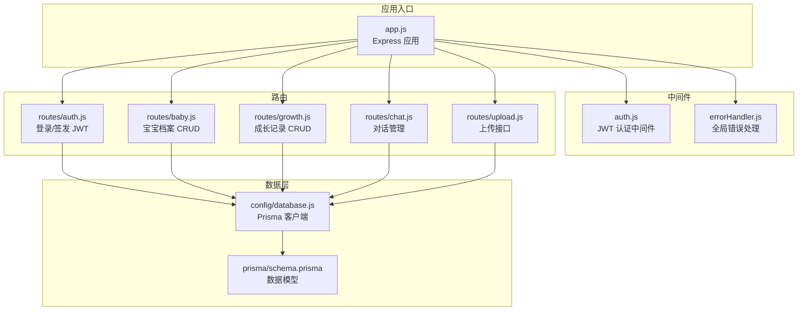
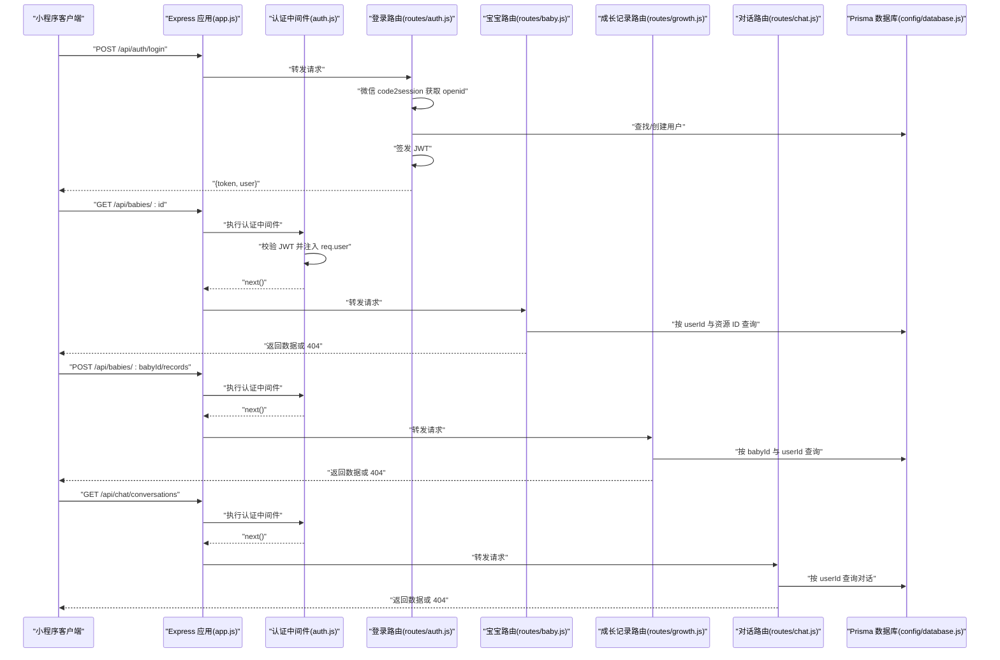
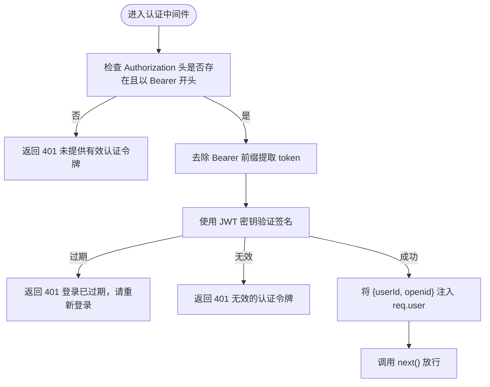
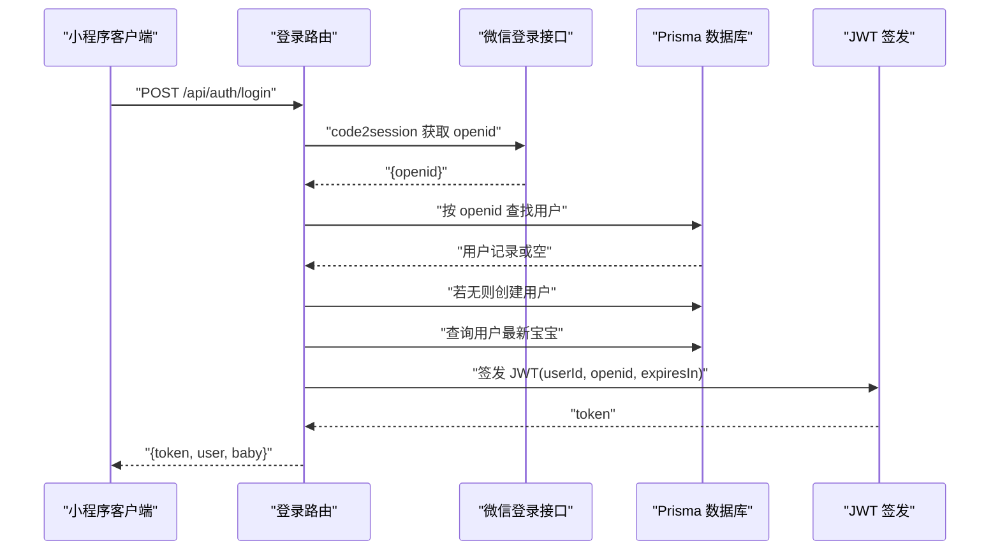
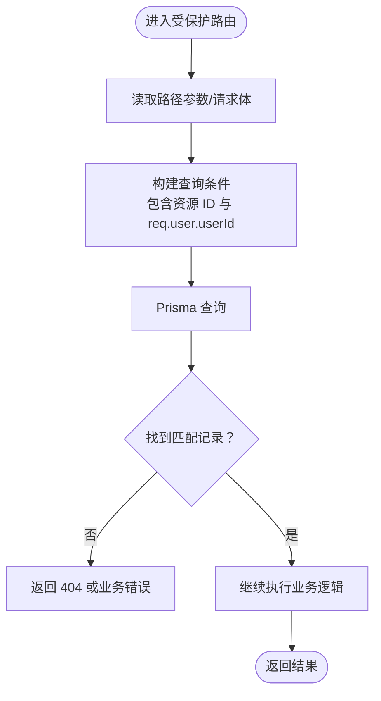
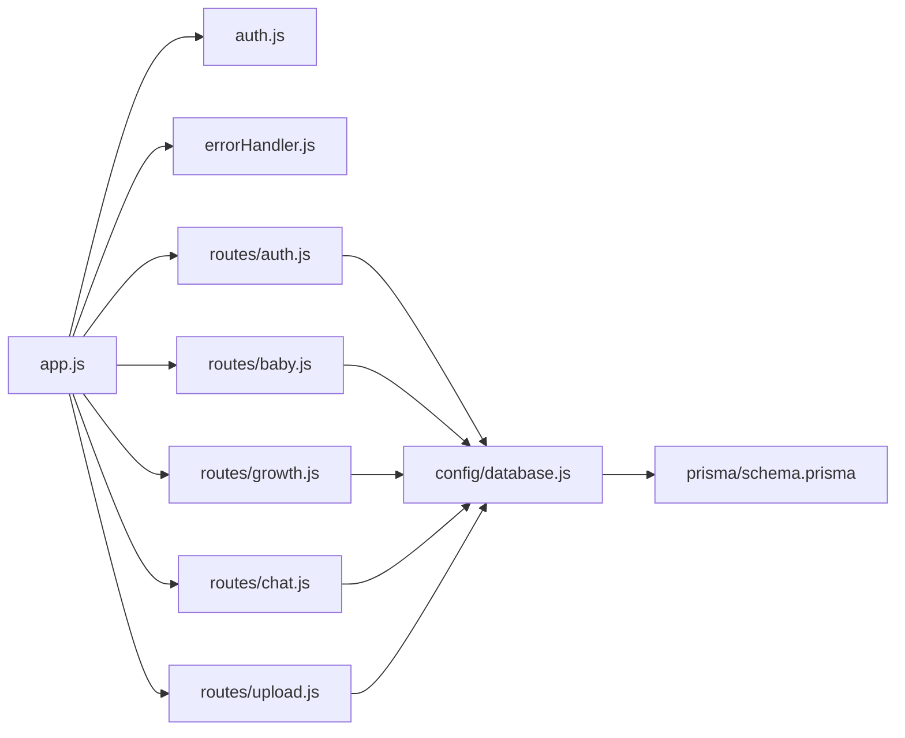

# 权限控制

<cite>
**本文引用的文件**
- [server/src/middleware/auth.js](file://server/src/middleware/auth.js)
- [server/src/middleware/errorHandler.js](file://server/src/middleware/errorHandler.js)
- [server/src/app.js](file://server/src/app.js)
- [server/src/routes/auth.js](file://server/src/routes/auth.js)
- [server/src/routes/baby.js](file://server/src/routes/baby.js)
- [server/src/routes/growth.js](file://server/src/routes/growth.js)
- [server/src/routes/chat.js](file://server/src/routes/chat.js)
- [server/src/routes/upload.js](file://server/src/routes/upload.js)
- [server/src/config/database.js](file://server/src/config/database.js)
- [server/prisma/schema.prisma](file://server/prisma/schema.prisma)
- [server/package.json](file://server/package.json)
</cite>

## 目录
1. [简介](#简介)
2. [项目结构](#项目结构)
3. [核心组件](#核心组件)
4. [架构总览](#架构总览)
5. [详细组件分析](#详细组件分析)
6. [依赖关系分析](#依赖关系分析)
7. [性能考量](#性能考量)
8. [故障排查指南](#故障排查指南)
9. [结论](#结论)
10. [附录](#附录)

## 简介
本技术文档聚焦于本项目的权限控制系统，系统采用基于 JWT 的认证与授权模式，通过统一的认证中间件在路由层进行身份注入与访问控制。文档将深入解析：
- 基于 JWT 的认证流程与中间件实现
- 认证中间件在路由中的应用方式与用户身份注入
- 不同用户角色的权限管理与资源级权限控制策略
- API 访问控制策略与最佳实践
- 常见权限问题的诊断与解决思路

## 项目结构
后端采用 Express 应用，权限控制主要集中在中间件与路由层：
- 中间件层：认证中间件负责校验 JWT 并注入用户上下文；错误处理中间件统一处理异常
- 路由层：按模块划分 API，部分路由挂载认证中间件以启用权限控制
- 数据层：Prisma 提供数据库访问与模型约束，配合路由层进行资源级权限校验

图表来源
- [server/src/app.js:1-65](file://server/src/app.js#L1-L65)
- [server/src/middleware/auth.js:1-29](file://server/src/middleware/auth.js#L1-L29)
- [server/src/middleware/errorHandler.js:1-52](file://server/src/middleware/errorHandler.js#L1-L52)
- [server/src/routes/auth.js:1-84](file://server/src/routes/auth.js#L1-L84)
- [server/src/routes/baby.js:1-100](file://server/src/routes/baby.js#L1-L100)
- [server/src/routes/growth.js:1-118](file://server/src/routes/growth.js#L1-L118)
- [server/src/routes/chat.js:1-57](file://server/src/routes/chat.js#L1-L57)
- [server/src/routes/upload.js:1-10](file://server/src/routes/upload.js#L1-L10)
- [server/src/config/database.js:1-17](file://server/src/config/database.js#L1-L17)
- [server/prisma/schema.prisma:1-189](file://server/prisma/schema.prisma#L1-L189)

章节来源
- [server/src/app.js:1-65](file://server/src/app.js#L1-L65)
- [server/src/middleware/auth.js:1-29](file://server/src/middleware/auth.js#L1-L29)
- [server/src/middleware/errorHandler.js:1-52](file://server/src/middleware/errorHandler.js#L1-L52)
- [server/src/config/database.js:1-17](file://server/src/config/database.js#L1-L17)
- [server/prisma/schema.prisma:1-189](file://server/prisma/schema.prisma#L1-L189)

## 核心组件
- 认证中间件：从请求头中提取并校验 JWT，成功后将用户标识注入到请求对象，失败则返回相应错误码
- 登录路由：接收小程序 code，调用微信登录接口换取 openid，并签发 JWT 返回给前端
- 资源路由：在需要权限保护的路由上挂载认证中间件，结合数据库查询进行资源归属校验
- 错误处理：统一捕获业务错误与未知错误，输出一致的响应结构

章节来源
- [server/src/middleware/auth.js:1-29](file://server/src/middleware/auth.js#L1-L29)
- [server/src/routes/auth.js:1-84](file://server/src/routes/auth.js#L1-L84)
- [server/src/routes/baby.js:1-100](file://server/src/routes/baby.js#L1-L100)
- [server/src/routes/growth.js:1-118](file://server/src/routes/growth.js#L1-L118)
- [server/src/routes/chat.js:1-57](file://server/src/routes/chat.js#L1-L57)
- [server/src/middleware/errorHandler.js:1-52](file://server/src/middleware/errorHandler.js#L1-L52)

## 架构总览
下图展示了从客户端到服务端的认证与授权流程，以及资源级权限控制的关键节点。

图表来源
- [server/src/app.js:41-47](file://server/src/app.js#L41-L47)
- [server/src/middleware/auth.js:7-26](file://server/src/middleware/auth.js#L7-L26)
- [server/src/routes/auth.js:10-81](file://server/src/routes/auth.js#L10-L81)
- [server/src/routes/baby.js:37-69](file://server/src/routes/baby.js#L37-L69)
- [server/src/routes/growth.js:17-18](file://server/src/routes/growth.js#L17-L18)
- [server/src/routes/chat.js:17-38](file://server/src/routes/chat.js#L17-L38)
- [server/src/config/database.js:1-17](file://server/src/config/database.js#L1-L17)

## 详细组件分析

### 认证中间件（JWT 验证与用户注入）
- 功能要点
  - 从请求头 Authorization 中提取 Bearer Token
  - 使用环境变量中的密钥验证签名，支持过期与无效令牌的差异化错误处理
  - 将解码后的用户标识（包含用户 ID 与 openid）注入到 req.user，供后续路由使用
- 关键行为
  - 缺失或格式不正确的 Authorization 头：返回 401
  - 令牌过期：返回 401
  - 令牌无效：返回 401
  - 验证成功：调用 next() 放行

图表来源
- [server/src/middleware/auth.js:7-26](file://server/src/middleware/auth.js#L7-L26)

章节来源
- [server/src/middleware/auth.js:1-29](file://server/src/middleware/auth.js#L1-L29)

### 登录流程与 JWT 签发
- 功能要点
  - 接收小程序 code，调用微信登录接口换取 openid
  - 在数据库中查找或创建用户记录
  - 生成包含用户 ID 与 openid 的 JWT，并设置过期时间
  - 返回 token、用户信息与当前宝宝信息
- 安全边界
  - 仅在成功换取 openid 后才签发 JWT
  - 过期时间设置为 7 天，避免长期有效令牌带来的风险

图表来源
- [server/src/routes/auth.js:10-81](file://server/src/routes/auth.js#L10-L81)

章节来源
- [server/src/routes/auth.js:1-84](file://server/src/routes/auth.js#L1-L84)

### 资源级权限控制（按用户 ID 与资源 ID 校验）
- 宝宝档案路由
  - 新增：使用 req.user.userId 写入关联字段
  - 查询/更新：按资源 ID 与 req.user.userId 双条件查询，确保仅能访问本人资源
- 成长记录路由
  - 新增：先按 babyId 与 req.user.userId 校验，确认宝宝属于当前用户后写入
  - 列表/详情/更新/删除：均基于资源 ID 查询，必要时补充用户 ID 条件
- 对话路由
  - 列表/详情/删除：均按 userId 进行过滤，防止越权访问他人对话

图表来源
- [server/src/routes/baby.js:37-69](file://server/src/routes/baby.js#L37-L69)
- [server/src/routes/growth.js:17-18](file://server/src/routes/growth.js#L17-L18)
- [server/src/routes/chat.js:17-38](file://server/src/routes/chat.js#L17-L38)

章节来源
- [server/src/routes/baby.js:1-100](file://server/src/routes/baby.js#L1-L100)
- [server/src/routes/growth.js:1-118](file://server/src/routes/growth.js#L1-L118)
- [server/src/routes/chat.js:1-57](file://server/src/routes/chat.js#L1-L57)

### 错误处理与统一响应
- 功能要点
  - 捕获 Prisma 已知错误（如唯一约束冲突、记录不存在）并映射为标准响应
  - 捕获自定义业务错误（带状态码），直接返回
  - 未知错误根据环境输出开发或通用错误信息
- 作用
  - 保证对外响应格式一致，便于前端统一处理

章节来源
- [server/src/middleware/errorHandler.js:1-52](file://server/src/middleware/errorHandler.js#L1-L52)

### 数据模型与角色
- 用户模型包含角色枚举，为未来扩展更细粒度的权限控制提供基础
- 当前实现通过资源归属（userId）进行权限控制，未在代码中显式使用角色字段

章节来源
- [server/prisma/schema.prisma:14-38](file://server/prisma/schema.prisma#L14-L38)

## 依赖关系分析
- Express 应用在路由注册阶段挂载认证中间件，形成“全局”认证策略
- 所有受保护路由在数据库层通过 userId 与资源 ID 双重校验，实现资源级权限
- 错误处理中间件统一拦截未处理异常，保障服务稳定性

图表来源
- [server/src/app.js:41-47](file://server/src/app.js#L41-L47)
- [server/src/middleware/auth.js:1-29](file://server/src/middleware/auth.js#L1-L29)
- [server/src/middleware/errorHandler.js:1-52](file://server/src/middleware/errorHandler.js#L1-L52)
- [server/src/config/database.js:1-17](file://server/src/config/database.js#L1-L17)
- [server/prisma/schema.prisma:1-189](file://server/prisma/schema.prisma#L1-L189)

章节来源
- [server/src/app.js:1-65](file://server/src/app.js#L1-L65)
- [server/src/config/database.js:1-17](file://server/src/config/database.js#L1-L17)
- [server/prisma/schema.prisma:1-189](file://server/prisma/schema.prisma#L1-L189)

## 性能考量
- 认证中间件为 O(1) 校验，开销极低
- 资源查询在数据库层进行，建议确保相关字段建立索引（如用户 ID、资源 ID、复合索引等）
- 对于高频接口可考虑缓存策略，但需注意缓存与权限的边界一致性
- 全局限流中间件已在应用层启用，有助于缓解暴力破解与滥用

章节来源
- [server/src/app.js:19-25](file://server/src/app.js#L19-L25)
- [server/prisma/schema.prisma:54-94](file://server/prisma/schema.prisma#L54-L94)

## 故障排查指南
- 401 未提供有效认证令牌
  - 检查请求头是否包含 Authorization，且格式为 Bearer <token>
  - 确认环境变量 JWT_SECRET 是否正确配置
- 401 登录已过期，请重新登录
  - 令牌过期时间默认 7 天，确认前端是否及时刷新
- 401 无效的认证令牌
  - 检查签名密钥是否与签发时一致
  - 确认 token 未被篡改或截获
- 404 记录不存在
  - 确认资源 ID 与用户 ID 的组合是否正确
  - 检查数据库中是否存在该记录
- 业务错误
  - 使用自定义错误类抛出，响应中包含明确的错误码与消息
- 未知错误
  - 开发环境下可查看详细堆栈，生产环境返回通用错误提示

章节来源
- [server/src/middleware/auth.js:10-25](file://server/src/middleware/auth.js#L10-L25)
- [server/src/middleware/errorHandler.js:6-39](file://server/src/middleware/errorHandler.js#L6-L39)
- [server/src/routes/baby.js:46-48](file://server/src/routes/baby.js#L46-L48)
- [server/src/routes/growth.js:81-82](file://server/src/routes/growth.js#L81-L82)
- [server/src/routes/chat.js:35-37](file://server/src/routes/chat.js#L35-L37)

## 结论
本项目的权限控制以 JWT 为基础，通过认证中间件在路由层完成身份注入，并在数据库查询层面实现资源级权限校验。整体设计简洁清晰，具备良好的可维护性与扩展性。未来可在以下方面进一步完善：
- 引入角色与权限矩阵，细化到 API 级别的权限控制
- 在认证中间件中增加角色校验与权限继承/覆盖机制
- 对敏感操作引入二次确认或更严格的速率限制
- 完善上传与对话等接口的权限与数据校验

## 附录

### 权限中间件使用方法
- 在需要鉴权的路由上挂载认证中间件
- 在路由处理函数中通过 req.user 获取用户标识
- 对资源进行 userId 校验，确保仅能访问本人资源

章节来源
- [server/src/app.js:41-47](file://server/src/app.js#L41-L47)
- [server/src/middleware/auth.js:17-18](file://server/src/middleware/auth.js#L17-L18)
- [server/src/routes/baby.js:39-43](file://server/src/routes/baby.js#L39-L43)
- [server/src/routes/growth.js:17-18](file://server/src/routes/growth.js#L17-L18)
- [server/src/routes/chat.js:17-18](file://server/src/routes/chat.js#L17-L18)

### 自定义权限验证与资源级控制
- 在路由中读取路径参数与请求体
- 构建查询条件，同时包含资源 ID 与 req.user.userId
- 对不存在或越权访问的情况返回 404 或业务错误

章节来源
- [server/src/routes/baby.js:39-43](file://server/src/routes/baby.js#L39-L43)
- [server/src/routes/growth.js:78-82](file://server/src/routes/growth.js#L78-L82)
- [server/src/routes/chat.js:31-37](file://server/src/routes/chat.js#L31-L37)

### 角色与权限管理（现状与建议）
- 现状：用户模型包含角色枚举，当前实现通过资源归属进行权限控制
- 建议：引入角色与权限矩阵，结合认证中间件实现更细粒度的权限控制

章节来源
- [server/prisma/schema.prisma:14-38](file://server/prisma/schema.prisma#L14-L38)

### API 访问控制策略
- 全局限流：每分钟最多 60 次请求
- 认证强制：受保护路由必须携带有效 JWT
- 资源级校验：数据库查询时加入用户 ID 条件

章节来源
- [server/src/app.js:19-25](file://server/src/app.js#L19-L25)
- [server/src/app.js:41-47](file://server/src/app.js#L41-L47)

### 安全边界设计
- 令牌有效期：7 天
- 传输安全：建议在生产环境启用 HTTPS
- 令牌存储：前端应安全存储 token，避免明文泄露
- 日志与监控：开发环境开启 Prisma 查询日志，生产环境谨慎输出敏感信息

章节来源
- [server/src/routes/auth.js:49-54](file://server/src/routes/auth.js#L49-L54)
- [server/src/config/database.js:7-9](file://server/src/config/database.js#L7-L9)