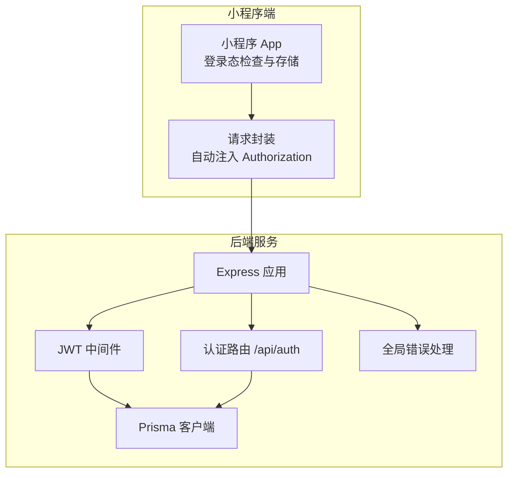
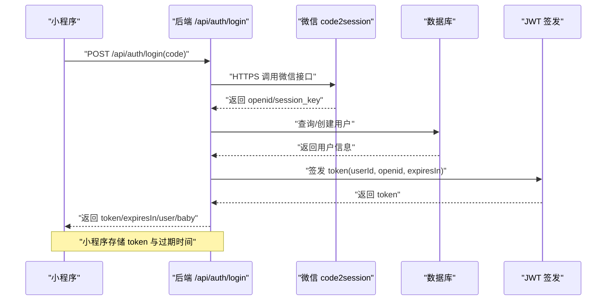
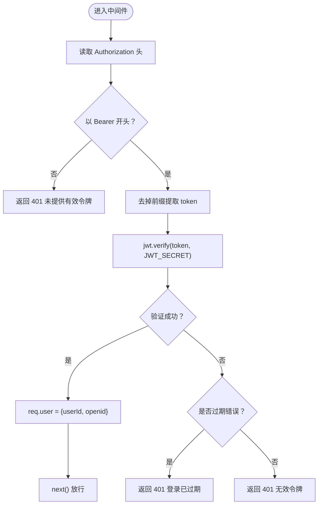
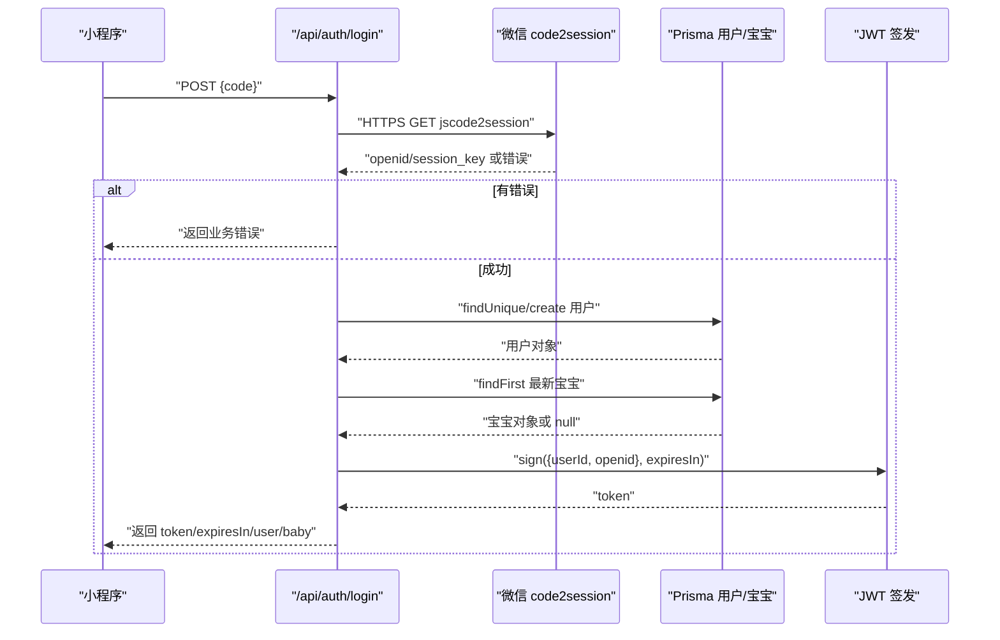
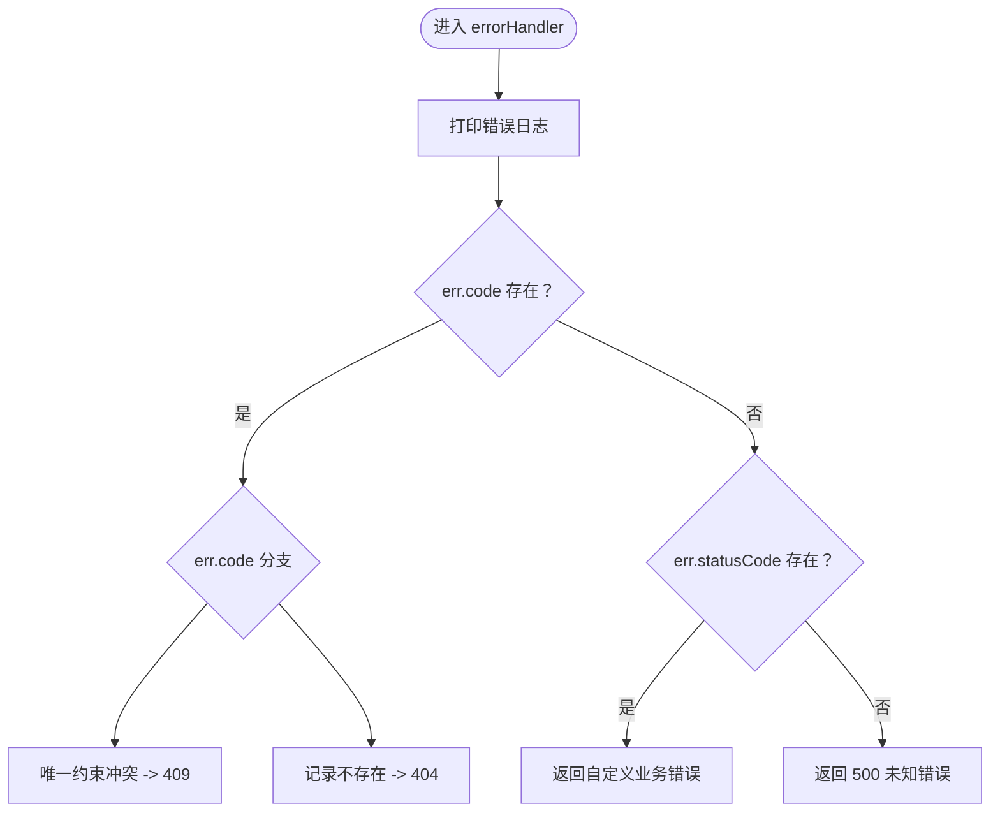
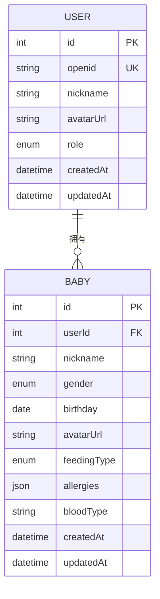
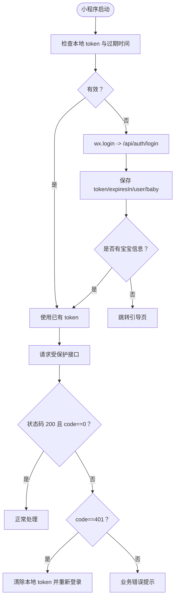
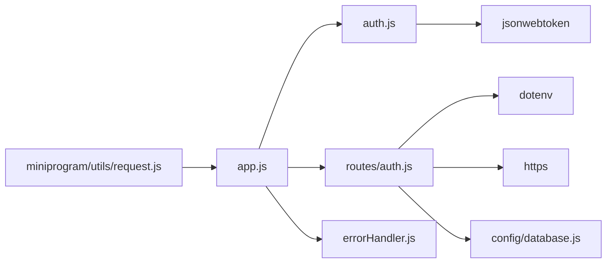

# 认证系统

<cite>
**本文引用的文件**
- [server/src/app.js](file://server/src/app.js)
- [server/src/middleware/auth.js](file://server/src/middleware/auth.js)
- [server/src/middleware/errorHandler.js](file://server/src/middleware/errorHandler.js)
- [server/src/routes/auth.js](file://server/src/routes/auth.js)
- [server/src/config/database.js](file://server/src/config/database.js)
- [server/prisma/schema.prisma](file://server/prisma/schema.prisma)
- [server/package.json](file://server/package.json)
- [miniprogram/utils/request.js](file://miniprogram/utils/request.js)
- [miniprogram/app.js](file://miniprogram/app.js)
- [server/src/routes/baby.js](file://server/src/routes/baby.js)
- [server/src/routes/growth.js](file://server/src/routes/growth.js)
- [server/src/routes/chat.js](file://server/src/routes/chat.js)
</cite>

## 目录
1. [简介](#简介)
2. [项目结构](#项目结构)
3. [核心组件](#核心组件)
4. [架构总览](#架构总览)
5. [详细组件分析](#详细组件分析)
6. [依赖关系分析](#依赖关系分析)
7. [性能考虑](#性能考虑)
8. [故障排查指南](#故障排查指南)
9. [结论](#结论)
10. [附录](#附录)

## 简介
本文件面向“安心育儿”小程序的认证系统，围绕以下目标展开：
- 解析微信登录与 JWT 令牌生成、验证与过期处理的完整实现
- 深入说明认证中间件的工作原理、令牌提取、解码与验证流程
- 阐述权限控制在路由层的应用方式
- 提供认证流程图、错误处理机制说明、安全最佳实践与性能优化建议
- 给出可直接定位到源码位置的参考路径，便于进一步阅读与扩展

## 项目结构
后端采用 Express + Prisma 架构，前端为微信小程序；认证相关的关键模块分布如下：
- 后端入口与中间件：app.js、auth.js（JWT 中间件）、errorHandler.js（统一错误处理）
- 认证路由：auth.js（微信登录换取 JWT）
- 数据访问：database.js（Prisma 客户端），schema.prisma（用户与宝宝模型）
- 小程序端：app.js（登录态检查与存储）、utils/request.js（HTTP 请求封装与 Token 过期处理）

图表来源
- [server/src/app.js:1-65](file://server/src/app.js#L1-L65)
- [server/src/middleware/auth.js:1-29](file://server/src/middleware/auth.js#L1-L29)
- [server/src/middleware/errorHandler.js:1-52](file://server/src/middleware/errorHandler.js#L1-L52)
- [server/src/routes/auth.js:1-84](file://server/src/routes/auth.js#L1-L84)
- [server/src/config/database.js:1-17](file://server/src/config/database.js#L1-L17)

章节来源
- [server/src/app.js:1-65](file://server/src/app.js#L1-L65)
- [server/src/middleware/auth.js:1-29](file://server/src/middleware/auth.js#L1-L29)
- [server/src/middleware/errorHandler.js:1-52](file://server/src/middleware/errorHandler.js#L1-L52)
- [server/src/routes/auth.js:1-84](file://server/src/routes/auth.js#L1-L84)
- [server/src/config/database.js:1-17](file://server/src/config/database.js#L1-L17)
- [server/prisma/schema.prisma:1-189](file://server/prisma/schema.prisma#L1-L189)

## 核心组件
- JWT 认证中间件：从请求头提取 Bearer Token，校验签名与有效期，失败时返回 401
- 认证路由：接收小程序 code，调用微信 code2session，查找/创建用户，签发 JWT
- 全局错误处理：统一格式化 Prisma 错误、自定义业务错误与未知错误
- 数据模型：用户与宝宝模型，用于关联用户与宝宝信息
- 小程序请求封装：自动注入 Authorization 头，处理 401 并触发重新登录

章节来源
- [server/src/middleware/auth.js:1-29](file://server/src/middleware/auth.js#L1-L29)
- [server/src/routes/auth.js:1-84](file://server/src/routes/auth.js#L1-L84)
- [server/src/middleware/errorHandler.js:1-52](file://server/src/middleware/errorHandler.js#L1-L52)
- [server/prisma/schema.prisma:13-60](file://server/prisma/schema.prisma#L13-L60)
- [miniprogram/utils/request.js:1-97](file://miniprogram/utils/request.js#L1-L97)

## 架构总览
认证系统由“小程序端 + 后端服务 + 数据库”三部分组成，核心交互如下：
- 小程序通过 wx.login 获取 code，调用后端 /api/auth/login
- 后端调用微信 code2session 获取 openid，查找或创建用户，生成 JWT 返回
- 小程序本地持久化 token 与过期时间
- 后续请求携带 Authorization: Bearer token
- 中间件校验 token，失败则返回 401
- 路由层使用中间件保护敏感接口

图表来源
- [server/src/routes/auth.js:10-81](file://server/src/routes/auth.js#L10-L81)
- [server/src/config/database.js:1-17](file://server/src/config/database.js#L1-L17)

## 详细组件分析

### JWT 认证中间件
职责与流程
- 从 Authorization 头提取 Bearer Token
- 使用 JWT_SECRET 验证签名与过期时间
- 成功则将用户信息挂载到 req.user，并放行
- 失败时区分过期与无效，返回 401

图表来源
- [server/src/middleware/auth.js:7-26](file://server/src/middleware/auth.js#L7-L26)

章节来源
- [server/src/middleware/auth.js:1-29](file://server/src/middleware/auth.js#L1-L29)

### 认证路由（微信登录）
职责与流程
- 校验请求参数 code
- HTTPS 调用微信 code2session 接口
- 校验微信返回，若失败返回业务错误
- 以 openid 查找用户，不存在则创建
- 选择用户最新宝宝信息
- 使用 JWT_SECRET 签发 token（默认 7 天）

图表来源
- [server/src/routes/auth.js:10-81](file://server/src/routes/auth.js#L10-L81)
- [server/src/config/database.js:1-17](file://server/src/config/database.js#L1-L17)

章节来源
- [server/src/routes/auth.js:1-84](file://server/src/routes/auth.js#L1-L84)

### 全局错误处理
职责与流程
- 打印错误日志
- 识别 Prisma 已知错误（如唯一约束冲突、记录不存在）
- 识别自定义业务错误（带 statusCode 的 AppError）
- 其余未知错误返回 500（开发环境显示具体错误）

图表来源
- [server/src/middleware/errorHandler.js:6-39](file://server/src/middleware/errorHandler.js#L6-L39)

章节来源
- [server/src/middleware/errorHandler.js:1-52](file://server/src/middleware/errorHandler.js#L1-L52)

### 数据模型与权限控制
- 用户模型：包含 openid、角色等字段，与宝宝、对话、收藏关联
- 宝宝模型：与用户一对一关联，用于权限隔离
- 权限控制：中间件将用户信息注入 req.user，各路由通过 userId 进行数据过滤与校验

图表来源
- [server/prisma/schema.prisma:13-60](file://server/prisma/schema.prisma#L13-L60)

章节来源
- [server/prisma/schema.prisma:13-60](file://server/prisma/schema.prisma#L13-L60)
- [server/src/routes/baby.js:9-32](file://server/src/routes/baby.js#L9-L32)
- [server/src/routes/growth.js:16-44](file://server/src/routes/growth.js#L16-L44)
- [server/src/routes/chat.js:15-42](file://server/src/routes/chat.js#L15-L42)

### 小程序端登录与请求封装
- 登录态检查：读取本地 token 与过期时间，决定是否重新登录
- 发起登录：调用 /api/auth/login，保存 token、过期时间与用户信息
- 请求封装：自动注入 Authorization: Bearer token，处理 401 触发重新登录

图表来源
- [miniprogram/app.js:18-67](file://miniprogram/app.js#L18-L67)
- [miniprogram/utils/request.js:21-86](file://miniprogram/utils/request.js#L21-L86)

章节来源
- [miniprogram/app.js:1-69](file://miniprogram/app.js#L1-L69)
- [miniprogram/utils/request.js:1-97](file://miniprogram/utils/request.js#L1-L97)

## 依赖关系分析
- Express 应用注册路由与中间件，统一错误处理
- 认证中间件依赖 jsonwebtoken 与环境变量 JWT_SECRET
- 认证路由依赖 dotenv、https、Prisma 客户端
- 小程序端依赖本地存储与 wx.request

图表来源
- [server/src/app.js:1-65](file://server/src/app.js#L1-L65)
- [server/src/middleware/auth.js:1-29](file://server/src/middleware/auth.js#L1-L29)
- [server/src/routes/auth.js:1-84](file://server/src/routes/auth.js#L1-L84)
- [server/src/config/database.js:1-17](file://server/src/config/database.js#L1-L17)
- [miniprogram/utils/request.js:1-97](file://miniprogram/utils/request.js#L1-L97)

章节来源
- [server/src/app.js:1-65](file://server/src/app.js#L1-L65)
- [server/package.json:14-29](file://server/package.json#L14-L29)

## 性能考虑
- 全局限流：每分钟最多 60 次请求，避免暴力尝试
- JWT 过期时间：默认 7 天，平衡安全性与用户体验
- 数据库访问：路由层尽量减少不必要的查询，必要时使用索引与分页
- 小程序端：本地缓存 token 与过期时间，减少重复登录

章节来源
- [server/src/app.js:19-25](file://server/src/app.js#L19-L25)
- [server/src/routes/auth.js:48-54](file://server/src/routes/auth.js#L48-L54)
- [server/prisma/schema.prisma:29](file://server/prisma/schema.prisma#L29)

## 故障排查指南
常见问题与定位
- 未提供有效认证令牌
  - 现象：401 未提供有效的认证令牌
  - 可能原因：请求头缺失 Authorization 或非 Bearer 前缀
  - 处理：确保前端正确注入 Authorization: Bearer token
  - 参考路径：[server/src/middleware/auth.js:10-12](file://server/src/middleware/auth.js#L10-L12)
- 无效的认证令牌
  - 现象：401 无效的认证令牌
  - 可能原因：签名不匹配、密钥错误、篡改
  - 处理：确认 JWT_SECRET 一致且未被修改
  - 参考路径：[server/src/middleware/auth.js:24](file://server/src/middleware/auth.js#L24)
- 登录已过期，请重新登录
  - 现象：401 登录已过期
  - 可能原因：token 已过期
  - 处理：小程序端收到 401 后清除本地 token 并重新登录
  - 参考路径：[server/src/middleware/auth.js:21-23](file://server/src/middleware/auth.js#L21-L23)，[miniprogram/utils/request.js:48-51](file://miniprogram/utils/request.js#L48-L51)
- 微信登录失败
  - 现象：业务错误，包含微信返回的 errmsg
  - 可能原因：code 无效、appid/secret 配置错误
  - 处理：检查环境变量 WX_APPID/WX_SECRET 与 code 有效性
  - 参考路径：[server/src/routes/auth.js:28-30](file://server/src/routes/auth.js#L28-L30)
- Prisma 唯一约束冲突
  - 现象：409 数据已存在
  - 处理：检查业务逻辑避免重复创建
  - 参考路径：[server/src/middleware/errorHandler.js:12-16](file://server/src/middleware/errorHandler.js#L12-L16)
- 记录不存在
  - 现象：404 记录不存在
  - 处理：确认资源 ID 与用户权限
  - 参考路径：[server/src/middleware/errorHandler.js:17-21](file://server/src/middleware/errorHandler.js#L17-L21)

章节来源
- [server/src/middleware/auth.js:10-25](file://server/src/middleware/auth.js#L10-L25)
- [server/src/routes/auth.js:28-30](file://server/src/routes/auth.js#L28-L30)
- [server/src/middleware/errorHandler.js:11-22](file://server/src/middleware/errorHandler.js#L11-L22)
- [miniprogram/utils/request.js:48-51](file://miniprogram/utils/request.js#L48-L51)

## 结论
该认证系统以 JWT 为核心，结合微信 code2session 完成小程序登录，通过中间件统一鉴权，配合全局错误处理与限流策略，实现了较为完善的前后端协作方案。建议后续可引入刷新令牌、黑名单与更细粒度的权限控制，以进一步提升安全性与可维护性。

## 附录
- 环境变量
  - JWT_SECRET：用于签发与验证 JWT
  - WX_APPID/WX_SECRET：微信小程序应用配置
  - DATABASE_URL：数据库连接字符串
  - NODE_ENV：运行环境（影响日志级别）
- 关键实现参考
  - JWT 中间件：[server/src/middleware/auth.js:1-29](file://server/src/middleware/auth.js#L1-L29)
  - 认证路由：[server/src/routes/auth.js:1-84](file://server/src/routes/auth.js#L1-L84)
  - 全局错误处理：[server/src/middleware/errorHandler.js:1-52](file://server/src/middleware/errorHandler.js#L1-L52)
  - 数据模型：[server/prisma/schema.prisma:13-60](file://server/prisma/schema.prisma#L13-L60)
  - 小程序请求封装：[miniprogram/utils/request.js:1-97](file://miniprogram/utils/request.js#L1-L97)
  - Express 应用与路由注册：[server/src/app.js:1-65](file://server/src/app.js#L1-L65)