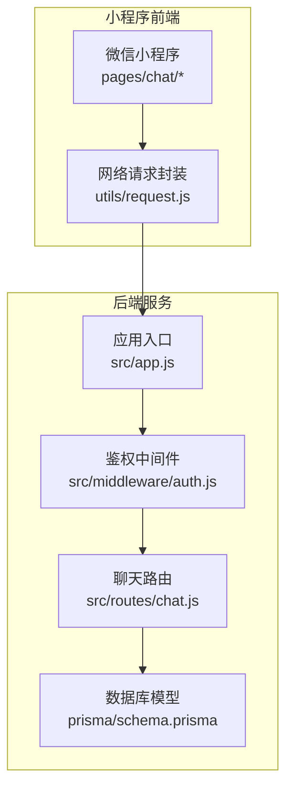
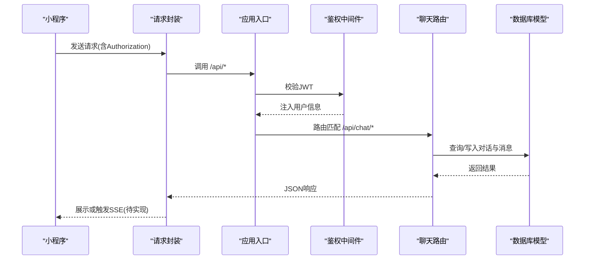
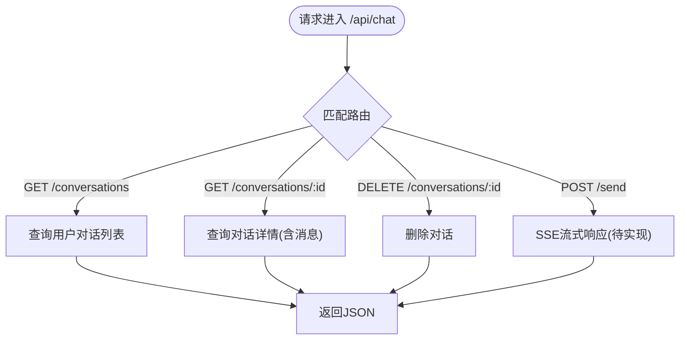
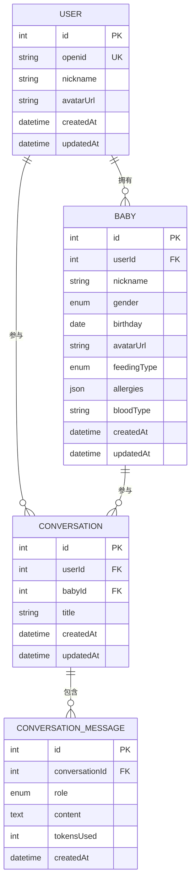
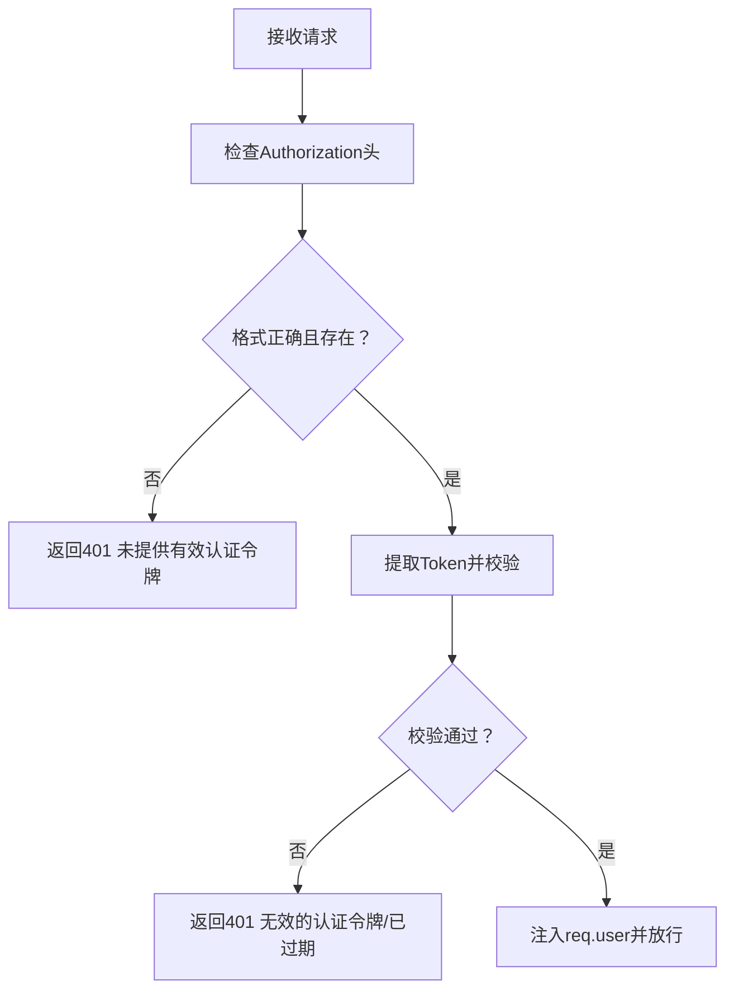
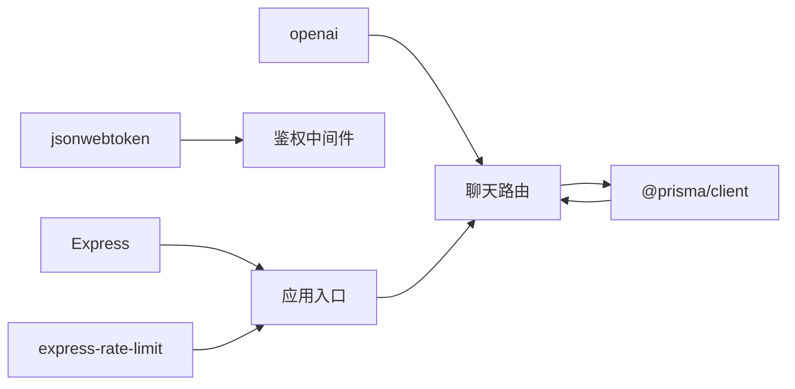

# AI聊天路由

<cite>
**本文引用的文件**
- [server/src/app.js](file://server/src/app.js)
- [server/src/routes/chat.js](file://server/src/routes/chat.js)
- [server/src/middleware/auth.js](file://server/src/middleware/auth.js)
- [server/prisma/schema.prisma](file://server/prisma/schema.prisma)
- [server/package.json](file://server/package.json)
- [miniprogram/utils/request.js](file://miniprogram/utils/request.js)
- [miniprogram/pages/chat/index.json](file://miniprogram/pages/chat/index.json)
- [miniprogram/pages/chat/history.json](file://miniprogram/pages/chat/history.json)
- [miniprogram/app.json](file://miniprogram/app.json)
</cite>

## 目录
1. [简介](#简介)
2. [项目结构](#项目结构)
3. [核心组件](#核心组件)
4. [架构总览](#架构总览)
5. [详细组件分析](#详细组件分析)
6. [依赖关系分析](#依赖关系分析)
7. [性能考虑](#性能考虑)
8. [故障排除指南](#故障排除指南)
9. [结论](#结论)
10. [附录](#附录)

## 简介
本技术文档围绕“AI聊天助手路由”进行系统化梳理，聚焦于实时对话能力在当前版本中的实现现状与后续演进方向。根据仓库现有代码，后端已具备基础的聊天路由与数据库模型支持，但尚未实现SSE流式响应与OpenAI集成；前端已包含聊天页面与网络请求封装模块。本文将从系统架构、组件职责、数据流、错误处理与性能优化等方面，给出可操作的实现建议与集成示例。

## 项目结构
后端采用Express框架，通过中间件统一鉴权与限流，并按模块化注册路由。聊天相关路由位于/api/chat下，数据库模型由Prisma定义，包含用户、宝宝、对话与消息等实体。前端为微信小程序，包含聊天主界面与历史界面，网络请求通过统一封装模块完成。

图表来源
- [server/src/app.js:32-47](file://server/src/app.js#L32-L47)
- [server/src/middleware/auth.js:1-29](file://server/src/middleware/auth.js#L1-L29)
- [server/src/routes/chat.js:1-57](file://server/src/routes/chat.js#L1-L57)
- [server/prisma/schema.prisma:106-142](file://server/prisma/schema.prisma#L106-L142)

章节来源
- [server/src/app.js:14-62](file://server/src/app.js#L14-L62)
- [server/src/routes/chat.js:1-57](file://server/src/routes/chat.js#L1-L57)
- [server/prisma/schema.prisma:106-142](file://server/prisma/schema.prisma#L106-L142)

## 核心组件
- 应用入口与全局中间件
  - CORS、JSON解析、全局限流、健康检查、路由注册、404与全局错误处理。
- 鉴权中间件
  - 从Authorization头提取Bearer Token，校验JWT有效性并将用户信息注入请求上下文。
- 聊天路由
  - 提供对话列表、对话详情、删除对话等接口；发送消息接口预留SSE流式响应。
- 数据模型
  - Conversation与ConversationMessage模型定义了对话与消息的存储结构，支持角色区分与分页查询。
- 小程序网络封装
  - 统一注入Authorization头、业务错误处理、Token过期自动刷新与加载状态控制。

章节来源
- [server/src/app.js:14-62](file://server/src/app.js#L14-L62)
- [server/src/middleware/auth.js:1-29](file://server/src/middleware/auth.js#L1-L29)
- [server/src/routes/chat.js:14-54](file://server/src/routes/chat.js#L14-L54)
- [server/prisma/schema.prisma:106-142](file://server/prisma/schema.prisma#L106-L142)
- [miniprogram/utils/request.js:11-97](file://miniprogram/utils/request.js#L11-L97)

## 架构总览
下图展示了从小程序到后端服务的整体调用链路，以及当前已实现与待实现的功能点。

图表来源
- [server/src/app.js:32-47](file://server/src/app.js#L32-L47)
- [server/src/middleware/auth.js:7-26](file://server/src/middleware/auth.js#L7-L26)
- [server/src/routes/chat.js:14-54](file://server/src/routes/chat.js#L14-L54)
- [server/prisma/schema.prisma:106-142](file://server/prisma/schema.prisma#L106-L142)

## 详细组件分析

### 路由与控制器层
- 已实现接口
  - GET /api/chat/conversations：按用户维度返回最近对话列表，支持排序与数量限制。
  - GET /api/chat/conversations/:id：按用户维度查询指定对话详情，包含消息列表按时间升序排列。
  - DELETE /api/chat/conversations/:id：按用户维度删除指定对话。
- 待实现接口
  - POST /api/chat/send：用于发起对话并返回SSE流式响应（当前返回占位提示）。
- 设计要点
  - 所有聊天接口均受鉴权中间件保护，确保仅当前用户可见与操作自己的对话。
  - 对话详情包含消息集合，便于前端直接渲染完整对话历史。

图表来源
- [server/src/routes/chat.js:14-54](file://server/src/routes/chat.js#L14-L54)

章节来源
- [server/src/routes/chat.js:14-54](file://server/src/routes/chat.js#L14-L54)

### 数据模型与持久化
- 关键实体
  - Conversation：用户与宝宝维度的对话容器，包含标题、创建/更新时间。
  - ConversationMessage：对话内的消息，包含角色(user/assistant/system)、内容、token用量与时间戳。
- 关系与索引
  - Conversation与User、Baby存在外键关联；ConversationMessage与Conversation存在外键关联。
  - 在(userId,babyId)与(conversationId)上建立索引以提升查询性能。
- 使用建议
  - 新增对话时可基于第一条消息内容生成标题。
  - 消息插入时记录tokensUsed以便成本统计与审计。

图表来源
- [server/prisma/schema.prisma:14-142](file://server/prisma/schema.prisma#L14-L142)

章节来源
- [server/prisma/schema.prisma:106-142](file://server/prisma/schema.prisma#L106-L142)

### 鉴权与安全
- 鉴权流程
  - 从Authorization头提取Bearer Token，使用JWT_SECRET校验签名与有效期。
  - 成功后将用户标识注入req.user，后续路由可直接读取。
- 错误处理
  - 缺失或无效Token返回401；Token过期返回明确提示。
- 建议
  - 在路由层对敏感操作增加权限校验（如仅对话所属用户可访问）。

图表来源
- [server/src/middleware/auth.js:7-26](file://server/src/middleware/auth.js#L7-L26)

章节来源
- [server/src/middleware/auth.js:1-29](file://server/src/middleware/auth.js#L1-L29)

### 前端集成与页面结构
- 页面入口
  - 小程序导航栏中包含“AI助手”入口，页面位于pages/chat/index与pages/chat/history。
- 网络封装
  - 统一设置Content-Type与Authorization头；根据code处理业务错误与登录过期；提供get/post/put/delete快捷方法。
- 建议
  - 在聊天页面发起请求时携带用户选择的宝宝信息，以便后端在Conversation中绑定babyId。

章节来源
- [miniprogram/app.json:49-53](file://miniprogram/app.json#L49-L53)
- [miniprogram/pages/chat/index.json:1-4](file://miniprogram/pages/chat/index.json#L1-L4)
- [miniprogram/pages/chat/history.json:1-4](file://miniprogram/pages/chat/history.json#L1-L4)
- [miniprogram/utils/request.js:11-97](file://miniprogram/utils/request.js#L11-L97)

## 依赖关系分析
- 后端依赖
  - Express：Web框架与路由。
  - jsonwebtoken：JWT鉴权。
  - express-rate-limit：全局限流。
  - @prisma/client：数据库ORM。
  - openai：OpenAI SDK（当前版本未在路由中使用，但已作为依赖引入）。
- 前端依赖
  - 微信小程序原生API：wx.request、wx.showToast、wx.showLoading等。

图表来源
- [server/package.json:14-25](file://server/package.json#L14-L25)
- [server/src/app.js:14-25](file://server/src/app.js#L14-L25)
- [server/src/middleware/auth.js:5](file://server/src/middleware/auth.js#L5)
- [server/src/routes/chat.js:3](file://server/src/routes/chat.js#L3)

章节来源
- [server/package.json:14-25](file://server/package.json#L14-L25)
- [server/src/app.js:14-25](file://server/src/app.js#L14-L25)

## 性能考虑
- 路由层
  - 全局限流避免突发流量冲击；按用户维度查询对话列表时建议在userId上建立索引（模型已具备复合索引）。
- 数据层
  - 对话详情查询已包含消息排序，建议在conversationId与createdAt上建立索引以优化分页与排序。
- 网络层
  - 前端请求封装已内置加载状态与错误提示，建议在聊天页面增加请求去抖与重复提交拦截。
- SSE与流式响应
  - 当前POST /api/chat/send接口预留SSE实现，建议结合Redis或内存队列实现事件推送与断线重连。

## 故障排除指南
- 401 未提供有效认证令牌
  - 检查请求头Authorization是否以Bearer开头，确认Token未被篡改或过期。
- 404 接口不存在
  - 确认请求路径是否为/api/chat下的合法路由。
- 业务错误(code非0)
  - 查看返回message字段，前端封装会弹出Toast提示。
- Token过期
  - 前端封装检测到401时会清理本地缓存并触发重新登录流程。
- 数据查询异常
  - 确认用户维度过滤条件(userId)是否正确；检查数据库索引是否存在。

章节来源
- [server/src/app.js:49-55](file://server/src/app.js#L49-L55)
- [server/src/middleware/auth.js:10-25](file://server/src/middleware/auth.js#L10-L25)
- [miniprogram/utils/request.js:48-86](file://miniprogram/utils/request.js#L48-L86)

## 结论
当前版本的AI聊天路由已具备基础的对话管理能力与鉴权保护，数据库模型也满足后续扩展需求。SSE流式响应与OpenAI集成尚未实现，建议在下一迭代中优先完成以下工作：
- 实现POST /api/chat/send的SSE流式响应。
- 集成OpenAI SDK，将用户消息转发至模型并回传流式结果。
- 完善消息持久化与tokens统计，增强对话历史管理体验。
- 在前端页面增加输入防抖、加载状态与错误提示，提升交互稳定性。

## 附录

### 接口清单与规范
- GET /api/chat/conversations
  - 功能：获取当前用户最近对话列表。
  - 认证：需要。
  - 响应：包含对话数组，按更新时间倒序，限制数量。
- GET /api/chat/conversations/:id
  - 功能：获取指定对话详情及全部消息。
  - 认证：需要。
  - 响应：包含对话与消息集合。
- DELETE /api/chat/conversations/:id
  - 功能：删除指定对话。
  - 认证：需要。
  - 响应：成功码。
- POST /api/chat/send（待实现）
  - 功能：发起对话并返回SSE流式响应。
  - 认证：需要。
  - 输入：用户消息内容与上下文（可选）。
  - 输出：SSE事件流，逐条推送模型回复片段。

章节来源
- [server/src/routes/chat.js:14-54](file://server/src/routes/chat.js#L14-L54)

### 消息格式规范
- 角色枚举：user、assistant、system。
- 字段建议：content（文本内容）、tokensUsed（消耗token数）、createdAt（时间戳）。
- 建议在前端对assistant消息进行拼接渲染，避免闪烁。

章节来源
- [server/prisma/schema.prisma:138-142](file://server/prisma/schema.prisma#L138-L142)

### WebSocket与SSE对比（概念性说明）
- SSE（推荐用于当前场景）
  - 单向服务器推送，实现简单，浏览器与小程序支持良好。
  - 断线自动重连，适合流式输出。
- WebSocket
  - 双向通信，复杂度更高，适合实时互动（如语音/视频）。
- 选择建议
  - 当前聊天以“流式回复”为主，优先采用SSE；若未来扩展为双向交互再评估WebSocket。

[本节为概念性说明，不对应具体源码文件]