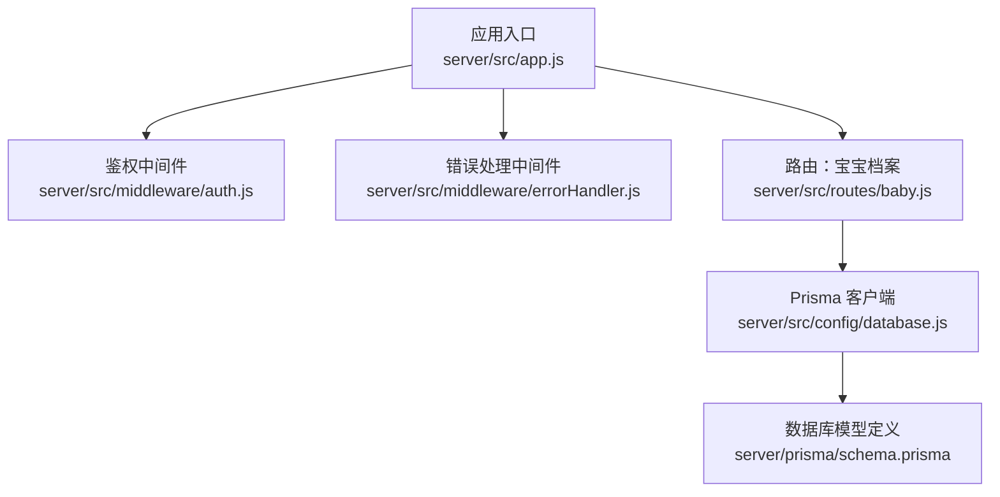
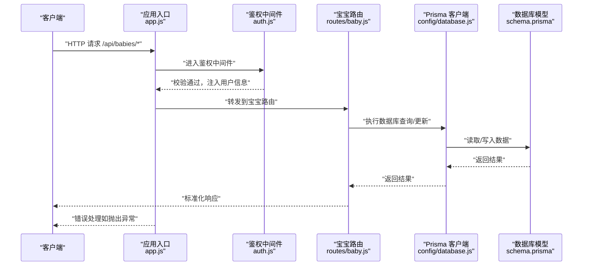
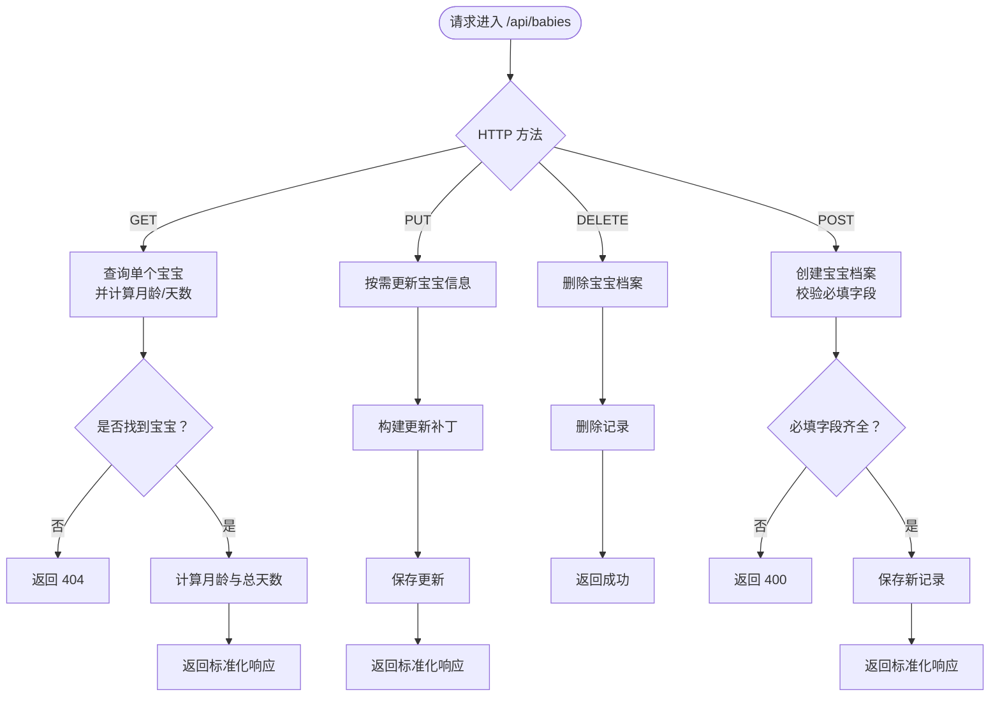
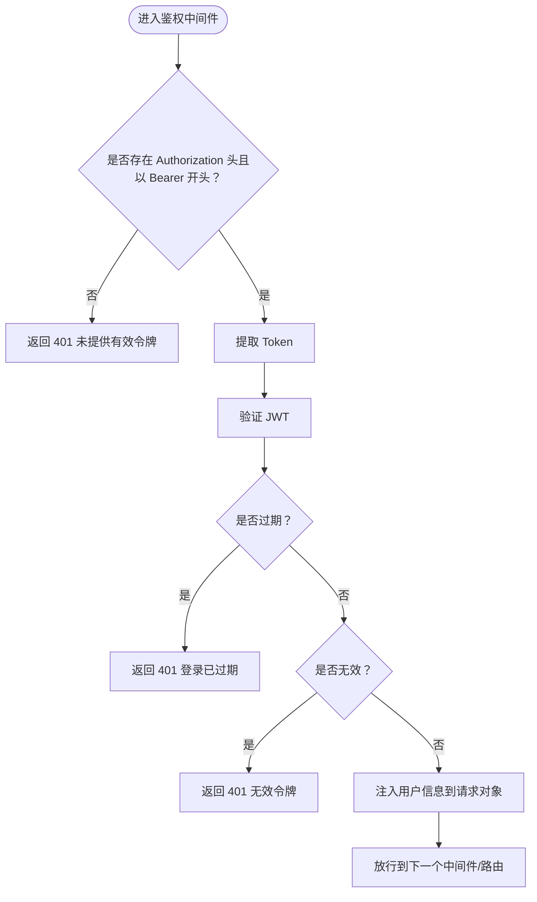
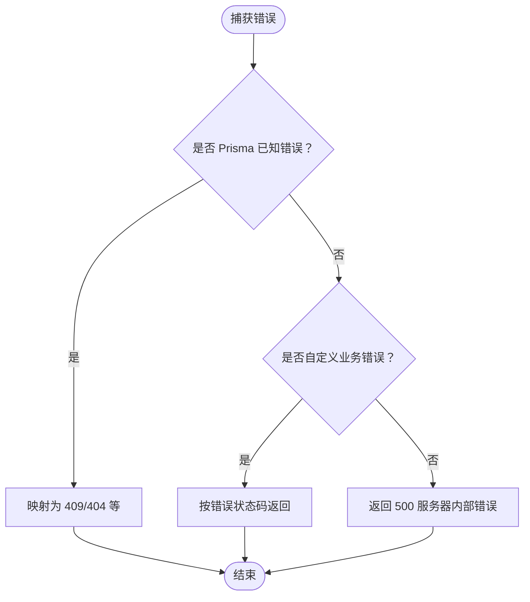
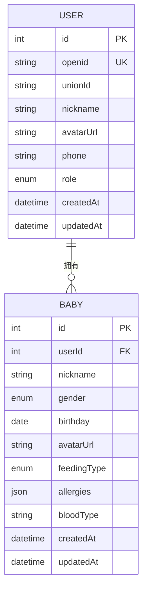
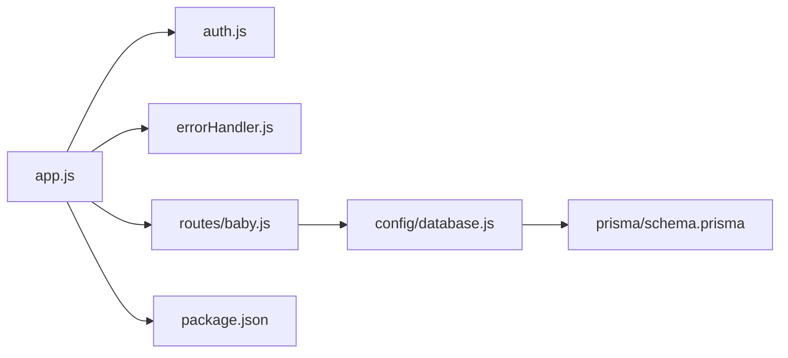

# 宝宝档案路由

<cite>
**本文引用的文件**
- [server/src/app.js](file://server/src/app.js)
- [server/src/routes/baby.js](file://server/src/routes/baby.js)
- [server/src/middleware/auth.js](file://server/src/middleware/auth.js)
- [server/src/middleware/errorHandler.js](file://server/src/middleware/errorHandler.js)
- [server/prisma/schema.prisma](file://server/prisma/schema.prisma)
- [server/src/config/database.js](file://server/src/config/database.js)
- [server/package.json](file://server/package.json)
</cite>

## 目录
1. [简介](#简介)
2. [项目结构](#项目结构)
3. [核心组件](#核心组件)
4. [架构总览](#架构总览)
5. [详细组件分析](#详细组件分析)
6. [依赖关系分析](#依赖关系分析)
7. [性能考虑](#性能考虑)
8. [故障排查指南](#故障排查指南)
9. [结论](#结论)
10. [附录](#附录)

## 简介
本文件围绕“宝宝档案管理路由”进行系统化技术文档整理，覆盖以下关键接口与能力：
- GET /api/babies/:id：获取单个宝宝信息，并在返回中包含自动计算的月龄与总天数
- PUT /api/babies/:id：按需更新宝宝信息（昵称、性别、生日、喂养方式、血型、头像）
- DELETE /api/babies/:id：删除宝宝档案
- POST /api/babies：创建宝宝档案（昵称、性别、出生日期为必填；喂养方式默认为母乳，可选配方/混合）
- GET /api/babies：当前用户下的宝宝列表（当前实现为通过关联查询返回该用户下首个宝宝，后续可扩展为完整列表）

同时，文档深入解析路由参数处理、数据验证规则、关联查询与权限控制策略，并提供统一的错误处理与安全中间件集成方案。

## 项目结构
后端采用 Express + Prisma 的典型分层结构：
- 应用入口负责中间件装配、路由注册与全局异常处理
- 路由层承载具体 API 行为
- 中间件层提供鉴权与错误处理
- 数据访问层通过 Prisma 客户端完成数据库交互
- 数据模型定义于 Prisma Schema 中

图表来源
- [server/src/app.js:32-47](file://server/src/app.js#L32-L47)
- [server/src/middleware/auth.js:7-26](file://server/src/middleware/auth.js#L7-L26)
- [server/src/middleware/errorHandler.js:6-39](file://server/src/middleware/errorHandler.js#L6-L39)
- [server/src/routes/baby.js:1-100](file://server/src/routes/baby.js#L1-L100)
- [server/src/config/database.js:7-14](file://server/src/config/database.js#L7-L14)
- [server/prisma/schema.prisma:40-60](file://server/prisma/schema.prisma#L40-L60)

章节来源
- [server/src/app.js:11-65](file://server/src/app.js#L11-L65)
- [server/src/routes/baby.js:1-100](file://server/src/routes/baby.js#L1-L100)
- [server/src/middleware/auth.js:1-29](file://server/src/middleware/auth.js#L1-L29)
- [server/src/middleware/errorHandler.js:1-52](file://server/src/middleware/errorHandler.js#L1-L52)
- [server/prisma/schema.prisma:1-189](file://server/prisma/schema.prisma#L1-L189)
- [server/src/config/database.js:1-17](file://server/src/config/database.js#L1-L17)

## 核心组件
- 应用入口与中间件
  - 全局中间件：CORS、JSON 解析、URL 编码解析、限流
  - 路由注册：将 /api/babies 路由挂载到鉴权中间件之后
- 鉴权中间件
  - 从 Authorization 请求头中提取 Bearer Token 并校验
  - 将解码后的用户信息注入到请求对象，供后续路由使用
- 错误处理中间件
  - 统一捕获 Prisma 已知错误与自定义业务错误
  - 返回标准化响应结构
- 数据访问层
  - 使用 Prisma 客户端进行数据库读写
  - 通过单例客户端避免重复连接
- 数据模型
  - 宝宝档案表包含基础字段与枚举类型，支持与用户表建立外键关系

章节来源
- [server/src/app.js:14-25](file://server/src/app.js#L14-L25)
- [server/src/app.js:32-47](file://server/src/app.js#L32-L47)
- [server/src/middleware/auth.js:7-26](file://server/src/middleware/auth.js#L7-L26)
- [server/src/middleware/errorHandler.js:6-39](file://server/src/middleware/errorHandler.js#L6-L39)
- [server/src/config/database.js:7-14](file://server/src/config/database.js#L7-L14)
- [server/prisma/schema.prisma:40-60](file://server/prisma/schema.prisma#L40-L60)

## 架构总览
下图展示宝宝档案路由在整体系统中的位置与调用链路：

图表来源
- [server/src/app.js:32-47](file://server/src/app.js#L32-L47)
- [server/src/middleware/auth.js:7-26](file://server/src/middleware/auth.js#L7-L26)
- [server/src/routes/baby.js:9-32](file://server/src/routes/baby.js#L9-L32)
- [server/src/config/database.js:7-14](file://server/src/config/database.js#L7-L14)
- [server/prisma/schema.prisma:40-60](file://server/prisma/schema.prisma#L40-L60)

## 详细组件分析

### 宝宝档案路由（/api/babies）
- 路由注册与权限控制
  - 在应用入口中，/api/babies 路由挂载了鉴权中间件，确保只有已登录用户可访问
- GET /api/babies/:id
  - 功能：根据宝宝 ID 获取信息，并在响应中附加月龄与总天数
  - 参数处理：从路径参数解析宝宝 ID，并与用户 ID 进行匹配过滤
  - 关联查询：通过 Prisma 查询用户与其关联的宝宝
  - 计算逻辑：基于当前时间与生日计算月龄与总天数
  - 错误处理：当找不到对应宝宝时返回 404
- PUT /api/babies/:id
  - 功能：按需更新宝宝信息（昵称、性别、生日、喂养方式、血型、头像）
  - 参数处理：从请求体解析字段，仅对传入的字段进行更新
  - 权限控制：同样基于用户 ID 与宝宝 ID 的组合过滤
- DELETE /api/babies/:id
  - 功能：删除指定宝宝档案
  - 权限控制：基于用户 ID 与宝宝 ID 的组合过滤
- POST /api/babies
  - 功能：创建新的宝宝档案
  - 必填字段：昵称、性别、出生日期
  - 默认值：喂养方式默认为母乳
  - 关联写入：将当前用户 ID 写入档案记录

图表来源
- [server/src/routes/baby.js:37-69](file://server/src/routes/baby.js#L37-L69)
- [server/src/routes/baby.js:74-97](file://server/src/routes/baby.js#L74-L97)
- [server/src/routes/baby.js:9-32](file://server/src/routes/baby.js#L9-L32)

章节来源
- [server/src/app.js:42](file://server/src/app.js#L42)
- [server/src/routes/baby.js:9-32](file://server/src/routes/baby.js#L9-L32)
- [server/src/routes/baby.js:37-69](file://server/src/routes/baby.js#L37-L69)
- [server/src/routes/baby.js:74-97](file://server/src/routes/baby.js#L74-L97)

### 鉴权中间件（JWT）
- 从 Authorization 请求头中提取 Bearer Token
- 校验失败时返回 401，并区分过期与无效令牌
- 校验通过后将用户信息注入到请求对象，供后续路由使用

图表来源
- [server/src/middleware/auth.js:7-26](file://server/src/middleware/auth.js#L7-L26)

章节来源
- [server/src/middleware/auth.js:7-26](file://server/src/middleware/auth.js#L7-L26)

### 错误处理中间件
- 统一捕获 Prisma 已知错误（如唯一约束冲突、记录不存在）并映射为标准状态码
- 支持自定义业务错误（带状态码的错误）
- 未知错误统一返回 500，并在开发环境输出详细错误信息

图表来源
- [server/src/middleware/errorHandler.js:6-39](file://server/src/middleware/errorHandler.js#L6-L39)

章节来源
- [server/src/middleware/errorHandler.js:6-39](file://server/src/middleware/errorHandler.js#L6-L39)

### 数据模型与关联查询
- 宝宝档案表与用户表通过外键关联，删除策略为级联
- 宝宝档案包含枚举类型（性别、喂养方式），以及 JSON 字段用于过敏信息等
- 路由中通过 Prisma 查询实现：
  - 按用户 ID 与宝宝 ID 过滤
  - 计算月龄与总天数
  - 按需更新字段

图表来源
- [server/prisma/schema.prisma:14-31](file://server/prisma/schema.prisma#L14-L31)
- [server/prisma/schema.prisma:40-60](file://server/prisma/schema.prisma#L40-L60)

章节来源
- [server/prisma/schema.prisma:14-31](file://server/prisma/schema.prisma#L14-L31)
- [server/prisma/schema.prisma:40-60](file://server/prisma/schema.prisma#L40-L60)

### API 使用示例与错误处理策略
- 认证流程
  - 客户端携带 Authorization: Bearer <token> 访问受保护接口
  - 若令牌缺失或无效，返回 401
- 创建宝宝档案
  - 请求体需包含昵称、性别、出生日期
  - 可选字段：喂养方式、血型
  - 返回标准化响应，包含新建的宝宝信息
- 获取单个宝宝信息
  - 返回中包含自动计算的月龄与总天数
  - 若宝宝不存在，返回 404
- 更新宝宝信息
  - 仅对传入的字段进行更新
  - 返回更新后的宝宝信息
- 删除宝宝档案
  - 删除成功返回成功状态
- 错误处理
  - Prisma 唯一约束冲突映射为 409
  - 记录不存在映射为 404
  - 自定义业务错误按错误状态码返回
  - 未知错误统一返回 500

章节来源
- [server/src/middleware/auth.js:7-26](file://server/src/middleware/auth.js#L7-L26)
- [server/src/routes/baby.js:9-32](file://server/src/routes/baby.js#L9-L32)
- [server/src/routes/baby.js:37-69](file://server/src/routes/baby.js#L37-L69)
- [server/src/routes/baby.js:74-97](file://server/src/routes/baby.js#L74-L97)
- [server/src/middleware/errorHandler.js:6-39](file://server/src/middleware/errorHandler.js#L6-L39)

## 依赖关系分析
- 应用入口依赖中间件与路由模块
- 路由模块依赖数据库客户端与错误处理工具
- 数据库客户端依赖 Prisma 模型定义
- 依赖注入与版本信息见包管理文件

图表来源
- [server/src/app.js:32-47](file://server/src/app.js#L32-L47)
- [server/src/routes/baby.js:1-100](file://server/src/routes/baby.js#L1-L100)
- [server/src/config/database.js:7-14](file://server/src/config/database.js#L7-L14)
- [server/prisma/schema.prisma:1-189](file://server/prisma/schema.prisma#L1-L189)
- [server/package.json:14-29](file://server/package.json#L14-L29)

章节来源
- [server/src/app.js:32-47](file://server/src/app.js#L32-L47)
- [server/src/routes/baby.js:1-100](file://server/src/routes/baby.js#L1-L100)
- [server/src/config/database.js:7-14](file://server/src/config/database.js#L7-L14)
- [server/prisma/schema.prisma:1-189](file://server/prisma/schema.prisma#L1-L189)
- [server/package.json:14-29](file://server/package.json#L14-L29)

## 性能考虑
- 限流策略：全局每 IP 每分钟最多 60 次请求，防止滥用
- 数据库查询：按用户 ID 与宝宝 ID 组合过滤，减少不必要的扫描
- 响应格式：统一返回结构，便于前端解析与缓存
- 日志级别：开发环境下开启 Prisma 查询日志，生产环境仅记录错误与警告

章节来源
- [server/src/app.js:19-25](file://server/src/app.js#L19-L25)
- [server/src/config/database.js:7-9](file://server/src/config/database.js#L7-L9)

## 故障排查指南
- 401 未提供有效认证令牌
  - 检查请求头 Authorization 是否存在且以 Bearer 开头
  - 确认令牌未过期
- 404 宝宝不存在
  - 确认传入的宝宝 ID 属于当前用户
  - 检查用户与宝宝的关联关系
- 409 数据已存在（唯一约束冲突）
  - 检查 Prisma 模型中的唯一约束定义
- 500 服务器内部错误
  - 查看服务端日志，定位具体错误堆栈
  - 在开发环境可获得更详细的错误信息

章节来源
- [server/src/middleware/auth.js:10-25](file://server/src/middleware/auth.js#L10-L25)
- [server/src/middleware/errorHandler.js:10-23](file://server/src/middleware/errorHandler.js#L10-L23)
- [server/src/middleware/errorHandler.js:33-38](file://server/src/middleware/errorHandler.js#L33-L38)

## 结论
本技术文档系统梳理了宝宝档案管理路由的设计与实现，明确了鉴权、参数处理、数据验证、关联查询与权限控制的关键点，并提供了统一的错误处理策略与使用示例。建议后续扩展：
- 完善 GET /api/babies 列表接口，支持分页与排序
- 引入输入校验器（如 Joi/express-validator）提升健壮性
- 增加幂等性与事务控制，保障并发场景下的数据一致性

## 附录
- 环境变量与依赖
  - JWT 密钥、数据库连接等环境变量
  - 依赖包包括 Express、Prisma、JWT、限流等

章节来源
- [server/package.json:14-29](file://server/package.json#L14-L29)