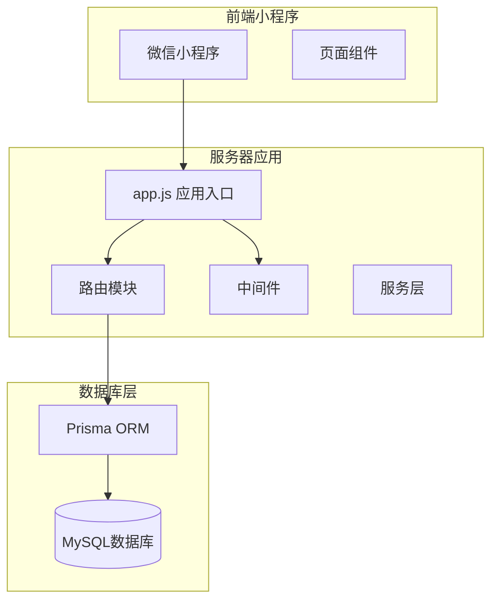
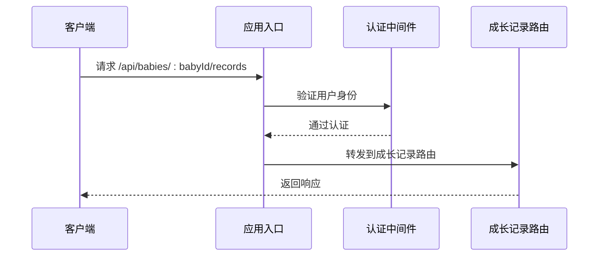
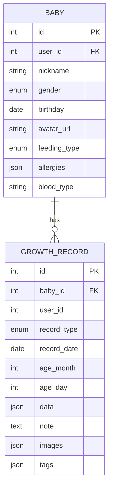
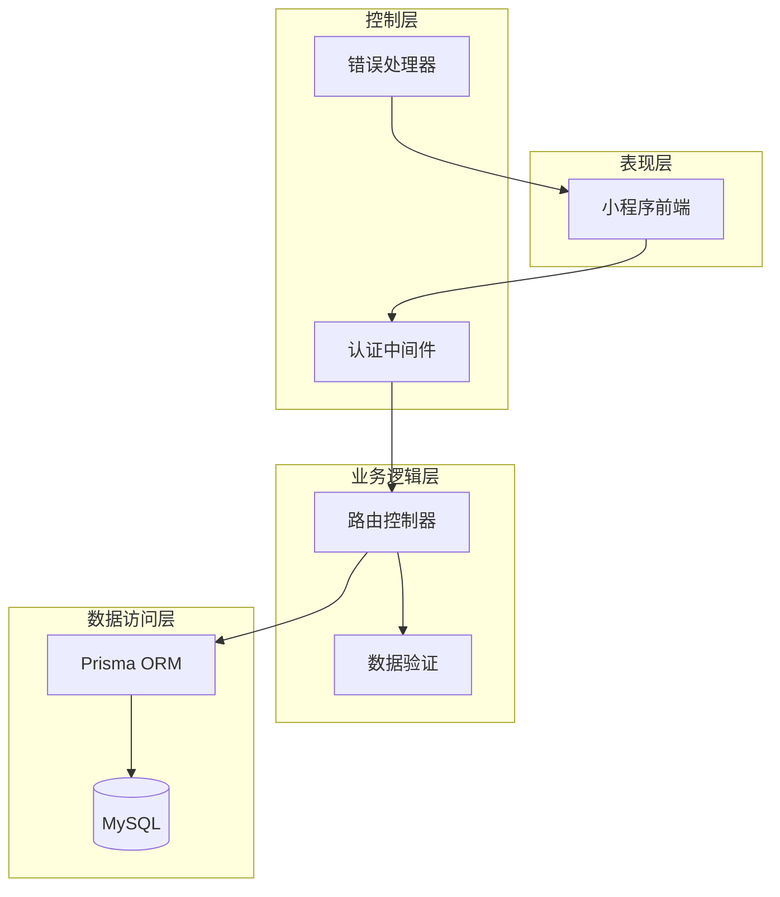
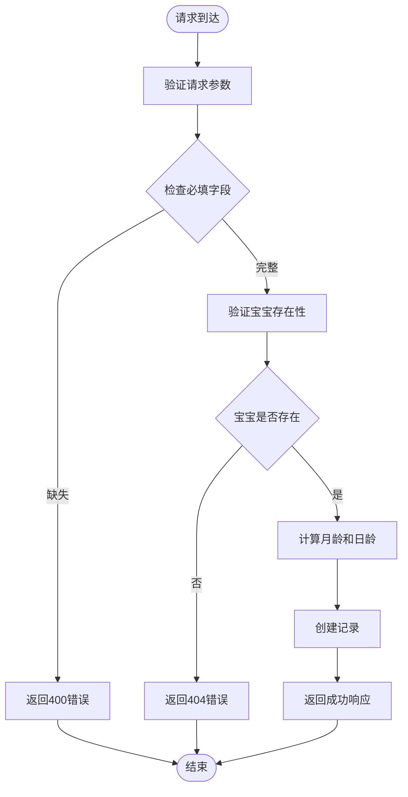
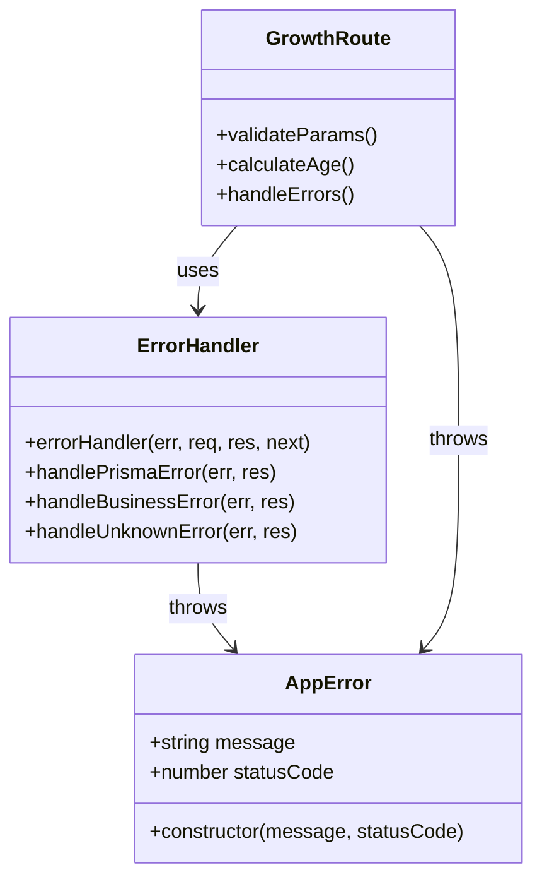
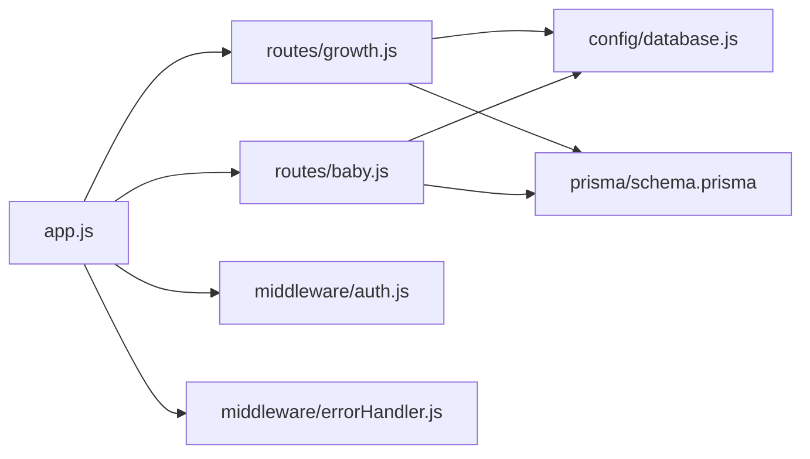

# 成长记录路由

<cite>
**本文档引用的文件**
- [server/src/routes/growth.js](file://server/src/routes/growth.js)
- [server/src/app.js](file://server/src/app.js)
- [server/src/middleware/errorHandler.js](file://server/src/middleware/errorHandler.js)
- [server/src/config/database.js](file://server/src/config/database.js)
- [server/prisma/schema.prisma](file://server/prisma/schema.prisma)
- [server/src/routes/baby.js](file://server/src/routes/baby.js)
- [miniprogram/pages/baby/growth-record.json](file://miniprogram/pages/baby/growth-record.json)
- [miniprogram/pages/baby/add-record.json](file://miniprogram/pages/baby/add-record.json)
</cite>

## 目录
1. [简介](#简介)
2. [项目结构](#项目结构)
3. [核心组件](#核心组件)
4. [架构概览](#架构概览)
5. [详细组件分析](#详细组件分析)
6. [依赖关系分析](#依赖关系分析)
7. [性能考虑](#性能考虑)
8. [故障排除指南](#故障排除指南)
9. [结论](#结论)

## 简介

成长记录管理路由是安心育儿小程序后端API的重要组成部分，负责管理宝宝的成长记录数据。该系统实现了完整的CRUD操作，支持多种记录类型（身高体重、喂养、睡眠、里程碑、照片、健康、笔记），提供数据验证、时间序列处理和图表数据准备等功能。

## 项目结构

后端采用Express.js框架构建，采用模块化路由设计：

**图表来源**
- [server/src/app.js:1-65](file://server/src/app.js#L1-L65)
- [server/src/routes/growth.js:1-118](file://server/src/routes/growth.js#L1-L118)

**章节来源**
- [server/src/app.js:32-47](file://server/src/app.js#L32-L47)
- [server/src/routes/growth.js:1-118](file://server/src/routes/growth.js#L1-L118)

## 核心组件

### 路由注册与中间件

应用在启动时注册了多个路由模块，其中成长记录路由通过参数绑定到 `/api/babies/:babyId/records` 路径：

**图表来源**
- [server/src/app.js:42-43](file://server/src/app.js#L42-L43)
- [server/src/middleware/errorHandler.js:44-49](file://server/src/middleware/errorHandler.js#L44-L49)

### 数据模型设计

Prisma数据模型定义了完整的成长记录结构，支持多种记录类型和灵活的数据存储：

**图表来源**
- [server/prisma/schema.prisma:40-94](file://server/prisma/schema.prisma#L40-L94)

**章节来源**
- [server/prisma/schema.prisma:73-104](file://server/prisma/schema.prisma#L73-L104)
- [server/src/config/database.js:1-17](file://server/src/config/database.js#L1-L17)

## 架构概览

成长记录路由采用分层架构设计，实现了清晰的关注点分离：

**图表来源**
- [server/src/app.js:8-9](file://server/src/app.js#L8-L9)
- [server/src/middleware/errorHandler.js:6-39](file://server/src/middleware/errorHandler.js#L6-L39)

## 详细组件分析

### 路由接口设计

成长记录路由实现了RESTful API标准，支持完整的CRUD操作：

#### GET /api/babies/:babyId/records
**功能**：获取宝宝成长记录列表，支持分页和类型筛选

**请求参数**：
- 路径参数：`:babyId` - 宝宝ID
- 查询参数：`type` - 记录类型筛选，`page` - 页码，默认1，`pageSize` - 每页数量，默认20

**响应数据**：
- `records` - 记录数组，按日期降序排列
- `total` - 总记录数
- `page` - 当前页码
- `pageSize` - 每页大小

#### POST /api/babies/:babyId/records  
**功能**：创建新的成长记录

**请求体参数**：
- `type` - 记录类型（必填）
- `recordDate` - 记录日期（必填）
- `data` - 记录数据（必填）
- `note` - 备注
- `images` - 图片数组
- `tags` - 标签数组

**数据验证**：
- 必填字段验证
- 宝宝存在性验证
- 月龄和日龄自动计算

#### GET /api/babies/:babyId/records/:id
**功能**：获取指定记录的详细信息

**请求参数**：
- 路径参数：`:id` - 记录ID
- 路径参数：`:babyId` - 宝宝ID

#### PUT /api/babies/:babyId/records/:id
**功能**：更新现有记录

**请求体参数**：
- `data` - 记录数据
- `note` - 备注
- `images` - 图片数组
- `tags` - 标签数组

#### DELETE /api/babies/:babyId/records/:id
**功能**：删除指定记录

**章节来源**
- [server/src/routes/growth.js:6-44](file://server/src/routes/growth.js#L6-L44)
- [server/src/routes/growth.js:46-73](file://server/src/routes/growth.js#L46-L73)
- [server/src/routes/growth.js:75-86](file://server/src/routes/growth.js#L75-L86)
- [server/src/routes/growth.js:88-105](file://server/src/routes/growth.js#L88-L105)
- [server/src/routes/growth.js:107-115](file://server/src/routes/growth.js#L107-L115)

### 数据验证机制

系统实现了多层次的数据验证：

**图表来源**
- [server/src/routes/growth.js:12-18](file://server/src/routes/growth.js#L12-L18)
- [server/src/routes/growth.js:20-23](file://server/src/routes/growth.js#L20-L23)

**章节来源**
- [server/src/routes/growth.js:12-14](file://server/src/routes/growth.js#L12-L14)
- [server/src/routes/growth.js:17-18](file://server/src/routes/growth.js#L17-L18)

### 时间序列处理

系统实现了智能的时间序列处理机制：

| 字段 | 类型 | 描述 | 计算方式 |
|------|------|------|----------|
| `recordDate` | Date | 记录日期 | 客户端传入 |
| `ageMonth` | Integer | 月龄 | `(recordYear - birthYear) × 12 + (recordMonth - birthMonth)` |
| `ageDay` | Integer | 日龄 | `Math.floor((recordDate - birthDate) / (1000 × 60 × 60 × 24))` |

**章节来源**
- [server/src/routes/growth.js:20-23](file://server/src/routes/growth.js#L20-L23)

### 错误处理机制

系统采用统一的错误处理策略：

**图表来源**
- [server/src/middleware/errorHandler.js:44-49](file://server/src/middleware/errorHandler.js#L44-L49)
- [server/src/middleware/errorHandler.js:6-39](file://server/src/middleware/errorHandler.js#L6-L39)

**章节来源**
- [server/src/middleware/errorHandler.js:10-23](file://server/src/middleware/errorHandler.js#L10-L23)
- [server/src/middleware/errorHandler.js:25-31](file://server/src/middleware/errorHandler.js#L25-L31)

## 依赖关系分析

### 外部依赖

系统依赖的关键外部库：

| 依赖包 | 版本 | 用途 |
|--------|------|------|
| express | ^4.18.0 | Web框架 |
| @prisma/client | ^5.0.0 | 数据库ORM |
| dotenv | ^16.0.0 | 环境变量管理 |
| cors | ^2.8.5 | 跨域处理 |
| express-rate-limit | ^6.7.0 | 请求限流 |

### 内部模块依赖

**图表来源**
- [server/src/app.js:33-47](file://server/src/app.js#L33-L47)
- [server/src/routes/growth.js:3](file://server/src/routes/growth.js#L3)

**章节来源**
- [server/src/app.js:33-47](file://server/src/app.js#L33-L47)
- [server/src/config/database.js:5-9](file://server/src/config/database.js#L5-L9)

## 性能考虑

### 数据库优化

1. **索引策略**：
   - 复合索引 `(babyId, recordDate)` 支持时间序列查询
   - 复合索引 `(babyId, type)` 支持类型筛选

2. **查询优化**：
   - 使用 `Promise.all` 并行执行查询和计数操作
   - 实现分页查询避免大量数据传输

3. **缓存策略**：
   - Prisma在开发环境启用查询日志
   - 生产环境仅记录错误和警告

### API性能优化

1. **限流机制**：
   - 全局限流每IP每分钟60次请求
   - 防止API滥用和DDoS攻击

2. **响应优化**：
   - 统一的JSON响应格式
   - 错误信息标准化

## 故障排除指南

### 常见错误及解决方案

| 错误类型 | 错误码 | 可能原因 | 解决方案 |
|----------|--------|----------|----------|
| 参数错误 | 400 | 缺少必填字段 | 检查请求体中的type、recordDate、data字段 |
| 宝宝不存在 | 404 | 宝宝ID无效或不属于当前用户 | 确认宝宝ID正确且用户有权限访问 |
| 数据已存在 | 409 | 唯一约束冲突 | 检查是否有重复的记录 |
| 服务器错误 | 500 | 未知错误 | 查看服务器日志获取详细信息 |

### 调试建议

1. **开发环境调试**：
   - 启用Prisma查询日志
   - 使用Postman测试API接口
   - 检查数据库连接状态

2. **生产环境监控**：
   - 监控API响应时间
   - 跟踪错误率变化
   - 分析用户使用模式

**章节来源**
- [server/src/middleware/errorHandler.js:10-23](file://server/src/middleware/errorHandler.js#L10-L23)
- [server/src/routes/growth.js:17-18](file://server/src/routes/growth.js#L17-L18)

## 结论

成长记录管理路由系统实现了完整的成长记录生命周期管理，具有以下特点：

1. **完整的CRUD支持**：提供了从创建到删除的全功能API接口
2. **智能数据验证**：实现了多层次的数据验证机制
3. **时间序列处理**：自动计算月龄和日龄，支持时间序列分析
4. **统一错误处理**：采用标准化的错误处理策略
5. **性能优化**：通过索引和分页优化查询性能

该系统为安心育儿小程序提供了可靠的成长记录管理基础，支持多种记录类型和灵活的数据存储，为后续的统计分析和图表展示奠定了良好的数据基础。