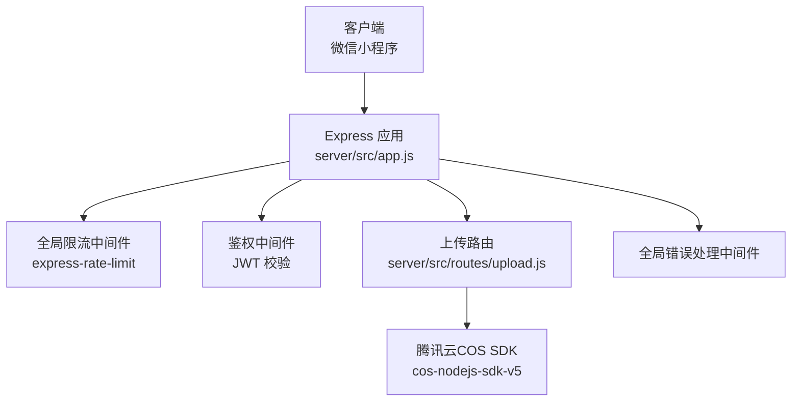
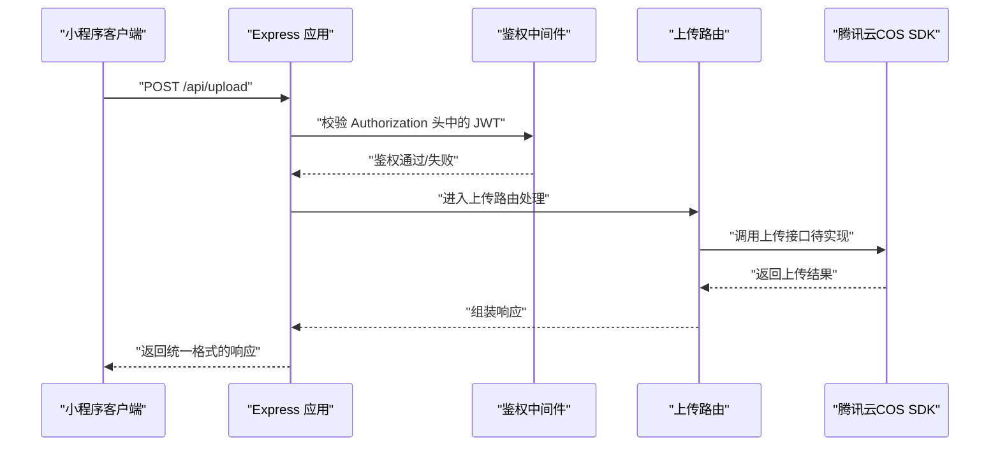
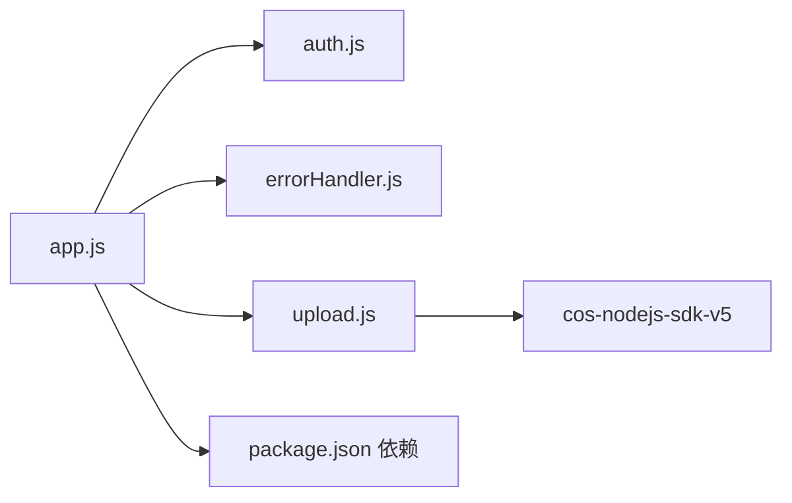

# 文件上传路由

<cite>
**本文引用的文件**
- [server/src/routes/upload.js](file://server/src/routes/upload.js)
- [server/src/middleware/auth.js](file://server/src/middleware/auth.js)
- [server/src/middleware/errorHandler.js](file://server/src/middleware/errorHandler.js)
- [server/src/app.js](file://server/src/app.js)
- [server/package.json](file://server/package.json)
- [miniprogram/utils/request.js](file://miniprogram/utils/request.js)
</cite>

## 目录
1. [简介](#简介)
2. [项目结构](#项目结构)
3. [核心组件](#核心组件)
4. [架构总览](#架构总览)
5. [详细组件分析](#详细组件分析)
6. [依赖关系分析](#依赖关系分析)
7. [性能考虑](#性能考虑)
8. [故障排查指南](#故障排查指南)
9. [结论](#结论)
10. [附录](#附录)

## 简介
本技术文档聚焦于“文件上传服务路由”的设计与实现，覆盖以下关键点：
- 路由设计与控制流：POST /api/upload 单文件上传、POST /api/upload/batch 批量上传的接口规划与鉴权接入
- 腾讯云COS集成：SDK依赖与后续实现要点
- 文件类型验证与安全策略：基于中间件与参数校验的防护思路
- 存储管理：命名规则、权限控制、防盗链与CDN加速的配置建议
- 前端上传示例与后端处理流程：基于现有请求封装与路由结构的对接方案
- 常见问题与解决方案：鉴权失败、限流触发、COS上传异常等

当前仓库中，上传路由文件已存在但尚未实现具体逻辑；本文在不直接展示代码的前提下，提供完整的设计与实现指导，并标注相关源码位置以便追溯。

## 项目结构
后端采用 Express 应用，统一通过 app.js 注册路由与中间件；上传路由位于 server/src/routes/upload.js，并通过 app.js 在 /api/upload 下挂载，同时应用全局鉴权中间件。

图表来源
- [server/src/app.js:14-55](file://server/src/app.js#L14-L55)
- [server/src/routes/upload.js:1-10](file://server/src/routes/upload.js#L1-L10)
- [server/package.json:14-25](file://server/package.json#L14-L25)

章节来源
- [server/src/app.js:14-55](file://server/src/app.js#L14-L55)
- [server/src/routes/upload.js:1-10](file://server/src/routes/upload.js#L1-L10)
- [server/package.json:14-25](file://server/package.json#L14-L25)

## 核心组件
- 上传路由模块：负责接收上传请求、进行基础校验与转发至业务处理层
- 鉴权中间件：从请求头提取并验证 JWT，确保只有登录用户可访问上传接口
- 全局错误处理：统一捕获并格式化错误响应
- Express 应用：注册路由、中间件与健康检查端点

章节来源
- [server/src/routes/upload.js:1-10](file://server/src/routes/upload.js#L1-L10)
- [server/src/middleware/auth.js:1-29](file://server/src/middleware/auth.js#L1-L29)
- [server/src/middleware/errorHandler.js:1-52](file://server/src/middleware/errorHandler.js#L1-L52)
- [server/src/app.js:14-55](file://server/src/app.js#L14-L55)

## 架构总览
下图展示了从客户端发起上传请求到后端路由处理的关键交互流程，以及与腾讯云COS的集成位置。

图表来源
- [server/src/app.js:46](file://server/src/app.js#L46)
- [server/src/middleware/auth.js:7-26](file://server/src/middleware/auth.js#L7-L26)
- [server/src/routes/upload.js:5-7](file://server/src/routes/upload.js#L5-L7)
- [server/package.json:17](file://server/package.json#L17)

## 详细组件分析

### 上传路由模块（server/src/routes/upload.js）
- 当前状态：仅声明路由占位，返回“功能待实现”提示
- 后续扩展方向：
  - 引入 multer 或类似的多部分字段处理库，用于接收文件流
  - 对文件类型、大小进行白名单/黑名单校验
  - 生成安全的文件名（避免碰撞与路径穿越），建议使用 UUID 或时间戳+随机数
  - 调用腾讯云COS SDK 将文件写入指定 Bucket
  - 返回标准化响应（包含访问链接、文件标识等）

章节来源
- [server/src/routes/upload.js:1-10](file://server/src/routes/upload.js#L1-L10)

### 鉴权中间件（server/src/middleware/auth.js）
- 功能：从 Authorization 头提取 Bearer Token，使用 JWT_SECRET 验证签名
- 行为：
  - 缺失或格式不正确时返回 401
  - 解析成功则将用户信息注入 req.user，继续后续处理
  - 过期或无效令牌分别返回相应错误码
- 与上传路由配合：通过 app.js 在 /api/upload 上启用鉴权中间件

章节来源
- [server/src/middleware/auth.js:1-29](file://server/src/middleware/auth.js#L1-L29)
- [server/src/app.js:46](file://server/src/app.js#L46)

### 全局错误处理（server/src/middleware/errorHandler.js）
- 功能：统一捕获未处理异常，区分 Prisma 错误、自定义业务错误与未知错误
- 输出：固定响应结构 { code, message }，开发环境暴露详细错误，生产环境隐藏
- 与上传路由配合：即使上传过程中出现异常，也能保证统一的错误输出格式

章节来源
- [server/src/middleware/errorHandler.js:1-52](file://server/src/middleware/errorHandler.js#L1-L52)

### Express 应用入口（server/src/app.js）
- 全局中间件：CORS、JSON 解析、URL 编码解析
- 全局限流：对 /api/ 路由前缀进行速率限制
- 路由注册：将 /api/upload 挂载到上传路由模块，并应用鉴权中间件
- 健康检查：/api/health 提供服务可用性检测

章节来源
- [server/src/app.js:14-55](file://server/src/app.js#L14-L55)

### 前端请求封装（miniprogram/utils/request.js）
- 统一管理 BASE_URL、自动注入 Authorization 头
- 成功/失败分支处理，业务错误码识别与 Toast 提示
- 可直接复用该封装向 /api/upload 发起上传请求（需在小程序端选择文件并构造 multipart/form-data）

章节来源
- [miniprogram/utils/request.js:11-97](file://miniprogram/utils/request.js#L11-L97)

## 依赖关系分析
- 上传路由依赖：
  - 鉴权中间件：确保接口访问安全
  - 全局错误处理：保证异常统一输出
  - 腾讯云COS SDK：用于对象存储上传
- Express 应用依赖：
  - CORS、速率限制、路由模块
  - dotenv：读取环境变量（如 JWT_SECRET、COS 配置）

图表来源
- [server/src/app.js:33-55](file://server/src/app.js#L33-L55)
- [server/package.json:14-25](file://server/package.json#L14-L25)

章节来源
- [server/src/app.js:33-55](file://server/src/app.js#L33-L55)
- [server/package.json:14-25](file://server/package.json#L14-L25)

## 性能考虑
- 速率限制：全局限流已在 /api/ 前缀生效，建议根据业务峰值调整窗口与阈值
- 文件大小与并发：上传接口应限制单文件大小与并发数量，防止资源耗尽
- CDN 加速：COS 上传完成后返回的访问链接可结合 CDN 域名使用，提升静态资源分发效率
- 缓存策略：对于非敏感元数据，可在边缘节点缓存短时间以降低回源压力

## 故障排查指南
- 鉴权失败（401）
  - 检查 Authorization 头是否为 Bearer Token 格式
  - 确认 JWT_SECRET 是否正确配置
  - 核对 token 是否过期
- 请求过于频繁（429）
  - 检查客户端重试策略与服务端限流配置
- 上传接口未实现
  - 当前路由返回“功能待实现”，需按后续扩展方向完善
- CORS 问题
  - 确认服务端已启用 CORS 中间件
- 未知错误
  - 查看全局错误处理输出的 code/message，结合日志定位

章节来源
- [server/src/middleware/auth.js:10-25](file://server/src/middleware/auth.js#L10-L25)
- [server/src/middleware/errorHandler.js:6-39](file://server/src/middleware/errorHandler.js#L6-L39)
- [server/src/app.js:19-25](file://server/src/app.js#L19-L25)
- [server/src/routes/upload.js:5-7](file://server/src/routes/upload.js#L5-L7)

## 结论
- 当前上传路由处于占位阶段，已具备鉴权与统一错误处理的基础能力
- 后续实现重点在于：文件类型与大小校验、安全命名策略、COS SDK 集成与标准化响应
- 建议优先完成单文件上传接口，再扩展批量上传与分片上传能力
- 前端可基于现有请求封装快速对接，注意构造正确的 multipart/form-data

## 附录

### 接口设计与实现建议
- POST /api/upload
  - 输入：multipart/form-data，字段名为 file
  - 校验：文件类型白名单、大小上限、鉴权
  - 处理：生成安全文件名，调用 COS SDK 上传，返回访问链接与文件标识
- POST /api/upload/batch
  - 输入：数组形式的多个文件字段
  - 处理：逐个校验与上传，聚合结果返回

章节来源
- [server/src/routes/upload.js:1-10](file://server/src/routes/upload.js#L1-L10)
- [server/src/middleware/auth.js:7-26](file://server/src/middleware/auth.js#L7-L26)

### 腾讯云COS集成要点
- 依赖：cos-nodejs-sdk-v5
- 配置：Bucket、Region、密钥等通过环境变量注入
- 上传策略：建议开启服务端加密、设置访问权限（私有/公有读）、启用防盗链与 Referer 白名单
- CDN 加速：上传完成后使用带 CDN 域名的访问链接，结合缓存头优化性能

章节来源
- [server/package.json:17](file://server/package.json#L17)

### 前端上传示例（小程序）
- 使用现有请求封装，构造 multipart/form-data 并携带 Authorization 头
- 选择文件后调用上传接口，处理返回的 code/message 与业务数据

章节来源
- [miniprogram/utils/request.js:21-97](file://miniprogram/utils/request.js#L21-L97)