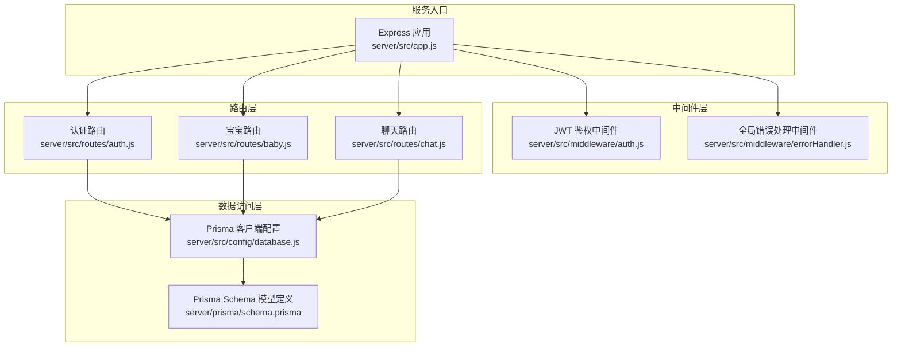
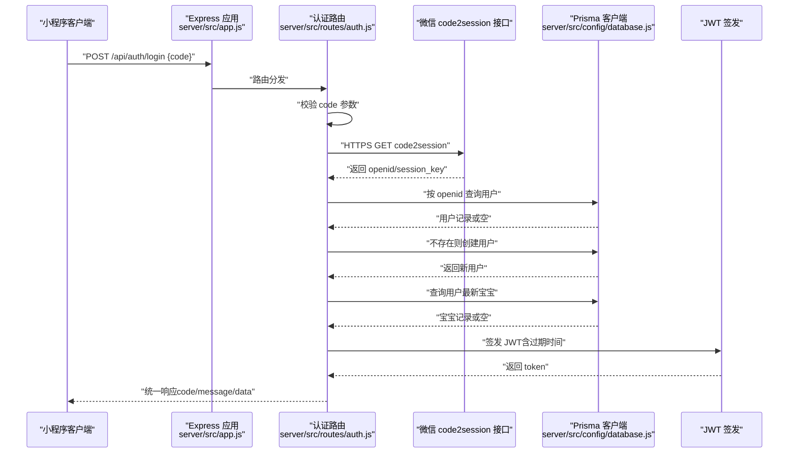
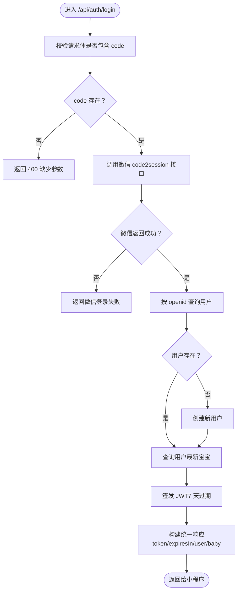
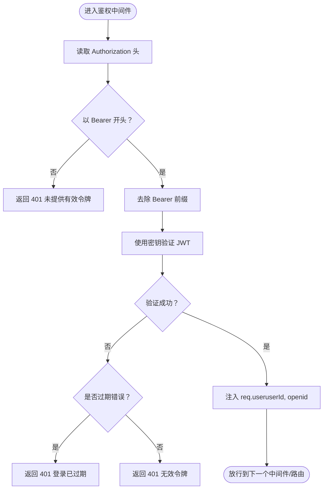
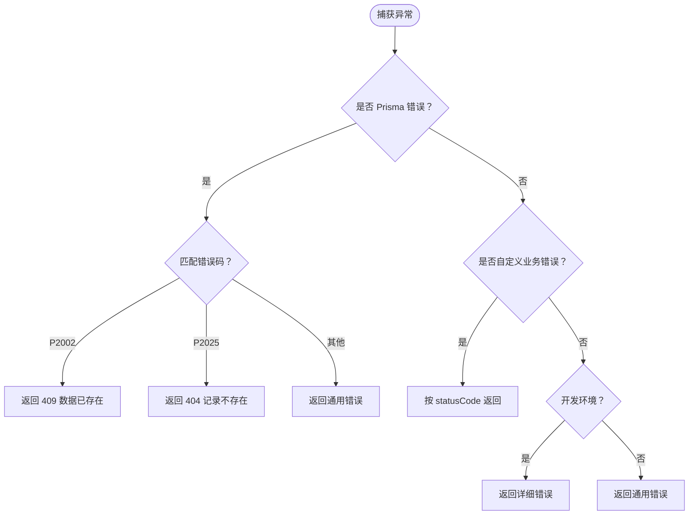
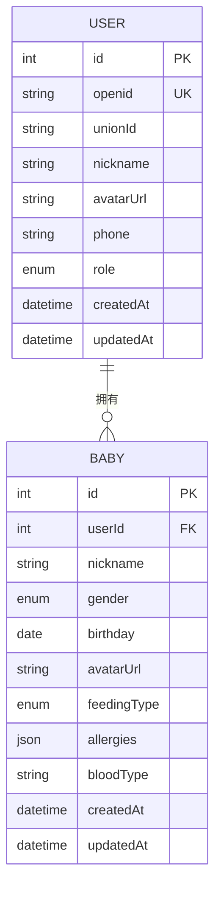
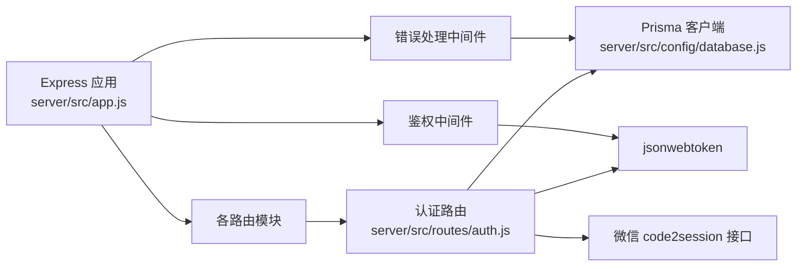

# 用户认证路由

<cite>
**本文档引用的文件**
- [server/src/routes/auth.js](file://server/src/routes/auth.js)
- [server/src/middleware/auth.js](file://server/src/middleware/auth.js)
- [server/src/middleware/errorHandler.js](file://server/src/middleware/errorHandler.js)
- [server/src/app.js](file://server/src/app.js)
- [server/src/config/database.js](file://server/src/config/database.js)
- [server/prisma/schema.prisma](file://server/prisma/schema.prisma)
- [server/package.json](file://server/package.json)
</cite>

## 目录
1. [简介](#简介)
2. [项目结构](#项目结构)
3. [核心组件](#核心组件)
4. [架构总览](#架构总览)
5. [详细组件分析](#详细组件分析)
6. [依赖关系分析](#依赖关系分析)
7. [性能考量](#性能考量)
8. [故障排查指南](#故障排查指南)
9. [结论](#结论)
10. [附录](#附录)

## 简介
本文件聚焦于用户认证路由的实现与扩展，特别是微信小程序登录流程的完整链路：从客户端传入的 code 参数校验，到调用微信 code2session 接口获取 openid，再到本地用户查找/创建、用户与宝宝信息关联、JWT 令牌签发与返回。文档同时覆盖错误处理机制、参数验证规则与安全注意事项，并提供调试指南与最佳实践建议。

## 项目结构
后端采用 Express 应用，通过路由模块化组织业务功能；认证相关的核心文件位于 server/src 下，数据库访问通过 Prisma 客户端统一管理；全局中间件负责 CORS、JSON 解析、限流、鉴权与错误处理。

图表来源
- [server/src/app.js:1-65](file://server/src/app.js#L1-L65)
- [server/src/routes/auth.js:1-84](file://server/src/routes/auth.js#L1-L84)
- [server/src/middleware/auth.js:1-29](file://server/src/middleware/auth.js#L1-L29)
- [server/src/middleware/errorHandler.js:1-52](file://server/src/middleware/errorHandler.js#L1-L52)
- [server/src/config/database.js:1-17](file://server/src/config/database.js#L1-L17)
- [server/prisma/schema.prisma:1-189](file://server/prisma/schema.prisma#L1-L189)

章节来源
- [server/src/app.js:1-65](file://server/src/app.js#L1-L65)
- [server/src/routes/auth.js:1-84](file://server/src/routes/auth.js#L1-L84)
- [server/src/middleware/auth.js:1-29](file://server/src/middleware/auth.js#L1-L29)
- [server/src/middleware/errorHandler.js:1-52](file://server/src/middleware/errorHandler.js#L1-L52)
- [server/src/config/database.js:1-17](file://server/src/config/database.js#L1-L17)
- [server/prisma/schema.prisma:1-189](file://server/prisma/schema.prisma#L1-L189)

## 核心组件
- 认证路由（POST /api/auth/login）
  - 参数校验：要求 body 中包含 code 字段
  - 微信接口调用：使用 Node 内置 https 模块调用微信 code2session
  - 用户与宝宝信息处理：按 openid 查找用户，不存在则创建；查询最新宝宝信息
  - JWT 令牌生成：基于用户标识签发带过期时间的 token
  - 返回结构：统一状态码与消息体，包含 token、过期时间、用户与宝宝信息
- JWT 鉴权中间件
  - 从 Authorization 请求头中提取 Bearer token
  - 使用密钥验证并解码，注入 req.user（包含 userId 与 openid），放行后续路由
  - 对过期与无效 token 分别返回 401
- 全局错误处理中间件
  - 统一捕获未处理异常，支持 Prisma 已知错误码与自定义业务错误
  - 开发环境输出详细错误，生产环境返回通用错误信息
- 数据库与模型
  - Prisma 客户端单例管理，按需开启开发日志
  - 用户与宝宝模型定义，包含关键字段与索引

章节来源
- [server/src/routes/auth.js:10-81](file://server/src/routes/auth.js#L10-L81)
- [server/src/middleware/auth.js:7-26](file://server/src/middleware/auth.js#L7-L26)
- [server/src/middleware/errorHandler.js:6-39](file://server/src/middleware/errorHandler.js#L6-L39)
- [server/src/config/database.js:7-14](file://server/src/config/database.js#L7-L14)
- [server/prisma/schema.prisma:14-60](file://server/prisma/schema.prisma#L14-L60)

## 架构总览
下图展示从客户端发起登录请求到返回 JWT 的完整序列：

图表来源
- [server/src/app.js:32-47](file://server/src/app.js#L32-L47)
- [server/src/routes/auth.js:10-81](file://server/src/routes/auth.js#L10-L81)
- [server/src/config/database.js:7-14](file://server/src/config/database.js#L7-L14)

## 详细组件分析

### 认证路由 POST /api/auth/login
- 功能概述
  - 接收小程序前端传入的 code，调用微信 code2session 获取 openid
  - 在本地数据库中查找或创建用户，读取该用户最新的宝宝信息
  - 生成 JWT 并返回 token、过期时间以及用户与宝宝信息
- 关键流程与处理逻辑
  - 参数校验：若缺失 code，直接返回错误响应
  - 微信接口调用：构造 HTTPS 请求，收集响应数据并解析 JSON
  - 错误处理：当微信返回错误码时，返回对应错误信息
  - 用户与宝宝：按 openid 查找用户，不存在则创建；查询用户最新宝宝
  - JWT 签发：以用户标识与 openid 作为载荷，设置 7 天过期
  - 统一响应：返回标准结构，包含 token、过期时间与用户/宝宝信息
- 安全与健壮性
  - 仅在成功路径返回 token，避免泄露
  - 对微信接口调用进行错误码判断
  - 使用数据库事务与 Prisma 客户端保证一致性（可选增强）

图表来源
- [server/src/routes/auth.js:10-81](file://server/src/routes/auth.js#L10-L81)

章节来源
- [server/src/routes/auth.js:10-81](file://server/src/routes/auth.js#L10-L81)

### JWT 鉴权中间件
- 功能概述
  - 从 Authorization 请求头提取 Bearer token
  - 使用密钥验证并解码，将用户标识注入到 req.user
  - 对过期与无效 token 进行分类处理并返回 401
- 关键行为
  - 必须以 Bearer 前缀携带 token
  - 解码成功后放行，否则根据错误类型返回不同 401 消息

图表来源
- [server/src/middleware/auth.js:7-26](file://server/src/middleware/auth.js#L7-L26)

章节来源
- [server/src/middleware/auth.js:7-26](file://server/src/middleware/auth.js#L7-L26)

### 全局错误处理中间件
- 功能概述
  - 捕获未处理异常，统一格式化响应
  - 支持 Prisma 已知错误码（如唯一约束冲突、记录不存在）
  - 支持自定义业务错误（AppError）
  - 开发环境输出详细错误，生产环境返回通用错误信息

图表来源
- [server/src/middleware/errorHandler.js:6-39](file://server/src/middleware/errorHandler.js#L6-L39)

章节来源
- [server/src/middleware/errorHandler.js:6-39](file://server/src/middleware/errorHandler.js#L6-L39)

### 数据模型与数据库交互
- 用户模型（User）
  - 关键字段：openid（唯一）、nickname、avatarUrl、role、createdAt/updatedAt
  - 与宝宝模型一对多关联
- 宝宝模型（Baby）
  - 关键字段：userId（外键）、nickname、gender、birthday、feedingType、allergies、bloodType、createdAt/updatedAt
  - 与用户模型多对一关联
- 访问方式
  - 通过 Prisma 客户端进行查询与写入
  - 服务启动时初始化 Prisma 客户端，开发模式下开启日志

图表来源
- [server/prisma/schema.prisma:14-60](file://server/prisma/schema.prisma#L14-L60)
- [server/src/config/database.js:7-14](file://server/src/config/database.js#L7-L14)

章节来源
- [server/prisma/schema.prisma:14-60](file://server/prisma/schema.prisma#L14-L60)
- [server/src/config/database.js:7-14](file://server/src/config/database.js#L7-L14)

## 依赖关系分析
- Express 应用
  - 注册路由：认证、宝宝、成长、知识、聊天、上传、首页等
  - 注册中间件：CORS、JSON 解析、限流、鉴权、错误处理
- 认证路由依赖
  - 微信接口调用（Node https）
  - Prisma 客户端（用户与宝宝查询/创建）
  - JWT 签发（jsonwebtoken）
- 中间件依赖
  - 鉴权中间件依赖 JWT 密钥
  - 错误处理中间件依赖 Prisma 错误码与 AppError 类

图表来源
- [server/src/app.js:32-55](file://server/src/app.js#L32-L55)
- [server/src/routes/auth.js:1-84](file://server/src/routes/auth.js#L1-L84)
- [server/src/middleware/auth.js:1-29](file://server/src/middleware/auth.js#L1-L29)
- [server/src/middleware/errorHandler.js:1-52](file://server/src/middleware/errorHandler.js#L1-L52)
- [server/src/config/database.js:1-17](file://server/src/config/database.js#L1-L17)
- [server/package.json:14-29](file://server/package.json#L14-L29)

章节来源
- [server/src/app.js:32-55](file://server/src/app.js#L32-L55)
- [server/src/routes/auth.js:1-84](file://server/src/routes/auth.js#L1-L84)
- [server/src/middleware/auth.js:1-29](file://server/src/middleware/auth.js#L1-L29)
- [server/src/middleware/errorHandler.js:1-52](file://server/src/middleware/errorHandler.js#L1-L52)
- [server/src/config/database.js:1-17](file://server/src/config/database.js#L1-L17)
- [server/package.json:14-29](file://server/package.json#L14-L29)

## 性能考量
- 限流策略
  - 全局限流：每分钟最多 60 次请求，降低暴力尝试风险并保护下游微信接口
- 数据库访问
  - openid 唯一索引与普通索引有助于加速查询
  - 建议在高并发场景下启用连接池与数据库优化
- 外部接口
  - 微信 code2session 属于第三方接口，建议增加超时与重试策略（可选）
- JWT 过期
  - 令牌默认 7 天过期，建议客户端妥善存储并在过期前刷新

## 故障排查指南
- 常见问题与定位
  - 缺少 code 参数：认证路由会直接返回 400
  - 微信登录失败：微信接口返回错误码时会返回对应错误信息
  - 令牌无效或过期：鉴权中间件返回 401，区分过期与无效
  - Prisma 唯一约束冲突：全局错误处理返回 409
  - 记录不存在：全局错误处理返回 404
- 调试步骤
  - 检查环境变量：确保 WX_APPID、WX_SECRET、JWT_SECRET、DATABASE_URL 正确
  - 开启开发日志：Prisma 在开发模式下输出查询、错误与警告
  - 观察限流：若频繁触发 429，检查客户端调用频率
  - 核对数据库：确认用户表与宝宝表结构一致，索引存在
- 建议
  - 在开发环境使用更短的过期时间便于测试
  - 对微信接口调用增加超时与重试，提升稳定性
  - 对敏感操作（如删除、修改）增加二次确认与审计日志

章节来源
- [server/src/routes/auth.js:13-30](file://server/src/routes/auth.js#L13-L30)
- [server/src/middleware/auth.js:21-25](file://server/src/middleware/auth.js#L21-L25)
- [server/src/middleware/errorHandler.js:10-23](file://server/src/middleware/errorHandler.js#L10-L23)
- [server/src/config/database.js:8](file://server/src/config/database.js#L8)

## 结论
本认证路由实现了微信小程序登录的完整闭环：参数校验、微信接口调用、用户与宝宝信息处理、JWT 签发与统一响应。配合全局中间件与错误处理，系统具备良好的安全性与可维护性。建议在生产环境中进一步完善外部接口的超时与重试、令牌刷新策略与审计日志，以提升用户体验与系统稳定性。

## 附录
- 环境变量与配置要点
  - 微信小程序：WX_APPID、WX_SECRET
  - JWT：JWT_SECRET
  - 数据库：DATABASE_URL（MySQL）
- 依赖包概览
  - Express、CORS、限流、Prisma、JWT、OpenAI、Redis 等

章节来源
- [server/package.json:14-29](file://server/package.json#L14-L29)
- [server/src/config/database.js:7-14](file://server/src/config/database.js#L7-L14)