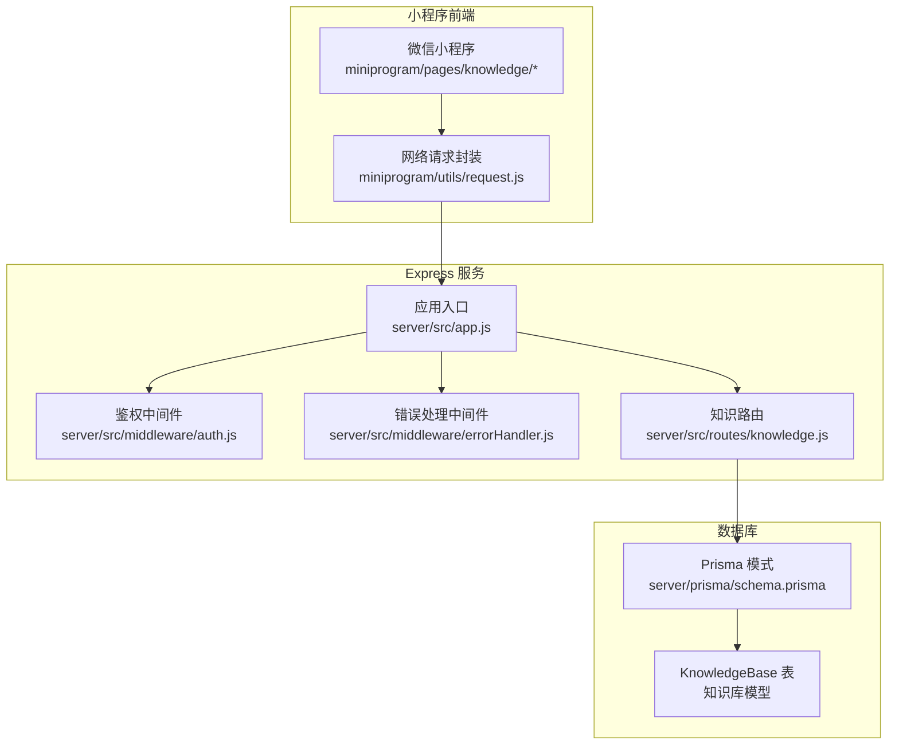
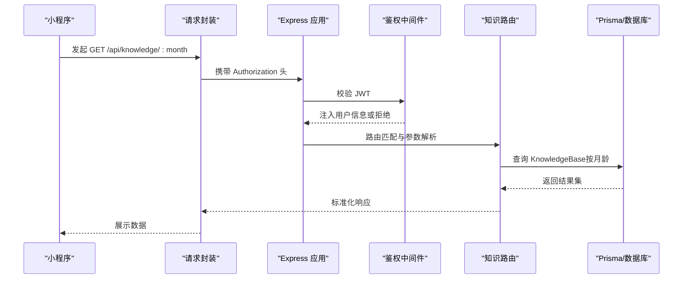
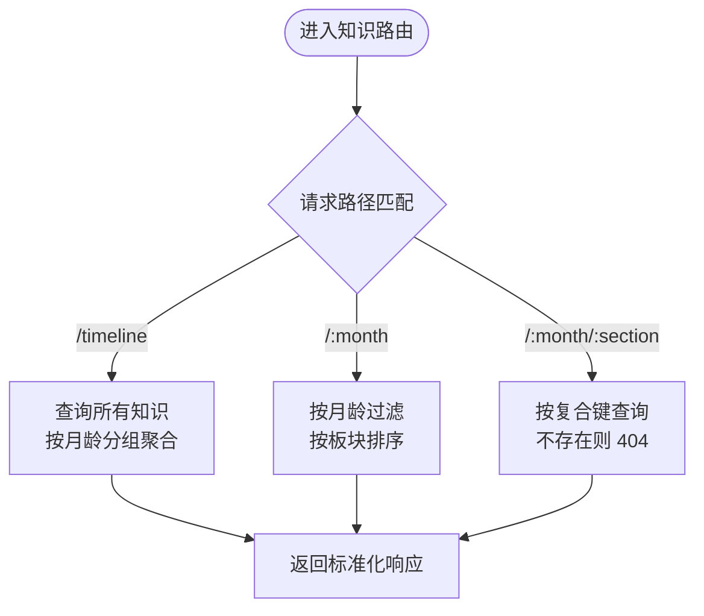
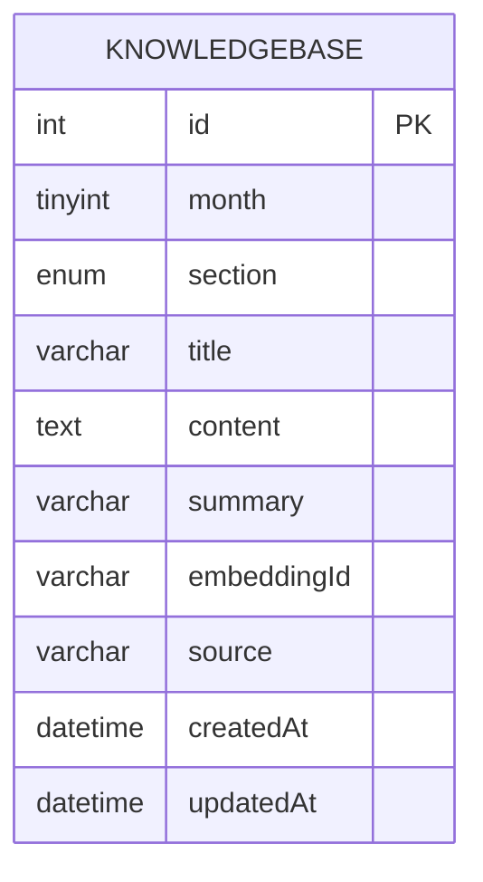
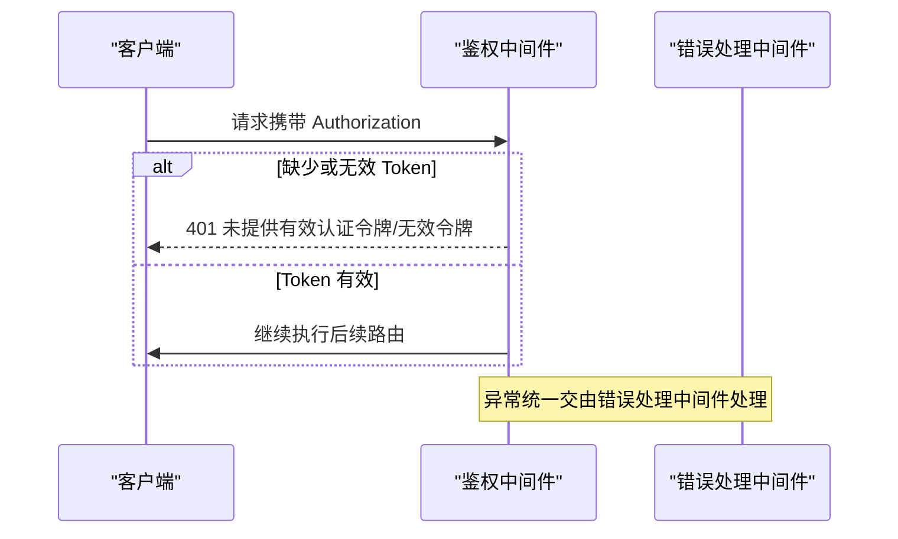
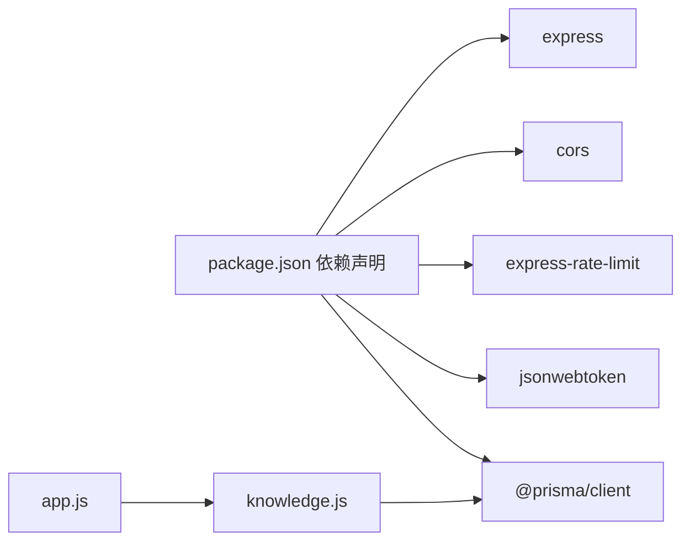

# 知识百科路由

<cite>
**本文档引用的文件**
- [knowledge.js](file://server/src/routes/knowledge.js)
- [app.js](file://server/src/app.js)
- [schema.prisma](file://server/prisma/schema.prisma)
- [auth.js](file://server/src/middleware/auth.js)
- [errorHandler.js](file://server/src/middleware/errorHandler.js)
- [request.js](file://miniprogram/utils/request.js)
- [package.json](file://server/package.json)
</cite>

## 目录
1. [简介](#简介)
2. [项目结构](#项目结构)
3. [核心组件](#核心组件)
4. [架构总览](#架构总览)
5. [详细组件分析](#详细组件分析)
6. [依赖关系分析](#依赖关系分析)
7. [性能考虑](#性能考虑)
8. [故障排除指南](#故障排除指南)
9. [结论](#结论)

## 简介
本文件面向知识百科系统（育儿知识库）的路由技术文档，聚焦于以下接口与设计目标：
- 按月龄获取知识：GET /api/knowledge/:month
- 获取某月某板块知识：GET /api/knowledge/:month/:section
- 月龄概览时间线：GET /api/knowledge/timeline
- 分类枚举：GET /api/knowledge/categories（当前路由未实现，需补充）
- 推荐算法接口：POST /api/knowledge/recommend（当前路由未实现，需补充）
- 搜索功能：GET /api/knowledge/search（当前路由未实现，需补充）

同时，文档将深入解析现有路由的实现逻辑、数据模型映射、鉴权与错误处理机制，并给出知识内容管理、索引优化与个性化推荐的路由设计建议。

## 项目结构
后端采用 Express 应用，路由集中于 server/src/routes 目录，数据库使用 Prisma 管理，知识库模型为 KnowledgeBase，包含月龄、板块、标题、内容、摘要、向量嵌入标识等字段。

图表来源
- [app.js:32-47](file://server/src/app.js#L32-L47)
- [knowledge.js:1-59](file://server/src/routes/knowledge.js#L1-L59)
- [schema.prisma:144-159](file://server/prisma/schema.prisma#L144-L159)
- [auth.js:1-29](file://server/src/middleware/auth.js#L1-L29)
- [errorHandler.js:1-52](file://server/src/middleware/errorHandler.js#L1-L52)
- [request.js](file://miniprogram/utils/request.js#L11)

章节来源
- [app.js:32-47](file://server/src/app.js#L32-L47)
- [knowledge.js:1-59](file://server/src/routes/knowledge.js#L1-L59)
- [schema.prisma:144-159](file://server/prisma/schema.prisma#L144-L159)

## 核心组件
- 知识路由模块：提供按月龄、按板块、时间线概览的知识查询接口，直接对接 Prisma 的 KnowledgeBase 模型。
- 应用入口：注册全局中间件（CORS、限流、JSON 解析）、路由挂载与统一 404/错误处理。
- 数据模型：KnowledgeBase 包含唯一复合键（month, section），支持按月龄与板块检索；新增 embeddingId 字段用于向量化检索与推荐。
- 鉴权中间件：从 Authorization 头部提取 Bearer Token，校验通过后注入用户信息到请求上下文。
- 错误处理：统一捕获 Prisma 已知错误码与自定义业务错误，返回标准化响应。

章节来源
- [knowledge.js:1-59](file://server/src/routes/knowledge.js#L1-L59)
- [app.js:14-55](file://server/src/app.js#L14-L55)
- [schema.prisma:144-159](file://server/prisma/schema.prisma#L144-L159)
- [auth.js:7-26](file://server/src/middleware/auth.js#L7-L26)
- [errorHandler.js:6-39](file://server/src/middleware/errorHandler.js#L6-L39)

## 架构总览
下图展示知识路由在整体系统中的位置与调用链路：

图表来源
- [request.js:21-73](file://miniprogram/utils/request.js#L21-L73)
- [app.js:32-47](file://server/src/app.js#L32-L47)
- [auth.js:7-26](file://server/src/middleware/auth.js#L7-L26)
- [knowledge.js:28-40](file://server/src/routes/knowledge.js#L28-L40)
- [schema.prisma:144-159](file://server/prisma/schema.prisma#L144-L159)

## 详细组件分析

### 现有知识路由接口
- GET /api/knowledge/timeline
  - 功能：获取 0-12 月龄的知识概览，按月龄升序排列，输出每月份的板块与标题列表。
  - 实现要点：查询 KnowledgeBase 的 month、section、title、summary 字段，按月龄分组聚合。
  - 响应结构：包含 code、message、data（数组，每项含 month、sections）。
  - 章节来源
    - [knowledge.js:5-26](file://server/src/routes/knowledge.js#L5-L26)

- GET /api/knowledge/:month
  - 功能：获取指定月龄的所有知识条目。
  - 实现要点：解析路径参数 month，按月龄过滤并按板块升序排序。
  - 响应结构：包含 code、message、data（知识条目数组）。
  - 章节来源
    - [knowledge.js:28-40](file://server/src/routes/knowledge.js#L28-L40)

- GET /api/knowledge/:month/:section
  - 功能：获取某月某板块的唯一知识条目。
  - 实现要点：使用复合唯一键 {month, section} 查询；若不存在返回 404。
  - 响应结构：包含 code、message、data（单条知识）。
  - 章节来源
    - [knowledge.js:42-56](file://server/src/routes/knowledge.js#L42-L56)

图表来源
- [knowledge.js:5-56](file://server/src/routes/knowledge.js#L5-L56)

章节来源
- [knowledge.js:5-56](file://server/src/routes/knowledge.js#L5-L56)

### 数据模型与索引
- KnowledgeBase 模型
  - 关键字段：month（TinyInt）、section（枚举）、title、content、summary、embeddingId、source。
  - 唯一键：(month, section)，确保每月份每个板块仅有一条记录。
  - 章节来源
    - [schema.prisma:144-159](file://server/prisma/schema.prisma#L144-L159)

- 索引与优化建议
  - 当前已有唯一索引覆盖 (month, section)，适合按月龄+板块的精确查询。
  - 建议为 month 单独建立索引以优化按月龄范围查询。
  - 建议为 embeddingId 建立索引以支持向量化检索与推荐。
  - 章节来源
    - [schema.prisma:157-158](file://server/prisma/schema.prisma#L157-L158)

图表来源
- [schema.prisma:144-159](file://server/prisma/schema.prisma#L144-L159)

### 鉴权与错误处理
- 鉴权中间件
  - 从 Authorization 头提取 Bearer Token，校验失败时返回 401。
  - 校验通过后将用户信息注入 req.user，供后续路由使用。
  - 章节来源
    - [auth.js:7-26](file://server/src/middleware/auth.js#L7-L26)

- 错误处理中间件
  - 统一捕获 Prisma 错误码（如唯一约束冲突、记录不存在）。
  - 支持自定义业务错误（AppError）。
  - 未知错误返回 500 并在生产环境隐藏具体错误信息。
  - 章节来源
    - [errorHandler.js:6-39](file://server/src/middleware/errorHandler.js#L6-L39)

图表来源
- [auth.js:7-26](file://server/src/middleware/auth.js#L7-L26)
- [errorHandler.js:6-39](file://server/src/middleware/errorHandler.js#L6-L39)

## 依赖关系分析
- Express 应用依赖
  - CORS、限流中间件、JSON 解析、路由模块、全局错误处理。
  - 章节来源
    - [app.js:14-55](file://server/src/app.js#L14-L55)
    - [package.json:14-25](file://server/package.json#L14-L25)

- 路由依赖
  - 知识路由依赖数据库配置与 Prisma 客户端。
  - 章节来源
    - [knowledge.js:1-3](file://server/src/routes/knowledge.js#L1-L3)

图表来源
- [package.json:14-25](file://server/package.json#L14-L25)
- [app.js:32-47](file://server/src/app.js#L32-L47)
- [knowledge.js:1-3](file://server/src/routes/knowledge.js#L1-L3)

章节来源
- [package.json:14-25](file://server/package.json#L14-L25)
- [app.js:32-47](file://server/src/app.js#L32-L47)
- [knowledge.js:1-3](file://server/src/routes/knowledge.js#L1-L3)

## 性能考虑
- 查询性能
  - 使用复合唯一键 (month, section) 可确保按板块精确查询高效。
  - 建议对 month 单独建立索引，以优化按月龄范围查询与分页场景。
- 响应优化
  - timeline 接口仅返回必要字段（month、section、title、summary），减少传输体积。
  - 建议对 content 字段进行懒加载或分页，避免大文本一次性传输。
- 缓存策略
  - 对高频访问的 timeline 与按月列表可引入 Redis 缓存，设置合理 TTL。
- 限流与安全
  - 全局限流已在 /api/ 前缀启用，防止滥用。
  - 鉴权中间件确保敏感操作受保护。
- 章节来源
  - [knowledge.js:5-26](file://server/src/routes/knowledge.js#L5-L26)
  - [schema.prisma:157-158](file://server/prisma/schema.prisma#L157-L158)
  - [app.js:19-25](file://server/src/app.js#L19-L25)

## 故障排除指南
- 常见问题与定位
  - 401 未授权：检查 Authorization 头是否为 Bearer Token，确认 JWT 是否过期。
  - 404 记录不存在：确认请求的 (month, section) 是否存在于数据库。
  - 409 唯一约束冲突：尝试更新而非重复插入同一 (month, section)。
  - 500 服务器内部错误：查看服务端日志，确认 Prisma 查询与数据库连接状态。
- 建议排查步骤
  - 小程序端：确认 BASE_URL 与 token 注入正确。
  - 服务端：检查路由挂载顺序、中间件执行顺序与 Prisma 客户端初始化。
- 章节来源
  - [errorHandler.js:10-23](file://server/src/middleware/errorHandler.js#L10-L23)
  - [auth.js:10-25](file://server/src/middleware/auth.js#L10-L25)
  - [request.js:21-73](file://miniprogram/utils/request.js#L21-L73)

## 结论
现有知识路由已实现按月龄与板块的基础查询能力，配合 Prisma 的复合唯一键与 Express 的中间件体系，提供了清晰的鉴权与错误处理机制。为满足知识百科系统的完整需求，建议补充以下接口与能力：
- GET /api/knowledge/categories：返回 KnowledgeSection 枚举值，便于前端选择与筛选。
- GET /api/knowledge/search：基于关键词与摘要/标题的全文检索，结合 embeddingId 支持语义搜索。
- POST /api/knowledge/recommend：根据用户画像与 embedding 向量相似度生成个性化推荐。
- 索引优化：为 month、embeddingId 建立索引，提升查询与推荐性能。
- 缓存策略：对热点数据进行缓存，降低数据库压力。

这些扩展将使知识百科系统在功能完整性、性能表现与用户体验方面得到显著提升。