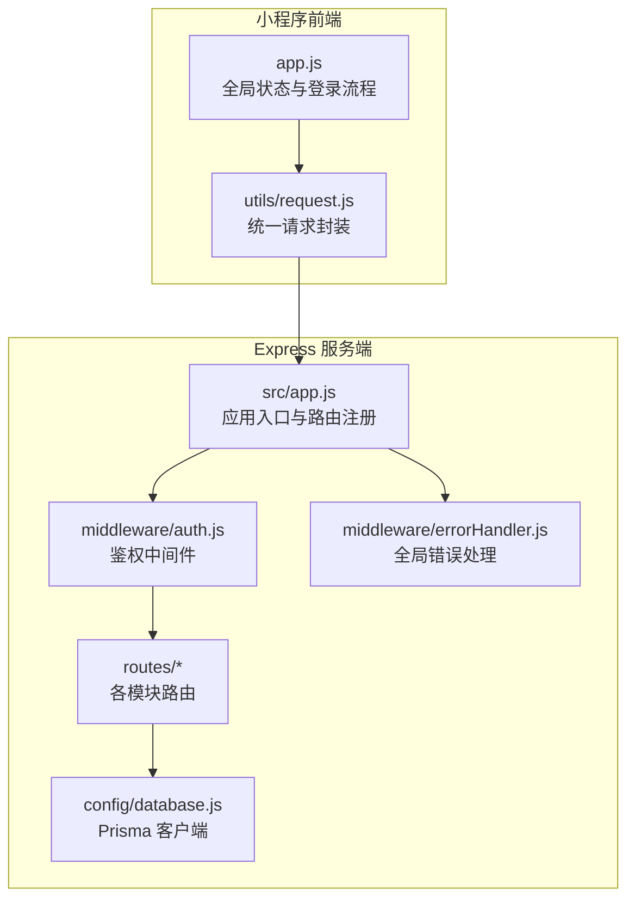
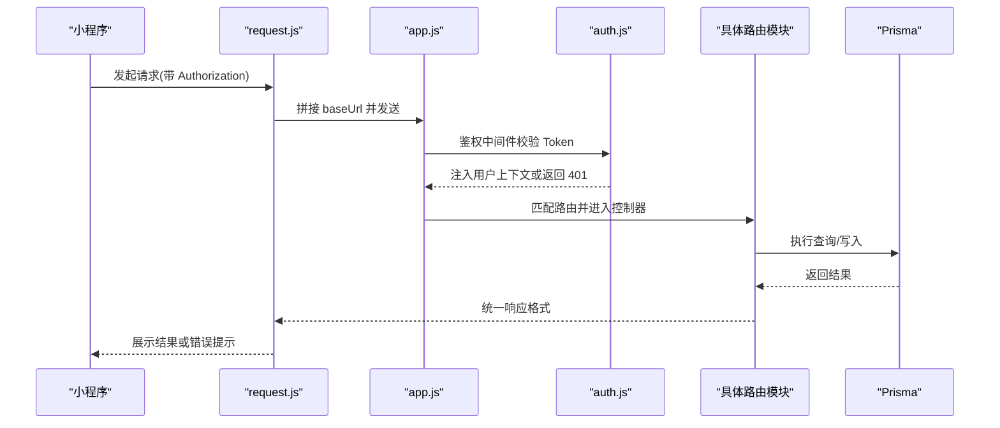
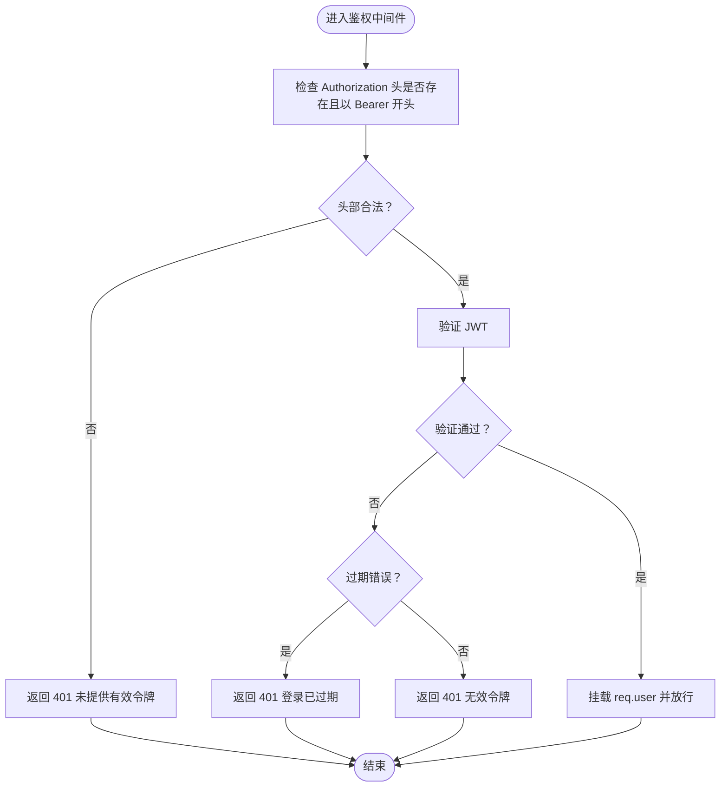
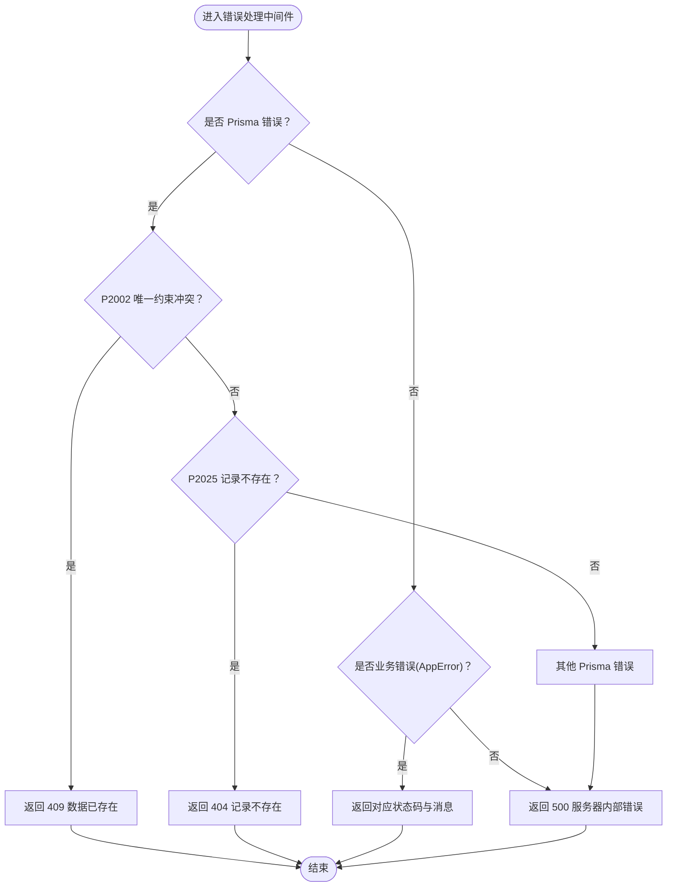
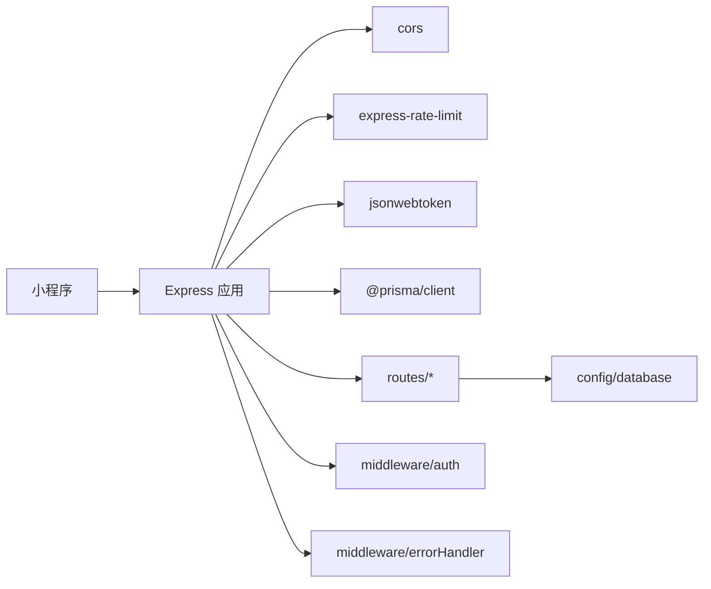

# 路由与控制器模式

<cite>
**本文引用的文件**
- [server/src/app.js](file://server/src/app.js)
- [server/src/middleware/auth.js](file://server/src/middleware/auth.js)
- [server/src/middleware/errorHandler.js](file://server/src/middleware/errorHandler.js)
- [server/src/routes/auth.js](file://server/src/routes/auth.js)
- [server/src/routes/baby.js](file://server/src/routes/baby.js)
- [server/src/routes/growth.js](file://server/src/routes/growth.js)
- [server/src/routes/knowledge.js](file://server/src/routes/knowledge.js)
- [server/src/routes/chat.js](file://server/src/routes/chat.js)
- [server/src/routes/upload.js](file://server/src/routes/upload.js)
- [server/src/routes/home.js](file://server/src/routes/home.js)
- [server/src/config/database.js](file://server/src/config/database.js)
- [server/prisma/schema.prisma](file://server/prisma/schema.prisma)
- [server/package.json](file://server/package.json)
- [miniprogram/app.js](file://miniprogram/app.js)
- [miniprogram/utils/request.js](file://miniprogram/utils/request.js)
</cite>

## 目录
1. [引言](#引言)
2. [项目结构](#项目结构)
3. [核心组件](#核心组件)
4. [架构总览](#架构总览)
5. [详细组件分析](#详细组件分析)
6. [依赖关系分析](#依赖关系分析)
7. [性能考虑](#性能考虑)
8. [故障排查指南](#故障排查指南)
9. [结论](#结论)
10. [附录](#附录)

## 引言
本文件系统性梳理“路由与控制器模式”的实现与最佳实践，结合项目现有代码，围绕以下主题展开：
- RESTful 路由设计原则与 HTTP 方法映射
- 参数处理机制：路由参数、查询参数、请求体参数
- 控制器层职责划分、业务逻辑封装、数据验证与响应格式化
- 错误处理策略与统一响应格式
- API 版本管理与演进建议
- 路由组织结构与代码组织模式指导

## 项目结构
后端采用 Express 应用，按“路由-中间件-服务/数据访问”分层组织；前端为微信小程序，通过统一请求封装调用后端 API。

图表来源
- [server/src/app.js:1-65](file://server/src/app.js#L1-L65)
- [server/src/middleware/auth.js:1-29](file://server/src/middleware/auth.js#L1-L29)
- [server/src/middleware/errorHandler.js:1-52](file://server/src/middleware/errorHandler.js#L1-L52)
- [server/src/config/database.js:1-17](file://server/src/config/database.js#L1-L17)

章节来源
- [server/src/app.js:1-65](file://server/src/app.js#L1-L65)
- [server/package.json:1-31](file://server/package.json#L1-L31)

## 核心组件
- 应用入口与中间件
  - 全局中间件：CORS、JSON 解析、URL 编码解析、限流
  - 健康检查端点
  - 路由注册与 404 处理
  - 全局错误处理
- 鉴权中间件：从 Authorization 头部提取 Bearer Token，校验并注入用户上下文
- 错误处理中间件：统一捕获 Prisma 错误、业务错误与未知错误，输出一致的响应格式
- 数据访问：Prisma 客户端单例，开发环境下开启查询日志
- 路由模块：按领域拆分（认证、宝宝、成长记录、知识库、聊天、上传、首页）

章节来源
- [server/src/app.js:14-55](file://server/src/app.js#L14-L55)
- [server/src/middleware/auth.js:7-26](file://server/src/middleware/auth.js#L7-L26)
- [server/src/middleware/errorHandler.js:6-39](file://server/src/middleware/errorHandler.js#L6-L39)
- [server/src/config/database.js:7-14](file://server/src/config/database.js#L7-L14)

## 架构总览
下图展示从前端请求到后端路由、中间件、业务处理与数据库的完整链路。

图表来源
- [miniprogram/utils/request.js:21-73](file://miniprogram/utils/request.js#L21-L73)
- [server/src/app.js:32-55](file://server/src/app.js#L32-L55)
- [server/src/middleware/auth.js:7-26](file://server/src/middleware/auth.js#L7-L26)
- [server/src/config/database.js:7-14](file://server/src/config/database.js#L7-L14)

## 详细组件分析

### 鉴权中间件（auth.js）
- 职责：从请求头提取 Bearer Token，验证 JWT，失败时返回 401
- 关键点：对过期与无效令牌分别处理，成功则将用户信息挂载到 req.user
- 与路由组合：通过 app.js 在受保护路由前启用

图表来源
- [server/src/middleware/auth.js:7-26](file://server/src/middleware/auth.js#L7-L26)

章节来源
- [server/src/middleware/auth.js:1-29](file://server/src/middleware/auth.js#L1-L29)

### 全局错误处理（errorHandler.js）
- 职责：统一捕获 Prisma 已知错误（如唯一约束冲突、记录不存在）、业务错误与未知错误
- 输出：统一响应格式，开发环境暴露错误细节，生产环境隐藏细节
- 业务错误：通过 AppError 抛出，携带状态码

图表来源
- [server/src/middleware/errorHandler.js:6-39](file://server/src/middleware/errorHandler.js#L6-L39)

章节来源
- [server/src/middleware/errorHandler.js:1-52](file://server/src/middleware/errorHandler.js#L1-L52)

### 认证路由（auth.js）
- 设计原则：RESTful 路径 /api/auth/login，使用 POST 映射登录动作
- 参数处理：从请求体读取 code，调用微信接口换取 openid/session_key
- 业务逻辑：查找/创建用户，选择最新宝宝，签发 JWT
- 响应格式：统一响应结构，包含 token、过期时间与用户/宝宝信息

章节来源
- [server/src/routes/auth.js:10-81](file://server/src/routes/auth.js#L10-L81)

### 宝宝路由（baby.js）
- 设计原则：RESTful 资源 /api/babies，支持增删改查
- 参数处理：
  - 新增：请求体字段校验（昵称、性别、出生日期）
  - 查询详情：路由参数 id，同时校验用户归属
  - 更新：部分字段更新，使用条件过滤避免越权
- 响应格式：统一响应结构，计算并返回月龄与天数

章节来源
- [server/src/routes/baby.js:9-32](file://server/src/routes/baby.js#L9-L32)
- [server/src/routes/baby.js:37-69](file://server/src/routes/baby.js#L37-L69)
- [server/src/routes/baby.js:74-97](file://server/src/routes/baby.js#L74-L97)

### 成长记录路由（growth.js）
- 设计原则：RESTful 路径 /api/babies/:babyId/records，资源嵌套体现父子关系
- 参数处理：
  - 路由参数 babyId：用于关联宝宝与权限校验
  - 查询参数：type、page、pageSize
  - 请求体：type、recordDate、data、note、images、tags
- 业务逻辑：计算月龄与日龄，分页查询与总数统计
- 响应格式：统一响应结构，返回分页数据

章节来源
- [server/src/routes/growth.js:7-44](file://server/src/routes/growth.js#L7-L44)
- [server/src/routes/growth.js:47-73](file://server/src/routes/growth.js#L47-L73)
- [server/src/routes/growth.js:76-86](file://server/src/routes/growth.js#L76-L86)
- [server/src/routes/growth.js:89-105](file://server/src/routes/growth.js#L89-L105)
- [server/src/routes/growth.js:108-115](file://server/src/routes/growth.js#L108-L115)

### 知识库路由（knowledge.js）
- 设计原则：RESTful 路径 /api/knowledge，支持时间线与按月/板块查询
- 参数处理：路由参数 month、section；查询参数可扩展
- 业务逻辑：按月龄聚合知识条目，支持按月与按板块检索
- 响应格式：统一响应结构

章节来源
- [server/src/routes/knowledge.js:5-26](file://server/src/routes/knowledge.js#L5-L26)
- [server/src/routes/knowledge.js:28-40](file://server/src/routes/knowledge.js#L28-L40)
- [server/src/routes/knowledge.js:42-56](file://server/src/routes/knowledge.js#L42-L56)

### 聊天路由（chat.js）
- 设计原则：RESTful 路径 /api/chat，支持对话列表、详情与删除
- 参数处理：路由参数 id；查询参数可扩展
- 业务逻辑：按用户维度查询对话，支持分页与排序
- 响应格式：统一响应结构

章节来源
- [server/src/routes/chat.js:14-26](file://server/src/routes/chat.js#L14-L26)
- [server/src/routes/chat.js:28-42](file://server/src/routes/chat.js#L28-L42)
- [server/src/routes/chat.js:44-54](file://server/src/routes/chat.js#L44-L54)

### 首页聚合路由（home.js）
- 设计原则：RESTful 路径 /api/home/dashboard，聚合首页所需数据
- 参数处理：无参数
- 业务逻辑：获取最新宝宝、计算月龄与天数、查询最新身高体重、按月龄匹配知识摘要
- 响应格式：统一响应结构

章节来源
- [server/src/routes/home.js:5-59](file://server/src/routes/home.js#L5-L59)

### 上传路由（upload.js）
- 设计原则：RESTful 路径 /api/upload/image，预留上传接口
- 当前实现：占位返回提示信息，后续接入对象存储

章节来源
- [server/src/routes/upload.js:4-7](file://server/src/routes/upload.js#L4-L7)

### 健康检查与路由注册（app.js）
- 健康检查：GET /api/health
- 路由注册：按模块注册，部分路由在前启用鉴权中间件
- 404 与全局错误处理：未匹配路由返回 404，最后注册全局错误处理中间件

章节来源
- [server/src/app.js:28-55](file://server/src/app.js#L28-L55)

### 数据模型与关系（Prisma schema）
- 用户、宝宝、成长记录、对话、消息、知识库、收藏等模型
- 关系：一对多/多对一、唯一索引、复合唯一索引
- 字段：枚举类型（性别、喂养方式、记录类型、消息角色、知识板块、角色、收藏类型）

章节来源
- [server/prisma/schema.prisma:14-189](file://server/prisma/schema.prisma#L14-L189)

### 前端集成与调用（小程序）
- 登录流程：小程序登录获取 code，调用后端 /api/auth/login 获取 token
- 请求封装：统一设置 Content-Type 与 Authorization，统一封装错误处理与加载提示
- Token 过期：收到业务 401 时清理本地缓存并重新登录

章节来源
- [miniprogram/app.js:18-67](file://miniprogram/app.js#L18-L67)
- [miniprogram/utils/request.js:21-73](file://miniprogram/utils/request.js#L21-L73)

## 依赖关系分析
- Express 应用依赖 CORS、速率限制、JWT、Prisma 客户端
- 路由模块依赖数据库客户端与错误处理工具
- 鉴权中间件依赖 JWT 验证
- 前端依赖后端提供的统一响应格式与鉴权头

图表来源
- [server/package.json:14-25](file://server/package.json#L14-L25)
- [server/src/app.js:15-25](file://server/src/app.js#L15-L25)
- [server/src/middleware/auth.js:5](file://server/src/middleware/auth.js#L5)
- [server/src/middleware/errorHandler.js:1-52](file://server/src/middleware/errorHandler.js#L1-L52)
- [server/src/config/database.js:5-9](file://server/src/config/database.js#L5-L9)

章节来源
- [server/package.json:1-31](file://server/package.json#L1-L31)

## 性能考虑
- 限流：全局每 IP 每分钟最多 60 次请求，防止滥用
- 分页：成长记录列表使用分页查询与总数统计，避免一次性返回大量数据
- 日志：开发环境开启 Prisma 查询日志，便于定位慢查询
- 建议：
  - 对高频查询增加缓存（如 Redis），减少数据库压力
  - 对复杂聚合查询（首页 dashboard）进行预计算或物化视图
  - 使用数据库索引优化常用查询（如按用户、按宝宝、按时间范围）

章节来源
- [server/src/app.js:20-25](file://server/src/app.js#L20-L25)
- [server/src/routes/growth.js:55-63](file://server/src/routes/growth.js#L55-L63)
- [server/src/config/database.js:7-9](file://server/src/config/database.js#L7-L9)

## 故障排查指南
- 401 未授权
  - 检查前端是否正确携带 Authorization: Bearer Token
  - 检查后端鉴权中间件是否生效
- 404 接口不存在
  - 检查路由是否正确注册，路径是否匹配
- 404/409 数据异常
  - Prisma 错误：唯一约束冲突或记录不存在，检查输入与索引
- 业务错误
  - 使用 AppError 抛出，检查状态码与消息
- 服务器内部错误
  - 生产环境隐藏细节，开发环境查看控制台日志

章节来源
- [server/src/middleware/errorHandler.js:9-39](file://server/src/middleware/errorHandler.js#L9-L39)
- [server/src/app.js:49-52](file://server/src/app.js#L49-L52)

## 结论
本项目在 Express 上实现了清晰的路由与控制器模式，配合鉴权中间件与统一错误处理，形成稳定的 RESTful API。通过按领域拆分路由模块、统一响应格式与参数处理规范，提升了可维护性与扩展性。建议后续引入 API 版本管理、参数校验中间件、缓存与索引优化，以进一步提升性能与稳定性。

## 附录

### RESTful 路由与 HTTP 方法映射清单
- 认证
  - POST /api/auth/login
- 宝宝
  - POST /api/babies
  - GET /api/babies/:id
  - PUT /api/babies/:id
- 成长记录
  - POST /api/babies/:babyId/records
  - GET /api/babies/:babyId/records
  - GET /api/babies/:babyId/records/:id
  - PUT /api/babies/:babyId/records/:id
  - DELETE /api/babies/:babyId/records/:id
- 知识库
  - GET /api/knowledge/timeline
  - GET /api/knowledge/:month
  - GET /api/knowledge/:month/:section
- 聊天
  - POST /api/chat/send
  - GET /api/chat/conversations
  - GET /api/chat/conversations/:id
  - DELETE /api/chat/conversations/:id
- 上传
  - POST /api/upload/image
- 首页
  - GET /api/home/dashboard
- 其他
  - GET /api/health

章节来源
- [server/src/routes/auth.js:10](file://server/src/routes/auth.js#L10)
- [server/src/routes/baby.js:9](file://server/src/routes/baby.js#L9)
- [server/src/routes/baby.js:37](file://server/src/routes/baby.js#L37)
- [server/src/routes/baby.js:74](file://server/src/routes/baby.js#L74)
- [server/src/routes/growth.js:7](file://server/src/routes/growth.js#L7)
- [server/src/routes/growth.js:47](file://server/src/routes/growth.js#L47)
- [server/src/routes/growth.js:76](file://server/src/routes/growth.js#L76)
- [server/src/routes/growth.js:89](file://server/src/routes/growth.js#L89)
- [server/src/routes/growth.js:108](file://server/src/routes/growth.js#L108)
- [server/src/routes/knowledge.js:5](file://server/src/routes/knowledge.js#L5)
- [server/src/routes/knowledge.js:28](file://server/src/routes/knowledge.js#L28)
- [server/src/routes/knowledge.js:42](file://server/src/routes/knowledge.js#L42)
- [server/src/routes/chat.js:6](file://server/src/routes/chat.js#L6)
- [server/src/routes/chat.js:14](file://server/src/routes/chat.js#L14)
- [server/src/routes/chat.js:28](file://server/src/routes/chat.js#L28)
- [server/src/routes/chat.js:44](file://server/src/routes/chat.js#L44)
- [server/src/routes/upload.js:5](file://server/src/routes/upload.js#L5)
- [server/src/routes/home.js:5](file://server/src/routes/home.js#L5)
- [server/src/app.js:28](file://server/src/app.js#L28)

### 参数处理机制
- 路由参数：从 req.params 读取（如 :id、:babyId、:month、:section）
- 查询参数：从 req.query 读取（如 page、pageSize、type）
- 请求体参数：从 req.body 读取（如登录 code、新增/更新字段）

章节来源
- [server/src/routes/growth.js:50](file://server/src/routes/growth.js#L50)
- [server/src/routes/baby.js:11](file://server/src/routes/baby.js#L11)
- [server/src/routes/auth.js:12](file://server/src/routes/auth.js#L12)

### 统一响应格式
- 字段：code、message、data（可选）
- 状态码：遵循 HTTP 语义与业务错误码
- 示例路径：认证登录、宝宝增删改查、成长记录 CRUD、知识库查询、聊天与首页聚合

章节来源
- [server/src/routes/auth.js:56](file://server/src/routes/auth.js#L56)
- [server/src/routes/baby.js:28](file://server/src/routes/baby.js#L28)
- [server/src/routes/baby.js:65](file://server/src/routes/baby.js#L65)
- [server/src/routes/growth.js:40](file://server/src/routes/growth.js#L40)
- [server/src/routes/growth.js:65](file://server/src/routes/growth.js#L65)
- [server/src/routes/growth.js:82](file://server/src/routes/growth.js#L82)
- [server/src/routes/knowledge.js:22](file://server/src/routes/knowledge.js#L22)
- [server/src/routes/knowledge.js:36](file://server/src/routes/knowledge.js#L36)
- [server/src/routes/knowledge.js:52](file://server/src/routes/knowledge.js#L52)
- [server/src/routes/chat.js:22](file://server/src/routes/chat.js#L22)
- [server/src/routes/chat.js:38](file://server/src/routes/chat.js#L38)
- [server/src/routes/home.js:55](file://server/src/routes/home.js#L55)

### API 版本管理建议
- 路径版本：/api/v1/... 或 /api/v2/...
- 头部版本：Accept: application/vnd.company.v1+json
- 迁移策略：先兼容旧版本，再逐步淘汰，保留过渡期
- 变更通知：通过变更日志与文档向客户端发布

[本节为概念性建议，不直接分析具体文件]

### 路由组织与代码组织模式
- 按领域拆分路由模块，职责单一
- 控制器内仅处理参数、调用服务/数据访问、返回统一响应
- 中间件集中处理跨域、限流、鉴权、错误处理
- 数据访问通过 Prisma 客户端统一管理

章节来源
- [server/src/app.js:32-47](file://server/src/app.js#L32-L47)
- [server/src/middleware/auth.js:7-26](file://server/src/middleware/auth.js#L7-L26)
- [server/src/middleware/errorHandler.js:6-39](file://server/src/middleware/errorHandler.js#L6-L39)
- [server/src/config/database.js:7-14](file://server/src/config/database.js#L7-L14)