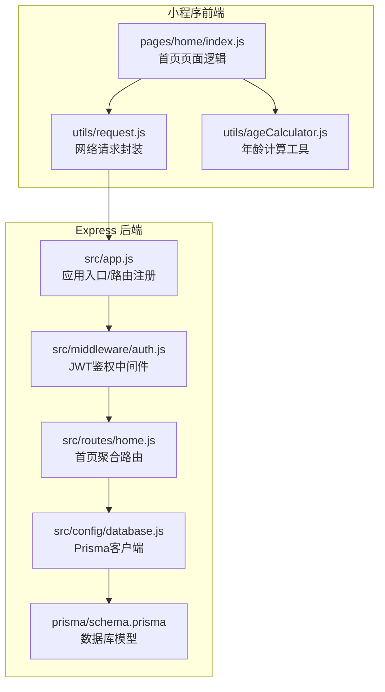
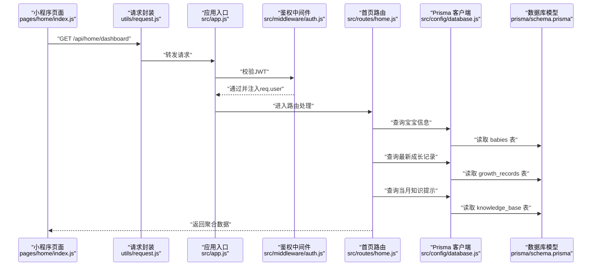
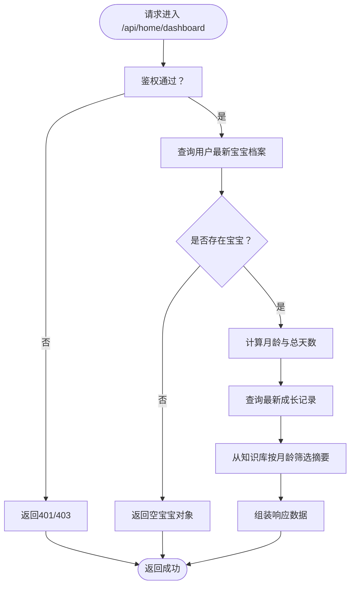
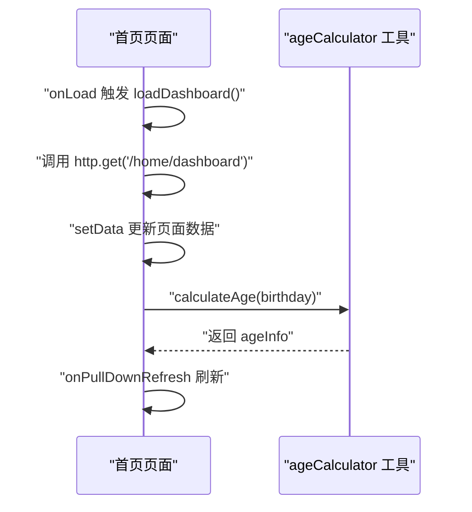
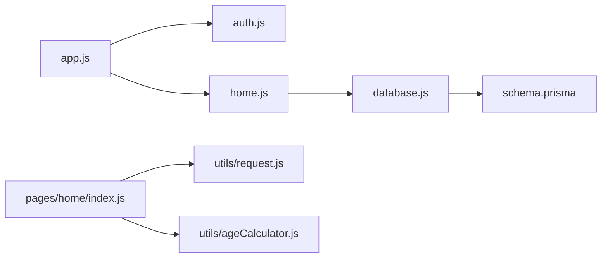

# 首页仪表板路由

<cite>
**本文档引用的文件**
- [server/src/routes/home.js](file://server/src/routes/home.js)
- [server/src/app.js](file://server/src/app.js)
- [server/src/middleware/auth.js](file://server/src/middleware/auth.js)
- [server/src/config/database.js](file://server/src/config/database.js)
- [server/prisma/schema.prisma](file://server/prisma/schema.prisma)
- [miniprogram/pages/home/index.js](file://miniprogram/pages/home/index.js)
- [miniprogram/utils/request.js](file://miniprogram/utils/request.js)
- [miniprogram/utils/ageCalculator.js](file://miniprogram/utils/ageCalculator.js)
- [server/src/routes/growth.js](file://server/src/routes/growth.js)
- [server/src/routes/knowledge.js](file://server/src/routes/knowledge.js)
</cite>

## 目录
1. [简介](#简介)
2. [项目结构](#项目结构)
3. [核心组件](#核心组件)
4. [架构总览](#架构总览)
5. [详细组件分析](#详细组件分析)
6. [依赖关系分析](#依赖关系分析)
7. [性能考虑](#性能考虑)
8. [故障排除指南](#故障排除指南)
9. [结论](#结论)

## 简介
本文件面向“首页仪表板路由”的技术实现，围绕以下目标展开：
- 解析首页聚合数据接口 GET /api/home/dashboard 的设计与实现
- 说明宝宝成长统计、近期记录汇总、知识推荐与 AI 助手快捷入口的数据来源与处理流程
- 总结数据聚合算法、缓存策略与性能优化方案
- 提供完整数据结构定义与使用示例路径

该实现采用前后端分离架构：前端微信小程序通过统一请求封装调用后端 Express 服务；后端通过 Prisma ORM 访问 MySQL 数据库，并在路由层完成数据聚合。

## 项目结构
首页仪表板涉及的关键模块与文件如下：
- 后端路由与服务
  - 路由：server/src/routes/home.js
  - 应用入口：server/src/app.js
  - 鉴权中间件：server/src/middleware/auth.js
  - 数据库配置：server/src/config/database.js
  - 数据模型：server/prisma/schema.prisma
  - 成长记录路由：server/src/routes/growth.js
  - 知识库路由：server/src/routes/knowledge.js
- 前端页面与工具
  - 首页逻辑：miniprogram/pages/home/index.js
  - 网络请求封装：miniprogram/utils/request.js
  - 年龄计算工具：miniprogram/utils/ageCalculator.js

图表来源
- [server/src/app.js:32-47](file://server/src/app.js#L32-L47)
- [server/src/routes/home.js:1-62](file://server/src/routes/home.js#L1-L62)
- [server/src/middleware/auth.js:1-29](file://server/src/middleware/auth.js#L1-L29)
- [server/src/config/database.js:1-17](file://server/src/config/database.js#L1-L17)
- [server/prisma/schema.prisma:1-189](file://server/prisma/schema.prisma#L1-L189)
- [miniprogram/pages/home/index.js:1-114](file://miniprogram/pages/home/index.js#L1-L114)
- [miniprogram/utils/request.js:1-97](file://miniprogram/utils/request.js#L1-L97)
- [miniprogram/utils/ageCalculator.js:1-86](file://miniprogram/utils/ageCalculator.js#L1-L86)

章节来源
- [server/src/app.js:32-47](file://server/src/app.js#L32-L47)
- [server/src/routes/home.js:1-62](file://server/src/routes/home.js#L1-L62)
- [server/src/middleware/auth.js:1-29](file://server/src/middleware/auth.js#L1-L29)
- [server/src/config/database.js:1-17](file://server/src/config/database.js#L1-L17)
- [server/prisma/schema.prisma:1-189](file://server/prisma/schema.prisma#L1-L189)
- [miniprogram/pages/home/index.js:1-114](file://miniprogram/pages/home/index.js#L1-L114)
- [miniprogram/utils/request.js:1-97](file://miniprogram/utils/request.js#L1-L97)
- [miniprogram/utils/ageCalculator.js:1-86](file://miniprogram/utils/ageCalculator.js#L1-L86)

## 核心组件
- 首页聚合路由：负责一次性返回首页所需的核心数据，包括宝宝基本信息、最新成长记录、当月发育提示以及预留的知识推荐位。
- 鉴权中间件：确保所有受保护的首页接口均需携带有效 JWT 令牌。
- 数据库模型：通过 Prisma 模型映射用户、宝宝、成长记录、知识库等实体，支撑首页聚合查询。
- 前端页面：负责调用首页聚合接口、渲染数据、提供下拉刷新与本地降级能力。

章节来源
- [server/src/routes/home.js:5-59](file://server/src/routes/home.js#L5-L59)
- [server/src/middleware/auth.js:7-26](file://server/src/middleware/auth.js#L7-L26)
- [server/prisma/schema.prisma:14-189](file://server/prisma/schema.prisma#L14-L189)
- [miniprogram/pages/home/index.js:46-71](file://miniprogram/pages/home/index.js#L46-L71)

## 架构总览
下面以序列图展示“首页聚合”接口的端到端调用链路，包括鉴权、数据聚合与响应。

图表来源
- [miniprogram/pages/home/index.js:46-71](file://miniprogram/pages/home/index.js#L46-L71)
- [miniprogram/utils/request.js:21-73](file://miniprogram/utils/request.js#L21-L73)
- [server/src/app.js:39-47](file://server/src/app.js#L39-L47)
- [server/src/middleware/auth.js:17-20](file://server/src/middleware/auth.js#L17-L20)
- [server/src/routes/home.js:9-34](file://server/src/routes/home.js#L9-L34)
- [server/src/config/database.js:5-9](file://server/src/config/database.js#L5-L9)
- [server/prisma/schema.prisma:40-94](file://server/prisma/schema.prisma#L40-L94)

## 详细组件分析

### 首页聚合接口 GET /api/home/dashboard
- 设计目标
  - 在单次请求中返回首页所需的核心数据，减少前端多次请求的开销。
  - 聚合内容包含：宝宝基本信息（含月龄与总天数）、最新成长记录、当月发育提示、预留知识推荐位。
- 关键步骤
  - 通过鉴权中间件获取当前用户上下文。
  - 查询用户最新的宝宝档案（按创建时间倒序取第一条）。
  - 计算月龄与总天数。
  - 查询最新成长记录（按记录日期倒序）。
  - 从知识库中筛选与当前月龄匹配的条目，提取摘要作为“当月提示”，限制数量。
  - 返回标准化响应结构。
- 数据结构
  - 响应体包含 code、message、data 字段；data 内容见“数据结构定义”小节。
- 错误处理
  - 当无宝宝档案时返回空宝宝对象，前端据此进行引导或降级。
  - 异常交由全局错误处理器处理。

图表来源
- [server/src/routes/home.js:6-59](file://server/src/routes/home.js#L6-L59)
- [server/src/middleware/auth.js:17-20](file://server/src/middleware/auth.js#L17-L20)

章节来源
- [server/src/routes/home.js:6-59](file://server/src/routes/home.js#L6-L59)

### 数据结构定义
- 响应体结构
  - code: 数字，0 表示成功
  - message: 字符串，状态描述
  - data: 对象，包含以下字段
    - baby: 宝宝信息对象
      - id: 整数
      - userId: 整数
      - nickname: 字符串
      - gender: 枚举值（male/female）
      - birthday: 字符串（YYYY-MM-DD）
      - avatarUrl: 字符串
      - feedingType: 枚举值（breast/formula/mixed）
      - allergies: JSON 或空
      - bloodType: 字符串 或空
      - createdAt/updatedAt: 时间戳
      - ageMonths: 数字（月龄）
      - totalDays: 数字（总天数）
    - latestGrowth: 最新成长记录数据（JSON），若无则为 null
    - monthTips: 字符串数组，长度不超过 5
    - recommendations: 预留字段，当前为空数组
- 使用示例路径
  - 小程序调用：参考 [miniprogram/pages/home/index.js:46-71](file://miniprogram/pages/home/index.js#L46-L71)
  - 前端渲染：参考 [miniprogram/pages/home/index.js:50-60](file://miniprogram/pages/home/index.js#L50-L60)

章节来源
- [server/src/routes/home.js:41-55](file://server/src/routes/home.js#L41-L55)
- [miniprogram/pages/home/index.js:46-71](file://miniprogram/pages/home/index.js#L46-L71)

### 前端集成与降级策略
- 页面生命周期
  - onLoad 时触发首页数据加载。
  - onShow 时从本地存储恢复宝宝信息并重新计算年龄。
  - onPullDownRefresh 支持下拉刷新，完成后停止刷新动画。
- 请求与错误处理
  - 通过统一请求封装发起 GET /api/home/dashboard。
  - 当请求失败时，尝试读取本地缓存的宝宝信息进行降级渲染。
- 年龄计算
  - 使用年龄计算工具对生日进行月龄/总天数计算，并生成友好文本。

图表来源
- [miniprogram/pages/home/index.js:24-82](file://miniprogram/pages/home/index.js#L24-L82)
- [miniprogram/utils/ageCalculator.js:7-41](file://miniprogram/utils/ageCalculator.js#L7-L41)

章节来源
- [miniprogram/pages/home/index.js:24-82](file://miniprogram/pages/home/index.js#L24-L82)
- [miniprogram/utils/ageCalculator.js:7-41](file://miniprogram/utils/ageCalculator.js#L7-L41)

### 数据聚合算法与缓存策略
- 聚合算法
  - 月龄计算：基于当前日期与出生日期的年差与月差，再结合日差修正。
  - 总天数：直接按毫秒差换算为天数。
  - 最新成长记录：按记录日期倒序取第一条。
  - 当月提示：按月龄筛选知识库摘要，取前若干条。
- 缓存策略
  - 前端本地缓存：将宝宝信息写入本地存储，在网络异常时可进行降级渲染。
  - 后端缓存：当前实现未引入 Redis/Memcached 等缓存层，建议后续针对热点查询（如知识库摘要）增加缓存。
- 性能优化建议
  - 合理索引：确保 babies(userId, createdAt)、growth_records(babyId, recordDate)、knowledge_base(month) 等查询条件具备索引支持。
  - 分页与限制：知识提示限制数量，避免返回过多数据。
  - 并行查询：未来可在聚合阶段使用 Promise.all 并行获取多源数据（当前已对部分查询使用并行）。

章节来源
- [server/src/routes/home.js:18-39](file://server/src/routes/home.js#L18-L39)
- [miniprogram/pages/home/index.js:64-70](file://miniprogram/pages/home/index.js#L64-L70)

### 与其他接口的关系
- 成长记录接口
  - 用于新增/查询/更新/删除成长记录，首页通过“最新成长记录”字段展示最近动态。
  - 参考：[server/src/routes/growth.js:6-118](file://server/src/routes/growth.js#L6-L118)
- 知识库接口
  - 用于获取 0-12 月龄概览与按月/按板块查询知识内容，首页通过“当月提示”字段展示摘要。
  - 参考：[server/src/routes/knowledge.js:5-59](file://server/src/routes/knowledge.js#L5-L59)

章节来源
- [server/src/routes/growth.js:6-118](file://server/src/routes/growth.js#L6-L118)
- [server/src/routes/knowledge.js:5-59](file://server/src/routes/knowledge.js#L5-L59)

## 依赖关系分析
- 路由依赖
  - /api/home/dashboard 依赖鉴权中间件与 Prisma 客户端。
  - 路由注册位于应用入口，统一挂载于 /api/home 下。
- 数据模型依赖
  - 首页聚合涉及 babies、growth_records、knowledge_base 三张表的关联查询。
- 前端依赖
  - 首页页面依赖请求封装与年龄计算工具；通过统一请求封装自动注入 Authorization 头。

图表来源
- [server/src/app.js:39-47](file://server/src/app.js#L39-L47)
- [server/src/middleware/auth.js:1-29](file://server/src/middleware/auth.js#L1-L29)
- [server/src/routes/home.js:1-62](file://server/src/routes/home.js#L1-L62)
- [server/src/config/database.js:1-17](file://server/src/config/database.js#L1-L17)
- [server/prisma/schema.prisma:1-189](file://server/prisma/schema.prisma#L1-L189)
- [miniprogram/pages/home/index.js:1-114](file://miniprogram/pages/home/index.js#L1-L114)
- [miniprogram/utils/request.js:1-97](file://miniprogram/utils/request.js#L1-L97)
- [miniprogram/utils/ageCalculator.js:1-86](file://miniprogram/utils/ageCalculator.js#L1-L86)

章节来源
- [server/src/app.js:39-47](file://server/src/app.js#L39-L47)
- [server/src/routes/home.js:1-62](file://server/src/routes/home.js#L1-L62)
- [server/src/config/database.js:1-17](file://server/src/config/database.js#L1-L17)
- [server/prisma/schema.prisma:1-189](file://server/prisma/schema.prisma#L1-L189)
- [miniprogram/pages/home/index.js:1-114](file://miniprogram/pages/home/index.js#L1-L114)
- [miniprogram/utils/request.js:1-97](file://miniprogram/utils/request.js#L1-L97)
- [miniprogram/utils/ageCalculator.js:1-86](file://miniprogram/utils/ageCalculator.js#L1-L86)

## 性能考虑
- 查询性能
  - 为高频查询字段建立合适索引，如 babies(userId, createdAt)、growth_records(babyId, recordDate)、knowledge_base(month)。
  - 控制返回数据量，如知识提示限制数量。
- 并发与资源
  - 使用 Promise.all 并行执行独立查询，减少串行等待。
  - 合理设置数据库连接池与超时时间，避免阻塞。
- 缓存与CDN
  - 对静态知识摘要等热点数据增加缓存层，降低数据库压力。
  - 前端本地缓存用于弱网或离线场景的降级展示。
- 监控与日志
  - 开发环境下开启 Prisma 查询日志，便于定位慢查询。
  - 结合限流中间件防止突发流量冲击。

[本节为通用性能建议，不直接分析具体文件]

## 故障排除指南
- 常见问题
  - 未提供有效认证令牌：鉴权中间件返回 401。
  - 登录过期：令牌过期时统一处理并触发重新登录。
  - 宝宝档案缺失：返回空宝宝对象，前端引导创建或选择宝宝。
  - 网络异常：前端读取本地缓存进行降级渲染。
- 排查步骤
  - 检查 Authorization 头是否正确传递 Bearer 令牌。
  - 确认用户与宝宝关系是否匹配，避免越权访问。
  - 查看 Prisma 日志定位慢查询或索引缺失问题。
  - 小程序端确认本地缓存是否正常写入与读取。

章节来源
- [server/src/middleware/auth.js:10-25](file://server/src/middleware/auth.js#L10-L25)
- [server/src/routes/home.js:14-16](file://server/src/routes/home.js#L14-L16)
- [miniprogram/pages/home/index.js:62-70](file://miniprogram/pages/home/index.js#L62-L70)
- [miniprogram/utils/request.js:48-56](file://miniprogram/utils/request.js#L48-L56)

## 结论
首页仪表板路由通过一次聚合请求整合了宝宝信息、成长记录与知识提示，配合前端本地缓存与降级策略，提供了稳定高效的用户体验。后续可在缓存、索引与并发查询方面进一步优化，以应对更高并发与更复杂的数据聚合需求。