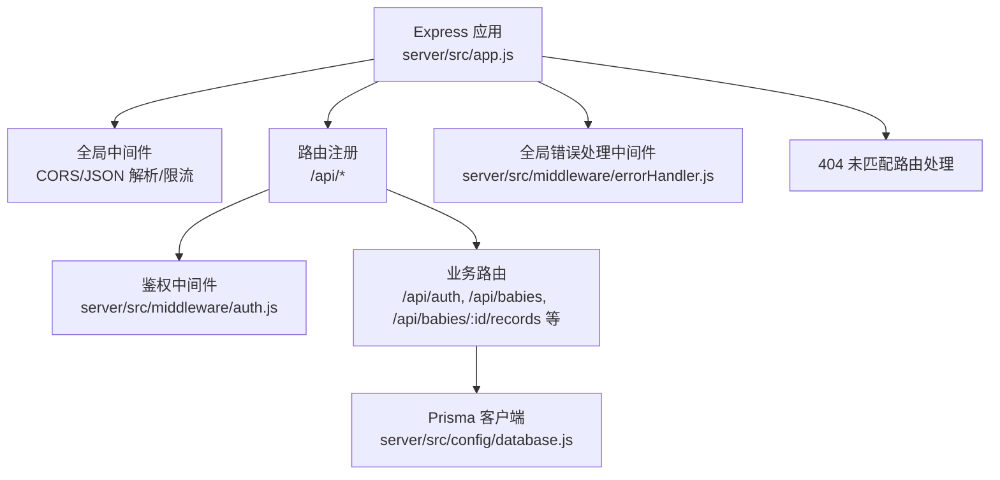
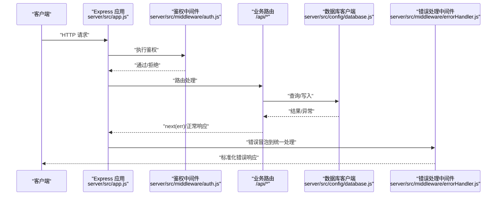
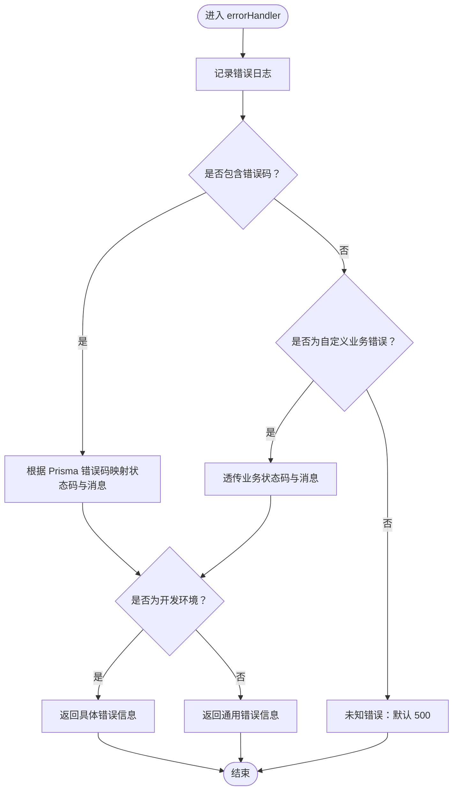
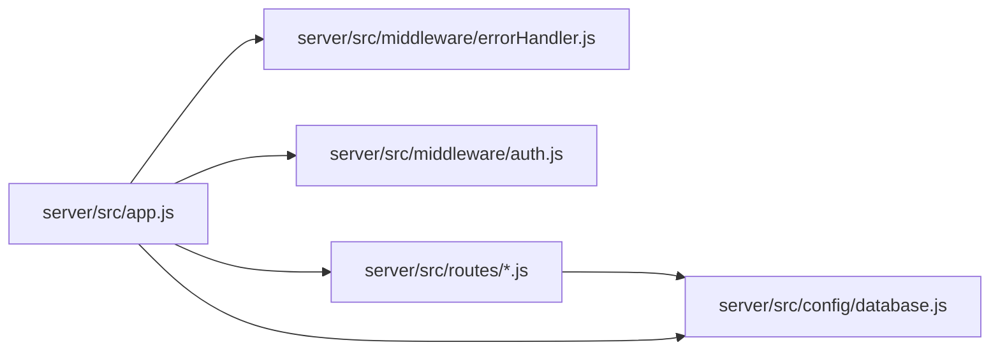

# 错误处理策略

<cite>
**本文引用的文件**
- [server/src/middleware/errorHandler.js](file://server/src/middleware/errorHandler.js)
- [server/src/app.js](file://server/src/app.js)
- [server/src/middleware/auth.js](file://server/src/middleware/auth.js)
- [server/src/config/database.js](file://server/src/config/database.js)
- [server/src/routes/auth.js](file://server/src/routes/auth.js)
- [server/src/routes/baby.js](file://server/src/routes/baby.js)
- [server/src/routes/growth.js](file://server/src/routes/growth.js)
- [server/package.json](file://server/package.json)
- [server/.env.example](file://server/.env.example)
</cite>

## 目录
1. [引言](#引言)
2. [项目结构](#项目结构)
3. [核心组件](#核心组件)
4. [架构总览](#架构总览)
5. [详细组件分析](#详细组件分析)
6. [依赖分析](#依赖分析)
7. [性能考虑](#性能考虑)
8. [故障排查指南](#故障排查指南)
9. [结论](#结论)
10. [附录](#附录)

## 引言
本文件系统性梳理并总结本项目的错误处理策略与实现，重点覆盖统一错误处理中间件的工作原理、错误分类与异常捕获机制、HTTP 状态码映射、错误消息格式化、敏感信息过滤、开发与生产环境差异策略、日志与监控建议、常见错误类型处理方案、调试技巧以及性能影响分析，并给出可落地的最佳实践与参考路径。

## 项目结构
后端基于 Express，采用“中间件 + 路由 + 服务层”的分层组织方式。错误处理策略贯穿于全局中间件、鉴权中间件、各业务路由以及数据库访问层，形成统一的错误捕获与响应规范。

图表来源
- [server/src/app.js:14-55](file://server/src/app.js#L14-L55)
- [server/src/middleware/auth.js:1-29](file://server/src/middleware/auth.js#L1-L29)
- [server/src/middleware/errorHandler.js:1-52](file://server/src/middleware/errorHandler.js#L1-L52)
- [server/src/config/database.js:1-17](file://server/src/config/database.js#L1-L17)

章节来源
- [server/src/app.js:14-55](file://server/src/app.js#L14-L55)
- [server/src/middleware/auth.js:1-29](file://server/src/middleware/auth.js#L1-L29)
- [server/src/middleware/errorHandler.js:1-52](file://server/src/middleware/errorHandler.js#L1-L52)
- [server/src/config/database.js:1-17](file://server/src/config/database.js#L1-L17)

## 核心组件
- 统一错误处理中间件：集中捕获未处理异常，区分 Prisma 已知错误、自定义业务错误与未知错误，统一输出标准化 JSON 响应。
- 自定义业务错误类：通过构造函数携带业务状态码，便于在业务层抛出并被统一中间件识别。
- 鉴权中间件：负责认证失败场景的标准化错误返回。
- 数据库客户端：根据环境配置开启日志级别，辅助定位问题。
- 健康检查与 404 处理：提供基础可用性检测与未匹配路由的统一响应。

章节来源
- [server/src/middleware/errorHandler.js:6-39](file://server/src/middleware/errorHandler.js#L6-L39)
- [server/src/middleware/errorHandler.js:44-49](file://server/src/middleware/errorHandler.js#L44-L49)
- [server/src/middleware/auth.js:7-26](file://server/src/middleware/auth.js#L7-L26)
- [server/src/config/database.js:7-9](file://server/src/config/database.js#L7-L9)
- [server/src/app.js:27-52](file://server/src/app.js#L27-L52)

## 架构总览
下图展示从请求进入至错误处理的整体流程，包括鉴权、路由处理、数据库访问以及错误冒泡与统一处理的关键节点。

图表来源
- [server/src/app.js:33-55](file://server/src/app.js#L33-L55)
- [server/src/middleware/auth.js:7-26](file://server/src/middleware/auth.js#L7-L26)
- [server/src/config/database.js:1-17](file://server/src/config/database.js#L1-L17)
- [server/src/middleware/errorHandler.js:6-39](file://server/src/middleware/errorHandler.js#L6-L39)

## 详细组件分析

### 统一错误处理中间件
- 功能职责
  - 打印错误日志（包含方法、路径与消息）
  - 识别 Prisma 已知错误码并映射为业务友好状态码与消息
  - 识别自定义业务错误（带 statusCode）并透传
  - 未知错误默认返回 500，并在开发环境暴露具体错误信息，生产环境隐藏细节
- 错误分类与映射
  - Prisma 已知错误：如唯一约束冲突、记录不存在等，映射到 409/404
  - 自定义业务错误：由业务层抛出，携带业务状态码
  - 未知错误：兜底 500，生产环境不泄露内部细节
- 敏感信息过滤
  - 生产环境仅返回通用错误描述，避免泄漏堆栈与内部实现细节
- 使用方式
  - 在路由层捕获异常后调用 next(err)，交由统一中间件处理

图表来源
- [server/src/middleware/errorHandler.js:6-39](file://server/src/middleware/errorHandler.js#L6-L39)

章节来源
- [server/src/middleware/errorHandler.js:6-39](file://server/src/middleware/errorHandler.js#L6-L39)

### 自定义业务错误类
- 设计目的：在业务层以统一方式抛出带业务状态码的错误，便于上层中间件识别与处理
- 关键点：继承 Error，附加 statusCode 字段；配合 next(err) 实现错误冒泡

章节来源
- [server/src/middleware/errorHandler.js:44-49](file://server/src/middleware/errorHandler.js#L44-L49)

### 鉴权中间件
- 功能职责：校验 Authorization 头中的 JWT，支持过期与无效两种错误分支
- 错误处理：统一返回 401 与对应提示，确保前端一致的鉴权失败处理逻辑

章节来源
- [server/src/middleware/auth.js:7-26](file://server/src/middleware/auth.js#L7-L26)

### 数据库客户端与日志
- 日志级别：开发环境开启查询/错误/警告日志，便于调试；生产环境仅记录错误
- 连接管理：进程退出前优雅断开连接，避免资源泄漏

章节来源
- [server/src/config/database.js:7-14](file://server/src/config/database.js#L7-L14)

### 路由层错误捕获与冒泡
- 典型模式：try/catch 包裹异步操作，遇到业务异常抛出 AppError 并调用 next(err)
- 代表文件：
  - 宝宝档案路由：创建、查询、更新等均采用该模式
  - 成长记录路由：新增、查询、更新、删除均采用该模式
  - 登录路由：外部接口调用失败时也通过 next(err) 上抛

章节来源
- [server/src/routes/baby.js:9-32](file://server/src/routes/baby.js#L9-L32)
- [server/src/routes/baby.js:37-69](file://server/src/routes/baby.js#L37-L69)
- [server/src/routes/growth.js:7-44](file://server/src/routes/growth.js#L7-L44)
- [server/src/routes/growth.js:76-86](file://server/src/routes/growth.js#L76-L86)
- [server/src/routes/auth.js:78-81](file://server/src/routes/auth.js#L78-L81)

## 依赖分析
- Express 应用加载顺序：全局中间件 → 路由 → 404 → 全局错误处理
- 错误处理依赖链：路由层 next(err) → 全局错误处理中间件 → 标准化响应
- 数据库日志依赖环境变量控制，避免生产环境泄露敏感信息

图表来源
- [server/src/app.js:8-55](file://server/src/app.js#L8-L55)
- [server/src/middleware/errorHandler.js:1-52](file://server/src/middleware/errorHandler.js#L1-L52)
- [server/src/middleware/auth.js:1-29](file://server/src/middleware/auth.js#L1-L29)
- [server/src/config/database.js:1-17](file://server/src/config/database.js#L1-L17)

章节来源
- [server/src/app.js:8-55](file://server/src/app.js#L8-L55)
- [server/src/middleware/errorHandler.js:1-52](file://server/src/middleware/errorHandler.js#L1-L52)
- [server/src/middleware/auth.js:1-29](file://server/src/middleware/auth.js#L1-L29)
- [server/src/config/database.js:1-17](file://server/src/config/database.js#L1-L17)

## 性能考虑
- 错误处理中间件本身无复杂计算，性能开销主要来自日志输出与响应序列化，通常可忽略
- 开发环境开启数据库日志会增加 IO 与日志量，建议仅在调试阶段启用
- 全局限流中间件可有效降低恶意请求对错误处理的压力，减少不必要的异常风暴
- 对于高频错误（如重复提交导致的唯一约束冲突），建议在前端或网关层做幂等与去重，降低后端异常频率

## 故障排查指南
- 如何定位错误来源
  - 查看统一错误处理中间件的日志输出，确认请求方法与路径
  - 结合数据库日志（开发环境）定位具体 SQL 与参数
- 常见问题与处理
  - 认证失败：检查 Authorization 头格式与 JWT 密钥配置
  - Prisma 唯一约束冲突：返回 409，需引导用户修改输入或采取去重策略
  - 记录不存在：返回 404，检查关联数据与权限
  - 未知错误：返回 500，生产环境不暴露细节，需结合服务端日志与监控定位
- 调试技巧
  - 将 NODE_ENV 设为 development 以便在错误响应中看到更详细的错误信息
  - 使用健康检查接口确认服务可用性
  - 对高频接口开启限流，避免雪崩效应

章节来源
- [server/src/middleware/errorHandler.js:7-39](file://server/src/middleware/errorHandler.js#L7-L39)
- [server/src/config/database.js:7-9](file://server/src/config/database.js#L7-L9)
- [server/src/app.js:27-30](file://server/src/app.js#L27-L30)
- [server/src/middleware/auth.js:10-25](file://server/src/middleware/auth.js#L10-L25)

## 结论
本项目的错误处理策略以“统一中间件 + 自定义业务错误 + 环境差异化”为核心，实现了从路由层到响应层的一致化错误体验。通过明确的错误分类、标准化的消息格式与敏感信息过滤，在保证开发效率的同时兼顾了生产环境的安全与稳定。建议在现有基础上进一步完善监控告警与日志分级策略，持续优化高频错误的前端防护与幂等设计。

## 附录

### HTTP 状态码与错误消息格式
- 统一响应结构：包含 code、message 字段
- Prisma 已知错误映射
  - P2002：409（数据已存在）
  - P2025：404（记录不存在）
- 自定义业务错误：透传业务状态码与消息
- 未知错误：默认 500，开发环境显示具体信息，生产环境显示通用错误

章节来源
- [server/src/middleware/errorHandler.js:10-39](file://server/src/middleware/errorHandler.js#L10-L39)

### 开发与生产环境策略
- 日志级别：开发开启查询/错误/警告；生产仅记录错误
- 错误信息：开发显示具体错误；生产显示通用错误
- 健康检查：提供基础可用性检测接口

章节来源
- [server/src/config/database.js:7-9](file://server/src/config/database.js#L7-L9)
- [server/src/middleware/errorHandler.js:34-38](file://server/src/middleware/errorHandler.js#L34-L38)
- [server/src/app.js:27-30](file://server/src/app.js#L27-L30)

### 环境变量与运行脚本
- 环境变量示例：包含微信小程序、数据库、Redis、AI、COS、JWT、应用等配置
- 运行脚本：开发、启动、数据库迁移与生成等

章节来源
- [server/.env.example:1-27](file://server/.env.example#L1-L27)
- [server/package.json:6-12](file://server/package.json#L6-L12)