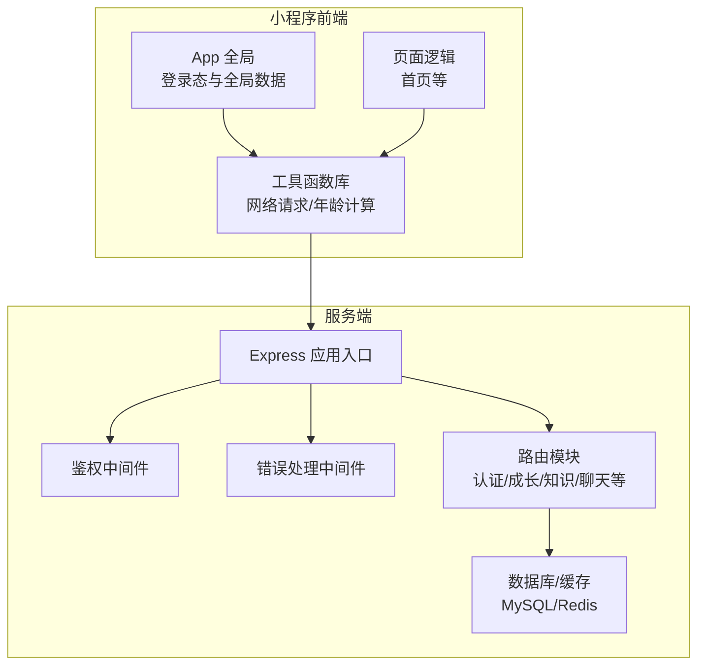
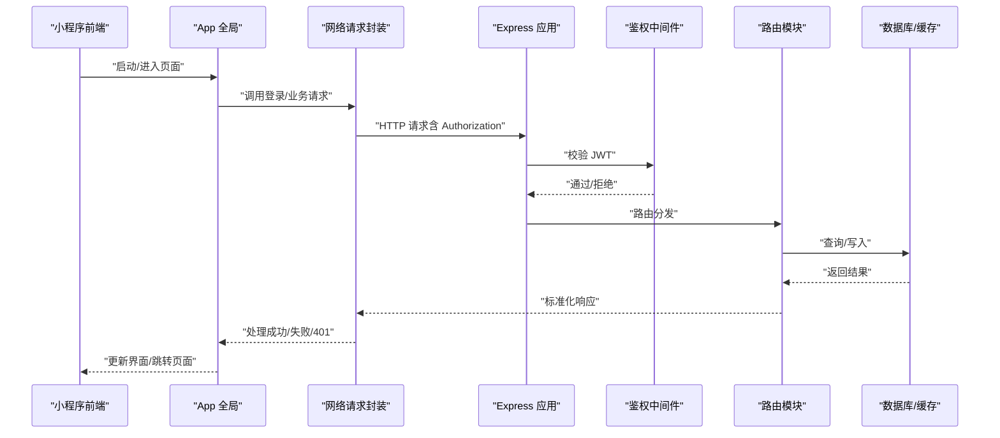
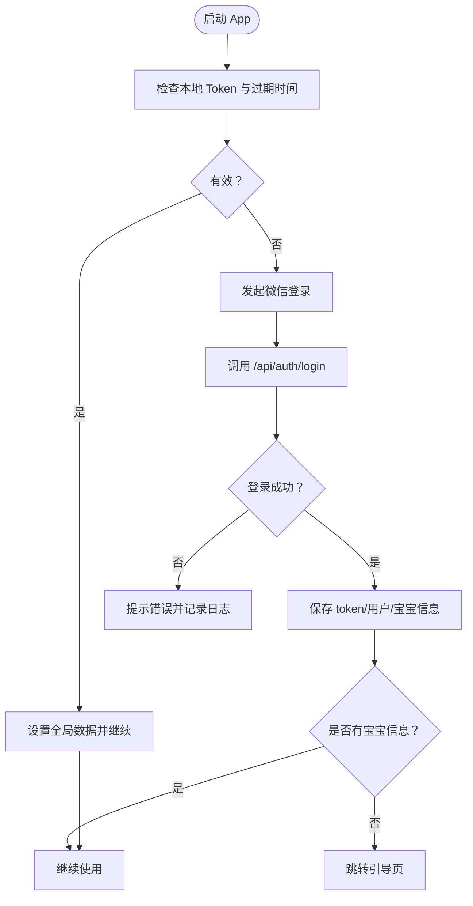
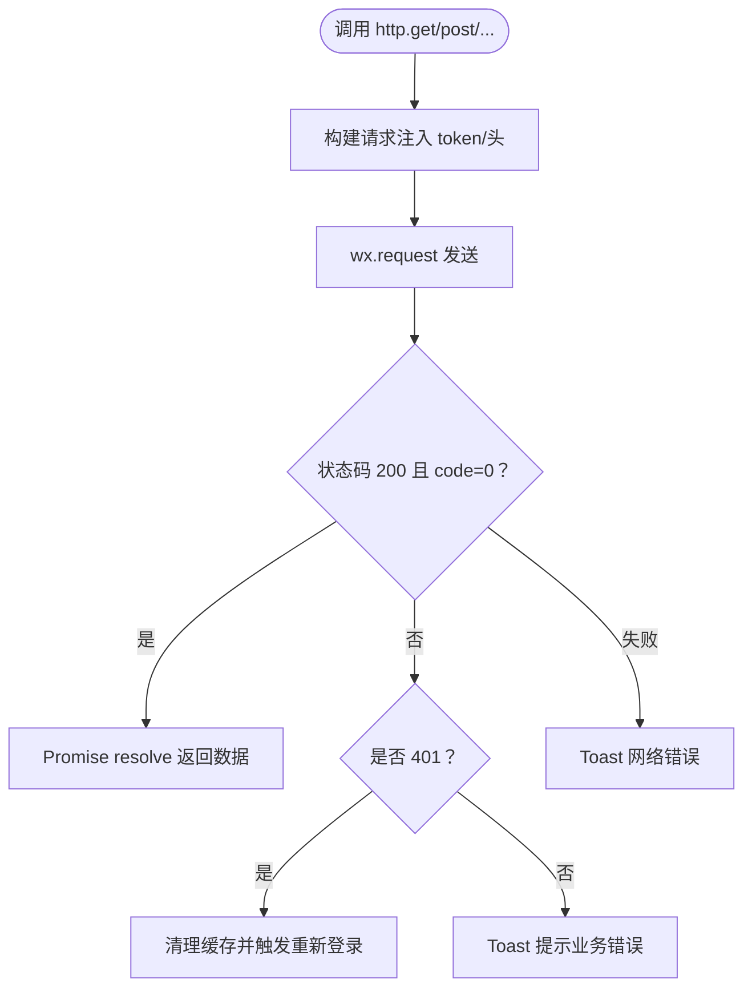
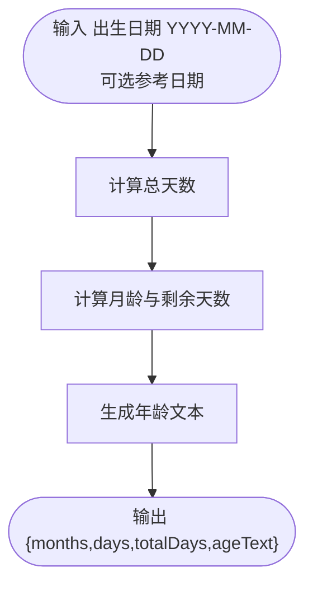
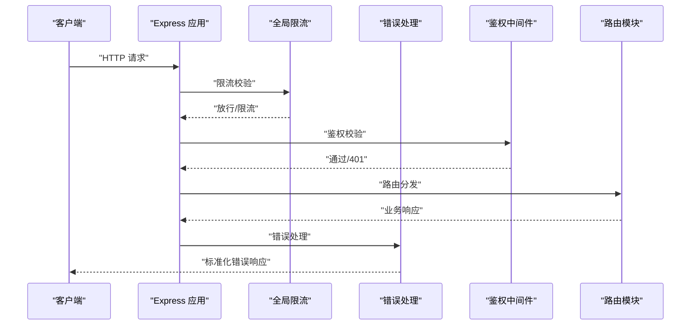
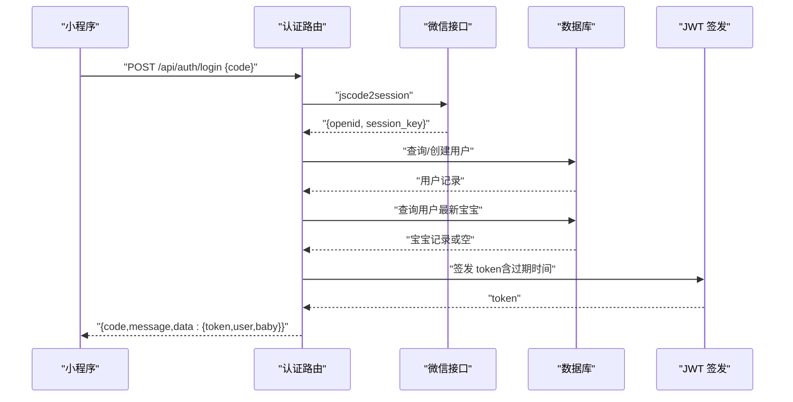
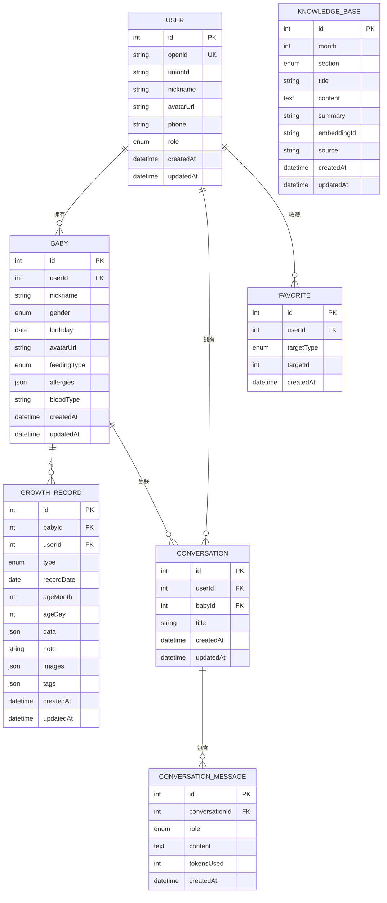
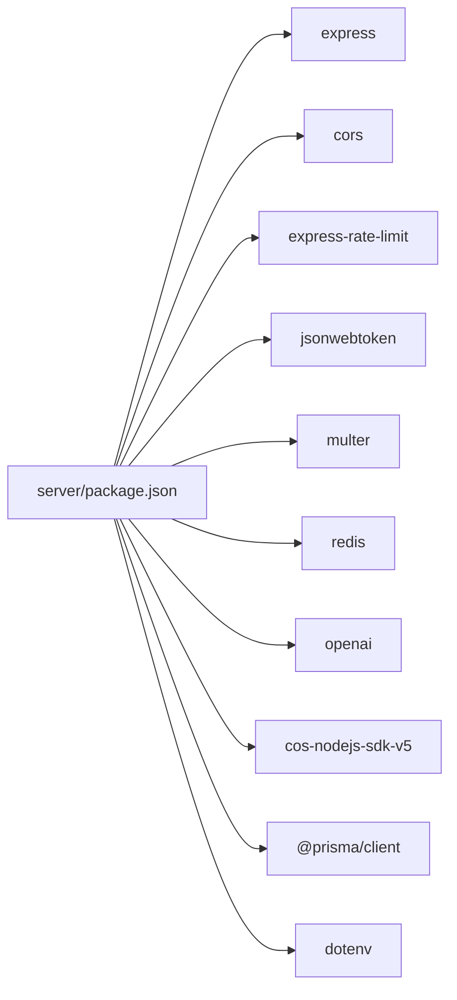

# 开发指南

<cite>
**本文引用的文件**
- [miniprogram/app.js](file://miniprogram/app.js)
- [miniprogram/app.json](file://miniprogram/app.json)
- [miniprogram/utils/request.js](file://miniprogram/utils/request.js)
- [miniprogram/utils/ageCalculator.js](file://miniprogram/utils/ageCalculator.js)
- [miniprogram/pages/home/index.js](file://miniprogram/pages/home/index.js)
- [server/src/app.js](file://server/src/app.js)
- [server/package.json](file://server/package.json)
- [server/src/middleware/auth.js](file://server/src/middleware/auth.js)
- [server/src/middleware/errorHandler.js](file://server/src/middleware/errorHandler.js)
- [server/src/routes/auth.js](file://server/src/routes/auth.js)
- [server/prisma/schema.prisma](file://server/prisma/schema.prisma)
- [server/docker-compose.yml](file://server/docker-compose.yml)
- [project.config.json](file://project.config.json)
</cite>

## 目录
1. [简介](#简介)
2. [项目结构](#项目结构)
3. [核心组件](#核心组件)
4. [架构总览](#架构总览)
5. [详细组件分析](#详细组件分析)
6. [依赖分析](#依赖分析)
7. [性能考虑](#性能考虑)
8. [故障排查指南](#故障排查指南)
9. [结论](#结论)
10. [附录](#附录)

## 简介
本开发指南面向“AI育儿助手”项目团队成员，系统性地阐述前后端代码规范、最佳实践、调试技巧与测试策略；明确项目结构、开发流程与 Git 工作流；详解工具函数库与业务逻辑实现模式；给出前端组件开发规范、性能优化建议、安全编码实践与代码审查标准，帮助团队快速统一开发规范与质量标准。

## 项目结构
项目采用“小程序前端 + Node/Express 后端 + 数据库/缓存容器”的分层架构：
- 小程序前端（miniprogram）：页面、组件、样式、工具函数与全局应用逻辑
- 服务端（server）：Express 应用、路由、中间件、Prisma 数据模型、Docker 编排
- 配置与文档：项目配置、Docker Compose、Prisma Schema

图表来源
- [miniprogram/app.js:1-69](file://miniprogram/app.js#L1-L69)
- [miniprogram/utils/request.js:1-97](file://miniprogram/utils/request.js#L1-L97)
- [miniprogram/pages/home/index.js:1-114](file://miniprogram/pages/home/index.js#L1-L114)
- [server/src/app.js:1-65](file://server/src/app.js#L1-L65)
- [server/src/middleware/auth.js:1-29](file://server/src/middleware/auth.js#L1-L29)
- [server/src/middleware/errorHandler.js:1-52](file://server/src/middleware/errorHandler.js#L1-L52)
- [server/prisma/schema.prisma:1-189](file://server/prisma/schema.prisma#L1-L189)

章节来源
- [miniprogram/app.json:1-60](file://miniprogram/app.json#L1-L60)
- [server/docker-compose.yml:1-32](file://server/docker-compose.yml#L1-L32)

## 核心组件
- 小程序全局应用（App）
  - 负责初始化全局数据、登录态校验与自动登录、持久化存储与页面跳转
  - 登录流程通过后端认证接口换取令牌，并缓存用户与宝宝信息
- 网络请求封装（request）
  - 统一管理基础 URL、自动注入 Authorization、统一封装成功/失败处理
  - 401 自动触发 Token 过期处理与重新登录
- 年龄计算工具（ageCalculator）
  - 提供月龄/日龄计算、日期格式化、友好日期展示
- Express 应用入口与中间件
  - 全局 CORS、JSON 解析、限流、健康检查、404 与全局错误处理
  - 鉴权中间件基于 JWT 校验，路由按需挂载
- 数据模型（Prisma）
  - 用户、宝宝、成长记录、对话会话与消息、知识库、收藏等模型与索引
- Docker 编排
  - MySQL 与 Redis 容器化运行，便于本地开发与部署

章节来源
- [miniprogram/app.js:1-69](file://miniprogram/app.js#L1-L69)
- [miniprogram/utils/request.js:1-97](file://miniprogram/utils/request.js#L1-L97)
- [miniprogram/utils/ageCalculator.js:1-86](file://miniprogram/utils/ageCalculator.js#L1-L86)
- [server/src/app.js:1-65](file://server/src/app.js#L1-L65)
- [server/src/middleware/auth.js:1-29](file://server/src/middleware/auth.js#L1-L29)
- [server/src/middleware/errorHandler.js:1-52](file://server/src/middleware/errorHandler.js#L1-L52)
- [server/prisma/schema.prisma:1-189](file://server/prisma/schema.prisma#L1-L189)
- [server/docker-compose.yml:1-32](file://server/docker-compose.yml#L1-L32)

## 架构总览
整体交互流程：小程序通过网络请求访问后端 API，后端经鉴权中间件校验 JWT，再路由到具体业务模块，最终读写数据库与缓存。

图表来源
- [miniprogram/app.js:1-69](file://miniprogram/app.js#L1-L69)
- [miniprogram/utils/request.js:1-97](file://miniprogram/utils/request.js#L1-L97)
- [server/src/app.js:1-65](file://server/src/app.js#L1-L65)
- [server/src/middleware/auth.js:1-29](file://server/src/middleware/auth.js#L1-L29)
- [server/src/routes/auth.js:1-84](file://server/src/routes/auth.js#L1-L84)
- [server/prisma/schema.prisma:1-189](file://server/prisma/schema.prisma#L1-L189)

## 详细组件分析

### 小程序 App 与登录流程
- 登录态检查：优先使用全局内存中的 token，否则从本地缓存读取并判断过期时间
- 微信登录：调用后端 /api/auth/login，成功后写入 token、用户与宝宝信息缓存，并根据是否存在宝宝信息决定是否引导新建
- 401 自动处理：当请求返回 401 时，清除本地缓存并触发重新登录

图表来源
- [miniprogram/app.js:1-69](file://miniprogram/app.js#L1-L69)

章节来源
- [miniprogram/app.js:1-69](file://miniprogram/app.js#L1-L69)

### 网络请求封装与 Token 过期处理
- 统一注入 Authorization 头，支持 GET/POST/PUT/DELETE 快捷方法
- 统一 loading 与 toast 展示，业务错误码 401 触发自动登录
- 失败场景：网络异常、状态码非 200、业务错误均进行统一反馈

图表来源
- [miniprogram/utils/request.js:1-97](file://miniprogram/utils/request.js#L1-L97)

章节来源
- [miniprogram/utils/request.js:1-97](file://miniprogram/utils/request.js#L1-L97)

### 年龄计算工具
- 输入出生日期与可选参考日期，输出月龄、日龄、总天数与友好文案
- 提供日期格式化与“今天/昨天/前天/×天前/月日/年月日”友好展示

图表来源
- [miniprogram/utils/ageCalculator.js:1-86](file://miniprogram/utils/ageCalculator.js#L1-L86)

章节来源
- [miniprogram/utils/ageCalculator.js:1-86](file://miniprogram/utils/ageCalculator.js#L1-L86)

### Express 应用与中间件
- 全局中间件：CORS、JSON 解析、URL 编码解析、全局限流
- 健康检查：/api/health
- 鉴权中间件：从 Authorization 头提取 Bearer Token，校验失败统一返回 401
- 错误处理：Prisma 已知错误映射、自定义业务错误、未知错误兜底
- 路由注册：按模块划分，部分路由需鉴权

图表来源
- [server/src/app.js:1-65](file://server/src/app.js#L1-L65)
- [server/src/middleware/auth.js:1-29](file://server/src/middleware/auth.js#L1-L29)
- [server/src/middleware/errorHandler.js:1-52](file://server/src/middleware/errorHandler.js#L1-L52)

章节来源
- [server/src/app.js:1-65](file://server/src/app.js#L1-L65)
- [server/src/middleware/auth.js:1-29](file://server/src/middleware/auth.js#L1-L29)
- [server/src/middleware/errorHandler.js:1-52](file://server/src/middleware/errorHandler.js#L1-L52)

### 认证路由与微信登录
- /api/auth/login：接收小程序 code，调用微信 jscode2session，查找或创建用户，查询最新宝宝，签发 JWT，返回用户与宝宝信息
- 依赖环境变量：WX_APPID、WX_SECRET、JWT_SECRET、DATABASE_URL

图表来源
- [server/src/routes/auth.js:1-84](file://server/src/routes/auth.js#L1-L84)

章节来源
- [server/src/routes/auth.js:1-84](file://server/src/routes/auth.js#L1-L84)

### 数据模型与关系
- 用户（User）与宝宝（Baby）一对多
- 宝宝与成长记录（GrowthRecord）一对多
- 用户与对话会话（Conversation）一对多，会话与消息（ConversationMessage）一对多
- 知识库（KnowledgeBase）按月龄与分区唯一
- 收藏（Favorite）支持多种目标类型

图表来源
- [server/prisma/schema.prisma:1-189](file://server/prisma/schema.prisma#L1-L189)

章节来源
- [server/prisma/schema.prisma:1-189](file://server/prisma/schema.prisma#L1-L189)

### 前端页面与组件开发规范
- 页面生命周期：onLoad（一次性加载）、onShow（每次显示刷新）、onPullDownRefresh（下拉刷新）
- 页面数据：使用 setData 更新视图，避免直接修改 data
- 导航：switchTab 用于 tab 页面，navigateTo 用于普通页面
- 事件绑定：使用 data-* 属性传递参数，避免内联函数
- 组件化：将可复用 UI 抽象为组件，遵循单一职责

章节来源
- [miniprogram/pages/home/index.js:1-114](file://miniprogram/pages/home/index.js#L1-L114)

## 依赖分析
- 小程序前端
  - 使用原生微信小程序框架，无第三方 UI 框架
  - 网络请求依赖 wx.request，工具函数独立封装
- 服务端
  - Express 提供 Web 服务，CORS、限流、JWT、Multer、Redis、OpenAI、Cos SDK、Prisma
  - Docker Compose 提供 MySQL 与 Redis 容器化支撑

图表来源
- [server/package.json:1-31](file://server/package.json#L1-L31)

章节来源
- [server/package.json:1-31](file://server/package.json#L1-L31)
- [server/docker-compose.yml:1-32](file://server/docker-compose.yml#L1-L32)

## 性能考虑
- 前端
  - 合理使用分包与懒加载，减少首屏体积
  - 下拉刷新与本地缓存降级，提升弱网体验
  - 避免在 setData 中传递大对象，拆分更新
- 后端
  - 全局限流防止突发流量，按接口维度细化限流策略
  - Redis 作为缓存层降低数据库压力，注意淘汰策略
  - Prisma 查询加索引，避免 N+1 查询
- 数据库
  - 为高频查询字段建立复合索引，如成长记录的 (babyId, recordDate)、(babyId, type)
  - 控制 JSON 字段大小，必要时拆分为单独表

## 故障排查指南
- 登录失败
  - 检查 WX_APPID/WX_SECRET/JWT_SECRET 是否正确配置
  - 查看微信 jscode2session 返回值，确认 code 是否过期
- 401 未授权
  - 检查 Authorization 头是否携带 Bearer Token
  - 核对 JWT 过期时间与服务端签发策略
- 网络错误
  - 检查 BASE_URL 与后端地址一致性
  - 关注请求头 Content-Type 与自定义 header
- 数据库错误
  - Prisma P2002 冲突：检查唯一约束字段
  - P2025 不存在：检查外键与记录 ID
- Docker 环境
  - 确认 MySQL/Redis 容器端口映射与数据卷挂载
  - 初次运行需执行数据库迁移与种子数据导入

章节来源
- [server/src/middleware/errorHandler.js:1-52](file://server/src/middleware/errorHandler.js#L1-L52)
- [server/src/middleware/auth.js:1-29](file://server/src/middleware/auth.js#L1-L29)
- [server/src/routes/auth.js:1-84](file://server/src/routes/auth.js#L1-L84)
- [server/docker-compose.yml:1-32](file://server/docker-compose.yml#L1-L32)

## 结论
本指南提供了从项目结构、核心组件到开发流程、性能与安全实践的完整指引。建议团队在日常开发中严格遵循本文规范，统一代码风格与质量标准，确保项目稳定演进与高效协作。

## 附录

### 开发流程规范
- 分支策略
  - develop：集成主分支
  - feature/*：功能开发分支
  - hotfix/*：紧急修复分支
- 提交规范
  - 类型：feat/fix/docs/style/refactor/test/build/ci
  - 示例：feat(auth): 添加微信登录流程
- 合并与审查
  - 所有变更必须通过 Pull Request，至少一名成员审查通过后合并

### Git 工作流
- 日常开发
  - 从 develop 拉出 feature 分支，完成后推送并发起 PR
- 发布准备
  - 在 release 分支进行集成测试与版本号修订
- 紧急修复
  - 从 master 拉出 hotfix 分支，修复后同时合并回 master 与 develop

### 代码规范与最佳实践
- 命名规范
  - 文件与目录使用小驼峰或短横线命名，避免缩写
  - 变量与函数使用语义化名称，避免 i/j/k 等无意义变量
- 错误处理
  - 明确区分业务错误与系统错误，统一返回结构
  - 前端对 401 自动重定向登录，避免静默失败
- 安全实践
  - 敏感信息放入环境变量，不在代码中硬编码
  - 严格校验与过滤输入参数，防止 SQL 注入与 XSS
- 测试策略
  - 单元测试：工具函数与纯函数优先
  - 接口测试：使用 Postman 或自动化脚本覆盖核心路由
  - 端到端测试：小程序页面交互与关键流程

### 前端组件开发规范
- 结构清晰：wxml 结构简洁，wxss 样式模块化
- 事件解耦：通过事件回调传递数据，避免跨层级传参
- 可维护性：组件属性尽量内聚，避免过度耦合

### 性能优化建议
- 前端
  - 图片懒加载与压缩，合理使用缓存
  - 避免频繁 setData，批量更新
- 后端
  - 合理设置 Redis 最大内存与淘汰策略
  - 对热点接口增加缓存与限流

### 安全编码实践
- 输入校验：对所有外部输入进行白名单校验
- 权限控制：接口鉴权与资源归属校验
- 日志脱敏：避免在日志中打印敏感信息

### 代码审查清单
- 代码可读性：命名、注释、结构是否清晰
- 边界与异常：是否覆盖边界条件与异常分支
- 安全性：输入校验、权限控制、敏感信息处理
- 性能：是否存在潜在性能问题
- 兼容性：是否考虑不同设备与系统版本差异