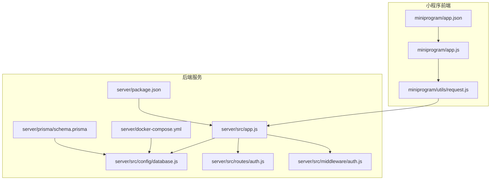
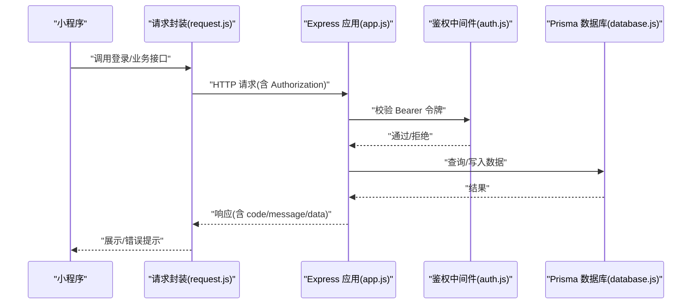
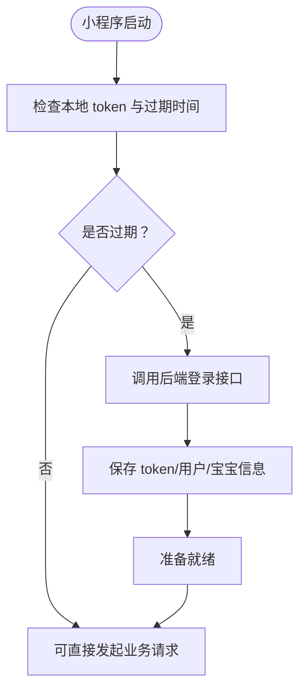
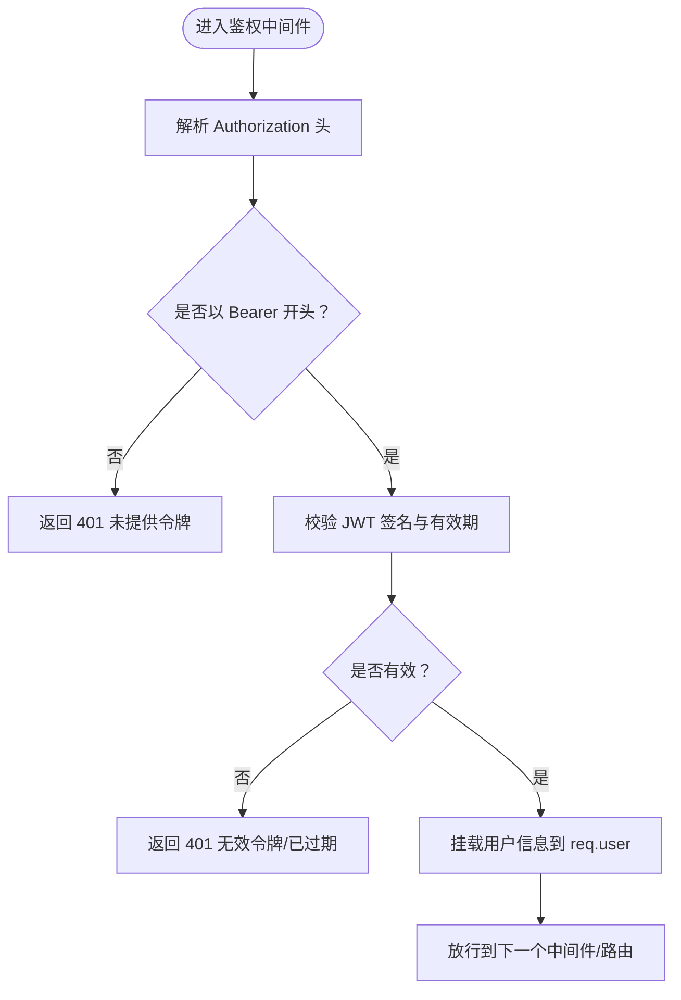
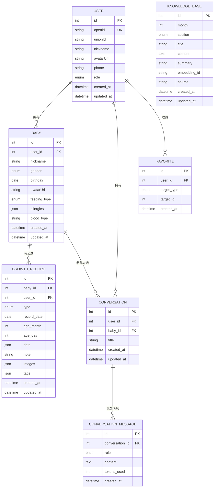
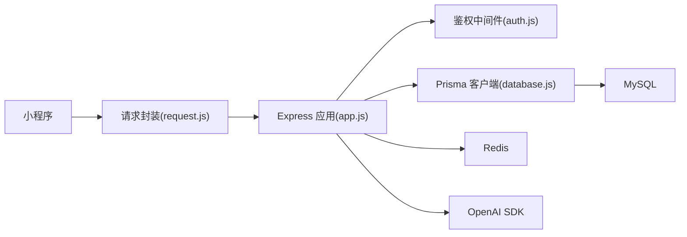

# 快速开始

<cite>
**本文引用的文件**
- [project.config.json](file://project.config.json)
- [package.json](file://server/package.json)
- [schema.prisma](file://server/prisma/schema.prisma)
- [app.js](file://server/src/app.js)
- [database.js](file://server/src/config/database.js)
- [auth.js](file://server/src/routes/auth.js)
- [auth-middleware.js](file://server/src/middleware/auth.js)
- [app.js](file://miniprogram/app.js)
- [app.json](file://miniprogram/app.json)
- [request.js](file://miniprogram/utils/request.js)
- [.gitignore](file://server/.gitignore)
- [docker-compose.yml](file://server/docker-compose.yml)
</cite>

## 目录
1. [简介](#简介)
2. [项目结构](#项目结构)
3. [核心组件](#核心组件)
4. [架构总览](#架构总览)
5. [详细组件分析](#详细组件分析)
6. [依赖关系分析](#依赖关系分析)
7. [性能考虑](#性能考虑)
8. [故障排除指南](#故障排除指南)
9. [结论](#结论)
10. [附录](#附录)

## 简介
本指南面向新加入的开发者，帮助你在最短时间内完成环境搭建、项目克隆、依赖安装、数据库初始化与环境变量配置，并成功启动本地开发环境。你将学会如何运行前端小程序与后端 API 服务，理解基础的数据模型与鉴权流程，并掌握常见问题的排查与调试技巧。

## 项目结构
该项目采用前后端分离架构：
- 小程序前端位于 miniprogram 目录，使用微信小程序框架组织页面、组件与资源。
- 后端服务位于 server 目录，基于 Express 提供 REST API，使用 Prisma 访问 MySQL，Redis 缓存，以及 OpenAI 等第三方能力。
- 项目根目录包含小程序工程配置文件，用于微信开发者工具识别项目类型与编译选项。

图表来源
- [app.js:1-69](file://miniprogram/app.js#L1-L69)
- [app.json:1-60](file://miniprogram/app.json#L1-L60)
- [request.js:1-97](file://miniprogram/utils/request.js#L1-L97)
- [app.js:1-65](file://server/src/app.js#L1-L65)
- [database.js:1-17](file://server/src/config/database.js#L1-L17)
- [auth.js:1-84](file://server/src/routes/auth.js#L1-L84)
- [auth-middleware.js:1-29](file://server/src/middleware/auth.js#L1-L29)
- [package.json:1-31](file://server/package.json#L1-L31)
- [docker-compose.yml:1-32](file://server/docker-compose.yml#L1-L32)
- [schema.prisma:1-189](file://server/prisma/schema.prisma#L1-L189)

章节来源
- [project.config.json:1-47](file://project.config.json#L1-L47)
- [app.json:1-60](file://miniprogram/app.json#L1-L60)
- [package.json:1-31](file://server/package.json#L1-L31)

## 核心组件
- 小程序应用入口与登录态管理：负责在启动时检查登录状态、调用后端登录接口换取令牌并持久化存储。
- 网络请求封装：统一封装 GET/POST/PUT/DELETE 方法，自动注入 Authorization 头，统一处理业务错误与网络异常，并在令牌过期时触发重新登录。
- Express 应用：启用 CORS、JSON 解析、限流中间件；注册各模块路由；提供健康检查接口；全局错误处理。
- 鉴权中间件：从请求头解析 Bearer 令牌，校验有效期与签名，失败时返回相应错误。
- 数据库配置：通过 Prisma 客户端连接 MySQL，按环境输出日志级别，并在进程退出前优雅断开连接。
- 数据模型：定义用户、宝宝、成长记录、对话会话与消息、知识库、收藏等核心实体及枚举类型。

章节来源
- [app.js:1-69](file://miniprogram/app.js#L1-L69)
- [request.js:1-97](file://miniprogram/utils/request.js#L1-L97)
- [app.js:1-65](file://server/src/app.js#L1-L65)
- [auth-middleware.js:1-29](file://server/src/middleware/auth.js#L1-L29)
- [database.js:1-17](file://server/src/config/database.js#L1-L17)
- [schema.prisma:1-189](file://server/prisma/schema.prisma#L1-L189)

## 架构总览
下图展示了从小程序发起请求到后端处理与数据库交互的整体流程，以及鉴权与限流的关键节点。

图表来源
- [request.js:1-97](file://miniprogram/utils/request.js#L1-L97)
- [app.js:1-65](file://server/src/app.js#L1-L65)
- [auth-middleware.js:1-29](file://server/src/middleware/auth.js#L1-L29)
- [database.js:1-17](file://server/src/config/database.js#L1-L17)

## 详细组件分析

### 小程序登录与鉴权流程
- 登录态检查：启动时读取本地存储的 token、过期时间与用户信息，若未过期则直接使用；否则触发登录。
- 登录过程：调用后端 /api/auth/login，携带微信 code，换取 JWT 与用户/宝宝信息，写入全局与本地存储。
- 请求拦截：所有请求自动附加 Authorization: Bearer token；当收到 401 时清理本地存储并重新登录。

图表来源
- [app.js:1-69](file://miniprogram/app.js#L1-L69)
- [request.js:1-97](file://miniprogram/utils/request.js#L1-L97)

章节来源
- [app.js:1-69](file://miniprogram/app.js#L1-L69)
- [request.js:1-97](file://miniprogram/utils/request.js#L1-L97)

### 后端鉴权中间件
- 从 Authorization 头解析 Bearer 令牌。
- 使用 JWT_SECRET 校验签名与有效期。
- 将解码后的用户信息挂载到请求对象，供后续路由使用。

图表来源
- [auth-middleware.js:1-29](file://server/src/middleware/auth.js#L1-L29)

章节来源
- [auth-middleware.js:1-29](file://server/src/middleware/auth.js#L1-L29)

### 数据模型与数据库初始化
- 数据库：MySQL，使用 Prisma 管理迁移与客户端。
- 关键实体：User、Baby、GrowthRecord、Conversation、ConversationMessage、KnowledgeBase、Favorite。
- 初始化步骤：先启动数据库容器，再执行 Prisma 迁移与种子数据脚本，最后生成客户端代码。

图表来源
- [schema.prisma:1-189](file://server/prisma/schema.prisma#L1-L189)

章节来源
- [schema.prisma:1-189](file://server/prisma/schema.prisma#L1-L189)

## 依赖关系分析
- 小程序依赖：通过 utils/request.js 统一发起 HTTP 请求，目标地址默认指向本地后端服务。
- 后端依赖：Express 提供 Web 服务，CORS 支持跨域，Rate Limit 控制请求频率，Prisma 访问 MySQL，Redis 作为缓存，OpenAI SDK 用于大模型交互。
- Docker Compose：一键拉起 MySQL 与 Redis，便于本地开发测试。

图表来源
- [request.js:1-97](file://miniprogram/utils/request.js#L1-L97)
- [app.js:1-65](file://server/src/app.js#L1-L65)
- [auth-middleware.js:1-29](file://server/src/middleware/auth.js#L1-L29)
- [database.js:1-17](file://server/src/config/database.js#L1-L17)
- [package.json:1-31](file://server/package.json#L1-L31)
- [docker-compose.yml:1-32](file://server/docker-compose.yml#L1-L32)

章节来源
- [package.json:1-31](file://server/package.json#L1-L31)
- [docker-compose.yml:1-32](file://server/docker-compose.yml#L1-L32)

## 性能考虑
- 限流策略：对 /api/* 路由启用每分钟 60 次的限流，避免突发流量冲击。
- 日志级别：开发环境开启查询与警告日志，便于定位慢查询与异常；生产环境仅记录错误。
- 缓存：Redis 用于热点数据与会话缓存，建议结合业务场景合理设置过期策略。
- 数据库索引：Prisma 模型中已为常用查询字段建立索引，避免全表扫描。

章节来源
- [app.js:19-25](file://server/src/app.js#L19-L25)
- [database.js:7-9](file://server/src/config/database.js#L7-L9)
- [schema.prisma:91-93](file://server/prisma/schema.prisma#L91-L93)
- [schema.prisma:119-121](file://server/prisma/schema.prisma#L119-L121)

## 故障排除指南
- 端口占用
  - 现象：后端启动报端口冲突。
  - 处理：修改监听端口或释放占用端口。
  - 参考：[app.js](file://server/src/app.js#L12)
- 数据库连接失败
  - 现象：Prisma 报错无法连接 MySQL。
  - 处理：确认 Docker 已启动 MySQL/Redis，检查 DATABASE_URL 与凭据；执行迁移与种子脚本。
  - 参考：[docker-compose.yml:1-32](file://server/docker-compose.yml#L1-L32)，[schema.prisma:8-11](file://server/prisma/schema.prisma#L8-L11)
- 令牌无效或过期
  - 现象：接口返回 401。
  - 处理：检查 JWT_SECRET 是否正确；确认小程序本地存储的 token 与过期时间；重新登录。
  - 参考：[auth-middleware.js:16-25](file://server/src/middleware/auth.js#L16-L25)，[app.js:18-30](file://miniprogram/app.js#L18-L30)
- 微信登录失败
  - 现象：后端 /api/auth/login 返回微信错误信息。
  - 处理：核对 WX_APPID 与 WX_SECRET；确认小程序 appid 与服务器配置一致。
  - 参考：[auth.js:18-30](file://server/src/routes/auth.js#L18-L30)
- 网络请求失败
  - 现象：小程序弹出“网络连接失败”。
  - 处理：确认后端服务已启动且可访问；检查代理与防火墙；查看控制台错误。
  - 参考：[request.js:64-70](file://miniprogram/utils/request.js#L64-L70)

章节来源
- [app.js](file://server/src/app.js#L12)
- [docker-compose.yml:1-32](file://server/docker-compose.yml#L1-L32)
- [schema.prisma:8-11](file://server/prisma/schema.prisma#L8-L11)
- [auth-middleware.js:16-25](file://server/src/middleware/auth.js#L16-L25)
- [app.js:18-30](file://miniprogram/app.js#L18-L30)
- [auth.js:18-30](file://server/src/routes/auth.js#L18-L30)
- [request.js:64-70](file://miniprogram/utils/request.js#L64-L70)

## 结论
通过本指南，你已经完成了环境准备、项目克隆、依赖安装、数据库初始化与环境变量配置，并成功启动了本地开发环境。建议在开发过程中遵循统一的请求规范与鉴权流程，关注数据库索引与缓存策略，遇到问题优先检查端口、数据库连接与令牌有效性。

## 附录

### 环境要求与安装步骤
- Node.js
  - 版本：建议使用长期支持版本（LTS）。
  - 安装方式：从官网下载安装包或使用包管理器。
- 微信开发者工具
  - 下载：从微信公众平台开发者工具页面获取安装包。
  - 配置：打开项目根目录下的工程配置文件，选择小程序项目类型。
  - 参考：[project.config.json:36-46](file://project.config.json#L36-L46)
- 数据库与缓存
  - 方案一：使用 Docker Compose 一键启动 MySQL 与 Redis。
    - 参考：[docker-compose.yml:1-32](file://server/docker-compose.yml#L1-L32)
  - 方案二：本地安装 MySQL 8.0 与 Redis 7，确保服务已启动。
- 第三方服务
  - OpenAI：用于大模型交互，需配置相关密钥（如存在）。
  - 参考：[package.json](file://server/package.json#L23)

章节来源
- [project.config.json:36-46](file://project.config.json#L36-L46)
- [docker-compose.yml:1-32](file://server/docker-compose.yml#L1-L32)
- [package.json](file://server/package.json#L23)

### 项目克隆与依赖安装
- 克隆仓库后，在 server 目录安装依赖。
  - 参考：[package.json:1-31](file://server/package.json#L1-L31)
- 在 miniprogram 目录无需额外安装依赖（使用微信开发者工具内置编译）。

章节来源
- [package.json:1-31](file://server/package.json#L1-L31)

### 数据库初始化与环境变量配置
- 初始化数据库
  - 启动 MySQL/Redis：使用 Docker Compose 或本地服务。
    - 参考：[docker-compose.yml:1-32](file://server/docker-compose.yml#L1-L32)
  - 执行 Prisma 迁移与生成客户端：
    - 迁移：参考脚本名称 [package.json](file://server/package.json#L9)
    - 生成客户端：参考脚本名称 [package.json](file://server/package.json#L12)
  - 导入种子数据（如有）：参考脚本名称 [package.json](file://server/package.json#L10)
- 环境变量
  - .env 文件应包含以下关键变量（示例模板见 PRD 文档）：
    - DATABASE_URL：MySQL 连接字符串
    - JWT_SECRET：JWT 签名密钥
    - WX_APPID：微信小程序 App ID
    - WX_SECRET：微信小程序 App Secret
  - .gitignore 已屏蔽 .env，确保敏感信息不被提交。
    - 参考：[.gitignore:1-6](file://server/.gitignore#L1-L6)

章节来源
- [package.json:9-12](file://server/package.json#L9-L12)
- [.gitignore:1-6](file://server/.gitignore#L1-L6)
- [schema.prisma:8-11](file://server/prisma/schema.prisma#L8-L11)

### 本地开发环境启动方法
- 启动后端服务
  - 开发模式：执行 dev 脚本，自动重启监听文件变更。
    - 参考：[package.json](file://server/package.json#L7)
  - 健康检查：访问 /api/health。
    - 参考：[app.js:28-30](file://server/src/app.js#L28-L30)
- 启动小程序
  - 在微信开发者工具中打开项目根目录，选择小程序项目类型。
  - 参考：[project.config.json:36-46](file://project.config.json#L36-L46)
- 默认后端地址
  - 小程序默认请求 http://localhost:3000/api，上线后请替换为正式域名。
  - 参考：[app.js](file://miniprogram/app.js#L7)，[request.js](file://miniprogram/utils/request.js#L11)

章节来源
- [package.json](file://server/package.json#L7)
- [app.js:28-30](file://server/src/app.js#L28-L30)
- [project.config.json:36-46](file://project.config.json#L36-L46)
- [app.js](file://miniprogram/app.js#L7)
- [request.js](file://miniprogram/utils/request.js#L11)

### 基本使用示例
- 登录流程
  - 小程序启动后自动检查登录态；若无有效 token，则调用后端 /api/auth/login 获取令牌并存储。
  - 参考：[app.js:18-30](file://miniprogram/app.js#L18-L30)，[auth.js:10-81](file://server/src/routes/auth.js#L10-L81)
- 发起带鉴权的请求
  - 所有受保护接口均需在请求头添加 Authorization: Bearer <token>。
  - 参考：[request.js:33-37](file://miniprogram/utils/request.js#L33-L37)，[auth-middleware.js:7-26](file://server/src/middleware/auth.js#L7-L26)
- 页面导航与 Tab
  - app.json 中声明了页面与 tabBar 列表，确保页面路径正确。
  - 参考：[app.json:1-60](file://miniprogram/app.json#L1-L60)

章节来源
- [app.js:18-30](file://miniprogram/app.js#L18-L30)
- [auth.js:10-81](file://server/src/routes/auth.js#L10-L81)
- [request.js:33-37](file://miniprogram/utils/request.js#L33-L37)
- [auth-middleware.js:7-26](file://server/src/middleware/auth.js#L7-L26)
- [app.json:1-60](file://miniprogram/app.json#L1-L60)