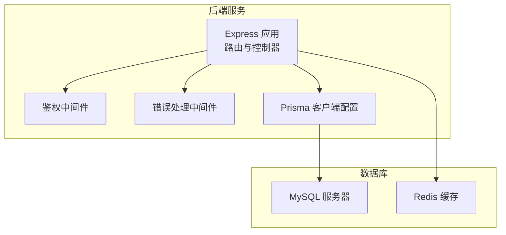
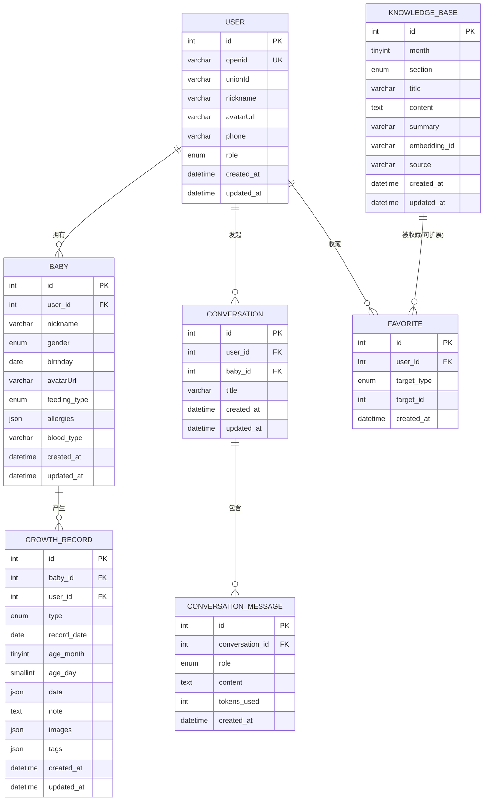
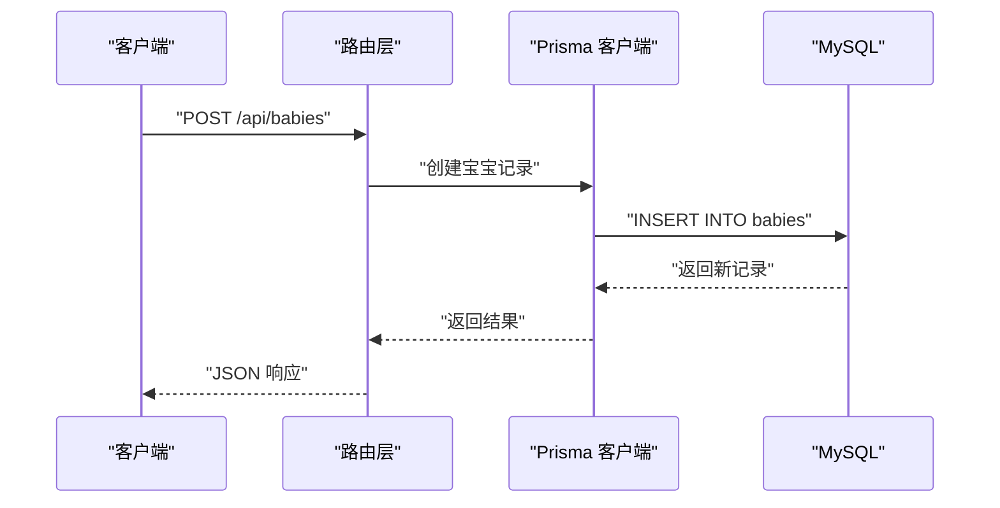
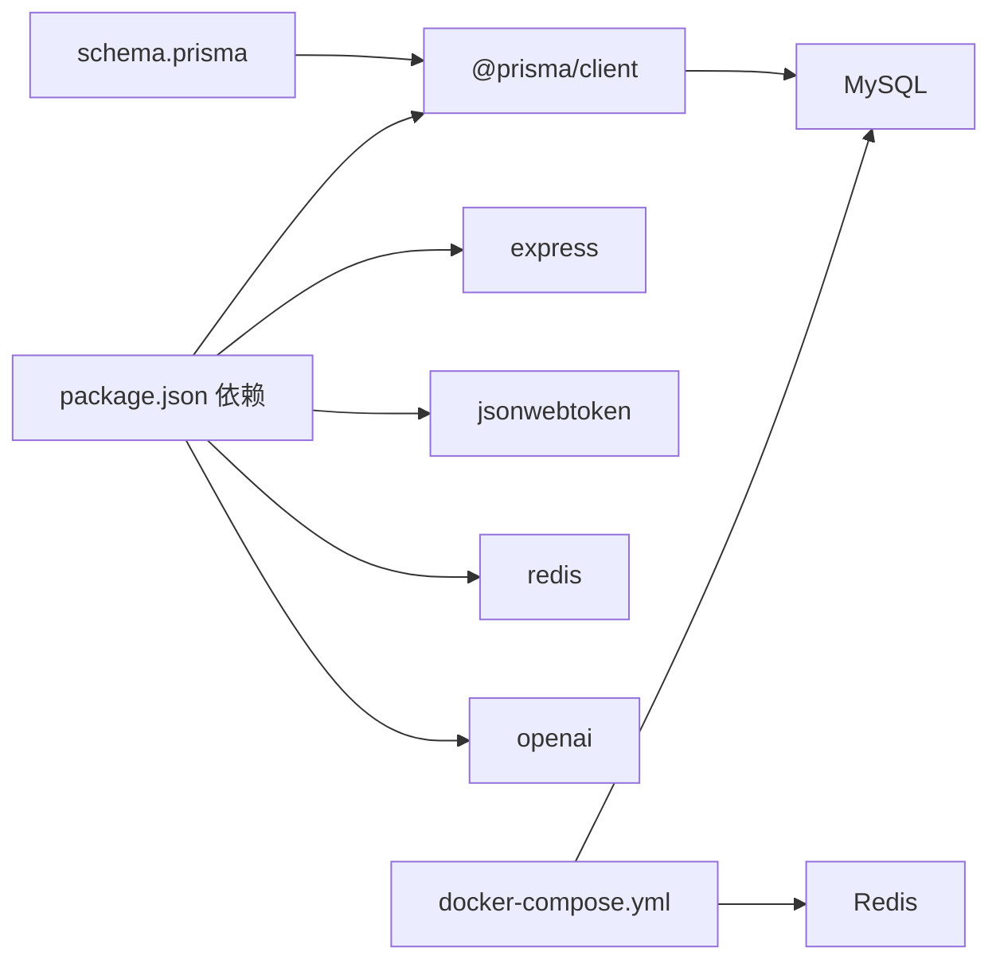

# 数据库设计

<cite>
**本文引用的文件**
- [schema.prisma](file://server/prisma/schema.prisma)
- [database.js](file://server/src/config/database.js)
- [package.json](file://server/package.json)
- [docker-compose.yml](file://server/docker-compose.yml)
- [auth.js](file://server/src/middleware/auth.js)
- [errorHandler.js](file://server/src/middleware/errorHandler.js)
- [baby.js](file://server/src/routes/baby.js)
- [growth.js](file://server/src/routes/growth.js)
- [knowledge.js](file://server/src/routes/knowledge.js)
- [chat.js](file://server/src/routes/chat.js)
</cite>

## 目录
1. [简介](#简介)
2. [项目结构](#项目结构)
3. [核心组件](#核心组件)
4. [架构总览](#架构总览)
5. [详细组件分析](#详细组件分析)
6. [依赖分析](#依赖分析)
7. [性能考虑](#性能考虑)
8. [故障排查指南](#故障排查指南)
9. [结论](#结论)
10. [附录](#附录)

## 简介
本文件面向“AI育儿助手”项目的数据库与数据模型，系统性梳理基于 Prisma ORM 的数据模型定义、表关系设计、字段约束与枚举规则，并结合后端路由与中间件展示典型的数据访问模式。同时给出数据库迁移策略、索引与查询优化建议、缓存与一致性保障思路，以及完整的数据库架构图与实体关系图。

## 项目结构
后端采用 Express + Prisma 架构，数据库位于 MySQL，开发环境通过 Docker Compose 启动本地 MySQL 与 Redis；Prisma 作为 ORM 生成客户端并管理数据库迁移与查询。

图表来源
- [package.json:1-31](file://server/package.json#L1-L31)
- [docker-compose.yml:1-32](file://server/docker-compose.yml#L1-L32)
- [database.js:1-17](file://server/src/config/database.js#L1-L17)

章节来源
- [package.json:1-31](file://server/package.json#L1-L31)
- [docker-compose.yml:1-32](file://server/docker-compose.yml#L1-L32)
- [database.js:1-17](file://server/src/config/database.js#L1-L17)

## 核心组件
- 数据模型定义：在 Prisma Schema 中以 model/enum 形式声明，包含用户、宝宝、成长记录、对话会话与消息、知识库、收藏等实体。
- 关系映射：通过 relation 字段与外键删除策略（如 Cascade）实现级联删除与引用完整性。
- 约束与索引：唯一约束（如 openid、(month, section)）、普通索引（如 (babyId, recordDate)、(userId, babyId)）提升查询效率。
- 枚举类型：角色、性别、喂养方式、记录类型、消息角色、知识板块、收藏类型等统一管理。
- 数据访问：路由层调用 Prisma 客户端进行 CRUD 操作，配合鉴权与错误处理中间件。

章节来源
- [schema.prisma:1-189](file://server/prisma/schema.prisma#L1-L189)
- [baby.js:1-100](file://server/src/routes/baby.js#L1-L100)
- [growth.js:1-118](file://server/src/routes/growth.js#L1-L118)
- [knowledge.js:1-59](file://server/src/routes/knowledge.js#L1-L59)
- [chat.js:1-57](file://server/src/routes/chat.js#L1-L57)

## 架构总览
下图展示数据库层与应用层交互，以及各实体之间的关系。

图表来源
- [schema.prisma:14-189](file://server/prisma/schema.prisma#L14-L189)

## 详细组件分析

### 用户（User）
- 主键：自增整型 id
- 唯一标识：openid（微信小程序唯一标识），可选 unionId
- 角色：枚举（mother/father/grandparent/other）
- 关系：一对多到宝宝、对话、收藏
- 索引：对 openid 建有索引；表名映射 users
- 字段约束：昵称、头像、手机号等字段长度限制

章节来源
- [schema.prisma:14-31](file://server/prisma/schema.prisma#L14-L31)
- [database.js:5-17](file://server/src/config/database.js#L5-L17)

### 宝宝（Baby）
- 外键：user_id 引用用户
- 基本信息：昵称、性别、生日、头像、喂养方式、过敏史、血型
- 约束：外键删除策略为级联删除（Cascade）
- 索引：对 user_id 建有索引；表名映射 babies
- 关系：一对多到成长记录、对话

章节来源
- [schema.prisma:41-60](file://server/prisma/schema.prisma#L41-L60)

### 成长记录（GrowthRecord）
- 复合主键：自增 id
- 外键：baby_id、user_id
- 记录类型：枚举（身高体重、喂养、睡眠、里程碑、照片、健康、其他）
- 时间维度：recordDate、ageMonth、ageDay
- 结构化数据：data/images/tags 使用 JSON 类型存储
- 索引：对 (babyId, recordDate)、(babyId, type) 建有复合索引；表名映射 growth_records
- 级联：外键删除策略为级联删除

章节来源
- [schema.prisma:74-94](file://server/prisma/schema.prisma#L74-L94)

### 对话会话（Conversation）与消息（ConversationMessage）
- 会话：关联用户与宝宝，标题默认空字符串
- 消息：角色枚举（user/assistant/system），内容文本，tokensUsed 计数
- 级联：会话与消息均设置外键删除策略为级联删除
- 索引：会话对 (userId, babyId) 建有索引；消息对 conversation_id 建有索引

章节来源
- [schema.prisma:107-142](file://server/prisma/schema.prisma#L107-L142)

### 知识库（KnowledgeBase）
- 唯一约束：(month, section)
- 字段：标题、内容、摘要、向量 ID、来源
- 索引：(month, section) 唯一索引；表名映射 knowledge_base

章节来源
- [schema.prisma:145-169](file://server/prisma/schema.prisma#L145-L169)

### 收藏（Favorite）
- 唯一约束：(userId, targetType, targetId)
- 目标类型：枚举（knowledge/conversation/article）
- 约束：外键删除策略为级联删除；表名映射 favorites

章节来源
- [schema.prisma:171-189](file://server/prisma/schema.prisma#L171-L189)

### 数据访问模式与路由示例
- 宝宝档案：创建、读取（含月龄计算）、更新
- 成长记录：新增、分页列表、详情、更新、删除
- 知识库：时间线概览、按月查看、按月与板块查询
- 对话：对话列表、详情、删除（AI发送接口预留）

图表来源
- [baby.js:9-32](file://server/src/routes/baby.js#L9-L32)
- [database.js:5-17](file://server/src/config/database.js#L5-L17)

章节来源
- [baby.js:1-100](file://server/src/routes/baby.js#L1-L100)
- [growth.js:1-118](file://server/src/routes/growth.js#L1-L118)
- [knowledge.js:1-59](file://server/src/routes/knowledge.js#L1-L59)
- [chat.js:1-57](file://server/src/routes/chat.js#L1-L57)

### 鉴权与错误处理
- 鉴权中间件：从 Authorization 头解析 Bearer Token，校验失败统一返回 401
- 错误处理：捕获 Prisma 已知错误码（如唯一约束冲突、记录不存在），并格式化响应

章节来源
- [auth.js:1-29](file://server/src/middleware/auth.js#L1-L29)
- [errorHandler.js:1-52](file://server/src/middleware/errorHandler.js#L1-L52)

## 依赖分析
- 运行时依赖：@prisma/client、express、jsonwebtoken、redis、openai 等
- 开发依赖：prisma、nodemon
- 数据库：MySQL 8.0（utf8mb4 字符集），Redis（用于缓存）
- 迁移与生成：通过 npm scripts 调用 npx prisma migrate dev、db:generate

图表来源
- [package.json:14-31](file://server/package.json#L14-L31)
- [docker-compose.yml:4-27](file://server/docker-compose.yml#L4-L27)
- [schema.prisma:4-11](file://server/prisma/schema.prisma#L4-L11)

章节来源
- [package.json:1-31](file://server/package.json#L1-L31)
- [docker-compose.yml:1-32](file://server/docker-compose.yml#L1-L32)
- [schema.prisma:1-11](file://server/prisma/schema.prisma#L1-L11)

## 性能考虑
- 索引优化
  - 成长记录：(babyId, recordDate)、(babyId, type) 复合索引，支持按宝宝与类型快速检索
  - 会话：(userId, babyId) 索引，支持按用户与宝宝组合查询
  - 用户：openid 唯一索引，确保去重与快速查找
  - 知识库：(month, section) 唯一索引，避免重复条目
- 查询优化
  - 分页查询：使用 take/skip 或 limit/offset，避免一次性加载大量数据
  - 排序：按 recordDate 降序或 updatedAt 降序，减少全表扫描
  - 条件过滤：优先使用索引列进行 where 过滤
- 写入优化
  - 批量写入：批量插入成长记录或消息时减少往返次数
  - 并发控制：使用数据库事务保证一致性
- 缓存策略
  - 热点数据：知识库概览、对话列表可缓存短期有效数据
  - 缓存键：按用户维度与查询参数构建键，避免跨用户污染
  - 缓存失效：写入成功后主动失效相关缓存
- 一致性保证
  - 外键级联：删除用户时级联删除其宝宝、对话、收藏，避免悬挂数据
  - 唯一约束：openid、(month, section)、收藏唯一性，防止重复
  - 事务：复杂写入流程（如新增成长记录并更新统计）放入事务

## 故障排查指南
- 常见错误码
  - P2002：唯一约束冲突（如重复 openid 或 (month, section)）
  - P2025：记录不存在（如更新/删除不存在的记录）
- 响应格式
  - 统一返回 { code, message }，开发环境输出详细错误日志
- 排查步骤
  - 检查请求头 Authorization 是否携带有效 Bearer Token
  - 核对路由参数与查询参数是否正确传入
  - 查看 Prisma 日志（开发环境开启 query、error、warn）
  - 核对数据库连接字符串与容器状态（Docker Compose）

章节来源
- [errorHandler.js:9-23](file://server/src/middleware/errorHandler.js#L9-L23)
- [database.js:7-9](file://server/src/config/database.js#L7-L9)

## 结论
本数据库设计围绕用户、宝宝、成长记录、对话与知识库五大核心实体展开，通过 Prisma ORM 明确建模与约束，配合合理索引与查询策略，满足日常 CRUD 与高并发场景需求。结合鉴权、错误处理与缓存策略，可在保证数据一致性的同时提升用户体验与系统稳定性。

## 附录

### 数据库迁移策略
- 开发阶段：使用 npx prisma migrate dev 生成迁移文件并同步数据库
- 生产部署：通过 CI/CD 在部署前执行 prisma migrate deploy
- 版本管理：迁移文件纳入版本控制，确保团队一致

章节来源
- [package.json:9-12](file://server/package.json#L9-L12)

### Prisma 客户端初始化与生命周期
- 单例模式：全局仅创建一个 PrismaClient 实例
- 日志级别：开发环境开启 query、error、warn，生产仅 error
- 优雅退出：进程退出前断开数据库连接

章节来源
- [database.js:5-17](file://server/src/config/database.js#L5-L17)

### Docker 环境配置
- MySQL：root 密码、数据库名、用户与密码、字符集设置
- Redis：内存上限与淘汰策略，持久化卷

章节来源
- [docker-compose.yml:4-27](file://server/docker-compose.yml#L4-L27)