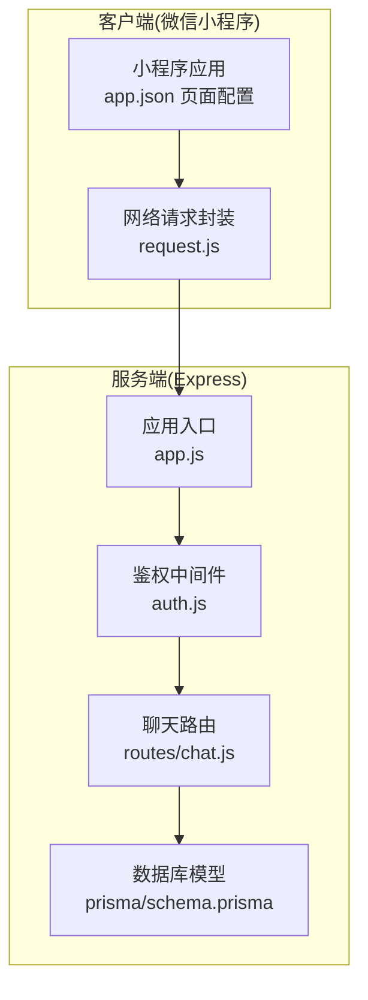
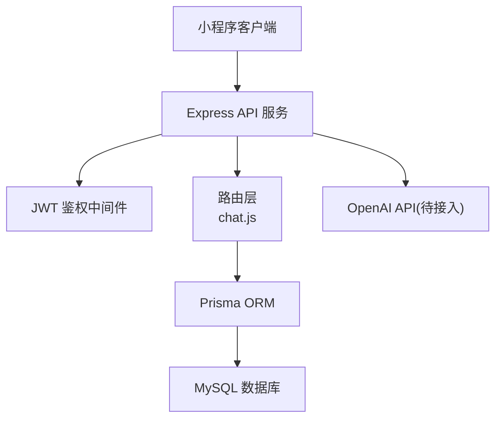
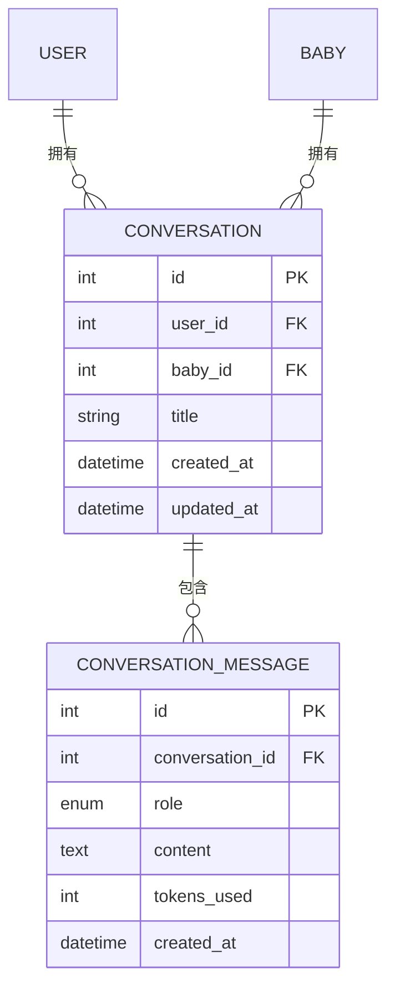
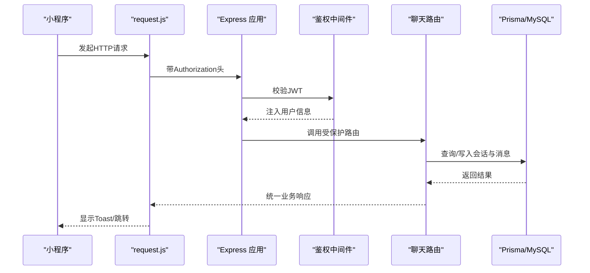
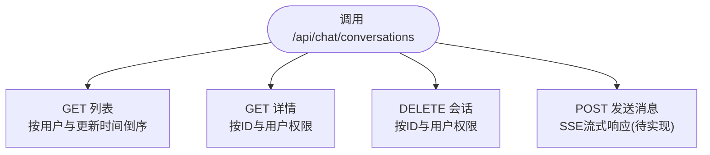
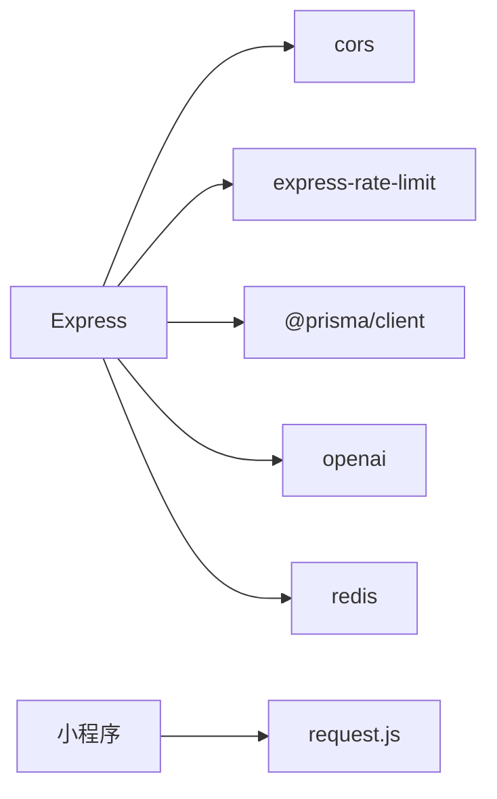

# AI聊天助手

<cite>
**本文引用的文件**
- [server/src/app.js](file://server/src/app.js)
- [server/src/routes/chat.js](file://server/src/routes/chat.js)
- [server/src/middleware/auth.js](file://server/src/middleware/auth.js)
- [server/prisma/schema.prisma](file://server/prisma/schema.prisma)
- [server/package.json](file://server/package.json)
- [miniprogram/utils/request.js](file://miniprogram/utils/request.js)
- [miniprogram/app.json](file://miniprogram/app.json)
</cite>

## 目录
1. [简介](#简介)
2. [项目结构](#项目结构)
3. [核心组件](#核心组件)
4. [架构总览](#架构总览)
5. [详细组件分析](#详细组件分析)
6. [依赖关系分析](#依赖关系分析)
7. [性能考虑](#性能考虑)
8. [故障排查指南](#故障排查指南)
9. [结论](#结论)
10. [附录](#附录)

## 简介
本项目为“安心育儿”微信小程序配套的AI聊天助手系统，目标是提供基于OpenAI API的智能问答能力，支持SSE流式响应、对话历史管理与持久化、实时消息传输机制，并通过统一的鉴权与限流中间件保障服务稳定性。当前后端已实现基础路由与数据库模型，AI对话接口在后续版本中逐步完善；前端提供统一网络请求封装与页面导航配置。

## 项目结构
- 服务端采用Express框架，使用Prisma进行MySQL数据访问，集成JWT鉴权与全局限流，提供健康检查与REST接口。
- 客户端为微信小程序，通过统一请求工具发起HTTP请求，页面配置在app.json中集中管理。

图表来源
- [server/src/app.js:1-65](file://server/src/app.js#L1-L65)
- [server/src/middleware/auth.js:1-29](file://server/src/middleware/auth.js#L1-L29)
- [server/src/routes/chat.js:1-57](file://server/src/routes/chat.js#L1-L57)
- [server/prisma/schema.prisma:1-189](file://server/prisma/schema.prisma#L1-L189)
- [miniprogram/utils/request.js:1-97](file://miniprogram/utils/request.js#L1-L97)
- [miniprogram/app.json:1-60](file://miniprogram/app.json#L1-L60)

章节来源
- [server/src/app.js:1-65](file://server/src/app.js#L1-L65)
- [miniprogram/app.json:1-60](file://miniprogram/app.json#L1-L60)

## 核心组件
- 应用入口与中间件
  - Express应用初始化、CORS、JSON解析、URL编码解析、全局限流、健康检查、路由注册、404与错误处理。
- 鉴权中间件
  - 从Authorization头解析Bearer Token，校验JWT有效性，注入用户信息到请求上下文。
- 聊天路由
  - 提供对话列表、对话详情、删除对话等接口；AI对话发送接口预留待实现。
- 数据模型
  - 用户、宝宝、成长记录、对话会话、对话消息、知识库、收藏等模型定义与索引。
- 小程序请求封装
  - 统一baseUrl、自动注入Authorization、业务错误码处理、Token过期自动刷新、Toast提示与加载状态。

章节来源
- [server/src/app.js:14-55](file://server/src/app.js#L14-L55)
- [server/src/middleware/auth.js:7-26](file://server/src/middleware/auth.js#L7-L26)
- [server/src/routes/chat.js:14-54](file://server/src/routes/chat.js#L14-L54)
- [server/prisma/schema.prisma:106-142](file://server/prisma/schema.prisma#L106-L142)
- [miniprogram/utils/request.js:21-96](file://miniprogram/utils/request.js#L21-L96)

## 架构总览
系统采用前后端分离架构：前端通过HTTP请求与后端交互；后端以Express提供REST接口，使用Prisma访问MySQL；JWT用于用户鉴权，全局限流防止滥用；数据库模型覆盖用户、宝宝、对话与消息等核心实体。

图表来源
- [server/src/app.js:33-47](file://server/src/app.js#L33-L47)
- [server/src/middleware/auth.js:7-26](file://server/src/middleware/auth.js#L7-L26)
- [server/src/routes/chat.js:1-12](file://server/src/routes/chat.js#L1-L12)
- [server/prisma/schema.prisma:106-142](file://server/prisma/schema.prisma#L106-L142)
- [server/package.json:23](file://server/package.json#L23)

## 详细组件分析

### 聊天会话与消息数据模型
- 会话表Conversation：关联用户与宝宝，记录标题、创建时间与更新时间。
- 消息表ConversationMessage：记录角色(user/assistant/system)、内容、token用量与时间戳。
- 关系：一个会话包含多条消息，删除会话时级联删除消息。

图表来源
- [server/prisma/schema.prisma:106-142](file://server/prisma/schema.prisma#L106-L142)

章节来源
- [server/prisma/schema.prisma:106-142](file://server/prisma/schema.prisma#L106-L142)

### 鉴权中间件与请求流程
- 鉴权逻辑：校验Authorization头是否以Bearer开头，解析并验证JWT，失败时返回401。
- 请求流程：小程序通过request.js发起请求，自动注入Authorization头，处理业务错误码与Token过期。

图表来源
- [miniprogram/utils/request.js:21-73](file://miniprogram/utils/request.js#L21-L73)
- [server/src/middleware/auth.js:7-26](file://server/src/middleware/auth.js#L7-L26)
- [server/src/routes/chat.js:14-54](file://server/src/routes/chat.js#L14-L54)
- [server/prisma/schema.prisma:106-142](file://server/prisma/schema.prisma#L106-L142)

章节来源
- [miniprogram/utils/request.js:21-96](file://miniprogram/utils/request.js#L21-L96)
- [server/src/middleware/auth.js:7-26](file://server/src/middleware/auth.js#L7-L26)

### 聊天路由与接口说明
- 获取对话列表：按用户查询最近会话，支持排序与数量限制。
- 获取对话详情：按会话ID与用户权限查询，包含按时间排序的消息。
- 删除对话：按会话ID与用户权限删除，成功返回ok。
- 发送消息：预留接口，Sprint 4实现SSE流式响应。

图表来源
- [server/src/routes/chat.js:14-54](file://server/src/routes/chat.js#L14-L54)

章节来源
- [server/src/routes/chat.js:14-54](file://server/src/routes/chat.js#L14-L54)

### WebSocket接口文档与消息格式规范
- 当前仓库未包含WebSocket相关实现或配置，建议在后续版本中引入WebSocket或SSE以实现实时消息推送。
- 接口规划（概念性）：
  - 连接建立：携带Authorization头，服务端验证后建立连接。
  - 消息格式：统一JSON对象，包含消息类型、会话ID、消息内容、时间戳等字段。
  - 断线重连：客户端检测断线后指数退避重连，服务端维护心跳与超时清理。
  - 错误处理：定义标准错误码与错误信息，如未授权、会话不存在、参数非法等。

[本节为概念性说明，不直接对应具体源码文件]

## 依赖关系分析
- 服务端依赖
  - Express提供Web框架，CORS跨域，express-rate-limit限流，Prisma访问MySQL，OpenAI SDK接入大模型，Redis可选用于缓存或会话存储。
- 客户端依赖
  - 微信小程序原生API，request.js封装网络请求。

图表来源
- [server/package.json:14-24](file://server/package.json#L14-L24)

章节来源
- [server/package.json:14-24](file://server/package.json#L14-L24)

## 性能考虑
- 限流策略：全局每IP每分钟最多60次请求，避免突发流量冲击。
- 数据库优化：为常用查询字段建立索引（如会话表的用户与宝宝组合索引），减少查询开销。
- 缓存策略：可使用Redis缓存热点对话摘要与近期消息，降低数据库压力。
- 响应优化：分页获取对话列表，限制返回数量；消息按时间升序返回，避免一次性传输大量数据。

章节来源
- [server/src/app.js:19-25](file://server/src/app.js#L19-L25)
- [server/prisma/schema.prisma:119](file://server/prisma/schema.prisma#L119)

## 故障排查指南
- 401未授权
  - 检查Authorization头是否正确携带Bearer Token；确认JWT未过期；核对用户信息是否注入到请求上下文。
- 业务错误码
  - request.js对code=401进行Token过期处理，清除本地存储并触发重新登录；其他业务错误显示Toast提示。
- 接口不存在
  - 404统一处理，检查路由注册与URL拼接。
- 健康检查
  - 访问/api/health确认服务可用。

章节来源
- [server/src/middleware/auth.js:10-25](file://server/src/middleware/auth.js#L10-L25)
- [miniprogram/utils/request.js:48-57](file://miniprogram/utils/request.js#L48-L57)
- [server/src/app.js:49-55](file://server/src/app.js#L49-L55)
- [server/src/app.js:28-30](file://server/src/app.js#L28-L30)

## 结论
本项目已完成基础服务端骨架与数据库模型，具备完善的鉴权与限流机制，为后续接入OpenAI API与实现SSE流式响应打下良好基础。建议优先完成聊天路由的AI对话发送接口与SSE实现，同时完善前端实时渲染与错误重连策略，确保用户体验流畅稳定。

## 附录

### 集成示例：AI对话流程（概念性）
- 步骤
  - 客户端发起发送消息请求，携带会话ID与用户输入。
  - 服务端校验鉴权与会话权限，调用OpenAI API。
  - OpenAI返回SSE流，服务端逐段转发给客户端。
  - 客户端实时渲染消息，支持中断与重试。
  - 服务端持久化消息与token用量。
- 前端优化
  - 使用虚拟滚动渲染历史消息；输入框防抖提交；加载态与占位符提升感知。
  - 断线重连：指数退避+最大重试次数；本地缓存未完成消息。

[本节为概念性说明，不直接对应具体源码文件]