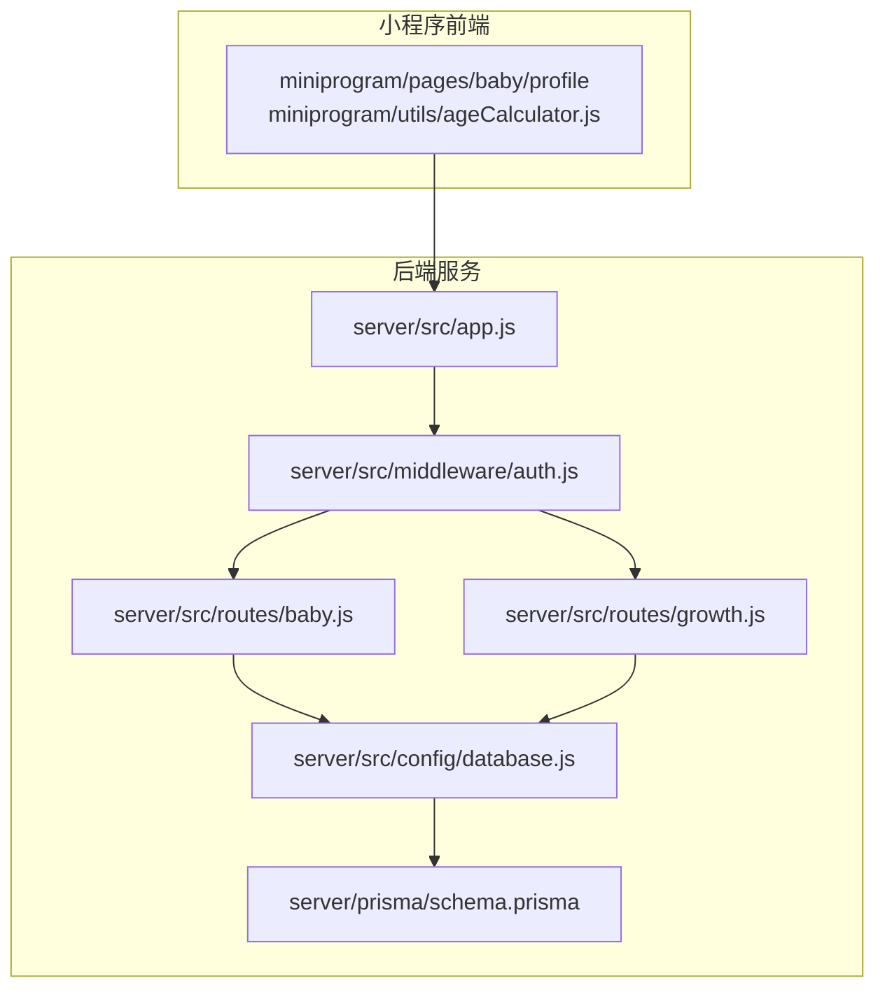
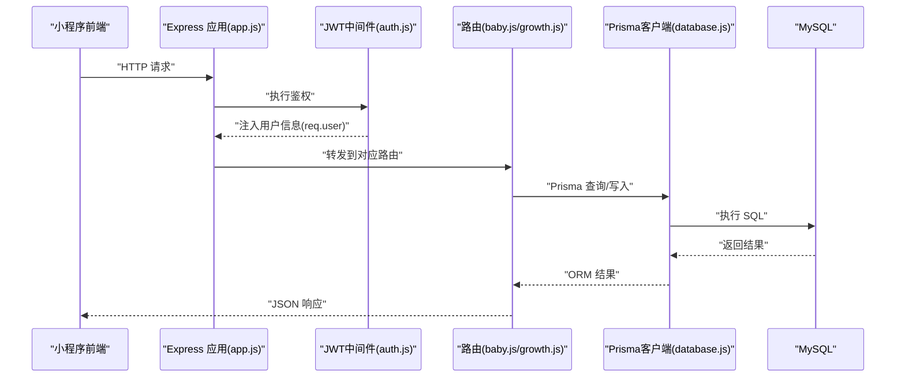
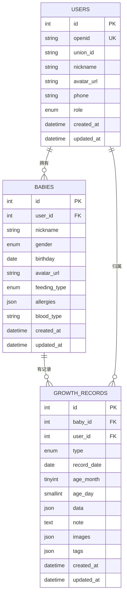
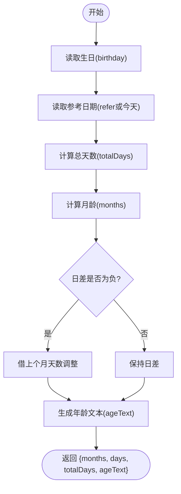
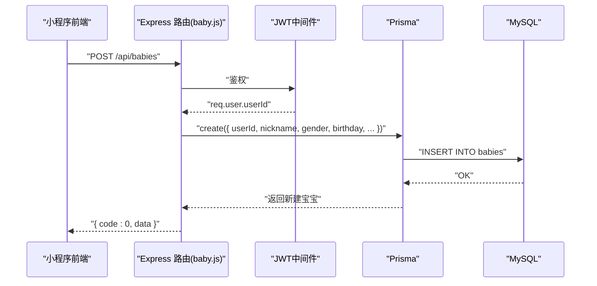
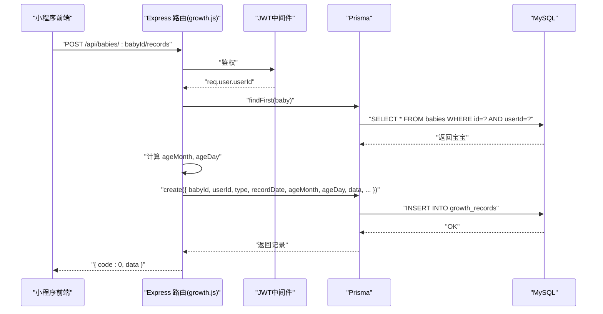
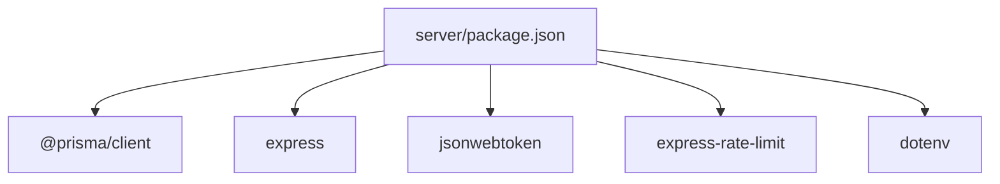

# 宝宝档案管理

<cite>
**本文引用的文件**
- [schema.prisma](file://server/prisma/schema.prisma)
- [baby.js](file://server/src/routes/baby.js)
- [growth.js](file://server/src/routes/growth.js)
- [ageCalculator.js](file://miniprogram/utils/ageCalculator.js)
- [auth.js](file://server/src/middleware/auth.js)
- [errorHandler.js](file://server/src/middleware/errorHandler.js)
- [app.js](file://server/src/app.js)
- [database.js](file://server/src/config/database.js)
- [package.json](file://server/package.json)
- [PRD.md](file://docs/PRD.md)
</cite>

## 目录
1. [简介](#简介)
2. [项目结构](#项目结构)
3. [核心组件](#核心组件)
4. [架构总览](#架构总览)
5. [详细组件分析](#详细组件分析)
6. [依赖分析](#依赖分析)
7. [性能考虑](#性能考虑)
8. [故障排查指南](#故障排查指南)
9. [结论](#结论)
10. [附录](#附录)

## 简介
本文件为“安心育儿”小程序后端中“宝宝档案管理”模块的综合技术文档。围绕宝宝信息的数据模型设计、CRUD 接口、月龄自动计算算法、性别与喂养类型管理进行深入解析；同时阐述 Prisma ORM 模型定义、数据库表结构关系与数据验证规则，给出完整的 API 接口规范、业务逻辑实现与数据流转过程，并提供增删改查操作示例与与其他模块的数据关联关系。

## 项目结构
后端采用 Node.js + Express 架构，使用 Prisma 作为 ORM，数据库为 MySQL。核心目录与职责如下：
- server/prisma/schema.prisma：数据库模型定义（Prisma Schema）
- server/src/config/database.js：Prisma 客户端单例配置
- server/src/routes/baby.js：宝宝档案 CRUD 路由
- server/src/routes/growth.js：成长记录路由（与月龄计算相关）
- server/src/middleware/auth.js：JWT 鉴权中间件
- server/src/middleware/errorHandler.js：全局错误处理
- server/src/app.js：应用入口与路由注册
- miniprogram/utils/ageCalculator.js：小程序侧月龄/日龄计算工具
- docs/PRD.md：产品需求与接口规范说明

图表来源
- [app.js:32-47](file://server/src/app.js#L32-L47)
- [auth.js:7-26](file://server/src/middleware/auth.js#L7-L26)
- [baby.js:9-32](file://server/src/routes/baby.js#L9-L32)
- [growth.js:6-44](file://server/src/routes/growth.js#L6-L44)
- [database.js:7-14](file://server/src/config/database.js#L7-L14)
- [schema.prisma:41-60](file://server/prisma/schema.prisma#L41-L60)

章节来源
- [app.js:14-62](file://server/src/app.js#L14-L62)
- [package.json:6-12](file://server/package.json#L6-L12)

## 核心组件
- 数据模型（Prisma ORM）
  - 用户表：用户标识、角色、关联宝宝与对话
  - 宝宝表：用户关联、昵称、性别、生日、头像、喂养类型、过敏、血型、创建/更新时间
  - 成长记录表：宝宝与用户关联、记录类型、记录日期、月龄/日龄、JSON 数据、备注、图片、标签
- 路由层（Express）
  - 宝宝档案：创建、查询、更新
  - 成长记录：新增、列表查询、详情、更新、删除
- 中间件
  - JWT 鉴权：从 Authorization 头解析并验证 token，注入用户信息
  - 全局错误处理：统一返回格式，区分 Prisma 错误与自定义业务错误
- 工具
  - 月龄/日龄计算：服务端与小程序侧均提供计算逻辑，确保一致性

章节来源
- [schema.prisma:14-31](file://server/prisma/schema.prisma#L14-L31)
- [schema.prisma:41-60](file://server/prisma/schema.prisma#L41-L60)
- [schema.prisma:74-94](file://server/prisma/schema.prisma#L74-L94)
- [baby.js:9-97](file://server/src/routes/baby.js#L9-L97)
- [growth.js:6-115](file://server/src/routes/growth.js#L6-L115)
- [auth.js:7-26](file://server/src/middleware/auth.js#L7-L26)
- [errorHandler.js:6-39](file://server/src/middleware/errorHandler.js#L6-L39)
- [ageCalculator.js:7-41](file://miniprogram/utils/ageCalculator.js#L7-L41)

## 架构总览
系统采用前后端分离架构，小程序前端通过 HTTPS 调用后端 API；后端使用 Express 提供 RESTful 接口，Prisma 访问 MySQL。鉴权采用 JWT，全局中间件负责限流、CORS 与错误处理。

图表来源
- [app.js:32-47](file://server/src/app.js#L32-L47)
- [auth.js:7-26](file://server/src/middleware/auth.js#L7-L26)
- [baby.js:9-32](file://server/src/routes/baby.js#L9-L32)
- [growth.js:6-44](file://server/src/routes/growth.js#L6-L44)
- [database.js:7-14](file://server/src/config/database.js#L7-L14)

## 详细组件分析

### 数据模型与表结构关系
- 实体与字段
  - 用户：id、openid、unionId、nickname、avatarUrl、phone、role、createdAt、updatedAt
  - 宝宝：id、userId、nickname、gender、birthday、avatarUrl、feedingType、allergies、bloodType、createdAt、updatedAt
  - 成长记录：id、babyId、userId、type、recordDate、ageMonth、ageDay、data、note、images、tags、createdAt、updatedAt
- 关系
  - 用户与宝宝：一对多（用户拥有多个宝宝），删除用户时级联删除宝宝
  - 宝宝与成长记录：一对多（宝宝有多条成长记录），删除宝宝时级联删除记录
  - 成长记录与用户：多对一（记录归属用户），删除用户时级联删除记录
- 索引与约束
  - 宝宝表：索引(userId)，外键(user_id) -> users(id)
  - 成长记录表：复合索引(baby_id, record_date)、(baby_id, type)，外键约束
  - 用户表：索引(openid)
- 枚举
  - Gender：male、female
  - FeedingType：breast、formula、mixed
  - RecordType：growth、feeding、sleep、milestone、photo、health、note
  - Role：mother、father、grandparent、other

图表来源
- [schema.prisma:14-31](file://server/prisma/schema.prisma#L14-L31)
- [schema.prisma:41-60](file://server/prisma/schema.prisma#L41-L60)
- [schema.prisma:74-94](file://server/prisma/schema.prisma#L74-L94)

章节来源
- [schema.prisma:14-31](file://server/prisma/schema.prisma#L14-L31)
- [schema.prisma:41-60](file://server/prisma/schema.prisma#L41-L60)
- [schema.prisma:74-94](file://server/prisma/schema.prisma#L74-L94)

### 月龄自动计算算法
- 服务端算法
  - 基于当前时间与宝宝生日计算：月龄 = (年差×12 + 月差)，日龄 = 两个日期之间的总天数
  - 在查询单个宝宝信息与新增成长记录时，均会计算 ageMonth 与 ageDay 并写入记录
- 小程序侧算法
  - 提供更细致的文本化年龄展示（如“X个月”、“X天”、“X个月X天”），并包含日期格式化与友好日期显示
- 一致性保障
  - 建议前后端统一使用相同的日期计算逻辑，避免展示与存储不一致

图表来源
- [ageCalculator.js:7-41](file://miniprogram/utils/ageCalculator.js#L7-L41)
- [baby.js:50-65](file://server/src/routes/baby.js#L50-L65)
- [growth.js:16-24](file://server/src/routes/growth.js#L16-L24)

章节来源
- [ageCalculator.js:7-41](file://miniprogram/utils/ageCalculator.js#L7-L41)
- [baby.js:50-65](file://server/src/routes/baby.js#L50-L65)
- [growth.js:16-24](file://server/src/routes/growth.js#L16-L24)

### 性别与喂养类型管理
- 性别（Gender）
  - 支持 male、female，用于性别识别与知识库/报告的个性化展示
- 喂养类型（FeedingType）
  - 支持 breast、formula、mixed，默认值为 breast
  - 与成长记录中的喂养记录类型协同，便于后续统计与报告生成
- 数据验证
  - 宝宝创建时对必填字段进行校验（昵称、性别、生日）
  - 成长记录新增时对必填字段进行校验（类型、日期、数据）

章节来源
- [schema.prisma:62-71](file://server/prisma/schema.prisma#L62-L71)
- [schema.prisma:67-71](file://server/prisma/schema.prisma#L67-L71)
- [baby.js:13-15](file://server/src/routes/baby.js#L13-L15)
- [growth.js:12-14](file://server/src/routes/growth.js#L12-L14)

### 宝宝档案 CRUD 接口
- 创建宝宝档案
  - 方法与路径：POST /api/babies
  - 请求体字段：nickname、gender、birthday、feedingType（可选，默认 breast）、bloodType、avatarUrl（可选）
  - 鉴权：需 JWT
  - 返回：创建后的宝宝对象
- 获取宝宝信息（含自动月龄）
  - 方法与路径：GET /api/babies/:id
  - 鉴权：需 JWT
  - 返回：包含 ageMonths、totalDays、格式化后的 birthday
- 更新宝宝信息
  - 方法与路径：PUT /api/babies/:id
  - 请求体字段：nickname、gender、birthday、feedingType、bloodType、avatarUrl（任选其一或多个）
  - 鉴权：需 JWT
  - 返回：更新后的宝宝对象

图表来源
- [baby.js:9-32](file://server/src/routes/baby.js#L9-L32)
- [auth.js:7-26](file://server/src/middleware/auth.js#L7-L26)
- [database.js:7-14](file://server/src/config/database.js#L7-L14)

章节来源
- [baby.js:9-97](file://server/src/routes/baby.js#L9-L97)
- [PRD.md:704-707](file://docs/PRD.md#L704-L707)

### 成长记录接口（与月龄计算相关）
- 新增记录
  - 方法与路径：POST /api/babies/:babyId/records
  - 请求体字段：type、recordDate、data（必填）、note、images、tags
  - 鉴权：需 JWT
  - 业务逻辑：查询宝宝并计算 ageMonth、ageDay，写入记录
- 查询列表（分页、按类型筛选）
  - 方法与路径：GET /api/babies/:babyId/records
  - 查询参数：type（可选）、page、pageSize（默认 20）
  - 返回：records、total、page、pageSize
- 记录详情
  - 方法与路径：GET /api/babies/:babyId/records/:id
- 更新记录
  - 方法与路径：PUT /api/babies/:babyId/records/:id
  - 请求体字段：data、note（可选）、images、tags
- 删除记录
  - 方法与路径：DELETE /api/babies/:babyId/records/:id

图表来源
- [growth.js:6-44](file://server/src/routes/growth.js#L6-L44)
- [auth.js:7-26](file://server/src/middleware/auth.js#L7-L26)
- [database.js:7-14](file://server/src/config/database.js#L7-L14)

章节来源
- [growth.js:6-115](file://server/src/routes/growth.js#L6-L115)
- [PRD.md:709-716](file://docs/PRD.md#L709-L716)

### 数据验证规则
- 宝宝档案
  - 必填：nickname、gender、birthday
  - 默认：feedingType 默认 breast
- 成长记录
  - 必填：type、recordDate、data
- 其他
  - JWT 鉴权缺失或失效时返回 401
  - 未找到资源时返回 404
  - Prisma 唯一约束冲突返回 409

章节来源
- [baby.js:13-15](file://server/src/routes/baby.js#L13-L15)
- [growth.js:12-14](file://server/src/routes/growth.js#L12-L14)
- [errorHandler.js:10-23](file://server/src/middleware/errorHandler.js#L10-L23)

### 与其他模块的数据关联关系
- 与用户模块
  - 宝宝与用户通过 userId 关联，确保数据隔离；删除用户时级联删除宝宝与其记录
- 与成长记录模块
  - 宝宝与成长记录为一对多；新增记录时同步计算月龄/日龄
- 与知识库模块
  - 月龄知识库按 month 与 section 维度组织，与宝宝当前月龄关联，用于 AI 对话与报告生成
- 与 AI 对话模块
  - 会话与消息表关联用户与宝宝，AI 回答时结合宝宝月龄与近期记录

章节来源
- [schema.prisma:54-56](file://server/prisma/schema.prisma#L54-L56)
- [schema.prisma:89-93](file://server/prisma/schema.prisma#L89-L93)
- [schema.prisma:115-117](file://server/prisma/schema.prisma#L115-L117)
- [PRD.md:340-365](file://docs/PRD.md#L340-L365)

## 依赖分析
- 运行时依赖
  - @prisma/client：ORM 客户端
  - express、cors、express-rate-limit：Web 框架与中间件
  - jsonwebtoken：JWT 鉴权
  - dotenv：环境变量加载
  - openai、redis、cos-nodejs-sdk-v5：AI、缓存与对象存储（PRD 中提及）
- 开发依赖
  - prisma、nodemon：数据库迁移与开发调试
- 脚本命令
  - db:migrate、db:studio、db:generate：Prisma 相关命令

图表来源
- [package.json:14-29](file://server/package.json#L14-L29)

章节来源
- [package.json:14-29](file://server/package.json#L14-L29)

## 性能考虑
- 数据库层面
  - 为宝宝与记录表建立复合索引，提升查询性能（按 baby_id 与 record_date 或 type）
  - 使用外键约束保证数据一致性，避免脏数据
- 服务端层面
  - 全局限流（每分钟 60 次）防止滥用
  - Prisma 客户端单例，避免重复初始化
- 前端层面
  - 月龄计算在服务端与小程序侧分别实现，建议统一逻辑，减少重复计算与展示差异

## 故障排查指南
- 401 未授权
  - 检查 Authorization 头是否以 Bearer 开头，token 是否过期或无效
- 404 资源不存在
  - 确认资源 ID 是否正确，用户是否对资源有访问权限
- 409 唯一约束冲突
  - 检查是否存在重复的唯一字段（如 openid）
- 500 服务器内部错误
  - 查看服务端日志，确认错误堆栈与环境变量配置

章节来源
- [auth.js:10-25](file://server/src/middleware/auth.js#L10-L25)
- [errorHandler.js:10-39](file://server/src/middleware/errorHandler.js#L10-L39)

## 结论
本模块以 Prisma ORM 为核心，围绕宝宝档案与成长记录建立了清晰的数据模型与接口规范。通过 JWT 鉴权与全局错误处理保障安全性与稳定性；月龄/日龄计算贯穿于查询与新增记录流程，确保数据一致性与用户体验。建议在后续迭代中统一前后端计算逻辑，完善数据校验与索引优化，进一步提升性能与可维护性。

## 附录
- API 接口清单（节选）
  - 创建宝宝档案：POST /api/babies
  - 获取宝宝信息：GET /api/babies/:id
  - 更新宝宝信息：PUT /api/babies/:id
  - 新增成长记录：POST /api/babies/:babyId/records
  - 查询记录列表：GET /api/babies/:babyId/records
  - 记录详情：GET /api/babies/:babyId/records/:id
  - 更新记录：PUT /api/babies/:babyId/records/:id
  - 删除记录：DELETE /api/babies/:babyId/records/:id

章节来源
- [PRD.md:704-731](file://docs/PRD.md#L704-L731)
- [baby.js:9-97](file://server/src/routes/baby.js#L9-L97)
- [growth.js:6-115](file://server/src/routes/growth.js#L6-L115)