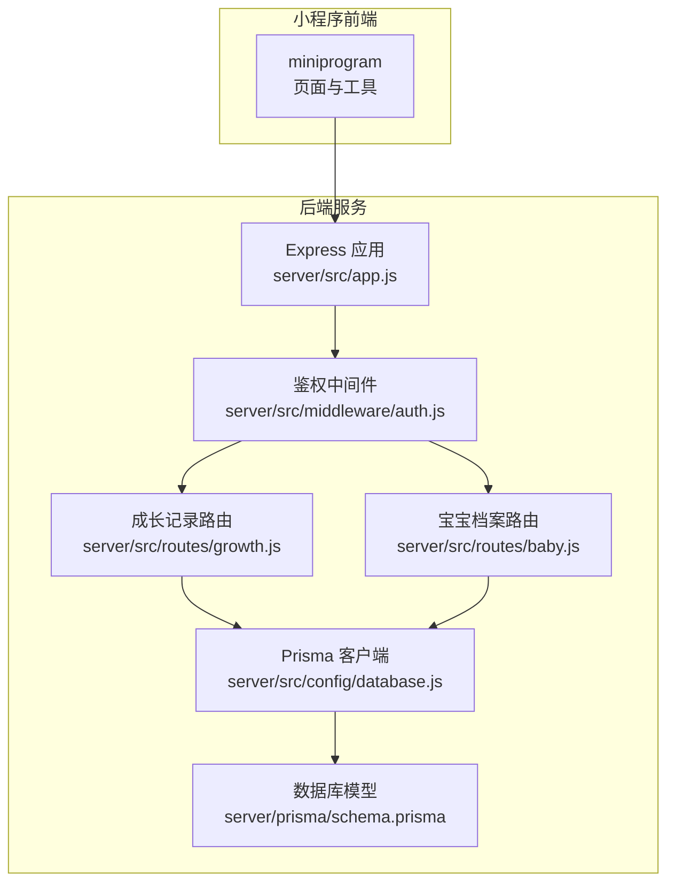
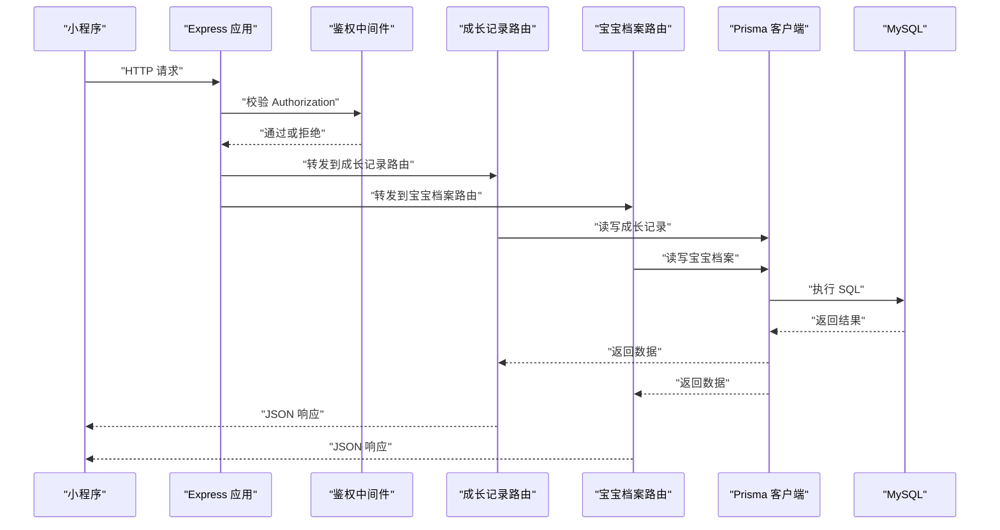
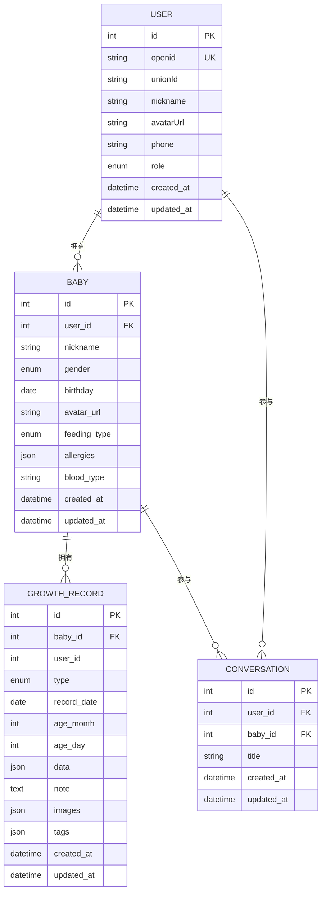
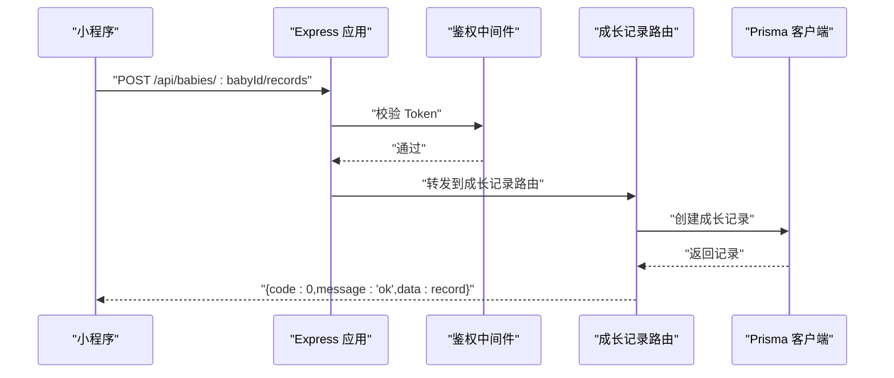
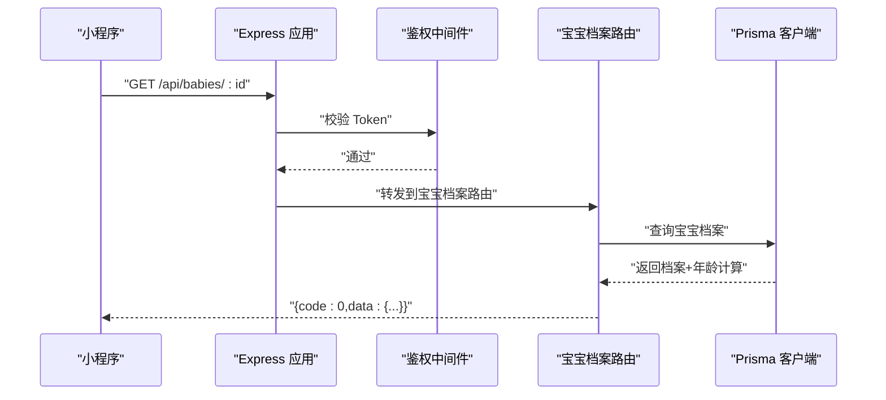
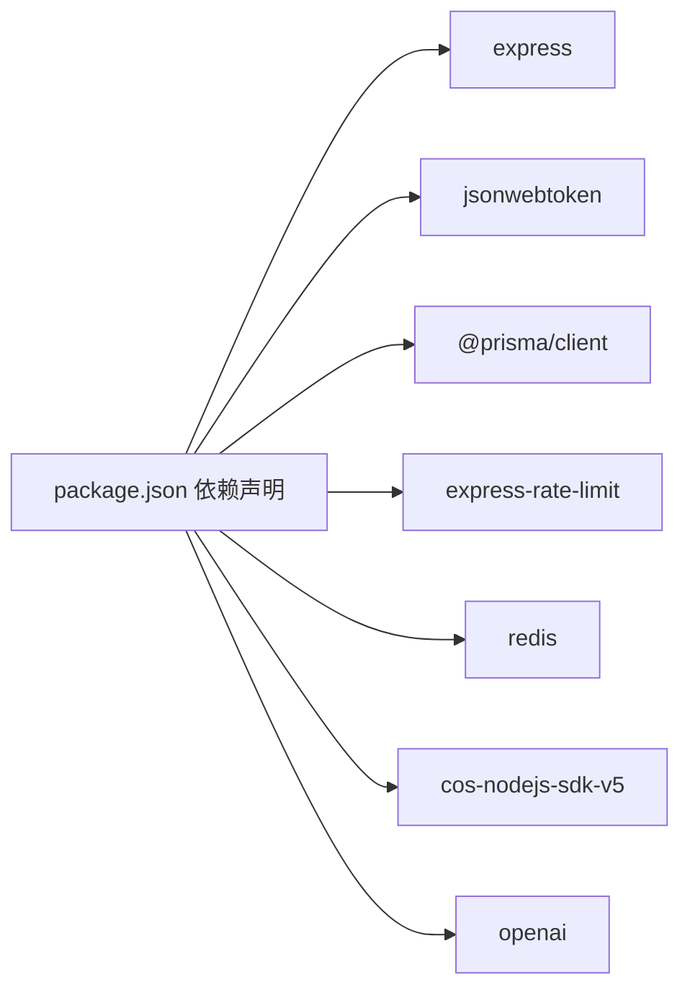

# 成长记录系统

<cite>
**本文引用的文件**
- [server/src/app.js](file://server/src/app.js)
- [server/prisma/schema.prisma](file://server/prisma/schema.prisma)
- [server/src/routes/growth.js](file://server/src/routes/growth.js)
- [server/src/routes/baby.js](file://server/src/routes/baby.js)
- [server/src/middleware/auth.js](file://server/src/middleware/auth.js)
- [server/src/config/database.js](file://server/src/config/database.js)
- [server/package.json](file://server/package.json)
- [miniprogram/utils/request.js](file://miniprogram/utils/request.js)
</cite>

## 目录
1. [简介](#简介)
2. [项目结构](#项目结构)
3. [核心组件](#核心组件)
4. [架构总览](#架构总览)
5. [详细组件分析](#详细组件分析)
6. [依赖关系分析](#依赖关系分析)
7. [性能考虑](#性能考虑)
8. [故障排查指南](#故障排查指南)
9. [结论](#结论)
10. [附录](#附录)

## 简介
本项目是一个面向“安心育儿”微信小程序的成长记录系统，提供宝宝档案管理、成长记录录入与查询、以及基于记录的统计分析能力。系统采用前后端分离架构：前端为微信小程序，后端基于 Node.js + Express 提供 REST API；数据持久化使用 Prisma + MySQL；通过 JWT 实现用户鉴权；通过限流中间件保障服务稳定性。

## 项目结构
后端服务位于 server 目录，包含应用入口、路由、中间件、数据库配置与 Prisma 模型定义；前端位于 miniprogram 目录，包含页面、组件、工具函数与样式资源。整体结构清晰，职责划分明确。

**图示来源**
- [server/src/app.js:1-65](file://server/src/app.js#L1-L65)
- [server/src/middleware/auth.js:1-29](file://server/src/middleware/auth.js#L1-L29)
- [server/src/routes/growth.js:1-118](file://server/src/routes/growth.js#L1-L118)
- [server/src/routes/baby.js:1-100](file://server/src/routes/baby.js#L1-L100)
- [server/src/config/database.js:1-17](file://server/src/config/database.js#L1-L17)
- [server/prisma/schema.prisma:1-189](file://server/prisma/schema.prisma#L1-L189)

**章节来源**
- [server/src/app.js:1-65](file://server/src/app.js#L1-L65)
- [server/prisma/schema.prisma:1-189](file://server/prisma/schema.prisma#L1-L189)

## 核心组件
- 应用入口与路由注册：负责初始化 Express、启用 CORS、JSON 解析、限流策略、健康检查、路由挂载与全局错误处理。
- 鉴权中间件：从请求头提取并校验 JWT，向后续路由注入用户上下文。
- 成长记录路由：提供记录的增删改查、分页与类型筛选。
- 宝宝档案路由：提供宝宝档案的创建、查询与更新。
- 数据库配置：Prisma 客户端单例，开发环境下开启查询日志。
- 小程序请求封装：统一请求地址、注入 Authorization、错误处理与 Token 过期处理。

**章节来源**
- [server/src/app.js:14-55](file://server/src/app.js#L14-L55)
- [server/src/middleware/auth.js:7-26](file://server/src/middleware/auth.js#L7-L26)
- [server/src/routes/growth.js:6-115](file://server/src/routes/growth.js#L6-L115)
- [server/src/routes/baby.js:9-96](file://server/src/routes/baby.js#L9-L96)
- [server/src/config/database.js:7-14](file://server/src/config/database.js#L7-L14)
- [miniprogram/utils/request.js:21-73](file://miniprogram/utils/request.js#L21-L73)

## 架构总览
系统采用三层架构：表现层（小程序）、服务层（Express 路由与控制器）、数据层（Prisma + MySQL）。鉴权中间件贯穿所有受保护路由，确保用户身份与数据隔离。

**图示来源**
- [server/src/app.js:32-47](file://server/src/app.js#L32-L47)
- [server/src/middleware/auth.js:7-26](file://server/src/middleware/auth.js#L7-L26)
- [server/src/routes/growth.js:6-115](file://server/src/routes/growth.js#L6-L115)
- [server/src/routes/baby.js:9-96](file://server/src/routes/baby.js#L9-L96)
- [server/src/config/database.js:7-14](file://server/src/config/database.js#L7-L14)

## 详细组件分析

### 数据模型设计
- 用户表：存储 openid、unionId、昵称、头像、手机号、角色等字段，支持多宝宝关联。
- 宝宝档案表：关联用户，记录宝宝昵称、性别、生日、喂养方式、过敏史、血型等，并与成长记录建立一对多关系。
- 成长记录表：记录类型（身高体重、睡眠、喂养、里程碑、照片、健康、笔记等），支持 JSON 结构存储具体数据，同时保留备注、图片、标签等扩展字段；包含月龄与日龄字段，便于统计分析。
- 对话与知识库：用于扩展聊天与知识问答能力（与成长记录相关但非核心）。

**图示来源**
- [server/prisma/schema.prisma:14-60](file://server/prisma/schema.prisma#L14-L60)
- [server/prisma/schema.prisma:74-94](file://server/prisma/schema.prisma#L74-L94)
- [server/prisma/schema.prisma:107-136](file://server/prisma/schema.prisma#L107-L136)

**章节来源**
- [server/prisma/schema.prisma:14-189](file://server/prisma/schema.prisma#L14-L189)

### 记录类型分类与数据结构
- 记录类型枚举包含：身高体重、喂养、睡眠、里程碑、照片、健康、笔记等。每条记录以 JSON 存储具体数据，便于灵活扩展不同类型的字段组合。
- 月龄与日龄字段在新增记录时根据宝宝生日与记录日期计算，便于后续按月龄维度进行统计分析。

**章节来源**
- [server/prisma/schema.prisma:96-104](file://server/prisma/schema.prisma#L96-L104)
- [server/src/routes/growth.js:16-24](file://server/src/routes/growth.js#L16-L24)

### 数据录入与查询接口

#### 成长记录接口
- 新增记录
  - 方法与路径：POST /api/babies/:babyId/records
  - 参数：type、recordDate、data、note、images、tags
  - 行为：校验必填项，计算月龄与日龄，写入数据库
- 查询列表
  - 方法与路径：GET /api/babies/:babyId/records
  - 查询参数：type（可选）、page、pageSize（默认20）
  - 行为：分页查询并返回总数
- 获取详情
  - 方法与路径：GET /api/babies/:babyId/records/:id
  - 行为：按 ID 与 babyId 查询
- 更新记录
  - 方法与路径：PUT /api/babies/:babyId/records/:id
  - 参数：data、note、images、tags（可选）
  - 行为：部分字段更新
- 删除记录
  - 方法与路径：DELETE /api/babies/:babyId/records/:id
  - 行为：删除指定记录

**图示来源**
- [server/src/app.js:43](file://server/src/app.js#L43)
- [server/src/middleware/auth.js:7-26](file://server/src/middleware/auth.js#L7-L26)
- [server/src/routes/growth.js:7-44](file://server/src/routes/growth.js#L7-L44)
- [server/src/config/database.js:7-14](file://server/src/config/database.js#L7-L14)

**章节来源**
- [server/src/routes/growth.js:6-115](file://server/src/routes/growth.js#L6-L115)

#### 宝宝档案接口
- 创建档案：POST /api/babies
- 获取档案：GET /api/babies/:id（含自动计算月龄与总天数）
- 更新档案：PUT /api/babies/:id

**图示来源**
- [server/src/app.js:42](file://server/src/app.js#L42)
- [server/src/middleware/auth.js:7-26](file://server/src/middleware/auth.js#L7-L26)
- [server/src/routes/baby.js:37-68](file://server/src/routes/baby.js#L37-L68)
- [server/src/config/database.js:7-14](file://server/src/config/database.js#L7-L14)

**章节来源**
- [server/src/routes/baby.js:9-96](file://server/src/routes/baby.js#L9-L96)

### 统计分析与图表实现
- 月龄维度聚合：利用记录表中的 ageMonth 字段，按月龄分组进行平均值、最大值、最小值等统计。
- 时间序列趋势：按 recordDate 排序，绘制身高体重、睡眠时长、喂养量等随时间变化的趋势线。
- 分类统计：按 RecordType 进行分组，统计各类别记录数量与占比。
- 图表建议：结合前端可视化库（如 ECharts 或开源替代方案）渲染折线图、柱状图与散点图。

[本节为概念性说明，不直接分析具体文件，故无“章节来源”]

### 数据验证规则
- 必填项：type、recordDate、data（新增记录）；nickname、gender、birthday（创建宝宝档案）。
- 类型约束：枚举类型（Gender、FeedingType、RecordType、MessageRole、KnowledgeSection、FavoriteType）严格限定取值范围。
- 权限控制：所有受保护路由需携带有效 JWT；操作仅限当前用户下的宝宝数据。
- 输入校验：路由层对关键参数进行存在性与格式校验，异常通过统一错误处理器返回。

**章节来源**
- [server/src/routes/growth.js:12-14](file://server/src/routes/growth.js#L12-L14)
- [server/src/routes/baby.js:13-15](file://server/src/routes/baby.js#L13-L15)
- [server/src/middleware/auth.js:10-25](file://server/src/middleware/auth.js#L10-L25)

### 不同类型成长数据处理逻辑
- 身高体重记录：data 字段存储身高、体重数值及单位；可按月龄分组计算 P25/P50/P75 百分位趋势。
- 睡眠记录：data 字段存储入睡时间、醒来时间、总时长等；可计算日均睡眠时长与分布。
- 喂养记录：data 字段存储奶量、次数、间隔时间等；可统计日摄入总量与喂养频率。
- 里程碑/健康/笔记/照片：以 JSON 扩展字段承载文本描述与附件，便于检索与展示。

**章节来源**
- [server/prisma/schema.prisma:96-104](file://server/prisma/schema.prisma#L96-L104)
- [server/src/routes/growth.js:25-38](file://server/src/routes/growth.js#L25-L38)

### 业务场景示例
- 场景一：新增一次身高体重测量记录
  - 步骤：调用新增记录接口，type=身高体重，recordDate=当日日期，data 包含身高与体重数值，提交后系统自动计算月龄与日龄。
- 场景二：查看某月龄段的平均睡眠时长
  - 步骤：查询记录列表，筛选 type=睡眠，按 ageMonth 分组求平均值，生成月度报告。
- 场景三：统计某时间段内的喂养次数与总量
  - 步骤：筛选 type=喂养，按 recordDate 聚合，计算总次数与总量，生成趋势图。

**章节来源**
- [server/src/routes/growth.js:46-73](file://server/src/routes/growth.js#L46-L73)

## 依赖关系分析
- 后端依赖：Express、CORS、限流中间件、Prisma、MySQL、JWT、Redis、COS SDK、OpenAI 等。
- 关键耦合点：路由依赖鉴权中间件；路由依赖 Prisma 客户端；应用入口集中注册路由与中间件。
- 外部集成：上传模块使用 COS SDK；对话模块使用 OpenAI；缓存使用 Redis。

**图示来源**
- [server/package.json:14-29](file://server/package.json#L14-L29)

**章节来源**
- [server/package.json:14-29](file://server/package.json#L14-L29)

## 性能考虑
- 限流策略：全局限流每 IP 每分钟最多 60 次请求，避免突发流量冲击。
- 分页查询：记录列表默认每页 20 条，减少一次性传输大量数据。
- 索引优化：成长记录表对 (babyId, recordDate) 与 (babyId, type) 建有索引，提升查询效率。
- 日志级别：开发环境开启 Prisma 查询日志，生产环境仅记录错误与警告。

**章节来源**
- [server/src/app.js:19-25](file://server/src/app.js#L19-L25)
- [server/prisma/schema.prisma:91-93](file://server/prisma/schema.prisma#L91-L93)
- [server/src/config/database.js:8](file://server/src/config/database.js#L8)

## 故障排查指南
- 401 未授权：检查 Authorization 头是否包含有效的 Bearer Token，确认 Token 未过期。
- 404 接口不存在：确认请求路径与方法正确，路由已挂载到 /api 前缀下。
- 404 记录不存在/宝宝不存在：确认 babyId 与记录 ID 是否属于当前用户。
- 业务错误：响应体包含 code 与 message 字段，根据提示修正参数。
- 网络错误：小程序侧会弹出网络连接失败提示，检查本地代理与跨域设置。

**章节来源**
- [server/src/middleware/auth.js:10-25](file://server/src/middleware/auth.js#L10-L25)
- [server/src/routes/growth.js:81](file://server/src/routes/growth.js#L81)
- [server/src/routes/baby.js:46-48](file://server/src/routes/baby.js#L46-L48)
- [miniprogram/utils/request.js:48-62](file://miniprogram/utils/request.js#L48-L62)

## 结论
本系统以清晰的分层架构与严谨的数据模型为基础，提供了完整的成长记录管理能力。通过 JWT 鉴权、限流与统一错误处理保障了安全性与稳定性；通过 JSON 扩展字段与月龄日龄统计维度，满足多样化的成长数据记录与分析需求。建议后续完善统计分析服务与图表渲染模块，进一步提升用户体验。

## 附录
- 健康检查：GET /api/health
- 环境变量：NODE_ENV、DATABASE_URL、JWT_SECRET
- 开发命令：db:migrate、db:seed、db:studio、db:generate、dev、start

**章节来源**
- [server/src/app.js:28-30](file://server/src/app.js#L28-L30)
- [server/package.json:6-12](file://server/package.json#L6-L12)