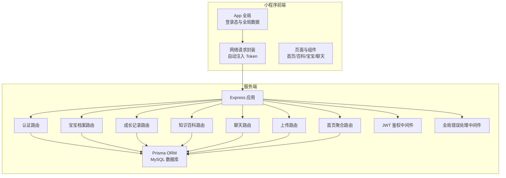
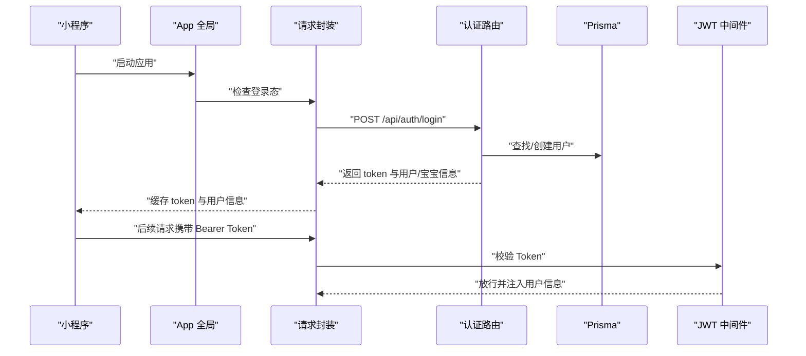
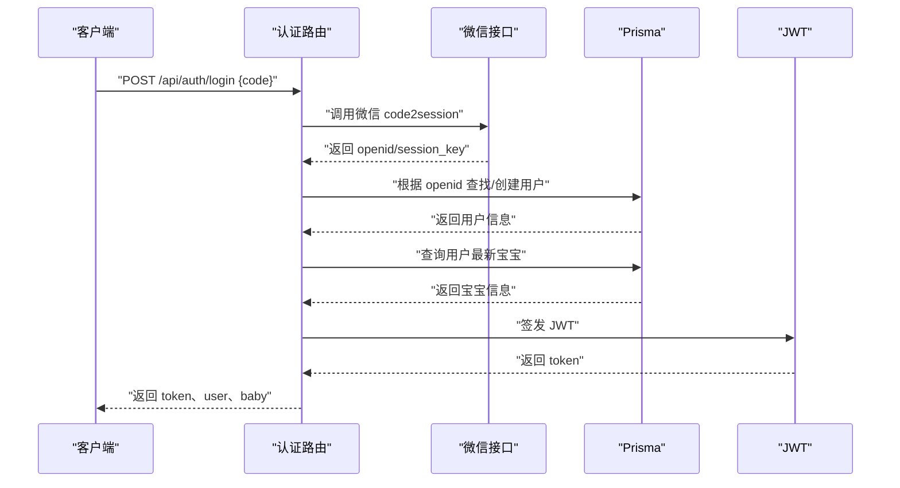
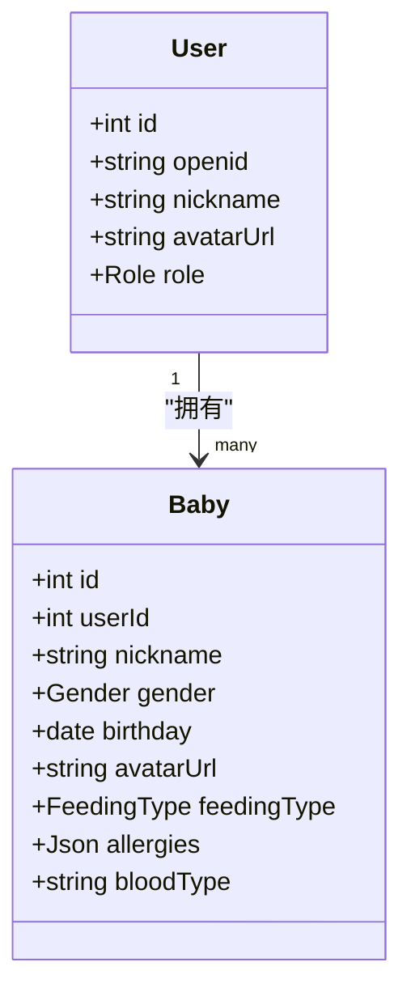
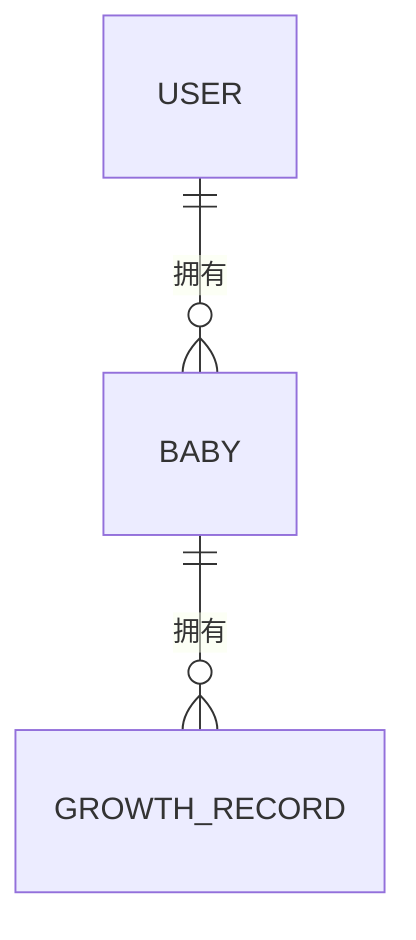
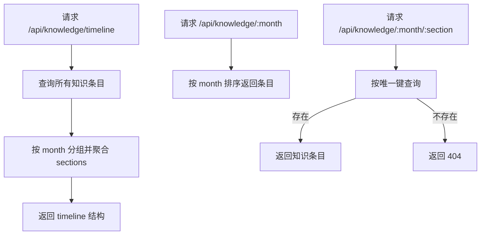
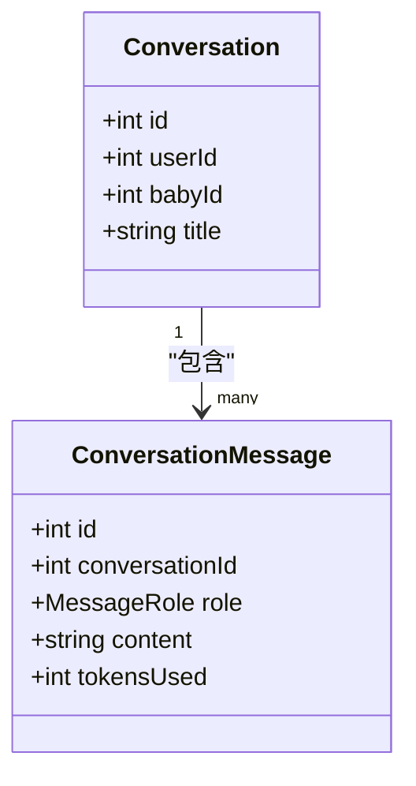
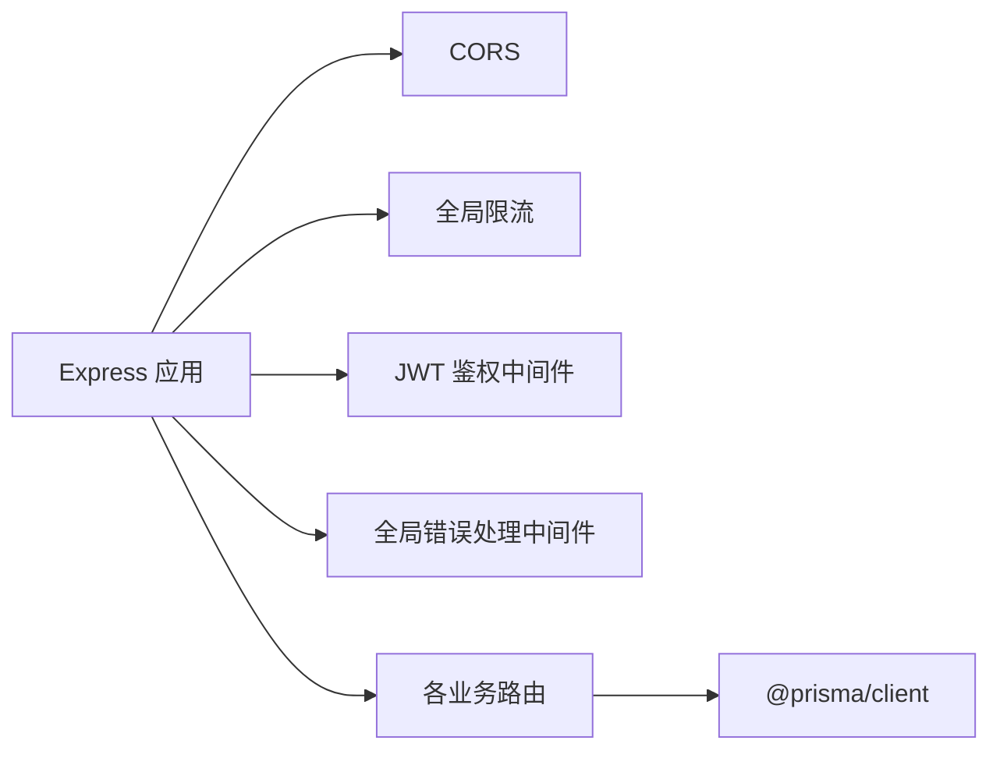

# 核心功能模块

<cite>
**本文引用的文件**
- [server/src/app.js](file://server/src/app.js)
- [server/package.json](file://server/package.json)
- [server/prisma/schema.prisma](file://server/prisma/schema.prisma)
- [server/src/middleware/auth.js](file://server/src/middleware/auth.js)
- [server/src/middleware/errorHandler.js](file://server/src/middleware/errorHandler.js)
- [server/src/routes/auth.js](file://server/src/routes/auth.js)
- [server/src/routes/baby.js](file://server/src/routes/baby.js)
- [server/src/routes/growth.js](file://server/src/routes/growth.js)
- [server/src/routes/knowledge.js](file://server/src/routes/knowledge.js)
- [server/src/routes/chat.js](file://server/src/routes/chat.js)
- [server/src/routes/upload.js](file://server/src/routes/upload.js)
- [server/src/routes/home.js](file://server/src/routes/home.js)
- [miniprogram/app.js](file://miniprogram/app.js)
- [miniprogram/app.json](file://miniprogram/app.json)
- [miniprogram/utils/request.js](file://miniprogram/utils/request.js)
</cite>

## 目录
1. [简介](#简介)
2. [项目结构](#项目结构)
3. [核心组件](#核心组件)
4. [架构总览](#架构总览)
5. [详细组件分析](#详细组件分析)
6. [依赖分析](#依赖分析)
7. [性能考虑](#性能考虑)
8. [故障排查指南](#故障排查指南)
9. [结论](#结论)
10. [附录](#附录)

## 简介
本文件面向“AI育儿助手”项目的核心功能模块，系统性梳理用户认证系统、宝宝档案管理、成长记录系统、AI聊天助手、知识百科系统等主要模块的业务逻辑、API 设计与数据流转。文档以代码为依据，结合时序图、类图与流程图，帮助开发者快速理解模块职责、协作关系与扩展点；同时提供错误处理机制说明与常见问题排查建议。

## 项目结构
项目采用前后端分离架构：
- 小程序前端（miniprogram）：负责页面导航、用户交互、网络请求与本地状态存储。
- 服务端（server）：基于 Express 的 REST API，使用 Prisma 管理 MySQL 数据库，集成鉴权、限流与统一错误处理。

图表来源
- [server/src/app.js:32-47](file://server/src/app.js#L32-L47)
- [server/src/middleware/auth.js:7-26](file://server/src/middleware/auth.js#L7-L26)
- [server/src/middleware/errorHandler.js:6-39](file://server/src/middleware/errorHandler.js#L6-L39)
- [server/prisma/schema.prisma:14-189](file://server/prisma/schema.prisma#L14-L189)

章节来源
- [server/src/app.js:14-62](file://server/src/app.js#L14-L62)
- [miniprogram/app.json:24-55](file://miniprogram/app.json#L24-L55)

## 核心组件
- 用户认证系统：基于微信 code2session 获取用户标识，创建或查询用户，签发 JWT 并下发用户与默认宝宝信息。
- 宝宝档案管理：创建/查询/更新宝宝档案，自动计算月龄与总天数。
- 成长记录系统：支持多类型记录（身高体重、喂养、睡眠、里程碑、照片、健康、备注），支持分页查询与更新删除。
- 知识百科系统：按月龄与板块维度提供知识概览与详情。
- AI聊天助手：提供会话列表、会话详情与删除能力，AI对话发送接口预留。
- 上传服务：图片上传接口预留。
- 首页聚合：返回宝宝信息、最新身高体重、当月发育提示等。

章节来源
- [server/src/routes/auth.js:10-81](file://server/src/routes/auth.js#L10-L81)
- [server/src/routes/baby.js:9-97](file://server/src/routes/baby.js#L9-L97)
- [server/src/routes/growth.js:6-115](file://server/src/routes/growth.js#L6-L115)
- [server/src/routes/knowledge.js:5-56](file://server/src/routes/knowledge.js#L5-L56)
- [server/src/routes/chat.js:5-54](file://server/src/routes/chat.js#L5-L54)
- [server/src/routes/upload.js:4-6](file://server/src/routes/upload.js#L4-L6)
- [server/src/routes/home.js:5-59](file://server/src/routes/home.js#L5-L59)

## 架构总览
整体采用“小程序前端 + Express 后端 + Prisma + MySQL”的技术栈。前端通过统一请求封装自动注入 Authorization 头，后端通过 JWT 中间件校验身份，全局错误处理中间件统一输出错误码与消息。

图表来源
- [miniprogram/app.js:18-67](file://miniprogram/app.js#L18-L67)
- [server/src/routes/auth.js:10-81](file://server/src/routes/auth.js#L10-L81)
- [server/src/middleware/auth.js:7-26](file://server/src/middleware/auth.js#L7-L26)

## 详细组件分析

### 用户认证系统
- 业务逻辑
  - 使用微信 code2session 获取 openid。
  - 在数据库中查找或创建用户，读取该用户最新宝宝信息。
  - 生成 JWT（7 天有效期），返回 token、过期时间与用户/宝宝信息。
- API 设计
  - POST /api/auth/login
    - 请求体：code（必填）
    - 返回：token、expiresIn、user、baby（可空）
- 数据流转
  - 微信接口 -> 本地用户/宝宝查询 -> JWT 签发 -> 前端缓存 token 与用户信息。
- 错误处理
  - 缺少参数、微信登录失败、数据库异常均通过统一错误中间件返回标准格式。

图表来源
- [server/src/routes/auth.js:10-81](file://server/src/routes/auth.js#L10-L81)

章节来源
- [server/src/routes/auth.js:10-81](file://server/src/routes/auth.js#L10-L81)
- [server/src/middleware/errorHandler.js:6-39](file://server/src/middleware/errorHandler.js#L6-L39)

### 宝宝档案管理
- 业务逻辑
  - 创建：校验必填字段，绑定当前用户，写入默认喂养方式。
  - 查询：按 ID 与用户权限查询，自动计算月龄与总天数。
  - 更新：按需更新昵称、性别、生日、喂养方式、血型、头像等。
- API 设计
  - POST /api/babies
  - GET /api/babies/:id
  - PUT /api/babies/:id
- 数据模型
  - User 与 Baby 一对多，外键约束保证数据隔离。

图表来源
- [server/prisma/schema.prisma:14-60](file://server/prisma/schema.prisma#L14-L60)

章节来源
- [server/src/routes/baby.js:9-97](file://server/src/routes/baby.js#L9-L97)
- [server/prisma/schema.prisma:40-60](file://server/prisma/schema.prisma#L40-L60)

### 成长记录系统
- 业务逻辑
  - 新增记录时根据宝宝生日计算月龄与日龄，支持多种记录类型（身高体重、喂养、睡眠、里程碑、照片、健康、备注）。
  - 列表查询支持按类型过滤与分页，详情、更新、删除操作按记录 ID 与所属宝宝进行权限校验。
- API 设计
  - POST /api/babies/:babyId/records
  - GET /api/babies/:babyId/records
  - GET /api/babies/:babyId/records/:id
  - PUT /api/babies/:babyId/records/:id
  - DELETE /api/babies/:babyId/records/:id
- 数据模型
  - GrowthRecord 关联 Baby，索引覆盖查询场景。

图表来源
- [server/prisma/schema.prisma:74-94](file://server/prisma/schema.prisma#L74-L94)
- [server/prisma/schema.prisma:40-60](file://server/prisma/schema.prisma#L40-L60)

章节来源
- [server/src/routes/growth.js:6-115](file://server/src/routes/growth.js#L6-L115)
- [server/prisma/schema.prisma:74-104](file://server/prisma/schema.prisma#L74-L104)

### 知识百科系统
- 业务逻辑
  - 时间线：按月龄聚合知识条目，展示各板块标题。
  - 月度详情：按月返回该月全部知识条目。
  - 板块详情：按月+板块唯一定位知识条目。
- API 设计
  - GET /api/knowledge/timeline
  - GET /api/knowledge/:month
  - GET /api/knowledge/:month/:section
- 数据模型
  - KnowledgeBase 按 (month, section) 唯一约束，确保每期每板块唯一。

图表来源
- [server/src/routes/knowledge.js:5-56](file://server/src/routes/knowledge.js#L5-L56)
- [server/prisma/schema.prisma:144-169](file://server/prisma/schema.prisma#L144-L169)

章节来源
- [server/src/routes/knowledge.js:5-56](file://server/src/routes/knowledge.js#L5-L56)
- [server/prisma/schema.prisma:144-169](file://server/prisma/schema.prisma#L144-L169)

### AI聊天助手
- 当前实现
  - 提供会话列表、会话详情与删除接口。
  - 对话发送接口预留（Sprint 4）。
- API 设计
  - POST /api/chat/send（预留）
  - GET /api/chat/conversations
  - GET /api/chat/conversations/:id
  - DELETE /api/chat/conversations/:id
- 数据模型
  - Conversation 与 ConversationMessage 双表关联，支持消息流式展示。

图表来源
- [server/prisma/schema.prisma:107-142](file://server/prisma/schema.prisma#L107-L142)

章节来源
- [server/src/routes/chat.js:5-54](file://server/src/routes/chat.js#L5-L54)
- [server/prisma/schema.prisma:107-142](file://server/prisma/schema.prisma#L107-L142)

### 上传服务
- 当前实现
  - 图片上传接口预留（Sprint 3），计划对接腾讯云 COS。
- API 设计
  - POST /api/upload/image（预留）

章节来源
- [server/src/routes/upload.js:4-6](file://server/src/routes/upload.js#L4-L6)

### 首页聚合
- 业务逻辑
  - 返回当前用户最新宝宝信息、自动计算月龄与总天数。
  - 获取最新身高体重记录作为“最新成长”。
  - 根据月龄从知识库抽取摘要作为“当月提醒”。
  - 推荐算法预留（Sprint 5）。
- API 设计
  - GET /api/home/dashboard

章节来源
- [server/src/routes/home.js:5-59](file://server/src/routes/home.js#L5-L59)

## 依赖分析
- 服务端依赖
  - Express：Web 框架
  - jsonwebtoken：JWT 鉴权
  - express-rate-limit：全局限流
  - @prisma/client：ORM
  - openai、redis、multer、cos-nodejs-sdk-v5：待实现能力
- 前端依赖
  - 微信小程序原生能力：登录、Storage、网络请求
- 路由与中间件
  - 所有受保护路由均挂载 JWT 中间件，404 与全局错误处理中间件统一兜底。

图表来源
- [server/src/app.js:14-55](file://server/src/app.js#L14-L55)
- [server/package.json:14-29](file://server/package.json#L14-L29)

章节来源
- [server/src/app.js:14-55](file://server/src/app.js#L14-L55)
- [server/package.json:14-29](file://server/package.json#L14-L29)

## 性能考虑
- 全局限流：每 IP 每分钟最多 60 次请求，避免突发流量冲击。
- 分页查询：成长记录列表默认分页大小 20，减少单次传输与数据库压力。
- 索引优化：Prisma 模型对常用查询字段建立索引，如成长记录的 (babyId, recordDate)、(babyId, type)。
- 异步并发：部分接口使用 Promise.all 并行查询数量与列表，提升响应速度。
- 建议
  - 对高频接口增加 Redis 缓存（如知识百科概览）。
  - 对图片上传引入 CDN 与缩略图策略。
  - 对 AI 对话引入消息队列异步处理。

## 故障排查指南
- 登录失败
  - 现象：微信 code2session 返回错误或缺少 code。
  - 处理：检查前端传参与后端环境变量配置。
- Token 过期
  - 现象：返回 401，前端自动清除本地缓存并重新登录。
  - 处理：确认 JWT_SECRET 一致且未被篡改。
- 数据不存在
  - 现象：Prisma 报错或业务层抛出 404。
  - 处理：确认用户与宝宝归属关系及记录 ID。
- 唯一约束冲突
  - 现象：返回 409。
  - 处理：检查唯一键组合（如知识库的 (month, section)）。

章节来源
- [server/src/middleware/errorHandler.js:6-39](file://server/src/middleware/errorHandler.js#L6-L39)
- [miniprogram/utils/request.js:48-86](file://miniprogram/utils/request.js#L48-L86)

## 结论
本项目围绕“认证—宝宝—成长—知识—聊天—上传—首页聚合”构建了清晰的功能闭环。前端通过统一请求封装与登录态管理，后端通过 JWT 鉴权与全局错误处理保障安全与一致性。后续可在 AI 对话、推荐算法、图片上传与缓存策略等方面持续演进，以提升用户体验与系统性能。

## 附录
- 前端页面与 Tab 导航
  - 首页、百科、宝宝、AI助手、我的等页面组织在 app.json 中统一声明。
- 健康检查
  - GET /api/health 返回服务运行状态，便于运维监控。

章节来源
- [miniprogram/app.json:24-55](file://miniprogram/app.json#L24-L55)
- [server/src/app.js:28-30](file://server/src/app.js#L28-L30)