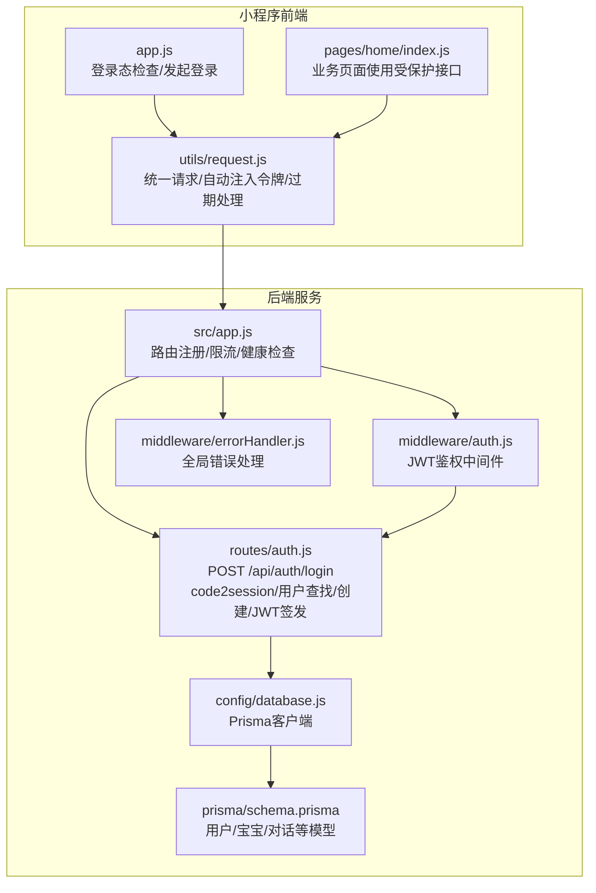
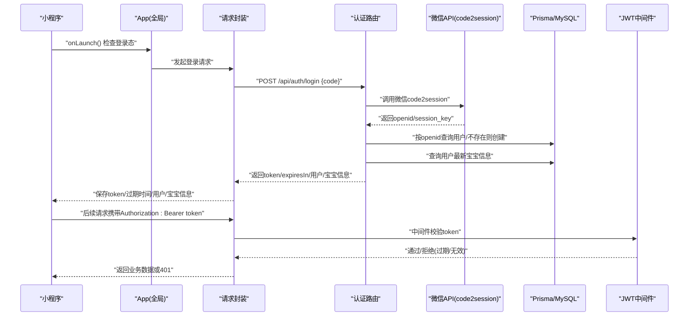
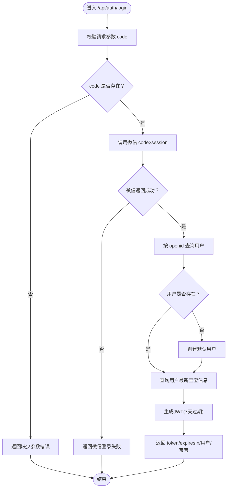
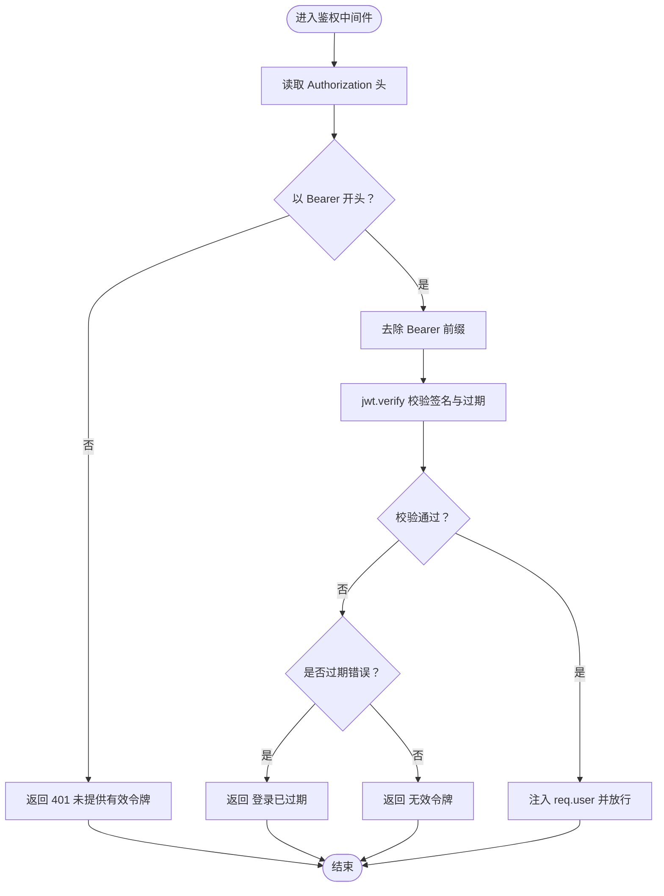
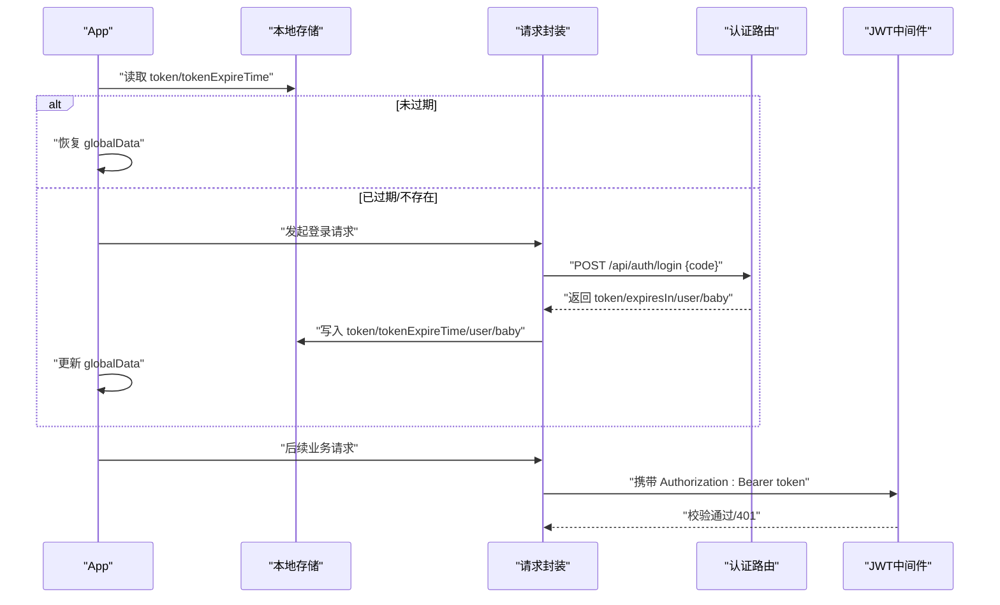
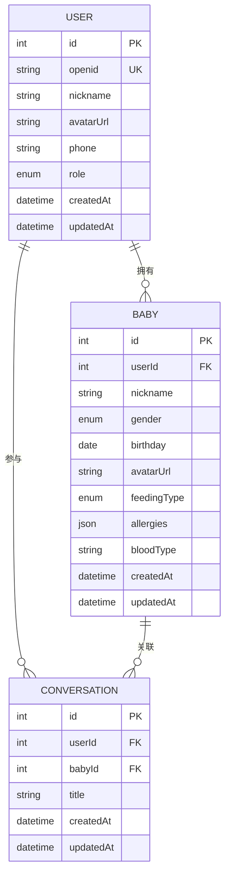
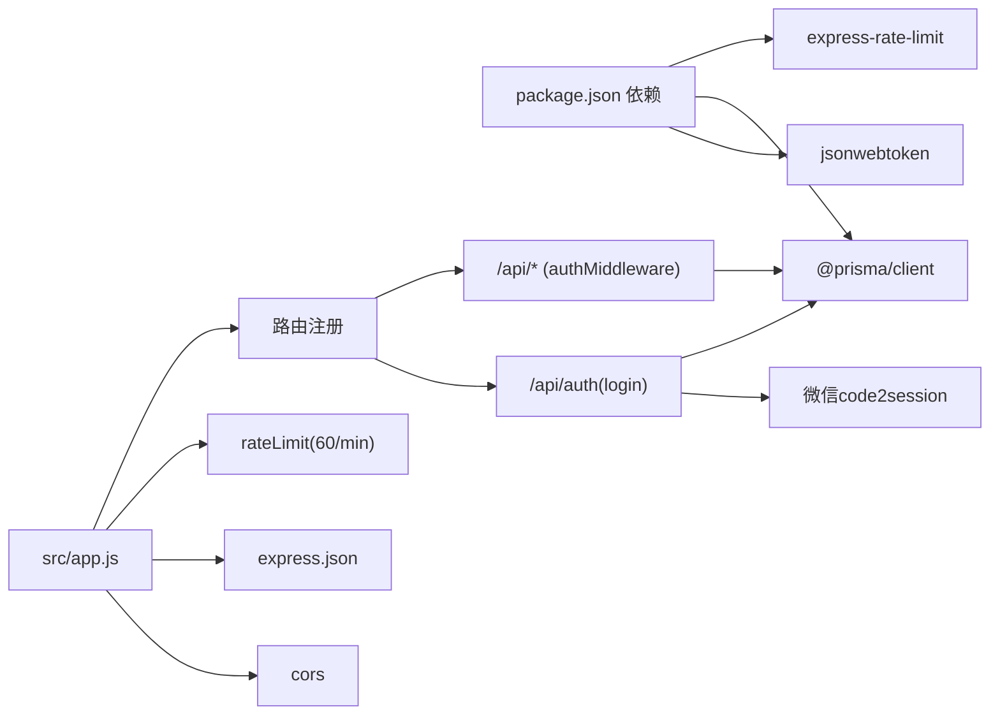

# 用户认证系统

<cite>
**本文档引用的文件**
- [server/src/routes/auth.js](file://server/src/routes/auth.js)
- [server/src/middleware/auth.js](file://server/src/middleware/auth.js)
- [server/src/middleware/errorHandler.js](file://server/src/middleware/errorHandler.js)
- [server/src/config/database.js](file://server/src/config/database.js)
- [server/prisma/schema.prisma](file://server/prisma/schema.prisma)
- [server/src/app.js](file://server/src/app.js)
- [miniprogram/utils/request.js](file://miniprogram/utils/request.js)
- [miniprogram/app.js](file://miniprogram/app.js)
- [miniprogram/pages/home/index.js](file://miniprogram/pages/home/index.js)
- [server/package.json](file://server/package.json)
</cite>

## 目录
1. [简介](#简介)
2. [项目结构](#项目结构)
3. [核心组件](#核心组件)
4. [架构总览](#架构总览)
5. [详细组件分析](#详细组件分析)
6. [依赖关系分析](#依赖关系分析)
7. [性能考虑](#性能考虑)
8. [故障排除指南](#故障排除指南)
9. [结论](#结论)
10. [附录](#附录)

## 简介
本文件面向“安心育儿”微信小程序的用户认证系统，提供从微信小程序登录、code2session调用、用户信息存储、JWT令牌生成与验证、到前端会话管理与错误处理的完整技术文档。文档覆盖以下要点：
- 微信小程序登录流程与code2session接口调用过程
- JWT令牌生成与验证机制及过期处理策略
- 用户会话管理与本地存储方案
- API接口规范、错误处理策略与安全最佳实践
- 前端集成方式与常见问题解决方案

## 项目结构
后端采用Express + Prisma + MySQL，前端为微信小程序原生框架。认证相关的关键模块分布如下：
- 后端路由：/api/auth/login 实现微信登录与JWT签发
- 中间件：鉴权中间件负责校验Authorization头中的JWT
- 错误处理：统一错误格式化与Prisma错误映射
- 数据库：Prisma Schema定义用户与宝宝等核心实体
- 前端：网络请求封装、登录态检查、令牌过期处理与重定向

**图表来源**
- [server/src/app.js:1-65](file://server/src/app.js#L1-L65)
- [server/src/routes/auth.js:1-84](file://server/src/routes/auth.js#L1-L84)
- [server/src/middleware/auth.js:1-29](file://server/src/middleware/auth.js#L1-L29)
- [server/src/middleware/errorHandler.js:1-52](file://server/src/middleware/errorHandler.js#L1-L52)
- [server/src/config/database.js:1-17](file://server/src/config/database.js#L1-L17)
- [server/prisma/schema.prisma:1-189](file://server/prisma/schema.prisma#L1-L189)
- [miniprogram/app.js:1-69](file://miniprogram/app.js#L1-L69)
- [miniprogram/utils/request.js:1-97](file://miniprogram/utils/request.js#L1-L97)
- [miniprogram/pages/home/index.js:1-114](file://miniprogram/pages/home/index.js#L1-L114)

**章节来源**
- [server/src/app.js:1-65](file://server/src/app.js#L1-L65)
- [server/src/routes/auth.js:1-84](file://server/src/routes/auth.js#L1-L84)
- [server/src/middleware/auth.js:1-29](file://server/src/middleware/auth.js#L1-L29)
- [server/src/middleware/errorHandler.js:1-52](file://server/src/middleware/errorHandler.js#L1-L52)
- [server/src/config/database.js:1-17](file://server/src/config/database.js#L1-L17)
- [server/prisma/schema.prisma:1-189](file://server/prisma/schema.prisma#L1-L189)
- [miniprogram/app.js:1-69](file://miniprogram/app.js#L1-L69)
- [miniprogram/utils/request.js:1-97](file://miniprogram/utils/request.js#L1-L97)
- [miniprogram/pages/home/index.js:1-114](file://miniprogram/pages/home/index.js#L1-L114)

## 核心组件
- 认证路由：接收小程序code，调用微信code2session，查询/创建用户，返回JWT与用户/宝宝信息
- 鉴权中间件：从Authorization头解析Bearer Token，验证并注入用户信息
- 错误处理：统一响应格式，映射Prisma特定错误码，支持自定义业务错误
- 数据模型：用户(User)、宝宝(Baby)、对话(Conversation)等，支持角色与多对多关系
- 前端请求封装：自动注入Authorization头，处理401过期并触发重新登录

**章节来源**
- [server/src/routes/auth.js:10-81](file://server/src/routes/auth.js#L10-L81)
- [server/src/middleware/auth.js:7-26](file://server/src/middleware/auth.js#L7-L26)
- [server/src/middleware/errorHandler.js:6-39](file://server/src/middleware/errorHandler.js#L6-L39)
- [server/prisma/schema.prisma:14-60](file://server/prisma/schema.prisma#L14-L60)
- [miniprogram/utils/request.js:21-73](file://miniprogram/utils/request.js#L21-L73)

## 架构总览
下图展示了从微信小程序登录到后端鉴权与数据库交互的整体流程。

**图表来源**
- [miniprogram/app.js:18-67](file://miniprogram/app.js#L18-L67)
- [miniprogram/utils/request.js:21-73](file://miniprogram/utils/request.js#L21-L73)
- [server/src/routes/auth.js:10-81](file://server/src/routes/auth.js#L10-L81)
- [server/src/middleware/auth.js:7-26](file://server/src/middleware/auth.js#L7-L26)

## 详细组件分析

### 认证路由：/api/auth/login
- 输入参数：小程序端传入的code
- 核心步骤：
  1) 校验code参数
  2) 调用微信code2session接口，获取openid与session_key
  3) 使用openid在数据库中查找用户；若不存在则创建默认用户
  4) 查询用户最新的宝宝信息（按创建时间倒序）
  5) 使用JWT对{userId, openid}进行签名，设置7天过期
  6) 返回token、过期时间、用户信息与宝宝信息
- 异常处理：微信接口返回错误码时直接返回业务错误；其他异常交由全局错误处理器

**图表来源**
- [server/src/routes/auth.js:10-81](file://server/src/routes/auth.js#L10-L81)

**章节来源**
- [server/src/routes/auth.js:10-81](file://server/src/routes/auth.js#L10-L81)

### JWT鉴权中间件
- 从Authorization头读取Bearer token
- 使用JWT_SECRET验证签名与有效期
- 将解码后的用户信息注入到req.user（包含userId与openid），供后续路由使用
- 区分过期与无效令牌，分别返回401状态

**图表来源**
- [server/src/middleware/auth.js:7-26](file://server/src/middleware/auth.js#L7-L26)

**章节来源**
- [server/src/middleware/auth.js:7-26](file://server/src/middleware/auth.js#L7-L26)

### 前端登录态检查与请求封装
- 登录态检查：读取本地token与过期时间，若未过期则恢复全局状态，否则触发登录
- 发起登录：调用wx.login获取code，向后端发送POST /api/auth/login
- 请求封装：自动在header中添加Authorization: Bearer token；处理200但业务code非0的情况；当收到401时清理本地存储并重新登录
- 页面使用：业务页面通过封装的http.get/post等方法访问受保护接口

**图表来源**
- [miniprogram/app.js:18-67](file://miniprogram/app.js#L18-L67)
- [miniprogram/utils/request.js:21-73](file://miniprogram/utils/request.js#L21-L73)

**章节来源**
- [miniprogram/app.js:18-67](file://miniprogram/app.js#L18-L67)
- [miniprogram/utils/request.js:21-73](file://miniprogram/utils/request.js#L21-L73)

### 数据模型与用户信息存储
- 用户(User)：主键id，唯一标识openid，昵称、头像、手机号、角色等字段，关联宝宝与对话
- 宝宝(Baby)：与用户一对多，包含性别、生日、喂养类型等
- 关系：用户与宝宝、用户与对话、宝宝与成长记录等均有外键约束与索引
- 存储策略：后端仅存储openid作为外部身份标识，用户昵称、头像等可在首次登录时从微信接口拉取（当前实现为默认值）

**图表来源**
- [server/prisma/schema.prisma:14-60](file://server/prisma/schema.prisma#L14-L60)
- [server/prisma/schema.prisma:107-121](file://server/prisma/schema.prisma#L107-L121)

**章节来源**
- [server/prisma/schema.prisma:14-60](file://server/prisma/schema.prisma#L14-L60)
- [server/prisma/schema.prisma:107-121](file://server/prisma/schema.prisma#L107-L121)

### API接口文档

- 健康检查
  - 方法：GET
  - 路径：/api/health
  - 用途：服务可用性检测
  - 响应：包含时间戳的结构化响应

- 用户认证
  - 方法：POST
  - 路径：/api/auth/login
  - 请求体：
    - code: 小程序通过wx.login获取的临时登录凭证
  - 成功响应：
    - code: 0
    - data.token: JWT字符串
    - data.expiresIn: 过期秒数（7天）
    - data.user: 用户信息（id、nickname、avatarUrl、role）
    - data.baby: 宝宝信息（可为空）
  - 失败响应：
    - 缺少参数：返回400
    - 微信登录失败：返回400并包含微信错误信息
    - 其他异常：交由全局错误处理器

- 受保护接口（示例）
  - 路由：/api/babies、/api/chat、/api/upload、/api/home
  - 鉴权：在请求头中添加Authorization: Bearer <token>
  - 作用域：仅通过JWT验证的用户可访问

**章节来源**
- [server/src/app.js:28-55](file://server/src/app.js#L28-L55)
- [server/src/routes/auth.js:10-81](file://server/src/routes/auth.js#L10-L81)
- [server/src/middleware/auth.js:7-26](file://server/src/middleware/auth.js#L7-L26)

## 依赖关系分析
- Express应用启动时加载dotenv，注册CORS、JSON解析、限流中间件
- 路由注册：/api/auth对外开放，其余路由均需JWT鉴权
- 数据库：Prisma单例客户端，开发环境下开启查询日志
- 依赖包：jsonwebtoken用于JWT，@prisma/client用于数据库访问，express-rate-limit用于限流

**图表来源**
- [server/package.json:14-29](file://server/package.json#L14-L29)
- [server/src/app.js:14-47](file://server/src/app.js#L14-L47)

**章节来源**
- [server/package.json:14-29](file://server/package.json#L14-L29)
- [server/src/app.js:14-47](file://server/src/app.js#L14-L47)

## 性能考虑
- 全局限流：每分钟每个IP最多60次请求，避免滥用
- JWT过期时间：7天，平衡安全性与用户体验
- 数据库查询：按openid建立索引，减少用户查找成本
- 前端缓存：登录成功后缓存token与用户/宝宝信息，减少重复登录

[本节为通用建议，无需具体文件引用]

## 故障排除指南
- 401 未提供有效认证令牌
  - 检查请求头是否包含Authorization: Bearer token
  - 确认token未被篡改或已被删除
- 401 登录已过期，请重新登录
  - 前端会自动清理本地存储并触发登录流程
  - 建议在页面加载时调用登录态检查
- 400 缺少 code 参数
  - 确保小程序端正确调用wx.login并传递code
- 400 微信登录失败
  - 检查微信AppID与Secret配置，确认网络可达
- 服务器内部错误
  - 开发环境下查看控制台日志，生产环境返回通用错误信息

**章节来源**
- [server/src/middleware/auth.js:10-25](file://server/src/middleware/auth.js#L10-L25)
- [server/src/middleware/errorHandler.js:6-39](file://server/src/middleware/errorHandler.js#L6-L39)
- [miniprogram/utils/request.js:48-86](file://miniprogram/utils/request.js#L48-L86)

## 结论
该认证系统以微信code2session为基础，结合JWT实现无状态会话管理，配合前端登录态检查与自动过期处理，形成闭环的安全登录体验。数据库模型清晰，路由与中间件职责明确，错误处理统一规范。建议在生产环境中进一步强化密钥管理、引入HTTPS、完善审计日志与监控告警。

[本节为总结，无需具体文件引用]

## 附录

### 安全最佳实践
- 密钥管理：JWT_SECRET与微信AppID/Secret置于环境变量，避免硬编码
- 传输安全：生产环境启用HTTPS，防止中间人攻击
- 权限最小化：仅在必要路由上启用鉴权中间件
- 日志脱敏：避免在日志中输出敏感信息如token
- 速率限制：保持现有限流策略，防止暴力破解
- 令牌刷新：当前实现为固定7天过期，可考虑短期令牌+刷新令牌策略

[本节为通用建议，无需具体文件引用]