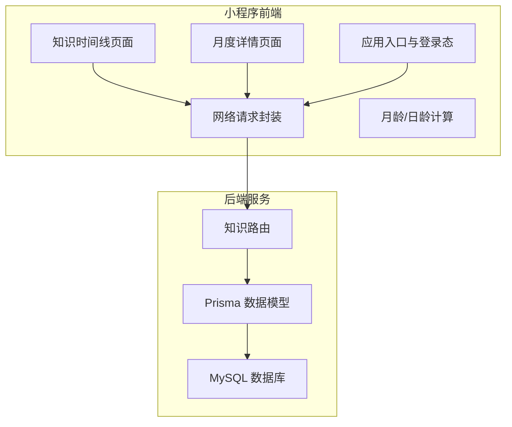
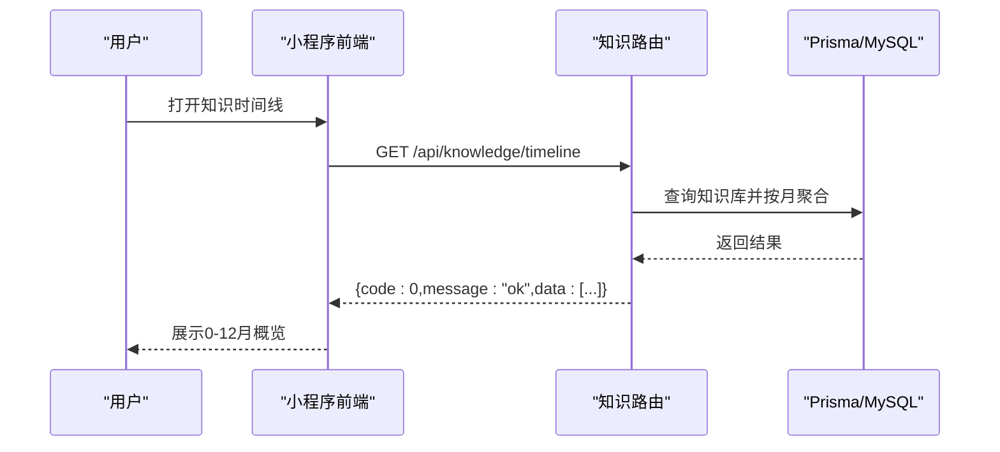
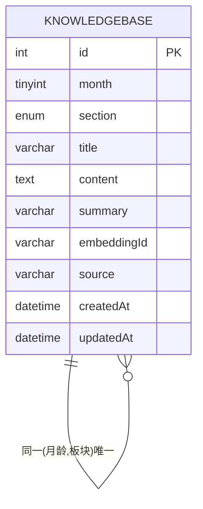
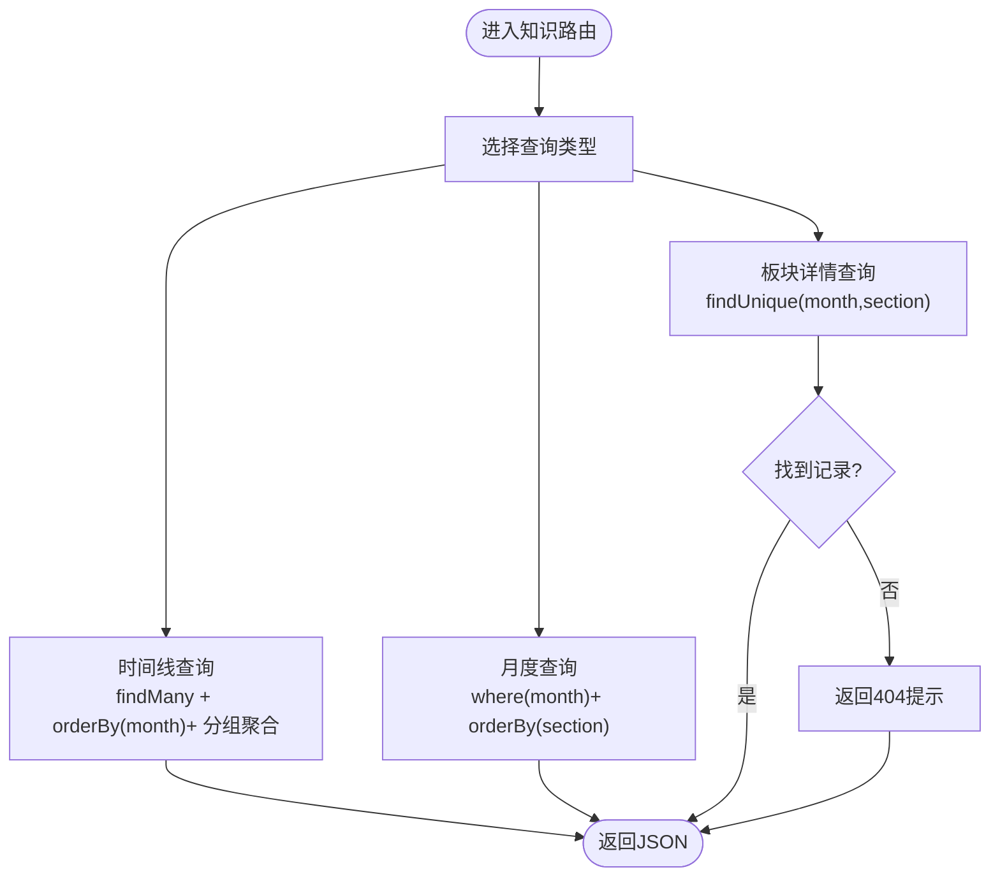
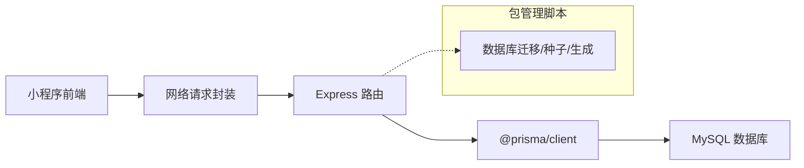

# 知识百科系统

<cite>
**本文引用的文件**
- [server/src/routes/knowledge.js](file://server/src/routes/knowledge.js)
- [server/prisma/schema.prisma](file://server/prisma/schema.prisma)
- [miniprogram/utils/ageCalculator.js](file://miniprogram/utils/ageCalculator.js)
- [miniprogram/utils/request.js](file://miniprogram/utils/request.js)
- [miniprogram/pages/knowledge/timeline.json](file://miniprogram/pages/knowledge/timeline.json)
- [miniprogram/pages/knowledge/month-detail.json](file://miniprogram/pages/knowledge/month-detail.json)
- [miniprogram/app.js](file://miniprogram/app.js)
- [miniprogram/app.json](file://miniprogram/app.json)
- [server/package.json](file://server/package.json)
</cite>

## 目录
1. [简介](#简介)
2. [项目结构](#项目结构)
3. [核心组件](#核心组件)
4. [架构总览](#架构总览)
5. [详细组件分析](#详细组件分析)
6. [依赖关系分析](#依赖关系分析)
7. [性能考虑](#性能考虑)
8. [故障排查指南](#故障排查指南)
9. [结论](#结论)
10. [附录](#附录)

## 简介
本项目是一个面向育儿场景的知识百科系统，围绕“月龄”维度组织知识内容，提供从0-12月的月度知识概览、按板块分类的知识详情，以及与用户宝宝档案和成长记录联动的使用体验。系统采用微信小程序前端与Node.js+Express后端配合，数据持久化通过Prisma ORM映射至MySQL数据库。

## 项目结构
- 前端（miniprogram）
  - 页面：知识时间线、月度详情、首页、宝宝档案、聊天等
  - 工具：网络请求封装、月龄/日龄计算
  - 应用入口：全局状态管理、登录态检查与微信登录
- 后端（server）
  - 路由：知识相关接口（时间线、月度列表、板块详情）
  - 数据模型：Prisma Schema定义知识库、用户、宝宝、对话、收藏等
  - 包管理：脚本用于迁移、种子数据、Prisma客户端生成

图表来源
- [server/src/routes/knowledge.js:1-59](file://server/src/routes/knowledge.js#L1-L59)
- [server/prisma/schema.prisma:144-168](file://server/prisma/schema.prisma#L144-L168)
- [miniprogram/utils/request.js:1-97](file://miniprogram/utils/request.js#L1-L97)
- [miniprogram/app.js:1-69](file://miniprogram/app.js#L1-L69)

章节来源
- [miniprogram/app.json:1-60](file://miniprogram/app.json#L1-L60)
- [server/package.json:1-31](file://server/package.json#L1-L31)

## 核心组件
- 知识库数据模型
  - 知识条目包含：月龄、板块、标题、内容、摘要、向量ID、来源等字段；唯一约束为(月龄, 板块)，确保每月底每个板块仅有一条记录
  - 板块枚举包括：生理发育、能力发展、喂养、睡眠、常见问题、早期教育
- 知识路由接口
  - 时间线接口：返回0-12月的概览，按月聚合板块
  - 月度接口：按月返回该月所有板块
  - 板块详情接口：按(月龄, 板块)查询唯一知识条目
- 小程序工具
  - 网络请求封装：统一baseUrl、自动注入Authorization、业务错误码处理、Token过期自动刷新
  - 月龄/日龄计算：支持出生日期到参考日期的月龄、日龄、总天数与友好文案输出
- 登录与全局状态
  - 登录态检查与微信登录流程，存储token及用户/宝宝信息，未完善时跳转引导页

章节来源
- [server/prisma/schema.prisma:144-168](file://server/prisma/schema.prisma#L144-L168)
- [server/src/routes/knowledge.js:1-59](file://server/src/routes/knowledge.js#L1-L59)
- [miniprogram/utils/request.js:1-97](file://miniprogram/utils/request.js#L1-L97)
- [miniprogram/utils/ageCalculator.js:1-86](file://miniprogram/utils/ageCalculator.js#L1-L86)
- [miniprogram/app.js:1-69](file://miniprogram/app.js#L1-L69)

## 架构总览
系统采用前后端分离架构：
- 前端负责UI渲染、用户交互、状态管理与网络请求
- 后端提供REST风格接口，使用Prisma访问MySQL
- 数据模型以“月龄+板块”作为知识条目的主键组合，支撑高效查询与去重

图表来源
- [server/src/routes/knowledge.js:5-26](file://server/src/routes/knowledge.js#L5-L26)
- [server/prisma/schema.prisma:144-168](file://server/prisma/schema.prisma#L144-L168)

## 详细组件分析

### 数据模型与月龄分类体系
- 知识库实体
  - 字段要点：月龄、板块、标题、内容、摘要、向量ID、来源、创建/更新时间
  - 约束：(月龄, 板块)唯一，避免重复或遗漏
- 板块枚举
  - 生理发育、能力发展、喂养、睡眠、常见问题、早期教育
- 月龄范围
  - 时间线接口返回0-12月概览，适配新生儿到1岁阶段

图表来源
- [server/prisma/schema.prisma:144-168](file://server/prisma/schema.prisma#L144-L168)

章节来源
- [server/prisma/schema.prisma:144-168](file://server/prisma/schema.prisma#L144-L168)

### 知识检索与排序算法
- 时间线查询
  - 查询所有知识条目，按月升序排列，再按月进行聚合，形成“月-板块-标题”的层级结构
- 月度查询
  - 按指定月龄过滤，按板块升序返回
- 板块详情查询
  - 使用复合唯一键(月龄, 板块)进行精确查找，若不存在返回404提示
- 排序与索引
  - Prisma模型中为(月龄, 板块)建立唯一约束，满足查询稳定性与性能

图表来源
- [server/src/routes/knowledge.js:5-56](file://server/src/routes/knowledge.js#L5-L56)

章节来源
- [server/src/routes/knowledge.js:1-59](file://server/src/routes/knowledge.js#L1-L59)

### 个性化推荐机制（当前实现与扩展建议）
- 当前实现
  - 后端未提供基于用户偏好的推荐接口
  - 收藏表存在，但无推荐逻辑
- 扩展建议
  - 基于用户宝宝月龄与偏好标签，结合知识条目的板块与摘要，进行相似度打分
  - 可利用知识条目中的向量ID（embeddingId）与向量检索服务实现语义相似度排序
  - 结合用户收藏历史与浏览行为，构建协同或内容基础的推荐策略

章节来源
- [server/prisma/schema.prisma:170-188](file://server/prisma/schema.prisma#L170-L188)

### API接口规范
- 时间线概览
  - 方法与路径：GET /api/knowledge/timeline
  - 查询参数：无
  - 返回：按月聚合的板块列表
- 指定月度知识
  - 方法与路径：GET /api/knowledge/:month
  - 路径参数：month（整数，0-12）
  - 返回：该月所有板块的完整知识项
- 指定板块详情
  - 方法与路径：GET /api/knowledge/:month/:section
  - 路径参数：month（整数），section（枚举字符串）
  - 返回：该(月龄, 板块)对应的知识详情，不存在则404

章节来源
- [server/src/routes/knowledge.js:5-56](file://server/src/routes/knowledge.js#L5-L56)

### 分类查询接口与模糊搜索实现
- 分类查询
  - 通过(月龄, 板块)复合键实现精准分类查询，满足“按月-按板块”的导航需求
- 模糊搜索
  - 当前路由未提供全文模糊搜索接口
  - 建议在知识内容字段上增加全文索引或引入向量检索，结合关键词匹配与语义相似度排序

章节来源
- [server/src/routes/knowledge.js:28-56](file://server/src/routes/knowledge.js#L28-L56)
- [server/prisma/schema.prisma:144-168](file://server/prisma/schema.prisma#L144-L168)

### 内容组织与管理流程
- 内容组织
  - 以月龄为一级维度，板块为二级维度，形成清晰的知识树
- 管理流程（建议）
  - 新增/编辑：通过后台或脚本导入，写入(月龄, 板块)唯一键对应记录
  - 更新：按唯一键更新摘要、内容、来源等
  - 删除：谨慎删除，必要时保留历史版本或软删除标记
- 与用户偏好的关联分析（建议）
  - 采集用户收藏、浏览时长、评分等行为
  - 基于用户宝宝月龄与偏好标签，构建用户画像，指导个性化推荐

章节来源
- [server/prisma/schema.prisma:144-168](file://server/prisma/schema.prisma#L144-L168)

### 业务场景示例
- 场景一：查看0-12月知识概览
  - 步骤：调用时间线接口，按月聚合展示各板块标题
- 场景二：定位到某月某板块
  - 步骤：先调用月度接口获取该月板块清单，再调用板块详情接口获取具体内容
- 场景三：结合宝宝月龄获取相关知识
  - 步骤：前端使用月龄计算工具得出宝宝当前月龄，再调用相应接口

章节来源
- [miniprogram/utils/ageCalculator.js:1-86](file://miniprogram/utils/ageCalculator.js#L1-L86)
- [server/src/routes/knowledge.js:5-56](file://server/src/routes/knowledge.js#L5-L56)

## 依赖关系分析
- 前端依赖
  - 网络请求封装依赖全局token与后端API地址
  - 登录态检查依赖本地存储的token与过期时间
- 后端依赖
  - Express提供路由与中间件
  - Prisma提供ORM与MySQL驱动
  - 包脚本支持数据库迁移、种子数据与Prisma客户端生成

图表来源
- [miniprogram/utils/request.js:1-97](file://miniprogram/utils/request.js#L1-L97)
- [server/src/routes/knowledge.js:1-59](file://server/src/routes/knowledge.js#L1-L59)
- [server/package.json:6-12](file://server/package.json#L6-L12)

章节来源
- [server/package.json:1-31](file://server/package.json#L1-L31)

## 性能考虑
- 查询优化
  - 利用(月龄, 板块)唯一索引，减少扫描范围
  - 在高频查询的字段上建立合适索引（如按月聚合时的排序字段）
- 缓存策略
  - 对知识时间线与热门板块详情可引入缓存层，降低数据库压力
- 分页与限流
  - 大数据量时建议增加分页参数
  - 结合后端限流中间件控制突发流量

## 故障排查指南
- 登录态失效
  - 现象：接口返回401，前端自动清理本地token并触发重新登录
  - 处理：确认后端鉴权中间件与前端Token过期处理逻辑一致
- 网络请求失败
  - 现象：网络错误或服务器错误提示
  - 处理：检查BASE_URL配置、代理设置与后端服务可用性
- 知识内容不存在
  - 现象：板块详情接口返回404
  - 处理：确认(月龄, 板块)参数正确且数据库中存在对应记录

章节来源
- [miniprogram/utils/request.js:48-86](file://miniprogram/utils/request.js#L48-L86)
- [server/src/routes/knowledge.js:49-50](file://server/src/routes/knowledge.js#L49-L50)

## 结论
本知识百科系统以“月龄+板块”为核心组织方式，提供了简洁高效的知识检索接口。当前实现聚焦于结构化查询与稳定的数据模型，尚未包含个性化推荐与模糊搜索。后续可在以下方向演进：引入向量检索与推荐算法、扩展模糊搜索能力、完善用户偏好关联分析，并在前端提供更丰富的交互与反馈。

## 附录
- 页面配置
  - 知识时间线与月度详情页面的导航栏标题配置
- 应用入口
  - 全局baseUrl、登录态检查与微信登录流程

章节来源
- [miniprogram/pages/knowledge/timeline.json:1-4](file://miniprogram/pages/knowledge/timeline.json#L1-L4)
- [miniprogram/pages/knowledge/month-detail.json:1-4](file://miniprogram/pages/knowledge/month-detail.json#L1-L4)
- [miniprogram/app.js:1-69](file://miniprogram/app.js#L1-L69)