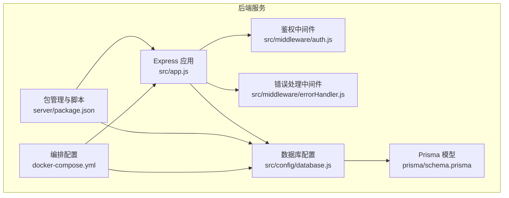
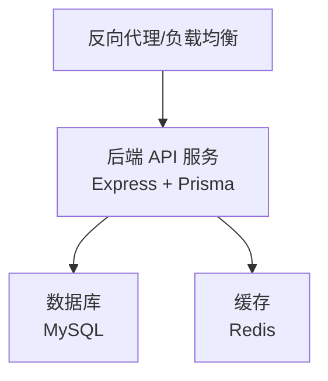
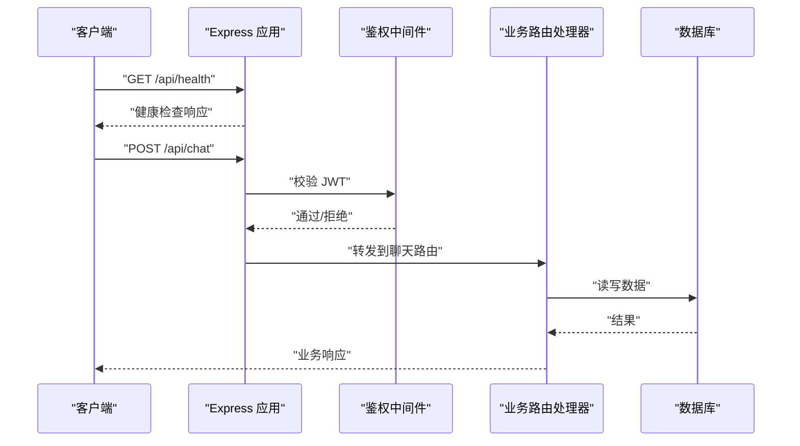
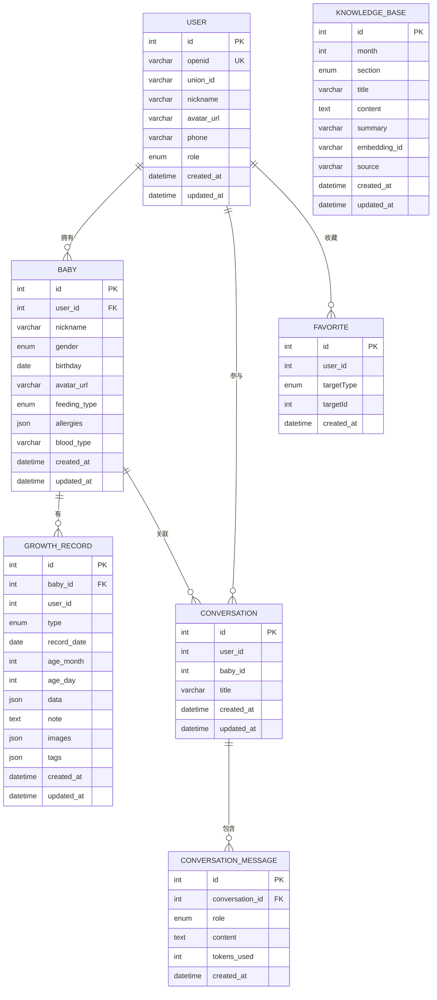
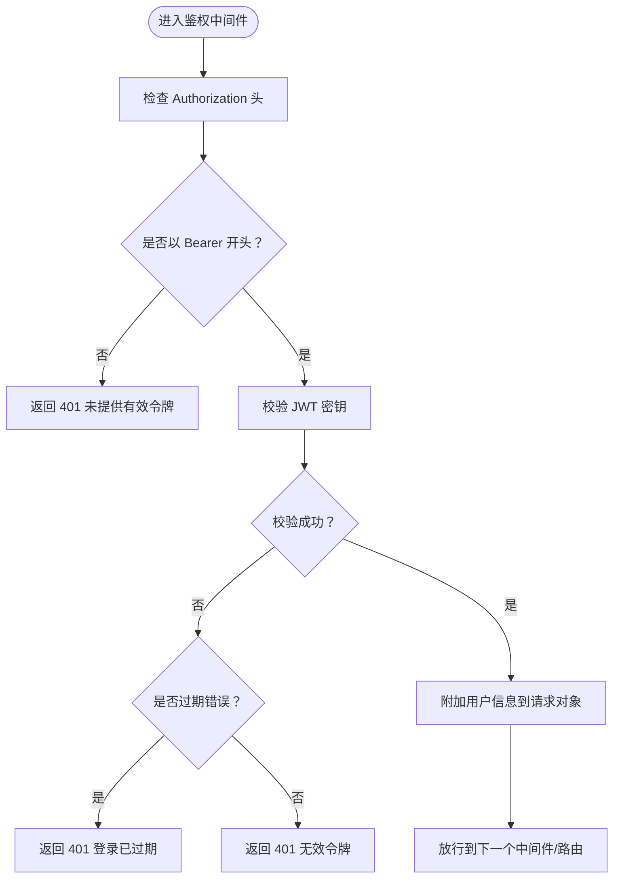
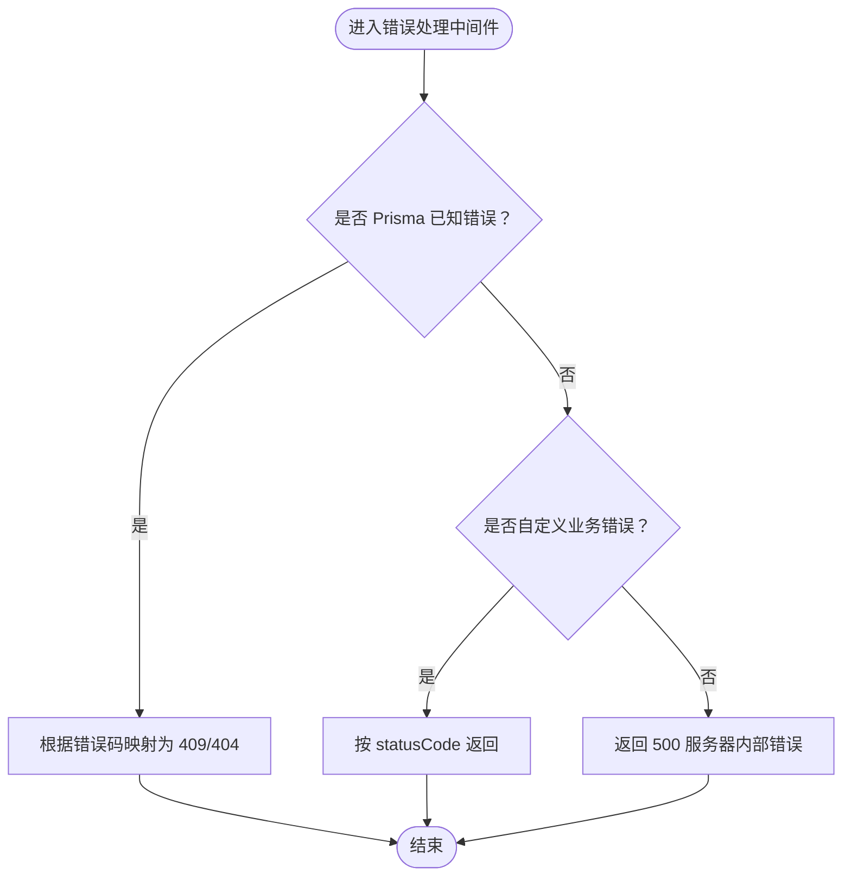
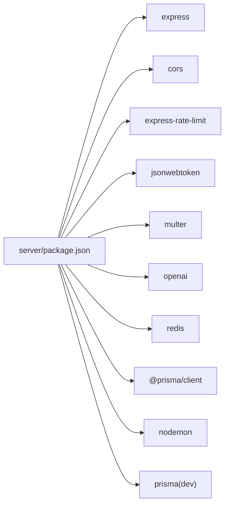

# 部署运维

<cite>
**本文引用的文件**
- [server/package.json](file://server/package.json)
- [server/docker-compose.yml](file://server/docker-compose.yml)
- [server/src/app.js](file://server/src/app.js)
- [server/src/config/database.js](file://server/src/config/database.js)
- [server/prisma/schema.prisma](file://server/prisma/schema.prisma)
- [server/src/middleware/auth.js](file://server/src/middleware/auth.js)
- [server/src/middleware/errorHandler.js](file://server/src/middleware/errorHandler.js)
- [server/.gitignore](file://server/.gitignore)
</cite>

## 目录
1. [简介](#简介)
2. [项目结构](#项目结构)
3. [核心组件](#核心组件)
4. [架构总览](#架构总览)
5. [详细组件分析](#详细组件分析)
6. [依赖关系分析](#依赖关系分析)
7. [性能考虑](#性能考虑)
8. [故障排查指南](#故障排查指南)
9. [结论](#结论)
10. [附录](#附录)

## 简介
本指南面向生产环境部署与运维“AI育儿助手”项目，覆盖容器化部署、环境变量与数据库配置、CI/CD与自动化部署、监控告警、性能优化、安全加固、备份恢复、故障排查与日志分析、版本升级流程等关键主题。文档基于仓库中现有的后端服务（Express + Prisma + MySQL + Redis）进行落地说明，帮助团队在生产环境中稳定可靠地运行系统。

## 项目结构
后端服务位于 server 目录，采用 Node.js + Express 构建，使用 Prisma 进行数据库访问，通过 docker-compose 编排 MySQL 与 Redis。项目根目录包含小程序前端与文档资源，后端独立可部署。

图表来源
- [server/src/app.js:1-65](file://server/src/app.js#L1-L65)
- [server/src/config/database.js:1-17](file://server/src/config/database.js#L1-L17)
- [server/src/middleware/auth.js:1-29](file://server/src/middleware/auth.js#L1-L29)
- [server/src/middleware/errorHandler.js:1-52](file://server/src/middleware/errorHandler.js#L1-L52)
- [server/prisma/schema.prisma:1-189](file://server/prisma/schema.prisma#L1-L189)
- [server/package.json:1-31](file://server/package.json#L1-L31)
- [server/docker-compose.yml:1-32](file://server/docker-compose.yml#L1-L32)

章节来源
- [server/src/app.js:1-65](file://server/src/app.js#L1-L65)
- [server/docker-compose.yml:1-32](file://server/docker-compose.yml#L1-L32)
- [server/package.json:1-31](file://server/package.json#L1-L31)

## 核心组件
- 应用入口与路由：应用启动、CORS、限流、健康检查、路由注册与统一错误处理。
- 数据库层：Prisma 客户端单例、按环境切换日志级别、优雅退出断开连接。
- 认证与鉴权：JWT 中间件从请求头解析并校验令牌。
- 错误处理：统一捕获 Prisma 已知错误与自定义业务错误，返回标准化响应。
- 配置与编排：MySQL 与 Redis 的 docker-compose 编排，暴露必要端口与持久化卷。

章节来源
- [server/src/app.js:14-55](file://server/src/app.js#L14-L55)
- [server/src/config/database.js:7-14](file://server/src/config/database.js#L7-L14)
- [server/src/middleware/auth.js:7-26](file://server/src/middleware/auth.js#L7-L26)
- [server/src/middleware/errorHandler.js:6-39](file://server/src/middleware/errorHandler.js#L6-L39)

## 架构总览
下图展示生产环境典型拓扑：反向代理/负载均衡前置，后端 API 服务通过 Docker Compose 运行，依赖 MySQL 与 Redis；数据库迁移与种子数据通过 Prisma 执行。

图表来源
- [server/docker-compose.yml:4-27](file://server/docker-compose.yml#L4-L27)
- [server/src/config/database.js:7-9](file://server/src/config/database.js#L7-L9)
- [server/package.json:9-12](file://server/package.json#L9-L12)

## 详细组件分析

### 应用启动与路由控制流
应用启动时加载 .env，初始化中间件与路由，开放健康检查端点，注册各模块路由并在最后统一处理 404 与错误。

图表来源
- [server/src/app.js:28-55](file://server/src/app.js#L28-L55)
- [server/src/middleware/auth.js:7-26](file://server/src/middleware/auth.js#L7-L26)
- [server/src/config/database.js:7-9](file://server/src/config/database.js#L7-L9)

章节来源
- [server/src/app.js:14-55](file://server/src/app.js#L14-L55)
- [server/src/middleware/auth.js:7-26](file://server/src/middleware/auth.js#L7-L26)

### 数据库模型与连接
- 数据源：MySQL，通过 DATABASE_URL 环境变量注入。
- Prisma 客户端：单例模式，开发环境开启查询日志，生产仅记录错误。
- 优雅退出：进程退出前断开数据库连接。

图表来源
- [server/prisma/schema.prisma:13-189](file://server/prisma/schema.prisma#L13-L189)

章节来源
- [server/prisma/schema.prisma:8-11](file://server/prisma/schema.prisma#L8-L11)
- [server/src/config/database.js:7-14](file://server/src/config/database.js#L7-L14)

### 认证与鉴权流程
JWT 验证失败或过期时，统一返回 401 并提示相应信息。

图表来源
- [server/src/middleware/auth.js:7-26](file://server/src/middleware/auth.js#L7-L26)

章节来源
- [server/src/middleware/auth.js:7-26](file://server/src/middleware/auth.js#L7-L26)

### 错误处理流程
统一捕获 Prisma 已知错误码与自定义业务错误，未知错误按状态码回传。

图表来源
- [server/src/middleware/errorHandler.js:6-39](file://server/src/middleware/errorHandler.js#L6-L39)

章节来源
- [server/src/middleware/errorHandler.js:6-39](file://server/src/middleware/errorHandler.js#L6-L39)

## 依赖关系分析
- 应用依赖：Express、CORS、限流、JWT、Multer、OpenAI SDK、Redis、Prisma 客户端。
- 开发依赖：Nodemon、Prisma。
- 运行时依赖：MySQL 与 Redis 通过 docker-compose 提供。

图表来源
- [server/package.json:14-29](file://server/package.json#L14-L29)

章节来源
- [server/package.json:6-12](file://server/package.json#L6-L12)
- [server/package.json:14-29](file://server/package.json#L14-L29)

## 性能考虑
- 数据库连接池与 Prisma 日志：生产环境仅记录错误，避免查询日志带来的 IO 压力。
- 限流策略：全局每 IP 每分钟限制请求数，防止突发流量冲击。
- 缓存：Redis 可用于会话、验证码、热点数据缓存，结合 maxmemory 策略控制内存占用。
- 文件存储：上传模块使用本地磁盘，生产建议迁移到对象存储（如云厂商 COS），降低应用节点压力。
- 健康检查：提供 /api/health 快速判断服务可用性，便于探针与自动扩缩容。

章节来源
- [server/src/config/database.js:8](file://server/src/config/database.js#L8)
- [server/src/app.js:20-25](file://server/src/app.js#L20-L25)
- [server/docker-compose.yml:25](file://server/docker-compose.yml#L25)

## 故障排查指南
- 健康检查：访问 /api/health 确认服务存活与时间戳。
- 日志定位：错误处理中间件会输出错误堆栈，结合环境变量区分开发/生产输出。
- 数据库连通性：确认 DATABASE_URL 正确，Prisma 客户端在开发环境开启查询日志便于诊断。
- 认证问题：核对 Authorization 头格式与 JWT_SECRET，关注过期与无效令牌场景。
- 404 接口：检查路由注册顺序与路径参数，确认中间件是否正确放行。
- 缓存异常：检查 Redis 容器状态与 maxmemory 设置，避免 LRU 淘汰导致的数据丢失。

章节来源
- [server/src/app.js:28-30](file://server/src/app.js#L28-L30)
- [server/src/middleware/errorHandler.js:6-7](file://server/src/middleware/errorHandler.js#L6-L7)
- [server/src/config/database.js:8](file://server/src/config/database.js#L8)
- [server/src/middleware/auth.js:10-25](file://server/src/middleware/auth.js#L10-L25)
- [server/docker-compose.yml:19-27](file://server/docker-compose.yml#L19-L27)

## 结论
本指南提供了从容器化部署到生产运维的完整实践路径。建议在生产中补充 CI/CD 流水线、监控告警、安全加固与备份恢复策略，并持续优化缓存与数据库性能，确保系统高可用与可维护性。

## 附录

### 生产部署清单
- 环境变量
  - NODE_ENV=production
  - PORT=3000
  - DATABASE_URL=mysql://...（指向生产数据库）
  - JWT_SECRET=强随机密钥
  - REDIS_URL=redis://...（指向生产缓存）
- 容器编排
  - 使用 docker-compose 启动 MySQL 与 Redis，映射必要端口与持久化卷。
- 数据库迁移与种子
  - 使用 Prisma 脚本执行迁移与种子数据生成。
- 健康检查
  - 对 /api/health 进行探针检查，配合负载均衡启用。
- 安全加固
  - 强制 HTTPS、最小权限原则、敏感信息加密存储、定期轮换密钥。
- 监控告警
  - 指标：CPU/内存/磁盘/数据库连接数/Redis 内存使用率/请求延迟/错误率。
  - 日志：集中采集、结构化输出、保留策略。
- 备份恢复
  - MySQL：定时逻辑备份，验证恢复流程。
  - Redis：RDB/AOF 持久化策略，异地备份。
- 版本升级
  - 分批发布、灰度流量、回滚预案、数据库迁移不可回退时需谨慎评估。

章节来源
- [server/docker-compose.yml:10-17](file://server/docker-compose.yml#L10-L17)
- [server/docker-compose.yml:23-27](file://server/docker-compose.yml#L23-L27)
- [server/package.json:9-12](file://server/package.json#L9-L12)
- [server/.gitignore:2](file://server/.gitignore#L2)