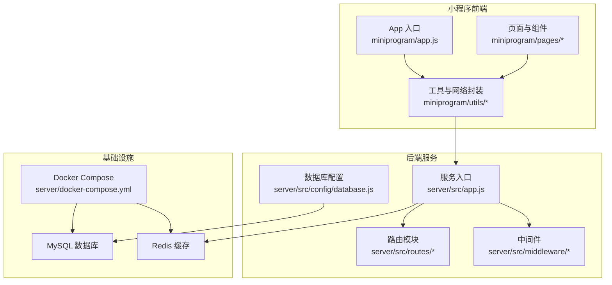
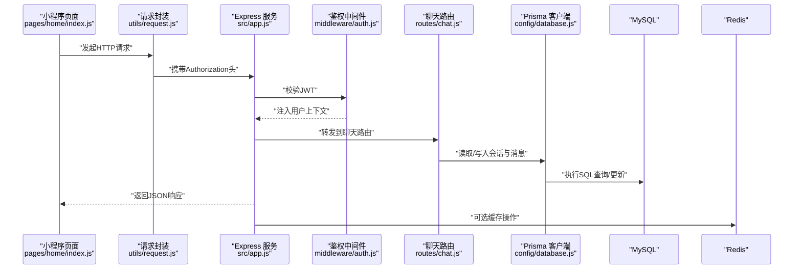
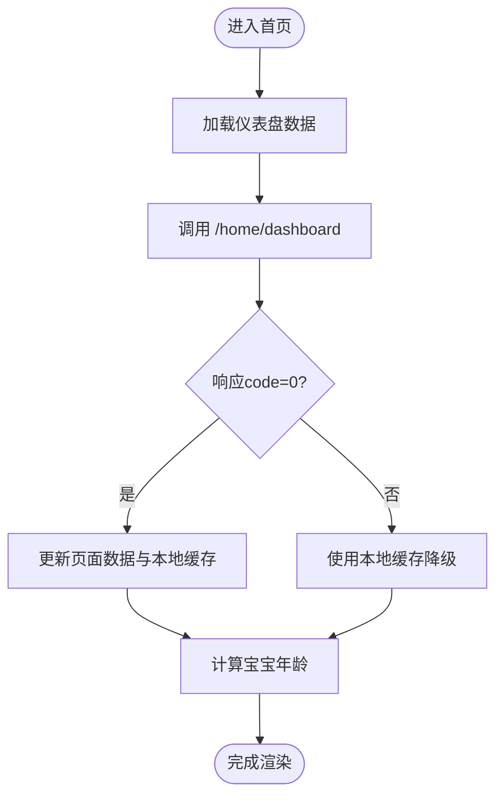
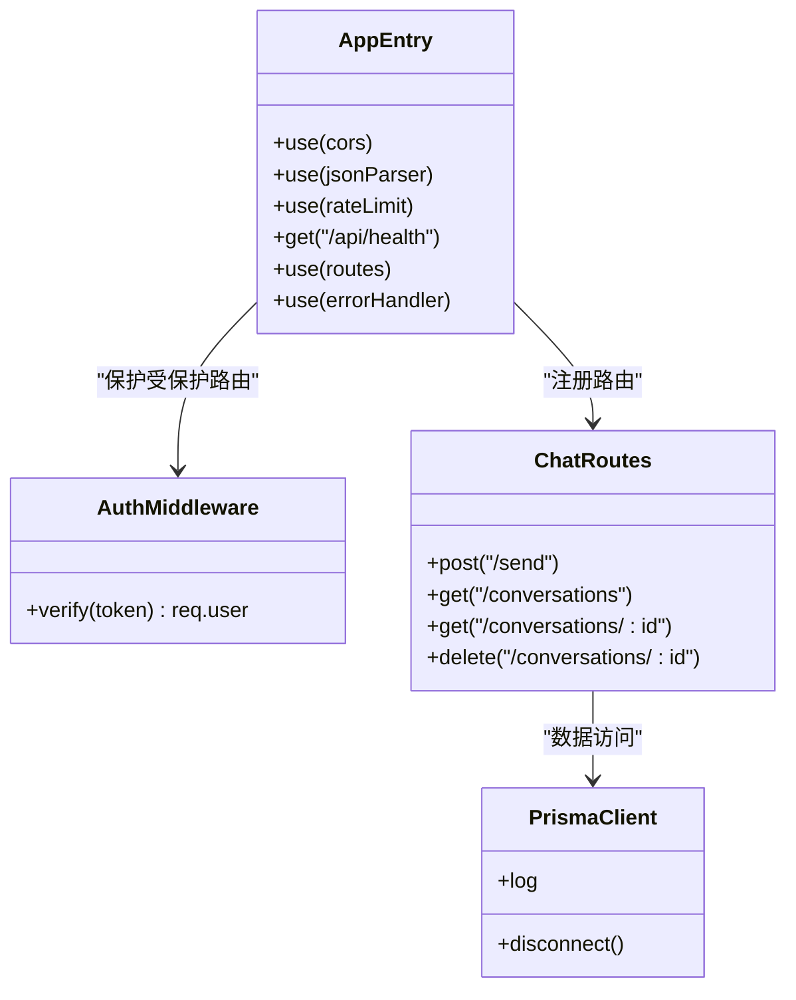
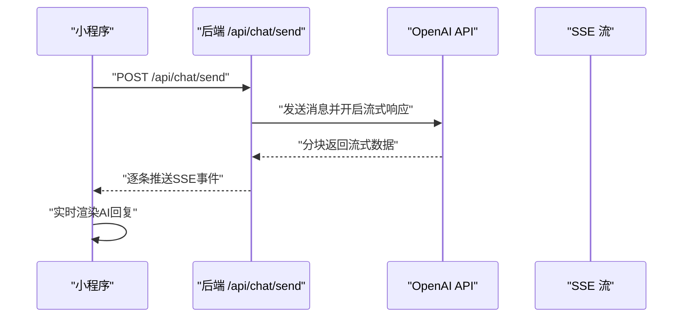
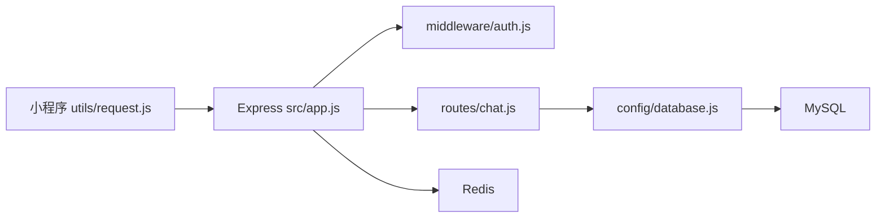

# 技术栈

<cite>
**本文引用的文件**
- [miniprogram/app.js](file://miniprogram/app.js)
- [miniprogram/app.json](file://miniprogram/app.json)
- [miniprogram/utils/request.js](file://miniprogram/utils/request.js)
- [miniprogram/pages/home/index.js](file://miniprogram/pages/home/index.js)
- [server/src/app.js](file://server/src/app.js)
- [server/package.json](file://server/package.json)
- [server/prisma/schema.prisma](file://server/prisma/schema.prisma)
- [server/src/config/database.js](file://server/src/config/database.js)
- [server/src/middleware/auth.js](file://server/src/middleware/auth.js)
- [server/src/routes/chat.js](file://server/src/routes/chat.js)
- [server/docker-compose.yml](file://server/docker-compose.yml)
</cite>

## 目录
1. [简介](#简介)
2. [项目结构](#项目结构)
3. [核心组件](#核心组件)
4. [架构总览](#架构总览)
5. [详细组件分析](#详细组件分析)
6. [依赖关系分析](#依赖关系分析)
7. [性能考虑](#性能考虑)
8. [故障排查指南](#故障排查指南)
9. [结论](#结论)
10. [附录](#附录)

## 简介
本技术栈文档面向“AI育儿助手”项目，系统梳理前后端与AI集成的关键技术选型与实现要点，覆盖：
- 前端：微信小程序框架、WXML/WXSS、JavaScript ES6+、页面与组件组织、状态管理与网络层封装
- 后端：Node.js、Express、Prisma ORM、MySQL、Redis、JWT鉴权、限流与错误处理
- AI集成：OpenAI API调用与SSE流式传输（按路线图规划）
- 工具链：微信开发者工具、VS Code、Docker容器化
- 构建与部署：NPM脚本、环境变量、健康检查与路由组织

## 项目结构
项目采用“小程序前端 + Node.js 后端 + 数据库与缓存”的分层架构。前端通过统一请求封装访问后端API；后端以Express组织路由，Prisma访问MySQL，Redis用于缓存，Docker编排MySQL与Redis。

图表来源
- [miniprogram/app.js:1-69](file://miniprogram/app.js#L1-L69)
- [miniprogram/utils/request.js:1-97](file://miniprogram/utils/request.js#L1-L97)
- [server/src/app.js:1-65](file://server/src/app.js#L1-L65)
- [server/src/config/database.js:1-17](file://server/src/config/database.js#L1-L17)
- [server/docker-compose.yml:1-32](file://server/docker-compose.yml#L1-L32)

章节来源
- [miniprogram/app.json:1-60](file://miniprogram/app.json#L1-L60)
- [server/src/app.js:1-65](file://server/src/app.js#L1-L65)

## 核心组件
- 小程序应用入口与全局状态
  - 应用启动时检查登录态，持久化用户与宝宝信息，必要时触发登录流程
  - 登录成功后写入本地存储并更新全局数据，无宝宝信息则引导至引导页
- 统一网络请求封装
  - 统一基础URL、自动注入Authorization头、统一封装业务错误与网络错误、Token过期自动刷新
- Express服务与路由
  - 全局CORS、JSON解析、限流中间件；健康检查接口；按模块注册路由；统一404与错误处理
- 数据库与ORM
  - Prisma定义MySQL模型，支持多表关联与索引；开发环境下输出查询日志
- 鉴权中间件
  - 从请求头解析Bearer Token，校验JWT并注入用户上下文
- Docker编排
  - MySQL与Redis服务编排，设置字符集与内存策略

章节来源
- [miniprogram/app.js:10-67](file://miniprogram/app.js#L10-L67)
- [miniprogram/utils/request.js:21-97](file://miniprogram/utils/request.js#L21-L97)
- [server/src/app.js:14-55](file://server/src/app.js#L14-L55)
- [server/src/config/database.js:7-14](file://server/src/config/database.js#L7-L14)
- [server/src/middleware/auth.js:7-26](file://server/src/middleware/auth.js#L7-L26)
- [server/docker-compose.yml:4-27](file://server/docker-compose.yml#L4-L27)

## 架构总览
下图展示从前端到后端、再到数据库与缓存的整体交互流程。

图表来源
- [miniprogram/pages/home/index.js:46-71](file://miniprogram/pages/home/index.js#L46-L71)
- [miniprogram/utils/request.js:29-72](file://miniprogram/utils/request.js#L29-L72)
- [server/src/app.js:32-47](file://server/src/app.js#L32-L47)
- [server/src/middleware/auth.js:16-25](file://server/src/middleware/auth.js#L16-L25)
- [server/src/routes/chat.js:14-42](file://server/src/routes/chat.js#L14-L42)
- [server/src/config/database.js:7-9](file://server/src/config/database.js#L7-L9)

## 详细组件分析

### 前端技术栈与实现要点
- 框架与页面组织
  - 使用微信小程序原生框架，页面在全局配置中声明并设置tabBar导航
- WXML/WXSS与页面逻辑
  - 页面通过Page对象组织数据与生命周期，使用事件绑定与页面跳转
- JavaScript ES6+特性
  - Promise封装请求、async/await简化异步流程、解构赋值与模板字符串提升可读性
- 状态管理与本地存储
  - 使用全局App对象与本地Storage管理用户、Token与宝宝信息，避免重复登录
- 统一网络层
  - 封装wx.request，统一处理状态码、业务错误、Token过期与加载提示

图表来源
- [miniprogram/pages/home/index.js:46-82](file://miniprogram/pages/home/index.js#L46-L82)

章节来源
- [miniprogram/app.json:24-55](file://miniprogram/app.json#L24-L55)
- [miniprogram/app.js:18-67](file://miniprogram/app.js#L18-L67)
- [miniprogram/pages/home/index.js:1-114](file://miniprogram/pages/home/index.js#L1-L114)
- [miniprogram/utils/request.js:21-97](file://miniprogram/utils/request.js#L21-L97)

### 后端技术栈与实现要点
- 服务入口与中间件
  - 初始化dotenv，启用CORS与JSON解析；全局限流保护；健康检查接口；统一404与错误处理
- 路由组织
  - 按模块划分路由（认证、宝宝、成长、知识、聊天、上传、首页），部分路由启用鉴权中间件
- 数据库与ORM
  - Prisma定义用户、宝宝、成长记录、会话、消息、知识库、收藏等模型，支持枚举与JSON字段
- 鉴权机制
  - 从Authorization头解析Bearer Token，校验JWT并注入用户ID与标识
- Docker编排
  - MySQL与Redis服务，设置字符集、内存策略与持久化卷

图表来源
- [server/src/app.js:14-55](file://server/src/app.js#L14-L55)
- [server/src/middleware/auth.js:7-26](file://server/src/middleware/auth.js#L7-L26)
- [server/src/routes/chat.js:5-54](file://server/src/routes/chat.js#L5-L54)
- [server/src/config/database.js:7-14](file://server/src/config/database.js#L7-L14)

章节来源
- [server/src/app.js:14-55](file://server/src/app.js#L14-L55)
- [server/src/middleware/auth.js:7-26](file://server/src/middleware/auth.js#L7-L26)
- [server/src/routes/chat.js:1-57](file://server/src/routes/chat.js#L1-L57)
- [server/src/config/database.js:1-17](file://server/src/config/database.js#L1-L17)
- [server/prisma/schema.prisma:13-189](file://server/prisma/schema.prisma#L13-L189)

### AI集成技术（按路线图规划）
- OpenAI API与SSE流式传输
  - 路由已预留 /api/chat/send 接口，当前返回占位信息；后续将在此实现OpenAI调用与SSE流式响应
- 会话与消息模型
  - Conversation与ConversationMessage模型支持消息角色（user/assistant/system）与token用量统计，便于AI调用计费与审计

图表来源
- [server/src/routes/chat.js:5-12](file://server/src/routes/chat.js#L5-L12)

章节来源
- [server/src/routes/chat.js:5-12](file://server/src/routes/chat.js#L5-L12)
- [server/prisma/schema.prisma:107-142](file://server/prisma/schema.prisma#L107-L142)

### 开发工具链
- 微信开发者工具
  - 用于小程序调试、真机预览与上传；全局配置与页面结构在app.json中集中管理
- VS Code
  - 建议安装ESLint、Prettier、小程序相关扩展，配合小程序项目进行前端开发
- Docker
  - 使用docker-compose一键拉起MySQL与Redis，便于本地与CI环境一致化

章节来源
- [miniprogram/app.json:1-60](file://miniprogram/app.json#L1-L60)
- [server/docker-compose.yml:1-32](file://server/docker-compose.yml#L1-L32)

### 构建与部署相关技术
- NPM脚本
  - 开发：使用nodemon热重启；生产：直接node启动；数据库：迁移、种子数据、Prisma客户端生成与Studio可视化
- 环境变量
  - 通过dotenv加载；数据库URL与JWT密钥等敏感配置应通过环境变量注入
- 健康检查与路由组织
  - 提供 /api/health 便于探活；路由按模块划分，便于扩展与维护

章节来源
- [server/package.json:6-12](file://server/package.json#L6-L12)
- [server/src/app.js:28-30](file://server/src/app.js#L28-L30)
- [server/src/app.js:32-47](file://server/src/app.js#L32-L47)

## 依赖关系分析
- 前端对后端的依赖
  - 小程序通过统一请求封装访问后端API，遵循统一的响应格式与鉴权协议
- 后端内部依赖
  - Express作为Web框架，Prisma负责数据访问，JWT中间件提供鉴权，路由模块化组织业务
- 基础设施依赖
  - MySQL承载主数据，Redis用于缓存与限流等场景；Docker确保环境一致性

图表来源
- [miniprogram/utils/request.js:29-72](file://miniprogram/utils/request.js#L29-L72)
- [server/src/app.js:32-47](file://server/src/app.js#L32-L47)
- [server/src/middleware/auth.js:7-26](file://server/src/middleware/auth.js#L7-L26)
- [server/src/routes/chat.js:14-42](file://server/src/routes/chat.js#L14-L42)
- [server/src/config/database.js:7-9](file://server/src/config/database.js#L7-L9)

章节来源
- [miniprogram/utils/request.js:21-97](file://miniprogram/utils/request.js#L21-L97)
- [server/src/app.js:14-55](file://server/src/app.js#L14-L55)

## 性能考虑
- 前端
  - 使用本地缓存降级与懒加载策略，减少网络依赖；合理控制请求并发与加载提示
- 后端
  - 全局限流降低突发流量影响；开发环境开启Prisma查询日志便于定位慢查询；数据库建立必要索引
- 数据库
  - 按模型索引策略（如用户、宝宝、成长记录）优化查询；合理使用JSON字段存储灵活数据
- 缓存
  - Redis用于热点数据与会话缓存，结合内存策略与持久化卷保障稳定性

## 故障排查指南
- 登录态异常
  - 检查本地Token与过期时间存储；确认后端JWT密钥与签名算法一致；必要时清理缓存并重新登录
- 网络请求失败
  - 查看请求封装中的状态码与业务错误码；确认后端健康检查与路由映射正确
- 数据库问题
  - 检查Prisma日志与数据库连接参数；核对迁移与模型定义一致性
- Docker环境
  - 确认MySQL与Redis容器运行状态、端口映射与数据卷挂载；检查初始化凭据与字符集设置

章节来源
- [miniprogram/utils/request.js:48-86](file://miniprogram/utils/request.js#L48-L86)
- [server/src/middleware/auth.js:16-25](file://server/src/middleware/auth.js#L16-L25)
- [server/src/config/database.js:7-9](file://server/src/config/database.js#L7-L9)
- [server/docker-compose.yml:10-17](file://server/docker-compose.yml#L10-L17)

## 结论
本项目在前端采用微信小程序原生框架与统一网络封装，在后端采用Express与Prisma，结合JWT鉴权与Docker编排，形成清晰的分层架构。AI集成按路线图规划，当前已具备会话与消息模型基础，后续将通过OpenAI API与SSE实现流式对话能力。整体技术栈简洁可靠，便于扩展与维护。

## 附录
- 数据模型概览（节选）
  - 用户、宝宝、成长记录、会话、消息、知识库、收藏等模型，支持枚举类型与JSON字段，满足育儿场景的数据灵活性

章节来源
- [server/prisma/schema.prisma:13-189](file://server/prisma/schema.prisma#L13-L189)