# 架构设计

<cite>
**本文引用的文件**
- [server/src/app.js](file://server/src/app.js)
- [server/package.json](file://server/package.json)
- [server/prisma/schema.prisma](file://server/prisma/schema.prisma)
- [server/src/config/database.js](file://server/src/config/database.js)
- [server/src/middleware/auth.js](file://server/src/middleware/auth.js)
- [server/src/middleware/errorHandler.js](file://server/src/middleware/errorHandler.js)
- [server/src/routes/auth.js](file://server/src/routes/auth.js)
- [server/src/routes/baby.js](file://server/src/routes/baby.js)
- [server/src/routes/growth.js](file://server/src/routes/growth.js)
- [server/src/routes/knowledge.js](file://server/src/routes/knowledge.js)
- [server/src/routes/chat.js](file://server/src/routes/chat.js)
- [miniprogram/app.js](file://miniprogram/app.js)
- [miniprogram/app.json](file://miniprogram/app.json)
- [miniprogram/utils/request.js](file://miniprogram/utils/request.js)
</cite>

## 目录
1. [引言](#引言)
2. [项目结构](#项目结构)
3. [核心组件](#核心组件)
4. [架构总览](#架构总览)
5. [详细组件分析](#详细组件分析)
6. [依赖分析](#依赖分析)
7. [性能考量](#性能考量)
8. [故障排查指南](#故障排查指南)
9. [结论](#结论)
10. [附录](#附录)

## 引言
本架构设计文档面向“AI育儿助手”项目，系统采用前后端分离架构，前端为微信小程序，后端基于 Node.js + Express 提供 RESTful API，并通过 Prisma 访问 MySQL 数据库。整体遵循 MVC 分层与中间件模式，强调鉴权、限流、统一错误处理与可扩展的数据模型设计。本文档旨在帮助开发者快速理解系统整体设计思路与组件交互关系。

## 项目结构
项目分为三个主要部分：
- 小程序前端（miniprogram）：页面、组件、工具类与应用入口
- 服务端（server）：Express 应用、路由、中间件、数据库模型与配置
- 文档与种子脚本（docs、scripts、seeders）：用于补充说明与数据初始化

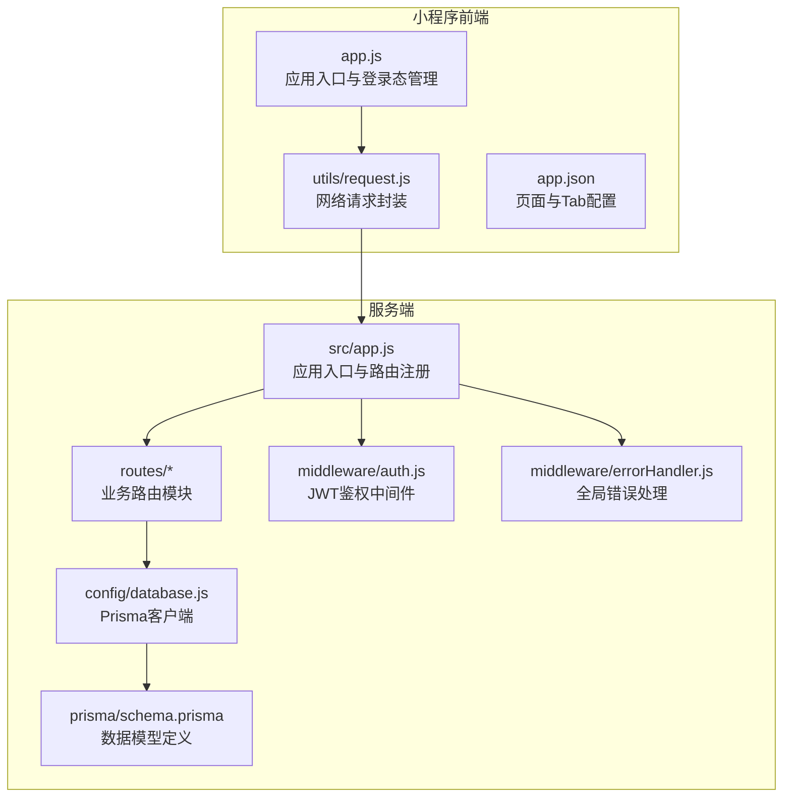

图表来源
- [server/src/app.js:1-65](file://server/src/app.js#L1-L65)
- [server/src/routes/auth.js:1-84](file://server/src/routes/auth.js#L1-L84)
- [server/src/routes/baby.js:1-100](file://server/src/routes/baby.js#L1-L100)
- [server/src/routes/growth.js:1-118](file://server/src/routes/growth.js#L1-L118)
- [server/src/routes/knowledge.js:1-59](file://server/src/routes/knowledge.js#L1-L59)
- [server/src/routes/chat.js:1-57](file://server/src/routes/chat.js#L1-L57)
- [server/src/middleware/auth.js:1-29](file://server/src/middleware/auth.js#L1-L29)
- [server/src/middleware/errorHandler.js:1-52](file://server/src/middleware/errorHandler.js#L1-L52)
- [server/src/config/database.js:1-17](file://server/src/config/database.js#L1-L17)
- [server/prisma/schema.prisma:1-189](file://server/prisma/schema.prisma#L1-L189)
- [miniprogram/app.js:1-69](file://miniprogram/app.js#L1-L69)
- [miniprogram/utils/request.js:1-97](file://miniprogram/utils/request.js#L1-L97)
- [miniprogram/app.json:1-60](file://miniprogram/app.json#L1-L60)

章节来源
- [server/src/app.js:1-65](file://server/src/app.js#L1-L65)
- [miniprogram/app.json:1-60](file://miniprogram/app.json#L1-L60)

## 核心组件
- 应用入口与控制流
  - 服务端入口负责注册全局中间件（CORS、JSON 解析、限流）、健康检查、路由注册与全局错误处理。
  - 小程序入口负责登录态检查与微信登录流程，统一注入 Authorization 头。
- 中间件体系
  - 鉴权中间件：从请求头解析 Bearer Token 并校验有效性。
  - 错误处理中间件：统一捕获 Prisma 错误、业务错误与未知错误，返回标准化响应。
- 路由与业务层
  - 路由模块按功能拆分：认证、宝宝档案、成长记录、知识库、聊天、上传、首页等。
  - 路由内执行参数校验、调用数据库操作并返回统一格式结果。
- 数据访问层
  - 使用 Prisma Client 访问 MySQL，提供单例客户端与优雅退出断连。
  - 数据模型覆盖用户、宝宝、成长记录、对话、知识库与收藏等实体。

章节来源
- [server/src/app.js:14-55](file://server/src/app.js#L14-L55)
- [server/src/middleware/auth.js:7-26](file://server/src/middleware/auth.js#L7-L26)
- [server/src/middleware/errorHandler.js:6-39](file://server/src/middleware/errorHandler.js#L6-L39)
- [server/src/config/database.js:7-14](file://server/src/config/database.js#L7-L14)
- [server/prisma/schema.prisma:14-189](file://server/prisma/schema.prisma#L14-L189)

## 架构总览
系统采用典型的前后端分离架构，前端通过 HTTP 请求与后端交互；后端以 Express 承载 REST API，使用中间件实现横切关注点；数据持久化通过 Prisma ORM 映射至 MySQL。

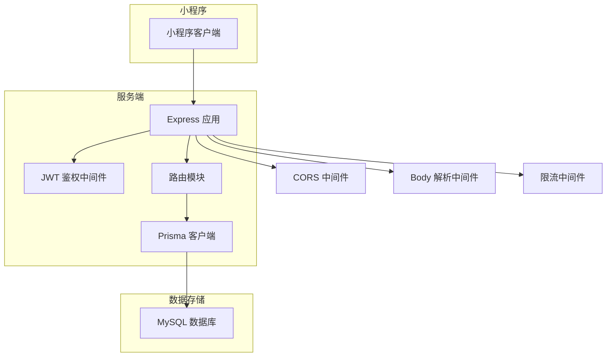

图表来源
- [server/src/app.js:15-47](file://server/src/app.js#L15-L47)
- [server/src/middleware/auth.js:7-26](file://server/src/middleware/auth.js#L7-L26)
- [server/src/config/database.js:7-14](file://server/src/config/database.js#L7-L14)
- [server/prisma/schema.prisma:8-11](file://server/prisma/schema.prisma#L8-L11)

## 详细组件分析

### 应用入口与路由注册
- 全局中间件：启用跨域、JSON/URL 编码解析、每分钟 60 次的全局限流。
- 健康检查：提供 /api/health 返回时间戳。
- 路由注册：按模块挂载认证、宝宝、成长记录、知识库、聊天、上传、首页等路由，并在需要鉴权的路由上附加鉴权中间件。
- 404 与错误处理：未匹配路由返回 404；全局错误处理器统一格式化输出。

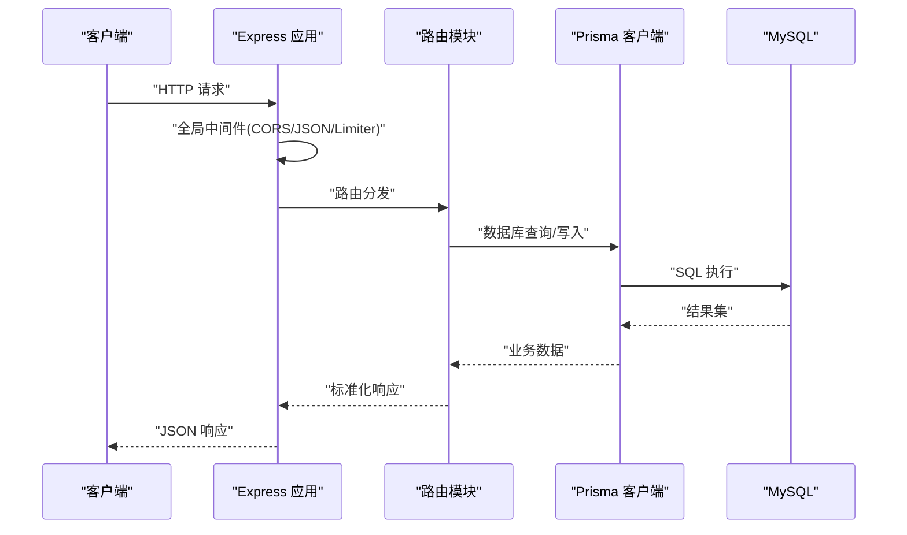

图表来源
- [server/src/app.js:15-55](file://server/src/app.js#L15-L55)
- [server/src/routes/auth.js:10-81](file://server/src/routes/auth.js#L10-L81)
- [server/src/config/database.js:7-14](file://server/src/config/database.js#L7-L14)

章节来源
- [server/src/app.js:14-55](file://server/src/app.js#L14-L55)

### 鉴权中间件（JWT）
- 从 Authorization 头提取 Bearer Token，校验签名与有效期。
- 成功则将用户信息注入请求对象，失败返回 401 并提示相应错误。

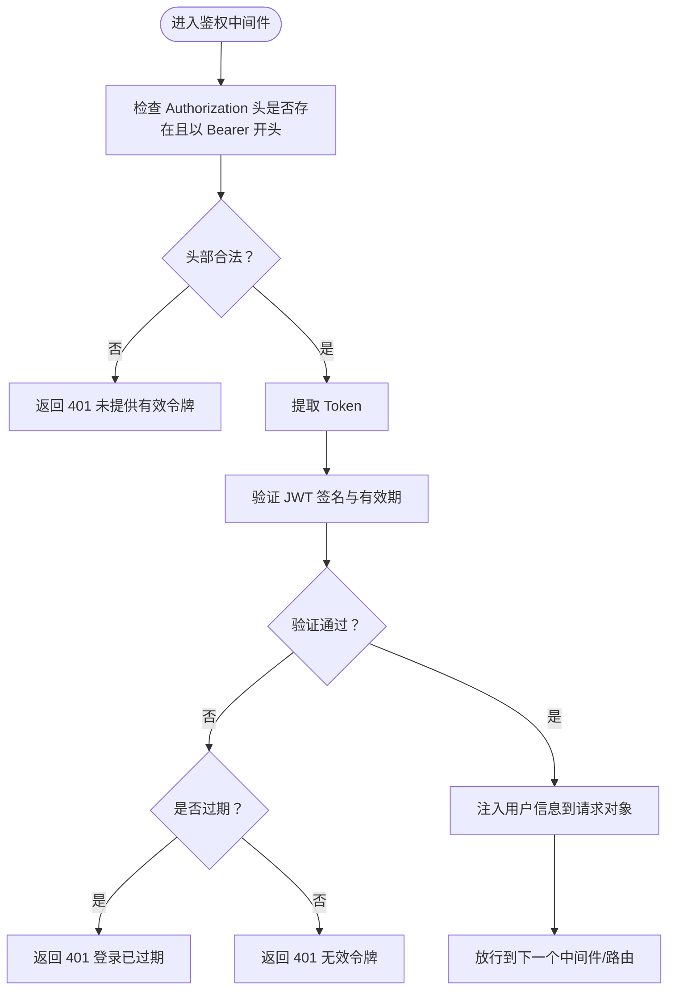

图表来源
- [server/src/middleware/auth.js:7-26](file://server/src/middleware/auth.js#L7-L26)

章节来源
- [server/src/middleware/auth.js:1-29](file://server/src/middleware/auth.js#L1-L29)

### 统一错误处理
- 捕获 Prisma 已知错误（如唯一约束冲突、记录不存在），映射为 409/404。
- 支持抛出自定义业务错误（带状态码），统一返回。
- 未知错误按开发/生产环境返回不同信息。

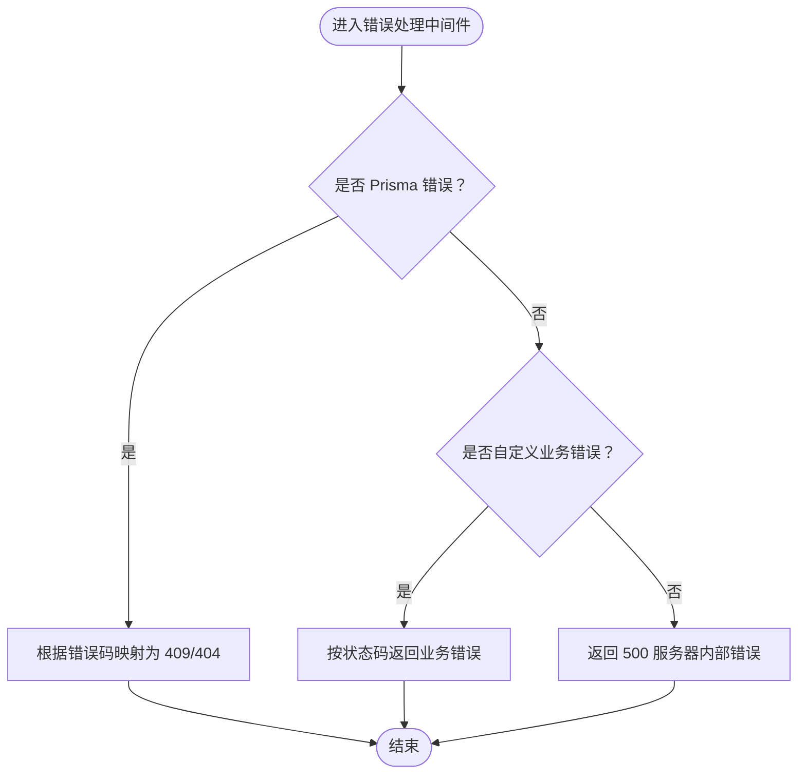

图表来源
- [server/src/middleware/errorHandler.js:6-39](file://server/src/middleware/errorHandler.js#L6-L39)

章节来源
- [server/src/middleware/errorHandler.js:1-52](file://server/src/middleware/errorHandler.js#L1-L52)

### 认证与登录流程（小程序 → 服务端）
- 小程序通过 wx.login 获取 code，调用后端 /api/auth/login。
- 后端使用 code 调用微信接口换取 openid，查找或创建用户，读取最新宝宝信息，签发 JWT。
- 小程序缓存 token、过期时间与用户/宝宝信息，后续请求自动携带 Authorization。

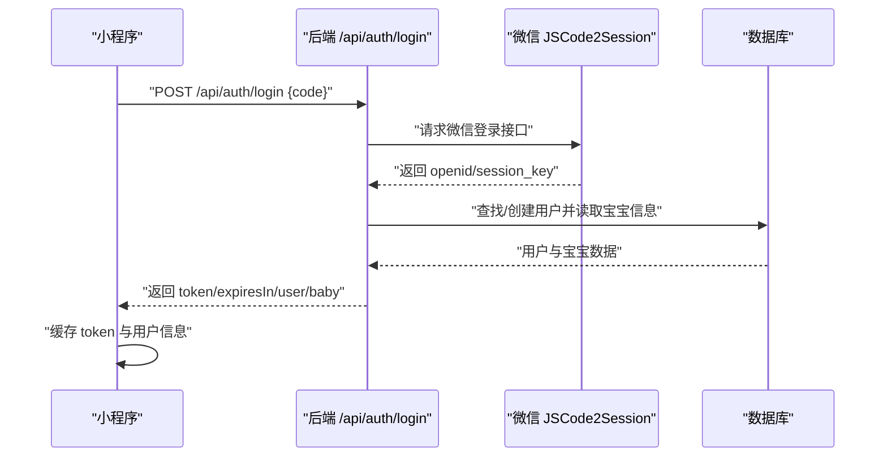

图表来源
- [miniprogram/app.js:35-67](file://miniprogram/app.js#L35-L67)
- [server/src/routes/auth.js:10-81](file://server/src/routes/auth.js#L10-L81)

章节来源
- [miniprogram/app.js:18-67](file://miniprogram/app.js#L18-L67)
- [server/src/routes/auth.js:10-81](file://server/src/routes/auth.js#L10-L81)

### 数据模型与关系
- 用户（User）与宝宝（Baby）一对多；宝宝与成长记录（GrowthRecord）一对多；用户与对话（Conversation）一对多；对话与消息（ConversationMessage）一对多；知识库（KnowledgeBase）按月+板块唯一。
- 收藏（Favorite）支持对知识、对话、文章等目标类型进行去重收藏。

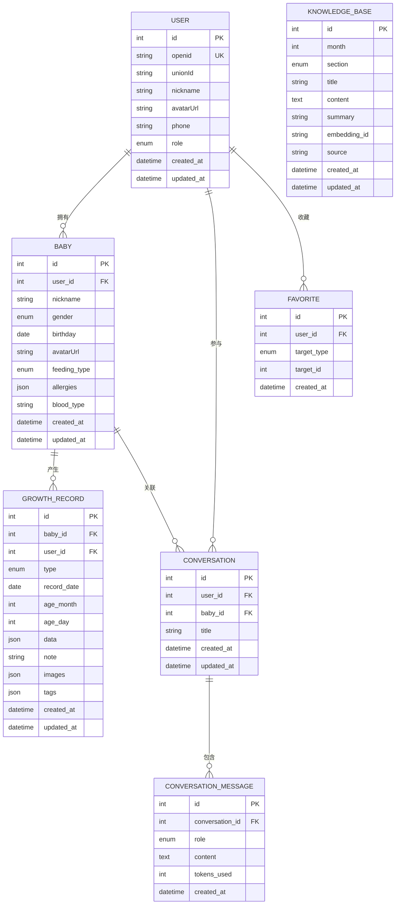

图表来源
- [server/prisma/schema.prisma:14-189](file://server/prisma/schema.prisma#L14-L189)

章节来源
- [server/prisma/schema.prisma:1-189](file://server/prisma/schema.prisma#L1-L189)

### 关键路由与数据流示例

#### 宝宝档案（创建/查询/更新）
- 创建：校验必填字段，写入用户 ID 与基础信息。
- 查询：按用户与宝宝 ID 查询，计算月龄与总天数。
- 更新：按需更新昵称、性别、生日、喂养方式、血型与头像。

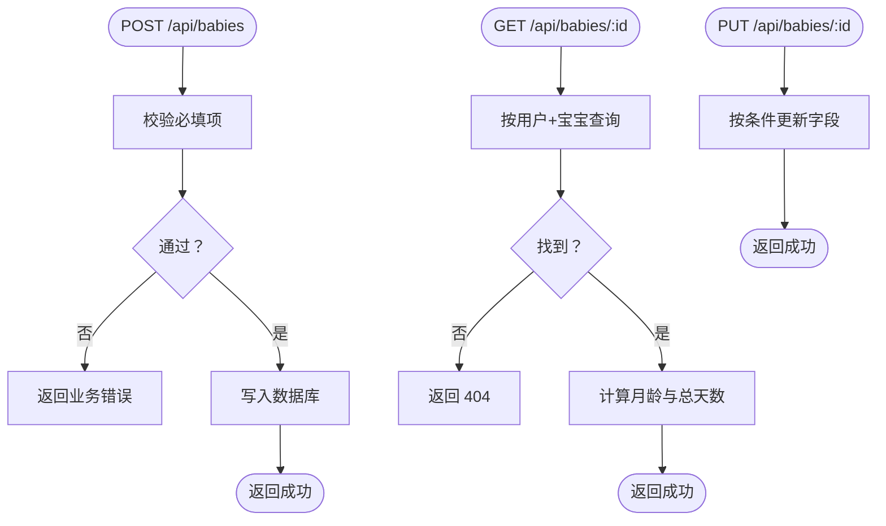

图表来源
- [server/src/routes/baby.js:9-97](file://server/src/routes/baby.js#L9-L97)

章节来源
- [server/src/routes/baby.js:1-100](file://server/src/routes/baby.js#L1-L100)

#### 成长记录（增删改查与分页）
- 新增：校验类型、日期与数据，计算月龄与日龄，写入记录。
- 列表：支持按类型过滤、分页查询与总数统计。
- 详情/更新/删除：按主键与所属用户进行安全校验。

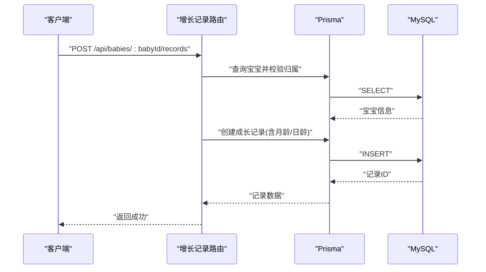

图表来源
- [server/src/routes/growth.js:7-44](file://server/src/routes/growth.js#L7-L44)
- [server/src/config/database.js:7-14](file://server/src/config/database.js#L7-L14)

章节来源
- [server/src/routes/growth.js:1-118](file://server/src/routes/growth.js#L1-L118)

#### 知识库（时间线与月度详情）
- 时间线：按月聚合知识条目，返回概览。
- 月度详情：按月返回各板块内容。
- 板块详情：按月+板块唯一键查询。

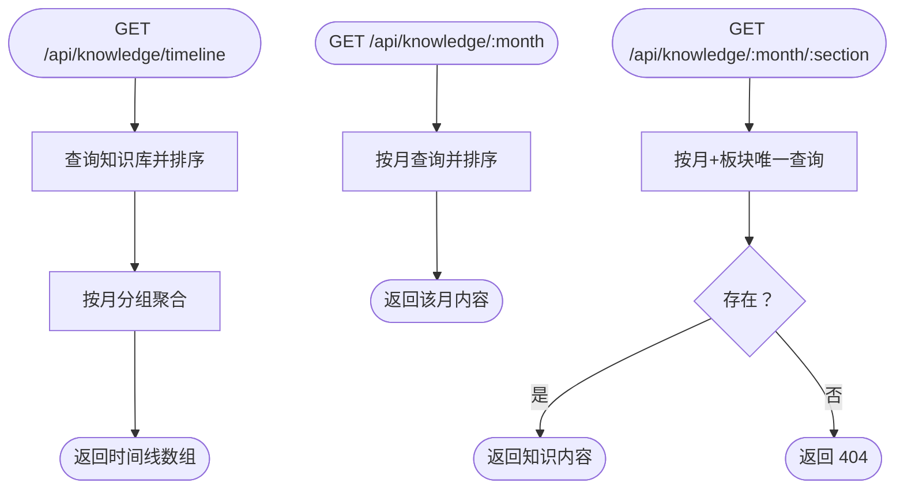

图表来源
- [server/src/routes/knowledge.js:5-56](file://server/src/routes/knowledge.js#L5-L56)

章节来源
- [server/src/routes/knowledge.js:1-59](file://server/src/routes/knowledge.js#L1-L59)

#### 聊天（对话列表/详情/删除）
- 列表：按用户查询最近对话。
- 详情：按用户+对话ID查询并包含消息列表。
- 删除：按用户+对话ID删除。

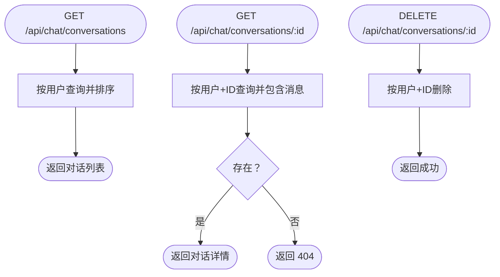

图表来源
- [server/src/routes/chat.js:14-54](file://server/src/routes/chat.js#L14-L54)

章节来源
- [server/src/routes/chat.js:1-57](file://server/src/routes/chat.js#L1-L57)

## 依赖分析
- 服务端依赖
  - Express：Web 框架
  - Prisma：ORM 与数据库客户端
  - JWT：鉴权
  - Redis/COS/OpenAI：预留扩展能力（见依赖清单）
- 前端依赖
  - 微信小程序运行时与网络请求

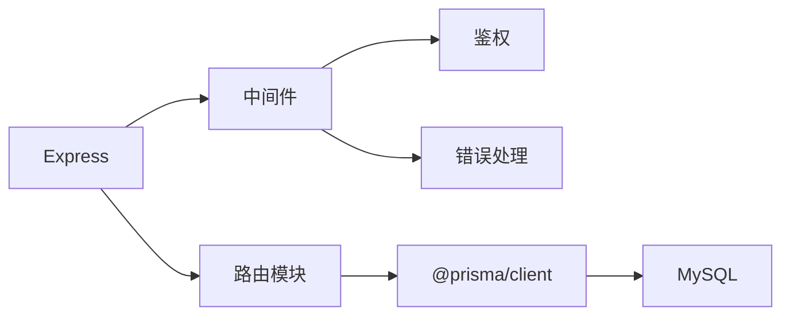

图表来源
- [server/package.json:14-29](file://server/package.json#L14-L29)
- [server/src/app.js:5-8](file://server/src/app.js#L5-L8)
- [server/src/config/database.js:5-9](file://server/src/config/database.js#L5-L9)

章节来源
- [server/package.json:1-31](file://server/package.json#L1-L31)

## 性能考量
- 中间件层面
  - 全局限流降低突发流量对数据库的压力。
  - CORS 与 JSON 解析仅在必要时开启，避免多余开销。
- 数据访问层面
  - 使用 Prisma 的单例客户端，减少连接成本。
  - 对高频查询使用索引（如用户ID、宝宝+日期、唯一组合键）。
- 前端层面
  - 请求封装统一注入 Authorization，减少重复逻辑。
  - 加载状态与错误提示提升用户体验。

## 故障排查指南
- 401 未授权
  - 检查请求头是否包含正确的 Bearer Token。
  - 核对 Token 是否过期或签名无效。
- 404 资源不存在
  - 确认资源 ID 与用户归属一致。
  - 检查 Prisma 查询条件与唯一键。
- 409 数据冲突
  - 检查唯一约束冲突（如知识库的月+板块唯一）。
- 500 服务器内部错误
  - 查看服务端日志，区分开发/生产环境返回差异。
- 登录态异常
  - 小程序侧移除过期缓存并触发重新登录流程。

章节来源
- [server/src/middleware/errorHandler.js:10-38](file://server/src/middleware/errorHandler.js#L10-L38)
- [miniprogram/utils/request.js:78-86](file://miniprogram/utils/request.js#L78-L86)

## 结论
本项目以清晰的前后端分离架构为基础，结合中间件模式实现鉴权、限流与统一错误处理，路由层按功能模块拆分，数据层通过 Prisma 提供稳定的数据模型与访问能力。整体设计兼顾可维护性与可扩展性，为后续引入微服务、消息队列与 AI 能力提供了良好基础。

## 附录
- API 设计原则
  - 统一响应结构：code/message/data
  - 4xx/5xx 错误码规范化
  - 路径参数与查询参数语义明确
  - 鉴权中间件保护敏感接口
- 可扩展性建议
  - 引入微服务：将聊天/AI、知识库检索、文件上传等拆分为独立服务
  - 引入缓存：Redis 缓存热点知识与对话摘要
  - 引入消息队列：异步处理大文件上传与向量嵌入
  - 引入可观测性：日志、指标与链路追踪