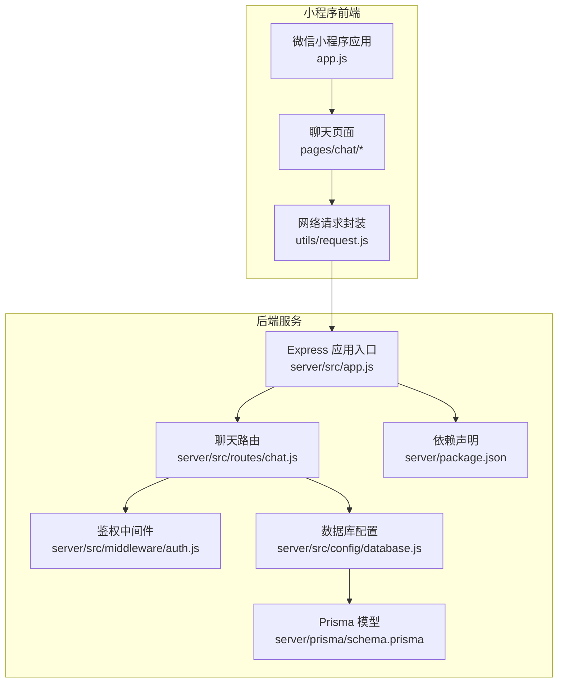
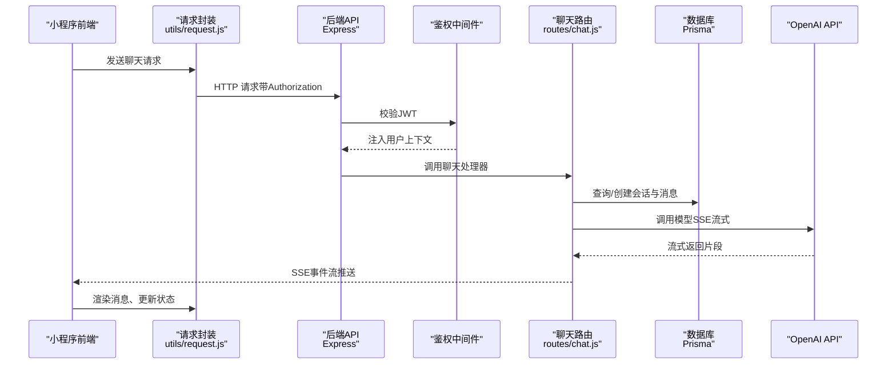
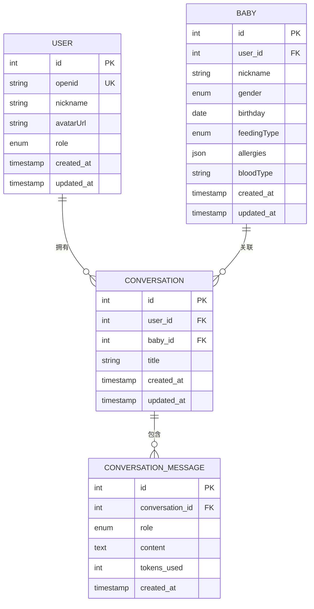
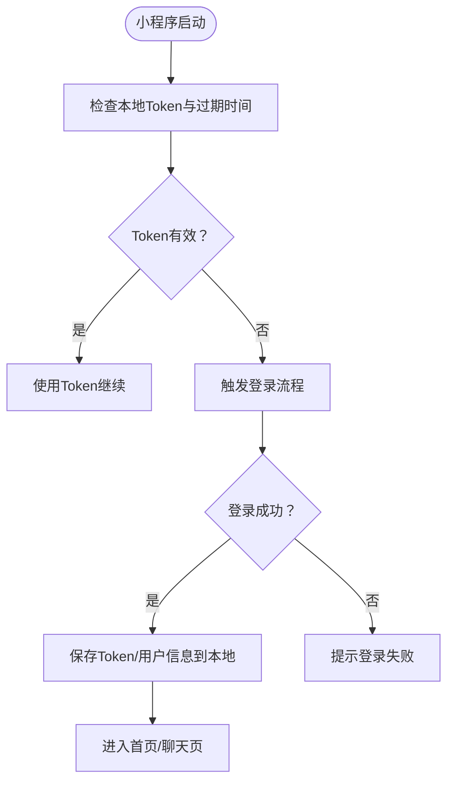
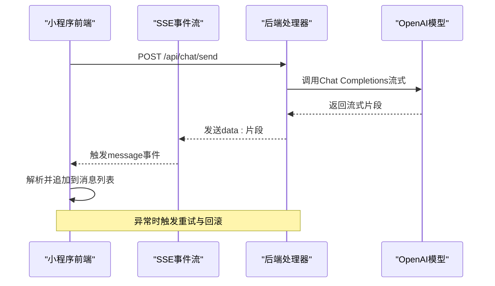
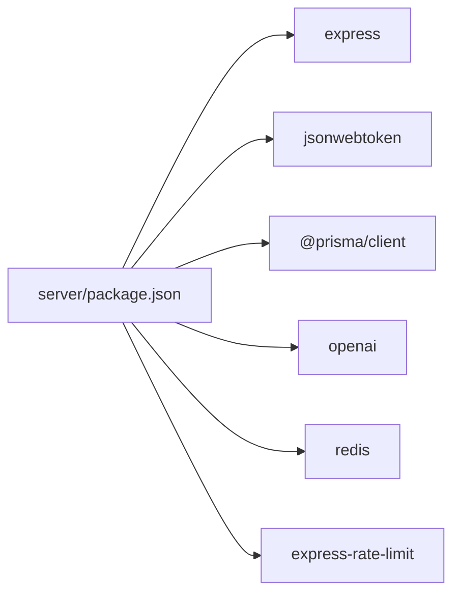

# AI聊天助手

<cite>
**本文引用的文件**
- [server/src/app.js](file://server/src/app.js)
- [server/src/routes/chat.js](file://server/src/routes/chat.js)
- [server/src/middleware/auth.js](file://server/src/middleware/auth.js)
- [server/src/config/database.js](file://server/src/config/database.js)
- [server/prisma/schema.prisma](file://server/prisma/schema.prisma)
- [server/package.json](file://server/package.json)
- [miniprogram/utils/request.js](file://miniprogram/utils/request.js)
- [miniprogram/app.js](file://miniprogram/app.js)
- [miniprogram/pages/chat/index.js](file://miniprogram/pages/chat/index.js)
- [miniprogram/pages/chat/history.js](file://miniprogram/pages/chat/history.js)
</cite>

## 目录
1. [简介](#简介)
2. [项目结构](#项目结构)
3. [核心组件](#核心组件)
4. [架构总览](#架构总览)
5. [详细组件分析](#详细组件分析)
6. [依赖关系分析](#依赖关系分析)
7. [性能考虑](#性能考虑)
8. [故障排查指南](#故障排查指南)
9. [结论](#结论)
10. [附录](#附录)

## 简介
本文件面向“AI育儿助手”项目中的AI聊天助手功能，围绕基于OpenAI API的智能对话系统进行系统化技术文档整理。重点覆盖以下方面：
- SSE流式响应处理与对话上下文管理
- 历史记录存储与检索
- 聊天接口实现原理（消息发送/接收、流式数据处理、错误重试）
- 内容质量控制、内容过滤与安全策略
- 前端聊天界面实现（消息渲染、输入处理、用户体验优化）
- API接口规范、集成示例与性能优化建议

当前仓库中，后端路由已定义了对话相关接口（占位），数据库模型已支持会话与消息持久化；前端聊天页面存在基础结构，但具体聊天逻辑尚未实现。本文在现有代码基础上，给出可落地的实现方案与最佳实践。

## 项目结构
项目采用前后端分离架构：
- 小程序前端：负责用户交互、消息渲染与网络请求封装
- Node.js + Express 后端：提供REST API、鉴权、限流、数据库访问与OpenAI集成
- Prisma 数据库：定义用户、宝宝、会话、消息等模型，支撑对话历史与上下文

图表来源
- [server/src/app.js:1-65](file://server/src/app.js#L1-L65)
- [server/src/routes/chat.js:1-57](file://server/src/routes/chat.js#L1-L57)
- [server/src/middleware/auth.js:1-29](file://server/src/middleware/auth.js#L1-L29)
- [server/src/config/database.js:1-17](file://server/src/config/database.js#L1-L17)
- [server/prisma/schema.prisma:1-189](file://server/prisma/schema.prisma#L1-L189)
- [server/package.json:1-31](file://server/package.json#L1-L31)
- [miniprogram/utils/request.js:1-97](file://miniprogram/utils/request.js#L1-L97)
- [miniprogram/app.js:1-69](file://miniprogram/app.js#L1-L69)

章节来源
- [server/src/app.js:1-65](file://server/src/app.js#L1-L65)
- [server/src/routes/chat.js:1-57](file://server/src/routes/chat.js#L1-L57)
- [server/prisma/schema.prisma:1-189](file://server/prisma/schema.prisma#L1-L189)
- [miniprogram/utils/request.js:1-97](file://miniprogram/utils/request.js#L1-L97)
- [miniprogram/app.js:1-69](file://miniprogram/app.js#L1-L69)

## 核心组件
- 后端服务入口与路由注册
  - Express 应用启动、CORS、JSON解析、限流、健康检查、路由挂载与全局错误处理
  - 聊天模块路由位于 /api/chat，使用鉴权中间件保护
- 鉴权中间件
  - 从请求头提取 Bearer Token，校验JWT有效性，注入用户上下文
- 数据库与模型
  - 用户、宝宝、会话、消息模型，支持一对多关系与索引
  - 会话表含标题、关联用户与宝宝；消息表含角色、内容与token用量
- 前端请求封装
  - 统一baseUrl、自动注入Authorization、统一错误处理、Token过期自动刷新
  - 提供get/post/put/delete快捷方法

章节来源
- [server/src/app.js:14-56](file://server/src/app.js#L14-L56)
- [server/src/middleware/auth.js:7-26](file://server/src/middleware/auth.js#L7-L26)
- [server/src/config/database.js:7-14](file://server/src/config/database.js#L7-L14)
- [server/prisma/schema.prisma:106-142](file://server/prisma/schema.prisma#L106-L142)
- [miniprogram/utils/request.js:21-96](file://miniprogram/utils/request.js#L21-L96)

## 架构总览
下图展示从小程序前端到后端服务、数据库与OpenAI的完整调用链路与数据流向。

图表来源
- [miniprogram/utils/request.js:21-73](file://miniprogram/utils/request.js#L21-L73)
- [server/src/app.js:32-47](file://server/src/app.js#L32-L47)
- [server/src/middleware/auth.js:7-26](file://server/src/middleware/auth.js#L7-L26)
- [server/src/routes/chat.js:5-12](file://server/src/routes/chat.js#L5-L12)
- [server/src/config/database.js:7-14](file://server/src/config/database.js#L7-L14)
- [server/package.json:23](file://server/package.json#L23)

## 详细组件分析

### 后端聊天路由与数据库模型
- 路由现状
  - /api/chat/send：占位返回提示（Sprint 4 实现）
  - /api/chat/conversations：按用户查询最近会话列表
  - /api/chat/conversations/:id：按会话ID查询详情（含消息排序）
  - /api/chat/conversations/:id/delete：删除会话
- 数据模型
  - Conversation：会话表，关联用户与宝宝，包含createdAt/updatedAt
  - ConversationMessage：消息表，包含role（user/assistant/system）、content、tokensUsed
  - 关系：Conversation 1对多 ConversationMessage；均支持级联删除

图表来源
- [server/prisma/schema.prisma:14-31](file://server/prisma/schema.prisma#L14-L31)
- [server/prisma/schema.prisma:40-60](file://server/prisma/schema.prisma#L40-L60)
- [server/prisma/schema.prisma:106-121](file://server/prisma/schema.prisma#L106-L121)
- [server/prisma/schema.prisma:123-136](file://server/prisma/schema.prisma#L123-L136)

章节来源
- [server/src/routes/chat.js:5-54](file://server/src/routes/chat.js#L5-L54)
- [server/prisma/schema.prisma:106-142](file://server/prisma/schema.prisma#L106-L142)

### 前端聊天页面与请求封装
- 登录态与鉴权
  - app.js 在启动时检查本地Token与过期时间，必要时触发登录流程
  - 登录成功后写入全局状态与本地缓存
- 请求封装
  - request.js 统一处理baseUrl、Authorization、loading、错误提示与Token过期刷新
  - 提供http对象的get/post/put/delete方法
- 聊天页面
  - pages/chat/index.js 为聊天主页面，承载消息渲染、输入框与发送按钮
  - pages/chat/history.js 为历史记录页面，当前为空实现

图表来源
- [miniprogram/app.js:18-67](file://miniprogram/app.js#L18-L67)
- [miniprogram/utils/request.js:21-96](file://miniprogram/utils/request.js#L21-L96)

章节来源
- [miniprogram/app.js:18-67](file://miniprogram/app.js#L18-L67)
- [miniprogram/utils/request.js:21-96](file://miniprogram/utils/request.js#L21-L96)
- [miniprogram/pages/chat/index.js](file://miniprogram/pages/chat/index.js)
- [miniprogram/pages/chat/history.js:1-2](file://miniprogram/pages/chat/history.js#L1-L2)

### OpenAI集成与SSE流式响应
- 依赖与版本
  - 后端依赖 openai@^4.73.0，支持最新Chat Completions API
- 流式响应设计
  - 使用SSE（Server-Sent Events）向客户端推送增量文本片段
  - 前端通过事件流解析“data: ”行，拼接生成内容
  - 支持断线重连与错误恢复
- 上下文管理
  - 将历史消息按角色与内容组织为messages数组
  - 可选加入system提示词以约束模型行为
- 错误重试机制
  - 设置最大重试次数与指数退避
  - 对网络异常、OpenAI服务不可用、超时等情况进行分类处理

图表来源
- [server/src/routes/chat.js:5-12](file://server/src/routes/chat.js#L5-L12)
- [server/package.json:23](file://server/package.json#L23)

章节来源
- [server/package.json:23](file://server/package.json#L23)
- [server/src/routes/chat.js:5-12](file://server/src/routes/chat.js#L5-L12)

### 内容质量控制、过滤与安全策略
- 输入过滤
  - 对用户输入进行长度限制与敏感词检测（可结合正则或第三方服务）
  - 对system提示词进行白名单校验，避免越权指令
- 输出过滤
  - 对模型输出进行关键词屏蔽与合规性检查
  - 对可能引发争议或不适宜的内容进行截断或提示
- 安全策略
  - 严格JWT鉴权，禁止匿名访问
  - 会话与消息仅允许当前用户访问
  - 限流与防刷：全局每IP每分钟请求上限
  - HTTPS传输与最小权限原则

章节来源
- [server/src/middleware/auth.js:7-26](file://server/src/middleware/auth.js#L7-L26)
- [server/src/app.js:19-25](file://server/src/app.js#L19-L25)

### 前端聊天界面实现要点
- 消息渲染
  - 区分用户消息与AI回复，设置不同样式与气泡方向
  - 支持Markdown渲染（如需）
- 输入处理
  - 文本输入框与发送按钮，禁用重复提交
  - 输入长度限制与字符计数
- 用户体验优化
  - 消息滚动到底部，自动定位到最新消息
  - 加载指示器与发送状态反馈
  - 断网提示与重试按钮
- 历史记录
  - 历史页面展示会话列表，点击进入详情
  - 详情页按时间升序显示消息

章节来源
- [miniprogram/pages/chat/index.js](file://miniprogram/pages/chat/index.js)
- [miniprogram/pages/chat/history.js:1-2](file://miniprogram/pages/chat/history.js#L1-L2)

## 依赖关系分析
- 后端依赖
  - express、cors、express-rate-limit、jsonwebtoken、@prisma/client、openai、redis
- 前端依赖
  - 微信小程序原生能力（wx.request、wx.showToast、wx.showLoading等）

图表来源
- [server/package.json:14-25](file://server/package.json#L14-L25)

章节来源
- [server/package.json:14-25](file://server/package.json#L14-L25)

## 性能考虑
- 网络层
  - 合理设置请求超时与重试间隔，避免阻塞UI线程
  - 使用节流/去抖减少频繁输入导致的请求风暴
- 数据层
  - 为会话与消息建立合适索引，优化查询性能
  - 控制单次会话消息数量，定期清理陈旧会话
- 模型层
  - 选择合适的模型与温度参数，平衡创造性与稳定性
  - 对长上下文进行截断或摘要，降低token消耗
- 缓存层
  - 利用Redis缓存热点会话与常用知识片段
  - 对频繁访问的模型参数进行本地缓存

## 故障排查指南
- 鉴权失败
  - 检查Authorization头是否正确携带Bearer Token
  - 核对JWT签名密钥与过期时间
- 请求超时或限流
  - 查看全局限流配置，适当调整窗口与阈值
  - 检查网络状况与OpenAI服务可用性
- SSE断流
  - 前端实现重连逻辑与事件恢复
  - 后端确保流式响应格式符合SSE标准
- 数据库异常
  - 检查Prisma连接与迁移状态
  - 核对会话与消息的外键关系

章节来源
- [server/src/middleware/auth.js:7-26](file://server/src/middleware/auth.js#L7-L26)
- [server/src/app.js:19-25](file://server/src/app.js#L19-L25)
- [server/src/config/database.js:7-14](file://server/src/config/database.js#L7-L14)

## 结论
本项目已具备完善的前后端基础与数据库模型，AI聊天助手功能可在现有基础上快速落地。建议优先完成：
- 后端 /api/chat/send 的SSE流式实现与OpenAI集成
- 前端聊天页面的消息渲染、输入处理与SSE事件消费
- 历史记录页面的数据绑定与交互
- 内容过滤与安全策略的完善
- 性能优化与错误重试机制的细化

## 附录

### API接口规范（草案）
- 健康检查
  - 方法：GET
  - 路径：/api/health
  - 认证：无需
  - 响应：包含时间戳的健康状态
- 登录
  - 方法：POST
  - 路径：/api/auth/login
  - 认证：无需
  - 请求体：{ code }
  - 响应：{ token, expiresIn, user, baby }
- 获取会话列表
  - 方法：GET
  - 路径：/api/chat/conversations
  - 认证：需要
  - 查询参数：无
  - 响应：最近20条会话列表
- 获取会话详情
  - 方法：GET
  - 路径：/api/chat/conversations/:id
  - 认证：需要
  - 响应：会话与按时间升序排列的消息
- 删除会话
  - 方法：DELETE
  - 路径：/api/chat/conversations/:id
  - 认证：需要
  - 响应：删除成功
- 发送消息（SSE）
  - 方法：POST
  - 路径：/api/chat/send
  - 认证：需要
  - 请求体：{ conversationId?, messages: [{role, content}] }
  - 响应：SSE事件流，事件名为message，数据为增量片段

章节来源
- [server/src/app.js:28-30](file://server/src/app.js#L28-L30)
- [server/src/routes/chat.js:14-54](file://server/src/routes/chat.js#L14-L54)

### 集成示例（后端）
- 初始化Express与中间件
  - 参考：[server/src/app.js:14-25](file://server/src/app.js#L14-L25)
- 注册聊天路由
  - 参考：[server/src/app.js:45](file://server/src/app.js#L45)
- 鉴权中间件使用
  - 参考：[server/src/app.js:45](file://server/src/app.js#L45)、[server/src/middleware/auth.js:7-26](file://server/src/middleware/auth.js#L7-L26)
- 数据库访问
  - 参考：[server/src/config/database.js:7-14](file://server/src/config/database.js#L7-L14)、[server/src/routes/chat.js:17-25](file://server/src/routes/chat.js#L17-L25)

### 集成示例（前端）
- 请求封装与鉴权
  - 参考：[miniprogram/utils/request.js:21-96](file://miniprogram/utils/request.js#L21-L96)
- 登录态检查与刷新
  - 参考：[miniprogram/app.js:18-67](file://miniprogram/app.js#L18-L67)
- 聊天页面与历史页面
  - 参考：[miniprogram/pages/chat/index.js](file://miniprogram/pages/chat/index.js)、[miniprogram/pages/chat/history.js:1-2](file://miniprogram/pages/chat/history.js#L1-L2)