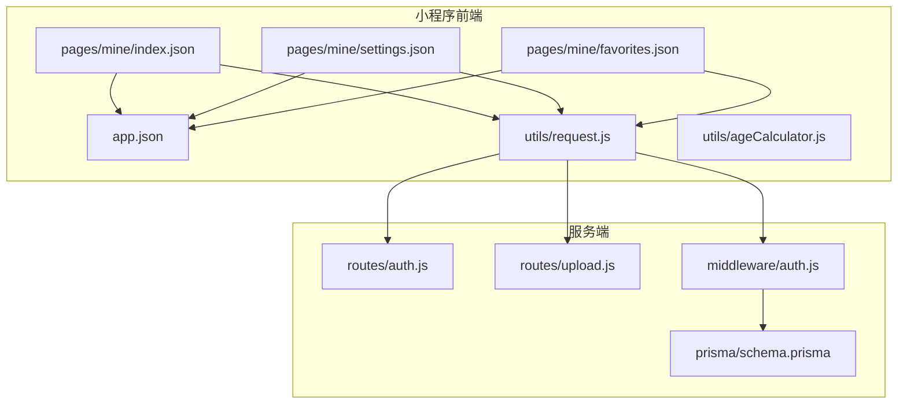
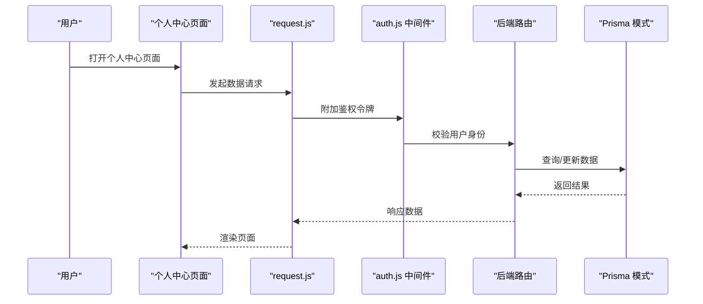
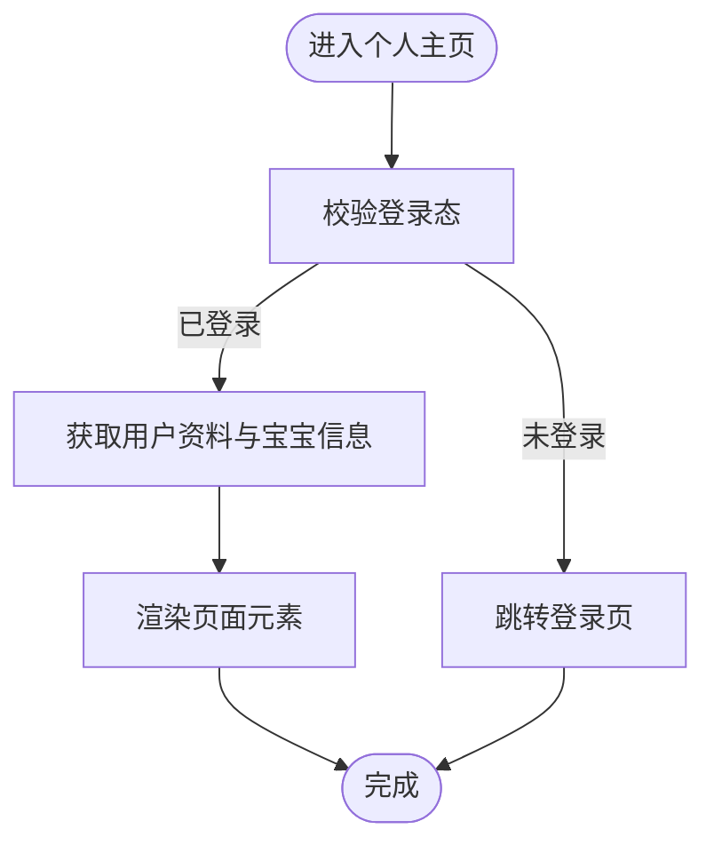
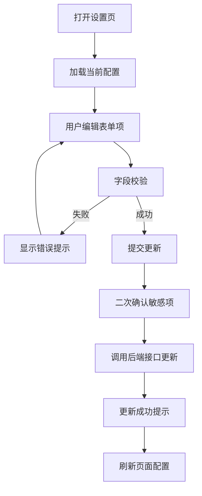
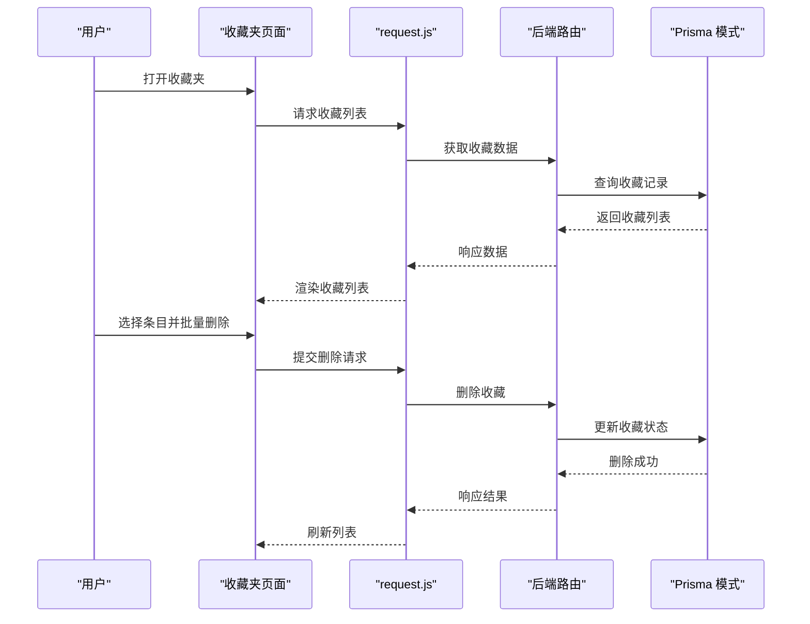
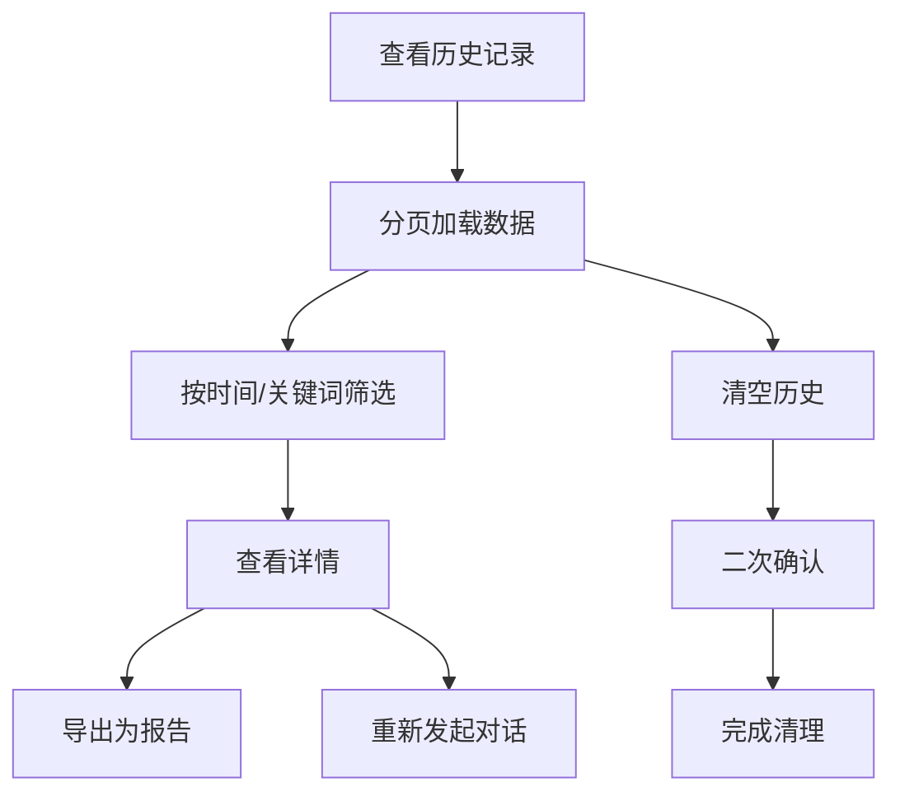
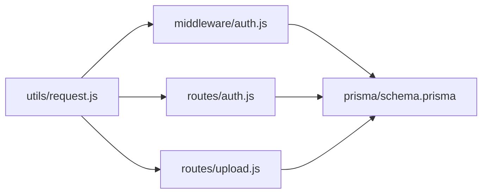

# 个人中心

<cite>
**本文档引用的文件**
- [miniprogram/pages/mine/index.json](file://miniprogram/pages/mine/index.json)
- [miniprogram/pages/mine/settings.json](file://miniprogram/pages/mine/settings.json)
- [miniprogram/pages/mine/favorites.json](file://miniprogram/pages/mine/favorites.json)
- [miniprogram/app.json](file://miniprogram/app.json)
- [miniprogram/utils/request.js](file://miniprogram/utils/request.js)
- [miniprogram/utils/ageCalculator.js](file://miniprogram/utils/ageCalculator.js)
- [server/src/routes/auth.js](file://server/src/routes/auth.js)
- [server/src/routes/upload.js](file://server/src/routes/upload.js)
- [server/src/middleware/auth.js](file://server/src/middleware/auth.js)
- [server/prisma/schema.prisma](file://server/prisma/schema.prisma)
</cite>

## 目录
1. [简介](#简介)
2. [项目结构](#项目结构)
3. [核心组件](#核心组件)
4. [架构总览](#架构总览)
5. [详细组件分析](#详细组件分析)
6. [依赖关系分析](#依赖关系分析)
7. [性能考虑](#性能考虑)
8. [故障排除指南](#故障排除指南)
9. [结论](#结论)

## 简介
本文件聚焦于“个人中心”功能模块，涵盖用户个人信息管理、系统设置、收藏夹与历史记录等核心能力。根据现有代码库，个人中心包含以下页面：
- 个人主页：展示用户基本信息与快捷入口
- 设置页：集中管理通知、隐私与账户安全等配置
- 收藏夹：管理用户收藏的内容条目
- 历史记录：查看聊天与使用行为记录（当前仓库中历史记录位于聊天模块）

由于当前仓库未包含个人中心各页面的完整实现文件（如 JS 逻辑），本文在不直接展示代码的前提下，基于现有 JSON 配置与后端路由进行架构性说明，并给出可扩展的实现建议。

## 项目结构
个人中心相关页面位于小程序端的 pages/mine 目录，配合全局应用配置与通用工具函数共同构成前端基础层；后端通过 Prisma 数据模型与路由接口支撑数据持久化与鉴权控制。

**图表来源**
- [miniprogram/pages/mine/index.json:1-4](file://miniprogram/pages/mine/index.json#L1-L4)
- [miniprogram/pages/mine/settings.json:1-4](file://miniprogram/pages/mine/settings.json#L1-L4)
- [miniprogram/pages/mine/favorites.json:1-4](file://miniprogram/pages/mine/favorites.json#L1-L4)
- [miniprogram/app.json](file://miniprogram/app.json)
- [miniprogram/utils/request.js](file://miniprogram/utils/request.js)
- [miniprogram/utils/ageCalculator.js](file://miniprogram/utils/ageCalculator.js)
- [server/src/routes/auth.js](file://server/src/routes/auth.js)
- [server/src/routes/upload.js](file://server/src/routes/upload.js)
- [server/src/middleware/auth.js](file://server/src/middleware/auth.js)
- [server/prisma/schema.prisma](file://server/prisma/schema.prisma)

**章节来源**
- [miniprogram/pages/mine/index.json:1-4](file://miniprogram/pages/mine/index.json#L1-L4)
- [miniprogram/pages/mine/settings.json:1-4](file://miniprogram/pages/mine/settings.json#L1-L4)
- [miniprogram/pages/mine/favorites.json:1-4](file://miniprogram/pages/mine/favorites.json#L1-L4)
- [miniprogram/app.json](file://miniprogram/app.json)

## 核心组件
- 个人主页（mine/index）
  - 职责：展示用户头像、昵称、宝宝信息与常用入口（设置、收藏夹、历史记录）
  - 交互：点击进入各子页面，支持下拉刷新加载最新数据
- 设置页（mine/settings）
  - 职责：集中管理通知开关、隐私设置、账户安全（修改密码、绑定手机/邮箱等）
  - 交互：表单提交、二次确认、错误提示与成功反馈
- 收藏夹（mine/favorites）
  - 职责：展示用户收藏的内容列表，支持按类型筛选、删除与批量操作
  - 交互：长按选择、多选删除、空状态占位图
- 历史记录（chat/history）
  - 职责：展示聊天历史与操作日志，支持按时间筛选与详情查看
  - 交互：分页加载、搜索过滤、导出或清空历史

上述职责基于页面配置与目录结构推断，具体实现需补充对应 JS 逻辑文件。

**章节来源**
- [miniprogram/pages/mine/index.json:1-4](file://miniprogram/pages/mine/index.json#L1-L4)
- [miniprogram/pages/mine/settings.json:1-4](file://miniprogram/pages/mine/settings.json#L1-L4)
- [miniprogram/pages/mine/favorites.json:1-4](file://miniprogram/pages/mine/favorites.json#L1-L4)

## 架构总览
前端通过统一请求封装与鉴权中间件访问后端接口，Prisma 数据模型定义用户、收藏、历史等实体关系。整体流程如下：

**图表来源**
- [miniprogram/utils/request.js](file://miniprogram/utils/request.js)
- [server/src/middleware/auth.js](file://server/src/middleware/auth.js)
- [server/src/routes/auth.js](file://server/src/routes/auth.js)
- [server/prisma/schema.prisma](file://server/prisma/schema.prisma)

## 详细组件分析

### 个人主页（mine/index）
- 页面职责
  - 展示用户头像与昵称，支持跳转到设置、收藏夹与历史记录
  - 显示宝宝信息卡片，便于快速查看成长记录
- 数据流
  - 登录态校验通过后，从后端获取用户资料与宝宝档案
  - 使用本地缓存优化首次加载体验
- 性能要点
  - 图片懒加载与尺寸裁剪
  - 下拉刷新避免重复请求

**图表来源**
- [miniprogram/utils/request.js](file://miniprogram/utils/request.js)
- [server/src/middleware/auth.js](file://server/src/middleware/auth.js)

**章节来源**
- [miniprogram/pages/mine/index.json:1-4](file://miniprogram/pages/mine/index.json#L1-L4)

### 设置页（mine/settings）
- 功能清单
  - 通知设置：推送开关、消息类型选择
  - 隐私保护：实名认证、数据导出与删除申请
  - 账户安全：修改密码、绑定手机/邮箱、登录设备管理
- 业务逻辑
  - 表单校验：长度、格式与一致性检查
  - 二次确认：敏感操作（如注销）弹窗确认
  - 错误处理：网络异常、参数错误与权限不足提示
- 安全策略
  - 修改密码需旧密码验证
  - 绑定新手机号/邮箱需验证码校验

**图表来源**
- [miniprogram/utils/request.js](file://miniprogram/utils/request.js)
- [server/src/routes/auth.js](file://server/src/routes/auth.js)

**章节来源**
- [miniprogram/pages/mine/settings.json:1-4](file://miniprogram/pages/mine/settings.json#L1-L4)

### 收藏夹（mine/favorites）
- 功能清单
  - 内容收藏：支持文章、知识、记录等类型收藏
  - 分类管理：按类型筛选与标签分组
  - 批量操作：多选删除、清空收藏
- 数据模型（示意）
  - 用户与收藏为一对多关系
  - 收藏条目包含类型、目标ID、创建时间等
- 交互流程
  - 列表加载：分页请求，空状态占位
  - 删除操作：单个删除与批量删除
  - 同步状态：删除后实时更新列表与计数

**图表来源**
- [miniprogram/utils/request.js](file://miniprogram/utils/request.js)
- [server/prisma/schema.prisma](file://server/prisma/schema.prisma)

**章节来源**
- [miniprogram/pages/mine/favorites.json:1-4](file://miniprogram/pages/mine/favorites.json#L1-L4)

### 历史记录（chat/history）
- 功能清单
  - 聊天历史：按时间倒序排列，支持查看详情与重新发起对话
  - 操作日志：记录关键操作（收藏、删除、导出等）
  - 使用统计：按月/周维度统计对话次数与平均时长
- 数据模型（示意）
  - 历史记录包含会话ID、开始/结束时间、消息数量、标签等
- 交互流程
  - 分页加载：滚动触底自动加载更多
  - 过滤搜索：按时间范围与关键词筛选
  - 导出清理：支持导出为报告或一键清空

**图表来源**
- [miniprogram/utils/request.js](file://miniprogram/utils/request.js)
- [server/prisma/schema.prisma](file://server/prisma/schema.prisma)

**章节来源**
- [miniprogram/pages/chat/history.json](file://miniprogram/pages/chat/history.json)

## 依赖关系分析
- 前端依赖
  - request.js：统一请求封装，内置错误处理与重试策略
  - auth.js 中间件：拦截器注入令牌、统一鉴权
  - app.json：全局导航与窗口配置
- 后端依赖
  - Prisma schema：定义用户、收藏、历史等实体与关系
  - auth.js 路由：登录、注册、修改密码等
  - upload.js 路由：头像上传与文件存储

**图表来源**
- [miniprogram/utils/request.js](file://miniprogram/utils/request.js)
- [server/src/middleware/auth.js](file://server/src/middleware/auth.js)
- [server/src/routes/auth.js](file://server/src/routes/auth.js)
- [server/src/routes/upload.js](file://server/src/routes/upload.js)
- [server/prisma/schema.prisma](file://server/prisma/schema.prisma)

**章节来源**
- [miniprogram/utils/request.js](file://miniprogram/utils/request.js)
- [server/src/middleware/auth.js](file://server/src/middleware/auth.js)
- [server/src/routes/auth.js](file://server/src/routes/auth.js)
- [server/src/routes/upload.js](file://server/src/routes/upload.js)
- [server/prisma/schema.prisma](file://server/prisma/schema.prisma)

## 性能考虑
- 前端
  - 列表虚拟化：对历史记录与收藏列表启用虚拟滚动
  - 缓存策略：本地缓存用户资料与常用设置，减少网络请求
  - 图片优化：头像按需加载与尺寸裁剪
- 后端
  - 分页查询：限制每页大小，避免一次性返回大量数据
  - 索引优化：在常用查询字段上建立索引（如用户ID、创建时间）
  - 并发控制：对高并发场景下的收藏/删除操作加锁或幂等设计

## 故障排除指南
- 登录态失效
  - 现象：设置页或收藏夹无法加载数据
  - 处理：触发重新登录流程，刷新令牌后重试
- 请求超时
  - 现象：历史记录加载缓慢或失败
  - 处理：增加重试次数与超时阈值，必要时降级为本地缓存
- 文件上传失败
  - 现象：头像上传报错
  - 处理：检查文件类型与大小限制，确认网络与存储服务可用
- 权限不足
  - 现象：修改密码或删除收藏无权限
  - 处理：校验用户身份与操作范围，提示重新登录或联系客服

**章节来源**
- [miniprogram/utils/request.js](file://miniprogram/utils/request.js)
- [server/src/middleware/auth.js](file://server/src/middleware/auth.js)

## 结论
个人中心作为用户与系统交互的核心入口，需要在易用性、安全性与性能之间取得平衡。当前仓库提供了页面配置与基础工具，建议尽快补齐各页面的 JS 实现与后端接口，完善数据模型与鉴权策略，以确保功能稳定与用户体验流畅。