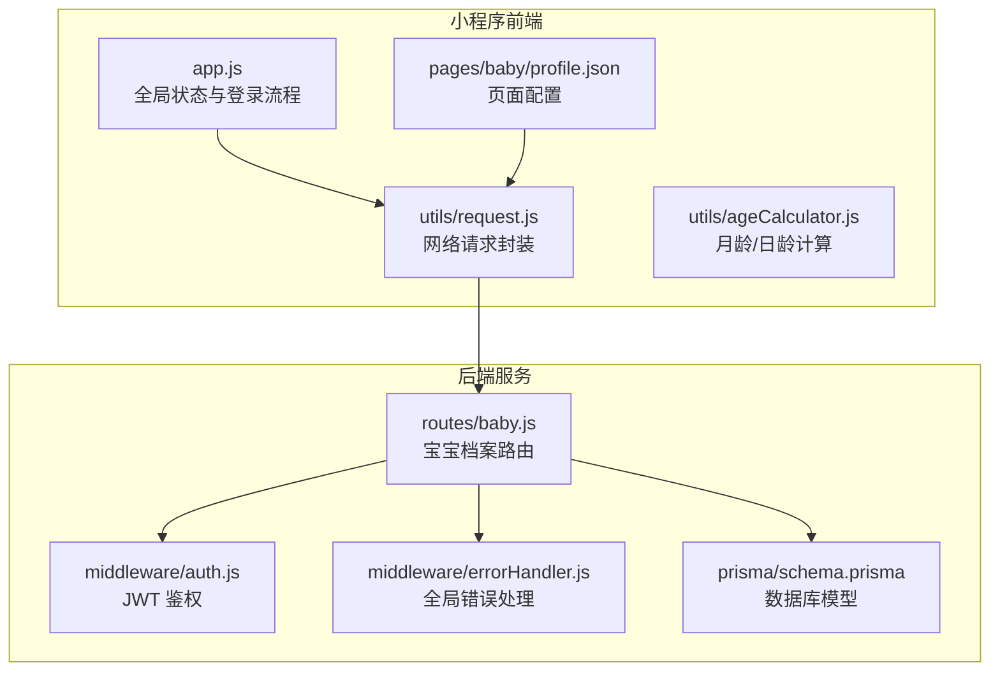
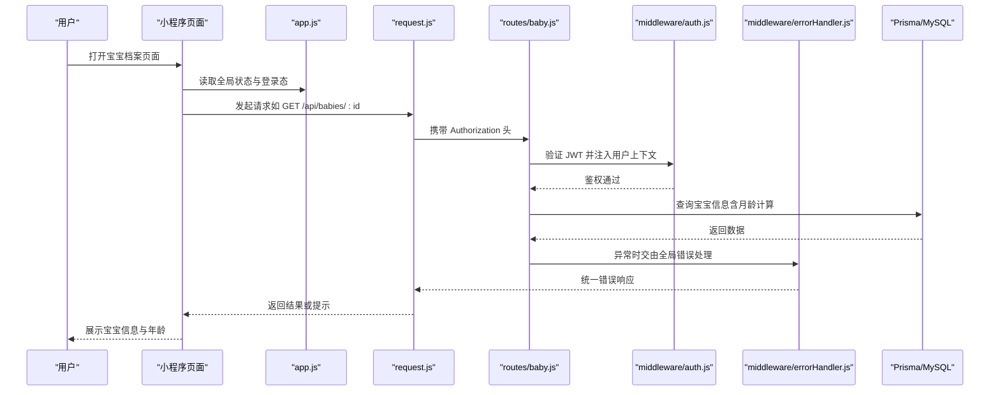
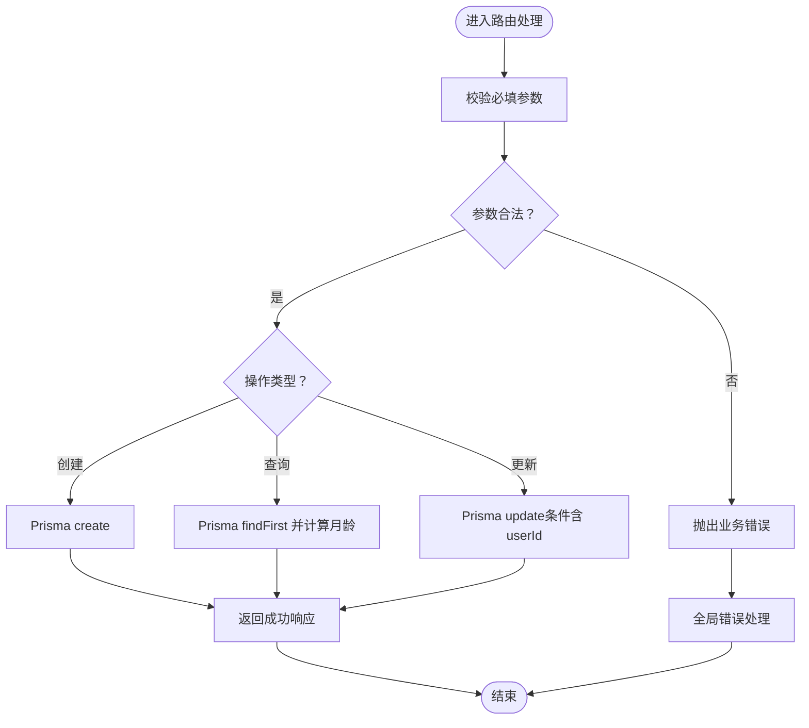
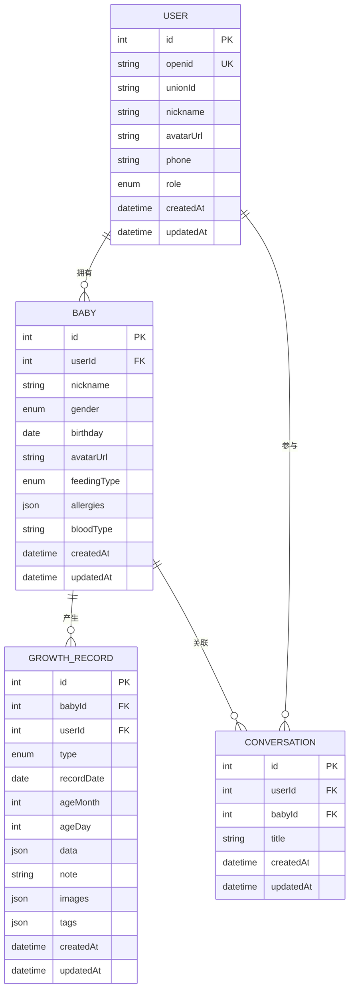
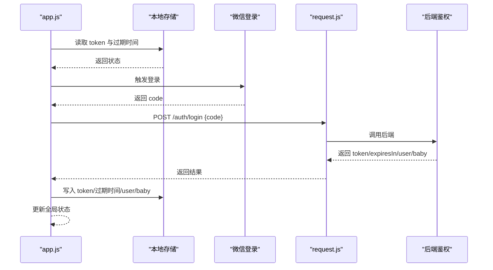
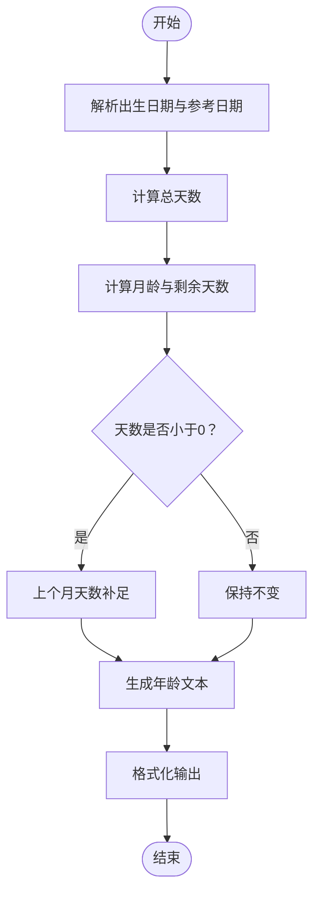
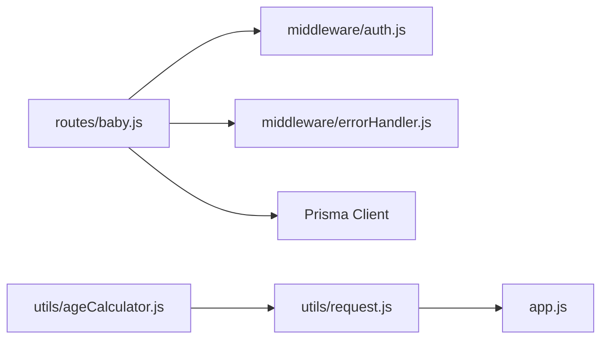

# 宝宝档案管理

<cite>
**本文引用的文件**
- [server/src/routes/baby.js](file://server/src/routes/baby.js)
- [server/prisma/schema.prisma](file://server/prisma/schema.prisma)
- [server/src/middleware/errorHandler.js](file://server/src/middleware/errorHandler.js)
- [server/src/middleware/auth.js](file://server/src/middleware/auth.js)
- [miniprogram/utils/ageCalculator.js](file://miniprogram/utils/ageCalculator.js)
- [miniprogram/utils/request.js](file://miniprogram/utils/request.js)
- [miniprogram/app.js](file://miniprogram/app.js)
- [miniprogram/pages/baby/profile.json](file://miniprogram/pages/baby/profile.json)
</cite>

## 目录
1. [简介](#简介)
2. [项目结构](#项目结构)
3. [核心组件](#核心组件)
4. [架构总览](#架构总览)
5. [详细组件分析](#详细组件分析)
6. [依赖分析](#依赖分析)
7. [性能考虑](#性能考虑)
8. [故障排查指南](#故障排查指南)
9. [结论](#结论)
10. [附录](#附录)

## 简介
本文件面向“AI育儿助手”项目中的“宝宝档案管理”模块，系统性阐述宝宝信息的创建、查询与更新能力，涵盖以下要点：
- 基本信息维护：姓名、性别、生日、喂养方式、血型、头像等字段的录入与修改
- 月龄与日龄计算：服务端与客户端分别提供计算逻辑，确保展示一致
- 数据验证与错误处理：必填校验、业务异常与统一错误响应
- API 设计与实现：RESTful 接口、请求参数与返回格式、鉴权与错误处理
- 前端交互与体验：登录态检查、网络请求封装、Token 过期处理、页面导航
- 与其他模块的数据关联：用户-宝宝关系、成长记录、对话记录等

## 项目结构
该模块横跨小程序前端与 Node.js 后端两部分，采用分层设计：
- 小程序前端负责用户交互、表单输入、调用后端 API、状态存储与页面导航
- 后端通过 Express 提供 RESTful 接口，使用 Prisma 管理 MySQL 数据库，JWT 实现鉴权

图表来源
- [server/src/routes/baby.js:1-100](file://server/src/routes/baby.js#L1-L100)
- [server/src/middleware/auth.js:1-29](file://server/src/middleware/auth.js#L1-L29)
- [server/src/middleware/errorHandler.js:1-52](file://server/src/middleware/errorHandler.js#L1-L52)
- [server/prisma/schema.prisma:1-189](file://server/prisma/schema.prisma#L1-L189)
- [miniprogram/utils/request.js:1-97](file://miniprogram/utils/request.js#L1-L97)
- [miniprogram/utils/ageCalculator.js:1-86](file://miniprogram/utils/ageCalculator.js#L1-L86)
- [miniprogram/app.js:1-69](file://miniprogram/app.js#L1-L69)
- [miniprogram/pages/baby/profile.json:1-4](file://miniprogram/pages/baby/profile.json#L1-L4)

章节来源
- [server/src/routes/baby.js:1-100](file://server/src/routes/baby.js#L1-L100)
- [server/prisma/schema.prisma:1-189](file://server/prisma/schema.prisma#L1-L189)
- [miniprogram/utils/request.js:1-97](file://miniprogram/utils/request.js#L1-L97)
- [miniprogram/utils/ageCalculator.js:1-86](file://miniprogram/utils/ageCalculator.js#L1-L86)
- [miniprogram/app.js:1-69](file://miniprogram/app.js#L1-L69)
- [miniprogram/pages/baby/profile.json:1-4](file://miniprogram/pages/baby/profile.json#L1-L4)

## 核心组件
- 宝宝档案路由（Express）
  - 提供创建、查询、更新三个核心接口，均受 JWT 鉴权保护
  - 查询接口在返回时附加月龄与总天数，便于前端展示
- 数据模型（Prisma）
  - 宝宝表包含用户外键、基础信息、喂养类型枚举、过敏信息、血型等
  - 与用户、成长记录、对话记录存在一对多关系
- 错误处理（中间件）
  - 统一封装业务错误与 Prisma 特定错误码，保证前后端一致的错误语义
- 鉴权（中间件）
  - 从请求头解析并验证 JWT，注入用户上下文
- 前端请求封装（小程序）
  - 统一注入 Authorization 头、处理业务错误码、Token 过期自动重定向登录
- 年龄计算工具（小程序）
  - 提供月龄/日龄计算、日期格式化、友好日期展示

章节来源
- [server/src/routes/baby.js:1-100](file://server/src/routes/baby.js#L1-L100)
- [server/prisma/schema.prisma:40-71](file://server/prisma/schema.prisma#L40-L71)
- [server/src/middleware/errorHandler.js:1-52](file://server/src/middleware/errorHandler.js#L1-L52)
- [server/src/middleware/auth.js:1-29](file://server/src/middleware/auth.js#L1-L29)
- [miniprogram/utils/request.js:1-97](file://miniprogram/utils/request.js#L1-L97)
- [miniprogram/utils/ageCalculator.js:1-86](file://miniprogram/utils/ageCalculator.js#L1-L86)

## 架构总览
下图展示了从前端页面到后端接口与数据库的整体调用链路。

图表来源
- [server/src/routes/baby.js:1-100](file://server/src/routes/baby.js#L1-L100)
- [server/src/middleware/auth.js:1-29](file://server/src/middleware/auth.js#L1-L29)
- [server/src/middleware/errorHandler.js:1-52](file://server/src/middleware/errorHandler.js#L1-L52)
- [server/prisma/schema.prisma:40-71](file://server/prisma/schema.prisma#L40-L71)
- [miniprogram/utils/request.js:1-97](file://miniprogram/utils/request.js#L1-L97)
- [miniprogram/app.js:1-69](file://miniprogram/app.js#L1-L69)

## 详细组件分析

### 宝宝档案路由（CRUD 与月龄计算）
- 接口概览
  - POST /api/babies：创建宝宝档案（必填：昵称、性别、出生日期；可选：喂养方式、血型）
  - GET /api/babies/:id：按 ID 获取宝宝信息（同时计算月龄与总天数）
  - PUT /api/babies/:id：更新宝宝信息（支持昵称、性别、生日、喂养方式、血型、头像）
- 关键逻辑
  - 参数校验：必填字段缺失时抛出自定义业务错误
  - 月龄计算：基于当前时间与出生日期计算月数与天数，返回总天数
  - 数据持久化：Prisma 写入/更新，自动设置创建与更新时间
- 错误处理
  - 业务错误：返回统一格式的错误码与消息
  - Prisma 错误：针对唯一约束冲突与记录不存在进行特定处理
  - 未知错误：统一返回 500 与环境相关的错误信息

图表来源
- [server/src/routes/baby.js:1-100](file://server/src/routes/baby.js#L1-L100)
- [server/src/middleware/errorHandler.js:1-52](file://server/src/middleware/errorHandler.js#L1-L52)

章节来源
- [server/src/routes/baby.js:1-100](file://server/src/routes/baby.js#L1-L100)
- [server/src/middleware/errorHandler.js:1-52](file://server/src/middleware/errorHandler.js#L1-L52)

### 数据模型与关系
- 宝宝表（Baby）
  - 字段：用户外键、昵称、性别、生日、头像、喂养类型、过敏信息、血型、创建/更新时间
  - 关系：属于一个用户；拥有多个成长记录与对话
- 用户表（User）
  - 字段：微信 openid/unionId、昵称、头像、手机号、角色、创建/更新时间
  - 关系：拥有多个宝宝、对话、收藏
- 关联影响
  - 查询宝宝时需匹配当前用户上下文，防止越权访问
  - 删除用户或宝宝时遵循级联策略，避免脏数据

图表来源
- [server/prisma/schema.prisma:14-121](file://server/prisma/schema.prisma#L14-L121)

章节来源
- [server/prisma/schema.prisma:14-121](file://server/prisma/schema.prisma#L14-L121)

### 前端交互与状态管理
- 登录态检查与自动登录
  - 启动时读取本地 Token 与过期时间，若有效则恢复全局状态
  - 若过期或缺失，触发微信登录并调用后端鉴权接口
- 请求封装与错误处理
  - 统一注入 Authorization 头，自动隐藏/显示加载
  - 当返回业务错误码或网络错误时，Toast 提示并拒绝 Promise
  - Token 过期时清理本地缓存并触发重新登录
- 页面导航
  - 宝宝档案页面配置了导航栏标题
  - 若无宝宝信息，引导至引导页

图表来源
- [miniprogram/app.js:1-69](file://miniprogram/app.js#L1-L69)
- [miniprogram/utils/request.js:1-97](file://miniprogram/utils/request.js#L1-L97)

章节来源
- [miniprogram/app.js:1-69](file://miniprogram/app.js#L1-L69)
- [miniprogram/utils/request.js:1-97](file://miniprogram/utils/request.js#L1-L97)
- [miniprogram/pages/baby/profile.json:1-4](file://miniprogram/pages/baby/profile.json#L1-L4)

### 月龄与日龄计算
- 服务端计算
  - 在查询接口中，基于当前时间与出生日期计算月龄与总天数
  - 返回数据包含格式化的生日字符串、月龄、总天数
- 客户端计算
  - 提供独立的年龄计算函数，支持生成“X个月X天”、“X天”等友好文本
  - 提供日期格式化与“今天/昨天/前天/X天前”的友好显示

图表来源
- [server/src/routes/baby.js:37-69](file://server/src/routes/baby.js#L37-L69)
- [miniprogram/utils/ageCalculator.js:1-86](file://miniprogram/utils/ageCalculator.js#L1-L86)

章节来源
- [server/src/routes/baby.js:37-69](file://server/src/routes/baby.js#L37-L69)
- [miniprogram/utils/ageCalculator.js:1-86](file://miniprogram/utils/ageCalculator.js#L1-L86)

## 依赖分析
- 组件耦合
  - 路由层依赖鉴权中间件与错误处理中间件，职责清晰
  - 路由层依赖 Prisma 数据模型，实现对数据库的读写
  - 前端请求封装依赖全局状态与登录流程，形成闭环
- 外部依赖
  - JWT 库用于鉴权中间件
  - Prisma 客户端用于数据库访问
  - 微信小程序运行时用于登录与本地存储
- 潜在风险
  - 路由层直接依赖数据库与错误处理，建议引入服务层以增强可测试性
  - 前端请求封装与页面逻辑耦合，建议拆分为更细的服务模块

图表来源
- [server/src/routes/baby.js:1-100](file://server/src/routes/baby.js#L1-L100)
- [server/src/middleware/auth.js:1-29](file://server/src/middleware/auth.js#L1-L29)
- [server/src/middleware/errorHandler.js:1-52](file://server/src/middleware/errorHandler.js#L1-L52)
- [miniprogram/utils/request.js:1-97](file://miniprogram/utils/request.js#L1-L97)
- [miniprogram/utils/ageCalculator.js:1-86](file://miniprogram/utils/ageCalculator.js#L1-L86)
- [miniprogram/app.js:1-69](file://miniprogram/app.js#L1-L69)

章节来源
- [server/src/routes/baby.js:1-100](file://server/src/routes/baby.js#L1-L100)
- [server/src/middleware/auth.js:1-29](file://server/src/middleware/auth.js#L1-L29)
- [server/src/middleware/errorHandler.js:1-52](file://server/src/middleware/errorHandler.js#L1-L52)
- [miniprogram/utils/request.js:1-97](file://miniprogram/utils/request.js#L1-L97)
- [miniprogram/utils/ageCalculator.js:1-86](file://miniprogram/utils/ageCalculator.js#L1-L86)
- [miniprogram/app.js:1-69](file://miniprogram/app.js#L1-L69)

## 性能考虑
- 数据库索引
  - 用户与宝宝表存在索引，建议在高频查询字段上保持索引策略
- 查询优化
  - 查询接口仅返回必要字段，避免一次性拉取大字段（如 JSON）
- 前端渲染
  - 年龄计算可在服务端完成，减少前端重复计算
- 缓存策略
  - 前端可对常用数据进行本地缓存，降低重复请求频率

## 故障排查指南
- 401 未授权
  - 检查请求头是否包含有效的 Bearer Token
  - 若提示登录已过期，触发前端重新登录流程
- 404 宝宝不存在
  - 确认传入的宝宝 ID 是否正确，且属于当前用户
- 409 数据已存在
  - 检查唯一约束冲突（如用户与宝宝关系），避免重复创建
- 500 服务器内部错误
  - 查看服务端日志，确认数据库连接与 Prisma 客户端状态

章节来源
- [server/src/middleware/errorHandler.js:1-52](file://server/src/middleware/errorHandler.js#L1-L52)
- [server/src/middleware/auth.js:1-29](file://server/src/middleware/auth.js#L1-L29)
- [miniprogram/utils/request.js:1-97](file://miniprogram/utils/request.js#L1-L97)

## 结论
本模块通过清晰的路由设计、严谨的鉴权与错误处理、以及前后端协同的年龄计算，实现了宝宝档案的创建、查询与更新能力。建议后续引入服务层与更细粒度的前端模块划分，进一步提升可维护性与可测试性。

## 附录
- API 接口清单
  - POST /api/babies：创建宝宝档案（必填：昵称、性别、出生日期；可选：喂养方式、血型）
  - GET /api/babies/:id：获取宝宝信息（返回月龄、总天数与格式化生日）
  - PUT /api/babies/:id：更新宝宝信息（支持昵称、性别、生日、喂养方式、血型、头像）
- 数据格式规范
  - 请求与响应统一为 JSON，包含 code、message 字段
  - 业务错误时 code 非 0，401 代表 Token 过期
- 前端交互要点
  - 自动注入 Authorization 头，Token 过期自动重定向登录
  - 页面导航与全局状态同步，确保用户体验一致性