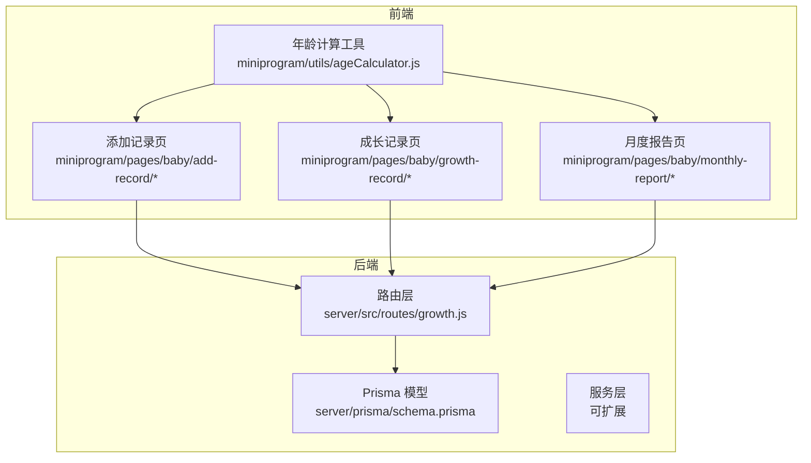
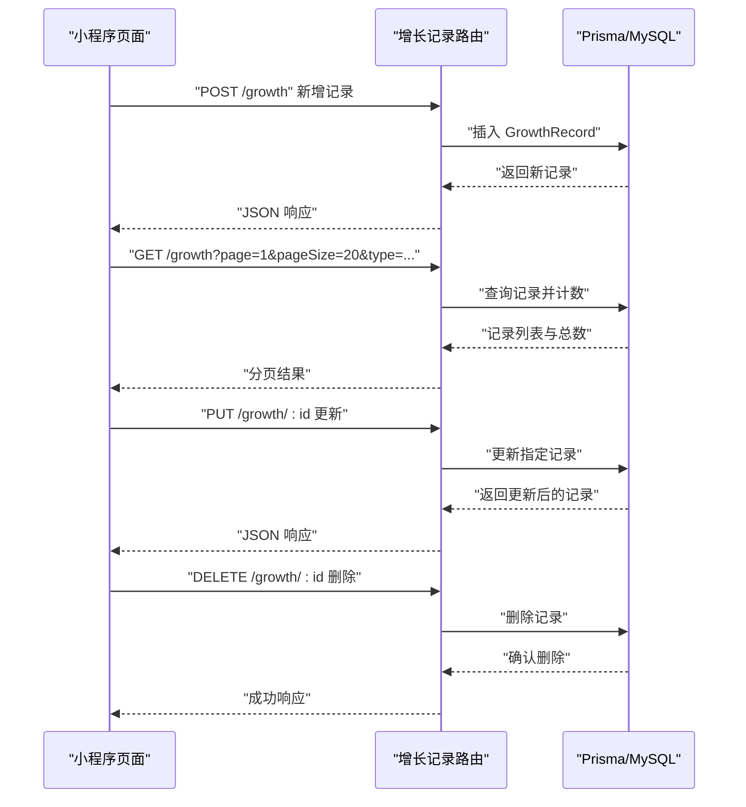
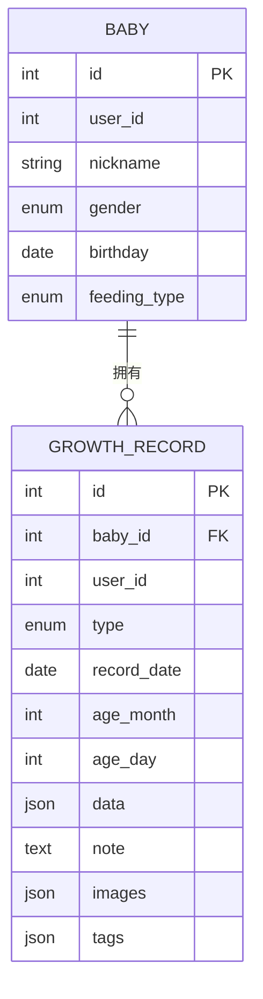
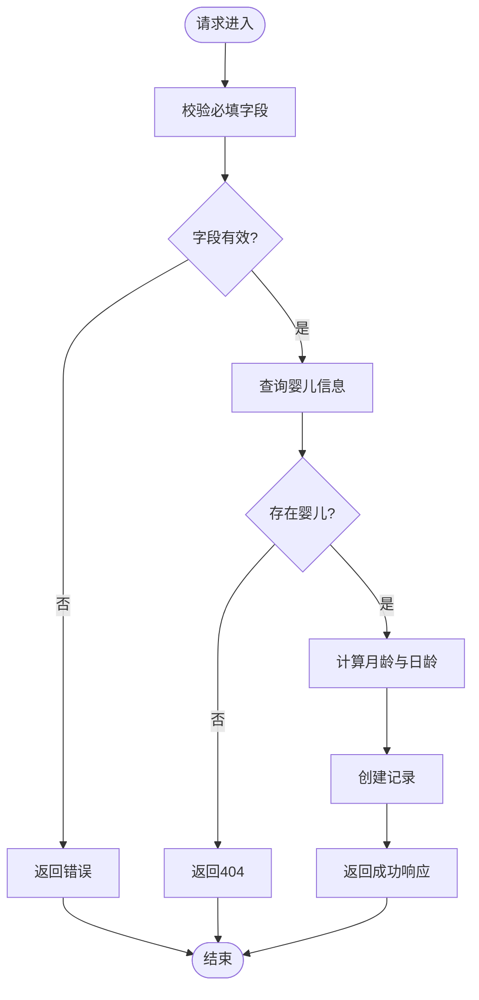
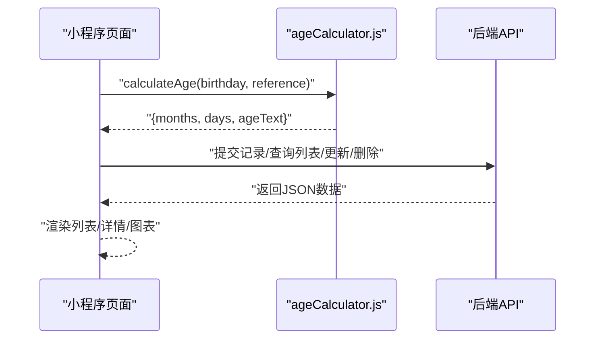

# 成长记录系统

<cite>
**本文引用的文件**
- [server/src/routes/growth.js](file://server/src/routes/growth.js)
- [server/prisma/schema.prisma](file://server/prisma/schema.prisma)
- [miniprogram/utils/ageCalculator.js](file://miniprogram/utils/ageCalculator.js)
- [server/package.json](file://server/package.json)
</cite>

## 目录
1. [简介](#简介)
2. [项目结构](#项目结构)
3. [核心组件](#核心组件)
4. [架构概览](#架构概览)
5. [详细组件分析](#详细组件分析)
6. [依赖分析](#依赖分析)
7. [性能考虑](#性能考虑)
8. [故障排除指南](#故障排除指南)
9. [结论](#结论)
10. [附录](#附录)

## 简介
本文件面向AI育儿助手项目的成长记录系统，系统支持多种成长记录类型的定义与管理，包括身高体重、喂养、睡眠、里程碑、照片、健康记录与普通记录等。后端基于Express + Prisma实现REST API，前端采用微信小程序框架，提供记录的增删改查、分页查询、月龄/日龄计算与基础的月度报告能力。

## 项目结构
后端采用分层结构：路由层负责HTTP请求处理，Prisma作为ORM映射MySQL数据库；前端使用小程序页面与工具函数进行数据展示与交互。



**图示来源**
- [server/src/routes/growth.js:1-118](file://server/src/routes/growth.js#L1-L118)
- [server/prisma/schema.prisma:73-104](file://server/prisma/schema.prisma#L73-L104)
- [miniprogram/utils/ageCalculator.js:1-86](file://miniprogram/utils/ageCalculator.js#L1-L86)

**章节来源**
- [server/src/routes/growth.js:1-118](file://server/src/routes/growth.js#L1-L118)
- [server/prisma/schema.prisma:1-189](file://server/prisma/schema.prisma#L1-L189)
- [miniprogram/utils/ageCalculator.js:1-86](file://miniprogram/utils/ageCalculator.js#L1-L86)

## 核心组件
- 成长记录模型：统一的记录表包含类型、记录日期、月龄、日龄、JSON数据、备注、图片与标签等字段，支持多类型记录。
- 记录路由：提供新增、查询列表（分页+类型筛选）、详情、更新、删除等接口。
- 年龄计算工具：提供出生到参考日期的月龄、日龄与友好日期格式化能力。

**章节来源**
- [server/prisma/schema.prisma:73-104](file://server/prisma/schema.prisma#L73-L104)
- [server/src/routes/growth.js:6-115](file://server/src/routes/growth.js#L6-L115)
- [miniprogram/utils/ageCalculator.js:7-41](file://miniprogram/utils/ageCalculator.js#L7-L41)

## 架构概览
后端通过Express路由接收请求，校验参数与用户权限，调用Prisma访问数据库；前端页面通过网络请求与后端交互，使用工具函数进行日期与年龄展示。



**图示来源**
- [server/src/routes/growth.js:6-115](file://server/src/routes/growth.js#L6-L115)
- [server/prisma/schema.prisma:73-94](file://server/prisma/schema.prisma#L73-L94)

## 详细组件分析

### 数据模型与类型定义
- 记录类型枚举：支持身高体重、喂养、睡眠、里程碑、照片、健康、普通记录等类型。
- 记录实体字段：包含婴儿ID、用户ID、记录类型、记录日期、月龄、日龄、JSON数据、备注、图片数组、标签数组等。
- 索引设计：在婴儿ID+记录日期、婴儿ID+类型上建立索引以优化查询。



**图示来源**
- [server/prisma/schema.prisma:40-60](file://server/prisma/schema.prisma#L40-L60)
- [server/prisma/schema.prisma:73-94](file://server/prisma/schema.prisma#L73-L94)
- [server/prisma/schema.prisma:96-104](file://server/prisma/schema.prisma#L96-L104)

**章节来源**
- [server/prisma/schema.prisma:73-104](file://server/prisma/schema.prisma#L73-L104)

### 后端API接口定义
- 新增记录
  - 方法与路径：POST /growth
  - 请求体字段：type、recordDate、data、note、images、tags
  - 业务逻辑：校验必填字段，根据婴儿出生日期计算月龄与日龄，写入记录
  - 响应：code=0、message='ok'、data=新增记录
- 查询记录列表
  - 方法与路径：GET /growth
  - 查询参数：page、pageSize、type
  - 业务逻辑：按婴儿ID过滤，支持按类型筛选，按记录日期降序分页查询，同时返回总数
  - 响应：分页数据与总数
- 查询记录详情
  - 方法与路径：GET /growth/:id
  - 业务逻辑：按ID与婴儿ID查询，不存在则返回错误
  - 响应：记录详情
- 更新记录
  - 方法与路径：PUT /growth/:id
  - 请求体字段：data、note、images、tags（可选）
  - 业务逻辑：部分字段更新
  - 响应：更新后的记录
- 删除记录
  - 方法与路径：DELETE /growth/:id
  - 业务逻辑：删除指定记录
  - 响应：成功状态



**图示来源**
- [server/src/routes/growth.js:6-44](file://server/src/routes/growth.js#L6-L44)

**章节来源**
- [server/src/routes/growth.js:6-115](file://server/src/routes/growth.js#L6-L115)

### 前端交互与展示
- 年龄计算工具：提供出生到参考日期的月龄、日龄与友好日期格式化，便于页面展示。
- 页面入口：添加记录、成长记录、月度报告等页面通过路由与API交互。
- 交互流程：页面发起请求 -> 后端校验与持久化 -> 返回数据 -> 页面渲染与分页加载。



**图示来源**
- [miniprogram/utils/ageCalculator.js:7-41](file://miniprogram/utils/ageCalculator.js#L7-L41)
- [server/src/routes/growth.js:6-115](file://server/src/routes/growth.js#L6-L115)

**章节来源**
- [miniprogram/utils/ageCalculator.js:1-86](file://miniprogram/utils/ageCalculator.js#L1-L86)

### 月度报告与扩展建议
当前代码库已具备记录的增删改查与年龄计算能力，月度报告功能可通过以下方式扩展：
- 数据聚合：按月统计身高体重、睡眠时长、喂养次数等指标
- 趋势分析：基于时间序列计算月均值、环比变化率
- 健康建议：结合知识库内容与记录数据生成个性化建议
- 图表展示：使用折线图、柱状图展示趋势与分布

该部分为概念性扩展建议，不直接对应现有源码实现。

## 依赖分析
- 后端依赖：Express用于Web框架，Prisma用于数据库访问，MySQL为存储引擎
- 前端依赖：小程序框架与网络请求库，工具函数独立于框架

```mermaid
graph LR
Express["Express"] --> 路由["增长记录路由"]
Prisma["@prisma/client"] --> 路由
MySQL["MySQL"] <- --> Prisma
路由 --> Prisma
路由 --> MySQL
```

**图示来源**
- [server/package.json:14-25](file://server/package.json#L14-L25)
- [server/src/routes/growth.js:1-5](file://server/src/routes/growth.js#L1-L5)

**章节来源**
- [server/package.json:1-31](file://server/package.json#L1-L31)

## 性能考虑
- 查询优化：利用Prisma索引（婴儿ID+记录日期、婴儿ID+类型）提升分页与筛选性能
- 分页策略：后端限制每页数量并返回总数，前端实现滚动加载或分页控件
- 数据结构：JSON字段适合灵活记录不同类型的结构化数据，但需注意查询与索引限制
- 年龄计算：前端工具函数避免重复计算，减少网络请求

## 故障排除指南
- 参数缺失：新增记录时若缺少类型、日期或数据字段，接口将返回错误
- 权限问题：接口依赖认证中间件，确保携带正确的用户标识
- 记录不存在：查询详情或更新删除时若记录不存在，返回404
- 数据库异常：Prisma连接失败或SQL错误时，错误处理器捕获并返回标准错误响应

**章节来源**
- [server/src/routes/growth.js:12-18](file://server/src/routes/growth.js#L12-L18)
- [server/src/routes/growth.js:78-82](file://server/src/routes/growth.js#L78-L82)

## 结论
成长记录系统以统一的记录模型与REST API为核心，实现了多类型记录的全生命周期管理，并提供了年龄计算与基础的月度报告能力。后续可在现有基础上扩展统计分析、趋势预测与健康建议模块，进一步完善AI育儿助手的功能体系。

## 附录
- 开发环境：使用Nodemon进行开发热重载，Prisma进行数据库迁移与客户端生成
- 运行命令：开发模式、启动服务、数据库迁移、种子数据与Prisma Studio

**章节来源**
- [server/package.json:6-12](file://server/package.json#L6-L12)