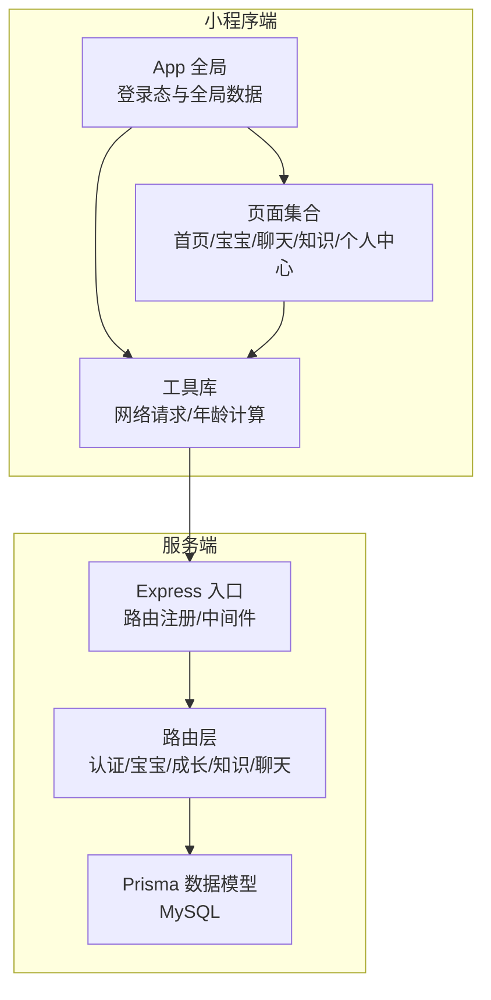
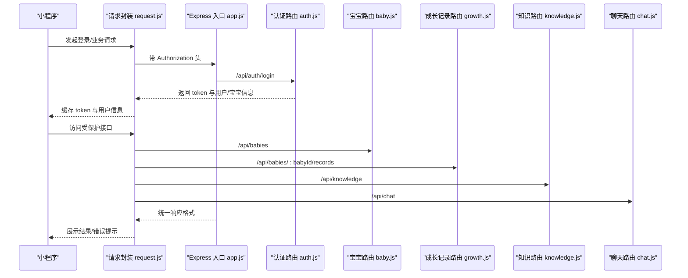
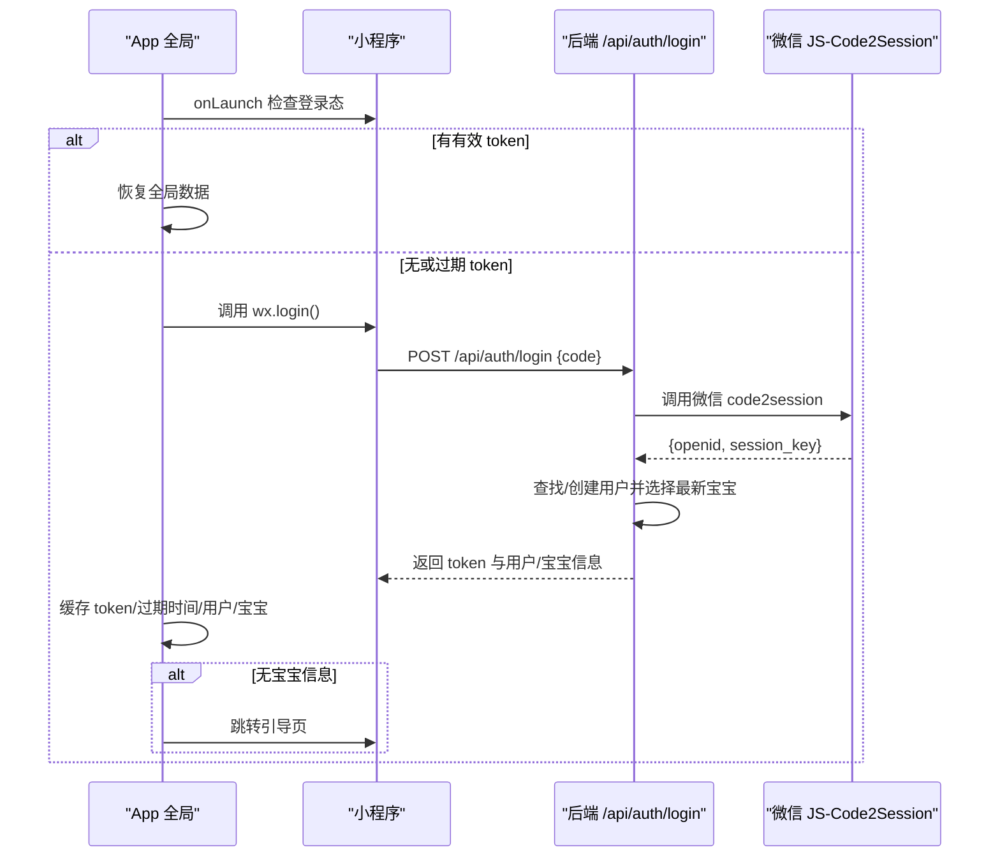
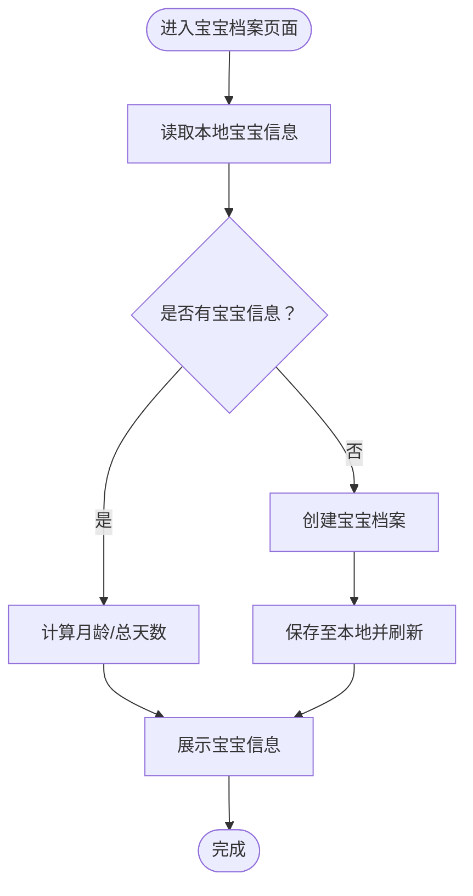
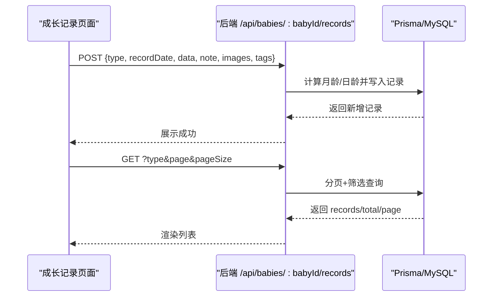
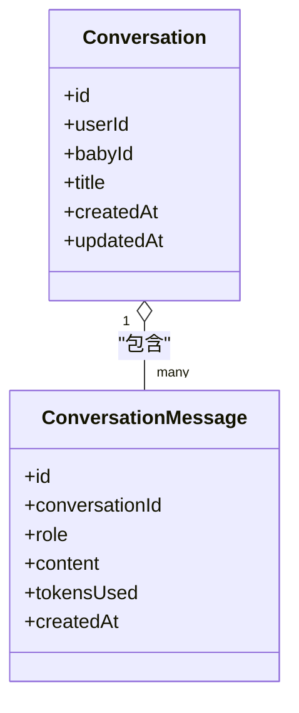
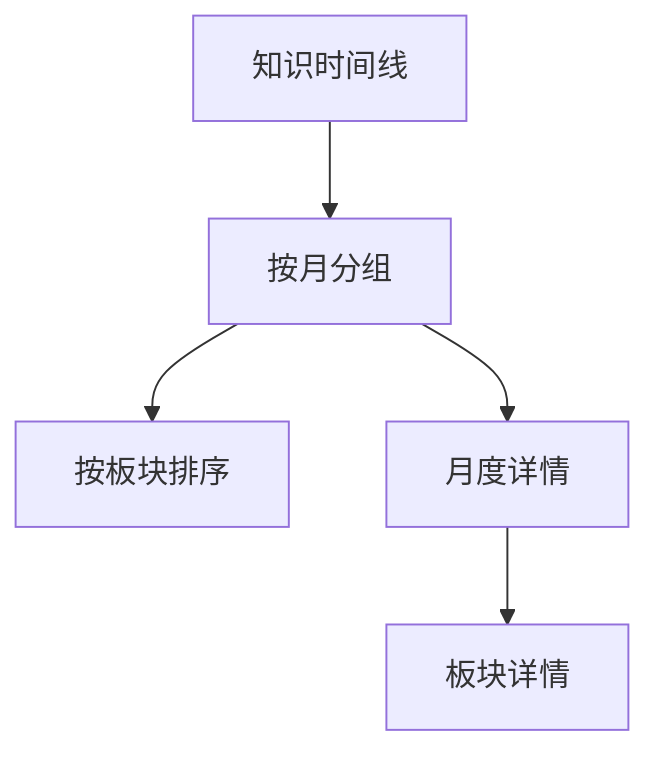
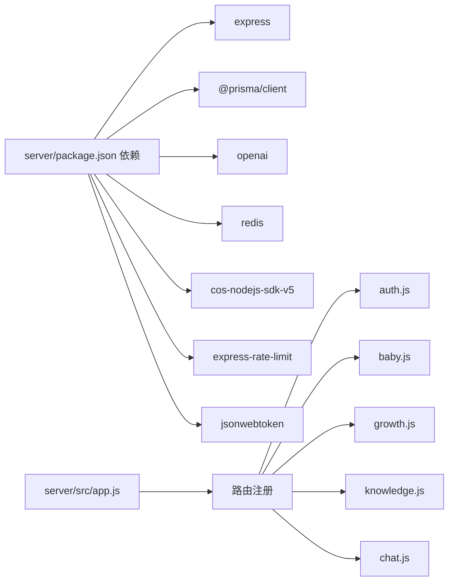

# 核心功能

<cite>
**本文引用的文件**
- [app.js](file://miniprogram/app.js)
- [app.json](file://miniprogram/app.json)
- [request.js](file://miniprogram/utils/request.js)
- [ageCalculator.js](file://miniprogram/utils/ageCalculator.js)
- [index.js](file://miniprogram/pages/home/index.js)
- [app.js](file://server/src/app.js)
- [package.json](file://server/package.json)
- [schema.prisma](file://server/prisma/schema.prisma)
- [auth.js](file://server/src/routes/auth.js)
- [baby.js](file://server/src/routes/baby.js)
- [growth.js](file://server/src/routes/growth.js)
- [knowledge.js](file://server/src/routes/knowledge.js)
- [chat.js](file://server/src/routes/chat.js)
</cite>

## 目录
1. [简介](#简介)
2. [项目结构](#项目结构)
3. [核心组件](#核心组件)
4. [架构总览](#架构总览)
5. [详细组件分析](#详细组件分析)
6. [依赖分析](#依赖分析)
7. [性能考虑](#性能考虑)
8. [故障排查指南](#故障排查指南)
9. [结论](#结论)
10. [附录](#附录)

## 简介
本项目是一个面向新手父母的“AI育儿助手”微信小程序，采用前后端分离架构：前端为小程序客户端，后端为基于 Express 的 API 服务，数据库使用 Prisma + MySQL。系统围绕“用户认证、宝宝档案、成长记录、AI聊天助手、知识百科、个人中心”六大核心模块构建，提供从日常记录到智能问答、从知识科普到个人管理的一体化育儿辅助体验。

## 项目结构
- 小程序端（miniprogram）
  - 应用入口与全局状态：app.js、app.json
  - 工具类：网络请求封装 request.js、年龄计算 ageCalculator.js
  - 页面：首页 home、宝宝档案 baby、成长记录 baby/growth-record、添加记录 baby/add-record、月度报告 baby/monthly-report、AI聊天 chat、知识百科 knowledge、个人中心 mine、引导页 onboarding
- 服务端（server）
  - 入口：src/app.js
  - 路由：auth.js、baby.js、growth.js、knowledge.js、chat.js、upload.js、home.js
  - 数据模型：prisma/schema.prisma
  - 依赖：package.json

图表来源
- [app.js:1-69](file://miniprogram/app.js#L1-L69)
- [app.json:1-60](file://miniprogram/app.json#L1-L60)
- [app.js:1-65](file://server/src/app.js#L1-L65)
- [schema.prisma:1-189](file://server/prisma/schema.prisma#L1-L189)

章节来源
- [app.js:1-69](file://miniprogram/app.js#L1-L69)
- [app.json:1-60](file://miniprogram/app.json#L1-L60)
- [app.js:1-65](file://server/src/app.js#L1-L65)
- [schema.prisma:1-189](file://server/prisma/schema.prisma#L1-L189)

## 核心组件
- 用户认证系统：基于微信 code2session 获取会话，结合 JWT 实现登录态持久化与自动续期；支持引导页创建宝宝档案。
- 宝宝档案管理：创建/查询/更新宝宝信息，自动计算月龄与总天数。
- 成长记录系统：支持多种记录类型（身高体重、喂养、睡眠、里程碑、照片、健康、备注），提供分页查询、详情、更新与删除。
- AI聊天助手：提供对话历史管理与占位的AI对话接口（Sprint 4 实现）。
- 知识百科系统：按月龄与板块组织育儿知识，支持时间线浏览与详情查看。
- 个人中心：包含设置、收藏、首页聚合数据展示等。

章节来源
- [auth.js:1-84](file://server/src/routes/auth.js#L1-L84)
- [baby.js:1-100](file://server/src/routes/baby.js#L1-L100)
- [growth.js:1-118](file://server/src/routes/growth.js#L1-L118)
- [knowledge.js:1-59](file://server/src/routes/knowledge.js#L1-L59)
- [chat.js:1-57](file://server/src/routes/chat.js#L1-L57)
- [index.js:1-114](file://miniprogram/pages/home/index.js#L1-L114)

## 架构总览
系统采用“小程序前端 + Express 后端 + Prisma ORM + MySQL”的技术栈。前端通过统一请求封装自动注入 Authorization 头，后端通过鉴权中间件保护受保护路由，并在 401 时触发前端自动重登录。

图表来源
- [request.js:1-97](file://miniprogram/utils/request.js#L1-L97)
- [app.js:1-65](file://server/src/app.js#L1-L65)
- [auth.js:1-84](file://server/src/routes/auth.js#L1-L84)
- [baby.js:1-100](file://server/src/routes/baby.js#L1-L100)
- [growth.js:1-118](file://server/src/routes/growth.js#L1-L118)
- [knowledge.js:1-59](file://server/src/routes/knowledge.js#L1-L59)
- [chat.js:1-57](file://server/src/routes/chat.js#L1-L57)

## 详细组件分析

### 用户认证系统
- 业务逻辑
  - 小程序启动时检查本地 token 是否存在且未过期，否则调用登录流程。
  - 登录流程：调用后端 /api/auth/login，传入微信 code；后端通过微信接口换取 openid 并生成 JWT；返回 token、用户信息与最新宝宝信息。
  - 登录成功后，前端缓存 token、过期时间、用户与宝宝信息；若无宝宝信息则跳转引导页。
- 关键实现
  - 前端：全局登录态检查、登录流程、本地存储与全局数据同步。
  - 后端：微信 code2session、用户查找/创建、JWT 签发、返回用户与宝宝信息。
- 错误处理
  - 缺少 code、微信登录失败、401 时前端自动清理缓存并重新登录。

图表来源
- [app.js:10-67](file://miniprogram/app.js#L10-L67)
- [auth.js:10-81](file://server/src/routes/auth.js#L10-L81)

章节来源
- [app.js:10-67](file://miniprogram/app.js#L10-L67)
- [auth.js:10-81](file://server/src/routes/auth.js#L10-L81)

### 宝宝档案管理
- 业务逻辑
  - 创建：校验昵称、性别、出生日期，可选喂养方式与血型。
  - 查询：按宝宝 ID 获取信息，自动计算月龄与总天数。
  - 更新：支持昵称、性别、生日、喂养方式、血型、头像等字段。
- 关键实现
  - 前端：首页展示宝宝信息与年龄计算；页面间传递宝宝 ID。
  - 后端：Prisma 模型与路由实现，计算月龄与总天数。
- 数据模型
  - 用户与宝宝一对多关系；字段覆盖基础信息与喂养类型枚举。

图表来源
- [baby.js:9-97](file://server/src/routes/baby.js#L9-L97)
- [index.js:24-82](file://miniprogram/pages/home/index.js#L24-L82)

章节来源
- [baby.js:1-100](file://server/src/routes/baby.js#L1-L100)
- [index.js:1-114](file://miniprogram/pages/home/index.js#L1-L114)

### 成长记录系统
- 业务逻辑
  - 新增：校验类型、日期与数据，自动根据宝宝生日计算月龄与日龄，支持备注、图片、标签。
  - 查询：支持按类型筛选、分页查询，返回总数与分页信息。
  - 详情/更新/删除：按记录 ID 操作。
- 关键实现
  - 后端：Prisma 查询与并发统计；路由参数与查询参数解析。
  - 前端：首页聚合数据包含最新记录，支持下拉刷新与本地降级。
- 数据模型
  - 成长记录与宝宝关联，类型为枚举，支持 JSON 字段存储灵活数据。

图表来源
- [growth.js:6-115](file://server/src/routes/growth.js#L6-L115)
- [index.js:46-71](file://miniprogram/pages/home/index.js#L46-L71)

章节来源
- [growth.js:1-118](file://server/src/routes/growth.js#L1-L118)
- [index.js:1-114](file://miniprogram/pages/home/index.js#L1-L114)

### AI聊天助手
- 业务逻辑
  - 对话列表与详情：按用户维度查询最近对话，支持按 ID 获取详情与删除。
  - AI 对话：预留占位接口，后续 Sprint 4 实现流式响应。
- 关键实现
  - 后端：会话与消息模型，按用户过滤；消息按创建时间排序。
  - 前端：对话历史页面与跳转入口。
- 数据模型
  - 会话与消息多对一关系，消息角色枚举区分用户/助手/系统。

图表来源
- [schema.prisma:107-142](file://server/prisma/schema.prisma#L107-L142)
- [chat.js:14-54](file://server/src/routes/chat.js#L14-L54)

章节来源
- [chat.js:1-57](file://server/src/routes/chat.js#L1-L57)
- [schema.prisma:107-142](file://server/prisma/schema.prisma#L107-L142)

### 知识百科系统
- 业务逻辑
  - 时间线：按月龄聚合知识条目，展示各月标题与板块。
  - 月度详情：按月与板块返回知识内容。
  - 详情页：按唯一索引查询具体知识点。
- 关键实现
  - 后端：按月龄与板块排序，前端按需导航。
  - 数据模型：知识条目包含嵌入 ID、来源、摘要等字段。
- 使用场景
  - 月龄知识导航、专题学习、收藏与回顾。

图表来源
- [knowledge.js:5-56](file://server/src/routes/knowledge.js#L5-L56)
- [schema.prisma:144-168](file://server/prisma/schema.prisma#L144-L168)

章节来源
- [knowledge.js:1-59](file://server/src/routes/knowledge.js#L1-L59)
- [schema.prisma:144-168](file://server/prisma/schema.prisma#L144-L168)

### 个人中心与首页聚合
- 业务逻辑
  - 首页聚合：展示宝宝信息、最新成长记录、当月育儿要点与个性化推荐。
  - 个人中心：设置、收藏、退出登录等入口。
- 关键实现
  - 前端：首页页面加载聚合数据，支持下拉刷新与本地降级；菜单跳转到各功能页。
  - 数据模型：首页数据来源于后端聚合接口（当前路由占位）。

章节来源
- [index.js:1-114](file://miniprogram/pages/home/index.js#L1-L114)
- [app.json:24-55](file://miniprogram/app.json#L24-L55)

## 依赖分析
- 前端依赖
  - 网络请求封装：统一注入 Authorization、错误处理、Token 过期自动重登录。
  - 工具函数：年龄计算、日期格式化、友好日期展示。
- 后端依赖
  - Express + CORS + 限流中间件；Prisma 客户端；MySQL；OpenAI SDK（用于 AI 能力）；Redis（用于缓存）；COS SDK（用于对象存储）。
- 数据模型耦合
  - 用户与宝宝、宝宝与成长记录、会话与消息、知识条目等存在明确外键关系，保证数据一致性。

图表来源
- [package.json:14-29](file://server/package.json#L14-L29)
- [app.js:33-47](file://server/src/app.js#L33-L47)

章节来源
- [package.json:1-31](file://server/package.json#L1-L31)
- [app.js:1-65](file://server/src/app.js#L1-L65)

## 性能考虑
- 请求限流：全局每 IP 每分钟最多 60 次请求，避免突发流量冲击。
- 并发查询：成长记录列表同时进行数据查询与总数统计，减少往返次数。
- 本地缓存：前端优先使用本地存储的用户与宝宝信息，降低首次加载等待。
- 分页策略：成长记录默认每页 20 条，支持类型筛选，提升大数据量下的交互性能。
- 数据模型优化：为常用查询字段建立索引（如宝宝 ID+日期、用户 ID+宝宝 ID 等）。

章节来源
- [app.js:19-25](file://server/src/app.js#L19-L25)
- [growth.js:55-63](file://server/src/routes/growth.js#L55-L63)
- [app.js:18-30](file://miniprogram/app.js#L18-L30)

## 故障排查指南
- 登录失败
  - 现象：弹出“登录失败”或无法获取用户信息。
  - 排查：确认微信 code 是否正确传递；检查后端微信接口返回；核对环境变量（APPID/SECRET/JWT_SECRET）。
- Token 过期
  - 现象：接口返回 401，前端自动清理缓存并重新登录。
  - 排查：确认 token 过期时间与本地存储；检查网络请求头 Authorization 是否正确注入。
- 宝宝信息缺失
  - 现象：登录后无宝宝信息，跳转引导页。
  - 排查：确认用户是否已完成创建宝宝档案；后端是否正确返回最新宝宝。
- 成长记录异常
  - 现象：新增失败或查询为空。
  - 排查：确认必填字段（类型、日期、数据）；检查宝宝 ID 与用户权限；查看分页参数。
- 知识内容不存在
  - 现象：月度或板块详情返回 404。
  - 排查：确认月龄与板块参数；检查数据库是否存在对应记录。

章节来源
- [request.js:48-62](file://miniprogram/utils/request.js#L48-L62)
- [auth.js:13-30](file://server/src/routes/auth.js#L13-L30)
- [growth.js:12-14](file://server/src/routes/growth.js#L12-L14)
- [knowledge.js:49-51](file://server/src/routes/knowledge.js#L49-L51)

## 结论
本项目以清晰的模块划分与稳定的前后端交互协议，构建了覆盖育儿全流程的核心能力：从身份认证与宝宝档案，到成长记录与知识百科，再到智能聊天与个人中心。通过统一的请求封装、鉴权中间件与数据模型设计，系统具备良好的扩展性与可维护性。建议后续完善 AI 对话的流式响应与知识检索增强，持续优化用户体验。

## 附录
- 技术栈
  - 前端：微信小程序原生框架
  - 后端：Node.js + Express + Prisma + MySQL
  - 依赖：OpenAI SDK、Redis、COS SDK、JWT、CORS、限流中间件
- 数据模型概览（核心实体）
  - 用户、宝宝、成长记录、会话、消息、知识条目、收藏

章节来源
- [schema.prisma:14-189](file://server/prisma/schema.prisma#L14-L189)