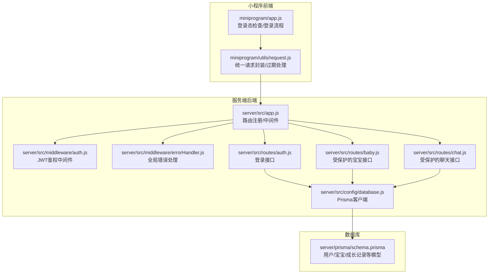
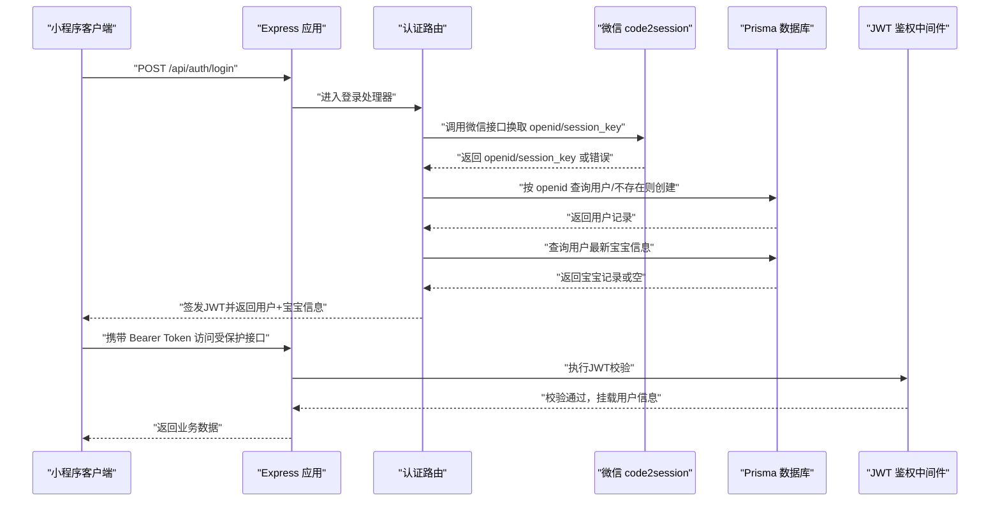
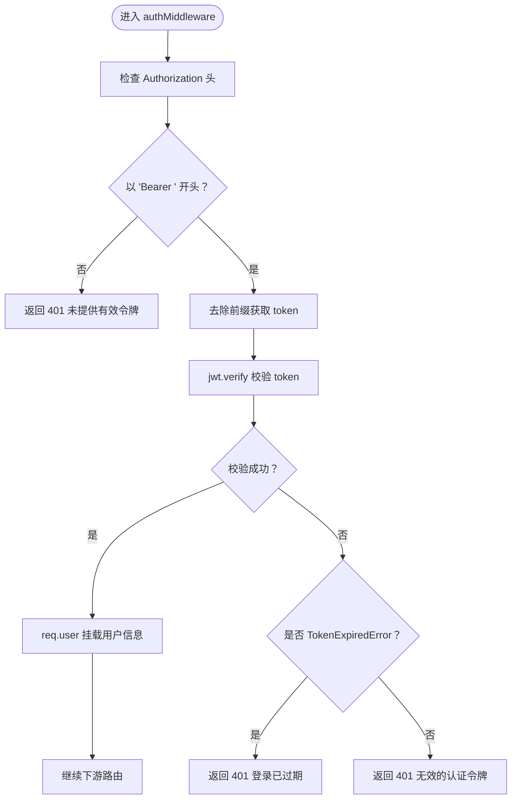
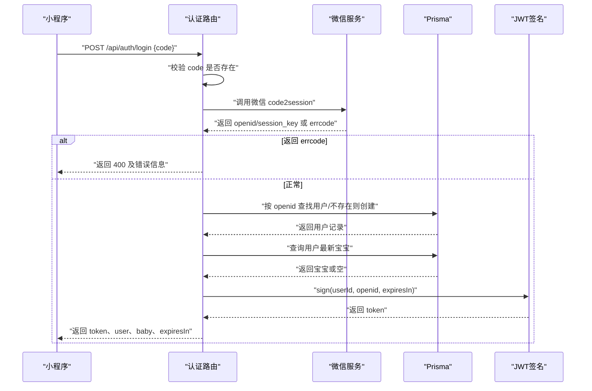
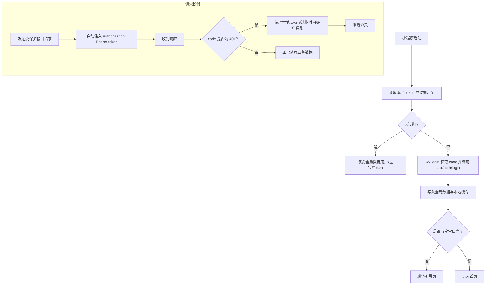
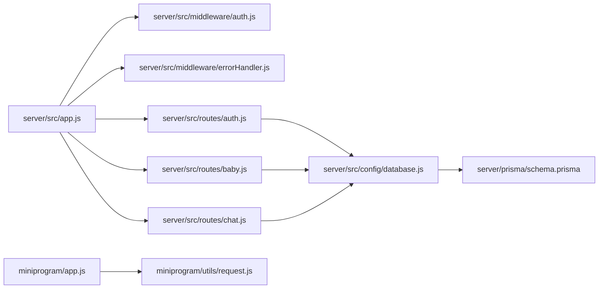

# 用户认证系统

<cite>
**本文引用的文件**
- [server/src/app.js](file://server/src/app.js)
- [server/src/middleware/auth.js](file://server/src/middleware/auth.js)
- [server/src/middleware/errorHandler.js](file://server/src/middleware/errorHandler.js)
- [server/src/routes/auth.js](file://server/src/routes/auth.js)
- [server/src/routes/baby.js](file://server/src/routes/baby.js)
- [server/src/routes/chat.js](file://server/src/routes/chat.js)
- [server/src/config/database.js](file://server/src/config/database.js)
- [server/prisma/schema.prisma](file://server/prisma/schema.prisma)
- [server/package.json](file://server/package.json)
- [miniprogram/app.js](file://miniprogram/app.js)
- [miniprogram/utils/request.js](file://miniprogram/utils/request.js)
</cite>

## 目录
1. [简介](#简介)
2. [项目结构](#项目结构)
3. [核心组件](#核心组件)
4. [架构总览](#架构总览)
5. [详细组件分析](#详细组件分析)
6. [依赖关系分析](#依赖关系分析)
7. [性能考虑](#性能考虑)
8. [故障排查指南](#故障排查指南)
9. [结论](#结论)
10. [附录](#附录)

## 简介
本文件面向AI育儿助手项目的用户认证系统，围绕微信小程序登录流程（code2session）、用户信息获取与JWT令牌生成、认证中间件的实现原理（token验证、权限检查、错误处理）、API接口规范（登录接口的请求参数、响应格式与错误码说明）、用户状态管理与会话保持策略，以及安全最佳实践与常见问题解决方案进行系统性说明。文档同时提供代码级架构图与流程图，帮助开发者快速理解与维护认证体系。

## 项目结构
认证相关的核心代码分布在以下位置：
- 小程序前端：登录态检查、登录流程、统一请求封装与Token过期处理
- 服务端后端：Express应用入口、认证中间件、全局错误处理、认证路由与业务路由
- 数据层：Prisma模型定义与数据库客户端

图表来源
- [server/src/app.js:1-65](file://server/src/app.js#L1-L65)
- [server/src/middleware/auth.js:1-29](file://server/src/middleware/auth.js#L1-L29)
- [server/src/middleware/errorHandler.js:1-52](file://server/src/middleware/errorHandler.js#L1-L52)
- [server/src/routes/auth.js:1-84](file://server/src/routes/auth.js#L1-L84)
- [server/src/routes/baby.js:1-100](file://server/src/routes/baby.js#L1-L100)
- [server/src/routes/chat.js:1-57](file://server/src/routes/chat.js#L1-L57)
- [server/src/config/database.js:1-17](file://server/src/config/database.js#L1-L17)
- [server/prisma/schema.prisma:1-189](file://server/prisma/schema.prisma#L1-L189)
- [miniprogram/app.js:1-69](file://miniprogram/app.js#L1-L69)
- [miniprogram/utils/request.js:1-97](file://miniprogram/utils/request.js#L1-L97)

章节来源
- [server/src/app.js:1-65](file://server/src/app.js#L1-L65)
- [miniprogram/app.js:1-69](file://miniprogram/app.js#L1-L69)
- [miniprogram/utils/request.js:1-97](file://miniprogram/utils/request.js#L1-L97)

## 核心组件
- 认证中间件（JWT鉴权）
  - 功能：从HTTP请求头中提取并校验JWT令牌，将解码后的用户信息挂载到请求对象上，供后续路由使用；对过期与无效令牌返回相应错误。
  - 关键点：支持401未授权与401令牌过期两类错误，统一通过JSON格式返回。
- 登录接口（小程序code2session + JWT签发）
  - 功能：接收小程序端传入的临时登录凭证code，调用微信code2session接口换取openid与session_key；根据openid查找或创建用户；查询用户最新宝宝信息；签发JWT并返回用户与宝宝信息。
  - 关键点：使用7天有效期；对微信登录失败与缺失参数进行明确错误提示。
- 全局错误处理
  - 功能：统一捕获Prisma已知错误（如唯一约束冲突、记录不存在）与自定义业务错误，标准化响应格式；对未知错误按开发/生产环境返回不同信息。
- 小程序侧登录态与请求封装
  - 功能：启动时检查本地Token与过期时间；登录成功后写入全局数据与本地缓存；请求时自动注入Authorization头；收到401时触发Token过期处理并重新登录。
- 数据模型与客户端
  - 功能：Prisma定义用户、宝宝、成长记录等模型；提供单例客户端与日志配置；优雅退出时断开连接。

章节来源
- [server/src/middleware/auth.js:1-29](file://server/src/middleware/auth.js#L1-L29)
- [server/src/routes/auth.js:1-84](file://server/src/routes/auth.js#L1-L84)
- [server/src/middleware/errorHandler.js:1-52](file://server/src/middleware/errorHandler.js#L1-L52)
- [miniprogram/app.js:1-69](file://miniprogram/app.js#L1-L69)
- [miniprogram/utils/request.js:1-97](file://miniprogram/utils/request.js#L1-L97)
- [server/src/config/database.js:1-17](file://server/src/config/database.js#L1-L17)
- [server/prisma/schema.prisma:13-60](file://server/prisma/schema.prisma#L13-L60)

## 架构总览
下图展示了从小程序发起登录请求到服务端完成code2session、用户创建/查询、JWT签发与返回，以及后续受保护接口访问的整体流程。

图表来源
- [server/src/routes/auth.js:10-81](file://server/src/routes/auth.js#L10-L81)
- [server/src/middleware/auth.js:7-26](file://server/src/middleware/auth.js#L7-L26)
- [server/src/config/database.js:1-17](file://server/src/config/database.js#L1-L17)
- [server/src/app.js:32-47](file://server/src/app.js#L32-L47)

## 详细组件分析

### 认证中间件（JWT鉴权）
- 设计要点
  - 从Authorization头解析Bearer Token，若缺失或格式不正确直接返回401。
  - 使用密钥对Token进行验证，成功则将用户信息（包含userId与openid）挂载到req.user，继续交由下游路由处理；失败则区分过期与无效并返回对应401。
- 错误处理
  - 未提供有效令牌：401。
  - 令牌过期：401。
  - 令牌无效：401。
- 权限检查
  - 中间件本身不进行业务级权限判断，仅保证“已登录且令牌有效”，具体业务权限在各路由内基于req.user.userId进行校验（例如按用户ID过滤数据）。

图表来源
- [server/src/middleware/auth.js:7-26](file://server/src/middleware/auth.js#L7-L26)

章节来源
- [server/src/middleware/auth.js:1-29](file://server/src/middleware/auth.js#L1-L29)

### 登录接口（小程序code2session + JWT签发）
- 接口定义
  - 方法与路径：POST /api/auth/login
  - 请求体字段：code（必填）
  - 响应字段：code（0表示成功，非0为业务错误）、message、data（包含token、expiresIn、user、baby）
- 处理流程
  - 校验code是否存在，不存在返回400。
  - 调用微信code2session接口，若返回errcode则返回400及错误信息。
  - 从返回值中取出openid与session_key；按openid查询用户，不存在则创建默认用户。
  - 查询用户最新宝宝信息（按创建时间倒序取第一条）。
  - 使用JWT签发token，设置7天过期时间，返回token、过期秒数与用户/宝宝信息。
- 错误码
  - 400：缺少code或微信登录失败。
  - 401：登录态异常（由中间件返回）。
  - 404：业务逻辑中可能的资源不存在（如部分路由）。
  - 429：请求过于频繁（全局限流）。
  - 500：服务器内部错误（由全局错误处理返回）。

图表来源
- [server/src/routes/auth.js:10-81](file://server/src/routes/auth.js#L10-L81)

章节来源
- [server/src/routes/auth.js:1-84](file://server/src/routes/auth.js#L1-L84)

### 小程序登录态与会话保持
- 登录态检查
  - 启动时读取本地存储的token与过期时间，若未过期则恢复全局数据；否则触发登录流程。
- 登录流程
  - 调用wx.login获取code，向后端发送POST /api/auth/login，成功后写入全局数据与本地缓存（token、过期时间戳、用户与宝宝信息），若无宝宝信息则跳转引导页。
- 请求封装
  - 统一注入Authorization头；当响应code为401时，清理本地存储并重新登录。
- 会话保持策略
  - 前端基于本地存储的token与过期时间戳进行会话保持；后端基于JWT的固定过期时间（7天）进行服务端校验。

图表来源
- [miniprogram/app.js:18-67](file://miniprogram/app.js#L18-L67)
- [miniprogram/utils/request.js:21-86](file://miniprogram/utils/request.js#L21-L86)

章节来源
- [miniprogram/app.js:1-69](file://miniprogram/app.js#L1-L69)
- [miniprogram/utils/request.js:1-97](file://miniprogram/utils/request.js#L1-L97)

### 受保护接口与权限校验
- 路由注册
  - /api/babies、/api/babies/:babyId/records、/api/chat、/api/upload、/api/home 等路由均在注册时附加JWT中间件，确保只有已登录用户可访问。
- 业务权限示例
  - 在路由内部通过req.user.userId与数据库查询条件结合，确保用户只能访问自己的数据（如按userId过滤）。
- 错误处理
  - 未登录或令牌无效：401。
  - 资源不存在：404。
  - 其他业务错误：抛出自定义AppError，由全局错误处理中间件统一格式化返回。

章节来源
- [server/src/app.js:41-47](file://server/src/app.js#L41-L47)
- [server/src/routes/baby.js:9-32](file://server/src/routes/baby.js#L9-L32)
- [server/src/routes/chat.js:14-42](file://server/src/routes/chat.js#L14-L42)
- [server/src/middleware/errorHandler.js:6-39](file://server/src/middleware/errorHandler.js#L6-L39)

### 数据模型与安全关联
- 用户模型（User）
  - 关键字段：openid（唯一索引）、nickname、avatarUrl、role等；与宝宝、对话、收藏等关联。
- 宝宝模型（Baby）
  - 关键字段：userId（外键）、nickname、gender、birthday、feedingType等；与成长记录、对话关联。
- 安全关联
  - 所有受保护接口在业务层均以userId作为访问控制依据，避免越权访问。
- 数据库客户端
  - Prisma单例客户端，开发环境下开启查询/错误/警告日志，优雅退出时断开连接。

章节来源
- [server/prisma/schema.prisma:13-60](file://server/prisma/schema.prisma#L13-L60)
- [server/src/config/database.js:1-17](file://server/src/config/database.js#L1-L17)

## 依赖关系分析
- 模块耦合
  - app.js集中注册中间件与路由，auth.js依赖database.js与jsonwebtoken；errorHandler.js独立于业务路由，提供统一错误处理。
  - 小程序端app.js与utils/request.js相互协作，前者负责登录态与页面跳转，后者负责网络请求与过期处理。
- 外部依赖
  - 服务端依赖jsonwebtoken进行JWT签发与校验、express-rate-limit进行限流、@prisma/client进行数据库访问。
  - 小程序端依赖微信原生登录能力与网络请求API。

图表来源
- [server/src/app.js:1-65](file://server/src/app.js#L1-L65)
- [server/src/middleware/auth.js:1-29](file://server/src/middleware/auth.js#L1-L29)
- [server/src/middleware/errorHandler.js:1-52](file://server/src/middleware/errorHandler.js#L1-L52)
- [server/src/routes/auth.js:1-84](file://server/src/routes/auth.js#L1-L84)
- [server/src/routes/baby.js:1-100](file://server/src/routes/baby.js#L1-L100)
- [server/src/routes/chat.js:1-57](file://server/src/routes/chat.js#L1-L57)
- [server/src/config/database.js:1-17](file://server/src/config/database.js#L1-L17)
- [server/prisma/schema.prisma:1-189](file://server/prisma/schema.prisma#L1-L189)
- [miniprogram/app.js:1-69](file://miniprogram/app.js#L1-L69)
- [miniprogram/utils/request.js:1-97](file://miniprogram/utils/request.js#L1-L97)

章节来源
- [server/package.json:14-29](file://server/package.json#L14-L29)

## 性能考虑
- 限流策略
  - 全局限流：每IP每分钟最多60次请求，防止暴力尝试与滥用。
- Token有效期
  - 登录成功签发7天有效期的JWT，平衡用户体验与安全性；建议在移动端定期刷新或在敏感操作时要求二次验证。
- 数据库访问
  - 通过Prisma单例客户端减少连接开销；开发环境开启日志便于定位慢查询。
- 网络请求
  - 小程序端统一注入Authorization头，避免重复拼装；对401错误进行自动重定向登录，减少手动处理成本。

章节来源
- [server/src/app.js:19-25](file://server/src/app.js#L19-L25)
- [server/src/routes/auth.js:48-54](file://server/src/routes/auth.js#L48-L54)
- [server/src/config/database.js:7-14](file://server/src/config/database.js#L7-L14)
- [miniprogram/utils/request.js:29-37](file://miniprogram/utils/request.js#L29-L37)

## 故障排查指南
- 常见错误与定位
  - 400 缺少code或微信登录失败：检查小程序端是否正确传递code，确认后端环境变量（WX_APPID/WX_SECRET）是否配置正确。
  - 401 未提供有效令牌/无效令牌/登录已过期：检查Authorization头格式与Token是否过期；小程序端确认本地存储是否被清理。
  - 404 记录不存在：检查业务路由中的userId过滤条件与目标资源是否存在。
  - 429 请求过于频繁：调整限流策略或前端退避重试。
  - 500 服务器内部错误：查看全局错误处理输出的日志，定位具体异常。
- 日志与调试
  - 服务端开发环境开启Prisma日志；全局错误处理打印错误堆栈，便于定位。
  - 小程序端在请求失败与网络错误时弹窗提示，便于用户反馈。

章节来源
- [server/src/routes/auth.js:12-30](file://server/src/routes/auth.js#L12-L30)
- [server/src/middleware/auth.js:10-25](file://server/src/middleware/auth.js#L10-L25)
- [server/src/middleware/errorHandler.js:6-39](file://server/src/middleware/errorHandler.js#L6-L39)
- [miniprogram/utils/request.js:58-70](file://miniprogram/utils/request.js#L58-L70)

## 结论
本认证系统采用标准的微信小程序登录流程与JWT令牌机制，结合全局中间件与统一错误处理，实现了从登录到受保护接口访问的完整闭环。通过本地存储与服务端限流相结合的方式，既保障了用户体验也兼顾了安全性。建议在生产环境中进一步完善Token刷新策略、引入更细粒度的权限控制与审计日志，并持续监控与优化数据库查询性能。

## 附录

### API接口文档：登录接口
- 接口名称
  - 小程序登录
- 请求方式
  - POST
- 请求地址
  - /api/auth/login
- 请求头
  - Content-Type: application/json
- 请求参数
  - code: string（必填，微信临时登录凭证）
- 响应参数
  - code: number（0表示成功，非0为业务错误）
  - message: string
  - data.token: string（JWT）
  - data.expiresIn: number（过期秒数，7天）
  - data.user.id: number
  - data.user.nickname: string
  - data.user.avatarUrl: string
  - data.user.role: string
  - data.baby: object|null（包含id、nickname、gender、birthday、feedingType、avatarUrl）
- 错误码
  - 400：缺少code或微信登录失败
  - 401：未提供有效令牌/无效令牌/登录已过期（由中间件返回）
  - 404：记录不存在（由全局错误处理返回）
  - 429：请求过于频繁（由限流中间件返回）
  - 500：服务器内部错误（由全局错误处理返回）

章节来源
- [server/src/routes/auth.js:10-81](file://server/src/routes/auth.js#L10-L81)
- [server/src/middleware/auth.js:10-25](file://server/src/middleware/auth.js#L10-L25)
- [server/src/middleware/errorHandler.js:10-38](file://server/src/middleware/errorHandler.js#L10-L38)