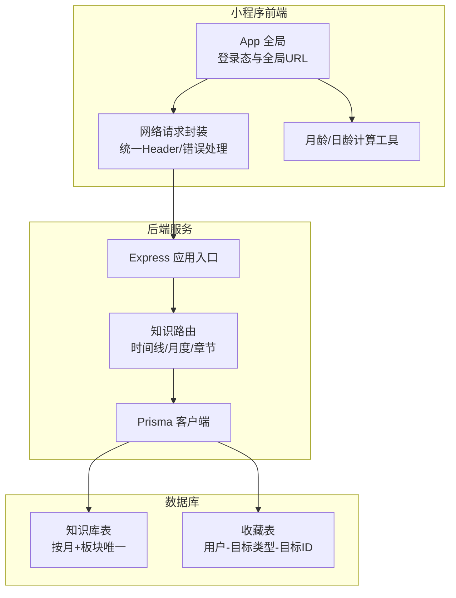
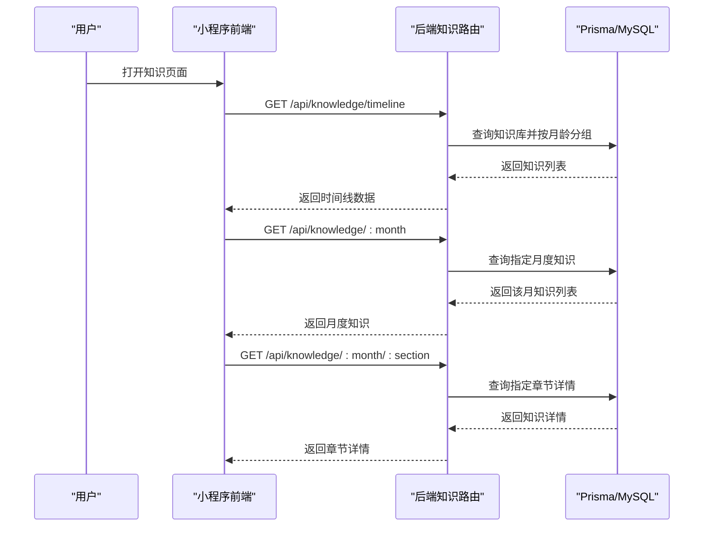
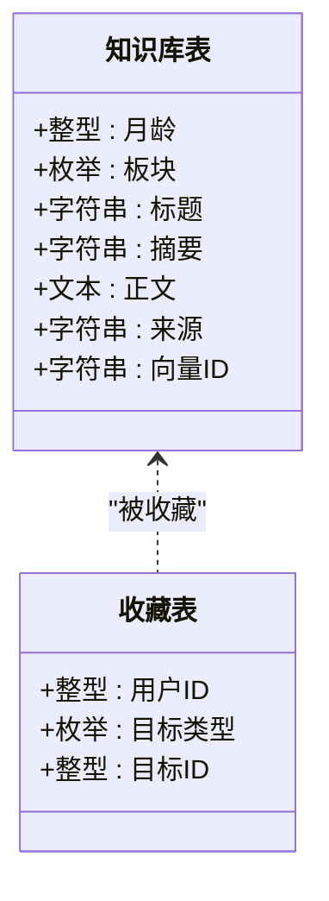
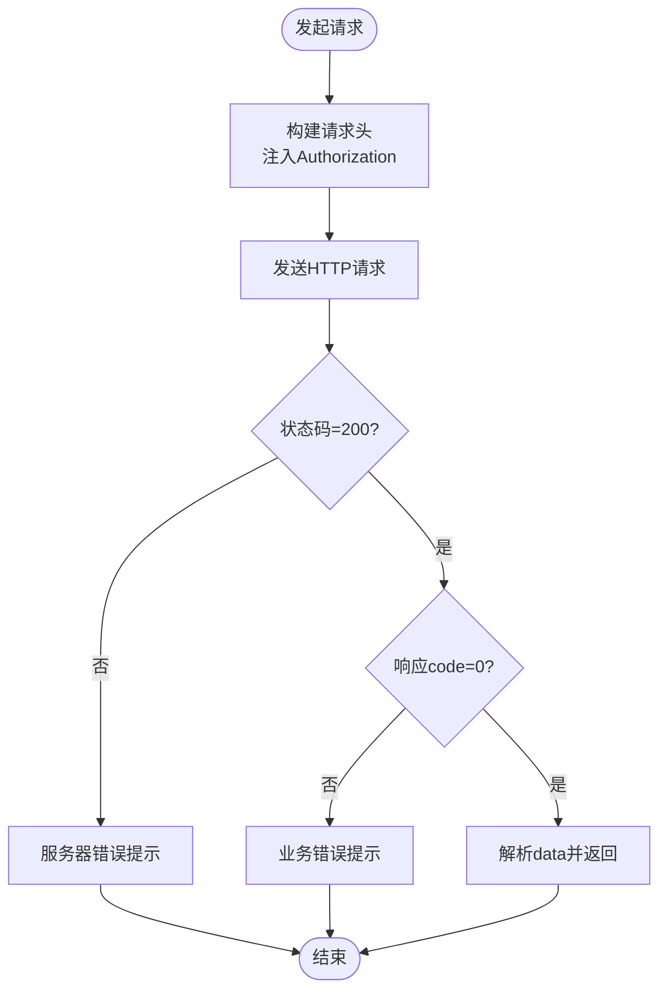
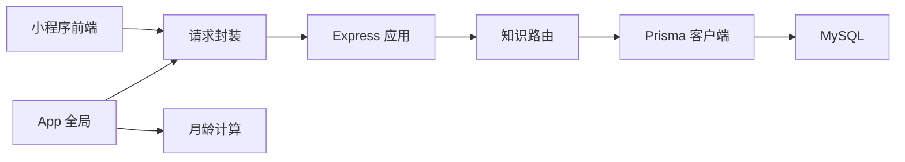

# 知识百科系统

<cite>
**本文引用的文件**
- [server/src/app.js](file://server/src/app.js)
- [server/src/routes/knowledge.js](file://server/src/routes/knowledge.js)
- [server/prisma/schema.prisma](file://server/prisma/schema.prisma)
- [miniprogram/utils/request.js](file://miniprogram/utils/request.js)
- [miniprogram/utils/ageCalculator.js](file://miniprogram/utils/ageCalculator.js)
- [miniprogram/app.js](file://miniprogram/app.js)
</cite>

## 目录
1. [简介](#简介)
2. [项目结构](#项目结构)
3. [核心组件](#核心组件)
4. [架构总览](#架构总览)
5. [详细组件分析](#详细组件分析)
6. [依赖关系分析](#依赖关系分析)
7. [性能考虑](#性能考虑)
8. [故障排查指南](#故障排查指南)
9. [结论](#结论)
10. [附录](#附录)

## 简介
本文件面向“AI育儿助手”项目中的“知识百科系统”，围绕按月龄分类的知识库设计与内容管理展开，涵盖以下方面：
- 知识内容的组织结构与数据库模型
- 搜索检索与个性化推荐的实现思路
- API 接口定义与调用流程
- 前端页面展示逻辑（时间线视图、月龄详情、收藏）
- 内容编辑与管理后台的设计思路（审核、版本管理、质量控制）

## 项目结构
知识百科系统由三部分组成：
- 后端服务（Express + Prisma）：提供知识库的增删改查、分页与聚合接口，并通过数据库模型对知识内容进行结构化存储。
- 前端小程序：负责用户交互、网络请求封装、月龄计算与页面导航。
- 数据层（MySQL + Prisma）：以知识库表为核心，配合收藏表支撑个性化能力。

图表来源
- [server/src/app.js:1-65](file://server/src/app.js#L1-L65)
- [server/src/routes/knowledge.js:1-59](file://server/src/routes/knowledge.js#L1-L59)
- [server/prisma/schema.prisma:144-189](file://server/prisma/schema.prisma#L144-L189)
- [miniprogram/utils/request.js:1-97](file://miniprogram/utils/request.js#L1-L97)
- [miniprogram/utils/ageCalculator.js:1-86](file://miniprogram/utils/ageCalculator.js#L1-L86)
- [miniprogram/app.js:1-69](file://miniprogram/app.js#L1-L69)

章节来源
- [server/src/app.js:1-65](file://server/src/app.js#L1-L65)
- [server/prisma/schema.prisma:144-189](file://server/prisma/schema.prisma#L144-L189)
- [miniprogram/utils/request.js:1-97](file://miniprogram/utils/request.js#L1-L97)
- [miniprogram/utils/ageCalculator.js:1-86](file://miniprogram/utils/ageCalculator.js#L1-L86)
- [miniprogram/app.js:1-69](file://miniprogram/app.js#L1-L69)

## 核心组件
- 知识库数据模型：以“月龄 + 板块”作为复合唯一键，确保每条知识在特定月龄下仅有一份权威内容；支持标题、摘要、正文、来源与向量ID等字段。
- 知识路由：提供时间线概览、指定月度列表、指定章节详情的接口；返回统一结构，便于前端聚合展示。
- 网络请求封装：统一下游接口地址、自动注入鉴权头、集中错误提示与Token过期处理。
- 月龄计算工具：支持出生日期到参考日期的月龄/日龄计算与友好文案输出。
- 收藏模型：为用户收藏知识、对话、文章等目标提供统一的收藏表结构。

章节来源
- [server/prisma/schema.prisma:144-189](file://server/prisma/schema.prisma#L144-L189)
- [server/src/routes/knowledge.js:1-59](file://server/src/routes/knowledge.js#L1-L59)
- [miniprogram/utils/request.js:1-97](file://miniprogram/utils/request.js#L1-L97)
- [miniprogram/utils/ageCalculator.js:1-86](file://miniprogram/utils/ageCalculator.js#L1-L86)

## 架构总览
后端采用 Express 提供 REST 接口，Prisma 作为 ORM 访问 MySQL；前端通过统一请求封装访问后端 API，并在 App 层维护登录态与基础 URL。

图表来源
- [server/src/routes/knowledge.js:5-56](file://server/src/routes/knowledge.js#L5-L56)
- [server/prisma/schema.prisma:144-168](file://server/prisma/schema.prisma#L144-L168)

## 详细组件分析

### 后端：知识路由与数据模型
- 时间线接口：按月龄升序返回知识概览，前端可直接渲染时间轴。
- 月度接口：按板块排序返回某月全部知识，便于分板块浏览。
- 章节详情接口：根据“月龄+板块”唯一键查询，若不存在返回404。
- 数据模型：知识库表包含月龄、板块枚举、标题、摘要、正文、来源、向量ID等字段；收藏表支持多类型目标的统一收藏。

图表来源
- [server/prisma/schema.prisma:144-189](file://server/prisma/schema.prisma#L144-L189)

章节来源
- [server/src/routes/knowledge.js:5-56](file://server/src/routes/knowledge.js#L5-L56)
- [server/prisma/schema.prisma:144-189](file://server/prisma/schema.prisma#L144-L189)

### 前端：网络请求与月龄计算
- 网络请求封装：统一设置基础URL、自动注入Authorization头、集中处理业务错误与服务器错误、Token过期时触发重新登录。
- 月龄计算工具：支持出生日期到参考日期的月龄/日龄计算，输出“X个月”“X天”“X个月X天”的友好文案。
- App 登录态：在应用启动时检查本地Token有效性，必要时触发微信登录并缓存用户信息与Token。

图表来源
- [miniprogram/utils/request.js:21-73](file://miniprogram/utils/request.js#L21-L73)

章节来源
- [miniprogram/utils/request.js:1-97](file://miniprogram/utils/request.js#L1-L97)
- [miniprogram/utils/ageCalculator.js:1-86](file://miniprogram/utils/ageCalculator.js#L1-L86)
- [miniprogram/app.js:18-67](file://miniprogram/app.js#L18-L67)

### API 接口定义与调用流程
- 获取时间线概览
  - 方法与路径：GET /api/knowledge/timeline
  - 功能：按月龄升序返回知识概览，按月龄分组，每组包含板块与标题。
  - 响应结构：包含 code、message、data（数组，元素含 month、sections）。
- 获取某月全部知识
  - 方法与路径：GET /api/knowledge/:month
  - 参数：month（整数）
  - 功能：返回该月所有知识，按板块升序排列。
- 获取某月某板块详情
  - 方法与路径：GET /api/knowledge/:month/:section
  - 参数：month（整数）、section（枚举值）
  - 功能：返回该月该板块的唯一知识详情；不存在时返回404。
- 统一响应约定
  - code=0 表示成功；非0表示业务错误；401 表示登录过期。
  - 前端根据 code 做不同处理：成功透传 data，401 触发重新登录，其他错误弹出提示。

章节来源
- [server/src/routes/knowledge.js:5-56](file://server/src/routes/knowledge.js#L5-L56)

### 前端页面展示逻辑
- 时间线视图：调用时间线接口，按月龄分组渲染；点击月份进入月度详情页。
- 月龄详情：调用月度接口，按板块分栏展示；点击板块进入章节详情页。
- 内容详情：调用章节详情接口，渲染标题、摘要与正文。
- 收藏功能：结合收藏表结构，前端可在详情页添加/取消收藏；收藏列表页可按类型过滤查看。

章节来源
- [server/src/routes/knowledge.js:28-56](file://server/src/routes/knowledge.js#L28-L56)
- [server/prisma/schema.prisma:170-189](file://server/prisma/schema.prisma#L170-L189)

### 搜索检索与个性化推荐算法（设计思路）
- 搜索检索
  - 结合向量ID字段，可使用向量相似度检索实现语义搜索；对关键词与标签进行组合过滤，提升召回质量。
- 个性化推荐
  - 基于用户画像（如宝宝性别、出生日期）与历史行为（浏览、收藏、对话），对知识内容进行加权排序。
  - 可引入协同过滤或内容相似度矩阵，按月龄阶段与板块偏好进行冷启动与热启动优化。
- 版本管理与质量控制
  - 引入草稿/发布流程与审核机制；每次更新保留历史版本，支持回滚与对比。
  - 建立评分与反馈闭环，结合人工审核与自动化规则（如敏感词、重复内容）保障内容质量。

（本节为概念性设计，不直接对应具体代码文件）

### 内容编辑与管理后台（设计思路）
- 内容审核：支持多级审核流程（编辑初审→专家复审→发布），记录审核意见与操作人。
- 版本管理：同一目标（月龄+板块）支持多版本并存，管理员可预览、比较与选择发布版本。
- 质量控制：建立内容质量指标（如字数、标签覆盖率、重复率），结合人工抽检与自动化校验。
- 批量操作：支持按月龄批量导入、导出与同步，降低运营成本。

（本节为概念性设计，不直接对应具体代码文件）

## 依赖关系分析
- 后端依赖
  - Express 提供路由与中间件；Prisma 访问 MySQL；全局限流与错误处理中间件增强稳定性。
- 前端依赖
  - 网络请求封装依赖 App 的全局配置与登录态；月龄计算工具用于友好文案展示。
- 数据依赖
  - 知识库表与收藏表通过唯一约束保证数据一致性；板块枚举统一了内容分类标准。

图表来源
- [server/src/app.js:32-47](file://server/src/app.js#L32-L47)
- [server/src/routes/knowledge.js:1-59](file://server/src/routes/knowledge.js#L1-L59)
- [miniprogram/utils/request.js:11](file://miniprogram/utils/request.js#L11)
- [miniprogram/app.js:3](file://miniprogram/app.js#L3)

章节来源
- [server/src/app.js:1-65](file://server/src/app.js#L1-L65)
- [miniprogram/utils/request.js:1-97](file://miniprogram/utils/request.js#L1-L97)
- [miniprogram/app.js:1-69](file://miniprogram/app.js#L1-L69)

## 性能考虑
- 接口限流：后端对 /api/ 路径启用全局限流，避免突发流量冲击。
- 分页与排序：按月龄/板块排序的查询具备良好索引利用；建议在大数据量场景下增加分页参数。
- 缓存策略：对时间线与热门月度数据可引入缓存层，减少数据库压力。
- 网络优化：请求封装统一处理 Loading 与错误提示，避免重复请求与无谓重试。

章节来源
- [server/src/app.js:19-25](file://server/src/app.js#L19-L25)
- [server/src/routes/knowledge.js:8-11](file://server/src/routes/knowledge.js#L8-L11)

## 故障排查指南
- 登录过期
  - 现象：收到 code=401 的业务错误。
  - 处理：前端移除本地 Token 与用户信息并触发重新登录流程。
- 服务器错误
  - 现象：HTTP 状态码非 200。
  - 处理：弹出“服务器错误”提示，检查后端健康检查与网络连通性。
- 业务错误
  - 现象：响应 code 非 0。
  - 处理：根据 message 提示进行修复或重试；若为“知识内容不存在”，检查月龄与板块参数。
- 网络异常
  - 现象：fail 回调触发。
  - 处理：提示“网络连接失败”，检查设备网络与代理设置。

章节来源
- [miniprogram/utils/request.js:48-70](file://miniprogram/utils/request.js#L48-L70)
- [server/src/routes/knowledge.js:49-50](file://server/src/routes/knowledge.js#L49-L50)

## 结论
知识百科系统以“月龄+板块”为核心组织方式，结合简洁的 API 设计与统一的前端请求封装，实现了从时间线到章节详情的完整浏览链路。后续可在搜索检索、个性化推荐、内容审核与版本管理等方面进一步完善，以满足高质量育儿知识的生产与消费需求。

## 附录
- 数据模型要点
  - 知识库表：唯一键（月龄，板块）；字段覆盖标题、摘要、正文、来源与向量ID。
  - 收藏表：唯一键（用户ID，目标类型，目标ID），支持多类型目标收藏。
- 前端开发要点
  - 使用统一请求封装，确保鉴权与错误处理一致。
  - 利用月龄计算工具生成友好文案，提升用户体验。
  - 在 App 层维护登录态，避免重复登录带来的交互损耗。

章节来源
- [server/prisma/schema.prisma:144-189](file://server/prisma/schema.prisma#L144-L189)
- [miniprogram/utils/ageCalculator.js:25-40](file://miniprogram/utils/ageCalculator.js#L25-L40)
- [miniprogram/app.js:18-30](file://miniprogram/app.js#L18-L30)