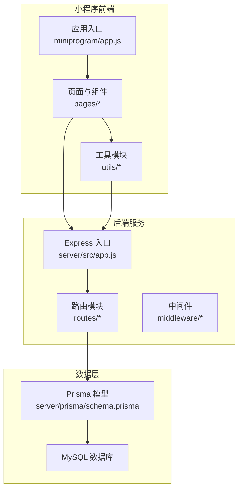
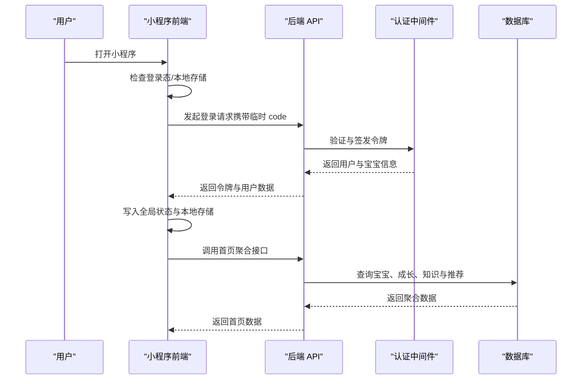
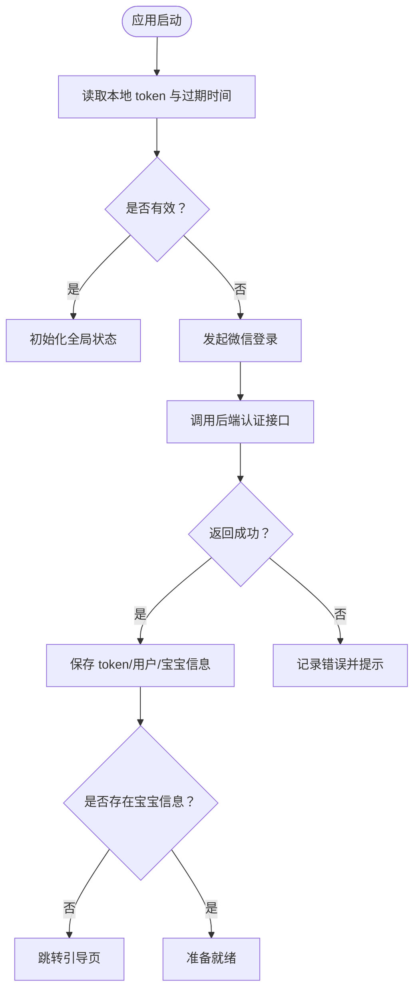
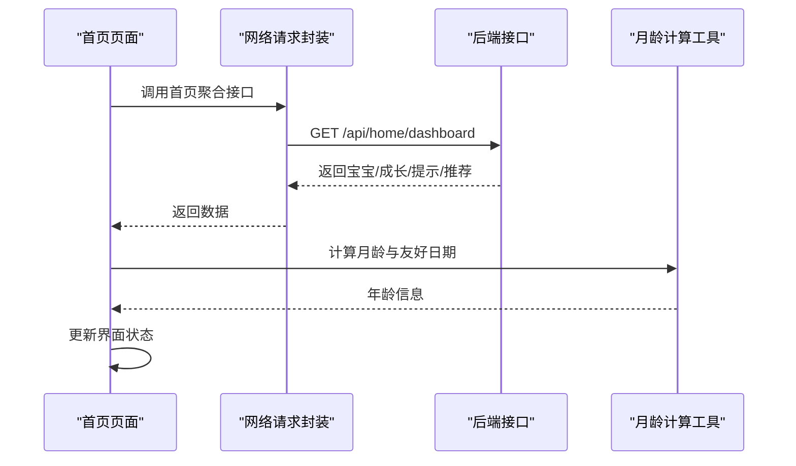
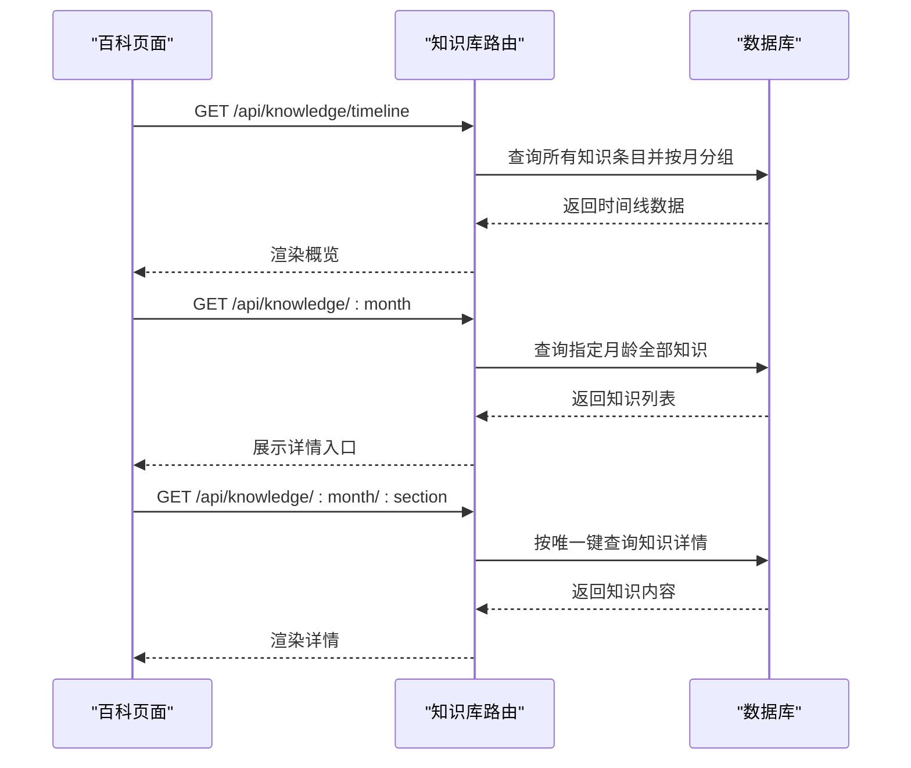
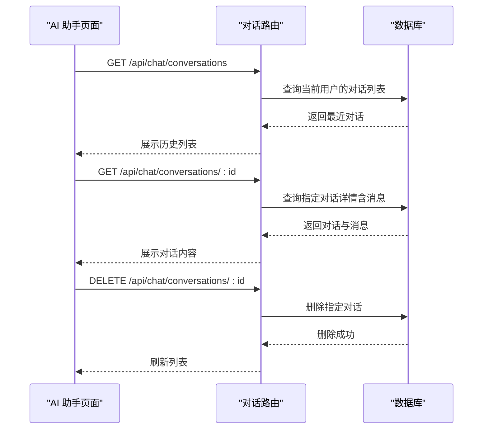
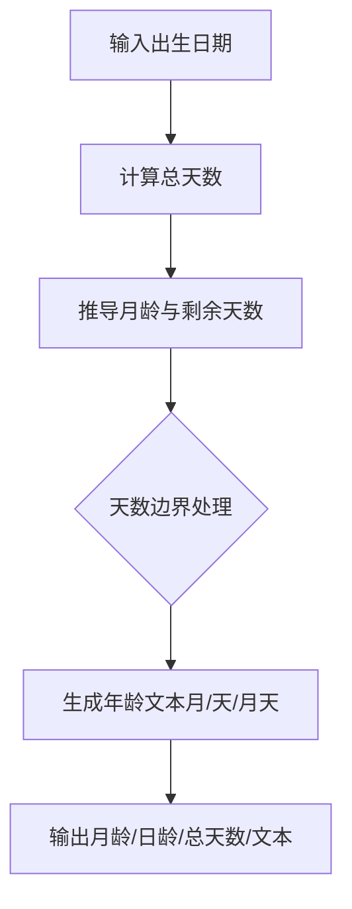
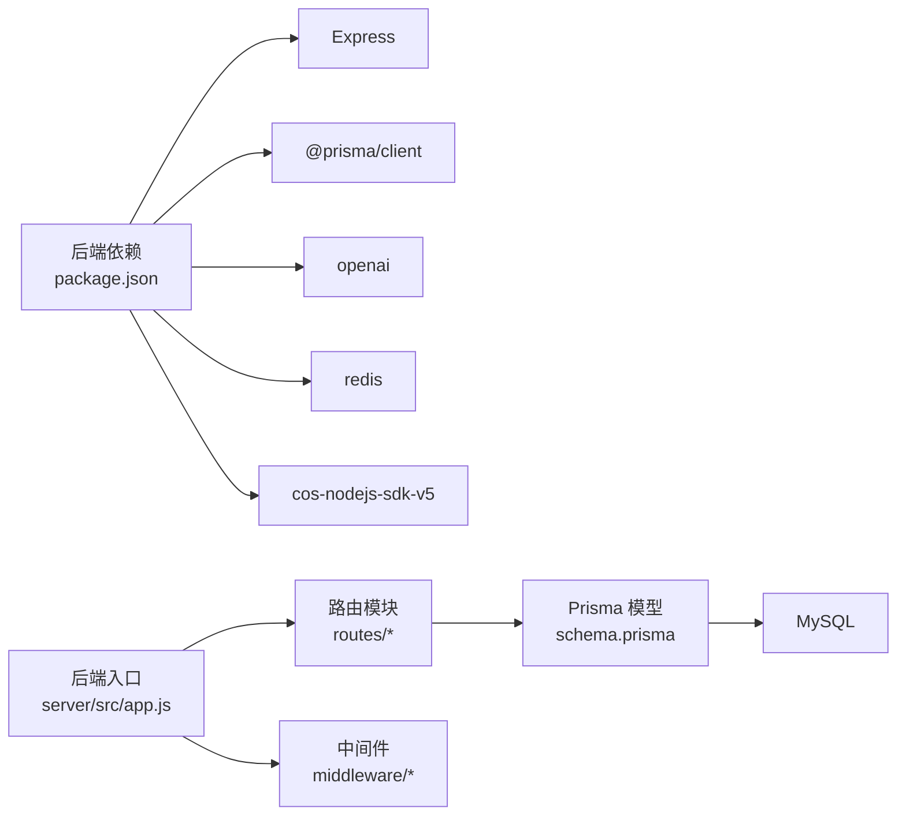

# 项目介绍

<cite>
**本文引用的文件**
- [app.js](file://miniprogram/app.js)
- [app.json](file://miniprogram/app.json)
- [index.js](file://miniprogram/pages/home/index.js)
- [request.js](file://miniprogram/utils/request.js)
- [ageCalculator.js](file://miniprogram/utils/ageCalculator.js)
- [chat.js](file://server/src/routes/chat.js)
- [knowledge.js](file://server/src/routes/knowledge.js)
- [schema.prisma](file://server/prisma/schema.prisma)
- [package.json](file://server/package.json)
- [app.js](file://server/src/app.js)
</cite>

## 目录
1. [引言](#引言)
2. [项目结构](#项目结构)
3. [核心组件](#核心组件)
4. [架构总览](#架构总览)
5. [详细组件分析](#详细组件分析)
6. [依赖关系分析](#依赖关系分析)
7. [性能考虑](#性能考虑)
8. [故障排查指南](#故障排查指南)
9. [结论](#结论)
10. [附录](#附录)

## 引言
安心育儿是一个面向新手父母的智能育儿助手小程序与后端服务一体化项目。其核心使命是通过智能AI技术与科学育儿知识体系，为用户提供“可信赖、可触达、可持续”的成长陪伴体验。项目愿景是成为每位家庭的“数字育儿顾问”，在宝宝成长的关键节点提供及时、准确、个性化的支持。

项目围绕四大支柱能力构建：
- 智能聊天助手：基于AI对话能力，提供育儿问答与经验分享。
- 宝宝成长记录：覆盖喂养、睡眠、疫苗、里程碑、照片等多维度记录与可视化报告。
- 知识百科系统：按月龄组织的权威育儿知识，支持检索与收藏。
- 个人中心与引导流程：完善用户与宝宝信息管理，确保首次使用的顺畅体验。

通过统一的前后端交互协议、完善的鉴权与限流机制、以及可扩展的数据模型，项目在保证易用性的同时，兼顾安全性与可维护性。

## 项目结构
项目采用“小程序前端 + Node.js 后端 + MySQL 数据库”的三层架构，配合 Prisma ORM 管理数据模型与迁移。

- 小程序前端（miniprogram）
  - 应用入口与全局状态管理
  - 页面与组件：首页、百科、宝宝、AI助手、我的、引导页
  - 工具模块：网络请求封装、月龄/日龄计算
- 后端服务（server）
  - Express 应用入口与路由注册
  - 路由模块：认证、宝宝档案、成长记录、知识库、AI对话、上传、首页聚合
  - 数据模型：用户、宝宝、成长记录、对话、知识库、收藏等
- 数据层（Prisma + MySQL）
  - 以 schema.prisma 描述实体关系，支持迁移与查询

图表来源
- [app.js:1-69](file://miniprogram/app.js#L1-L69)
- [app.json:1-60](file://miniprogram/app.json#L1-L60)
- [app.js:1-65](file://server/src/app.js#L1-L65)
- [schema.prisma:1-189](file://server/prisma/schema.prisma#L1-L189)

章节来源
- [app.js:1-69](file://miniprogram/app.js#L1-L69)
- [app.json:1-60](file://miniprogram/app.json#L1-L60)
- [app.js:1-65](file://server/src/app.js#L1-L65)
- [schema.prisma:1-189](file://server/prisma/schema.prisma#L1-L189)

## 核心组件
- 登录与鉴权
  - 小程序启动时检查本地存储的登录态；若有效则直接初始化全局数据；否则触发微信登录并调用后端认证接口换取令牌。
  - 请求封装自动注入 Authorization 头，并在 401 时触发自动刷新与重登流程。
- 首页聚合与导航
  - 首页聚合展示宝宝信息、最新成长记录、当月提示与个性化推荐；提供九宫格快捷入口直达各功能模块。
- 成长记录与月龄计算
  - 提供喂养、睡眠、健康、里程碑、照片等记录类型；内置月龄/日龄计算工具，支持友好日期展示。
- 知识百科系统
  - 按 0-12 月龄组织知识条目，支持时间线浏览与按月/板块检索；支持收藏与历史查看。
- AI 助手（Sprint 4 规划）
  - 当前提供对话历史与详情查询接口，SSE 流式响应预留实现位点。

章节来源
- [app.js:10-67](file://miniprogram/app.js#L10-L67)
- [request.js:21-96](file://miniprogram/utils/request.js#L21-L96)
- [index.js:46-113](file://miniprogram/pages/home/index.js#L46-L113)
- [ageCalculator.js:7-85](file://miniprogram/utils/ageCalculator.js#L7-L85)
- [knowledge.js:5-58](file://server/src/routes/knowledge.js#L5-L58)
- [chat.js:5-56](file://server/src/routes/chat.js#L5-L56)

## 架构总览
下图展示了从前端到后端再到数据库的整体交互链路，以及关键中间件与路由的职责划分。

图表来源
- [app.js:35-67](file://miniprogram/app.js#L35-L67)
- [app.js:32-47](file://server/src/app.js#L32-L47)
- [request.js:21-73](file://miniprogram/utils/request.js#L21-L73)

章节来源
- [app.js:10-67](file://miniprogram/app.js#L10-L67)
- [app.js:14-55](file://server/src/app.js#L14-L55)
- [request.js:11-96](file://miniprogram/utils/request.js#L11-L96)

## 详细组件分析

### 组件一：登录与会话管理
- 设计要点
  - 小程序启动即检查本地 token 与过期时间；若有效则恢复全局状态；否则走微信登录流程。
  - 登录成功后写入 token、用户信息与宝宝信息，并根据是否存在宝宝信息决定是否进入引导页。
  - 请求封装统一注入 Authorization，401 时清理本地存储并触发重新登录。
- 关键流程

图表来源
- [app.js:18-67](file://miniprogram/app.js#L18-L67)

章节来源
- [app.js:10-67](file://miniprogram/app.js#L10-L67)
- [request.js:48-86](file://miniprogram/utils/request.js#L48-L86)

### 组件二：首页聚合与导航
- 功能概述
  - 聚合展示宝宝基本信息、最新成长记录、当月提示与个性化推荐。
  - 提供九宫格入口直达成长记录、喂养/睡眠/健康记录、里程碑与照片、成长报告、个人中心等。
  - 支持下拉刷新与推荐内容跳转至知识详情。
- 关键流程

图表来源
- [index.js:46-82](file://miniprogram/pages/home/index.js#L46-L82)
- [request.js:21-73](file://miniprogram/utils/request.js#L21-L73)
- [ageCalculator.js:7-41](file://miniprogram/utils/ageCalculator.js#L7-L41)

章节来源
- [index.js:46-113](file://miniprogram/pages/home/index.js#L46-L113)
- [ageCalculator.js:7-85](file://miniprogram/utils/ageCalculator.js#L7-L85)
- [request.js:21-96](file://miniprogram/utils/request.js#L21-L96)

### 组件三：知识百科系统
- 数据模型
  - 知识条目按月龄与板块组织，支持唯一约束（月龄+板块），便于精准检索。
- 接口能力
  - 时间线：按月龄聚合知识概览。
  - 详情：按月/板块获取具体知识内容。
- 关键流程

图表来源
- [knowledge.js:5-58](file://server/src/routes/knowledge.js#L5-L58)
- [schema.prisma:144-159](file://server/prisma/schema.prisma#L144-L159)

章节来源
- [knowledge.js:5-58](file://server/src/routes/knowledge.js#L5-L58)
- [schema.prisma:144-159](file://server/prisma/schema.prisma#L144-L159)

### 组件四：AI 助手（Sprint 4 规划）
- 当前能力
  - 对话历史查询、详情查询与删除接口可用。
  - SSE 流式响应预留实现位点。
- 关键流程

图表来源
- [chat.js:14-54](file://server/src/routes/chat.js#L14-L54)

章节来源
- [chat.js:5-56](file://server/src/routes/chat.js#L5-L56)

### 组件五：成长记录与月龄计算
- 记录类型
  - 支持成长、喂养、睡眠、里程碑、照片、健康、备注等多类型记录。
- 月龄计算
  - 提供出生日期到参考日期的月龄与日龄计算，输出友好文本与格式化日期。
- 关键流程

图表来源
- [ageCalculator.js:7-41](file://miniprogram/utils/ageCalculator.js#L7-L41)

章节来源
- [ageCalculator.js:7-85](file://miniprogram/utils/ageCalculator.js#L7-L85)
- [schema.prisma:73-104](file://server/prisma/schema.prisma#L73-L104)

## 依赖关系分析
- 技术栈与依赖
  - 前端：基于微信小程序框架，使用统一请求封装与本地存储管理。
  - 后端：Express + Prisma + MySQL；集成 CORS、限流、错误处理中间件。
  - 三方能力：OpenAI SDK（AI 能力预留）、Redis（缓存预留）、COS（对象存储预留）。
- 路由与中间件
  - 全局限流保护 /api/*；
  - 认证中间件保护受保护路由；
  - 错误处理器集中处理异常。

图表来源
- [package.json:14-29](file://server/package.json#L14-L29)
- [app.js:14-55](file://server/src/app.js#L14-L55)
- [schema.prisma:1-12](file://server/prisma/schema.prisma#L1-L12)

章节来源
- [package.json:1-31](file://server/package.json#L1-L31)
- [app.js:14-55](file://server/src/app.js#L14-L55)
- [schema.prisma:1-12](file://server/prisma/schema.prisma#L1-L12)

## 性能考虑
- 前端
  - 使用统一请求封装减少重复逻辑，避免重复加载提示与错误弹窗。
  - 首页聚合接口支持降级：在网络异常时回退使用本地缓存数据，提升稳定性。
- 后端
  - 全局限流策略控制每 IP 每分钟请求数，防止滥用与雪崩。
  - 路由按模块拆分，职责清晰，便于后续引入缓存与异步处理。
- 数据层
  - Prisma 模型定义索引字段（如宝宝与类型组合索引），优化查询性能。
  - 知识库按月龄与板块建立唯一约束，保障检索一致性。

## 故障排查指南
- 登录失败或频繁过期
  - 检查本地 token 与过期时间是否正确写入；确认后端返回的过期时间是否合理。
  - 若出现 401，前端会自动清理本地存储并触发重新登录。
- 网络请求失败
  - 统一错误处理会弹出网络错误提示；检查网络状态与后端健康检查接口。
- 首页数据为空
  - 首页聚合接口支持降级：若接口失败，会尝试读取本地缓存的宝宝信息进行展示。
- 对话历史为空
  - 确认用户已登录且存在对应对话；检查数据库中用户与宝宝关联是否正确。

章节来源
- [request.js:48-86](file://miniprogram/utils/request.js#L48-L86)
- [index.js:62-70](file://miniprogram/pages/home/index.js#L62-L70)
- [chat.js:17-38](file://server/src/routes/chat.js#L17-L38)

## 结论
安心育儿项目以“智能+科学+陪伴”为核心理念，通过小程序与后端服务的协同，构建了从登录鉴权、成长记录、知识百科到 AI 助手的完整闭环。项目具备清晰的模块边界、可扩展的数据模型与稳健的中间件体系，能够满足新手父母在不同阶段的多样化需求。未来随着 AI 对话能力的逐步落地与更多功能模块的完善，项目将持续为家庭育儿提供更智能、更可靠的支持。

## 附录
- 目标用户与使用场景
  - 新手父母：日常记录、成长追踪、知识学习、问题咨询。
  - 爷爷奶奶等照护者：了解育儿知识、参与成长记录。
  - 使用场景：夜间喂奶记录、睡前睡眠统计、疫苗提醒、月度成长报告、AI 问答。
- 市场价值
  - 降低育儿信息获取成本，提升家庭育儿效率与信心。
  - 通过知识与记录沉淀，形成家庭成长档案，具备长期价值。
  - 为后续接入更多 AI 能力与生态服务奠定基础。